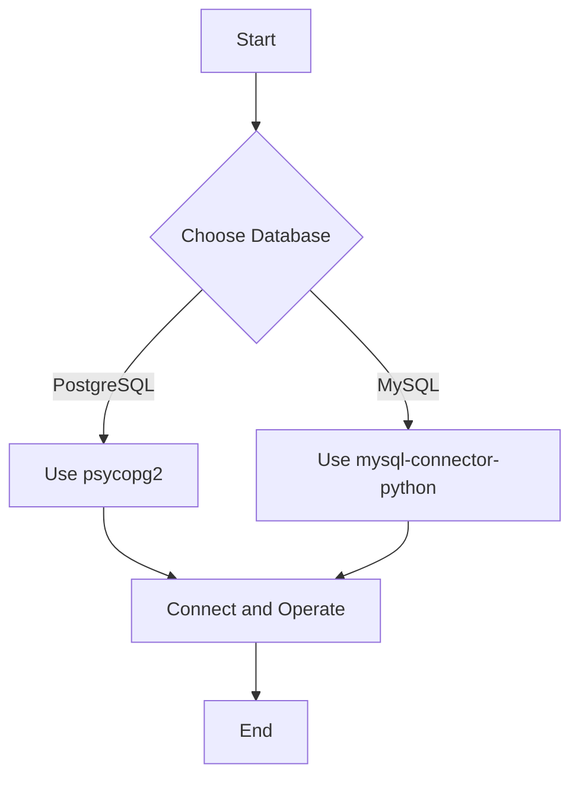

Error: API request failed with error: 401 Client Error: Unauthorized for url: https://openrouter.ai/api/v1/chat/completions

# <span style="color:#e67e22;">What we will learn in this post?</span>
<ul style='list-style-type: none; padding-left: 0;'>
<li><span style='color: #2980b9; font-size: 20px; font-weight: bold;'>👉</span> <span style='color: #2ecc71; font-size: 18px; font-weight: bold;'>Introduction to Database Integration</span></li>
<li><span style='color: #2980b9; font-size: 20px; font-weight: bold;'>👉</span> <span style='color: #2ecc71; font-size: 18px; font-weight: bold;'>SQLite with Python</span></li>
<li><span style='color: #2980b9; font-size: 20px; font-weight: bold;'>👉</span> <span style='color: #2ecc71; font-size: 18px; font-weight: bold;'>Creating Tables and CRUD Operations</span></li>
<li><span style='color: #2980b9; font-size: 20px; font-weight: bold;'>👉</span> <span style='color: #2ecc71; font-size: 18px; font-weight: bold;'>Working with PostgreSQL/MySQL</span></li>
<li><span style='color: #2980b9; font-size: 20px; font-weight: bold;'>👉</span> <span style='color: #2ecc71; font-size: 18px; font-weight: bold;'>SQLAlchemy ORM Basics</span></li>
<li><span style='color: #2980b9; font-size: 20px; font-weight: bold;'>👉</span> <span style='color: #2ecc71; font-size: 18px; font-weight: bold;'>Database Transactions and Context Managers</span></li>
<li><span style='color: #2980b9; font-size: 20px; font-weight: bold;'>👉</span> <span style='color: #2ecc71; font-size: 18px; font-weight: bold;'>MongoDB with Python (pymongo)</span></li>
</ul>

# <span style="color:#e67e22">Introduction to Database Integration in Python</span>

Databases are essential for modern applications. They help store, manage, and retrieve data efficiently. Whether you're building a simple app or a complex system, understanding how to integrate databases with Python is crucial. 

## <span style="color:#2980b9">Why Are Databases Important? 📊</span>

- **Data Storage**: Keep your data safe and organized.
- **Data Retrieval**: Quickly access the information you need.
- **Data Management**: Easily update and manipulate data.

## <span style="color:#2980b9">SQL vs NoSQL Databases ⚖️</span>

- **SQL Databases**: 
  - Structured data with predefined schemas.
  - Use **Structured Query Language (SQL)** for queries.
  - Examples: MySQL, PostgreSQL.

- **NoSQL Databases**: 
  - Flexible data models, ideal for unstructured data.
  - Use various query languages.
  - Examples: MongoDB, Cassandra.

### <span style="color:#8e44ad">Popular Python Database Libraries 🐍</span>

- **SQLite**: Lightweight and built-in with Python.
- **SQLAlchemy**: Powerful ORM for SQL databases.
- **Peewee**: Simple and expressive ORM.
- **PyMongo**: For working with MongoDB.

For more information, check out these resources:
- [SQLAlchemy Documentation](https://www.sqlalchemy.org/)
- [MongoDB Python Driver](https://pymongo.readthedocs.io/)

By mastering database integration in Python, you can build robust applications that handle data like a pro! 🚀

# <span style="color:#e67e22">Understanding the sqlite3 Module</span> 🗄️

SQLite is a lightweight database that's perfect for small applications and development projects. The `sqlite3` module in Python makes it easy to work with SQLite databases. Let’s break it down!

## <span style="color:#2980b9">Creating a Connection</span> 🔗

To start using SQLite, you first need to create a connection to your database. Here’s how:

```python
import sqlite3

# Create a connection to a database (it will create one if it doesn't exist)
connection = sqlite3.connect('my_database.db')
```

## <span style="color:#2980b9">Using Cursors</span> 🖊️

Once you have a connection, you can create a cursor. A cursor allows you to execute SQL commands.

```python
cursor = connection.cursor()
```

## <span style="color:#2980b9">Executing Queries</span> 📜

You can now execute SQL queries using the cursor. For example, to create a table:

```python
cursor.execute('CREATE TABLE IF NOT EXISTS users (id INTEGER PRIMARY KEY, name TEXT)')
```

And to insert data:

```python
cursor.execute('INSERT INTO users (name) VALUES (?)', ('Alice',))
```

### <span style="color:#8e44ad">Why Use SQLite?</span> 🤔

- **Lightweight**: Great for small apps and quick prototypes.
- **No Setup Required**: Just use the `sqlite3` module!
- **File-Based**: Your database is stored in a single file, making it easy to manage.

For more information, check out the [SQLite Documentation](https://www.sqlite.org/docs.html) and the [Python sqlite3 Module](https://docs.python.org/3/library/sqlite3.html).

Happy coding! 🎉

# <span style="color:#e67e22">CRUD Operations with SQL and Python</span> 🐍

## <span style="color:#2980b9">Setting Up Your Database</span> 🗄️

First, let's create a simple SQLite database and a table for our example. We'll use Python's `sqlite3` library.

```python
import sqlite3

# Connect to the database (or create it)
conn = sqlite3.connect('example.db')
cursor = conn.cursor()

# Create a table
cursor.execute('''
CREATE TABLE IF NOT EXISTS users (
    id INTEGER PRIMARY KEY,
    name TEXT NOT NULL,
    age INTEGER NOT NULL
)
''')
conn.commit()
```

## <span style="color:#2980b9">CRUD Operations</span> 🔄

### <span style="color:#8e44ad">Create</span> ✍️

To add a new user:

```python
def create_user(name, age):
    cursor.execute('INSERT INTO users (name, age) VALUES (?, ?)', (name, age))
    conn.commit()
```

### <span style="color:#8e44ad">Read</span> 📖

To fetch all users:

```python
def read_users():
    cursor.execute('SELECT * FROM users')
    return cursor.fetchall()
```

### <span style="color:#8e44ad">Update</span> 🔄

To update a user's age:

```python
def update_user_age(user_id, new_age):
    cursor.execute('UPDATE users SET age = ? WHERE id = ?', (new_age, user_id))
    conn.commit()
```

### <span style="color:#8e44ad">Delete</span> ❌

To delete a user:

```python
def delete_user(user_id):
    cursor.execute('DELETE FROM users WHERE id = ?', (user_id,))
    conn.commit()
```

## <span style="color:#2980b9">Conclusion</span> 🎉

Using parameterized queries (like `?` in our examples) helps prevent SQL injection attacks. For more details, check out [SQLite Documentation](https://www.sqlite.org/docs.html).

Feel free to experiment with these functions! Happy coding! 😊

# <span style="color:#e67e22">Introduction to psycopg2 and mysql-connector-python</span> 🌟

When working with databases in Python, **psycopg2** and **mysql-connector-python** are two popular libraries for connecting to PostgreSQL and MySQL databases, respectively. They allow you to perform various operations like querying, inserting, and updating data easily.

## <span style="color:#2980b9">Connecting to Databases</span> 🔗

### <span style="color:#8e44ad">Connection Strings</span>

To connect to a database, you need a connection string. Here’s how you can do it:

- **PostgreSQL (psycopg2)**:
  ```python
  import psycopg2
  conn = psycopg2.connect(
      dbname="your_db",
      user="your_user",
      password="your_password",
      host="localhost"
  )
  ```

- **MySQL (mysql-connector-python)**:
  ```python
  import mysql.connector
  conn = mysql.connector.connect(
      user="your_user",
      password="your_password",
      host="localhost",
      database="your_db"
  )
  ```

### <span style="color:#8e44ad">Basic Operations</span> 🛠️

Once connected, you can perform operations like:

- **Creating Tables**
- **Inserting Data**
- **Querying Data**
- **Updating Records**

## <span style="color:#2980b9">Differences from SQLite</span> ⚖️

- **Server vs. File-Based**: PostgreSQL and MySQL are server-based, while SQLite is file-based.
- **Concurrency**: PostgreSQL and MySQL handle multiple users better than SQLite.
- **Features**: PostgreSQL offers advanced features like JSONB and full-text search, which SQLite lacks.

For more detailed information, check out the official documentation:
- [psycopg2 Documentation](https://www.psycopg.org/docs/)
- [mysql-connector-python Documentation](https://dev.mysql.com/doc/connector-python/en/)

### Flowchart of Database Connection



With these libraries, you can easily manage your database operations in Python! Happy coding! 🎉

# <span style="color:#e67e22">Introduction to SQLAlchemy</span> 🌟

SQLAlchemy is a powerful **Object-Relational Mapping (ORM)** library for Python. It helps you interact with databases using Python objects instead of writing raw SQL queries. This makes your code cleaner and easier to manage!

## <span style="color:#2980b9">Benefits of Using ORM</span> 🌈

- **Simplifies Database Interaction**: You can use Python classes to represent database tables.
- **Improves Code Readability**: Your code looks more like Python and less like SQL.
- **Easier Maintenance**: Changes in the database schema can be managed in your Python code.

## <span style="color:#2980b9">Creating Models</span> 🏗️

In SQLAlchemy, you define models as classes. Here’s a simple example:

```python
from sqlalchemy import create_engine, Column, Integer, String
from sqlalchemy.ext.declarative import declarative_base

Base = declarative_base()

class User(Base):
    __tablename__ = 'users'
    id = Column(Integer, primary_key=True)
    name = Column(String)

# Create an engine
engine = create_engine('sqlite:///:memory:')
Base.metadata.create_all(engine)
```

### <span style="color:#8e44ad">Sessions</span> 🗂️

Sessions are used to interact with the database. Here’s how to create a session:

```python
from sqlalchemy.orm import sessionmaker

Session = sessionmaker(bind=engine)
session = Session()
```

### <span style="color:#8e44ad">Basic Queries</span> 🔍

You can easily query the database:

```python
# Add a new user
new_user = User(name='Alice')
session.add(new_user)
session.commit()

# Query users
users = session.query(User).all()
for user in users:
    print(user.name)
```

For more information, check out the [SQLAlchemy Documentation](https://docs.sqlalchemy.org/en/14/).

---

This friendly introduction should help you get started with SQLAlchemy and appreciate the power of ORM! Happy coding! 😊

# <span style="color:#e67e22">Understanding Database Transactions</span> 🗄️

Database transactions are like a set of instructions that you want to execute together. If something goes wrong, you can undo everything to keep your data safe. This is where the **ACID properties** come in!

## <span style="color:#2980b9">What are ACID Properties? 🔍</span>

ACID stands for:

- **Atomicity**: All or nothing! If one part fails, the whole transaction fails.
- **Consistency**: The database stays in a valid state before and after the transaction.
- **Isolation**: Transactions don’t interfere with each other.
- **Durability**: Once a transaction is committed, it stays saved even if the system crashes.

### <span style="color:#8e44ad">Commit and Rollback Operations 🔄</span>

- **Commit**: This saves all changes made during the transaction.
- **Rollback**: This undoes changes if something goes wrong.

### <span style="color:#8e44ad">Using Context Managers for Connections 🌐</span>

In Python, you can use context managers to handle database connections easily. Here’s a simple example:

```python
import sqlite3

with sqlite3.connect('example.db') as conn:
    cursor = conn.cursor()
    cursor.execute("INSERT INTO users (name) VALUES ('Alice')")
    # If something goes wrong, changes are rolled back automatically!
```

This way, you don’t have to worry about closing the connection manually. 

For more details, check out [W3Schools on SQL Transactions](https://www.w3schools.com/sql/sql_transactions.asp).

---

Feel free to ask if you have more questions! 😊

# <span style="color:#e67e22">Introduction to MongoDB 🌟</span>

MongoDB is a popular **NoSQL database** that stores data in a flexible, JSON-like format called **BSON**. Unlike traditional SQL databases, MongoDB allows you to work with unstructured data, making it perfect for modern applications that require scalability and speed.

## <span style="color:#2980b9">Getting Started with PyMongo 🐍</span>

To connect to MongoDB using Python, we use the **PyMongo** library. It provides an easy way to interact with your MongoDB database. Here’s how to connect:

```python
from pymongo import MongoClient

client = MongoClient("mongodb://localhost:27017/")
db = client['mydatabase']
```

## <span style="color:#2980b9">CRUD Operations 📊</span>

CRUD stands for **Create, Read, Update, and Delete**. Here’s a quick overview:

- **Create**: Add new documents to a collection.
- **Read**: Retrieve documents from a collection.
- **Update**: Modify existing documents.
- **Delete**: Remove documents from a collection.

### <span style="color:#8e44ad">Example of CRUD Operations</span>

```python
# Create
db.mycollection.insert_one({"name": "Alice", "age": 25})

# Read
person = db.mycollection.find_one({"name": "Alice"})

# Update
db.mycollection.update_one({"name": "Alice"}, {"$set": {"age": 26}})

# Delete
db.mycollection.delete_one({"name": "Alice"})
```

## <span style="color:#2980b9">When to Choose MongoDB Over SQL? 🤔</span>

- **Flexible Schema**: Great for evolving data structures.
- **Scalability**: Handles large volumes of data effortlessly.
- **High Performance**: Fast read and write operations.

For more information, check out the [MongoDB Documentation](https://docs.mongodb.com/) and [PyMongo Documentation](https://pymongo.readthedocs.io/en/stable/).

---

Feel free to explore MongoDB and see how it can fit your project needs! Happy coding! 🎉

