<!--
meta-description: "Learn database integration in Python with SQLite, PostgreSQL, MySQL, SQLAlchemy ORM, and MongoDB. Master CRUD operations, transactions, and best practices for robust data management."
keywords: "Python database, SQLite Python, PostgreSQL Python, MySQL Python, SQLAlchemy ORM, pymongo MongoDB, psycopg2, mysql-connector-python, CRUD operations, database transactions, Python data management"
-->

# <span style="color:#e67e22;">What we will learn in this post?</span>
<ul style='list-style-type: none; padding-left: 0;'>
<li><span style='color: #2980b9; font-size: 20px; font-weight: bold;'>👉</span> <span style='color: #2ecc71; font-size: 18px; font-weight: bold;'>Introduction to Database Integration</span></li>
<li><span style='color: #2980b9; font-size: 20px; font-weight: bold;'>👉</span> <span style='color: #2ecc71; font-size: 18px; font-weight: bold;'>SQLite with Python</span></li>
<li><span style='color: #2980b9; font-size: 20px; font-weight: bold;'>👉</span> <span style='color: #2ecc71; font-size: 18px; font-weight: bold;'>Creating Tables and CRUD Operations</span></li>
<li><span style='color: #2980b9; font-size: 20px; font-weight: bold;'>👉</span> <span style='color: #2ecc71; font-size: 18px; font-weight: bold;'>Working with PostgreSQL/MySQL</span></li>
<li><span style='color: #2980b9; font-size: 20px; font-weight: bold;'>👉</span> <span style='color: #2ecc71; font-size: 18px; font-weight: bold;'>SQLAlchemy ORM Basics</span></li>
<li><span style='color: #2980b9; font-size: 20px; font-weight: bold;'>👉</span> <span style='color: #2ecc71; font-size: 18px; font-weight: bold;'>Database Transactions and Context Managers</span></li>
<li><span style='color: #2980b9; font-size: 20px; font-weight: bold;'>👉</span> <span style='color: #2ecc71; font-size: 18px; font-weight: bold;'>MongoDB with Python (pymongo)</span></li>
</ul>

# <span style="color:#e67e22">Introduction to Database Integration in Python</span>

Databases are essential for modern applications. They help store, manage, and retrieve data efficiently. Whether you're building a simple app or a complex system, understanding how to integrate databases with Python is crucial. 

## <span style="color:#2980b9">Why Are Databases Important? 📊</span>

- **Data Storage**: Keep your data safe and organized.
- **Data Retrieval**: Quickly access the information you need.
- **Data Management**: Easily update and manipulate data.

## <span style="color:#2980b9">SQL vs NoSQL Databases ⚖️</span>

- **SQL Databases**: 
  - Structured data with predefined schemas.
  - Use **Structured Query Language (SQL)** for queries.
  - Examples: MySQL, PostgreSQL.

- **NoSQL Databases**: 
  - Flexible data models, ideal for unstructured data.
  - Use various query languages.
  - Examples: MongoDB, Cassandra.

### <span style="color:#8e44ad">Popular Python Database Libraries 🐍</span>

- **SQLite**: Lightweight and built-in with Python.
- **SQLAlchemy**: Powerful ORM for SQL databases.
- **Peewee**: Simple and expressive ORM.
- **PyMongo**: For working with MongoDB.

### <span style="color:#8e44ad">Database Comparison Table 📋</span>

| Feature | SQLite | PostgreSQL | MySQL | MongoDB |
|---------|--------|------------|-------|---------|
| **Type** | SQL (Embedded) | SQL (Server) | SQL (Server) | NoSQL (Document) |
| **Setup** | ✅ None (built-in) | ❌ Server required | ❌ Server required | ❌ Server required |
| **Best For** | Small apps, prototypes | Complex queries, large data | Web applications | Flexible schemas, big data |
| **ACID** | ✅ Yes | ✅ Yes | ✅ Yes (InnoDB) | ⚠️ Partial |
| **Scalability** | ⚠️ Limited | ✅ Excellent | ✅ Good | ✅ Excellent (horizontal) |
| **Python Library** | `sqlite3` | `psycopg2` | `mysql-connector-python` | `pymongo` |
| **Query Language** | SQL | SQL | SQL | MQL (MongoDB Query Language) |
| **Schema** | Fixed | Fixed | Fixed | Flexible |
| **Transactions** | ✅ Yes | ✅ Advanced | ✅ Yes | ✅ Yes (v4.0+) |
| **Use Case** | Mobile apps, testing | Enterprise apps, analytics | WordPress, e-commerce | Real-time apps, IoT |

By mastering database integration in Python, you can build robust applications that handle data like a pro! 🚀

# <span style="color:#e67e22">Understanding the sqlite3 Module</span> 🗄️

SQLite is a lightweight database that's perfect for small applications and development projects. The `sqlite3` module in Python makes it easy to work with SQLite databases. Let’s break it down!

## <span style="color:#2980b9">Creating a Connection</span> 🔗

To start using SQLite, you first need to create a connection to your database. Here’s how:

```python
import sqlite3

# Create a connection to a database (it will create one if it doesn't exist)
connection = sqlite3.connect('my_database.db')
```

## <span style="color:#2980b9">Using Cursors</span> 🖊️

Once you have a connection, you can create a cursor. A cursor allows you to execute SQL commands.

```python
cursor = connection.cursor()
```

## <span style="color:#2980b9">Executing Queries</span> 📜

You can now execute SQL queries using the cursor. For example, to create a table:

```python
cursor.execute('CREATE TABLE IF NOT EXISTS users (id INTEGER PRIMARY KEY, name TEXT)')
```

And to insert data:

```python
cursor.execute('INSERT INTO users (name) VALUES (?)', ('Alice',))
```

### <span style="color:#8e44ad">Why Use SQLite?</span> 🤔

- **Lightweight**: Great for small apps and quick prototypes.
- **No Setup Required**: Just use the `sqlite3` module!
- **File-Based**: Your database is stored in a single file, making it easy to manage.

# <span style="color:#e67e22">CRUD Operations with SQL and Python</span> 🐍

## <span style="color:#2980b9">Setting Up Your Database</span> 🗄️

First, let's create a simple SQLite database and a table for our example. We'll use Python's `sqlite3` library.

```python
import sqlite3

# Connect to the database (or create it)
conn = sqlite3.connect('example.db')
cursor = conn.cursor()

# Create a table
cursor.execute('''
CREATE TABLE IF NOT EXISTS users (
    id INTEGER PRIMARY KEY,
    name TEXT NOT NULL,
    age INTEGER NOT NULL
)
''')
conn.commit()
```

## <span style="color:#2980b9">CRUD Operations</span> 🔄



### <span style="color:#8e44ad">Create</span> ✍️

```mermaid
graph LR
    A["🎯 Application"]:::style1 --> B{"🔄 CRUD Operation"}:::style3
    B -->|Create| C["➕ INSERT INTO"]:::style2
    B -->|Read| D["📖 SELECT FROM"]:::style4
    B -->|Update| E["🔄 UPDATE SET"]:::style5
    B -->|Delete| F["❌ DELETE FROM"]:::style6
    C --> G["💾 Database"]:::style7
    D --> G
    E --> G
    F --> G
    G --> H["✅ Result"]:::style8

    classDef style1 fill:#ff4f81,stroke:#c43e3e,color:#fff,font-size:16px,stroke-width:3px,rx:14,shadow:6px;
    classDef style2 fill:#43e97b,stroke:#38f9d7,color:#fff,font-size:16px,stroke-width:3px,rx:14,shadow:6px;
    classDef style3 fill:#ffd700,stroke:#d99120,color:#222,font-size:16px,stroke-width:3px,rx:14,shadow:6px;
    classDef style4 fill:#00bfae,stroke:#005f99,color:#fff,font-size:16px,stroke-width:3px,rx:14,shadow:6px;
    classDef style5 fill:#6b5bff,stroke:#4a3f6b,color:#fff,font-size:16px,stroke-width:3px,rx:14,shadow:6px;
    classDef style6 fill:#ff9800,stroke:#f57c00,color:#fff,font-size:16px,stroke-width:3px,rx:14,shadow:6px;
    classDef style7 fill:#9e9e9e,stroke:#616161,color:#fff,font-size:16px,stroke-width:3px,rx:14,shadow:6px;
    classDef style8 fill:#43e97b,stroke:#38f9d7,color:#fff,font-size:16px,stroke-width:3px,rx:14,shadow:6px;

    linkStyle default stroke:#e67e22,stroke-width:3px;
```

To add a new user:

```python
def create_user(name, age):
    cursor.execute('INSERT INTO users (name, age) VALUES (?, ?)', (name, age))
    conn.commit()
```

### <span style="color:#8e44ad">Read</span> 📖

To fetch all users:

```python
def read_users():
    cursor.execute('SELECT * FROM users')
    return cursor.fetchall()
```

### <span style="color:#8e44ad">Update</span> 🔄

To update a user's age:

```python
def update_user_age(user_id, new_age):
    cursor.execute('UPDATE users SET age = ? WHERE id = ?', (new_age, user_id))
    conn.commit()
```

### <span style="color:#8e44ad">Delete</span> ❌

To delete a user:

```python
def delete_user(user_id):
    cursor.execute('DELETE FROM users WHERE id = ?', (user_id,))
    conn.commit()
```

## <span style="color:#2980b9">Conclusion</span> 🎉

Using parameterized queries (like `?` in our examples) helps prevent SQL injection attacks.

Feel free to experiment with these functions! Happy coding! 😊

# <span style="color:#e67e22">Introduction to psycopg2 and mysql-connector-python</span> 🌟

When working with databases in Python, **psycopg2** and **mysql-connector-python** are two popular libraries for connecting to PostgreSQL and MySQL databases, respectively. They allow you to perform various operations like querying, inserting, and updating data easily.

## <span style="color:#2980b9">Connecting to Databases</span> 🔗

### <span style="color:#8e44ad">Connection Strings</span>

To connect to a database, you need a connection string. Here’s how you can do it:

- **PostgreSQL (psycopg2)**:
  ```python
  import psycopg2
  conn = psycopg2.connect(
      dbname="your_db",
      user="your_user",
      password="your_password",
      host="localhost"
  )
  ```

- **MySQL (mysql-connector-python)**:
  ```python
  import mysql.connector
  conn = mysql.connector.connect(
      user="your_user",
      password="your_password",
      host="localhost",
      database="your_db"
  )
  ```

### <span style="color:#8e44ad">Basic Operations</span> 🛠️

Once connected, you can perform operations like:

- **Creating Tables**
- **Inserting Data**
- **Querying Data**
- **Updating Records**

## <span style="color:#2980b9">Differences from SQLite</span> ⚖️

- **Server vs. File-Based**: PostgreSQL and MySQL are server-based, while SQLite is file-based.
- **Concurrency**: PostgreSQL and MySQL handle multiple users better than SQLite.
- **Features**: PostgreSQL offers advanced features like JSONB and full-text search, which SQLite lacks.

### Flowchart of Database Connection

```mermaid
flowchart TD
    A["🎯 Start"]:::style1 --> B{"📊 Choose Database"}:::style3
    B -->|PostgreSQL| C["🐘 Use psycopg2"]:::style2
    B -->|MySQL| D["🐬 Use mysql-connector"]:::style4
    C --> E["⚡ Connect & Operate"]:::style5
    D --> E
    E --> F["✅ End"]:::style6

    classDef style1 fill:#ff4f81,stroke:#c43e3e,color:#fff,font-size:16px,stroke-width:3px,rx:14,shadow:6px;
    classDef style2 fill:#6b5bff,stroke:#4a3f6b,color:#fff,font-size:16px,stroke-width:3px,rx:14,shadow:6px;
    classDef style3 fill:#ffd700,stroke:#d99120,color:#222,font-size:16px,stroke-width:3px,rx:14,shadow:6px;
    classDef style4 fill:#00bfae,stroke:#005f99,color:#fff,font-size:16px,stroke-width:3px,rx:14,shadow:6px;
    classDef style5 fill:#43e97b,stroke:#38f9d7,color:#fff,font-size:16px,stroke-width:3px,rx:14,shadow:6px;
    classDef style6 fill:#ff9800,stroke:#f57c00,color:#fff,font-size:16px,stroke-width:3px,rx:14,shadow:6px;

    linkStyle default stroke:#e67e22,stroke-width:3px;
```



With these libraries, you can easily manage your database operations in Python! Happy coding! 🎉

# <span style="color:#e67e22">Introduction to SQLAlchemy</span> 🌟

SQLAlchemy is a powerful **Object-Relational Mapping (ORM)** library for Python. It helps you interact with databases using Python objects instead of writing raw SQL queries. This makes your code cleaner and easier to manage!

## <span style="color:#2980b9">Benefits of Using ORM</span> 🌈

- **Simplifies Database Interaction**: You can use Python classes to represent database tables.
- **Improves Code Readability**: Your code looks more like Python and less like SQL.
- **Easier Maintenance**: Changes in the database schema can be managed in your Python code.

```mermaid
graph TB
    A["🐍 Python Class<br/>(Model)"]:::style1 --> B["⚙️ SQLAlchemy ORM"]:::style2
    B --> C["🔄 Generate SQL"]:::style3
    C --> D["💾 Database<br/>(Tables)"]:::style4
    D --> E["📊 Query Results"]:::style5
    E --> B
    B --> F["📦 Python Objects"]:::style1
    F --> G["✨ Application Logic"]:::style6

    classDef style1 fill:#ff4f81,stroke:#c43e3e,color:#fff,font-size:16px,stroke-width:3px,rx:14,shadow:6px;
    classDef style2 fill:#6b5bff,stroke:#4a3f6b,color:#fff,font-size:16px,stroke-width:3px,rx:14,shadow:6px;
    classDef style3 fill:#ffd700,stroke:#d99120,color:#222,font-size:16px,stroke-width:3px,rx:14,shadow:6px;
    classDef style4 fill:#9e9e9e,stroke:#616161,color:#fff,font-size:16px,stroke-width:3px,rx:14,shadow:6px;
    classDef style5 fill:#00bfae,stroke:#005f99,color:#fff,font-size:16px,stroke-width:3px,rx:14,shadow:6px;
    classDef style6 fill:#43e97b,stroke:#38f9d7,color:#fff,font-size:16px,stroke-width:3px,rx:14,shadow:6px;

    linkStyle default stroke:#e67e22,stroke-width:3px;
```

### <span style="color:#8e44ad">ORM Workflow Visualization</span> 🔄



## <span style="color:#2980b9">Creating Models</span> 🏗️

In SQLAlchemy, you define models as classes. Here’s a simple example:

```python
from sqlalchemy import create_engine, Column, Integer, String
from sqlalchemy.ext.declarative import declarative_base

Base = declarative_base()

class User(Base):
    __tablename__ = 'users'
    id = Column(Integer, primary_key=True)
    name = Column(String)

# Create an engine
engine = create_engine('sqlite:///:memory:')
Base.metadata.create_all(engine)
```

### <span style="color:#8e44ad">Sessions</span> 🗂️

Sessions are used to interact with the database. Here’s how to create a session:

```python
from sqlalchemy.orm import sessionmaker

Session = sessionmaker(bind=engine)
session = Session()
```

### <span style="color:#8e44ad">Basic Queries</span> 🔍

You can easily query the database:

```python
# Add a new user
new_user = User(name='Alice')
session.add(new_user)
session.commit()

# Query users
users = session.query(User).all()
for user in users:
    print(user.name)
```
---

This friendly introduction should help you get started with SQLAlchemy and appreciate the power of ORM! Happy coding! 😊

# <span style="color:#e67e22">Understanding Database Transactions</span> 🗄️

Database transactions are like a set of instructions that you want to execute together. If something goes wrong, you can undo everything to keep your data safe. This is where the **ACID properties** come in!

## <span style="color:#2980b9">What are ACID Properties? 🔍</span>

ACID stands for:

- **Atomicity**: All or nothing! If one part fails, the whole transaction fails.
- **Consistency**: The database stays in a valid state before and after the transaction.
- **Isolation**: Transactions don’t interfere with each other.
- **Durability**: Once a transaction is committed, it stays saved even if the system crashes.

```mermaid
graph LR
    A["🎯 Begin<br/>Transaction"]:::style1 --> B["📝 Execute<br/>Operations"]:::style2
    B --> C{"✅ All<br/>Successful?"}:::style3
    C -->|Yes| D["💾 COMMIT<br/>(Save)"]:::style4
    C -->|No| E["↩️ ROLLBACK<br/>(Undo)"]:::style5
    D --> F["✨ Transaction<br/>Complete"]:::style6
    E --> F
    F --> G["🔒 ACID<br/>Guaranteed"]:::style7

    classDef style1 fill:#ff4f81,stroke:#c43e3e,color:#fff,font-size:16px,stroke-width:3px,rx:14,shadow:6px;
    classDef style2 fill:#6b5bff,stroke:#4a3f6b,color:#fff,font-size:16px,stroke-width:3px,rx:14,shadow:6px;
    classDef style3 fill:#ffd700,stroke:#d99120,color:#222,font-size:16px,stroke-width:3px,rx:14,shadow:6px;
    classDef style4 fill:#43e97b,stroke:#38f9d7,color:#fff,font-size:16px,stroke-width:3px,rx:14,shadow:6px;
    classDef style5 fill:#ff9800,stroke:#f57c00,color:#fff,font-size:16px,stroke-width:3px,rx:14,shadow:6px;
    classDef style6 fill:#00bfae,stroke:#005f99,color:#fff,font-size:16px,stroke-width:3px,rx:14,shadow:6px;
    classDef style7 fill:#9e9e9e,stroke:#616161,color:#fff,font-size:16px,stroke-width:3px,rx:14,shadow:6px;

    linkStyle default stroke:#e67e22,stroke-width:3px;
```

### <span style="color:#8e44ad">Transaction Lifecycle</span> 🔄


### <span style="color:#8e44ad">Commit and Rollback Operations 🔄</span>

- **Commit**: This saves all changes made during the transaction.
- **Rollback**: This undoes changes if something goes wrong.

### <span style="color:#8e44ad">Using Context Managers for Connections 🌐</span>

In Python, you can use context managers to handle database connections easily. Here’s a simple example:

```python
import sqlite3

with sqlite3.connect('example.db') as conn:
    cursor = conn.cursor()
    cursor.execute("INSERT INTO users (name) VALUES ('Alice')")
    # If something goes wrong, changes are rolled back automatically!
```

This way, you don’t have to worry about closing the connection manually. 

---

Feel free to ask if you have more questions! 😊

# <span style="color:#e67e22">Introduction to MongoDB 🌟</span>

MongoDB is a popular **NoSQL database** that stores data in a flexible, JSON-like format called **BSON**. Unlike traditional SQL databases, MongoDB allows you to work with unstructured data, making it perfect for modern applications that require scalability and speed.

## <span style="color:#2980b9">Getting Started with PyMongo 🐍</span>

To connect to MongoDB using Python, we use the **PyMongo** library. It provides an easy way to interact with your MongoDB database. Here’s how to connect:

```python
from pymongo import MongoClient

client = MongoClient("mongodb://localhost:27017/")
db = client['mydatabase']
```

## <span style="color:#2980b9">CRUD Operations 📊</span>

CRUD stands for **Create, Read, Update, and Delete**. Here’s a quick overview:

- **Create**: Add new documents to a collection.
- **Read**: Retrieve documents from a collection.
- **Update**: Modify existing documents.
- **Delete**: Remove documents from a collection.

### <span style="color:#8e44ad">Example of CRUD Operations</span>

```python
# Create
db.mycollection.insert_one({"name": "Alice", "age": 25})

# Read
person = db.mycollection.find_one({"name": "Alice"})

# Update
db.mycollection.update_one({"name": "Alice"}, {"$set": {"age": 26}})

# Delete
db.mycollection.delete_one({"name": "Alice"})
```

## <span style="color:#2980b9">When to Choose MongoDB Over SQL? 🤔</span>

- **Flexible Schema**: Great for evolving data structures.
- **Scalability**: Handles large volumes of data effortlessly.
- **High Performance**: Fast read and write operations.

---

<details style='border: 2px solid #6b5bff; border-radius: 8px; padding: 20px; background: linear-gradient(135deg, #ede9ff 0%, #fff 100%); margin: 25px 0; box-shadow: 0 6px 12px rgba(107, 91, 255, 0.15);'>
<summary style='cursor: pointer; font-size: 1.3em; font-weight: bold; color: #6b5bff; padding: 10px 0;'>
🎯 Hands-On Assignment: Build a Student Grade Management System 🚀
</summary>

<div style='margin-top: 20px; color: #2c3e50; line-height: 1.6;'>

<h3 style='color: #6b5bff; border-bottom: 2px solid #6b5bff; padding-bottom: 8px; margin-top: 20px;'>📝 Your Mission</h3>

Build a complete student grade management system using SQLite that can store student information, manage course grades, and generate reports.

<h3 style='color: #6b5bff; border-bottom: 2px solid #6b5bff; padding-bottom: 8px; margin-top: 20px;'>🎯 Requirements</h3>

<ol style='margin-left: 20px;'>
<li>Create two tables: <code>students</code> and <code>grades</code>:
  <ul style='margin-left: 20px; margin-top: 8px;'>
    <li><code>students</code>: id, name, email, enrollment_date</li>
    <li><code>grades</code>: id, student_id, course_name, grade, semester</li>
  </ul>
</li>
<li>Implement CRUD operations:
  <ul style='margin-left: 20px; margin-top: 8px;'>
    <li>Add new students and grades</li>
    <li>Query students by name or email</li>
    <li>Update grades for specific courses</li>
    <li>Delete student records with all associated grades</li>
  </ul>
</li>
<li>Use <code>context managers</code> for all database connections</li>
<li>Implement proper error handling with <code>try-except</code> blocks</li>
<li>Use parameterized queries to prevent SQL injection</li>
</ol>

<h3 style='color: #6b5bff; border-bottom: 2px solid #6b5bff; padding-bottom: 8px; margin-top: 25px;'>💡 Implementation Hints</h3>

<ol style='margin-left: 20px;'>
<li>Use <code>CREATE TABLE IF NOT EXISTS</code> to safely create tables</li>
<li>Implement <code>foreign key constraints</code> to link students and grades tables</li>
<li>Create a <code>get_student_gpa()</code> function to calculate average grades</li>
<li>Use <code>JOIN</code> queries to fetch student data with their grades</li>
<li>Implement a <code>generate_report()</code> function to display all students and their averages</li>
</ol>

<h3 style='color: #6b5bff; border-bottom: 2px solid #6b5bff; padding-bottom: 8px; margin-top: 25px;'>🚀 Example Input/Output</h3>

<pre style='background: #2c3e50; color: #ecf0f1; padding: 20px; border-radius: 8px; overflow-x: auto; margin: 15px 0;'><code class='language-python'># Example usage
add_student("Alice Smith", "alice@example.com")
add_grade(1, "Python Programming", 95, "Fall 2025")
add_grade(1, "Database Systems", 88, "Fall 2025")

print(get_student_gpa(1))
# Output: 91.5

generate_report()
# Output:
# Student: Alice Smith (alice@example.com)
# Courses: Python Programming (95), Database Systems (88)
# GPA: 91.5
</code></pre>

<h3 style='color: #6b5bff; border-bottom: 2px solid #6b5bff; padding-bottom: 8px; margin-top: 25px;'>🏆 Bonus Challenges</h3>

<ul style='margin-left: 20px;'>
<li><strong>Level 2</strong>: Add a function to find the top 3 students by GPA</li>
<li><strong>Level 3</strong>: Implement database migration to add a new <code>major</code> column to students table</li>
<li><strong>Level 4</strong>: Convert the system to use SQLAlchemy ORM instead of raw SQL</li>
<li><strong>Level 5</strong>: Add support for PostgreSQL with environment-based configuration</li>
</ul>

<h3 style='color: #6b5bff; border-bottom: 2px solid #6b5bff; padding-bottom: 8px; margin-top: 25px;'>📚 Learning Goals</h3>

<ul style='margin-left: 20px;'>
<li>Master SQLite database operations in Python 🎯</li>
<li>Understand table relationships and foreign keys ✨</li>
<li>Implement secure database queries with parameterization 🔄</li>
<li>Practice context managers for resource management 🔗</li>
<li>Build real-world data management systems 🛠️</li>
</ul>

<p style='background: #3498db; color: #fff; padding: 15px; border-radius: 8px; margin-top: 20px; border-left: 5px solid #2980b9;'>
<strong>💡 Pro Tip:</strong> This pattern is used in educational platforms like Canvas and Moodle for managing student data at scale!
</p>

<p style='margin-top: 20px; font-size: 1.1em;'><strong>Share Your Solution! 💬</strong></p>
<p>Completed the project? <strong>Post your code in the comments below!</strong> Show us your Python database mastery! 🚀✨</p>

</div>
</details>

---

Feel free to explore MongoDB and see how it can fit your project needs! Happy coding! 🎉

# <span style="color:#e67e22">Conclusion</span> 🎯

Database integration is a fundamental skill for any Python developer building real-world applications. Whether you choose SQL databases like SQLite, PostgreSQL, and MySQL for structured data, or NoSQL solutions like MongoDB for flexible schemas, Python provides robust libraries and tools to handle all your data management needs efficiently and securely.

