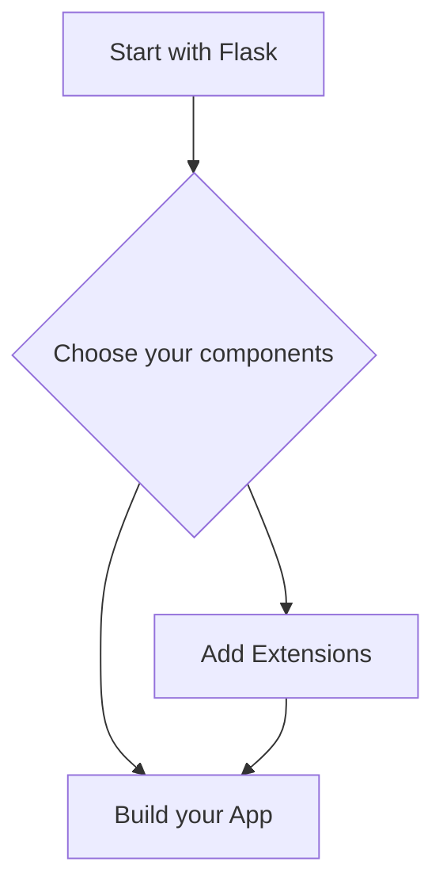
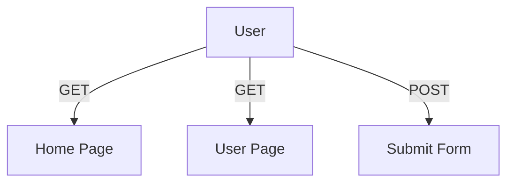
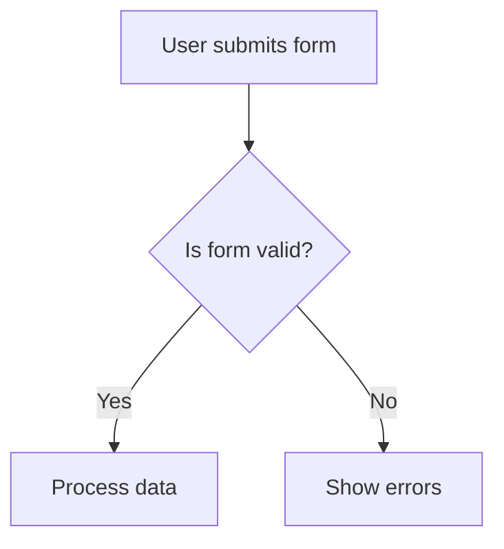
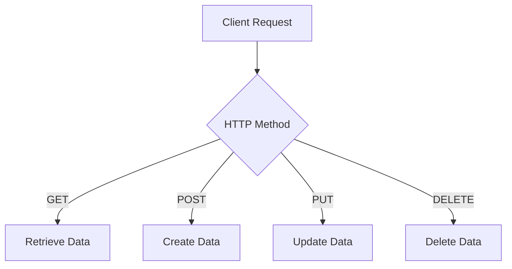

Error: API request failed with error: 401 Client Error: Unauthorized for url: https://openrouter.ai/api/v1/chat/completions

# <span style="color:#e67e22;">What we will learn in this post?</span>
<ul style='list-style-type: none; padding-left: 0;'>
<li><span style='color: #2980b9; font-size: 20px; font-weight: bold;'>👉</span> <span style='color: #2ecc71; font-size: 18px; font-weight: bold;'>Introduction to Flask</span></li>
<li><span style='color: #2980b9; font-size: 20px; font-weight: bold;'>👉</span> <span style='color: #2ecc71; font-size: 18px; font-weight: bold;'>Setting Up Flask and First Application</span></li>
<li><span style='color: #2980b9; font-size: 20px; font-weight: bold;'>👉</span> <span style='color: #2ecc71; font-size: 18px; font-weight: bold;'>Routing and URL Building</span></li>
<li><span style='color: #2980b9; font-size: 20px; font-weight: bold;'>👉</span> <span style='color: #2ecc71; font-size: 18px; font-weight: bold;'>Templates with Jinja2</span></li>
<li><span style='color: #2980b9; font-size: 20px; font-weight: bold;'>👉</span> <span style='color: #2ecc71; font-size: 18px; font-weight: bold;'>Handling Forms and User Input</span></li>
<li><span style='color: #2980b9; font-size: 20px; font-weight: bold;'>👉</span> <span style='color: #2ecc71; font-size: 18px; font-weight: bold;'>Flask and Databases</span></li>
<li><span style='color: #2980b9; font-size: 20px; font-weight: bold;'>👉</span> <span style='color: #2ecc71; font-size: 18px; font-weight: bold;'>Flask REST APIs</span></li>
</ul>

# <span style="color:#e67e22">Introduction to Flask</span> 🌐

Flask is a **lightweight web framework** for Python that makes building web applications easy and fun! It follows the **micro-framework** philosophy, meaning it provides the essentials without unnecessary features. This allows developers to add only what they need, keeping applications simple and efficient.

## <span style="color:#2980b9">Flask vs. Django</span> ⚖️

- **Flask**:
  - Lightweight and flexible
  - Great for small to medium projects
  - Easy to learn and use
  - Ideal for microservices

- **Django**:
  - Full-featured framework
  - Best for large applications
  - Comes with built-in features like admin panels and ORM

### <span style="color:#8e44ad">When to Choose Flask</span> 🤔

- You want **quick development** for small projects.
- You prefer **flexibility** and control over components.
- You need a **simple API** or microservice.

Flask is also highly **extensible**! You can easily add libraries and tools to enhance your application. 

For more information, check out the [Flask Documentation](https://flask.palletsprojects.com/).



With Flask, you can create powerful web applications while keeping things simple and enjoyable! Happy coding! 🎉

# <span style="color:#e67e22">Getting Started with Flask! 🚀</span>

## <span style="color:#2980b9">Installing Flask</span>

To start, you need to install Flask. Open your terminal and run:

```bash
pip install Flask
```

## <span style="color:#2980b9">Creating a Minimal Flask Application</span>

Now, let’s create a simple "Hello World" app! Create a file named `app.py` and add the following code:

```python
from flask import Flask

app = Flask(__name__)

@app.route('/')
def hello():
    return 'Hello, World!'

if __name__ == '__main__':
    app.run(debug=True)
```

### <span style="color:#8e44ad">Understanding the Code</span>

- **`Flask(__name__)`**: This creates the app object.
- **`@app.route('/')`**: This defines a route for the homepage.
- **`hello()`**: This function returns "Hello, World!" when you visit the homepage.
- **`app.run(debug=True)`**: This runs the server in debug mode.

## <span style="color:#2980b9">Running the Development Server</span>

To run your app, execute:

```bash
python app.py
```

Now, open your browser and go to `http://127.0.0.1:5000/` to see your "Hello, World!" message! 🎉

### <span style="color:#8e44ad">Resources</span>

- [Flask Documentation](https://flask.palletsprojects.com/)
- [Python Installation Guide](https://www.python.org/downloads/)

Happy coding! 😊

# <span style="color:#e67e22">Flask Routing Made Easy! 🚀</span>

Flask is a fantastic web framework for Python, and one of its coolest features is **routing**! Let's break it down.

## <span style="color:#2980b9">What is Routing? 🌐</span>

Routing in Flask helps you connect URLs to functions. You use the `@app.route()` decorator to define a route. Here’s a simple example:

```python
@app.route('/')
def home():
    return "Welcome to my website!"
```

### <span style="color:#8e44ad">Using URL Parameters 📦</span>

You can also capture parts of the URL as parameters. For example:

```python
@app.route('/user/<username>')
def show_user(username):
    return f"Hello, {username}!"
```

### <span style="color:#8e44ad">Variable Rules 🔄</span>

You can define variable rules in your routes:

```python
@app.route('/post/<int:post_id>')
def show_post(post_id):
    return f"Post ID: {post_id}"
```

### <span style="color:#8e44ad">HTTP Methods (GET, POST) 📬</span>

Flask supports different HTTP methods. By default, routes respond to **GET** requests. To handle **POST** requests, you can specify it like this:

```python
@app.route('/submit', methods=['POST'])
def submit():
    return "Form submitted!"
```

### <span style="color:#8e44ad">Using url_for() 🔗</span>

The `url_for()` function helps you build URLs dynamically. For example:

```python
url_for('show_user', username='Alice')
```

This generates the URL `/user/Alice`.

## <span style="color:#2980b9">Wrapping Up 🎁</span>

Flask routing is powerful and flexible! For more details, check out the [Flask Documentation](https://flask.palletsprojects.com/).



Happy coding! 😊

# <span style="color:#e67e22">Introduction to Jinja2 Templating Engine</span> 🎉

Jinja2 is a powerful templating engine for Python, widely used in web frameworks like Flask. It allows you to create dynamic web pages by separating HTML from Python code. Let’s explore its key features!

## <span style="color:#2980b9">Template Syntax</span> 📝

Jinja2 uses a simple syntax to embed Python-like expressions in HTML. Here are some basics:

- **Variables**: Use `{{ variable_name }}` to display variables.
- **Filters**: Modify variables with filters like `{{ name|capitalize }}`.

### <span style="color:#8e44ad">Control Structures</span> 🔄

You can control the flow of your templates using:

- **If Statements**:
  ```jinja
  
    Hello, {{ user }}!
  
    Hello, Guest!
  
  ```

- **For Loops**:
  ```jinja
  <ul>
  
    <li>{{ item }}</li>
  
  </ul>
  ```

## <span style="color:#2980b9">Template Inheritance</span> 🏗️

Jinja2 supports template inheritance, allowing you to create a base template and extend it:

```jinja


  <h1>Welcome!</h1>

```

## <span style="color:#2980b9">Rendering Templates</span> 🚀

To render templates in Flask, use `render_template()`:

```python
from flask import render_template

@app.route('/')
def home():
    return render_template('index.html', user='Alice')
```

For more information, check out the [Jinja2 Documentation](https://jinja.palletsprojects.com/).

Happy templating! 🎊

# <span style="color:#e67e22">Handling Form Data in Flask</span> 😊

Flask makes it easy to handle form data! Let’s explore how to use `request.form`, `request.args`, and `request.json` for different types of data. 

## <span style="color:#2980b9">Getting Data from Forms</span> 📝

When you submit a form, you can access the data in different ways:

- **`request.form`**: Use this for form data sent via POST. It’s great for handling user inputs like text fields.
  
  ```python
  from flask import Flask, request
  
  @app.route('/submit', methods=['POST'])
  def submit():
      name = request.form['name']
      return f"Hello, {name}!"
  ```

- **`request.args`**: This is for data sent via GET requests, like query parameters in the URL.

- **`request.json`**: Use this for JSON data sent in the body of a POST request.

## <span style="color:#2980b9">Form Validation with Flask-WTF</span> ✅

To ensure your forms are filled out correctly, you can use **Flask-WTF**. It simplifies form handling and validation.

### <span style="color:#8e44ad">Basic Steps to Use Flask-WTF</span>:

1. Install Flask-WTF: 
   ```bash
   pip install Flask-WTF
   ```

2. Create a form class with validation rules.

3. Use the form in your route to handle submissions.

### Example Flowchart



For more details, check out the [Flask-WTF documentation](https://flask-wtf.readthedocs.io/en/stable/).

With these tools, handling form data in Flask becomes a breeze! Happy coding! 🎉

# <span style="color:#e67e22">Integrating Databases with Flask using Flask-SQLAlchemy</span> 🚀

Flask-SQLAlchemy makes it easy to work with databases in your Flask app. Let’s dive into how to set it up and perform some basic CRUD operations!

## <span style="color:#2980b9">Setting Up Flask-SQLAlchemy</span> 🛠️

First, install Flask and Flask-SQLAlchemy:

```bash
pip install Flask Flask-SQLAlchemy
```

### <span style="color:#8e44ad">Defining Models</span> 📚

Create a simple model for a `User`:

```python
from flask import Flask
from flask_sqlalchemy import SQLAlchemy

app = Flask(__name__)
app.config['SQLALCHEMY_DATABASE_URI'] = 'sqlite:///users.db'
db = SQLAlchemy(app)

class User(db.Model):
    id = db.Column(db.Integer, primary_key=True)
    name = db.Column(db.String(80), nullable=False)
    email = db.Column(db.String(120), unique=True, nullable=False)
```

### <span style="color:#8e44ad">Creating Tables</span> 🏗️

Run this in your Python shell to create the database:

```python
db.create_all()
```

## <span style="color:#2980b9">Performing CRUD Operations</span> 🔄

### Create a User

```python
@app.route('/add_user/<name>/<email>')
def add_user(name, email):
    new_user = User(name=name, email=email)
    db.session.add(new_user)
    db.session.commit()
    return f'User {name} added!'
```

### Read Users

```python
@app.route('/users')
def get_users():
    users = User.query.all()
    return {user.id: user.name for user in users}
```

### Update a User

```python
@app.route('/update_user/<int:id>/<name>')
def update_user(id, name):
    user = User.query.get(id)
    user.name = name
    db.session.commit()
    return f'User {id} updated!'
```

### Delete a User

```python
@app.route('/delete_user/<int:id>')
def delete_user(id):
    user = User.query.get(id)
    db.session.delete(user)
    db.session.commit()
    return f'User {id} deleted!'
```

## <span style="color:#2980b9">Conclusion</span> 🎉

With Flask-SQLAlchemy, you can easily manage your database. For more details, check out the [Flask-SQLAlchemy documentation](https://flask-sqlalchemy.palletsprojects.com/).

Feel free to ask if you have any questions! 😊

# <span style="color:#e67e22">Creating RESTful APIs with Flask</span> 🌐

Flask is a lightweight web framework for Python that makes it easy to create RESTful APIs. Let’s break down how to do this in a friendly way!

## <span style="color:#2980b9">Getting Started with Flask</span> 🚀

1. **Install Flask**: Use pip to install Flask:
   ```bash
   pip install Flask
   ```

2. **Create a Simple API**:
   Here’s a basic example of a Flask app that returns JSON responses:
   ```python
   from flask import Flask, jsonify

   app = Flask(__name__)

   @app.route('/api/greet', methods=['GET'])
   def greet():
       return jsonify(message="Hello, World!")

   if __name__ == '__main__':
       app.run(debug=True)
   ```

### <span style="color:#8e44ad">Handling Different HTTP Methods</span> 🔄

You can handle various HTTP methods like GET, POST, PUT, and DELETE. Here’s how:

- **GET**: Retrieve data.
- **POST**: Create new data.
- **PUT**: Update existing data.
- **DELETE**: Remove data.

Example for a POST request:
```python
@app.route('/api/items', methods=['POST'])
def create_item():
    item = request.json
    return jsonify(item), 201
```

## <span style="color:#2980b9">Using Flask-RESTful</span> 🛠️

Flask-RESTful is an extension that simplifies API creation. It provides tools to build REST APIs quickly.

### Example with Flask-RESTful:
```python
from flask_restful import Resource, Api

api = Api(app)

class Item(Resource):
    def get(self):
        return {'item': 'example'}

api.add_resource(Item, '/api/item')
```

For more details, check out the [Flask-RESTful documentation](https://flask-restful.readthedocs.io/en/latest/).

### Flowchart of API Request Handling


With Flask, creating RESTful APIs is straightforward and fun! Happy coding! 🎉

