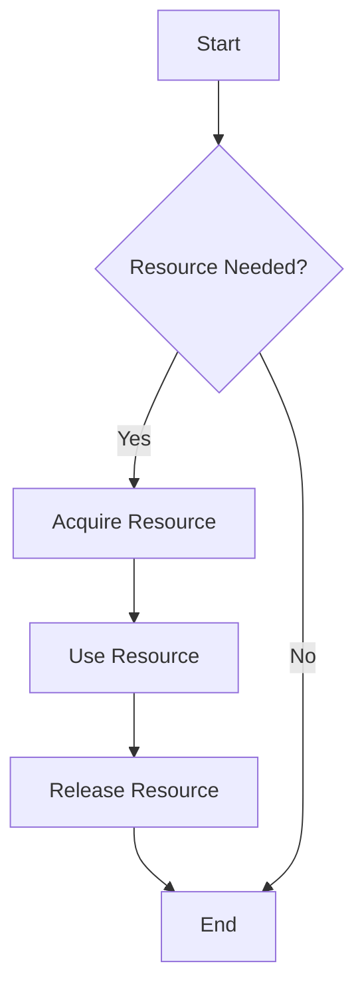
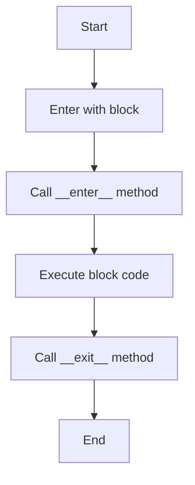
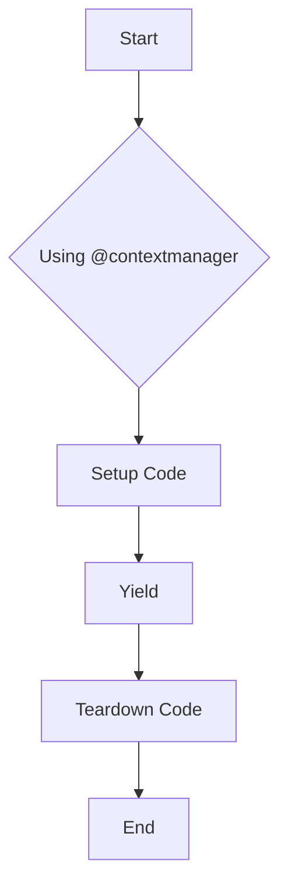
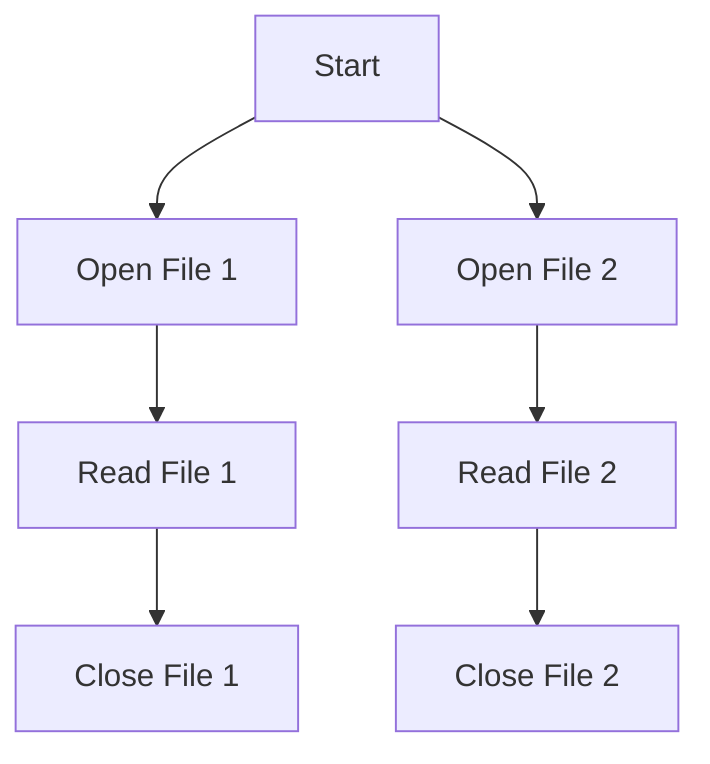
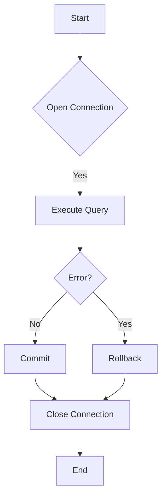
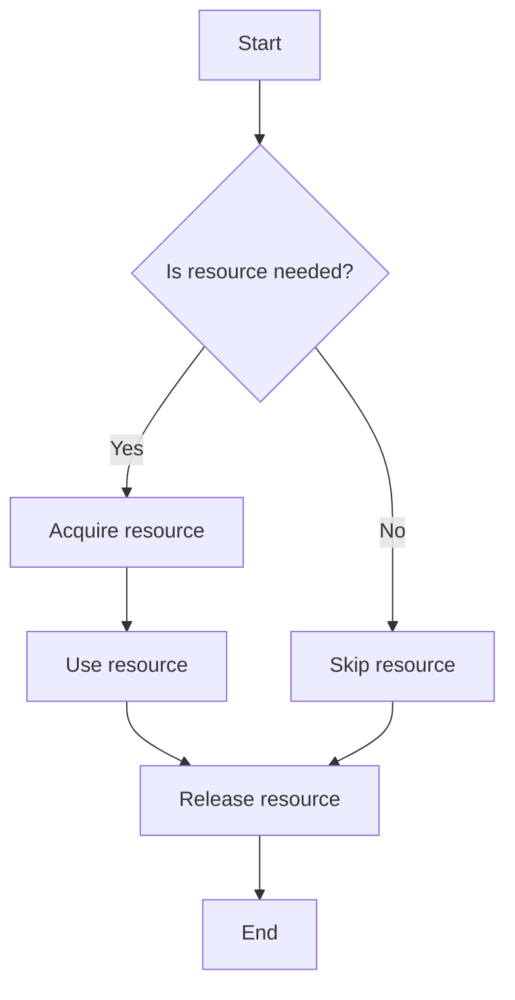

Error: API request failed with error: 401 Client Error: Unauthorized for url: https://openrouter.ai/api/v1/chat/completions

# <span style="color:#e67e22;">What we will learn in this post?</span>
<ul style='list-style-type: none; padding-left: 0;'>
<li><span style='color: #2980b9; font-size: 20px; font-weight: bold;'>👉</span> <span style='color: #2ecc71; font-size: 18px; font-weight: bold;'>Introduction to Context Managers</span></li>
<li><span style='color: #2980b9; font-size: 20px; font-weight: bold;'>👉</span> <span style='color: #2ecc71; font-size: 18px; font-weight: bold;'>Using with Statement</span></li>
<li><span style='color: #2980b9; font-size: 20px; font-weight: bold;'>👉</span> <span style='color: #2ecc71; font-size: 18px; font-weight: bold;'>Creating Custom Context Managers - Class-based</span></li>
<li><span style='color: #2980b9; font-size: 20px; font-weight: bold;'>👉</span> <span style='color: #2ecc71; font-size: 18px; font-weight: bold;'>Creating Context Managers with contextlib</span></li>
<li><span style='color: #2980b9; font-size: 20px; font-weight: bold;'>👉</span> <span style='color: #2ecc71; font-size: 18px; font-weight: bold;'>Nested Context Managers</span></li>
<li><span style='color: #2980b9; font-size: 20px; font-weight: bold;'>👉</span> <span style='color: #2ecc71; font-size: 18px; font-weight: bold;'>Context Managers for Database Connections</span></li>
<li><span style='color: #2980b9; font-size: 20px; font-weight: bold;'>👉</span> <span style='color: #2ecc71; font-size: 18px; font-weight: bold;'>Best Practices and Common Patterns</span></li>
</ul>

# <span style="color:#e67e22">Introduction to Context Managers and the `with` Statement in Python</span>

In Python, managing resources like files, locks, and connections can be tricky. That's where **context managers** and the `with` statement come in! 🌟

## <span style="color:#2980b9">What are Context Managers?</span>

Context managers are special tools that help you manage resources efficiently. They ensure that resources are properly acquired and released, even if something goes wrong. 

### <span style="color:#8e44ad">Why Use the `with` Statement?</span>

Using the `with` statement makes your code cleaner and safer. Here’s why:

- **Automatic Cleanup**: Resources are released automatically when the block of code is done, even if an error occurs.
- **Simpler Syntax**: It reduces the amount of code you write for resource management.

### <span style="color:#8e44ad">Example of Using `with`</span>

```python
with open('file.txt', 'r') as file:
    content = file.read()
# No need to close the file manually!
```

### <span style="color:#2980b9">Benefits of Context Managers</span>

- **Prevents Resource Leaks**: Ensures that resources are not left open.
- **Improves Readability**: Makes your code easier to understand.

For more information, check out the [Python Documentation on Context Managers](https://docs.python.org/3/library/contextlib.html).



In summary, context managers and the `with` statement are essential for writing clean, efficient, and safe Python code! Happy coding! 🎉

# <span style="color:#e67e22">Understanding the `with` Statement in Python</span> 😊

The `with` statement in Python is a great way to manage resources like files. It helps you write cleaner code by automatically handling setup and cleanup tasks. 

## <span style="color:#2980b9">How It Works</span> 🔍

When you use `with`, Python calls two special methods:

- **`__enter__`**: This method runs when you enter the `with` block. It prepares the resource.
- **`__exit__`**: This method runs when you leave the `with` block. It cleans up the resource.

### <span style="color:#8e44ad">Example: File Handling</span> 📂

**Using `with`:**

```python
with open('example.txt', 'r') as file:
    content = file.read()
# File is automatically closed here
```

**Without `with`:**

```python
file = open('example.txt', 'r')
content = file.read()
file.close()  # You must remember to close it!
```

### <span style="color:#8e44ad">Benefits of Using `with`</span> 🌟

- **Automatic Cleanup**: No need to remember to close files.
- **Cleaner Code**: Less clutter and easier to read.
- **Error Handling**: Handles exceptions gracefully.

For more details, check out the [Python Documentation](https://docs.python.org/3/reference/compound_stmts.html#with).

### <span style="color:#8e44ad">Flowchart of `with` Statement</span> 🛠️



Using the `with` statement makes your code safer and more efficient. Happy coding! 🎉

# <span style="color:#e67e22">Creating Custom Context Managers with Classes</span>

## <span style="color:#2980b9">What is a Context Manager?</span>

A context manager in Python helps manage resources, like files or network connections, ensuring they are properly opened and closed. You can create custom context managers using classes by defining two special methods: `__enter__` and `__exit__`.

### <span style="color:#8e44ad">Defining `__enter__` and `__exit__`</span>

- **`__enter__`**: This method runs when you enter the context. It can set up resources and return values.
- **`__exit__`**: This method runs when you exit the context. It handles cleanup and can manage exceptions.

#### Parameters of `__exit__`:

- `self`: The instance of the class.
- `exc_type`: The type of exception raised (if any).
- `exc_value`: The value of the exception.
- `traceback`: The traceback object.

If you return `True` in `__exit__`, it suppresses the exception; otherwise, it will propagate.

## <span style="color:#2980b9">Practical Example</span>

Here’s a simple example of a context manager that manages a file:

```python
class FileManager:
    def __init__(self, filename):
        self.filename = filename

    def __enter__(self):
        self.file = open(self.filename, 'w')
        return self.file

    def __exit__(self, exc_type, exc_value, traceback):
        if exc_type:
            print(f"An error occurred: {exc_value}")
        self.file.close()

# Using the context manager
with FileManager('test.txt') as f:
    f.write('Hello, World!')
```

### <span style="color:#8e44ad">Key Points</span>

- **Resource Management**: Automatically handles opening and closing resources.
- **Error Handling**: Can manage exceptions gracefully.

For more information, check out [Python's official documentation on context managers](https://docs.python.org/3/library/contextlib.html).

### <span style="color:#2980b9">Conclusion</span>

Creating custom context managers is a powerful way to manage resources in Python. With just a few methods, you can ensure your resources are handled safely and efficiently! 😊

# <span style="color:#e67e22">Using @contextmanager for Easy Context Managers</span> 🛠️

## <span style="color:#2980b9">What is @contextmanager?</span>

The `@contextmanager` decorator from the `contextlib` module helps you create context managers using generators. This makes it easy to manage resources like files or network connections. 

### <span style="color:#8e44ad">How Does It Work?</span>

When you use `@contextmanager`, you define a function that has a `yield` statement. This `yield` separates the **setup** and **teardown** code:

- **Setup**: Code before `yield` runs when entering the context.
- **Teardown**: Code after `yield` runs when exiting the context.

### <span style="color:#8e44ad">Example</span>

Here’s a simple example of using `@contextmanager`:

```python
from contextlib import contextmanager

@contextmanager
def open_file(file_name):
    try:
        f = open(file_name, 'r')
        yield f  # This is where the setup ends and the context begins
    finally:
        f.close()  # This runs when the context ends

# Using the context manager
with open_file('example.txt') as file:
    content = file.read()
    print(content)
```

### <span style="color:#2980b9">Key Points</span>

- **Easy to Use**: Simplifies resource management.
- **Automatic Cleanup**: Ensures resources are released properly.
- **Readable Code**: Makes your code cleaner and easier to understand.

For more information, check out the [Python Documentation on contextlib](https://docs.python.org/3/library/contextlib.html).



Happy coding! 🎉

# <span style="color:#e67e22">Handling Multiple Context Managers</span> 🛠️

When working with files or resources in Python, **context managers** help manage them safely. You can use multiple `with` statements or `contextlib.ExitStack` for more flexibility. Let’s explore both methods!

## <span style="color:#2980b9">Using Multiple `with` Statements</span> 📄

You can nest `with` statements to handle multiple resources:

```python
with open('file1.txt') as f1, open('file2.txt') as f2:
    data1 = f1.read()
    data2 = f2.read()
```

This way, both files are opened and closed properly!

### <span style="color:#8e44ad">Benefits:</span>
- **Simplicity**: Easy to read and understand.
- **Safety**: Automatically closes resources.

## <span style="color:#2980b9">Using `contextlib.ExitStack`</span> 🔄

For dynamic context management, `ExitStack` is your friend! It allows you to manage a variable number of context managers.

```python
from contextlib import ExitStack

with ExitStack() as stack:
    f1 = stack.enter_context(open('file1.txt'))
    f2 = stack.enter_context(open('file2.txt'))
    data1 = f1.read()
    data2 = f2.read()
```

### <span style="color:#8e44ad">Advantages:</span>
- **Flexibility**: Add or remove context managers easily.
- **Clean Code**: Keeps your code tidy.

### <span style="color:#2980b9">Visual Representation</span> 📊



For more details, check out the [Python documentation on context managers](https://docs.python.org/3/library/contextlib.html).

Happy coding! 🎉

# <span style="color:#e67e22">Using Context Managers for Database Connections</span> 

## <span style="color:#2980b9">What are Context Managers?</span>

Context managers help manage resources like database connections. They ensure that connections are properly opened and closed, making your code cleaner and safer. 

### <span style="color:#8e44ad">Example with SQLite</span>

Here's a simple example using SQLite:

```python
import sqlite3

def execute_query(query):
    with sqlite3.connect('example.db') as conn:
        cursor = conn.cursor()
        cursor.execute(query)
        conn.commit()  # Automatically commits changes
```

### <span style="color:#8e44ad">Example with SQLAlchemy</span>

SQLAlchemy makes it even easier with its session management:

```python
from sqlalchemy import create_engine
from sqlalchemy.orm import sessionmaker

engine = create_engine('sqlite:///example.db')
Session = sessionmaker(bind=engine)

with Session() as session:
    # Your database operations here
    session.add(new_record)
    session.commit()  # Automatically commits changes
```

## <span style="color:#2980b9">Benefits of Using Context Managers</span>

- **Automatic Resource Management**: No need to manually close connections.
- **Error Handling**: Rollbacks happen automatically on errors.
- **Cleaner Code**: Less boilerplate code to manage connections.

For more details, check out [Python's official documentation](https://docs.python.org/3/library/contextlib.html) and [SQLAlchemy documentation](https://docs.sqlalchemy.org/en/14/orm/session.html).

### <span style="color:#8e44ad">Flowchart of Connection Management</span>



Using context managers makes your database interactions smooth and efficient! Happy coding! 😊

# <span style="color:#e67e22">Best Practices for Context Managers</span> 🐍

Context managers in Python help manage resources efficiently. Here’s how to use them effectively!

## <span style="color:#2980b9">When to Use Context Managers</span> ⏳

- **Resource Management**: Use them for files, network connections, or database connections.
- **Temporary Changes**: Great for changing settings temporarily, like modifying environment variables.

## <span style="color:#2980b9">Ensuring `__exit__` Robustness</span> 🔒

- Always handle exceptions in the `__exit__` method to ensure resources are released properly.
- Use `return True` to suppress exceptions if needed.

### <span style="color:#8e44ad">Example of `__exit__`</span>

```python
class MyContext:
    def __enter__(self):
        # Setup code
        return self

    def __exit__(self, exc_type, exc_value, traceback):
        # Cleanup code
        if exc_type:
            print("Exception suppressed!")
            return True  # Suppress the exception
```

## <span style="color:#2980b9">Common Patterns</span> 📊

- **Timing**: Measure execution time of code blocks.
- **Logging**: Automatically log entry and exit of functions.
- **Temporary State Changes**: Change configurations temporarily and revert back.

### <span style="color:#8e44ad">Flowchart Example</span>



## <span style="color:#2980b9">Resources for More Info</span> 📚

- [Python Official Documentation on Context Managers](https://docs.python.org/3/library/contextlib.html)
- [Real Python: Context Managers](https://realpython.com/python-context-managers/)

Using context managers wisely can make your code cleaner and more efficient! Happy coding! 🎉

