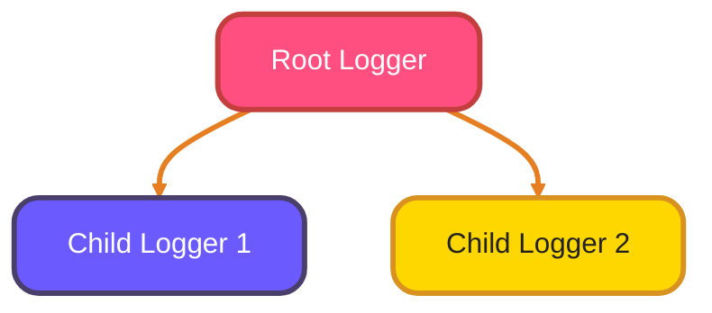
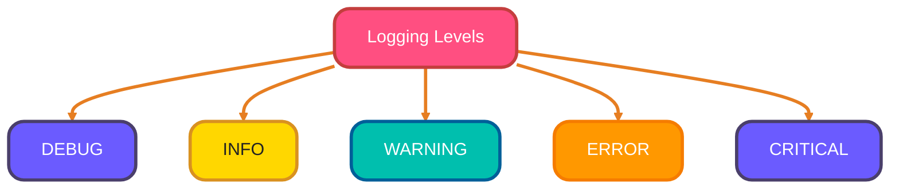
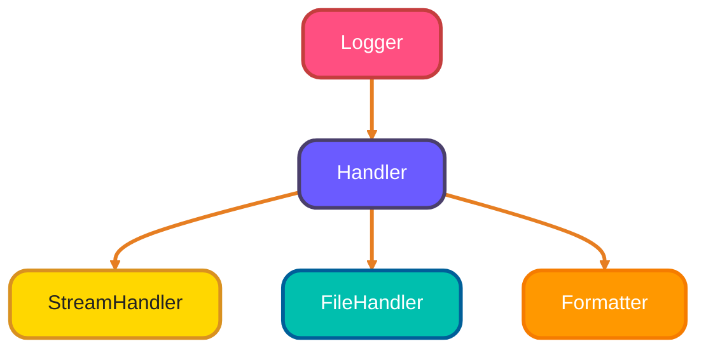
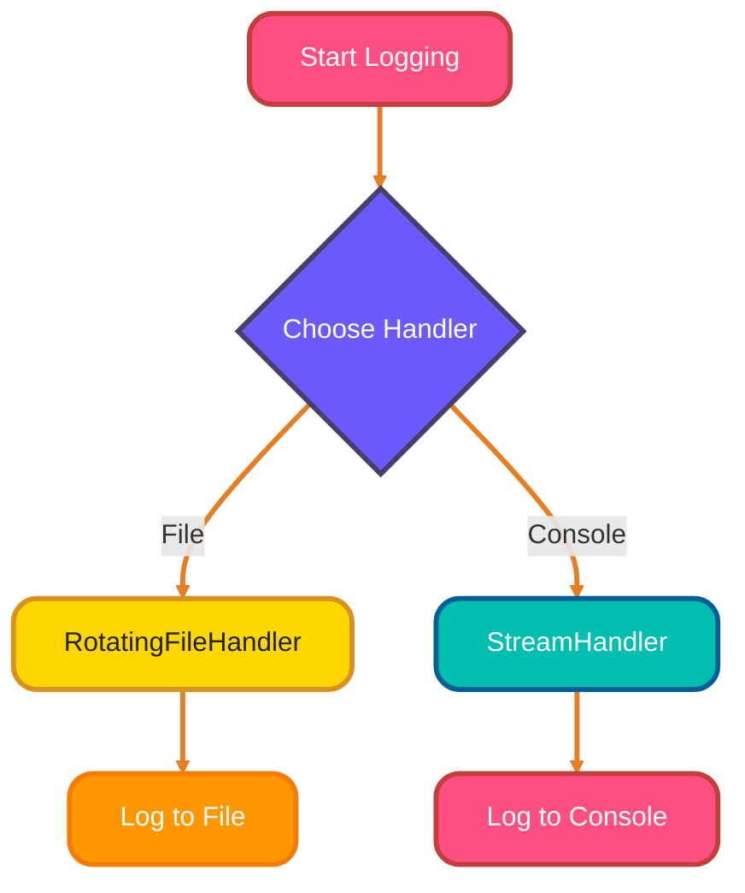
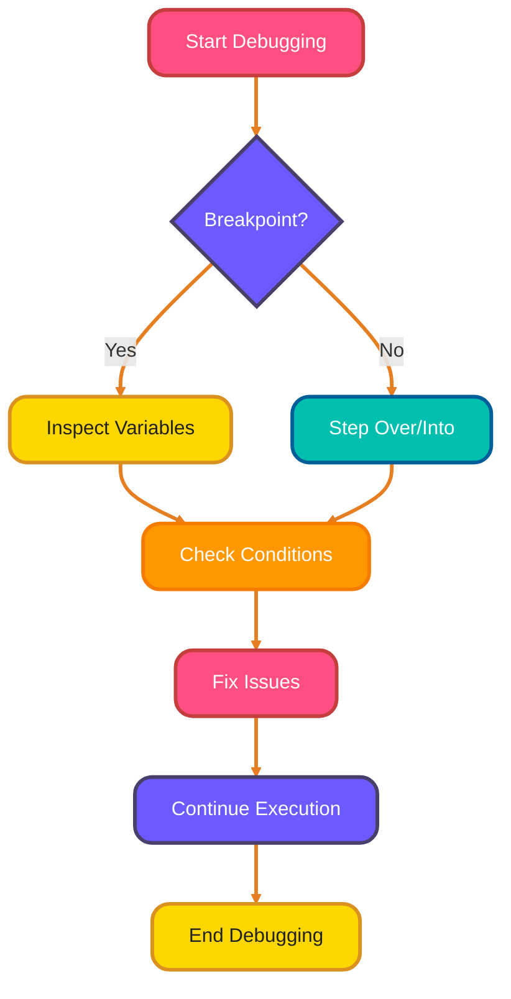

<!--
meta-description: "🔍 Learn how to effectively log and debug your Python applications. Master the logging module, use pdb for debugging, and explore best practices for maintaining healthy code. 🚀"
keywords: "Python logging, debugging python, pdb debugger, logging module, python debug tools, logging levels, python programming"
-->

# <span style="color:#e67e22;">What we will learn in this post?</span>
<ul style='list-style-type: none; padding-left: 0;'>
<li><span style='color: #2980b9; font-size: 20px; font-weight: bold;'>👉</span> <span style='color: #2ecc71; font-size: 18px; font-weight: bold;'>Introduction to Logging</span></li>
<li><span style='color: #2980b9; font-size: 20px; font-weight: bold;'>👉</span> <span style='color: #2ecc71; font-size: 18px; font-weight: bold;'>Logging Basics and Levels</span></li>
<li><span style='color: #2980b9; font-size: 20px; font-weight: bold;'>👉</span> <span style='color: #2ecc71; font-size: 18px; font-weight: bold;'>Loggers, Handlers, and Formatters</span></li>
<li><span style='color: #2980b9; font-size: 20px; font-weight: bold;'>👉</span> <span style='color: #2ecc71; font-size: 18px; font-weight: bold;'>Advanced Logging Configuration</span></li>
<li><span style='color: #2980b9; font-size: 20px; font-weight: bold;'>👉</span> <span style='color: #2ecc71; font-size: 18px; font-weight: bold;'>Debugging with pdb</span></li>
<li><span style='color: #2980b9; font-size: 20px; font-weight: bold;'>👉</span> <span style='color: #2ecc71; font-size: 18px; font-weight: bold;'>Debugging Tools and IDEs</span></li>
<li><span style='color: #2980b9; font-size: 20px; font-weight: bold;'>👉</span> <span style='color: #2ecc71; font-size: 18px; font-weight: bold;'>Logging Best Practices</span></li>
</ul>

# <span style="color:#e67e22">The Importance of Logging in Applications</span>

Logging is a crucial part of software development. It helps developers understand what’s happening in their applications. When things go wrong, logs provide valuable information to troubleshoot issues. In production environments, effective logging monitors system health and performance in real-time. 📜


## <span style="color:#2980b9">Print Statements vs. Logging</span>

While **print statements** can show output during development, they have limitations:

- **Print statements**:
  - Only show output on the console.
  - Not suitable for production.
  - Hard to manage in large applications.

- **Logging**:
  - Can save messages to files or external systems.
  - Offers different levels of severity (e.g., DEBUG, INFO, WARNING).
  - Easier to filter and manage.

Logging solutions scale with your application, unlike print statements which become unmanageable.


### <span style="color:#8e44ad">Overview of Python's Logging Module</span>

Python's built-in logging module provides a flexible framework for emitting log messages from Python programs. Here’s a quick overview:

- **Loggers**: Create log messages.
- **Handlers**: Send log messages to their final destination (console, files, etc.).
- **Formatters**: Define the layout of log messages.

Since it is a standard library module, you can implement robust logging without adding external dependencies.


```python
import logging

logging.basicConfig(level=logging.INFO)
logging.info("This is an info message.")
```

### <span style="color:#8e44ad">Real-World Example: API Request Logger 🎯</span>

```python
import logging
import time
from functools import wraps

# Configure logging for API requests
logging.basicConfig(
    level=logging.INFO,
    format='%(asctime)s - %(name)s - %(levelname)s - %(message)s',
    handlers=[
        logging.FileHandler('api_requests.log'),
        logging.StreamHandler()
    ]
)

logger = logging.getLogger('api_logger')

def log_api_request(func):
    """Decorator to log API request details"""
    @wraps(func)
    def wrapper(*args, **kwargs):
        start_time = time.time()
        logger.info(f"API Request: {func.__name__} started")
        
        try:
            result = func(*args, **kwargs)
            duration = time.time() - start_time
            logger.info(f"API Request: {func.__name__} completed in {duration:.2f}s")
            return result
        except Exception as e:
            logger.error(f"API Request: {func.__name__} failed - {str(e)}")
            raise
    
    return wrapper

@log_api_request
def fetch_user_data(user_id):
    """Simulate fetching user data from API"""
    logger.debug(f"Fetching data for user_id: {user_id}")
    # Simulate API call
    return {"id": user_id, "name": "John Doe", "email": "john@example.com"}

# Usage in production
user = fetch_user_data(123)
```

### <span style="color:#8e44ad">Logging Hierarchy</span>

The logging hierarchy consists of:

- **Root Logger**: The top-level logger.
- **Child Loggers**: Inherit settings from the root logger.



# <span style="color:#e67e22">Understanding Logging Levels 📊</span>

Logging is a way to track what's happening in your code. It helps you understand and debug your applications. There are five main logging levels:

## <span style="color:#2980b9">Logging Levels Explained</span>

- **DEBUG**: Use this for detailed information, mainly for developers. It helps in diagnosing problems.
- **INFO**: This level is for general information about the application's progress. It's useful for tracking the flow of the application.
- **WARNING**: Indicates something unexpected happened, but the application is still running. Use it to alert about potential issues.
- **ERROR**: This level is for serious problems that prevent a function from working. It’s a sign that something went wrong.
- **CRITICAL**: This is the highest level, indicating a severe error that may cause the program to stop. Immediate attention is needed.

Choosing the appropriate level ensures you capture critical errors without drowning in unnecessary data.


### <span style="color:#8e44ad">Using `basicConfig()`</span>

You can set up logging easily with `basicConfig()`. Here’s a simple example:

```python
import logging

logging.basicConfig(level=logging.INFO)
logging.debug("This is a debug message")  # Won't show
logging.info("This is an info message")   # Will show
```

### <span style="color:#8e44ad">Filtering Messages</span>

The logging level filters messages. For example, if you set the level to `WARNING`, only warnings, errors, and critical messages will appear.

```python
logging.basicConfig(level=logging.WARNING)
logging.info("This won't show")  # Ignored
logging.warning("This will show") # Displayed
```

### <span style="color:#2980b9">Visual Summary</span>



# <span style="color:#e67e22">Understanding Logging Architecture 📜</span>

Logging is essential for tracking events in your applications. Let’s break down the key components: **Logger**, **Handler**, and **Formatter**. This modular design allows you to route logs to files, emails, or external services simultaneously.


## <span style="color:#2980b9">Logger Objects 🔍</span>

A **Logger** is like a diary for your application. It records messages at different levels (DEBUG, INFO, WARNING, ERROR, CRITICAL). 

### Example:
```python
import logging

logger = logging.getLogger('my_logger')
logger.setLevel(logging.DEBUG)
```

## <span style="color:#2980b9">Handler Objects 🛠️</span>

**Handlers** send the log messages to their final destination. Common types include:

- **StreamHandler**: Sends logs to the console.
- **FileHandler**: Saves logs to a file.

### Example:
```python
# StreamHandler
stream_handler = logging.StreamHandler()
logger.addHandler(stream_handler)

# FileHandler
file_handler = logging.FileHandler('app.log')
logger.addHandler(file_handler)
```

## <span style="color:#2980b9">Formatter Objects 🎨</span>

**Formatters** define how the log messages look. You can customize the format to include timestamps, log levels, and messages.

### Example:
```python
formatter = logging.Formatter('%(asctime)s - %(levelname)s - %(message)s')
stream_handler.setFormatter(formatter)
file_handler.setFormatter(formatter)
```

### Putting It All Together:
```python
import logging

logger = logging.getLogger('my_logger')
logger.setLevel(logging.DEBUG)

stream_handler = logging.StreamHandler()
file_handler = logging.FileHandler('app.log')

formatter = logging.Formatter('%(asctime)s - %(levelname)s - %(message)s')
stream_handler.setFormatter(formatter)
file_handler.setFormatter(formatter)

logger.addHandler(stream_handler)
logger.addHandler(file_handler)

logger.info('This is an info message!')
```

### <span style="color:#8e44ad">Real-World Example: Multi-Handler Logging System 🎯</span>

```python
import logging
import logging.handlers
import sys

class ProductionLogger:
    """Production-ready logging configuration"""
    
    def __init__(self, name, log_file='app.log'):
        self.logger = logging.getLogger(name)
        self.logger.setLevel(logging.DEBUG)
        
        # Formatter for structured logs
        formatter = logging.Formatter(
            '%(asctime)s | %(name)s | %(levelname)s | %(filename)s:%(lineno)d | %(message)s',
            datefmt='%Y-%m-%d %H:%M:%S'
        )
        
        # File Handler with rotation
        file_handler = logging.handlers.RotatingFileHandler(
            log_file,
            maxBytes=10*1024*1024,  # 10MB
            backupCount=5
        )
        file_handler.setLevel(logging.DEBUG)
        file_handler.setFormatter(formatter)
        
        # Console Handler for errors only
        console_handler = logging.StreamHandler(sys.stdout)
        console_handler.setLevel(logging.WARNING)
        console_handler.setFormatter(formatter)
        
        # Add handlers
        self.logger.addHandler(file_handler)
        self.logger.addHandler(console_handler)
    
    def get_logger(self):
        return self.logger

# Usage in production application
prod_logger = ProductionLogger('ecommerce_app')
logger = prod_logger.get_logger()

logger.info("Application started")
logger.warning("Database connection pool at 80% capacity")
logger.error("Payment gateway timeout")
```

### Flowchart of Logging Architecture:


Now you have a friendly overview of logging architecture! Happy coding! 😊

# <span style="color:#e67e22">Logging Configuration in Python</span> 📜

Logging is essential for tracking events in your application. Let's explore how to set it up using `dictConfig` and `fileConfig`, along with rotating file handlers and structured logging. Centralized configuration simplifies management across large projects and multiple environments.


## <span style="color:#2980b9">Basic Logging Setup</span> 🛠️

You can configure logging using a dictionary. Here’s a simple example:

```python
import logging
import logging.config

logging_config = {
    'version': 1,
    'disable_existing_loggers': False,
    'formatters': {
        'simple': {
            'format': '%(asctime)s - %(name)s - %(levelname)s - %(message)s'
        },
    },
    'handlers': {
        'file': {
            'class': 'logging.handlers.RotatingFileHandler',
            'filename': 'app.log',
            'maxBytes': 2000,
            'backupCount': 5,
            'formatter': 'simple',
        },
        'console': {
            'class': 'logging.StreamHandler',
            'formatter': 'simple',
        },
    },
    'loggers': {
        'my_logger': {
            'handlers': ['file', 'console'],
            'level': 'DEBUG',
        },
    },
}

logging.config.dictConfig(logging_config)
logger = logging.getLogger('my_logger')
logger.debug('This is a debug message!')
```

### <span style="color:#8e44ad">Key Features</span> 🌟

- **Rotating File Handlers**: Automatically manage log file sizes.
- **Multiple Destinations**: Log to both a file and the console.
- **Structured Logging**: Use formats to make logs easier to read.

### <span style="color:#8e44ad">Visual Representation</span> 📊



With this setup, you can easily track your application's behavior and troubleshoot issues effectively! Happy logging! 🎉

# <span style="color:#e67e22">Introduction to Python's Built-in Debugger: pdb 🐍</span>

Debugging is an essential skill for any programmer. Python offers a powerful built-in debugger called **pdb** that helps you find and fix bugs in your code. Let’s explore some common commands and how to use them effectively! Mastering pdb saves you hours of trial-and-error debugging and lets you inspect state at runtime.


## <span style="color:#2980b9">Common pdb Commands</span>

Here are some key commands you’ll use in pdb:

- **`n`**: Next line - move to the next line of code.
- **`s`**: Step into - go into a function call.
- **`c`**: Continue - resume execution until the next breakpoint.
- **`p`**: Print - display the value of a variable.
- **`l`**: List - show the current location in the code.
- **`b`**: Breakpoint - set a breakpoint at a specific line.
- **`q`**: Quit - exit the debugger.

### <span style="color:#8e44ad">Setting Breakpoints and Inspecting Variables</span>

To set a breakpoint, use the command `b <line_number>`. This allows you to pause execution and inspect variables. For example:

```python
def add(a, b):
    return a + b

result = add(2, 3)
print(result)
```

In pdb, you can set a breakpoint at the line `return a + b` and inspect `a` and `b` before the function returns.

### <span style="color:#8e44ad">Stepping Through Code</span>

You can step through your code line by line using `n` and `s`. This helps you understand the flow and catch errors.

```plaintext
(pdb) b 2
(pdb) c
(pdb) p result
```

### <span style="color:#8e44ad">Real-World Example: Debugging a Web Scraper 🎯</span>

```python
import pdb

def scrape_product_prices(url):
    """Scrape product prices from e-commerce site"""
    prices = []
    
    # Set breakpoint to inspect data
    pdb.set_trace()  # Debugger will pause here
    
    # Simulate data extraction
    raw_data = fetch_page(url)
    
    for item in raw_data:
        price = extract_price(item)
        prices.append(price)
    
    return prices

def extract_price(item):
    """Extract price from HTML element"""
    # Complex parsing logic
    price_text = item.find('span', class_='price').text
    # Remove currency symbols and convert
    return float(price_text.replace('$', '').replace(',', ''))

def fetch_page(url):
    """Simulate fetching page data"""
    return [
        type('obj', (object,), {'find': lambda *a, **k: type('span', (object,), {'text': '$1,234.56'})()})(),
        type('obj', (object,), {'find': lambda *a, **k: type('span', (object,), {'text': '$789.00'})()})()
    ]

# When running this, pdb will pause at set_trace()
# You can use:
# - 'n' to step to next line
# - 'p raw_data' to inspect the fetched data
# - 'c' to continue execution
prices = scrape_product_prices('https://example.com/products')
```

# <span style="color:#e67e22">Debugging Tools in Popular IDEs</span> 🛠️

## <span style="color:#2980b9">Visual Debugging in VS Code and PyCharm</span>

Debugging helps you find and fix errors in your code. Both **VS Code** and **PyCharm** offer powerful debugging tools. Visual debuggers provide deeper insights into complex data structures without writing extra code.


### <span style="color:#8e44ad">Key Features</span>

- **Visual Debugging**: See your code execution in real-time.
- **Watch Expressions**: Monitor variables as you step through your code.
- **Conditional Breakpoints**: Pause execution only when certain conditions are met.

### <span style="color:#8e44ad">Example Code</span>

```python
def add(a, b):
    return a + b

result = add(5, 3)  # Set a breakpoint here
print(result)  # Watch this variable
```

### <span style="color:#2980b9">Debugging Techniques</span>

- **Step Over**: Execute the next line without going into functions.
- **Step Into**: Dive into the function to see its inner workings.
- **Step Out**: Exit the current function and return to the caller.

### <span style="color:#8e44ad">Flowchart of Debugging Process</span>



# <span style="color:#e67e22">Logging Best Practices</span> 📜

Logging is essential for understanding how your application behaves. Here are some best practices to keep in mind! Consistently applied practices make your logs actionable, reliable, and easier to search in production.


## <span style="color:#2980b9">1. Appropriate Log Levels</span> 🔍

Use different log levels to categorize messages:

- **DEBUG**: For detailed information during development.
- **INFO**: General information about application progress.
- **WARNING**: Indications of potential issues.
- **ERROR**: Errors that need attention.
- **CRITICAL**: Serious errors that may halt the application.

Example:
```python
logger.info("User logged in successfully.")
logger.error("Database connection failed.")
```

## <span style="color:#2980b9">2. Structured Logging with JSON</span> 🗂️

Using JSON for logs makes them easier to read and analyze. For example:
```json
{
  "timestamp": "2023-10-01T12:00:00Z",
  "level": "ERROR",
  "message": "Failed to fetch user data",
  "userId": 12345
}
```

## <span style="color:#2980b9">3. Log Rotation</span> 🔄

Rotate logs to prevent them from consuming too much disk space. Use tools like `logrotate` to manage this automatically.

## <span style="color:#2980b9">4. Handling Sensitive Data</span> 🔒

Never log sensitive information like passwords or credit card numbers. Always sanitize logs to protect user privacy.

## <span style="color:#2980b9">5. Logging in Production</span> 🌐

In production, ensure logs are written to a centralized system for easier monitoring. Use tools like ELK Stack or Splunk.

## <span style="color:#2980b9">6. Integrating with Monitoring Tools</span> 📊

Integrate your logs with monitoring tools like Prometheus or Grafana to visualize and alert on log data.

### Resources
- [Logging Best Practices](https://www.loggingbestpractices.com)
- [Structured Logging](https://structuredlogging.com)

By following these practices, you can ensure your logging is effective and helpful! Happy logging! 😊

---

## 🧠 Test Your Knowledge



{% include quiz.html 
  question="What is the primary advantage of using Python's logging module over print statements?" 
  options="Print statements are faster, Logging can save messages to files and supports different severity levels, Print statements have better formatting, Logging requires less code" 
  correct="1" 
  explanation="The logging module offers flexibility to save messages to different destinations (files, console, remote servers) and categorize them by severity levels (DEBUG, INFO, WARNING, ERROR, CRITICAL), making it far superior to print statements for production use." 
%}





{% include quiz.html 
  question="What is a critical security practice when implementing logging in production applications?" 
  options="Log everything for maximum visibility, Never log sensitive data like passwords or credit card numbers, Use DEBUG level for all logs, Store logs in public directories" 
  correct="1" 
  explanation="Never log sensitive information like passwords, API keys, credit card numbers, or personal identifiable information (PII). Always sanitize logs to protect user privacy and comply with security regulations." 
%}

---

<details style='border: 2px solid #ff9800; border-radius: 8px; padding: 20px; background: linear-gradient(135deg, #fff3e0 0%, #fff 100%); margin: 25px 0; box-shadow: 0 6px 12px rgba(255, 152, 0, 0.15);'>
<summary style='cursor: pointer; font-size: 1.3em; font-weight: bold; color: #ff9800; padding: 10px 0;'>
🎯 Hands-On Assignment: Build a Production-Ready Logging System 🚀
</summary>

<div style='margin-top: 20px; color: #2c3e50; line-height: 1.6;'>

<h3 style='color: #ff9800; border-bottom: 2px solid #ff9800; padding-bottom: 8px; margin-top: 20px;'>📝 Your Mission</h3>

Create a comprehensive logging system for a web application that handles user authentication, API requests, and error tracking. Build a production-ready solution with multiple handlers, log rotation, structured logging, and proper error handling that could be deployed to a real-world application.

<h3 style='color: #ff9800; border-bottom: 2px solid #ff9800; padding-bottom: 8px; margin-top: 20px;'>🎯 Requirements</h3>

<ol style='margin-left: 20px;'>
<li>Create a <code>LoggerManager</code> class that configures logging with:
  <ul style='margin-left: 20px; margin-top: 8px;'>
    <li><code>RotatingFileHandler</code> for general logs (max 10MB, 5 backups)</li>
    <li><code>FileHandler</code> for error logs (errors only)</li>
    <li><code>StreamHandler</code> for console output (warnings and above)</li>
    <li>Custom <code>Formatter</code> with timestamp, level, filename, and line number</li>
  </ul>
</li>
<li>Implement logging decorators:
  <ul style='margin-left: 20px; margin-top: 8px;'>
    <li><code>@log_execution_time</code> - Logs function execution duration</li>
    <li><code>@log_exceptions</code> - Catches and logs exceptions with full traceback</li>
    <li><code>@log_api_calls</code> - Logs API endpoint access with parameters (sanitized)</li>
  </ul>
</li>
<li>Create structured JSON logging for important events (authentication, payments)</li>
<li>Implement a filter to sanitize sensitive data (passwords, tokens, credit cards)</li>
<li>Write pytest test cases to verify logging behavior</li>
</ol>

<h3 style='color: #ff9800; border-bottom: 2px solid #ff9800; padding-bottom: 8px; margin-top: 25px;'>💡 Implementation Hints</h3>

<ol style='margin-left: 20px;'>
<li>Use <code>logging.config.dictConfig()</code> for centralized configuration</li>
<li>Create a custom <code>logging.Filter</code> subclass for sensitive data sanitization</li>
<li>Use <code>functools.wraps</code> in decorators to preserve function metadata</li>
<li>For JSON logging, use <code>json.dumps()</code> in formatter or custom handler</li>
<li>Test with <code>caplog</code> fixture in pytest to capture and verify log messages</li>
<li>Use <code>logging.getLogger(__name__)</code> for module-specific loggers</li>
</ol>

<h3 style='color: #ff9800; border-bottom: 2px solid #ff9800; padding-bottom: 8px; margin-top: 25px;'>🚀 Example Input/Output</h3>

<pre style='background: #2c3e50; color: #ecf0f1; padding: 20px; border-radius: 8px; overflow-x: auto; margin: 15px 0;'><code class='language-python'># Example: Using the logging system
from logger_manager import LoggerManager, log_execution_time, log_exceptions

# Initialize logging
manager = LoggerManager('myapp', log_dir='./logs')
logger = manager.get_logger()

@log_execution_time
@log_exceptions
def process_user_login(username, password):
    """Simulate user authentication"""
    logger.info(f"Login attempt for user: {username}")
    # Authentication logic here
    if authenticate(username, password):
        logger.info(f"User {username} logged in successfully")
        return {"status": "success", "user": username}
    else:
        logger.warning(f"Failed login attempt for user: {username}")
        return {"status": "failed"}

# Output in logs/app.log:
# 2026-01-11 14:23:45 | myapp | INFO | auth.py:15 | Login attempt for user: john_doe
# 2026-01-11 14:23:45 | myapp | INFO | auth.py:19 | User john_doe logged in successfully
# 2026-01-11 14:23:45 | myapp | INFO | decorators.py:25 | process_user_login executed in 0.125s

# Output in logs/errors.log (if error occurred):
# 2026-01-11 14:25:10 | myapp | ERROR | auth.py:22 | Database connection failed
# Traceback (most recent call last):
#   File "auth.py", line 22, in process_user_login
#     result = db.query(...)
# ConnectionError: Unable to connect to database
</code></pre>

<h3 style='color: #ff9800; border-bottom: 2px solid #ff9800; padding-bottom: 8px; margin-top: 25px;'>🏆 Bonus Challenges</h3>

<ul style='margin-left: 20px;'>
<li><strong>Level 2</strong>: Add <code>SMTPHandler</code> to send email alerts for CRITICAL errors</li>
<li><strong>Level 3</strong>: Implement <code>HTTPHandler</code> to send logs to external monitoring service (e.g., Sentry, Datadog)</li>
<li><strong>Level 4</strong>: Create a <code>ColoredFormatter</code> for terminal output with ANSI color codes</li>
<li><strong>Level 5</strong>: Add context managers for temporary log level changes: <code>with log_level(logging.DEBUG):</code></li>
<li><strong>Level 6</strong>: Build a log aggregation dashboard using Flask to display real-time logs from multiple files</li>
</ul>

<h3 style='color: #ff9800; border-bottom: 2px solid #ff9800; padding-bottom: 8px; margin-top: 25px;'>📚 Learning Goals</h3>

<ul style='margin-left: 20px;'>
<li>Master Python's logging module architecture (loggers, handlers, formatters) 🎯</li>
<li>Implement production-ready logging configurations with rotation ✨</li>
<li>Create reusable logging decorators for cross-cutting concerns 🔄</li>
<li>Understand structured logging and JSON formats for analysis 📊</li>
<li>Apply security best practices for sensitive data sanitization 🔒</li>
<li>Test logging behavior with pytest and fixtures 🧪</li>
</ul>

<p style='background: #3498db; color: #fff; padding: 15px; border-radius: 8px; margin-top: 20px; border-left: 5px solid #2980b9;'>
<strong>💡 Pro Tip:</strong> This logging pattern is used in production frameworks like Django, Flask, and FastAPI! Major companies use centralized logging with tools like ELK Stack (Elasticsearch, Logstash, Kibana), Splunk, or Datadog for real-time monitoring and alerting across distributed systems.
</p>

<p style='margin-top: 20px; font-size: 1.1em;'><strong>Share Your Solution! 💬</strong></p>
<p>Completed the project? <strong>Post your code in the comments below!</strong> Show us your Python logging mastery! 🚀✨</p>

</div>
</details>

---

# <span style="color:#e67e22">Conclusion: Master Logging and Debugging for Reliable Python Applications 🎓</span>

Logging and debugging are essential skills that separate professional developers from beginners, transforming code from functional to production-ready with proper observability and maintainability. By mastering Python's logging module with handlers and formatters, using pdb for interactive debugging, and following best practices for security and performance, you'll build robust applications that are easier to monitor, troubleshoot, and scale in real-world production environments.

