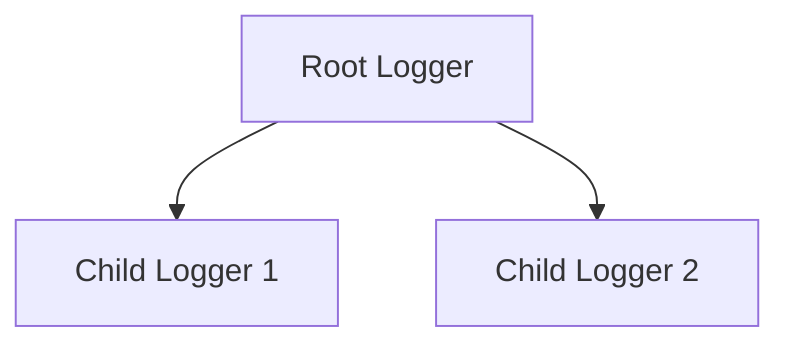
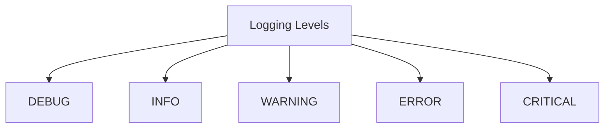
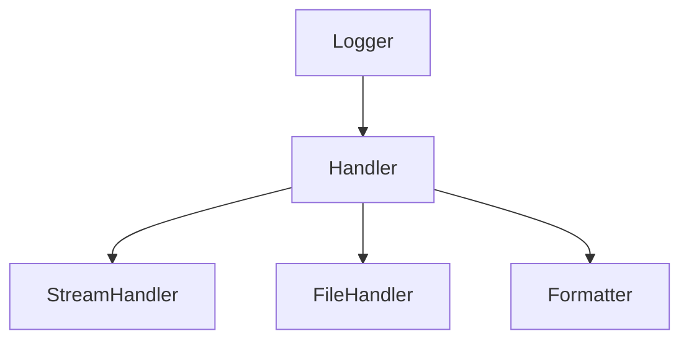
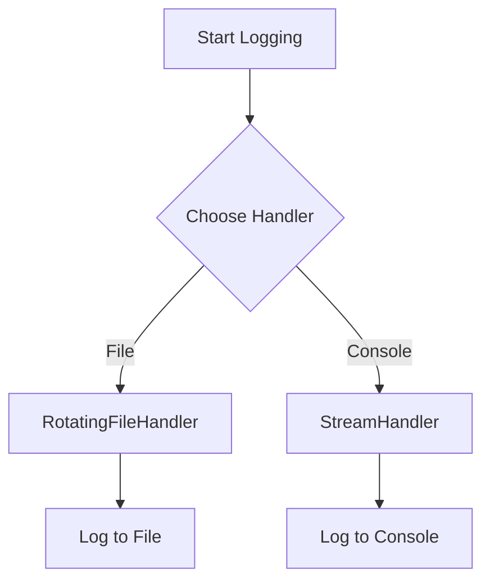
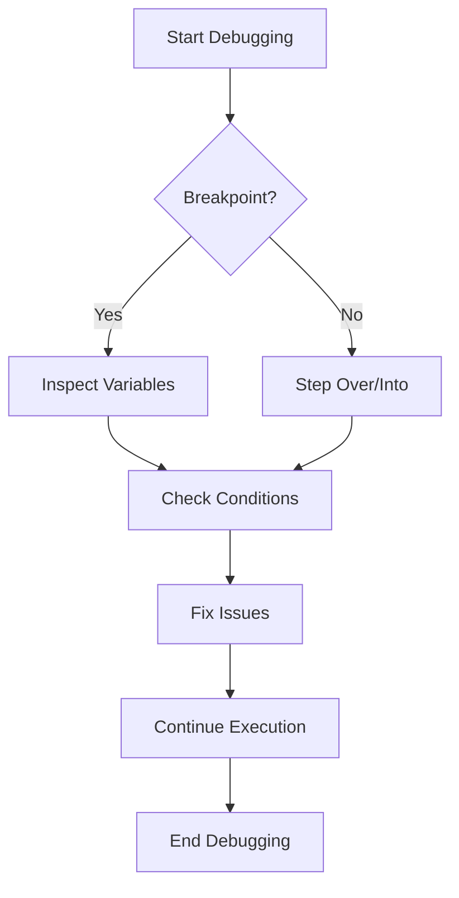

Error: API request failed with error: 401 Client Error: Unauthorized for url: https://openrouter.ai/api/v1/chat/completions

# <span style="color:#e67e22;">What we will learn in this post?</span>
<ul style='list-style-type: none; padding-left: 0;'>
<li><span style='color: #2980b9; font-size: 20px; font-weight: bold;'>👉</span> <span style='color: #2ecc71; font-size: 18px; font-weight: bold;'>Introduction to Logging</span></li>
<li><span style='color: #2980b9; font-size: 20px; font-weight: bold;'>👉</span> <span style='color: #2ecc71; font-size: 18px; font-weight: bold;'>Logging Basics and Levels</span></li>
<li><span style='color: #2980b9; font-size: 20px; font-weight: bold;'>👉</span> <span style='color: #2ecc71; font-size: 18px; font-weight: bold;'>Loggers, Handlers, and Formatters</span></li>
<li><span style='color: #2980b9; font-size: 20px; font-weight: bold;'>👉</span> <span style='color: #2ecc71; font-size: 18px; font-weight: bold;'>Advanced Logging Configuration</span></li>
<li><span style='color: #2980b9; font-size: 20px; font-weight: bold;'>👉</span> <span style='color: #2ecc71; font-size: 18px; font-weight: bold;'>Debugging with pdb</span></li>
<li><span style='color: #2980b9; font-size: 20px; font-weight: bold;'>👉</span> <span style='color: #2ecc71; font-size: 18px; font-weight: bold;'>Debugging Tools and IDEs</span></li>
<li><span style='color: #2980b9; font-size: 20px; font-weight: bold;'>👉</span> <span style='color: #2ecc71; font-size: 18px; font-weight: bold;'>Logging Best Practices</span></li>
</ul>

# <span style="color:#e67e22">The Importance of Logging in Applications</span>

Logging is a crucial part of software development. It helps developers understand what’s happening in their applications. When things go wrong, logs provide valuable information to troubleshoot issues. 📜

## <span style="color:#2980b9">Print Statements vs. Logging</span>

While **print statements** can show output during development, they have limitations:

- **Print statements**:
  - Only show output on the console.
  - Not suitable for production.
  - Hard to manage in large applications.

- **Logging**:
  - Can save messages to files or external systems.
  - Offers different levels of severity (e.g., DEBUG, INFO, WARNING).
  - Easier to filter and manage.

### <span style="color:#8e44ad">Overview of Python's Logging Module</span>

Python's built-in logging module provides a flexible framework for emitting log messages from Python programs. Here’s a quick overview:

- **Loggers**: Create log messages.
- **Handlers**: Send log messages to their final destination (console, files, etc.).
- **Formatters**: Define the layout of log messages.

```python
import logging

logging.basicConfig(level=logging.INFO)
logging.info("This is an info message.")
```

### <span style="color:#8e44ad">Logging Hierarchy</span>

The logging hierarchy consists of:

- **Root Logger**: The top-level logger.
- **Child Loggers**: Inherit settings from the root logger.



For more information, check out the [Python Logging Documentation](https://docs.python.org/3/library/logging.html). Happy logging! 📊

# <span style="color:#e67e22">Understanding Logging Levels 📊</span>

Logging is a way to track what's happening in your code. It helps you understand and debug your applications. There are five main logging levels:

## <span style="color:#2980b9">Logging Levels Explained</span>

- **DEBUG**: Use this for detailed information, mainly for developers. It helps in diagnosing problems.
- **INFO**: This level is for general information about the application's progress. It's useful for tracking the flow of the application.
- **WARNING**: Indicates something unexpected happened, but the application is still running. Use it to alert about potential issues.
- **ERROR**: This level is for serious problems that prevent a function from working. It’s a sign that something went wrong.
- **CRITICAL**: This is the highest level, indicating a severe error that may cause the program to stop. Immediate attention is needed.

### <span style="color:#8e44ad">Using `basicConfig()`</span>

You can set up logging easily with `basicConfig()`. Here’s a simple example:

```python
import logging

logging.basicConfig(level=logging.INFO)
logging.debug("This is a debug message")  # Won't show
logging.info("This is an info message")   # Will show
```

### <span style="color:#8e44ad">Filtering Messages</span>

The logging level filters messages. For example, if you set the level to `WARNING`, only warnings, errors, and critical messages will appear.

```python
logging.basicConfig(level=logging.WARNING)
logging.info("This won't show")  # Ignored
logging.warning("This will show") # Displayed
```

### <span style="color:#2980b9">Visual Summary</span>



For more details, check out the [Python Logging Documentation](https://docs.python.org/3/library/logging.html). Happy coding! 😊

# <span style="color:#e67e22">Understanding Logging Architecture 📜</span>

Logging is essential for tracking events in your applications. Let’s break down the key components: **Logger**, **Handler**, and **Formatter**.

## <span style="color:#2980b9">Logger Objects 🔍</span>

A **Logger** is like a diary for your application. It records messages at different levels (DEBUG, INFO, WARNING, ERROR, CRITICAL). 

### Example:
```python
import logging

logger = logging.getLogger('my_logger')
logger.setLevel(logging.DEBUG)
```

## <span style="color:#2980b9">Handler Objects 🛠️</span>

**Handlers** send the log messages to their final destination. Common types include:

- **StreamHandler**: Sends logs to the console.
- **FileHandler**: Saves logs to a file.

### Example:
```python
# StreamHandler
stream_handler = logging.StreamHandler()
logger.addHandler(stream_handler)

# FileHandler
file_handler = logging.FileHandler('app.log')
logger.addHandler(file_handler)
```

## <span style="color:#2980b9">Formatter Objects 🎨</span>

**Formatters** define how the log messages look. You can customize the format to include timestamps, log levels, and messages.

### Example:
```python
formatter = logging.Formatter('%(asctime)s - %(levelname)s - %(message)s')
stream_handler.setFormatter(formatter)
file_handler.setFormatter(formatter)
```

### Putting It All Together:
```python
import logging

logger = logging.getLogger('my_logger')
logger.setLevel(logging.DEBUG)

stream_handler = logging.StreamHandler()
file_handler = logging.FileHandler('app.log')

formatter = logging.Formatter('%(asctime)s - %(levelname)s - %(message)s')
stream_handler.setFormatter(formatter)
file_handler.setFormatter(formatter)

logger.addHandler(stream_handler)
logger.addHandler(file_handler)

logger.info('This is an info message!')
```

For more details, check out the [Python Logging Documentation](https://docs.python.org/3/library/logging.html).

### Flowchart of Logging Architecture:


Now you have a friendly overview of logging architecture! Happy coding! 😊

# <span style="color:#e67e22">Logging Configuration in Python</span> 📜

Logging is essential for tracking events in your application. Let's explore how to set it up using `dictConfig` and `fileConfig`, along with rotating file handlers and structured logging.

## <span style="color:#2980b9">Basic Logging Setup</span> 🛠️

You can configure logging using a dictionary. Here’s a simple example:

```python
import logging
import logging.config

logging_config = {
    'version': 1,
    'disable_existing_loggers': False,
    'formatters': {
        'simple': {
            'format': '%(asctime)s - %(name)s - %(levelname)s - %(message)s'
        },
    },
    'handlers': {
        'file': {
            'class': 'logging.handlers.RotatingFileHandler',
            'filename': 'app.log',
            'maxBytes': 2000,
            'backupCount': 5,
            'formatter': 'simple',
        },
        'console': {
            'class': 'logging.StreamHandler',
            'formatter': 'simple',
        },
    },
    'loggers': {
        'my_logger': {
            'handlers': ['file', 'console'],
            'level': 'DEBUG',
        },
    },
}

logging.config.dictConfig(logging_config)
logger = logging.getLogger('my_logger')
logger.debug('This is a debug message!')
```

### <span style="color:#8e44ad">Key Features</span> 🌟

- **Rotating File Handlers**: Automatically manage log file sizes.
- **Multiple Destinations**: Log to both a file and the console.
- **Structured Logging**: Use formats to make logs easier to read.

For more details, check out the [Python Logging Documentation](https://docs.python.org/3/library/logging.html).

### <span style="color:#8e44ad">Visual Representation</span> 📊



With this setup, you can easily track your application's behavior and troubleshoot issues effectively! Happy logging! 🎉

# <span style="color:#e67e22">Introduction to Python's Built-in Debugger: pdb 🐍</span>

Debugging is an essential skill for any programmer. Python offers a powerful built-in debugger called **pdb** that helps you find and fix bugs in your code. Let’s explore some common commands and how to use them effectively!

## <span style="color:#2980b9">Common pdb Commands</span>

Here are some key commands you’ll use in pdb:

- **`n`**: Next line - move to the next line of code.
- **`s`**: Step into - go into a function call.
- **`c`**: Continue - resume execution until the next breakpoint.
- **`p`**: Print - display the value of a variable.
- **`l`**: List - show the current location in the code.
- **`b`**: Breakpoint - set a breakpoint at a specific line.
- **`q`**: Quit - exit the debugger.

### <span style="color:#8e44ad">Setting Breakpoints and Inspecting Variables</span>

To set a breakpoint, use the command `b <line_number>`. This allows you to pause execution and inspect variables. For example:

```python
def add(a, b):
    return a + b

result = add(2, 3)
print(result)
```

In pdb, you can set a breakpoint at the line `return a + b` and inspect `a` and `b` before the function returns.

### <span style="color:#8e44ad">Stepping Through Code</span>

You can step through your code line by line using `n` and `s`. This helps you understand the flow and catch errors.

```plaintext
(pdb) b 2
(pdb) c
(pdb) p result
```

### <span style="color:#2980b9">Resources</span>

For more detailed information, check out the [official Python documentation on pdb](https://docs.python.org/3/library/pdb.html).

Happy debugging! 🎉

# <span style="color:#e67e22">Debugging Tools in Popular IDEs</span> 🛠️

## <span style="color:#2980b9">Visual Debugging in VS Code and PyCharm</span>

Debugging helps you find and fix errors in your code. Both **VS Code** and **PyCharm** offer powerful debugging tools.

### <span style="color:#8e44ad">Key Features</span>

- **Visual Debugging**: See your code execution in real-time.
- **Watch Expressions**: Monitor variables as you step through your code.
- **Conditional Breakpoints**: Pause execution only when certain conditions are met.

### <span style="color:#8e44ad">Example Code</span>

```python
def add(a, b):
    return a + b

result = add(5, 3)  # Set a breakpoint here
print(result)  # Watch this variable
```

### <span style="color:#2980b9">Debugging Techniques</span>

- **Step Over**: Execute the next line without going into functions.
- **Step Into**: Dive into the function to see its inner workings.
- **Step Out**: Exit the current function and return to the caller.

### <span style="color:#8e44ad">Flowchart of Debugging Process</span>



## <span style="color:#2980b9">Resources for More Info</span>

- [VS Code Debugging Documentation](https://code.visualstudio.com/docs/editor/debugging)
- [PyCharm Debugging Guide](https://www.jetbrains.com/help/pycharm/debugging-python-code.html)

Debugging can be fun! Happy coding! 😊

# <span style="color:#e67e22">Logging Best Practices</span> 📜

Logging is essential for understanding how your application behaves. Here are some best practices to keep in mind!

## <span style="color:#2980b9">1. Appropriate Log Levels</span> 🔍

Use different log levels to categorize messages:

- **DEBUG**: For detailed information during development.
- **INFO**: General information about application progress.
- **WARNING**: Indications of potential issues.
- **ERROR**: Errors that need attention.
- **CRITICAL**: Serious errors that may halt the application.

Example:
```python
logger.info("User logged in successfully.")
logger.error("Database connection failed.")
```

## <span style="color:#2980b9">2. Structured Logging with JSON</span> 🗂️

Using JSON for logs makes them easier to read and analyze. For example:
```json
{
  "timestamp": "2023-10-01T12:00:00Z",
  "level": "ERROR",
  "message": "Failed to fetch user data",
  "userId": 12345
}
```

## <span style="color:#2980b9">3. Log Rotation</span> 🔄

Rotate logs to prevent them from consuming too much disk space. Use tools like `logrotate` to manage this automatically.

## <span style="color:#2980b9">4. Handling Sensitive Data</span> 🔒

Never log sensitive information like passwords or credit card numbers. Always sanitize logs to protect user privacy.

## <span style="color:#2980b9">5. Logging in Production</span> 🌐

In production, ensure logs are written to a centralized system for easier monitoring. Use tools like ELK Stack or Splunk.

## <span style="color:#2980b9">6. Integrating with Monitoring Tools</span> 📊

Integrate your logs with monitoring tools like Prometheus or Grafana to visualize and alert on log data.

### Resources
- [Logging Best Practices](https://www.loggingbestpractices.com)
- [Structured Logging](https://structuredlogging.com)

By following these practices, you can ensure your logging is effective and helpful! Happy logging! 😊

