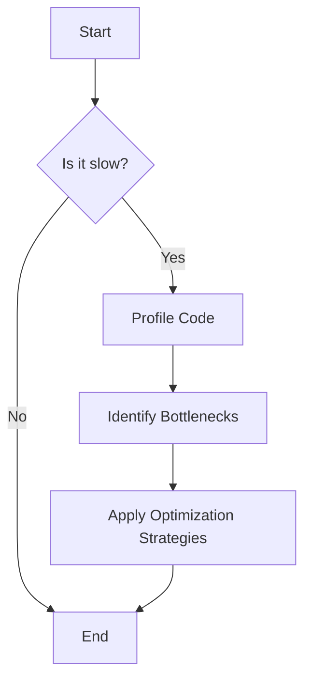
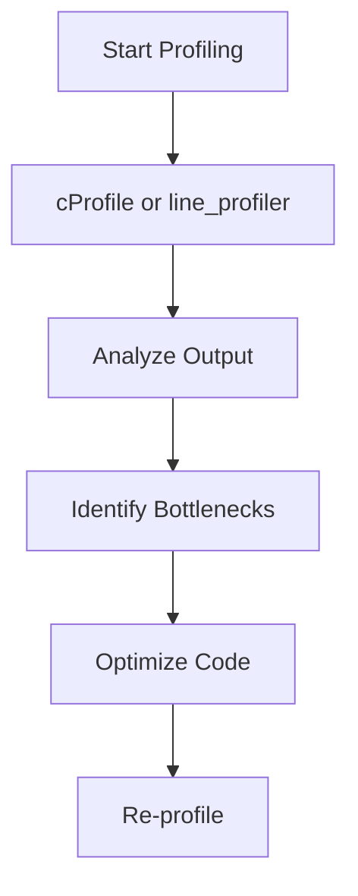
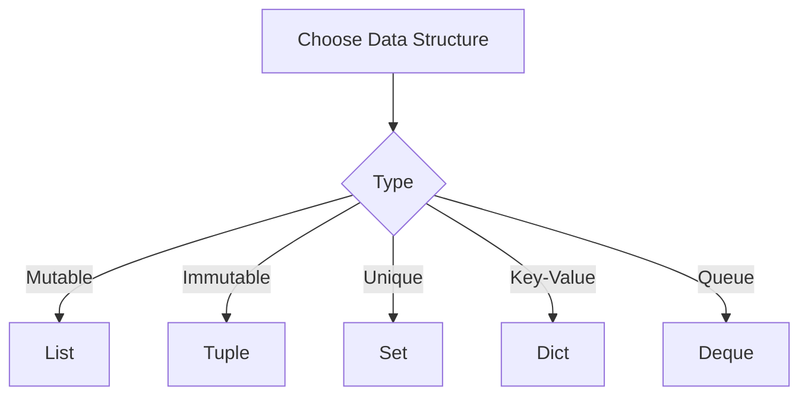

Error: API request failed with error: 401 Client Error: Unauthorized for url: https://openrouter.ai/api/v1/chat/completions

# <span style="color:#e67e22;">What we will learn in this post?</span>
<ul style='list-style-type: none; padding-left: 0;'>
<li><span style='color: #2980b9; font-size: 20px; font-weight: bold;'>👉</span> <span style='color: #2ecc71; font-size: 18px; font-weight: bold;'>Introduction to Python Performance</span></li>
<li><span style='color: #2980b9; font-size: 20px; font-weight: bold;'>👉</span> <span style='color: #2ecc71; font-size: 18px; font-weight: bold;'>Profiling Python Code</span></li>
<li><span style='color: #2980b9; font-size: 20px; font-weight: bold;'>👉</span> <span style='color: #2ecc71; font-size: 18px; font-weight: bold;'>Optimizing Data Structures</span></li>
<li><span style='color: #2980b9; font-size: 20px; font-weight: bold;'>👉</span> <span style='color: #2ecc71; font-size: 18px; font-weight: bold;'>Algorithm Optimization</span></li>
<li><span style='color: #2980b9; font-size: 20px; font-weight: bold;'>👉</span> <span style='color: #2ecc71; font-size: 18px; font-weight: bold;'>Memory Optimization</span></li>
<li><span style='color: #2980b9; font-size: 20px; font-weight: bold;'>👉</span> <span style='color: #2ecc71; font-size: 18px; font-weight: bold;'>Using NumPy for Numerical Performance</span></li>
<li><span style='color: #2980b9; font-size: 20px; font-weight: bold;'>👉</span> <span style='color: #2ecc71; font-size: 18px; font-weight: bold;'>Cython and JIT Compilation</span></li>
</ul>

# <span style="color:#e67e22">Python Performance Considerations</span> 🐍

Python is a fantastic language for many tasks, but it can be slower than compiled languages like C or C++. This is mainly because:

- **Interpreted Language**: Python code is executed line by line, which adds overhead.
- **Dynamic Typing**: Python determines variable types at runtime, which can slow things down.

## <span style="color:#2980b9">When to Optimize? 🤔</span>

Optimization is necessary when:

- Your program runs slowly.
- You need to handle large datasets.
- Performance impacts user experience.

### <span style="color:#8e44ad">Optimization Strategies 🔧</span>

Here are some friendly tips to speed up your Python code:

- **Use Built-in Functions**: They are often faster than custom code.
- **Avoid Global Variables**: They can slow down access times.
- **Profile Your Code**: Use tools like `cProfile` to find bottlenecks.
- **Consider Libraries**: Use optimized libraries like NumPy for numerical tasks.

```python
import cProfile

def my_function():
    # Your code here
    pass

cProfile.run('my_function()')
```

For more in-depth information, check out [Python Performance Tips](https://realpython.com/python-performance/) and [Profiling Python Code](https://docs.python.org/3/library/profile.html).

### <span style="color:#8e44ad">Visualizing Optimization 🛠️</span>



By understanding these concepts, you can make your Python programs faster and more efficient! Happy coding! 🎉

# <span style="color:#e67e22">Profiling Your Python Code with cProfile and line_profiler</span> 🐍

Profiling is like giving your code a health check-up! It helps you see where your program spends most of its time, so you can make it faster. Let’s dive into two popular tools: **cProfile** and **line_profiler**.

## <span style="color:#2980b9">Using cProfile</span> 🔍

**cProfile** is a built-in module that gives you a summary of how much time each function takes. Here’s how to use it:

```python
import cProfile

def my_function():
    # Your code here
    pass

cProfile.run('my_function()')
```

### <span style="color:#8e44ad">Interpreting Output</span> 📊

The output shows:
- **ncalls**: Number of calls to the function.
- **tottime**: Total time spent in the function.
- **percall**: Time per call.

Look for functions with high **tottime**; these are your bottlenecks!

## <span style="color:#2980b9">Using line_profiler</span> 📝

For a detailed, line-by-line analysis, use **line_profiler**. First, install it:

```bash
pip install line_profiler
```

Then, decorate your function:

```python
@profile
def my_function():
    # Your code here
    pass
```

Run your script with `kernprof`:

```bash
kernprof -l -v my_script.py
```

### <span style="color:#8e44ad">Visualizing Performance</span> 📈

Here’s a simple flowchart to visualize the profiling process:



### <span style="color:#2980b9">Resources</span> 📚

- [cProfile Documentation](https://docs.python.org/3/library/profile.html)
- [line_profiler Documentation](https://github.com/pyutils/line_profiler)

Happy profiling! 🎉

# <span style="color:#e67e22">Choosing the Right Data Structures for Performance</span>

## <span style="color:#2980b9">Understanding Lists vs Tuples</span>

- **Lists**: 
  - Mutable (can change)
  - Slower for large data
  - Use when you need to modify data frequently.
  
- **Tuples**: 
  - Immutable (cannot change)
  - Faster and use less memory
  - Great for fixed collections of items.

```python
my_list = [1, 2, 3]
my_tuple = (1, 2, 3)
```

### <span style="color:#8e44ad">Example</span>
- Use a **list** for a shopping cart (items can change).
- Use a **tuple** for coordinates (fixed values).

## <span style="color:#2980b9">Sets for Membership Testing</span>

- **Sets**: 
  - Unordered collections of unique items.
  - Fast membership testing (O(1) average time).
  
```python
my_set = {1, 2, 3}
print(2 in my_set)  # True
```

### <span style="color:#8e44ad">Example</span>
- Use a **set** to check if a user is logged in.

## <span style="color:#2980b9">Deque for Queues</span>

- **Deque** (Double-ended queue):
  - Fast appends and pops from both ends.
  
```python
from collections import deque
queue = deque([1, 2, 3])
queue.append(4)  # Add to the end
queue.popleft()  # Remove from the front
```

### <span style="color:#8e44ad">Example</span>
- Use a **deque** for a task queue.

## <span style="color:#2980b9">Dict Optimization</span>

- **Dictionaries**: 
  - Key-value pairs, fast lookups.
  - Use when you need to associate values with keys.
  
```python
my_dict = {'a': 1, 'b': 2}
print(my_dict['a'])  # 1
```

### <span style="color:#8e44ad">Example</span>
- Use a **dict** for user profiles.

## <span style="color:#2980b9">Conclusion</span>

Choosing the right data structure can greatly improve your program's performance. For more information, check out [Python Data Structures](https://docs.python.org/3/tutorial/datastructures.html).



Happy coding! 😊

# <span style="color:#e67e22">Understanding Algorithmic Optimization</span> 🌟

Algorithmic optimization is all about making your code run faster and more efficiently. Let’s break it down into simple parts!

## <span style="color:#2980b9">Avoiding Nested Loops</span> 🚫🔄

Nested loops can slow down your program. Instead of looping through lists within lists, try to find a more efficient way.

**Before:**
```python
for i in range(len(list1)):
    for j in range(len(list2)):
        print(list1[i], list2[j])
```

**After:**
```python
from itertools import product
for item in product(list1, list2):
    print(item)
```

## <span style="color:#2980b9">Using Built-in Functions</span> ⚙️

Python has many built-in functions that are optimized for performance. Use them instead of writing your own loops!

**Example:**
Instead of:
```python
squared = []
for x in range(10):
    squared.append(x**2)
```
Use:
```python
squared = [x**2 for x in range(10)]
```

## <span style="color:#2980b9">List Comprehensions vs Loops</span> 📝

List comprehensions are often faster and more readable than traditional loops. They allow you to create lists in a single line!

**Example:**
```python
# List comprehension
squared = [x**2 for x in range(10)]
```

## <span style="color:#2980b9">Generator Expressions</span> 🔄

Generators are like lists but use less memory. They yield items one at a time.

**Example:**
```python
gen = (x**2 for x in range(10))
for value in gen:
    print(value)
```

## <span style="color:#2980b9">Time Complexity Considerations</span> ⏳

Always consider how your code scales. Aim for lower time complexity (like O(n) instead of O(n²)) to improve performance.

### Resources for More Info:
- [Python List Comprehensions](https://docs.python.org/3/tutorial/datastructures.html#list-comprehensions)
- [Understanding Time Complexity](https://www.geeksforgeeks.org/analysis-of-algorithms-set-1-asymptotic-analysis/)

By optimizing your algorithms, you can make your code faster and more efficient! Happy coding! 😊

# <span style="color:#e67e22">Memory Optimization Techniques</span>

## <span style="color:#2980b9">1. Use Generators Instead of Lists</span> 🌱

Generators are a great way to save memory. Unlike lists, which store all items in memory, generators yield items one at a time. This means you only use memory for one item at a time!

**Example:**

```python
def my_generator():
    for i in range(1000000):
        yield i

for number in my_generator():
    print(number)  # Only one number is in memory at a time
```

## <span style="color:#2980b9">2. Use __slots__ in Classes</span> 🏷️

When you define a class, Python creates a dictionary to store instance attributes. Using `__slots__` can save memory by preventing this dictionary.

**Example:**

```python
class MyClass:
    __slots__ = ['name', 'age']

obj = MyClass()
obj.name = "Alice"
obj.age = 30
```

## <span style="color:#2980b9">3. Memory Profiling with memory_profiler</span> 📊

To find out where your program uses memory, use the `memory_profiler` library. It helps you track memory usage line by line.

**Example:**

```bash
pip install memory_profiler
```

Then, use it in your script:

```python
from memory_profiler import profile

@profile
def my_function():
    # Your code here
```

## <span style="color:#2980b9">4. Avoiding Memory Leaks</span> 🚫

Memory leaks happen when you keep references to objects that are no longer needed. To avoid this:

- Use weak references with the `weakref` module.
- Ensure you delete unnecessary objects.

**Example:**

```python
import weakref

class MyClass:
    pass

obj = MyClass()
weak_obj = weakref.ref(obj)

del obj  # Now weak_obj does not hold a reference
```

### <span style="color:#8e44ad">Resources</span> 📚

- [Python Generators](https://realpython.com/introduction-to-python-generators/)
- [Using __slots__](https://docs.python.org/3/reference/datamodel.html#slots)
- [Memory Profiler](https://github.com/pythonprofilers/memory_profiler)

By using these techniques, you can make your Python programs more efficient and save memory! Happy coding! 🎉

# <span style="color:#e67e22">How NumPy Arrays Boost Performance 🚀</span>

## <span style="color:#2980b9">What is NumPy? 🤔</span>

NumPy is a powerful library in Python for numerical computing. It allows you to work with **arrays** that are faster and more efficient than regular Python lists.

### <span style="color:#8e44ad">Vectorization: The Magic of NumPy ✨</span>

**Vectorization** means performing operations on entire arrays at once, rather than using loops. This is how NumPy speeds things up:

- **Pure Python Loops**: 
  ```python
  result = []
  for i in range(1000000):
      result.append(i * 2)
  ```

- **NumPy Arrays**:
  ```python
  import numpy as np
  arr = np.arange(1000000)
  result = arr * 2
  ```

### <span style="color:#8e44ad">Performance Comparison 📊</span>

- **Pure Python**: Takes about **1.5 seconds**.
- **NumPy**: Takes about **0.1 seconds**.

### <span style="color:#2980b9">When to Use NumPy? 🕒</span>

- When working with large datasets.
- When you need fast computations.
- When performing mathematical operations frequently.

For more details, check out the [NumPy Documentation](https://numpy.org/doc/stable/).

### <span style="color:#8e44ad">Conclusion 🎉</span>

Using NumPy can significantly improve your code's performance and make it easier to read. So, if you're doing numerical work in Python, give NumPy a try!

# <span style="color:#e67e22">Introduction to Performance Boosting in Python</span> 🚀

Python is a fantastic language, but sometimes we need a little extra speed! Here are three powerful tools to help you make your Python code run faster: **Cython**, **Numba**, and **PyPy**.

## <span style="color:#2980b9">Cython: Compile Python to C</span> 🐍

Cython allows you to convert your Python code into C code. This can significantly speed up execution, especially for numerical computations.

- **When to use Cython**:
  - You have existing Python code that needs optimization.
  - You want to use C libraries directly.

### <span style="color:#8e44ad">How it works</span>

Cython adds type declarations to your Python code, which helps it compile to C. This can lead to performance gains of up to **100 times**!

## <span style="color:#2980b9">Numba: Just-In-Time Compilation</span> ⏱️

Numba is a JIT compiler that translates a subset of Python and NumPy code into fast machine code at runtime.

- **When to use Numba**:
  - You need speed for numerical functions.
  - You want to keep your code simple and Pythonic.

### <span style="color:#8e44ad">How it works</span>

Just decorate your functions with `@jit`, and Numba takes care of the rest!

## <span style="color:#2980b9">PyPy: Alternative Python Interpreter</span> 🐍✨

PyPy is an alternative interpreter for Python that includes a JIT compiler.

- **When to use PyPy**:
  - You want a drop-in replacement for CPython.
  - Your application is CPU-bound and can benefit from JIT.

### <span style="color:#8e44ad">How it works</span>

PyPy optimizes your code as it runs, making it faster without any changes to your codebase.

---

For more information, check out these resources:
- [Cython Documentation](https://cython.org/)
- [Numba Documentation](https://numba.pydata.org/)
- [PyPy Documentation](https://www.pypy.org/)

By choosing the right tool, you can make your Python code run faster and more efficiently! Happy coding! 🎉

