```mermaid
flowchart TD
    A["🚀 Start Optimization"]:::style1 --> B{"🤔 Is it slow?"}:::style3
    B -- "Yes ⚠️" --> C["📊 Profile Code"]:::style2
    B -- "No ✅" --> D["🎉 End"]:::style5
    C --> E["🔍 Identify Bottlenecks"]:::style4
    E --> F["⚙️ Apply Strategies"]:::style2
    F --> D

    classDef style1 fill:#ff4f81,stroke:#c43e3e,color:#fff,font-size:16px,stroke-width:3px,rx:14,shadow:6px;
    classDef style2 fill:#6b5bff,stroke:#4a3f6b,color:#fff,font-size:16px,stroke-width:3px,rx:14,shadow:6px;
    classDef style3 fill:#ffd700,stroke:#d99120,color:#222,font-size:16px,stroke-width:3px,rx:14,shadow:6px;
    classDef style4 fill:#00bfae,stroke:#005f99,color:#fff,font-size:16px,stroke-width:3px,rx:14,shadow:6px;
    classDef style5 fill:#43e97b,stroke:#38f9d7,color:#fff,font-size:16px,stroke-width:3px,rx:14,shadow:6px;

    linkStyle default stroke:#e67e22,stroke-width:3px;
```

<!--
meta-description: "Master Python performance optimization with profiling tools (cProfile, line_profiler), data structure selection, algorithmic optimization, memory management, NumPy vectorization, and JIT compilation with Cython, Numba, and PyPy."
keywords: "Python performance, optimization techniques, profiling Python code, cProfile, line_profiler, data structures optimization, algorithmic complexity, memory management, NumPy arrays, vectorization, Cython, Numba JIT, PyPy, performance tuning, bottleneck analysis"
-->

# <span style="color:#e67e22;">What we will learn in this post?</span>
<ul style='list-style-type: none; padding-left: 0;'>
<li><span style='color: #2980b9; font-size: 20px; font-weight: bold;'>👉</span> <span style='color: #2ecc71; font-size: 18px; font-weight: bold;'>Introduction to Python Performance</span></li>
<li><span style='color: #2980b9; font-size: 20px; font-weight: bold;'>👉</span> <span style='color: #2ecc71; font-size: 18px; font-weight: bold;'>Profiling Python Code</span></li>
<li><span style='color: #2980b9; font-size: 20px; font-weight: bold;'>👉</span> <span style='color: #2ecc71; font-size: 18px; font-weight: bold;'>Optimizing Data Structures</span></li>
<li><span style='color: #2980b9; font-size: 20px; font-weight: bold;'>👉</span> <span style='color: #2ecc71; font-size: 18px; font-weight: bold;'>Algorithm Optimization</span></li>
<li><span style='color: #2980b9; font-size: 20px; font-weight: bold;'>👉</span> <span style='color: #2ecc71; font-size: 18px; font-weight: bold;'>Memory Optimization</span></li>
<li><span style='color: #2980b9; font-size: 20px; font-weight: bold;'>👉</span> <span style='color: #2ecc71; font-size: 18px; font-weight: bold;'>Using NumPy for Numerical Performance</span></li>
<li><span style='color: #2980b9; font-size: 20px; font-weight: bold;'>👉</span> <span style='color: #2ecc71; font-size: 18px; font-weight: bold;'>Cython and JIT Compilation</span></li>
</ul>

# <span style="color:#e67e22">Python Performance Considerations</span> 🐍

Python is a fantastic language for many tasks, but it can be slower than compiled languages like C or C++. Companies like Instagram and Dropbox optimize Python to handle billions of requests daily. This is mainly because:

- **Interpreted Language**: Python code is executed line by line, which adds overhead.
- **Dynamic Typing**: Python determines variable types at runtime, which can slow things down.

## <span style="color:#2980b9">When to Optimize? 🤔</span>

Optimization is necessary when:

- Your program runs slowly.
- You need to handle large datasets.
- Performance impacts user experience.

### <span style="color:#8e44ad">Optimization Strategies 🔧</span>

Here are some friendly tips to speed up your Python code:

- **Use Built-in Functions**: They are often faster than custom code.
- **Avoid Global Variables**: They can slow down access times.
- **Profile Your Code**: Use tools like `cProfile` to find bottlenecks.
- **Consider Libraries**: Use optimized libraries like NumPy for numerical tasks.

```python
import cProfile

def my_function():
    # Your code here
    pass

cProfile.run('my_function()')
```
### <span style="color:#8e44ad">Visualizing Optimization 🛠️</span>



### <span style="color:#8e44ad">Real-World Example: API Response Time Optimization</span> 🎯

```python
import cProfile
import pstats
from io import StringIO
import time

# Unoptimized version - Processing user analytics
def process_user_analytics_slow(user_data):
    """Slow version with nested loops"""
    results = []
    for user in user_data:
        total_purchases = 0
        for purchase in user['purchases']:
            if purchase['amount'] > 0:
                total_purchases += purchase['amount']
        results.append({'user_id': user['id'], 'total': total_purchases})
    return results

# Optimized version - Using built-in functions
def process_user_analytics_fast(user_data):
    """Fast version with list comprehension and sum"""
    return [
        {
            'user_id': user['id'],
            'total': sum(p['amount'] for p in user['purchases'] if p['amount'] > 0)
        }
        for user in user_data
    ]

# Profile and compare both functions
def profile_comparison():
    # Generate test data: 10,000 users
    test_data = [
        {
            'id': i,
            'purchases': [{'amount': j} for j in range(100)]
        }
        for i in range(10000)
    ]
    
    # Profile slow version
    profiler = cProfile.Profile()
    profiler.enable()
    result_slow = process_user_analytics_slow(test_data)
    profiler.disable()
    
    s = StringIO()
    stats = pstats.Stats(profiler, stream=s).sort_stats('cumulative')
    stats.print_stats(10)
    print("Slow version profile:")
    print(s.getvalue())
    
    # Profile fast version
    profiler = cProfile.Profile()
    profiler.enable()
    result_fast = process_user_analytics_fast(test_data)
    profiler.disable()
    
    s = StringIO()
    stats = pstats.Stats(profiler, stream=s).sort_stats('cumulative')
    stats.print_stats(10)
    print("\nFast version profile:")
    print(s.getvalue())

if __name__ == '__main__':
    profile_comparison()
    # Result: Fast version is 3-5x faster!
```

By understanding these concepts, you can make your Python programs faster and more efficient!

# <span style="color:#e67e22">Profiling Your Python Code with cProfile and line_profiler</span> 🐍

Profiling is like giving your code a health check-up! It helps you see where your program spends most of its time, so you can make it faster. Tech giants like Google and Facebook use profiling tools to optimize code serving billions of users daily. Let's dive into two popular tools: **cProfile** and **line_profiler**.

## <span style="color:#2980b9">Using cProfile</span> 🔍

**cProfile** is a built-in module that gives you a summary of how much time each function takes. Here’s how to use it:

```python
import cProfile

def my_function():
    # Your code here
    pass

cProfile.run('my_function()')
```

### <span style="color:#8e44ad">Interpreting Output</span> 📊

The output shows:
- **ncalls**: Number of calls to the function.
- **tottime**: Total time spent in the function.
- **percall**: Time per call.

Look for functions with high **tottime**; these are your bottlenecks!

## <span style="color:#2980b9">Using line_profiler</span> 📝

For a detailed, line-by-line analysis, use **line_profiler**. First, install it:

```bash
pip install line_profiler
```

Then, decorate your function:

```python
@profile
def my_function():
    # Your code here
    pass
```

Run your script with `kernprof`:

```bash
kernprof -l -v my_script.py
```

### <span style="color:#8e44ad">Visualizing Performance</span> 📈

Here’s a simple flowchart to visualize the profiling process:

```mermaid
graph TD
    A["🚀 Start Profiling"]:::style1 --> B["📊 cProfile or line_profiler"]:::style2
    B --> C["🔍 Analyze Output"]:::style3
    C --> D["🎯 Identify Bottlenecks"]:::style4
    D --> E["⚙️ Optimize Code"]:::style2
    E --> F["🔄 Re-profile"]:::style5

    classDef style1 fill:#ff4f81,stroke:#c43e3e,color:#fff,font-size:16px,stroke-width:3px,rx:14,shadow:6px;
    classDef style2 fill:#6b5bff,stroke:#4a3f6b,color:#fff,font-size:16px,stroke-width:3px,rx:14,shadow:6px;
    classDef style3 fill:#ffd700,stroke:#d99120,color:#222,font-size:16px,stroke-width:3px,rx:14,shadow:6px;
    classDef style4 fill:#00bfae,stroke:#005f99,color:#fff,font-size:16px,stroke-width:3px,rx:14,shadow:6px;
    classDef style5 fill:#43e97b,stroke:#38f9d7,color:#fff,font-size:16px,stroke-width:3px,rx:14,shadow:6px;

    linkStyle default stroke:#e67e22,stroke-width:3px;
```



### <span style="color:#8e44ad">Real-World Example: Database Query Profiling</span> 🎯

```python
import line_profiler
import time

@profile
def fetch_and_process_orders(db_connection):
    """Line-by-line profiling of order processing"""
    # Line 1: Execute query
    cursor = db_connection.execute(
        "SELECT * FROM orders WHERE status = 'pending' ORDER BY created_at DESC LIMIT 1000"
    )
    
    # Line 2: Fetch all results (potential bottleneck)
    orders = cursor.fetchall()
    
    # Line 3: Process each order
    processed = []
    for order in orders:
        # Line 4: Calculate tax (CPU-intensive)
        tax = order['amount'] * 0.08
        
        # Line 5: Apply discount logic
        discount = 0
        if order['amount'] > 100:
            discount = order['amount'] * 0.1
        
        # Line 6: Create processed order dict
        processed.append({
            'id': order['id'],
            'total': order['amount'] + tax - discount,
            'tax': tax,
            'discount': discount
        })
    
    return processed

# Run with: kernprof -l -v script.py
# Output shows time per line:
# Line 2: 85% of execution time (database fetch)
# Line 3-6: 15% of execution time (processing)
# Solution: Use fetchmany() instead of fetchall() for memory efficiency
```

# <span style="color:#e67e22">Choosing the Right Data Structures for Performance</span>

## <span style="color:#2980b9">Understanding Lists vs Tuples</span>

- **Lists**: 
  - Mutable (can change)
  - Slower for large data
  - Use when you need to modify data frequently.
  
- **Tuples**: 
  - Immutable (cannot change)
  - Faster and use less memory
  - Great for fixed collections of items.

```python
my_list = [1, 2, 3]
my_tuple = (1, 2, 3)
```

### <span style="color:#8e44ad">Example</span>
- Use a **list** for a shopping cart (items can change).
- Use a **tuple** for coordinates (fixed values).

## <span style="color:#2980b9">Sets for Membership Testing</span>

- **Sets**: 
  - Unordered collections of unique items.
  - Fast membership testing (O(1) average time).
  
```python
my_set = {1, 2, 3}
print(2 in my_set)  # True
```

### <span style="color:#8e44ad">Example</span>
- Use a **set** to check if a user is logged in.

## <span style="color:#2980b9">Deque for Queues</span>

- **Deque** (Double-ended queue):
  - Fast appends and pops from both ends.
  
```python
from collections import deque
queue = deque([1, 2, 3])
queue.append(4)  # Add to the end
queue.popleft()  # Remove from the front
```

### <span style="color:#8e44ad">Example</span>
- Use a **deque** for a task queue.

## <span style="color:#2980b9">Dict Optimization</span>

- **Dictionaries**: 
  - Key-value pairs, fast lookups.
  - Use when you need to associate values with keys.
  
```python
my_dict = {'a': 1, 'b': 2}
print(my_dict['a'])  # 1
```

### <span style="color:#8e44ad">Example</span>
- Use a **dict** for user profiles.

### <span style="color:#8e44ad">Real-World Example: Social Media Cache System</span> 🎯

```python
from collections import deque, defaultdict
import time

class SocialMediaCache:
    """Production-ready cache for user feeds with performance optimization"""
    
    def __init__(self, max_size=1000):
        # Dict for O(1) lookup by user_id
        self.user_feeds = {}
        
        # Set for O(1) membership testing (active users)
        self.active_users = set()
        
        # Deque for LRU eviction (fast pop from both ends)
        self.access_order = deque(maxlen=max_size)
        
        # Tuple for immutable config (faster access)
        self.config = ('feed_limit', 50, 'cache_ttl', 300)
    
    def add_user_feed(self, user_id, posts):
        """Add or update user feed with LRU tracking"""
        # Remove old entry if exists
        if user_id in self.access_order:
            self.access_order.remove(user_id)
        
        # Add to cache
        self.user_feeds[user_id] = {
            'posts': posts,
            'timestamp': time.time()
        }
        
        # Track access order (deque is fast for append)
        self.access_order.append(user_id)
        
        # Mark as active (set is fast for add)
        self.active_users.add(user_id)
        
        # Evict oldest if full (deque.popleft is O(1))
        if len(self.user_feeds) > self.access_order.maxlen:
            oldest = self.access_order.popleft()
            del self.user_feeds[oldest]
            self.active_users.discard(oldest)
    
    def get_user_feed(self, user_id):
        """Retrieve feed with O(1) lookup"""
        # Set membership test is O(1)
        if user_id not in self.active_users:
            return None
        
        # Dict lookup is O(1)
        feed_data = self.user_feeds.get(user_id)
        
        if feed_data:
            # Check if expired
            ttl = self.config[3]  # Tuple access is fast
            if time.time() - feed_data['timestamp'] > ttl:
                self.evict_user(user_id)
                return None
        
        return feed_data
    
    def evict_user(self, user_id):
        """Remove user from cache"""
        self.user_feeds.pop(user_id, None)
        self.active_users.discard(user_id)
        if user_id in self.access_order:
            self.access_order.remove(user_id)

# Performance comparison:
# List membership test: O(n) - 100ms for 10,000 items
# Set membership test: O(1) - 0.001ms for 10,000 items
# List append/pop: O(1) but slower than deque
# Deque append/popleft: O(1) optimized for queue operations
```

## <span style="color:#2980b9">Choosing the Right Structure</span>



# <span style="color:#e67e22">Understanding Algorithmic Optimization</span> 🌟

```mermaid
flowchart TD
    A["🤔 Choose Data Structure"]:::style1 --> B{"📋 Type?"}:::style3
    B -- "Mutable" --> C["📝 List"]:::style2
    B -- "Immutable" --> D["🔒 Tuple"]:::style4
    B -- "Unique" --> E["🎯 Set"]:::style5
    B -- "Key-Value" --> F["🗂️ Dict"]:::style2
    B -- "Queue" --> G["🔄 Deque"]:::style4

    classDef style1 fill:#ff4f81,stroke:#c43e3e,color:#fff,font-size:16px,stroke-width:3px,rx:14,shadow:6px;
    classDef style2 fill:#6b5bff,stroke:#4a3f6b,color:#fff,font-size:16px,stroke-width:3px,rx:14,shadow:6px;
    classDef style3 fill:#ffd700,stroke:#d99120,color:#222,font-size:16px,stroke-width:3px,rx:14,shadow:6px;
    classDef style4 fill:#00bfae,stroke:#005f99,color:#fff,font-size:16px,stroke-width:3px,rx:14,shadow:6px;
    classDef style5 fill:#43e97b,stroke:#38f9d7,color:#fff,font-size:16px,stroke-width:3px,rx:14,shadow:6px;

    linkStyle default stroke:#e67e22,stroke-width:3px;
```

Algorithmic optimization is all about making your code run faster and more efficiently. Reducing time complexity from O(n²) to O(n) can mean the difference between a 10-second response and instant results in production systems. Let's break it down into simple parts!

## <span style="color:#2980b9">Avoiding Nested Loops</span> 🚫🔄

Nested loops can slow down your program. Instead of looping through lists within lists, try to find a more efficient way.

**Before:**
```python
for i in range(len(list1)):
    for j in range(len(list2)):
        print(list1[i], list2[j])
```

**After:**
```python
from itertools import product
for item in product(list1, list2):
    print(item)
```

## <span style="color:#2980b9">Using Built-in Functions</span> ⚙️

Python has many built-in functions that are optimized for performance. Use them instead of writing your own loops!

**Example:**
Instead of:
```python
squared = []
for x in range(10):
    squared.append(x**2)
```
Use:
```python
squared = [x**2 for x in range(10)]
```

## <span style="color:#2980b9">List Comprehensions vs Loops</span> 📝

List comprehensions are often faster and more readable than traditional loops. They allow you to create lists in a single line!

**Example:**
```python
# List comprehension
squared = [x**2 for x in range(10)]
```

## <span style="color:#2980b9">Generator Expressions</span> 🔄

Generators are like lists but use less memory. They yield items one at a time.

**Example:**
```python
gen = (x**2 for x in range(10))
for value in gen:
    print(value)
```

## <span style="color:#2980b9">Time Complexity Considerations</span> ⏳

Always consider how your code scales. Aim for lower time complexity (like O(n) instead of O(n²)) to improve performance.

### <span style="color:#8e44ad">Real-World Example: E-Commerce Product Search</span> 🎯

```python
import time
from collections import defaultdict

# Sample product database
products = [
    {'id': i, 'name': f'Product {i}', 'category': f'Cat{i%10}', 'price': i * 10}
    for i in range(100000)
]

# ❌ SLOW: Nested loops - O(n*m) complexity
def search_products_slow(products, search_terms):
    """Unoptimized: checks every product for every term"""
    results = []
    for term in search_terms:
        for product in products:
            if term.lower() in product['name'].lower():
                results.append(product)
    return results

# ✅ FAST: Pre-built index - O(n) for indexing, O(1) for lookup
def search_products_fast(products, search_terms):
    """Optimized: uses hash-based index for instant lookup"""
    # Build index once (O(n))
    index = defaultdict(list)
    for product in products:
        # Index by words in name
        words = product['name'].lower().split()
        for word in words:
            index[word].append(product)
    
    # Search using index (O(1) per term)
    results = []
    for term in search_terms:
        results.extend(index.get(term.lower(), []))
    
    return results

# ✅ BETTER: Generator for memory efficiency
def search_products_generator(products, search_terms):
    """Memory-efficient: yields results one at a time"""
    index = defaultdict(list)
    for product in products:
        words = product['name'].lower().split()
        for word in words:
            index[word].append(product)
    
    # Use generator expression instead of list
    for term in search_terms:
        yield from index.get(term.lower(), [])

# Performance comparison
if __name__ == '__main__':
    search_terms = ['Product', '999', '5000']
    
    # Slow version: ~15 seconds for 100k products
    start = time.time()
    results_slow = search_products_slow(products[:1000], search_terms)
    print(f"Slow version: {time.time() - start:.4f}s")
    
    # Fast version: ~0.01 seconds for 100k products
    start = time.time()
    results_fast = search_products_fast(products, search_terms)
    print(f"Fast version: {time.time() - start:.4f}s")
    
    # Generator version: Instant (lazy evaluation)
    start = time.time()
    results_gen = list(search_products_generator(products, search_terms))
    print(f"Generator version: {time.time() - start:.4f}s")
    
    # Result: Fast version is 1500x faster!
```


# <span style="color:#e67e22">Memory Optimization Techniques</span>

Memory optimization is critical for applications processing large datasets or running on resource-constrained environments. Using generators instead of lists can reduce memory usage by 90% or more in data processing pipelines.

## <span style="color:#2980b9">1. Use Generators Instead of Lists</span> 🌱

Generators are a great way to save memory. Unlike lists, which store all items in memory, generators yield items one at a time. This means you only use memory for one item at a time!

**Example:**

```python
def my_generator():
    for i in range(1000000):
        yield i

for number in my_generator():
    print(number)  # Only one number is in memory at a time
```

## <span style="color:#2980b9">2. Use __slots__ in Classes</span> 🏷️

When you define a class, Python creates a dictionary to store instance attributes. Using `__slots__` can save memory by preventing this dictionary.

**Example:**

```python
class MyClass:
    __slots__ = ['name', 'age']

obj = MyClass()
obj.name = "Alice"
obj.age = 30
```

## <span style="color:#2980b9">3. Memory Profiling with memory_profiler</span> 📊

To find out where your program uses memory, use the `memory_profiler` library. It helps you track memory usage line by line.

**Example:**

```bash
pip install memory_profiler
```

Then, use it in your script:

```python
from memory_profiler import profile

@profile
def my_function():
    # Your code here
```

## <span style="color:#2980b9">4. Avoiding Memory Leaks</span> 🚫

Memory leaks happen when you keep references to objects that are no longer needed. To avoid this:

- Use weak references with the `weakref` module.
- Ensure you delete unnecessary objects.

**Example:**

```python
import weakref

class MyClass:
    pass

obj = MyClass()
weak_obj = weakref.ref(obj)

del obj  # Now weak_obj does not hold a reference
```

### <span style="color:#8e44ad">Real-World Example: Log File Processing</span> 🎯

```python
import sys
from memory_profiler import profile

# ❌ MEMORY INEFFICIENT: Loads entire 10GB log file into memory
@profile
def process_logs_inefficient(log_file_path):
    """Loads all logs at once - uses 10GB+ memory"""
    with open(log_file_path, 'r') as f:
        logs = f.readlines()  # Loads ALL lines into memory
    
    errors = []
    for log in logs:
        if 'ERROR' in log:
            errors.append(log.strip())
    
    return errors

# ✅ MEMORY EFFICIENT: Generator - uses <50MB memory
@profile
def process_logs_efficient(log_file_path):
    """Generator approach - processes one line at a time"""
    def error_generator():
        with open(log_file_path, 'r') as f:
            for line in f:  # Lazy iteration
                if 'ERROR' in line:
                    yield line.strip()
    
    return list(error_generator())

# ✅ EVEN BETTER: Process without storing results
def process_logs_streaming(log_file_path, output_file):
    """Stream processing - minimal memory footprint"""
    with open(log_file_path, 'r') as infile, \
         open(output_file, 'w') as outfile:
        for line in infile:
            if 'ERROR' in line:
                outfile.write(line)

# Using __slots__ for memory savings with many objects
class LogEntry:
    """Without __slots__: ~400 bytes per instance"""
    def __init__(self, timestamp, level, message):
        self.timestamp = timestamp
        self.level = level
        self.message = message

class OptimizedLogEntry:
    """With __slots__: ~200 bytes per instance (50% savings)"""
    __slots__ = ['timestamp', 'level', 'message']
    
    def __init__(self, timestamp, level, message):
        self.timestamp = timestamp
        self.level = level
        self.message = message

# Memory comparison for 1 million log entries:
# LogEntry: ~400MB
# OptimizedLogEntry: ~200MB (50% reduction)

# Generator expression vs list comprehension
import sys

# List: stores all 1 million numbers (8MB+)
list_comp = [x**2 for x in range(1000000)]
print(f"List size: {sys.getsizeof(list_comp) / 1024 / 1024:.2f} MB")

# Generator: stores only state (~100 bytes)
gen_exp = (x**2 for x in range(1000000))
print(f"Generator size: {sys.getsizeof(gen_exp)} bytes")
```

By using these techniques, you can make your Python programs more efficient and save memory!

# <span style="color:#e67e22">How NumPy Arrays Boost Performance 🚀</span>

## <span style="color:#2980b9">What is NumPy? 🤔</span>

NumPy is a powerful library in Python for numerical computing. It allows you to work with **arrays** that are faster and more efficient than regular Python lists.

### <span style="color:#8e44ad">Vectorization: The Magic of NumPy ✨</span>

**Vectorization** means performing operations on entire arrays at once, rather than using loops. This is how NumPy speeds things up:

- **Pure Python Loops**: 
  ```python
  result = []
  for i in range(1000000):
      result.append(i * 2)
  ```

- **NumPy Arrays**:
  ```python
  import numpy as np
  arr = np.arange(1000000)
  result = arr * 2
  ```

### <span style="color:#8e44ad">Performance Comparison 📊</span>

- **Pure Python**: Takes about **1.5 seconds**.
- **NumPy**: Takes about **0.1 seconds**.

### <span style="color:#2980b9">When to Use NumPy? 🕒</span>

- When working with large datasets.
- When you need fast computations.
- When performing mathematical operations frequently.

### <span style="color:#8e44ad">Real-World Example: Financial Data Analysis</span> 🎯

```python
import numpy as np
import time

# Sample financial data: 1 million stock prices
num_stocks = 1000000

# ❌ SLOW: Pure Python loops - ~2.5 seconds
def calculate_returns_python(prices):
    """Calculate daily returns using Python loops"""
    returns = []
    for i in range(1, len(prices)):
        daily_return = (prices[i] - prices[i-1]) / prices[i-1] * 100
        returns.append(daily_return)
    return returns

# ✅ FAST: NumPy vectorization - ~0.015 seconds (167x faster!)
def calculate_returns_numpy(prices):
    """Calculate daily returns using NumPy vectorization"""
    prices = np.array(prices)
    returns = (prices[1:] - prices[:-1]) / prices[:-1] * 100
    return returns

# Advanced NumPy operations for portfolio analysis
def portfolio_analytics_numpy(stock_prices, weights):
    """
    Analyze portfolio performance using NumPy
    stock_prices: 2D array (days × stocks)
    weights: 1D array of portfolio weights
    """
    stock_prices = np.array(stock_prices)
    weights = np.array(weights)
    
    # Calculate daily returns for all stocks (vectorized)
    returns = np.diff(stock_prices, axis=0) / stock_prices[:-1] * 100
    
    # Portfolio daily returns (matrix multiplication)
    portfolio_returns = np.dot(returns, weights)
    
    # Calculate statistics (all vectorized)
    metrics = {
        'mean_return': np.mean(portfolio_returns),
        'volatility': np.std(portfolio_returns),
        'sharpe_ratio': np.mean(portfolio_returns) / np.std(portfolio_returns),
        'max_drawdown': np.min(portfolio_returns),
        'cumulative_return': np.sum(portfolio_returns)
    }
    
    return metrics

# Performance comparison
if __name__ == '__main__':
    # Generate sample data
    prices_python = [100 + i * 0.01 for i in range(num_stocks)]
    prices_numpy = np.array(prices_python)
    
    # Test Python version
    start = time.time()
    returns_py = calculate_returns_python(prices_python)
    python_time = time.time() - start
    print(f"Python loops: {python_time:.4f}s")
    
    # Test NumPy version
    start = time.time()
    returns_np = calculate_returns_numpy(prices_numpy)
    numpy_time = time.time() - start
    print(f"NumPy vectorized: {numpy_time:.4f}s")
    
    print(f"\nSpeedup: {python_time / numpy_time:.1f}x faster with NumPy!")
    
    # Portfolio analysis example
    stock_data = np.random.randn(252, 10) * 2 + 100  # 252 trading days, 10 stocks
    portfolio_weights = np.array([0.1] * 10)  # Equal weight
    
    metrics = portfolio_analytics_numpy(stock_data, portfolio_weights)
    print(f"\nPortfolio Metrics: {metrics}")
```

### <span style="color:#8e44ad">Conclusion</span>

Using NumPy can significantly improve your code's performance and make it easier to read. Financial institutions, scientific computing platforms, and ML frameworks like TensorFlow all rely on NumPy for efficient numerical operations.

# <span style="color:#e67e22">Introduction to Performance Boosting in Python</span> 🚀

Python is a fantastic language, but sometimes we need a little extra speed! Scientific computing libraries like SciPy and machine learning frameworks achieve C-like performance using these optimization tools. Here are three powerful tools to help you make your Python code run faster: **Cython**, **Numba**, and **PyPy**.

## <span style="color:#2980b9">Cython: Compile Python to C</span> 🐍

Cython allows you to convert your Python code into C code. This can significantly speed up execution, especially for numerical computations.

- **When to use Cython**:
  - You have existing Python code that needs optimization.
  - You want to use C libraries directly.

### <span style="color:#8e44ad">How it works</span>

Cython adds type declarations to your Python code, which helps it compile to C. This can lead to performance gains of up to **100 times**!

## <span style="color:#2980b9">Numba: Just-In-Time Compilation</span> ⏱️

Numba is a JIT compiler that translates a subset of Python and NumPy code into fast machine code at runtime.

- **When to use Numba**:
  - You need speed for numerical functions.
  - You want to keep your code simple and Pythonic.

### <span style="color:#8e44ad">How it works</span>

Just decorate your functions with `@jit`, and Numba takes care of the rest!

## <span style="color:#2980b9">PyPy: Alternative Python Interpreter</span> 🐍✨

PyPy is an alternative interpreter for Python that includes a JIT compiler.

- **When to use PyPy**:
  - You want a drop-in replacement for CPython.
  - Your application is CPU-bound and can benefit from JIT.

### <span style="color:#8e44ad">How it works</span>

PyPy optimizes your code as it runs, making it faster without any changes to your codebase.

---

### <span style="color:#8e44ad">Real-World Example: Monte Carlo Simulation</span> 🎯

```python
import numpy as np
import time
from numba import jit

# ❌ SLOW: Pure Python - ~45 seconds
def monte_carlo_pi_python(num_samples):
    """Estimate Pi using Monte Carlo method (pure Python)"""
    inside_circle = 0
    for _ in range(num_samples):
        x = np.random.random()
        y = np.random.random()
        if x**2 + y**2 <= 1.0:
            inside_circle += 1
    return 4.0 * inside_circle / num_samples

# ✅ FAST: Numba JIT compilation - ~0.8 seconds (56x faster!)
@jit(nopython=True)
def monte_carlo_pi_numba(num_samples):
    """Estimate Pi using Monte Carlo method (Numba optimized)"""
    inside_circle = 0
    for _ in range(num_samples):
        x = np.random.random()
        y = np.random.random()
        if x**2 + y**2 <= 1.0:
            inside_circle += 1
    return 4.0 * inside_circle / num_samples

# Advanced: Parallel execution with Numba
from numba import prange

@jit(nopython=True, parallel=True)
def monte_carlo_pi_parallel(num_samples):
    """Parallel Monte Carlo using all CPU cores"""
    inside_circle = 0
    for _ in prange(num_samples):  # Parallel loop
        x = np.random.random()
        y = np.random.random()
        if x**2 + y**2 <= 1.0:
            inside_circle += 1
    return 4.0 * inside_circle / num_samples

# Cython example (save as monte_carlo.pyx)
"""
# cython: language_level=3
import cython
import numpy as np

@cython.boundscheck(False)  # Disable bounds checking
@cython.wraparound(False)   # Disable negative indexing
def monte_carlo_pi_cython(int num_samples):
    cdef int inside_circle = 0
    cdef int i
    cdef double x, y
    
    for i in range(num_samples):
        x = np.random.random()
        y = np.random.random()
        if x*x + y*y <= 1.0:
            inside_circle += 1
    
    return 4.0 * inside_circle / num_samples
"""

# Performance comparison
if __name__ == '__main__':
    samples = 100_000_000
    
    # Python version
    start = time.time()
    pi_python = monte_carlo_pi_python(1_000_000)  # Using fewer samples
    python_time = time.time() - start
    print(f"Python: π ≈ {pi_python:.6f}, Time: {python_time:.4f}s")
    
    # Numba version (first run includes compilation)
    start = time.time()
    pi_numba = monte_carlo_pi_numba(samples)
    numba_time = time.time() - start
    print(f"Numba: π ≈ {pi_numba:.6f}, Time: {numba_time:.4f}s")
    
    # Parallel Numba version
    start = time.time()
    pi_parallel = monte_carlo_pi_parallel(samples)
    parallel_time = time.time() - start
    print(f"Numba Parallel: π ≈ {pi_parallel:.6f}, Time: {parallel_time:.4f}s")
    
    print(f"\nSpeedup: Numba is {python_time * 100 / numba_time:.0f}x faster!")
    print(f"Parallel speedup: {numba_time / parallel_time:.1f}x on multi-core CPU")
```

---

<details style='border: 2px solid #ff9800; border-radius: 8px; padding: 20px; background: linear-gradient(135deg, #fff3e0 0%, #fff 100%); margin: 25px 0; box-shadow: 0 6px 12px rgba(255, 152, 0, 0.15);'>
<summary style='cursor: pointer; font-size: 1.3em; font-weight: bold; color: #ff9800; padding: 10px 0;'>
🎯 Hands-On Assignment: Build a Performance-Optimized Data Pipeline 🚀
</summary>

<div style='margin-top: 20px; color: #2c3e50; line-height: 1.6;'>

<h3 style='color: #ff9800; border-bottom: 2px solid #ff9800; padding-bottom: 8px; margin-top: 20px;'>📝 Your Mission</h3>

Create a production-ready data processing pipeline that analyzes real-time sensor data from IoT devices. Apply all performance optimization techniques learned: profiling, data structure selection, algorithmic optimization, memory management, NumPy vectorization, and optionally JIT compilation. Your pipeline must handle 1 million sensor readings per second.

<h3 style='color: #ff9800; border-bottom: 2px solid #ff9800; padding-bottom: 8px; margin-top: 20px;'>🎯 Requirements</h3>

<ol style='margin-left: 20px;'>
<li>Create a data pipeline with these components:
  <ul style='margin-left: 20px; margin-top: 8px;'>
    <li><code>SensorDataReader</code> - Read sensor data using generators (memory efficient)</li>
    <li><code>DataValidator</code> - Validate readings using sets for duplicate detection</li>
    <li><code>StatisticsCalculator</code> - Calculate stats using NumPy vectorization</li>
    <li><code>AnomalyDetector</code> - Detect anomalies with optimized algorithms</li>
  </ul>
</li>
<li>Profile your code with <code>cProfile</code> and <code>line_profiler</code>:
  <ul style='margin-left: 20px; margin-top: 8px;'>
    <li>Identify top 3 bottlenecks</li>
    <li>Document performance before/after optimization</li>
    <li>Generate profiling reports</li>
  </ul>
</li>
<li>Optimize data structures:
  <ul style='margin-left: 20px; margin-top: 8px;'>
    <li>Use deque for sliding window calculations</li>
    <li>Use dict for O(1) sensor ID lookups</li>
    <li>Implement <code>__slots__</code> in SensorReading class</li>
  </ul>
</li>
<li>Apply algorithmic optimizations:
  <ul style='margin-left: 20px; margin-top: 8px;'>
    <li>Replace nested loops with list comprehensions</li>
    <li>Use built-in functions (min, max, sum) instead of manual loops</li>
    <li>Implement efficient search using hash tables</li>
  </ul>
</li>
<li>Use NumPy for numerical operations:
  <ul style='margin-left: 20px; margin-top: 8px;'>
    <li>Calculate moving averages with NumPy arrays</li>
    <li>Compute correlations between sensors</li>
    <li>Perform vectorized threshold checks</li>
  </ul>
</li>
</ol>

<h3 style='color: #ff9800; border-bottom: 2px solid #ff9800; padding-bottom: 8px; margin-top: 25px;'>💡 Implementation Hints</h3>

<ol style='margin-left: 20px;'>
<li>Use <code>memory_profiler</code> decorator to track memory usage per function</li>
<li>For sliding window: <code>from collections import deque; window = deque(maxlen=1000)</code></li>
<li>For sensor lookup: <code>sensor_index = {sensor.id: sensor for sensor in sensors}</code></li>
<li>Convert lists to NumPy arrays for batch operations: <code>np.array(readings)</code></li>
<li>Use <code>@jit(nopython=True)</code> from Numba for performance-critical functions</li>
<li>Implement generator: <code>yield sensor_reading</code> instead of returning full list</li>
</ol>

<h3 style='color: #ff9800; border-bottom: 2px solid #ff9800; padding-bottom: 8px; margin-top: 25px;'>🚀 Example Structure</h3>

<pre style='background: #2c3e50; color: #ecf0f1; padding: 20px; border-radius: 8px; overflow-x: auto; margin: 15px 0;'><code class='language-python'>import numpy as np
from collections import deque
from memory_profiler import profile
import cProfile

class SensorReading:
    """Memory-optimized sensor reading"""
    __slots__ = ['sensor_id', 'timestamp', 'temperature', 'humidity']
    
    def __init__(self, sensor_id, timestamp, temperature, humidity):
        self.sensor_id = sensor_id
        self.timestamp = timestamp
        self.temperature = temperature
        self.humidity = humidity

class DataPipeline:
    def __init__(self, window_size=1000):
        self.window = deque(maxlen=window_size)
        self.sensor_stats = {}
        self.anomaly_threshold = 3.0
    
    @profile
    def process_batch(self, readings_generator):
        """Process sensor readings efficiently"""
        # Collect batch using generator
        batch = []
        for reading in readings_generator:
            if self.validate_reading(reading):
                batch.append(reading)
                self.window.append(reading)
        
        # Vectorized processing with NumPy
        temps = np.array([r.temperature for r in batch])
        humids = np.array([r.humidity for r in batch])
        
        # Calculate statistics (vectorized)
        stats = {
            'mean_temp': np.mean(temps),
            'std_temp': np.std(temps),
            'mean_humid': np.mean(humids),
            'anomalies': self.detect_anomalies(temps)
        }
        
        return stats
    
    def validate_reading(self, reading):
        """Fast validation using sets"""
        return -50 <= reading.temperature <= 150
    
    def detect_anomalies(self, values):
        """Vectorized anomaly detection"""
        mean = np.mean(values)
        std = np.std(values)
        z_scores = np.abs((values - mean) / std)
        return np.sum(z_scores > self.anomaly_threshold)

# Usage and profiling
if __name__ == '__main__':
    pipeline = DataPipeline()
    
    # Profile the pipeline
    profiler = cProfile.Profile()
    profiler.enable()
    
    # Process 1 million readings
    results = pipeline.process_batch(generate_sensor_data(1_000_000))
    
    profiler.disable()
    profiler.print_stats(sort='cumulative')
</code></pre>

<h3 style='color: #ff9800; border-bottom: 2px solid #ff9800; padding-bottom: 8px; margin-top: 25px;'>🏆 Bonus Challenges</h3>

<ul style='margin-left: 20px;'>
<li><strong>Level 2</strong>: Add Numba JIT compilation for anomaly detection (target: 10x speedup)</li>
<li><strong>Level 3</strong>: Implement parallel processing using multiprocessing for multiple sensors</li>
<li><strong>Level 4</strong>: Add real-time visualization dashboard showing performance metrics</li>
<li><strong>Level 5</strong>: Optimize to process 10 million readings/second using all techniques</li>
<li><strong>Level 6</strong>: Compare performance with pure C extension using Cython</li>
</ul>

<h3 style='color: #ff9800; border-bottom: 2px solid #ff9800; padding-bottom: 8px; margin-top: 25px;'>📚 Learning Goals</h3>

<ul style='margin-left: 20px;'>
<li>Master profiling tools (cProfile, line_profiler, memory_profiler) 📊</li>
<li>Apply optimal data structures for performance (deque, sets, dicts) 🎯</li>
<li>Reduce algorithmic complexity from O(n²) to O(n) or O(1) ⚡</li>
<li>Implement memory-efficient processing with generators 🔄</li>
<li>Utilize NumPy vectorization for 100x+ speedups 🚀</li>
<li>Understand when to apply JIT compilation vs pure Python 💡</li>
</ul>

<p style='background: #3498db; color: #fff; padding: 15px; border-radius: 8px; margin-top: 20px; border-left: 5px solid #2980b9;'>
<strong>💡 Pro Tip:</strong> Real-time data platforms like Apache Kafka and Apache Flink use these exact optimization techniques! Companies like Uber, Netflix, and LinkedIn process billions of events daily using optimized Python pipelines with NumPy, Cython, and efficient data structures.
</p>

<p style='margin-top: 20px; font-size: 1.1em;'><strong>Share Your Solution! 💬</strong></p>
<p>Completed the project? <strong>Post your performance metrics and optimization results in the comments below!</strong> Share your before/after profiling stats and speedup achievements! 🚀✨</p>

</div>
</details>

---

# <span style="color:#e67e22">Conclusion: Master Python Performance Optimization 🎓</span>

Performance optimization transforms Python from a convenient scripting language into a production-ready powerhouse capable of handling enterprise-scale workloads. By mastering profiling tools to identify bottlenecks, selecting optimal data structures, reducing algorithmic complexity, managing memory efficiently, leveraging NumPy's vectorization, and applying JIT compilation when needed, you'll build Python applications that deliver exceptional performance while maintaining code readability and maintainability for systems serving millions of users.

