<!--
meta-description: Master Rust programming from scratch! This comprehensive guide covers Rust's unique features, ownership system, tooling, setup with rustup and cargo, and writing your first program. Perfect for systems programmers ready to build safe and fast applications.
keywords: Rust programming, Rust tutorial, rustup installation, cargo, ownership and borrowing, systems programming, Rust vs C++, memory safety, fearless concurrency, Rust setup guide
-->

# <span style="color:#e67e22;">What we will learn in this post?</span>
<ul style='list-style-type: none; padding-left: 0;'>
<li><span style='color: #2980b9; font-size: 20px; font-weight: bold;'>👉</span> <span style='color: #2ecc71; font-size: 18px; font-weight: bold;'>Introduction to Rust</span></li>
<li><span style='color: #2980b9; font-size: 20px; font-weight: bold;'>👉</span> <span style='color: #2ecc71; font-size: 18px; font-weight: bold;'>Key Features of Rust</span></li>
<li><span style='color: #2980b9; font-size: 20px; font-weight: bold;'>👉</span> <span style='color: #2ecc71; font-size: 18px; font-weight: bold;'>Rust vs C++ and Other Systems Languages</span></li>
<li><span style='color: #2980b9; font-size: 20px; font-weight: bold;'>👉</span> <span style='color: #2ecc71; font-size: 18px; font-weight: bold;'>History and Evolution of Rust</span></li>
<li><span style='color: #2980b9; font-size: 20px; font-weight: bold;'>👉</span> <span style='color: #2ecc71; font-size: 18px; font-weight: bold;'>Setting Up Rust Development Environment</span></li>
<li><span style='color: #2980b9; font-size: 20px; font-weight: bold;'>👉</span> <span style='color: #2ecc71; font-size: 18px; font-weight: bold;'>Rust IDEs and Editor Setup</span></li>
<li><span style='color: #2980b9; font-size: 20px; font-weight: bold;'>👉</span> <span style='color: #2ecc71; font-size: 18px; font-weight: bold;'>Writing Your First Rust Program</span></li>
</ul>

# <span style="color:#e67e22">🦀 Welcome to Rust: Code with Confidence!</span>

Ever wished for a programming language that offers the *speed* of C/C++ but without the common pitfalls like memory errors? Meet Rust! It's a modern systems programming language built from the ground up to deliver **safety**, blazing **speed**, and robust **concurrency** – making complex software development much smoother.

## <span style="color:#2980b9">💖 Why Developers *Adore* Rust</span>

Rust has been voted the "most admired" language for over 8 years, and for good reason! It solves tricky problems with elegance:

*   **Memory Safety, No GC:** Rust achieves memory safety *without* needing a garbage collector, ensuring peak performance. Its unique `ownership` and `borrowing` system prevents common bugs like null pointers or data races *at compile time*.
*   **Zero-Cost Abstractions:** You get high-level ergonomics without sacrificing low-level control or performance. Write elegant code that runs incredibly fast!
*   **Compile-Time Bug Prevention:** The famous `borrow checker` acts like a super-smart assistant, catching many logic and concurrency errors *before your code even runs*! This means fewer crashes and more reliable software.

### <span style="color:#8e44ad">🚀 Practical Impact & Where Rust Shines</span>

Rust empowers developers to build incredibly reliable and performant software, from operating systems and web servers to game engines and command-line tools. It's about writing code once and trusting it to work efficiently and safely.

Want to dive deeper? [Explore The Rust Book!](https://doc.rust-lang.org/book/)

# <span style="color:#e67e22">Rust's Superpowers: Building Reliable Software! 🚀</span>

Rust is a modern programming language designed for **safety**, **performance**, and **concurrency**. Its unique features empower developers to build robust applications with confidence.

## <span style="color:#2980b9">Ownership & Borrowing 🛡️</span>

Imagine your program's data as a *library book*. Rust's **ownership system** ensures only *one* part of your code (variable) "checks out" and owns that data at a time. This prevents multiple parts from scribbling in it simultaneously, stopping dreaded *data races* and *memory corruption* bugs.

```rust
let my_data = String::from("hello Rust!"); // my_data owns "hello Rust!"
// let other_data = my_data; // This would MOVE ownership, my_data can no longer use it!
println!("{}", my_data); // Works! No data races here.
```

When you need to let another part *read* the data, you **borrow** it, like lending your book to a friend. They can read it, but you still own it. **Lifetimes** guarantee borrowed data always exists as long as it's being used, preventing *dangling pointers*.

## <span style="color:#2980b9">Pattern Matching ✨</span>

Rust's `match` keyword is like a super-smart sorting machine. It lets you elegantly handle different data shapes or outcomes (like `Result` or `Option` types), ensuring you cover all possibilities. This makes your code incredibly robust and easy to reason about.

```rust
enum AppStatus { Ready, Loading(u32), Error(String) }

fn handle_status(status: AppStatus) {
    match status {
        AppStatus::Ready => println!("App is ready!"),
        AppStatus::Loading(progress) => println!("Loading: {}%", progress),
        AppStatus::Error(msg) => eprintln!("Error encountered: {}", msg),
    }
}
```

## <span style="color:#2980b9">Traits & Generics 🧬</span>

**Traits** are like blueprints for abilities (e.g., "can print itself" or "can compare itself"). They define shared behaviors without dictating *how* a type stores its data. **Generics** allow you to write flexible functions that work with *any* type that implements a specific trait, promoting powerful code reuse while maintaining strict type safety.

## <span style="color:#2980b9">Fearless Concurrency 🚦</span>

Rust prevents common concurrency bugs (like data races) *at compile time* thanks to its strict ownership and borrowing rules. This unique guarantee means you can write highly parallel and concurrent code with **confidence**, knowing the compiler has already checked for many potential pitfalls.

## <span style="color:#2980b9">Powerful Tooling 🛠️</span>

Rust comes with an exceptional suite of tools that enhance developer experience:
*   ***Cargo***: The official package manager, build system, and project manager.
*   ***Rustfmt***: Automatically formats your code to a consistent style.
*   ***Clippy***: A smart linter that catches common mistakes and offers helpful suggestions.

These tools make building, testing, and maintaining Rust projects smooth and efficient.

---
For a deeper dive into Rust's core concepts, check out [The Rust Programming Language Book](https://doc.rust-lang.org/book/).

# <span style="color:#e67e22">Choosing Your Systems Programming Language 🛠️</span>

Picking the right tool for systems programming is key! While *C* and *C++* are established giants, and *Go* excels in specific areas, **Rust** offers a compelling modern alternative. It truly *shines* in preventing tricky *memory bugs* and ensuring *safe concurrency*—issues that often challenge C/C++ developers. Rust's powerful compiler catches many errors *before* your code even runs! Its excellent *modern tooling*, like the `Cargo` package manager, also streamlines development.

## <span style="color:#2980b9">Rust's Strengths & Comparisons 🛡️</span>
*   **Rust vs. C/C++**: Rust provides similar low-level control but with guaranteed memory safety *without* a garbage collector. This means fewer crashes and security vulnerabilities!
*   **Rust vs. Go**: Go offers quick compilation and easy concurrency for network services. However, Rust delivers more direct system resource control and often superior runtime performance due to its "zero-cost abstractions."

### <span style="color:#8e44ad">When Other Languages Might Be Preferred 💡</span>
While Rust's long-term benefits are immense, other languages still have their place:
*   **C/C++**: Ideal for existing massive codebases, extreme embedded systems with tiny resource constraints, or when direct hardware manipulation without any abstractions is non-negotiable.
*   **Go**: Great for rapid development of network services, microservices, and large-scale concurrent applications where developer productivity and fast compilation are top priorities.

## <span style="color:#2980b9">Deciding Your Path 🗺️</span>
Here's a simplified look at the decision process:

```mermaid
graph TD
    A["🚀 Start"]:::style1 --> B{"Need Memory Safety & Safe Concurrency?"}:::style3
    B -- "✅ Yes" --> C["🦀 Choose Rust"]:::style4
    B -- "❌ No" --> D{"Existing C/C++ Codebase or Extreme Embedded?"}:::style3
    D -- "✅ Yes" --> E["🛠️ Consider C/C++"]:::style2
    D -- "❌ No" --> F{"Prioritize Rapid Dev & Network Services?"}:::style3
    F -- "✅ Yes" --> G["🐹 Consider Go"]:::style5
    F -- "❌ No" --> H["🔄 Re-evaluate Project Needs"]:::style6

    classDef style1 fill:#ff4f81,stroke:#c43e3e,color:#fff,font-size:16px,stroke-width:3px,rx:14,shadow:6px;
    classDef style2 fill:#6b5bff,stroke:#4a3f6b,color:#fff,font-size:16px,stroke-width:3px,rx:14,shadow:6px;
    classDef style3 fill:#ffd700,stroke:#d99120,color:#222,font-size:16px,stroke-width:3px,rx:14,shadow:6px;
    classDef style4 fill:#00bfae,stroke:#005f99,color:#fff,font-size:16px,stroke-width:3px,rx:14,shadow:6px;
    classDef style5 fill:#ff9800,stroke:#f57c00,color:#fff,font-size:16px,stroke-width:3px,rx:14,shadow:6px;
    classDef style6 fill:#9e9e9e,stroke:#616161,color:#fff,font-size:16px,stroke-width:3px,rx:14,shadow:6px;

    linkStyle default stroke:#e67e22,stroke-width:3px;
```



While Rust has a *learning curve*, embracing it for new projects demanding high reliability and security pays off immensely over time. Happy coding!

# <span style="color:#e67e22">Rust's Amazing Journey! 🦀</span>

Imagine a programming language born from a need for speed and safety, without the usual headaches! That's the fascinating story of Rust, a journey from a Mozilla Research project to a pillar of modern software development.

## <span style="color:#2980b9">From Mozilla Labs to 1.0 🚀</span>
Rust started as a personal project by Graydon Hoare at Mozilla Research in _2010_. The big goal was to create a language for building `safe` and `concurrent` systems—think web browsers and operating systems. After years of dedicated development and community input, the monumental `Rust 1.0` was officially released in **May 2015**! This was a huge milestone, signifying stability and a promise of reliability.

## <span style="color:#2980b9">Evolving with Editions 📚</span>
Rust gracefully evolves using its *Edition system*. Think of them as opt-in updates that allow the language to improve _without breaking your old code_. We've seen:
*   `Rust 2015`: The stable foundation, marking its initial release.
*   `Rust 2018`: A significant update, improving `async/await` ergonomics and the module system.
*   `Rust 2021`: Brought further syntax cleanups and quality-of-life enhancements.
    *   _Learn more:_ [Rust Editions](https://doc.rust-lang.org/edition-guide/editions.html)

## <span style="color:#2980b9">Industry's Embrace & Growing Ecosystem 🌱</span>
Today, Rust isn't just a research project; it's a powerhouse. Giants like **Microsoft**, **Amazon (AWS)**, and **Google** are adopting Rust for critical infrastructure, from operating systems to cloud services. Its unique blend of `performance`, `memory safety`, and fearless concurrency makes it incredibly appealing. The vibrant ecosystem, powered by `Cargo` (Rust's excellent package manager) and a supportive community, continues to grow rapidly.

```mermaid
graph TD
    A["🔬 Mozilla Research - 2010"]:::style1 --> B["🎉 Rust 1.0 - May 2015"]:::style2
    B --> C["📚 Rust 2015 Edition"]:::style3
    C --> D["🚀 Rust 2018 Edition"]:::style4
    D --> E["✨ Rust 2021 Edition"]:::style5
    E --> F["🌐 Widespread Industry Adoption Today"]:::style6

    classDef style1 fill:#ff4f81,stroke:#c43e3e,color:#fff,font-size:16px,stroke-width:3px,rx:14,shadow:6px;
    classDef style2 fill:#6b5bff,stroke:#4a3f6b,color:#fff,font-size:16px,stroke-width:3px,rx:14,shadow:6px;
    classDef style3 fill:#ffd700,stroke:#d99120,color:#222,font-size:16px,stroke-width:3px,rx:14,shadow:6px;
    classDef style4 fill:#00bfae,stroke:#005f99,color:#fff,font-size:16px,stroke-width:3px,rx:14,shadow:6px;
    classDef style5 fill:#ff9800,stroke:#f57c00,color:#fff,font-size:16px,stroke-width:3px,rx:14,shadow:6px;
    classDef style6 fill:#43e97b,stroke:#38f9d7,color:#fff,font-size:16px,stroke-width:3px,rx:14,shadow:6px;

    linkStyle default stroke:#e67e22,stroke-width:3px;
```



# <span style="color:#e67e22">Hello, Rustaceans! Installing Rust with rustup! 🦀</span>

Welcome to the **exciting** world of Rust! Installing it is super *friendly* thanks to `rustup`, the official installer. Let's get you set up to build amazing things efficiently!

## <span style="color:#2980b9">1. Get Rusting! 🚀</span>

Here's a quick installation guide based on your operating system:

```mermaid
graph TD
    A["🚀 Start Installation"]:::style1 --> B{"Your OS?"}:::style3
    B -- "💻 Windows" --> C["📥 Download & Run rustup-init.exe"]:::style2
    B -- "🍎 macOS/Linux" --> D["💻 Open Terminal"]:::style4
    D --> E["▶️ Run Installer Script"]:::style5
    C --> F["✔️ Follow Prompts (Choose 1)"]:::style6
    E --> F
    F --> G["✅ Installation Complete"]:::style7
    G --> H["🔍 Next: Verify!"]:::style8

    classDef style1 fill:#ff4f81,stroke:#c43e3e,color:#fff,font-size:16px,stroke-width:3px,rx:14,shadow:6px;
    classDef style2 fill:#6b5bff,stroke:#4a3f6b,color:#fff,font-size:16px,stroke-width:3px,rx:14,shadow:6px;
    classDef style3 fill:#ffd700,stroke:#d99120,color:#222,font-size:16px,stroke-width:3px,rx:14,shadow:6px;
    classDef style4 fill:#00bfae,stroke:#005f99,color:#fff,font-size:16px,stroke-width:3px,rx:14,shadow:6px;
    classDef style5 fill:#ff9800,stroke:#f57c00,color:#fff,font-size:16px,stroke-width:3px,rx:14,shadow:6px;
    classDef style6 fill:#9e9e9e,stroke:#616161,color:#fff,font-size:16px,stroke-width:3px,rx:14,shadow:6px;
    classDef style7 fill:#43e97b,stroke:#38f9d7,color:#fff,font-size:16px,stroke-width:3px,rx:14,shadow:6px;
    classDef style8 fill:#ff4f81,stroke:#c43e3e,color:#fff,font-size:16px,stroke-width:3px,rx:14,shadow:6px;

    linkStyle default stroke:#e67e22,stroke-width:3px;
```



*   ### <span style="color:#8e44ad">Windows Users 🖥️</span>
    Visit the [official Rust website](https://www.rust-lang.org/tools/install) and download `rustup-init.exe`. Run the executable and simply follow the on-screen prompts, choosing `1` for the default installation. Super easy!

*   ### <span style="color:#8e44ad">macOS & Linux Users 🐧🍎</span>
    Open your terminal and paste this command. It safely downloads and runs the `rustup` installer script:
    ```bash
    curl --proto '=https' --tlsv1.2 -sSf https://sh.rustup.rs | sh
    ```
    *Important:* After installation, run `source $HOME/.cargo/env` to update your `PATH` variable for the current terminal session.

## <span style="color:#2980b9">2. Verify Your Installation ✅</span>

Let's check if Rust and its powerful build tool, `Cargo`, are installed correctly!
```bash
rustc --version # Shows the Rust compiler's version
cargo --version # Shows Cargo's version (your project manager!)
```
You should see version numbers, confirming your successful installation! ✨

## <span style="color:#2980b9">3. Stay Updated! 🔄</span>

Keeping your Rust installation fresh with the latest features and fixes is simple! Just run this command anytime:
```bash
rustup update
```

## <span style="color:#2980b9">4. Your First Rust Project! 👋</span>

Let's create and run your very first "Hello, world!" program with `Cargo`!

*   ### <span style="color:#8e44ad">Create Project 📁</span>
    ```bash
    cargo new hello_rust # Makes a new project folder named 'hello_rust'
    cd hello_rust        # Navigate into your new project directory
    ```
*   ### <span style="color:#8e44ad">Run It! ▶️</span>
    ```bash
    cargo run            # Compiles and runs your code!
    ```
    You'll see *"Hello, world!"* printed in your terminal. *Amazing job!* 🎉

## <span style="color:#2980b9">Further Learning 📚</span>
Dive deeper into Rust with the official, comprehensive *The Rust Programming Language Book*: [doc.rust-lang.org/book/](https://doc.rust-lang.org/book/)

---

# <span style="color:#e67e22">Welcome to Rust! Your First Program! 🦀</span>

Hello, future Rustacean! Let's embark on your exciting journey into Rust programming. We'll start with the classic "Hello, World!" and then make it interactive! Rust is known for its speed and safety, and `cargo` is your friendly project manager.

## <span style="color:#2980b9">Setting Up Your Project 🚀</span>

First, open your terminal and type:

```bash
cargo new hello_rust
cd hello_rust
```

`cargo new` creates a new directory named *hello_rust* with all the basic files you need. The `cd` command navigates into your new project.

### <span style="color:#8e44ad">Understanding Your Project Files 📂</span>

Inside *hello_rust*, you'll find:

*   `src/main.rs`: This is where your actual Rust code lives.
*   `Cargo.toml`: Your project's manifest file. It contains metadata and lists dependencies.

Let's peek at `src/main.rs`:

```rust
fn main() { // 'main' is the entry point of your program
    println!("Hello, world!"); // 'println!' is a macro that prints text to the console
}
```

## <span style="color:#2980b9">Running Your "Hello, World!" ✨</span>

To see your program in action, simply run this command from inside your `hello_rust` directory:

```bash
cargo run
```

`cargo run` first *compiles* your code, then *executes* it. You'll see `Hello, world!` printed!

## <span style="color:#2980b9">Let's Get Interactive! User Input! 💬</span>

Now, let's make your program ask for your name! Modify your `src/main.rs` file to look like this:

```rust
use std::io; // Import the standard I/O library to handle input

fn main() {
    println!("What's your name?"); // Prompt the user

    let mut name = String::new(); // Create an empty, mutable String to store input

    io::stdin() // Get a handle to the standard input (keyboard)
        .read_line(&mut name) // Read a line from input into our 'name' variable
        .expect("Failed to read line"); // Handle potential errors during reading

    println!("Hello, {}!", name.trim()); // Print a greeting! '.trim()' removes extra whitespace/newline.
}
```

This code uses `std::io` to read what you type into the console.

```mermaid
graph TD
    A["🚀 Start Program"]:::style1 --> B{"💬 Prompt: What's your name?"}:::style3
    B --> C["📝 Create Empty String"]:::style2
    C --> D["⏳ Wait for User Input"]:::style4
    D --> E["📥 Read Input into String"]:::style5
    E --> F{"Input Read Successfully?"}:::style3
    F -- "✅ Yes" --> G["✂️ Trim Input"]:::style6
    F -- "❌ No" --> H["⚠️ Show Error"]:::style7
    G --> I["👋 Print Greeting"]:::style8
    I --> J["🏁 End Program"]:::style9
    H --> J

    classDef style1 fill:#ff4f81,stroke:#c43e3e,color:#fff,font-size:16px,stroke-width:3px,rx:14,shadow:6px;
    classDef style2 fill:#6b5bff,stroke:#4a3f6b,color:#fff,font-size:16px,stroke-width:3px,rx:14,shadow:6px;
    classDef style3 fill:#ffd700,stroke:#d99120,color:#222,font-size:16px,stroke-width:3px,rx:14,shadow:6px;
    classDef style4 fill:#00bfae,stroke:#005f99,color:#fff,font-size:16px,stroke-width:3px,rx:14,shadow:6px;
    classDef style5 fill:#ff9800,stroke:#f57c00,color:#fff,font-size:16px,stroke-width:3px,rx:14,shadow:6px;
    classDef style6 fill:#9e9e9e,stroke:#616161,color:#fff,font-size:16px,stroke-width:3px,rx:14,shadow:6px;
    classDef style7 fill:#ff4f81,stroke:#c43e3e,color:#fff,font-size:16px,stroke-width:3px,rx:14,shadow:6px;
    classDef style8 fill:#43e97b,stroke:#38f9d7,color:#fff,font-size:16px,stroke-width:3px,rx:14,shadow:6px;
    classDef style9 fill:#6b5bff,stroke:#4a3f6b,color:#fff,font-size:16px,stroke-width:3px,rx:14,shadow:6px;

    linkStyle default stroke:#e67e22,stroke-width:3px;
```

### <span style="color:#8e44ad">How It Works (Flowchart) 🔄</span>



### <span style="color:#8e44ad">Try It Out! 🧪</span>

Save your `main.rs` file and run `cargo run` again. This time, it will wait for you to type your name!

---

### <span style="color:#8e44ad">🎮 Try Rust Code Live!</span>

{% include code-playground.html 
   language="rust" 
   code="// Hello World
fn main() {
    println!(\"Hello, Rust!\");
}

// With ownership demo
fn ownership_demo() {
    let s1 = String::from(\"hello\");
    let s2 = s1; // s1 is moved to s2
    // println!(\"{}\", s1); // This would error!
    println!(\"{}\", s2);
}

// Pattern matching
enum Result<T, E> {
    Ok(T),
    Err(E),
}

fn divide(x: i32, y: i32) -> Result<i32, String> {
    if y == 0 {
        Result::Err(String::from(\"Division by zero\"))
    } else {
        Result::Ok(x / y)
    }
}

fn main() {
    match divide(10, 2) {
        Result::Ok(val) => println!(\"Result: {}\", val),
        Result::Err(e) => println!(\"Error: {}\", e),
    }
}" 
   title="🎯 Explore Rust Basics" 
%}

---

<details>
<summary><h1 style="display:inline;"><span style='color:#ff9800'>🎯 Hands-On Assignment</span></h1></summary>

Ready to practice? Complete this assignment and share your implementation in the comments below!

### Problem Statement
Build a **Temperature Converter CLI** that demonstrates Rust's ownership, error handling, and user input patterns.

### Requirements
1. Create a command-line program that:
   - Prompts user to choose conversion type (Celsius to Fahrenheit or vice versa)
   - Accepts temperature input as a number
   - Performs conversion with proper ownership of data
   - Handles invalid input gracefully using `Result` types
   - Displays formatted output with 2 decimal places
2. Implement proper error handling for:
   - Invalid menu choices
   - Non-numeric temperature input
   - Out-of-range temperatures (e.g., below absolute zero)
3. Use pattern matching for menu selection
4. Follow Rust naming conventions and add documentation comments

### Implementation Hints
1. Use `std::io::stdin()` for user input
2. Parse strings with `.parse::<f64>()` which returns a `Result`
3. Create custom error types or use `String` for error messages
4. Use `match` expressions for handling `Result` types
5. Format output with `println!("Temperature: {:.2}°F", temp)`

### Example Input/Output
```
=== Temperature Converter ===
1. Celsius to Fahrenheit
2. Fahrenheit to Celsius
Choose conversion (1 or 2): 1

Enter temperature in Celsius: 25

Result: 25.00°C = 77.00°F

Convert another? (y/n): n
Goodbye!
```

### Bonus Challenges
1. Add Kelvin conversion support
2. Implement a conversion history feature using `Vec`
3. Add unit tests for conversion functions
4. Create a `Temperature` struct with methods
5. Add colored output using the `colored` crate
6. Validate absolute zero limits (-273.15°C, -459.67°F, 0K)

### Submission Guidelines
- Use `cargo new temp_converter` to create your project
- Include proper error handling (no `.unwrap()` in production code)
- Add doc comments (`///`) for public functions
- Test with various inputs including edge cases
- Share your `main.rs` and describe any challenges

**Looking forward to your solutions!** Share your implementation below. 💬

</details>

---

# <span style="color:#e67e22">🎓 Conclusion</span>

Congratulations on taking your first steps into Rust! You've learned about Rust's unique approach to memory safety through ownership and borrowing, explored its powerful tooling with cargo and rustup, and written your first Rust program. The journey ahead involves mastering these concepts through practice, but Rust's compiler will be your guide, catching errors before they become bugs and making you a more confident systems programmer.

---