<!--
meta-description: "Master Rust's type system with variables, mutability, scalar types, compound types, and memory-safe programming. Learn integers, floats, tuples, arrays, and type inference with hands-on examples."
keywords: "Rust, variables, data types, mutability, scalar types, compound types, tuples, arrays, type inference, memory safety, systems programming, Rust tutorial"
-->

# <span style="color:#e67e22;">What we will learn in this post?</span>
<ul style='list-style-type: none; padding-left: 0;'>
<li><span style='color: #2980b9; font-size: 20px; font-weight: bold;'>👉</span> <span style='color: #2ecc71; font-size: 18px; font-weight: bold;'>Variables and Mutability</span></li>
<li><span style='color: #2980b9; font-size: 20px; font-weight: bold;'>👉</span> <span style='color: #2ecc71; font-size: 18px; font-weight: bold;'>Scalar Types in Rust</span></li>
<li><span style='color: #2980b9; font-size: 20px; font-weight: bold;'>👉</span> <span style='color: #2ecc71; font-size: 18px; font-weight: bold;'>Compound Types - Tuples and Arrays</span></li>
<li><span style='color: #2980b9; font-size: 20px; font-weight: bold;'>👉</span> <span style='color: #2ecc71; font-size: 18px; font-weight: bold;'>Type Inference and Annotations</span></li>
<li><span style='color: #2980b9; font-size: 20px; font-weight: bold;'>👉</span> <span style='color: #2ecc71; font-size: 18px; font-weight: bold;'>Constants and Shadowing</span></li>
<li><span style='color: #2980b9; font-size: 20px; font-weight: bold;'>👉</span> <span style='color: #2ecc71; font-size: 18px; font-weight: bold;'>String Types - str and String</span></li>
<li><span style='color: #2980b9; font-size: 20px; font-weight: bold;'>👉</span> <span style='color: #2ecc71; font-size: 18px; font-weight: bold;'>Type Aliases and Custom Types</span></li>
</ul>

# <span style="color:#e67e22">Variables and Mutability in Rust 🔐</span>

Welcome to Rust's variable system! Understanding variables and mutability is fundamental to writing safe, efficient Rust code. Let's explore how Rust handles data!

## <span style="color:#2980b9">Declaring Variables with `let` 📝</span>

In Rust, you declare variables using the `let` keyword. By default, all variables in Rust are **immutable** (cannot be changed after assignment) – this is a key safety feature!

```rust
let x = 5;
println!("The value of x is: {}", x);

// x = 6; // ❌ This would cause a compile error!
// Error: cannot assign twice to immutable variable `x`
```

## <span style="color:#2980b9">Making Variables Mutable with `mut` 🔄</span>

When you need to change a variable's value, explicitly mark it as mutable using the `mut` keyword:

```rust
let mut count = 0;
println!("Initial count: {}", count);

count = 10; // ✅ This works because count is mutable
println!("Updated count: {}", count);

count += 5; // ✅ Can modify mutable variables
println!("Final count: {}", count); // Output: 15
```

### <span style="color:#8e44ad">Why Immutability by Default? 🛡️</span>

Rust's immutability-by-default design prevents many common bugs:

*   **Thread Safety:** Immutable data can be safely shared between threads without locks
*   **Predictability:** Values won't change unexpectedly throughout your program
*   **Performance:** Compiler optimizations are easier with immutable data
*   **Intent Clarity:** `mut` signals "this value will change" to code readers

```mermaid
graph TD
    A["🔍 let x = 5"]:::style1 --> B{"Need to Change?"}:::style2
    B -- "No" --> C["✅ Keep Immutable"]:::style3
    B -- "Yes" --> D["🔄 Use let mut"]:::style4
    D --> E["📝 x = new_value"]:::style5
    
    classDef style1 fill:#ff4f81,stroke:#c43e3e,color:#fff,font-size:16px,stroke-width:3px,rx:14,shadow:6px;
    classDef style2 fill:#6b5bff,stroke:#4a3f6b,color:#fff,font-size:16px,stroke-width:3px,rx:14,shadow:6px;
    classDef style3 fill:#43e97b,stroke:#38f9d7,color:#fff,font-size:16px,stroke-width:3px,rx:14,shadow:6px;
    classDef style4 fill:#ffd700,stroke:#d99120,color:#222,font-size:16px,stroke-width:3px,rx:14,shadow:6px;
    classDef style5 fill:#00bfae,stroke:#005f99,color:#fff,font-size:16px,stroke-width:3px,rx:14,shadow:6px;
    
    linkStyle default stroke:#e67e22,stroke-width:3px;
```



## <span style="color:#2980b9">Variable Scope and Lifetime ⏰</span>

Variables in Rust have a limited scope – they only exist within the block where they're declared:

```rust
fn main() {
    let outer = "I'm outside!";
    
    {
        let inner = "I'm inside!";
        println!("{}", outer); // ✅ Can access outer variable
        println!("{}", inner); // ✅ Can access inner variable
    }
    
    println!("{}", outer); // ✅ Still accessible
    // println!("{}", inner); // ❌ Error: inner is out of scope!
}
```

## <span style="color:#2980b9">Type Annotations for Variables 🏷️</span>

While Rust can often infer types, you can explicitly specify them:

```rust
let age: u32 = 25;
let price: f64 = 99.99;
let is_active: bool = true;
let grade: char = 'A';
```

## <span style="color:#2980b9">Best Practices for Variables 💡</span>

*   **Default to immutable:** Only use `mut` when you truly need to change a value
*   **Descriptive names:** Use clear variable names like `user_count` instead of `uc`
*   **Minimize scope:** Declare variables as close as possible to where they're used
*   **Avoid unnecessary mutability:** Consider creating new variables instead of mutating existing ones

```rust
// ❌ Bad: Unnecessary mutability
let mut total = 0;
total = calculate_price();
total = apply_discount(total);

// ✅ Better: Transform through new bindings
let total = calculate_price();
let total = apply_discount(total);
```
---

# <span style="color:#e67e22">Rust's Scalar Types: Your Data's Building Blocks! 🧱</span>

Welcome to the world of Rust's fundamental data types! These "scalar" types represent single values and are crucial for building any program. Let's explore them!

## <span style="color:#2980b9">Integers: Whole Numbers 🔢</span>

Rust offers various integer types for whole numbers. They come in *signed* (can be positive or negative) and *unsigned* (only non-negative) variants.
*   **Signed:** `i8`, `i16`, `i32`, `i64`, `i128`
*   **Unsigned:** `u8`, `u16`, `u32`, `u64`, `u128`
*   `isize` and `usize` are architecture-dependent, often used for memory addresses or collection indexing.

## <span style="color:#2980b9">Floating-Point: Numbers with Decimals 🎈</span>

For numbers with decimal points, Rust has two types:
*   `f32`: A single-precision float (less precise, smaller memory).
*   `f64`: The default, double-precision float (more precise).

## <span style="color:#2980b9">Booleans & Characters: True/False & Text 🗣️</span>

*   `bool`: Represents *truth* with two possible values: `true` or `false`.
*   `char`: A single Unicode Scalar Value, enclosed in *single quotes*, like `'a'`, `'😀'`.

## <span style="color:#2980b9">Type Inference vs. Explicit Annotation 🤔</span>

Rust is smart! It can often *infer* the type for you:
*   `let count = 10;` // *Rust infers `i32` by default*

You can also *explicitly* state the type for clarity or specific needs:
*   `let age: u8 = 30;`
*   `let price: f64 = 9.99;`

## <span style="color:#2980b9">Why Choose Wisely? 🧠</span>

Selecting the right type matters for:
*   **Memory Efficiency:** Using `u8` for an age (0-255) uses less memory than `i32`.
*   **Performance:** Smaller types can sometimes lead to faster operations.
*   **Preventing Bugs:** Ensures your data fits its intended range, avoiding overflow errors.

# <span style="color:#e67e22">Rust's Compound Types: Tuples & Arrays 📦</span>

Rust offers powerful ways to group data using **compound types**. These help organize related information efficiently.

## <span style="color:#2980b9">Tuples: Grouping Different Types 🤝</span>

Tuples are like versatile containers that can hold *different types* of values together, but with a fixed number of elements. They are useful for returning multiple values from a function.

```rust
// A tuple storing a name (string), age (integer), and student status (boolean)
let user_profile = ("Alice", 30, true); 

// Accessing elements by their index (starting from 0)
println!("Name: {}", user_profile.0); // Output: Name: Alice

// Destructuring: Unpacking tuple elements into individual variables
let (name, age, is_student) = user_profile;
println!("{} is {} years old.", name, age); 
```

### <span style="color:#8e44ad">When to use Tuples:</span>
*   When you need to group a *few related values* of potentially different types, like coordinates `(x, y)` or a function's multiple return values.

---

## <span style="color:#2980b9">Arrays: Collections of the Same Type 📝</span>

Arrays are fixed-size collections that store *multiple values of the same type*. They are super fast for accessing elements by index.

```rust
// An array storing five integers
let numbers: [i32; 5] = [10, 20, 30, 40, 50]; 

// Accessing elements using square brackets and their index
println!("First number: {}", numbers[0]); // Output: First number: 10

// Arrays can also be initialized with a repeating value
let five_zeros = [0; 5]; // [0, 0, 0, 0, 0]
```

### <span style="color:#8e44ad">When to use Arrays:</span>
*   When you know the *exact, fixed number* of items you need to store, and they are all of the *same type*, e.g., days of the week, a list of RGB colors `[u8; 3]`.

---



# <span style="color:#e67e22">Rust's Smart Type Inference 🤖</span>

```mermaid
graph TD
    A["📦 Compound Types"]:::style1 --> B{"📏 Fixed Size?"}:::style2
    B -- "Yes" --> C{"🎯 Same Type?"}:::style3
    C -- "Yes" --> D["🔢 Array"]:::style4
    C -- "No" --> E["🤝 Tuple"]:::style5
    
    classDef style1 fill:#ff4f81,stroke:#c43e3e,color:#fff,font-size:16px,stroke-width:3px,rx:14,shadow:6px;
    classDef style2 fill:#6b5bff,stroke:#4a3f6b,color:#fff,font-size:16px,stroke-width:3px,rx:14,shadow:6px;
    classDef style3 fill:#ffd700,stroke:#d99120,color:#222,font-size:16px,stroke-width:3px,rx:14,shadow:6px;
    classDef style4 fill:#00bfae,stroke:#005f99,color:#fff,font-size:16px,stroke-width:3px,rx:14,shadow:6px;
    classDef style5 fill:#ff9800,stroke:#f57c00,color:#fff,font-size:16px,stroke-width:3px,rx:14,shadow:6px;
    
    linkStyle default stroke:#e67e22,stroke-width:3px;
```

Rust's compiler is quite clever! It can *figure out* the data type of a variable or expression without you explicitly telling it, which is called **type inference**. This makes your code cleaner and quicker to write.

## <span style="color:#2980b9">When Inference Shines ✨</span>

Often, the compiler can deduce types from the context.
*For example*:
```rust
let age = 30; // Compiler infers 'age' is an integer (i32 by default)
let pi = 3.14; // Compiler infers 'pi' is a floating-point number (f64 by default)
let is_adult = true; // Compiler infers 'is_adult' is a boolean
```
Here, based on the *literal values*, Rust knows exactly what you mean.

## <span style="color:#2980b9">Being Explicit: The `: Type` Syntax 📝</span>

Sometimes, you need to be *specific* or provide clarity. That's where **type annotations** come in using the `: Type` syntax.

*For example*:
```rust
let price: f32 = 9.99; // Explicitly stating 'price' is a 32-bit float
let items: u32 = 100;  // Explicitly stating 'items' is an unsigned 32-bit integer
```

### <span style="color:#8e44ad">When Do You Need Annotations? 🤔</span>

*   **Ambiguity**: When Rust can't decide between several possible types.
*   **Function Signatures**: *Function parameters and return types always require explicit annotations.* This ensures clear APIs.
*   **Clarity**: To make your code more readable, especially for complex types.

Rust beautifully balances convenience with precision!

# <span style="color:#e67e22">Rust's Power Duo: `const` & Shadowing! 💪✨</span>

Rust provides *powerful* features for managing data efficiently and safely. Let's explore two key ones:

## <span style="color:#2980b9">1. `const` for Immutable Compile-Time Values 🕰️</span>
The `const` keyword declares values that are **fixed at compile-time**. They *must* have a type annotation and can **never** be changed. Unlike `mut` variables, which can be altered *during* program execution, `const` values are known and set *before* your program even runs. Use them for global configurations, hardcoded limits, or mathematical constants.

```rust
const MAX_USERS: u32 = 100; // A fixed integer, known at compile time
// MAX_USERS = 101; // ❌ This would cause a compile-time error!
```
## <span style="color:#2980b9">2. Shadowing: Reusing Variable Names 🎭</span>
Shadowing allows you to declare a *new* variable with the **same name** as a previous one. The new variable "shadows" (hides) the old one, and can even have a *different type*. This differs from using `mut`, where you merely change the *value* of an *existing* variable. Shadowing is excellent for transforming a value step-by-step or narrowing its scope.

```rust
let space = "  hello world  "; // Original string data
let space = space.trim();     // Shadows 'space' with a new, trimmed string slice
let space = space.len();      // Shadows again with its length (now a u32 integer)
// At this point, 'space' holds the value 11.
```

These features help you write *safe*, *clear*, and *efficient* Rust code!

# <span style="color:#e67e22">Rust's String Superpowers: &str vs. String 🚀</span>

Rust offers two primary string types, each designed for different scenarios. Understanding them is key to writing efficient and safe Rust code. Both flawlessly handle **UTF-8 encoding**, meaning they support characters from *all* languages worldwide! 🌐

---

## <span style="color:#2980b9">&str: The Library Card 📖</span>

Think of `&str` (a *string slice*) like a library card. It **doesn't own** the book (the actual string data); it just gives you a *read-only view* or a *reference* to a string that already exists elsewhere in memory.
*   **Nature:** It's **immutable** (cannot be changed) and refers to a **fixed-size** sequence of characters.
*   **Use When:** You have string **literals** (e.g., `"hello world"`), or when a function just needs to *look at* string data without modifying or taking ownership.
*   **Example:** `let message: &str = "Hello Rust!";`

---

## <span style="color:#2980b9">String: Your Own Notebook ✍️</span>

`String` is like your personal notebook. You **own** it, you can **write in it**, **add pages**, or **erase things**. This data lives on the *heap*, allowing it to grow or shrink as needed.
*   **Nature:** It's **owned**, **growable**, and **mutable** (can be changed).
*   **Use When:** You need to build strings from user input, modify content, or own data that might change size during your program's execution.
*   **Example:** `let mut name: String = String::from("Alice");`
    `name.push_str(" Wonderland");`

---

## <span style="color:#2980b9">Swapping Tools & Conversions ↔️</span>

You'll often need to switch between these two types:

*   **`&str` to `String`:** To take ownership or make a mutable copy, use methods like `.to_string()` or `String::from()`.
    *   *Example:* `let my_string: String = "dynamic text".to_string();`
*   **`String` to `&str`:** To get a read-only slice from an owned `String`, just borrow it with `&`. This is very cheap!
    *   *Example:* `let slice: &str = &my_string_variable;`

```mermaid
graph LR
    A["📄 &str String Slice"]:::style1 -->|"to_string() / String::from()"| B["📝 String Owned"]:::style2
    B -->|"& Borrow"| A
    
    classDef style1 fill:#6b5bff,stroke:#4a3f6b,color:#fff,font-size:16px,stroke-width:3px,rx:14,shadow:6px;
    classDef style2 fill:#00bfae,stroke:#005f99,color:#fff,font-size:16px,stroke-width:3px,rx:14,shadow:6px;
    
    linkStyle default stroke:#e67e22,stroke-width:3px;
```



---

# <span style="color:#e67e22">✨ Simplify Your Types with `type` Aliases in Rust!</span>

Rust allows you to create ***type aliases*** using the `type` keyword, giving meaningful names to existing types. This improves code readability and maintainability!

## <span style="color:#2980b9">📝 What are Type Aliases?</span>

Type aliases create a new name for an existing type. They don't create a new type, just provide a more expressive or convenient name.

```rust
type Kilometers = i32;  // Alias for clarity
type UserId = u64;      // More meaningful than raw u64
```

## <span style="color:#2980b9">💡 Boost Readability & Clarity</span>

Type aliases are excellent for:

*   **Making Complex Types Manageable:** Simplify long type signatures.
    ```rust
    type Result<T> = std::result::Result<T, std::io::Error>;
    
    // Instead of repeating std::result::Result everywhere:
    fn read_file() -> Result<String> {
        // ... implementation
        Ok("file contents".to_string())
    }
    ```

*   **Domain-Specific Names:** Make code self-documenting.
    ```rust
    type Latitude = f64;
    type Longitude = f64;
    type Coordinates = (Latitude, Longitude);
    
    fn get_location() -> Coordinates {
        (37.7749, -122.4194) // San Francisco
    }
    ```

*   **Simplifying Function Signatures:**
    ```rust
    type RequestHandler = fn(&str) -> String;
    
    fn process_request(handler: RequestHandler, input: &str) -> String {
        handler(input)
    }
    ```

This diagram shows how type aliases simplify code organization:

```mermaid
graph TD
    A["🎯 Complex Type"]:::style1 --> B["📝 type Alias = {...}"]:::style2
    B --> C["🔧 Function Param"]:::style3
    B --> D["📦 Variable Decl"]:::style4
    B --> E["🏗️ Struct Field"]:::style5
    
    classDef style1 fill:#ff4f81,stroke:#c43e3e,color:#fff,font-size:16px,stroke-width:3px,rx:14,shadow:6px;
    classDef style2 fill:#6b5bff,stroke:#4a3f6b,color:#fff,font-size:16px,stroke-width:3px,rx:14,shadow:6px;
    classDef style3 fill:#ffd700,stroke:#d99120,color:#222,font-size:16px,stroke-width:3px,rx:14,shadow:6px;
    classDef style4 fill:#00bfae,stroke:#005f99,color:#fff,font-size:16px,stroke-width:3px,rx:14,shadow:6px;
    classDef style5 fill:#ff9800,stroke:#f57c00,color:#fff,font-size:16px,stroke-width:3px,rx:14,shadow:6px;
    
    linkStyle default stroke:#e67e22,stroke-width:3px;
```


## <span style="color:#2980b9">🔗 More Info!</span>

Want to dive deeper? Check out the [Rust Book on Type Aliases](https://doc.rust-lang.org/book/ch19-04-advanced-types.html#creating-type-synonyms-with-type-aliases).

---

# <span style="color:#ff6b6b">🎯 Real-World Example: Configuration Management System</span>

Let's see how Rust's type system ensures safe configuration handling in production systems!

```rust
// Type-safe configuration using Rust's type system
struct Config {
    max_connections: u32,
    timeout_ms: u64,
    api_key: String,
    debug_mode: bool,
}

impl Config {
    fn new() -> Self {
        Config {
            max_connections: 100,
            timeout_ms: 5000,
            api_key: String::from("secret_key_12345"),
            debug_mode: false,
        }
    }
    
    fn validate(&self) -> Result<(), String> {
        if self.max_connections == 0 {
            return Err("Max connections cannot be zero".to_string());
        }
        if self.timeout_ms < 100 {
            return Err("Timeout too short (min 100ms)".to_string());
        }
        Ok(())
    }
}

fn main() {
    let config = Config::new();
    
    match config.validate() {
        Ok(_) => println!("✅ Config valid: {} connections, {}ms timeout",
                         config.max_connections, config.timeout_ms),
        Err(e) => println!("❌ Config error: {}", e),
    }
}

// This pattern is used in web servers like Actix, Rocket, and Axum!
```

---

# <span style="color:#ff6b6b">🎯 Real-World Example: Safe Memory Buffer Management</span>

Rust's arrays and type system prevent buffer overflow vulnerabilities common in C/C++!

```rust
// Safe fixed-size buffer using Rust arrays
struct RingBuffer<T, const N: usize> {
    data: [Option<T>; N],
    head: usize,
    tail: usize,
}

impl<T: Copy, const N: usize> RingBuffer<T, N> {
    fn new() -> Self {
        RingBuffer {
            data: [None; N],
            head: 0,
            tail: 0,
        }
    }
    
    fn push(&mut self, item: T) -> Result<(), &'static str> {
        if (self.tail + 1) % N == self.head {
            return Err("Buffer full");
        }
        self.data[self.tail] = Some(item);
        self.tail = (self.tail + 1) % N;
        Ok(())
    }
    
    fn pop(&mut self) -> Option<T> {
        if self.head == self.tail {
            return None;
        }
        let item = self.data[self.head];
        self.head = (self.head + 1) % N;
        item
    }
}

fn main() {
    let mut buffer: RingBuffer<i32, 5> = RingBuffer::new();
    
    // Safe operations - no buffer overflow possible!
    buffer.push(10).unwrap();
    buffer.push(20).unwrap();
    buffer.push(30).unwrap();
    
    println!("Popped: {:?}", buffer.pop()); // Some(10)
    println!("Popped: {:?}", buffer.pop()); // Some(20)
}

// Used in embedded systems, game engines, and real-time audio processing!
```

---

# <span style="color:#ff6b6b">🎯 Real-World Example: Type-Safe State Machine</span>

Rust's enums and pattern matching create bulletproof state machines!

```rust
// Traffic light state machine with compile-time safety
#[derive(Debug, Clone, Copy)]
enum TrafficLight {
    Red,
    Yellow,
    Green,
}

impl TrafficLight {
    fn next(&self) -> Self {
        match self {
            TrafficLight::Red => TrafficLight::Green,
            TrafficLight::Green => TrafficLight::Yellow,
            TrafficLight::Yellow => TrafficLight::Red,
        }
    }
    
    fn duration_secs(&self) -> u32 {
        match self {
            TrafficLight::Red => 30,
            TrafficLight::Yellow => 5,
            TrafficLight::Green => 25,
        }
    }
}

struct Intersection {
    light: TrafficLight,
    timer: u32,
}

impl Intersection {
    fn new() -> Self {
        Intersection {
            light: TrafficLight::Red,
            timer: 0,
        }
    }
    
    fn tick(&mut self) {
        self.timer += 1;
        if self.timer >= self.light.duration_secs() {
            self.light = self.light.next();
            self.timer = 0;
            println!("🚦 Light changed to: {:?}", self.light);
        }
    }
}

fn main() {
    let mut intersection = Intersection::new();
    
    // Simulate 70 seconds
    for _ in 0..70 {
        intersection.tick();
    }
}

// This pattern powers IoT devices, robotics, and embedded controllers!
```

---

<details style='border: 2px solid #ff6b6b; border-radius: 8px; padding: 20px; background: linear-gradient(135deg, #ffe6e6 0%, #fff 100%); margin: 25px 0; box-shadow: 0 6px 12px rgba(255, 107, 107, 0.15);'>
<summary style='cursor: pointer; font-size: 1.3em; font-weight: bold; color: #ff6b6b; padding: 10px 0;'>
🎯 Hands-On Assignment: Build a Type-Safe Configuration Validator 🚀
</summary>

<div style='margin-top: 20px; color: #2c3e50; line-height: 1.6;'>

<h3 style='color: #ff6b6b; border-bottom: 2px solid #ff6b6b; padding-bottom: 8px; margin-top: 20px;'>📝 Your Mission</h3>

Build a production-ready configuration validation system using Rust's type system, demonstrating variables, type safety, pattern matching, and error handling!

<h3 style='color: #ff6b6b; border-bottom: 2px solid #ff6b6b; padding-bottom: 8px; margin-top: 20px;'>🎯 Requirements</h3>

<ol style='margin-left: 20px;'>
<li>Create a <code>ServerConfig</code> struct with fields:
  <ul style='margin-left: 20px; margin-top: 8px;'>
    <li><code>port: u16</code> (1024-65535 range)</li>
    <li><code>max_connections: u32</code> (1-10000)</li>
    <li><code>timeout_seconds: u64</code> (1-300)</li>
    <li><code>tls_enabled: bool</code></li>
    <li><code>api_keys: Vec&lt;String&gt;</code></li>
  </ul>
</li>
<li>Implement validation methods:
  <ul style='margin-left: 20px; margin-top: 8px;'>
    <li><code>validate_port(&self) -> Result&lt;(), String&gt;</code></li>
    <li><code>validate_connections(&self) -> Result&lt;(), String&gt;</code></li>
    <li><code>validate_all(&self) -> Result&lt;(), Vec&lt;String&gt;&gt;</code></li>
  </ul>
</li>
<li>Create an <code>Environment</code> enum: <code>Development</code>, <code>Staging</code>, <code>Production</code></li>
<li>Implement <code>from_env(env: Environment) -> Self</code> constructor</li>
<li>Use type aliases: <code>type Port = u16;</code>, <code>type ConnectionCount = u32;</code></li>
<li>Demonstrate shadowing by transforming config values</li>
<li>Use tuples to return <code>(is_valid, error_count)</code></li>
<li>Write unit tests with <code>#[test]</code> annotations</li>
</ol>

<h3 style='color: #ff6b6b; border-bottom: 2px solid #ff6b6b; padding-bottom: 8px; margin-top: 25px;'>💡 Implementation Hints</h3>

<ol style='margin-left: 20px;'>
<li>Use <code>match</code> expressions for enum pattern matching</li>
<li>Leverage <code>Result&lt;T, E&gt;</code> for error handling</li>
<li>Use <code>const</code> for validation bounds like <code>const MIN_PORT: u16 = 1024;</code></li>
<li>Demonstrate immutability with <code>let</code> and mutability with <code>let mut</code></li>
<li>Use <code>Vec::len()</code> and <code>is_empty()</code> for API key validation</li>
</ol>

<h3 style='color: #ff6b6b; border-bottom: 2px solid #ff6b6b; padding-bottom: 8px; margin-top: 25px;'>🚀 Example Input/Output</h3>

<pre style='background: #2c3e50; color: #ecf0f1; padding: 20px; border-radius: 8px; overflow-x: auto; margin: 15px 0;'><code class='language-rust'>use std::fmt;

type Port = u16;
type ConnectionCount = u32;

const MIN_PORT: u16 = 1024;
const MAX_PORT: u16 = 65535;
const MAX_CONNECTIONS: u32 = 10000;

#[derive(Debug, Clone)]
enum Environment {
    Development,
    Staging,
    Production,
}

struct ServerConfig {
    port: Port,
    max_connections: ConnectionCount,
    timeout_seconds: u64,
    tls_enabled: bool,
    api_keys: Vec&lt;String&gt;,
}

impl ServerConfig {
    fn from_env(env: Environment) -> Self {
        match env {
            Environment::Development => ServerConfig {
                port: 3000,
                max_connections: 100,
                timeout_seconds: 60,
                tls_enabled: false,
                api_keys: vec!["dev_key".to_string()],
            },
            Environment::Production => ServerConfig {
                port: 443,
                max_connections: 5000,
                timeout_seconds: 30,
                tls_enabled: true,
                api_keys: vec!["prod_key_1".to_string(), "prod_key_2".to_string()],
            },
            _ => unimplemented!(),
        }
    }
    
    fn validate_all(&self) -> Result&lt;(), Vec&lt;String&gt;&gt; {
        let mut errors = Vec::new();
        
        if self.port < MIN_PORT || self.port > MAX_PORT {
            errors.push(format!("Invalid port: {}", self.port));
        }
        
        if self.max_connections == 0 || self.max_connections > MAX_CONNECTIONS {
            errors.push(format!("Invalid connections: {}", self.max_connections));
        }
        
        if self.api_keys.is_empty() {
            errors.push("No API keys configured".to_string());
        }
        
        if errors.is_empty() {
            Ok(())
        } else {
            Err(errors)
        }
    }
}

fn main() {
    let config = ServerConfig::from_env(Environment::Production);
    
    match config.validate_all() {
        Ok(_) => println!("✅ Config valid!"),
        Err(errors) => {
            println!("❌ Validation failed:");
            for error in errors {
                println!("  - {}", error);
            }
        }
    }
}
</code></pre>

<h3 style='color: #ff6b6b; border-bottom: 2px solid #ff6b6b; padding-bottom: 8px; margin-top: 25px;'>🏆 Bonus Challenges</h3>

<ul style='margin-left: 20px;'>
<li><strong>Level 2</strong>: Add <code>impl Display for ServerConfig</code> for pretty printing</li>
<li><strong>Level 3</strong>: Create a <code>Builder</code> pattern with method chaining</li>
<li><strong>Level 4</strong>: Load config from JSON using <code>serde</code></li>
<li><strong>Level 5</strong>: Add <code>impl Default for ServerConfig</code></li>
<li><strong>Level 6</strong>: Create integration tests with multiple test cases</li>
</ul>

<h3 style='color: #ff6b6b; border-bottom: 2px solid #ff6b6b; padding-bottom: 8px; margin-top: 25px;'>📚 Learning Goals</h3>

<ul style='margin-left: 20px;'>
<li>Master Rust's type system and variables 🎯</li>
<li>Apply pattern matching with enums ✨</li>
<li>Understand mutability and immutability 🔒</li>
<li>Use type aliases for code clarity 📝</li>
<li>Implement production error handling 🛠️</li>
<li>Write type-safe configuration systems 🚀</li>
</ul>

<p style='background: #3498db; color: #fff; padding: 15px; border-radius: 8px; margin-top: 20px; border-left: 5px solid #2980b9;'>
<strong>💡 Pro Tip:</strong> This configuration pattern is used in production Rust projects like Tokio, Actix-web, Rocket, and Diesel ORM!
</p>

<p style='margin-top: 20px; font-size: 1.1em;'><strong>Share Your Solution! 💬</strong></p>
<p>Completed the project? <strong>Post your code in the comments below!</strong> Show us your Rust mastery! 🦀✨</p>

</div>
</details>

---

# <span style="color:#e67e22">Conclusion: Rust's Type System Ensures Safety and Performance 🎓</span>

Rust's powerful type system, with its emphasis on safety, explicitness, and zero-cost abstractions, enables you to write fast, reliable systems code. By mastering variables, mutability, scalar and compound types, and Rust's ownership model, you'll build production-grade applications that are both memory-safe and blazingly fast, powering everything from embedded systems to web servers.

