<!--
meta-description: "Master Rust functions and control flow! Learn function definitions, pattern matching, loops, error handling with Result and Option, and build robust applications with hands-on examples."
keywords: "Rust, functions, control flow, pattern matching, match expression, loops, error handling, Result, Option, if expressions, for loop, while loop, Rust tutorial"
-->

# <span style="color:#e67e22;">What we will learn in this post?</span>
<ul style='list-style-type: none; padding-left: 0;'>
<li><span style='color: #2980b9; font-size: 20px; font-weight: bold;'>👉</span> <span style='color: #2ecc71; font-size: 18px; font-weight: bold;'>Defining Functions in Rust</span></li>
<li><span style='color: #2980b9; font-size: 20px; font-weight: bold;'>👉</span> <span style='color: #2ecc71; font-size: 18px; font-weight: bold;'>Statements vs Expressions</span></li>
<li><span style='color: #2980b9; font-size: 20px; font-weight: bold;'>👉</span> <span style='color: #2ecc71; font-size: 18px; font-weight: bold;'>If Expressions and Pattern Matching</span></li>
<li><span style='color: #2980b9; font-size: 20px; font-weight: bold;'>👉</span> <span style='color: #2ecc71; font-size: 18px; font-weight: bold;'>Loops in Rust - loop, while, for</span></li>
<li><span style='color: #2980b9; font-size: 20px; font-weight: bold;'>👉</span> <span style='color: #2ecc71; font-size: 18px; font-weight: bold;'>Match Expression and Pattern Matching</span></li>
<li><span style='color: #2980b9; font-size: 20px; font-weight: bold;'>👉</span> <span style='color: #2ecc71; font-size: 18px; font-weight: bold;'>Error Handling with Result</span></li>
<li><span style='color: #2980b9; font-size: 20px; font-weight: bold;'>👉</span> <span style='color: #2ecc71; font-size: 18px; font-weight: bold;'>Option Type for Nullable Values</span></li>
</ul>

# <span style="color:#e67e22">Rust Functions: Your Code's Building Blocks! 🚀</span>

In Rust, functions are central to organizing your code. They help you perform specific tasks. Let's break down their syntax.

## <span style="color:#2980b9">Defining Functions with `fn` and Parameters ⚙️</span>

You start defining a function with the `fn` keyword. After the function's *name*, you list its *parameters* inside parentheses. Each parameter needs a *name* followed by a colon `:` and then its *type*. This tells Rust exactly what kind of input your function expects.

```rust
fn greet_person(name: &str, age: u32) { // 'name' is a string slice, 'age' is a 32-bit unsigned integer
    println!("Hello, {}! You are {} years old.", name, age);
}
```
Here, `greet_person` takes a `name` (a string slice) and an `age` (a 32-bit unsigned integer).

## <span style="color:#2980b9">Return Types & Expression-Based Return ✨</span>

To specify what a function will *give back*, use `->` followed by the *return type*. What's neat about Rust is its *expression-based* nature. The *last expression* in a function's body (meaning, without a semicolon `;` at the end) is *automatically returned*. This often means you don't need a `return` keyword at the very end!

```rust
fn add_numbers(a: i32, b: i32) -> i32 { // This function explicitly returns an i32
    a + b // This is an expression. Its value (the sum) is automatically returned. No semicolon!
}
```
*   **Why no `return` needed?** The final expression's value becomes the function's output, promoting concise, clean code.
*   *Note:* You can still use the `return` keyword for early exits from a function.

```mermaid
graph TD
    A["🚀 Start Function Call"]:::style1 --> B{"✅ Parameters Valid?"}:::style2
    B -- "Yes" --> C["⚙️ Execute Body"]:::style3
    C --> D{"📝 Last Line Expression?"}:::style4
    D -- "Yes" --> E["🎯 Return Value"]:::style5
    D -- "No (has ;)" --> F["⭕ Return Unit ()"]:::style6
    E --> G["🏁 Function Ends"]:::style7
    F --> G
    
    classDef style1 fill:#ff4f81,stroke:#c43e3e,color:#fff,font-size:16px,stroke-width:3px,rx:14,shadow:6px;
    classDef style2 fill:#6b5bff,stroke:#4a3f6b,color:#fff,font-size:16px,stroke-width:3px,rx:14,shadow:6px;
    classDef style3 fill:#ffd700,stroke:#d99120,color:#222,font-size:16px,stroke-width:3px,rx:14,shadow:6px;
    classDef style4 fill:#00bfae,stroke:#005f99,color:#fff,font-size:16px,stroke-width:3px,rx:14,shadow:6px;
    classDef style5 fill:#43e97b,stroke:#38f9d7,color:#fff,font-size:16px,stroke-width:3px,rx:14,shadow:6px;
    classDef style6 fill:#ff9800,stroke:#f57c00,color:#fff,font-size:16px,stroke-width:3px,rx:14,shadow:6px;
    classDef style7 fill:#9e9e9e,stroke:#616161,color:#fff,font-size:16px,stroke-width:3px,rx:14,shadow:6px;
    
    linkStyle default stroke:#e67e22,stroke-width:3px;
```

## <span style="color:#2980b9">Function Execution Flow 💡</span>



# <span style="color:#e67e22">Rust's Power Duo: Statements vs. Expressions ✨</span>

In Rust, think of it like cooking! Some steps just *do* something (statements), while others *produce* an ingredient or result (expressions).

## <span style="color:#2980b9">Statements: Just Do It! 📝</span>
These are actions that don't return a value. They're like an instruction: "Add salt to the pot." They typically end with a semicolon `;`.
*   `let x = 5;` (Assigns `5` to `x`, but doesn't *return* the value `5` itself)
*   `println!("Hello!");` (Prints, doesn't return anything meaningful)

## <span style="color:#2980b9">Expressions: They Give Back! 🎁</span>
Expressions evaluate to a value. They're like tasting the soup: "How salty is it?" — you get a taste (a value). They don't end with a semicolon when their value is used.
*   `5 + 3` (evaluates to `8`)
*   `if condition { "good" } else { "bad" }` (evaluates to `"good"` or `"bad"`)

### <span style="color:#8e44ad">Impact on Code Magic 💡</span>
This distinction makes Rust code concise and powerful:
*   **Function Bodies:** The *last expression* in a function (without a `;`) is automatically its return value. E.g., `fn get_five() -> i32 { 5 }` returns `5`.
*   **`if` Blocks:** `if`, `match`, and `loop` blocks can be expressions, allowing you to assign their outcome directly: `let status = if passed { "Success" } else { "Failed" };`.

This design encourages clear, functional code that directly produces values.


# <span style="color:#e67e22">Rust's Superpower: `if` Expressions & `if let`! ✨</span>

Rust's `if` isn't just a simple statement; it's a powerful *expression* that can return a value! This makes your code cleaner and more functional. Let's dive in!

## <span style="color:#2980b9"> `if` as a Value-Returning Expression 💡</span>

In Rust, `if` blocks *evaluate* to a value, just like many other expressions. The value returned is the last expression in the `if` or `else` block (without a semicolon!). Crucially, both the `if` and `else` branches *must* return the same type.

```rust
let number = 7;
let description = if number % 2 == 0 {
    "Even" // This string slice is returned if true!
} else {
    "Odd"  // This string slice is returned if false!
};
println!("The number {} is {}", number, description); // Output: The number 7 is Odd
```
Here, `description` directly gets "Even" or "Odd" based on the condition.

## <span style="color:#2980b9"> `if let` for Slick Pattern Matching 🧐</span>

`if let` is a concise way to handle a single pattern when you don't need a full `match` statement. It's often used to gracefully extract values from `Option` or `Result` types.

```rust
let config_value: Option<u8> = Some(42);
if let Some(value) = config_value {
    println!("Configuration found: {}", value);
} else { // You can add an optional 'else' for other cases
    println!("No configuration found.");
}
```

### <span style="color:#8e44ad">How it Differs from Traditional `if` 🛤️</span>

Traditional `if` is primarily a *statement* that conditionally executes code. Rust's `if` is an *expression* that *evaluates to a value*. This design promotes safer, more explicit code by requiring all branches to yield a value of the same type, preventing common bugs related to uninitialized variables or type mismatches.

```mermaid
graph TD
    A["🚀 Start If Expression"]:::style1 --> B{"❓ Condition True?"}:::style2
    B -- "Yes" --> C["✅ Execute 'if'"]:::style3
    B -- "No" --> D["❌ Execute 'else'"]:::style4
    C --> E["📦 Value from Block"]:::style5
    D --> E
    E --> F["💾 Assign to Variable"]:::style6
    F --> G["🏁 End"]:::style7
    
    classDef style1 fill:#ff4f81,stroke:#c43e3e,color:#fff,font-size:16px,stroke-width:3px,rx:14,shadow:6px;
    classDef style2 fill:#6b5bff,stroke:#4a3f6b,color:#fff,font-size:16px,stroke-width:3px,rx:14,shadow:6px;
    classDef style3 fill:#43e97b,stroke:#38f9d7,color:#fff,font-size:16px,stroke-width:3px,rx:14,shadow:6px;
    classDef style4 fill:#ff9800,stroke:#f57c00,color:#fff,font-size:16px,stroke-width:3px,rx:14,shadow:6px;
    classDef style5 fill:#ffd700,stroke:#d99120,color:#222,font-size:16px,stroke-width:3px,rx:14,shadow:6px;
    classDef style6 fill:#00bfae,stroke:#005f99,color:#fff,font-size:16px,stroke-width:3px,rx:14,shadow:6px;
    classDef style7 fill:#9e9e9e,stroke:#616161,color:#fff,font-size:16px,stroke-width:3px,rx:14,shadow:6px;
    
    linkStyle default stroke:#e67e22,stroke-width:3px;
```



# <span style="color:#e67e22">Rust's Awesome Loop Types! 🚀</span>

Rust offers three powerful loop types, each designed for specific scenarios, ensuring both flexibility and safety in your code. Let's explore them!

## <span style="color:#2980b9">1. The `loop` Loop (Infinite Power!) 💪</span>

The `loop` keyword creates an *infinite loop* that runs forever unless you explicitly stop it.

*   **When to use:** Perfect for tasks that need to run continuously, like retrying an operation until it succeeds, or a main game loop that constantly updates.
*   **Safety:** You *must* use a `break` statement to exit, preventing truly endless execution. It can even `break` with a value, making it useful for simple `match` scenarios.

```rust
let mut count = 0;
let result = loop { // Starts an infinite loop
    count += 1;
    if count == 3 {
        break count * 2; // Exits loop and returns '6'
    }
}; // result will be 6
println!("Loop result: {}", result); 
```


<p align="right"><sub><a href="https://doc.rust-lang.org/book/ch03-05-control-flow.html#loop-loops" target="_blank">More on `loop`</a></sub></p>

## <span style="color:#2980b9">2. The `while` Loop (Conditional Guardian!) 🛡️</span>

```mermaid
graph TD
    A["🔄 Start Loop"]:::style1 --> B{"✅ Condition Met?"}:::style2
    B -- "No" --> A
    B -- "Yes" --> C["🛑 Break & Exit"]:::style3
    C --> D["➡️ Continue Program"]:::style4
    
    classDef style1 fill:#ff4f81,stroke:#c43e3e,color:#fff,font-size:16px,stroke-width:3px,rx:14,shadow:6px;
    classDef style2 fill:#6b5bff,stroke:#4a3f6b,color:#fff,font-size:16px,stroke-width:3px,rx:14,shadow:6px;
    classDef style3 fill:#ffd700,stroke:#d99120,color:#222,font-size:16px,stroke-width:3px,rx:14,shadow:6px;
    classDef style4 fill:#00bfae,stroke:#005f99,color:#fff,font-size:16px,stroke-width:3px,rx:14,shadow:6px;
    
    linkStyle default stroke:#e67e22,stroke-width:3px;
```

The `while` loop executes its block *only as long as* a specified boolean condition remains `true`.

*   **When to use:** Ideal when you don't know the exact number of iterations, but you have a clear stopping condition (e.g., "keep processing while there are items," or "run while `x` is less than `y`").
*   **Safety:** The condition-driven nature makes it inherently *safe*, ensuring the loop terminates naturally once the condition becomes `false`, reducing error-prone manual index management.

```rust
let mut number = 3;
while number != 0 { // Loop as long as 'number' is not zero
    println!("{}!", number);
    number -= 1; // Decrement 'number' in each iteration
}
println!("LIFTOFF!!!");
```


<p align="right"><sub><a href="https://doc.rust-lang.org/book/ch03-05-control-flow.html#conditional-loops-with-while" target="_blank">More on `while`</a></sub></p>

## <span style="color:#2980b9">3. The `for` Loop (Iterator's Friend!) 🤝</span>

```mermaid
graph TD
    A["🚀 Start"]:::style1 --> B{"❓ Condition True?"}:::style2
    B -- "Yes" --> C["⚙️ Execute Body"]:::style3
    C --> B
    B -- "No" --> D["🏁 Exit Loop"]:::style4
    
    classDef style1 fill:#ff4f81,stroke:#c43e3e,color:#fff,font-size:16px,stroke-width:3px,rx:14,shadow:6px;
    classDef style2 fill:#6b5bff,stroke:#4a3f6b,color:#fff,font-size:16px,stroke-width:3px,rx:14,shadow:6px;
    classDef style3 fill:#ffd700,stroke:#d99120,color:#222,font-size:16px,stroke-width:3px,rx:14,shadow:6px;
    classDef style4 fill:#00bfae,stroke:#005f99,color:#fff,font-size:16px,stroke-width:3px,rx:14,shadow:6px;
    
    linkStyle default stroke:#e67e22,stroke-width:3px;
```

The `for` loop is Rust's standard way to iterate safely over items in a *collection* or a *range*.

*   **When to use:** Your go-to for iterating over anything that implements the `Iterator` trait, including number ranges (`1..5`, `1..=5`), vectors, arrays, hash maps, etc.
*   **Safety:** This is Rust's safest loop for collections! It *eliminates* common programming errors like `off-by-one` mistakes or going `out-of-bounds` because it iterates directly over the items themselves, not indices.

```rust
let numbers = [10, 20, 30, 40];
for num in numbers.iter() { // Iterates over each number safely
    println!("The value is: {}", num);
}

// Or for a range of numbers (1 up to and including 3)
for i in 1..=3 { 
    println!("Range number: {}", i);
}
```



```mermaid
graph TD
    A["🚀 Start"]:::style1 --> B{"📋 More Items?"}:::style2
    B -- "Yes" --> C["📥 Get Next Item"]:::style3
    C --> D["⚙️ Process Item"]:::style4
    D --> B
    B -- "No" --> E["🏁 End Loop"]:::style5
    
    classDef style1 fill:#ff4f81,stroke:#c43e3e,color:#fff,font-size:16px,stroke-width:3px,rx:14,shadow:6px;
    classDef style2 fill:#6b5bff,stroke:#4a3f6b,color:#fff,font-size:16px,stroke-width:3px,rx:14,shadow:6px;
    classDef style3 fill:#ffd700,stroke:#d99120,color:#222,font-size:16px,stroke-width:3px,rx:14,shadow:6px;
    classDef style4 fill:#00bfae,stroke:#005f99,color:#fff,font-size:16px,stroke-width:3px,rx:14,shadow:6px;
    classDef style5 fill:#9e9e9e,stroke:#616161,color:#fff,font-size:16px,stroke-width:3px,rx:14,shadow:6px;
    
    linkStyle default stroke:#e67e22,stroke-width:3px;
```

Each loop type empowers you to write efficient, readable, and *safe* Rust code for various control flow needs!

---

# <span style="color:#ff6b6b">🎯 Real-World Example: HTTP Request Router with Pattern Matching</span>

Pattern matching is heavily used in web frameworks to route HTTP requests!

```rust
enum HttpMethod {
    Get,
    Post,
    Put,
    Delete,
}

enum Route {
    Home,
    User(u64),
    Post { id: u64, slug: String },
    NotFound,
}

fn handle_request(method: HttpMethod, path: &str) -> String {
    let route = parse_route(path);
    
    match (method, route) {
        (HttpMethod::Get, Route::Home) => {
            "<html><h1>Welcome Home!</h1></html>".to_string()
        }
        (HttpMethod::Get, Route::User(id)) => {
            format!("<html>User Profile: {}</html>", id)
        }
        (HttpMethod::Get, Route::Post { id, slug }) => {
            format!("<html>Post #{}: {}</html>", id, slug)
        }
        (HttpMethod::Post, Route::User(_)) => {
            "User created successfully!".to_string()
        }
        (HttpMethod::Delete, Route::Post { id, .. }) => {
            format!("Post {} deleted", id)
        }
        _ => "404 Not Found".to_string(),
    }
}

fn parse_route(path: &str) -> Route {
    match path {
        "/" => Route::Home,
        path if path.starts_with("/user/") => {
            let id = path.strip_prefix("/user/")
                .and_then(|s| s.parse().ok())
                .unwrap_or(0);
            Route::User(id)
        }
        _ => Route::NotFound,
    }
}

fn main() {
    println!("{}", handle_request(HttpMethod::Get, "/"));
    println!("{}", handle_request(HttpMethod::Get, "/user/42"));
}

// This pattern is used in Actix-web, Rocket, and Axum!
```

---

Hey there, future Rustacean! 👋 Let's dive into Rust's super cool way of handling errors: the `Result<T, E>` type. It’s all about making your code robust and reliable *without* exceptions!

# <span style="color:#e67e22">Understanding Rust's Result ✨</span>

Rust uses `Result<T, E>` to tell you if an operation *succeeded* or *failed*. It's like a special box that *either* holds the successful value (`T`) *or* the error (`E`). This way, your code *must* acknowledge potential failures!

## <span style="color:#2980b9">What is `Result<T, E>`? 🤔</span>

`Result` is an *enum* with two variants:
*   `Ok(value)`: Everything went well! Here's your `value` (of type `T`).
*   `Err(error)`: Something went wrong! Here's the `error` (of type `E`).

Think of it as a function's promise: "I'll give you `T` if I succeed, or `E` if I don't."

```rust
// A function that might fail (e.g., division by zero)
fn safe_divide(numerator: f64, denominator: f64) -> Result<f64, String> {
    if denominator == 0.0 {
        Err("Cannot divide by zero!".to_string()) // Returns an Err variant
    } else {
        Ok(numerator / denominator) // Returns an Ok variant with the result
    }
}
```

## <span style="color:#2980b9">The `?` Operator for Error Propagation 🚀</span>

The `?` operator is your best friend for concisely passing errors up the call stack. If a `Result` is `Err`, `?` immediately returns that `Err` from the *current* function. If it's `Ok`, it *unwraps* the value and lets you continue!

```rust
fn process_and_display(a: f64, b: f64) -> Result<String, String> {
    let result = safe_divide(a, b)?; // If safe_divide returns Err, this function immediately returns Err
    Ok(format!("Result is: {}", result)) // Otherwise, continue with the Ok value
}
```
Here’s how `?` works visually:

```mermaid
graph TD
    A["📦 Function Returns Result"]:::style1 --> B{"❓ Is Result Err?"}:::style2
    B -- "Yes" --> C["🔙 Return Err Immediately"]:::style3
    B -- "No (It's Ok)" --> D["✅ Unwrap Ok & Continue"]:::style4
    
    classDef style1 fill:#ff4f81,stroke:#c43e3e,color:#fff,font-size:16px,stroke-width:3px,rx:14,shadow:6px;
    classDef style2 fill:#6b5bff,stroke:#4a3f6b,color:#fff,font-size:16px,stroke-width:3px,rx:14,shadow:6px;
    classDef style3 fill:#ff9800,stroke:#f57c00,color:#fff,font-size:16px,stroke-width:3px,rx:14,shadow:6px;
    classDef style4 fill:#43e97b,stroke:#38f9d7,color:#fff,font-size:16px,stroke-width:3px,rx:14,shadow:6px;
    
    linkStyle default stroke:#e67e22,stroke-width:3px;
```


## <span style="color:#2980b9">`unwrap()` and `expect()` for Quick Prototyping 🧪</span>

For *quick prototyping* or situations where you're *absolutely certain* an error won't happen (be careful!), `unwrap()` and `expect()` let you grab the `Ok` value.
*   `unwrap()`: Returns the `Ok` value or *panics* (crashes) if it's `Err`.
*   `expect("message")`: Like `unwrap()`, but lets you provide a custom panic message.

```rust
fn main() {
    let success = safe_divide(10.0, 2.0).unwrap(); // This is Ok(5.0), so 'success' is 5.0
    println!("Success: {}", success);

    // This will cause the program to panic! (crash)
    // let failure = safe_divide(10.0, 0.0).expect("Oh no, division failed!"); 
    // println!("Failure: {}", failure); // This line will never be reached
}
```
**Important:** Avoid `unwrap()`/`expect()` in production code where errors are *expected* or could lead to crashes. Use pattern matching or the `?` operator instead!

# <span style="color:#e67e22">Bye-Bye Null Pointers! 👋</span>

Ever encountered a program crashing because something was "null" or "empty" when it wasn't supposed to be? That's the infamous 'billion dollar mistake' – a common source of bugs! Rust tackles this head-on with its clever `Option<T>` enum.

## <span style="color:#2980b9">Meet Rust's Option<T> Enum 🛡️</span>

Instead of `null` (or `nil`), Rust uses `Option<T>`, which explicitly tells you if a value *might* be missing. It can be one of two things:

*   **`Some(value)`**: "Yes, there's a value here!" For instance, `Some("Alice")` for a user's name.
*   **`None`**: "Nope, nothing here!" Like when a user doesn't have a middle name.

This design *forces* you, the programmer, to explicitly acknowledge and handle both possibilities. No more forgetting to check!

```mermaid
graph TD
    A["❓ Does Value Exist?"]:::style1 --> B["✅ Some(value)"]:::style2
    A --> C["❌ None"]:::style3
    
    classDef style1 fill:#ff4f81,stroke:#c43e3e,color:#fff,font-size:16px,stroke-width:3px,rx:14,shadow:6px;
    classDef style2 fill:#43e97b,stroke:#38f9d7,color:#fff,font-size:16px,stroke-width:3px,rx:14,shadow:6px;
    classDef style3 fill:#9e9e9e,stroke:#616161,color:#fff,font-size:16px,stroke-width:3px,rx:14,shadow:6px;
    
    linkStyle default stroke:#e67e22,stroke-width:3px;
```



## <span style="color:#2980b9">Smart Ways to Handle Options ✨</span>

Rust provides safe and expressive methods to work with `Option<T>`:

*   **`unwrap_or`**: Safely gets the value if `Some`, otherwise provides a *default* you specify.
    *   *Example:* `let user_name = maybe_name.unwrap_or("Guest");`
*   **`map`**: Transforms the value *inside* `Some`, leaving `None` untouched. Great for changing types!
    *   *Example:* `let next_age = age_option.map(|a| a + 1);`
*   **`and_then`**: Chains operations that *also* return an `Option`. If any step is `None`, the chain stops.
    *   *Example:* `user_id_option.and_then(|id| get_user_details(id))`
*   **Pattern Matching (`match`)**: The most robust way to handle `Option<T>` and different outcomes.
    ```rust
    match maybe_data {
        Some(data) => println!("Got: {}", data),
        None => println!("No data found!"),
    }
    ```

### <span style="color:#8e44ad">Preventing the "Billion Dollar Mistake" 💰</span>

By making `None` a *first-class citizen* that **must** be handled, Rust's `Option<T>` eliminates the possibility of unexpected null dereferences. You're guaranteed at compile time that you've thought about the absence of a value, leading to more robust and crash-free software. It brings safety right into the type system!

---

# <span style="color:#ff6b6b">🎯 Real-World Example: File Processing Pipeline with Error Handling</span>

Production file processing with comprehensive error handling using Result and Option!

```rust
use std::fs;
use std::io;
use std::path::Path;

#[derive(Debug)]
enum ProcessError {
    FileNotFound(String),
    InvalidFormat(String),
    EmptyContent,
    IoError(io::Error),
}

impl From<io::Error> for ProcessError {
    fn from(error: io::Error) -> Self {
        ProcessError::IoError(error)
    }
}

struct FileProcessor {
    input_path: String,
    min_lines: usize,
}

impl FileProcessor {
    fn new(path: &str, min_lines: usize) -> Self {
        FileProcessor {
            input_path: path.to_string(),
            min_lines,
        }
    }
    
    fn process(&self) -> Result<ProcessedData, ProcessError> {
        // Check if file exists
        if !Path::new(&self.input_path).exists() {
            return Err(ProcessError::FileNotFound(self.input_path.clone()));
        }
        
        // Read file content
        let content = fs::read_to_string(&self.input_path)?;
        
        // Validate content
        if content.trim().is_empty() {
            return Err(ProcessError::EmptyContent);
        }
        
        // Process lines
        let lines: Vec<String> = content.lines()
            .filter(|line| !line.trim().is_empty())
            .map(|line| line.trim().to_string())
            .collect();
        
        if lines.len() < self.min_lines {
            return Err(ProcessError::InvalidFormat(
                format!("Expected at least {} lines, got {}", self.min_lines, lines.len())
            ));
        }
        
        Ok(ProcessedData {
            line_count: lines.len(),
            word_count: self.count_words(&lines),
            lines,
        })
    }
    
    fn count_words(&self, lines: &[String]) -> usize {
        lines.iter()
            .map(|line| line.split_whitespace().count())
            .sum()
    }
}

#[derive(Debug)]
struct ProcessedData {
    line_count: usize,
    word_count: usize,
    lines: Vec<String>,
}

fn main() {
    let processor = FileProcessor::new("data.txt", 5);
    
    match processor.process() {
        Ok(data) => {
            println!("✅ Processing successful!");
            println!("Lines: {}, Words: {}", data.line_count, data.word_count);
        }
        Err(ProcessError::FileNotFound(path)) => {
            eprintln!("❌ Error: File not found: {}", path);
        }
        Err(ProcessError::InvalidFormat(msg)) => {
            eprintln!("❌ Error: Invalid format - {}", msg);
        }
        Err(ProcessError::EmptyContent) => {
            eprintln!("❌ Error: File is empty");
        }
        Err(ProcessError::IoError(e)) => {
            eprintln!("❌ I/O Error: {}", e);
        }
    }
}

// This pattern is used in CLI tools, log parsers, and data pipelines!
```

---

# <span style="color:#ff6b6b">🎯 Real-World Example: State Machine with Match Expression</span>

Building a robust state machine for a vending machine using pattern matching!

```rust
#[derive(Debug, Clone, Copy, PartialEq)]
enum VendingState {
    Idle,
    CoinInserted(u32),
    ProductSelected { amount_paid: u32, product_price: u32 },
    Dispensing,
}

#[derive(Debug)]
enum VendingAction {
    InsertCoin(u32),
    SelectProduct(u32),
    Cancel,
    Dispense,
}

struct VendingMachine {
    state: VendingState,
}

impl VendingMachine {
    fn new() -> Self {
        VendingMachine {
            state: VendingState::Idle,
        }
    }
    
    fn process(&mut self, action: VendingAction) -> Result<String, String> {
        match (&self.state, action) {
            // From Idle state
            (VendingState::Idle, VendingAction::InsertCoin(amount)) => {
                self.state = VendingState::CoinInserted(amount);
                Ok(format!("💰 Coin inserted: ${}", amount))
            }
            
            // From CoinInserted state
            (VendingState::CoinInserted(current), VendingAction::InsertCoin(more)) => {
                self.state = VendingState::CoinInserted(current + more);
                Ok(format!("💰 Total inserted: ${}", current + more))
            }
            
            (VendingState::CoinInserted(amount), VendingAction::SelectProduct(price)) => {
                if *amount >= price {
                    self.state = VendingState::ProductSelected {
                        amount_paid: *amount,
                        product_price: price,
                    };
                    Ok(format!("🎯 Product selected (Price: ${})", price))
                } else {
                    Err(format!("❌ Insufficient funds: need ${}, have ${}", price, amount))
                }
            }
            
            // From ProductSelected state
            (VendingState::ProductSelected { amount_paid, product_price }, VendingAction::Dispense) => {
                let change = amount_paid - product_price;
                self.state = VendingState::Dispensing;
                Ok(format!("✅ Dispensing! Change: ${}", change))
            }
            
            // Dispensing completes
            (VendingState::Dispensing, _) => {
                self.state = VendingState::Idle;
                Ok("🔄 Ready for next transaction".to_string())
            }
            
            // Cancel from any state with coins
            (VendingState::CoinInserted(amount), VendingAction::Cancel) |
            (VendingState::ProductSelected { amount_paid: amount, .. }, VendingAction::Cancel) => {
                self.state = VendingState::Idle;
                Ok(format!("🔙 Transaction canceled. Refunding: ${}", amount))
            }
            
            // Invalid transitions
            _ => Err("❌ Invalid action for current state".to_string()),
        }
    }
}

fn main() {
    let mut machine = VendingMachine::new();
    
    // Happy path
    println!("{:?}", machine.process(VendingAction::InsertCoin(5)));
    println!("{:?}", machine.process(VendingAction::InsertCoin(3)));
    println!("{:?}", machine.process(VendingAction::SelectProduct(7)));
    println!("{:?}", machine.process(VendingAction::Dispense));
    
    println!("\nFinal state: {:?}", machine.state);
}

// This pattern is used in embedded systems, IoT devices, and protocol handlers!
```

---

<details style='border: 2px solid #ff6b6b; border-radius: 8px; padding: 20px; background: linear-gradient(135deg, #ffe6e6 0%, #fff 100%); margin: 25px 0; box-shadow: 0 6px 12px rgba(255, 107, 107, 0.15);'>
<summary style='cursor: pointer; font-size: 1.3em; font-weight: bold; color: #ff6b6b; padding: 10px 0;'>
🎯 Hands-On Assignment: Build a CLI Task Manager with Full Error Handling 🚀
</summary>

<div style='margin-top: 20px; color: #2c3e50; line-height: 1.6;'>

<h3 style='color: #ff6b6b; border-bottom: 2px solid #ff6b6b; padding-bottom: 8px; margin-top: 20px;'>📝 Your Mission</h3>

Build a production-ready CLI task manager demonstrating functions, control flow, pattern matching, and comprehensive error handling with Result and Option types!

<h3 style='color: #ff6b6b; border-bottom: 2px solid #ff6b6b; padding-bottom: 8px; margin-top: 20px;'>🎯 Requirements</h3>

<ol style='margin-left: 20px;'>
<li>Create a <code>Task</code> struct with:
  <ul style='margin-left: 20px; margin-top: 8px;'>
    <li><code>id: u32</code></li>
    <li><code>title: String</code></li>
    <li><code>completed: bool</code></li>
    <li><code>priority: Priority</code> (enum: Low, Medium, High)</li>
  </ul>
</li>
<li>Create a <code>TaskManager</code> struct managing <code>Vec&lt;Task&gt;</code></li>
<li>Implement these functions:
  <ul style='margin-left: 20px; margin-top: 8px;'>
    <li><code>add_task(&mut self, title: String, priority: Priority) -> Result&lt;u32, String&gt;</code></li>
    <li><code>complete_task(&mut self, id: u32) -> Result&lt;(), String&gt;</code></li>
    <li><code>delete_task(&mut self, id: u32) -> Result&lt;Task, String&gt;</code></li>
    <li><code>find_task(&self, id: u32) -> Option&lt;&Task&gt;</code></li>
    <li><code>list_tasks(&self, filter: TaskFilter) -> Vec&lt;&Task&gt;</code></li>
  </ul>
</li>
<li>Create <code>TaskFilter</code> enum: <code>All</code>, <code>Completed</code>, <code>Pending</code>, <code>ByPriority(Priority)</code></li>
<li>Implement pattern matching for:
  <ul style='margin-left: 20px; margin-top: 8px;'>
    <li>Filtering tasks based on <code>TaskFilter</code></li>
    <li>CLI command parsing (add, complete, delete, list)</li>
    <li>Priority comparison</li>
  </ul>
</li>
<li>Use control flow:
  <ul style='margin-left: 20px; margin-top: 8px;'>
    <li><code>for</code> loop to iterate over tasks</li>
    <li><code>while</code> loop for CLI input processing</li>
    <li><code>if let</code> for Option unwrapping</li>
  </ul>
</li>
<li>Implement proper error handling:
  <ul style='margin-left: 20px; margin-top: 8px;'>
    <li>Return <code>Result</code> for operations that can fail</li>
    <li>Return <code>Option</code> for lookups</li>
    <li>Use <code>?</code> operator for error propagation</li>
  </ul>
</li>
<li>Write unit tests for all functions</li>
</ol>

<h3 style='color: #ff6b6b; border-bottom: 2px solid #ff6b6b; padding-bottom: 8px; margin-top: 25px;'>💡 Implementation Hints</h3>

<ol style='margin-left: 20px;'>
<li>Use <code>Vec::iter()</code> and <code>Vec::iter_mut()</code> for safe iteration</li>
<li>Use <code>Vec::retain()</code> for filtering tasks</li>
<li>Use <code>match</code> expressions for CLI command parsing</li>
<li>Implement <code>Display</code> trait for pretty printing tasks</li>
<li>Use <code>Result::map()</code> and <code>Option::map()</code> for transformations</li>
</ol>

<h3 style='color: #ff6b6b; border-bottom: 2px solid #ff6b6b; padding-bottom: 8px; margin-top: 25px;'>🚀 Example Input/Output</h3>

<pre style='background: #2c3e50; color: #ecf0f1; padding: 20px; border-radius: 8px; overflow-x: auto; margin: 15px 0;'><code class='language-rust'>#[derive(Debug, Clone, Copy, PartialEq)]
enum Priority {
    Low,
    Medium,
    High,
}

#[derive(Debug)]
struct Task {
    id: u32,
    title: String,
    completed: bool,
    priority: Priority,
}

enum TaskFilter {
    All,
    Completed,
    Pending,
    ByPriority(Priority),
}

struct TaskManager {
    tasks: Vec&lt;Task&gt;,
    next_id: u32,
}

impl TaskManager {
    fn new() -> Self {
        TaskManager {
            tasks: Vec::new(),
            next_id: 1,
        }
    }
    
    fn add_task(&mut self, title: String, priority: Priority) -> Result&lt;u32, String&gt; {
        if title.trim().is_empty() {
            return Err("Task title cannot be empty".to_string());
        }
        
        let id = self.next_id;
        self.tasks.push(Task {
            id,
            title,
            completed: false,
            priority,
        });
        self.next_id += 1;
        
        Ok(id)
    }
    
    fn find_task(&self, id: u32) -> Option&lt;&Task&gt; {
        self.tasks.iter().find(|task| task.id == id)
    }
    
    fn list_tasks(&self, filter: TaskFilter) -> Vec&lt;&Task&gt; {
        self.tasks.iter().filter(|task| {
            match filter {
                TaskFilter::All => true,
                TaskFilter::Completed => task.completed,
                TaskFilter::Pending => !task.completed,
                TaskFilter::ByPriority(p) => task.priority == p,
            }
        }).collect()
    }
}

fn main() {
    let mut manager = TaskManager::new();
    
    // Add tasks
    match manager.add_task("Write Rust code".to_string(), Priority::High) {
        Ok(id) => println!("✅ Task added with ID: {}", id),
        Err(e) => println!("❌ Error: {}", e),
    }
    
    // List high priority tasks
    let high_priority = manager.list_tasks(TaskFilter::ByPriority(Priority::High));
    println!("\n🔥 High Priority Tasks: {}", high_priority.len());
    
    for task in high_priority {
        println!("  - [{}] {}", task.id, task.title);
    }
}
</code></pre>

<h3 style='color: #ff6b6b; border-bottom: 2px solid #ff6b6b; padding-bottom: 8px; margin-top: 25px;'>🏆 Bonus Challenges</h3>

<ul style='margin-left: 20px;'>
<li><strong>Level 2</strong>: Add <code>due_date: Option&lt;String&gt;</code> and filter by overdue tasks</li>
<li><strong>Level 3</strong>: Implement file persistence (save/load from JSON)</li>
<li><strong>Level 4</strong>: Add undo/redo functionality using a command pattern</li>
<li><strong>Level 5</strong>: Implement task dependencies (task B depends on task A)</li>
<li><strong>Level 6</strong>: Add full CLI with <code>clap</code> crate for argument parsing</li>
</ul>

<h3 style='color: #ff6b6b; border-bottom: 2px solid #ff6b6b; padding-bottom: 8px; margin-top: 25px;'>📚 Learning Goals</h3>

<ul style='margin-left: 20px;'>
<li>Master function definitions and return types 🎯</li>
<li>Apply pattern matching with match expressions ✨</li>
<li>Use loops effectively (for, while, loop) 🔄</li>
<li>Implement robust error handling with Result 🛡️</li>
<li>Handle optional values with Option 💡</li>
<li>Build production-ready CLI applications 🚀</li>
</ul>

<p style='background: #3498db; color: #fff; padding: 15px; border-radius: 8px; margin-top: 20px; border-left: 5px solid #2980b9;'>
<strong>💡 Pro Tip:</strong> This task manager pattern is the foundation for tools like <code>cargo</code>, <code>git</code> CLI, and production task schedulers!
</p>

<p style='margin-top: 20px; font-size: 1.1em;'><strong>Share Your Solution! 💬</strong></p>
<p>Completed the project? <strong>Post your code in the comments below!</strong> Show us your Rust control flow mastery! 🦀✨</p>

</div>
</details>

---

# <span style="color:#e67e22">Conclusion: Master Control Flow for Robust Rust Applications 🎓</span>

Rust's powerful functions, expressive control flow, exhaustive pattern matching, and type-safe error handling with Result and Option enable you to build production-grade applications that are both safe and performant. By mastering these fundamental concepts, you'll write code that's not only fast but also maintainable, testable, and resilient to errors – the hallmarks of professional Rust development powering systems from web servers to embedded devices.

