```mermaid
graph TD
    A["🎯 Trait Definition"]:::style1 --> B["📝 Method Signatures"]:::style2
    B --> C["🔧 Type Implementation"]:::style3
    C --> D["✅ Compile-Time Verification"]:::style4
    D --> E["🚀 Zero-Cost Abstraction"]:::style5

    classDef style1 fill:#ff4f81,stroke:#c43e3e,color:#fff,font-size:16px,stroke-width:3px,rx:14,shadow:6px;
    classDef style2 fill:#6b5bff,stroke:#4a3f6b,color:#fff,font-size:16px,stroke-width:3px,rx:14,shadow:6px;
    classDef style3 fill:#ffd700,stroke:#d99120,color:#222,font-size:16px,stroke-width:3px,rx:14,shadow:6px;
    classDef style4 fill:#43e97b,stroke:#38f9d7,color:#fff,font-size:16px,stroke-width:3px,rx:14,shadow:6px;
    classDef style5 fill:#ff9800,stroke:#f57c00,color:#fff,font-size:16px,stroke-width:3px,rx:14,shadow:6px;

    linkStyle default stroke:#e67e22,stroke-width:3px;
```

<!--
meta-description: "Master Rust traits and type system with trait definitions, implementations, trait bounds, generics, default implementations, and advanced patterns for building robust, type-safe systems."
keywords: "rust traits, rust type system, trait bounds, rust generics, trait implementation, associated types, rust polymorphism, trait objects, marker traits, rust interfaces"
-->

# <span style="color:#e67e22;">What we will learn in this post?</span>
<ul style='list-style-type: none; padding-left: 0;'>
<li><span style='color: #2980b9; font-size: 20px; font-weight: bold;'>👉</span> <span style='color: #2ecc71; font-size: 18px; font-weight: bold;'>Defining and Implementing Traits</span></li>
<li><span style='color: #2980b9; font-size: 20px; font-weight: bold;'>👉</span> <span style='color: #2ecc71; font-size: 18px; font-weight: bold;'>Trait Bounds and Generic Constraints</span></li>
<li><span style='color: #2980b9; font-size: 20px; font-weight: bold;'>👉</span> <span style='color: #2ecc71; font-size: 18px; font-weight: bold;'>Default Implementations and Derivable Traits</span></li>
<li><span style='color: #2980b9; font-size: 20px; font-weight: bold;'>👉</span> <span style='color: #2ecc71; font-size: 18px; font-weight: bold;'>Associated Types and Type Families</span></li>
<li><span style='color: #2980b9; font-size: 20px; font-weight: bold;'>👉</span> <span style='color: #2ecc71; font-size: 18px; font-weight: bold;'>Trait Objects and Dynamic Dispatch</span></li>
<li><span style='color: #2980b9; font-size: 20px; font-weight: bold;'>👉</span> <span style='color: #2ecc71; font-size: 18px; font-weight: bold;'>Marker Traits and Zero-Cost Abstractions</span></li>
<li><span style='color: #2980b9; font-size: 20px; font-weight: bold;'>👉</span> <span style='color: #2ecc71; font-size: 18px; font-weight: bold;'>Advanced Trait Patterns</span></li>
</ul>

# <span style="color:#e67e22">🦀 Rust Traits: Defining Shared Behavior!</span>

Ever wanted to define shared behavior across different types without inheritance? Rust *traits* are exactly that! They let you define a set of methods that types must implement, enabling polymorphism and code reuse in a zero-cost, type-safe manner. Traits are Rust's answer to interfaces, providing powerful abstraction while maintaining performance.

## <span style="color:#2980b9">🤔 What are Traits?</span>

Think of traits as shared behavior contracts. They define method signatures that types must implement, similar to interfaces in other languages but with Rust's zero-cost abstraction guarantee. Traits enable polymorphism without runtime overhead and are fundamental to Rust's type system.

## <span style="color:#2980b9">🤝 Defining Your First Trait</span>

The `trait` keyword declares shared behavior. Types explicitly implement traits using `impl TraitName for TypeName`, ensuring compile-time verification and zero runtime cost. This makes Rust traits incredibly powerful for building reusable, type-safe abstractions!

### <span style="color:#8e44ad">🛠️ Basic Trait Definition</span>

Traits define method signatures that implementors must provide:

```rust
// Define a trait for summary behavior
trait Summary {
    fn summarize(&self) -> String;
}

// Implement the trait for a NewsArticle type
struct NewsArticle {
    headline: String,
    content: String,
}

impl Summary for NewsArticle {
    fn summarize(&self) -> String {
        format!("{}: {}", self.headline, self.content)
    }
}

// Usage
fn main() {
    let article = NewsArticle {
        headline: String::from("Breaking News"),
        content: String::from("Rust traits are awesome!"),
    };
    println!("{}", article.summarize());
}
```



---

## <span style="color:#2980b9">📊 Traits vs Interfaces: A Practical Comparison</span>

Understanding how Rust traits compare to similar concepts in other languages helps clarify their power and practical use:

| Feature | Rust Traits | TypeScript Interfaces | Java Interfaces | Go Interfaces |
|---------|-------------|----------------------|-----------------|---------------|
| **Declaration** | `trait Summary { }` | `interface Summary { }` | `interface Summary { }` | `type Summary interface { }` |
| **Implementation** | `impl Summary for Type` | `class Type implements Summary` | `class Type implements Summary` | Implicit (structural) |
| **Multiple Implementation** | ✅ Yes | ✅ Yes | ✅ Yes (since Java 8) | ✅ Yes |
| **Default Methods** | ✅ Yes | ❌ No (TS 5.0+: limited) | ✅ Yes (since Java 8) | ❌ No |
| **Associated Types** | ✅ Yes | ❌ No | ❌ No | ❌ No |
| **Generic Constraints** | ✅ `<T: Trait>` | ✅ `<T extends Interface>` | ✅ `<T extends Interface>` | ✅ `[T Interface]` |
| **Runtime Cost** | 🚀 Zero (static dispatch) | ⚡ Minimal (V8 optimized) | 💾 Virtual table lookup | ⚡ Interface table |
| **Orphan Rule** | ✅ Yes (prevents conflicts) | ❌ No | ❌ No | ❌ No |
| **Trait Objects** | ✅ `dyn Trait` (dynamic) | ✅ Runtime polymorphism | ✅ Runtime polymorphism | ✅ Interface values |
| **Compile-Time Guarantees** | 🛡️ Strong | ⚠️ TypeScript only | ⚠️ Compile-time only | 🛡️ Strong |
| **Extension Methods** | ✅ Yes (via traits) | ❌ No | ❌ No | ❌ No |

### <span style="color:#8e44ad">🎯 Key Takeaways</span>

**Rust Traits Excel At:**
- **Zero-cost abstractions**: Static dispatch means no runtime overhead
- **Associated types**: Cleaner generic code with type families
- **Coherence**: Orphan rule prevents conflicting implementations
- **Extension traits**: Add methods to existing types safely
- **Both static & dynamic dispatch**: Choose performance vs flexibility

**When to Use Traits:**
```rust
// Static dispatch (zero-cost, monomorphization)
fn process<T: Summary>(item: T) {
    println!("{}", item.summarize());
}

// Dynamic dispatch (runtime polymorphism, trait objects)
fn process_any(items: Vec<Box<dyn Summary>>) {
    for item in items {
        println!("{}", item.summarize());
    }
}
```

**Real-World Impact:**
- **Serde** uses traits for serialization: Zero-cost JSON/YAML/MessagePack conversions
- **Tokio** uses traits for async I/O: Same performance as hand-written async code
- **Diesel** uses traits for SQL: Type-safe queries compiled to raw SQL with zero overhead

---

# <span style="color:#e67e22">🔗 Trait Bounds: Constraining Generic Types!</span>

Hey there! When defining how your data should look in TypeScript, *interfaces* are super handy. They let you describe the 'shape' of an object. But what if some parts are optional, shouldn't change, or are dynamic? Let's explore these cool features!

## <span style="color:#2980b9">1. Optional Properties: The `?` Symbol 🤔</span>

Sometimes, a property might not *always* be present. That's where the `?` symbol shines! Mark a property like `age?: number;` to say, "Hey, this might be here, or it might not." It’s super useful for configurations or user profiles where not all fields are mandatory.

*   `interface User { name: string; age?: number; }`

## <span style="color:#2980b9">2. Readonly Properties: Staying Unchanged 🔒</span>

Want to ensure a property, once set, *never* changes? Use the `readonly` modifier. This is a core immutability pattern! Think of `id` fields or initial settings. TypeScript will prevent any reassignment after initialization, safeguarding your data integrity.

*   `interface Product { readonly id: string; name: string; }`
*   **Immutability:** Ensures data consistency, making your code safer and easier to reason about.

## <span style="color:#2980b9">3. Index Signatures: Dynamic Keys 🔑</span>

What if you don't know all the property names beforehand, but you know their *types*? Index signatures are your go-to! They let you describe objects that can have *any* string or number key, as long as the *value* type matches. Perfect for dictionaries or flexible data structures.

*   `interface StringDictionary { [key: string]: string; }`

These features give you powerful ways to define flexible and robust data structures!

---
# <span style="color:#e67e22">⚙️ Default Implementations and Derivable Traits</span>

Rust traits can provide *default implementations* for methods, reducing boilerplate. Types can override defaults or use them as-is. Additionally, Rust provides *derivable traits* that can be automatically implemented using `#[derive]`.

---

## <span style="color:#2980b9">Default Method Implementations 📝</span>

Define default behavior that implementors can optionally override:

```rust
trait Greet {
    fn name(&self) -> &str;
    
    // Default implementation
    fn greet(&self) {
        println!("Hello, I'm {}!", self.name());
    }
    
    fn formal_greet(&self) {
        println!("Greetings, my name is {}.", self.name());
    }
}

struct Person { name: String }

impl Greet for Person {
    fn name(&self) -> &str {
        &self.name
    }
    // Uses default greet() and formal_greet()
}
```

---

## <span style="color:#2980b9">Derivable Traits: Automatic Implementations 🤖</span>

Rust can automatically implement common traits using `#[derive]`:

```rust
#[derive(Debug, Clone, PartialEq, Eq)]
struct Point {
    x: i32,
    y: i32,
}

// Now you can:
let p1 = Point { x: 5, y: 10 };
println!("{:?}", p1);        // Debug
let p2 = p1.clone();         // Clone
assert_eq!(p1, p2);          // PartialEq
```

---

## <span style="color:#2980b9">Common Derivable Traits 🛠️</span>

Most frequently used derivable traits:
- **`Debug`**: Formatted debug output
- **`Clone`**: Explicit copying
- **`Copy`**: Implicit copying for simple types
- **`PartialEq`/`Eq`**: Equality comparisons
- **`PartialOrd`/`Ord`**: Ordering comparisons
- **`Hash`**: Hash map key support

```mermaid
graph TD
    A["🚗 Vehicle"]:::style1 --> B["🚙 Car"]:::style2
    A --> C["🚲 Bike"]:::style3
    B --> D["⚡ ElectricCar"]:::style4
    C --> E["⛰️ MountainBike"]:::style5

    classDef style1 fill:#ff4f81,stroke:#c43e3e,color:#fff,font-size:16px,stroke-width:3px,rx:14,shadow:6px;
    classDef style2 fill:#6b5bff,stroke:#4a3f6b,color:#fff,font-size:16px,stroke-width:3px,rx:14,shadow:6px;
    classDef style3 fill:#ffd700,stroke:#d99120,color:#222,font-size:16px,stroke-width:3px,rx:14,shadow:6px;
    classDef style4 fill:#43e97b,stroke:#38f9d7,color:#fff,font-size:16px,stroke-width:3px,rx:14,shadow:6px;
    classDef style5 fill:#00bfae,stroke:#005f99,color:#fff,font-size:16px,stroke-width:3px,rx:14,shadow:6px;

    linkStyle default stroke:#e67e22,stroke-width:3px;
```



This structured approach makes your types easier to manage and understand.

---
# <span style="color:#e67e22">🔗 Associated Types: Type Families in Traits</span>

*Associated types* let you define placeholder types within traits that implementors must specify. This creates cleaner, more readable generic code compared to type parameters, especially for traits with one primary type relationship.

---

## <span style="color:#2980b9">Defining Associated Types 📦</span>

Use associated types when a trait needs to work with a related type:

```rust
trait Iterator {
    type Item;  // Associated type
    
    fn next(&mut self) -> Option<Self::Item>;
}

struct Counter {
    count: u32,
}

impl Iterator for Counter {
    type Item = u32;  // Specify the associated type
    
    fn next(&mut self) -> Option<Self::Item> {
        self.count += 1;
        if self.count < 6 {
            Some(self.count)
        } else {
            None
        }
    }
}
```

---

## <span style="color:#2980b9">Associated Types vs Generic Parameters 🤔</span>

When to use each:

```rust
// Associated type: One implementation per type
trait Graph {
    type Node;
    type Edge;
    fn has_edge(&self, node: &Self::Node) -> bool;
}

// Generic parameter: Multiple implementations possible
trait Convert<T> {
    fn convert(&self) -> T;
}

// A type can implement Convert for multiple target types!
impl Convert<String> for i32 { /* ... */ }
impl Convert<f64> for i32 { /* ... */ }
```

---

## <span style="color:#2980b9">Real-World Example: Container Trait 📦</span>

```rust
trait Container {
    type Item;
    
    fn add(&mut self, item: Self::Item);
    fn get(&self, index: usize) -> Option<&Self::Item>;
}

impl Container for Vec<String> {
    type Item = String;
    
    fn add(&mut self, item: Self::Item) {
        self.push(item);
    }
    
    fn get(&self, index: usize) -> Option<&Self::Item> {
        self.get(index)
    }
}
```

---

### <span style="color:#8e44ad">Associated Types Advantages 💡</span>

- **Cleaner syntax**: No need for type parameters in function signatures
- **One implementation**: Only one associated type per trait implementation
- **Better readability**: Clear relationship between trait and type

---

# <span style="color:#e67e22">🎭 Trait Objects and Dynamic Dispatch</span>

*Trait objects* enable runtime polymorphism through dynamic dispatch. Use `dyn Trait` to work with different types through a shared trait interface, trading compile-time guarantees for runtime flexibility.

## <span style="color:#2980b9">Creating Trait Objects 🎯</span>

```rust
trait Draw {
    fn draw(&self);
}

struct Circle { radius: f64 }
struct Square { side: f64 }

impl Draw for Circle {
    fn draw(&self) { println!("Drawing circle: {}", self.radius); }
}

impl Draw for Square {
    fn draw(&self) { println!("Drawing square: {}", self.side); }
}

// Trait object allows heterogeneous collection
let shapes: Vec<Box<dyn Draw>> = vec![
    Box::new(Circle { radius: 5.0 }),
    Box::new(Square { side: 3.0 }),
];

for shape in shapes.iter() {
    shape.draw();  // Dynamic dispatch at runtime
}
```

---

# <span style="color:#e67e22">🏷️ Marker Traits and Zero-Cost Abstractions</span>

*Marker traits* have no methods but convey important properties about types. They enable powerful compile-time guarantees with zero runtime cost.

## <span style="color:#2980b9">Common Marker Traits 🔖</span>

```rust
// Send: Safe to transfer across threads
// Sync: Safe to reference from multiple threads
// Copy: Bitwise copy is sufficient
// Sized: Has known size at compile time

// Custom marker trait
trait Validated {}

struct ValidatedEmail(String);
impl Validated for ValidatedEmail {}

fn send_email<T: Validated>(email: T) {
    // Compile-time guarantee that email is validated
}
```

---

# <span style="color:#e67e22">🚀 Advanced Trait Patterns</span>

## <span style="color:#2980b9">Supertraits: Trait Inheritance 🔗</span>

```rust
trait Person {
    fn name(&self) -> &str;
}

trait Employee: Person {  // Employee requires Person
    fn employee_id(&self) -> u32;
}

struct Developer {
    name: String,
    id: u32,
}

impl Person for Developer {
    fn name(&self) -> &str { &self.name }
}

impl Employee for Developer {
    fn employee_id(&self) -> u32 { self.id }
}
```

## <span style="color:#2980b9">Blanket Implementations 🎁</span>

```rust
// Implement trait for all types that satisfy bounds
impl<T: Display> ToString for T {
    fn to_string(&self) -> String {
        format!("{}", self)
    }
}
// Now any type with Display automatically gets ToString!
```

---

<details style='border: 2px solid #ff1a5a; background-color: #130a0aff; padding: 20px; border-radius: 10px; margin: 20px 0;'>
<summary style='color: #ff1a5a; font-size: 24px; font-weight: bold; cursor: pointer;'>🎯 Hands-On Assignment: Build a Generic Repository Pattern 🚀</summary>

<h3 style='color: #ff1a5a;'>📋 Mission</h3>
Create a trait-based repository pattern for CRUD operations that works with any data type. This is the foundation used in production Rust frameworks like Diesel, SeaORM, and SQLx!

<h3 style='color: #ff1a5a;'>✅ Requirements</h3>

1. Define a `Repository<T>` trait with these methods:
   - `save(&mut self, item: T) -> Result<(), String>`
   - `find_by_id(&self, id: u32) -> Option<&T>`
   - `delete(&mut self, id: u32) -> Result<(), String>`
   - `list_all(&self) -> Vec<&T>`

2. Implement the trait for a `VecRepository<T>` that uses `Vec` for storage

3. Create two different data types (e.g., `User` and `Product`) and demonstrate usage

4. Add trait bounds ensuring stored types implement `Clone` and `Debug`

<h3 style='color: #ff1a5a;'>💡 Hints</h3>
- Use generic type parameters: `trait Repository<T: Clone + Debug>`
- Store items with IDs: consider `Vec<(u32, T)>` for Vec-based implementation
- Implement an `Identifiable` trait for types that have IDs
- Use associated types if items have their own ID type

<h3 style='color: #ff1a5a;'>📤 Example I/O</h3>

```rust
let mut user_repo = VecRepository::<User>::new();
user_repo.save(User { id: 1, name: "Alice".to_string() })?;
let user = user_repo.find_by_id(1);
println!("{:?}", user);
// Output: Some(User { id: 1, name: "Alice" })
```

<h3 style='color: #ff1a5a;'>🎖️ Bonus Challenges</h3>
- Add filtering: `find_by<F>(&self, predicate: F) where F: Fn(&T) -> bool`
- Implement pagination: `find_page(&self, page: usize, size: usize) -> Vec<&T>`
- Create an async version using `async-trait`
- Add update functionality with partial updates

<h3 style='color: #ff1a5a;'>🎓 Learning Goals</h3>
- Master trait bounds with multiple constraints
- Understand generic constraints and where clauses
- Practice trait objects vs static dispatch trade-offs
- Apply repository pattern used in production systems

<h3 style='color: #ff1a5a;'>💼 Pro Tip</h3>
This pattern is used extensively in Rust web frameworks! Master it to build database layers, caching systems, and API clients. Real-world Rust code uses this exact approach in crates like `sqlx`, `diesel`, and `sea-orm`.

<h3 style='color: #ff1a5a;'>🌟 Share Your Solution</h3>
Post your implementation in the comments below! Show off your trait mastery and learn from others' approaches.

</details>

---

# <span style="color:#e67e22">Conclusion: Master Rust Traits for Zero-Cost Abstractions 🎓</span>

Rust traits provide powerful polymorphism without runtime overhead, enabling generic programming with compile-time guarantees. By mastering trait definitions, bounds, associated types, and trait objects, you'll build flexible, type-safe systems that perform as fast as hand-written code while maintaining elegant abstractions.
