<!--
meta-description: "Master Rust's revolutionary ownership system! Learn ownership rules, move semantics, borrowing, mutable references, lifetimes, string slices, and build memory-safe applications."
keywords: "Rust, ownership, borrowing, lifetimes, memory safety, references, mutable references, move semantics, string slices, borrow checker, Rust tutorial"
-->

# <span style="color:#e67e22;">What we will learn in this post?</span>
<ul style='list-style-type: none; padding-left: 0;'>
<li><span style='color: #2980b9; font-size: 20px; font-weight: bold;'>👉</span> <span style='color: #2ecc71; font-size: 18px; font-weight: bold;'>Understanding Ownership in Rust</span></li>
<li><span style='color: #2980b9; font-size: 20px; font-weight: bold;'>👉</span> <span style='color: #2ecc71; font-size: 18px; font-weight: bold;'>Move Semantics and Transfers</span></li>
<li><span style='color: #2980b9; font-size: 20px; font-weight: bold;'>👉</span> <span style='color: #2ecc71; font-size: 18px; font-weight: bold;'>References and Borrowing</span></li>
<li><span style='color: #2980b9; font-size: 20px; font-weight: bold;'>👉</span> <span style='color: #2ecc71; font-size: 18px; font-weight: bold;'>Mutable References and The Rules</span></li>
<li><span style='color: #2980b9; font-size: 20px; font-weight: bold;'>👉</span> <span style='color: #2ecc71; font-size: 18px; font-weight: bold;'>Lifetimes Basics</span></li>
<li><span style='color: #2980b9; font-size: 20px; font-weight: bold;'>👉</span> <span style='color: #2ecc71; font-size: 18px; font-weight: bold;'>String Slices and Ownership</span></li>
<li><span style='color: #2980b9; font-size: 20px; font-weight: bold;'>👉</span> <span style='color: #2ecc71; font-size: 18px; font-weight: bold;'>Common Ownership Patterns</span></li>
</ul>

# <span style="color:#e67e22">Rust's Ownership: Your Memory Superpower! 🦸‍♀️</span>

Rust's ownership system is the secret sauce that makes it *special*. It's a clever set of rules that lets Rust manage memory safely without a "garbage collector." Think of it as a super-organized library manager for your program's data! It prevents common bugs like data races and null pointers, delivering blazing performance.

## <span style="color:#2980b9">The Three Golden Rules of Ownership 📜</span>

Let's break down how this powerful concept works, using a real-world book analogy:

### <span style="color:#8e44ad">Rule 1: Each Value Has an Owner 🧑‍💻</span>
Every piece of data (a `value`) in Rust has a specific part of your program (a `variable` within a `scope`) that's responsible for it.
*   **Book Analogy:** When you buy a new *book*, you become its designated *owner*. It belongs to you.

### <span style="color:#8e44ad">Rule 2: Only One Owner at a Time 🔒</span>
At any given moment, only one owner can have control over a specific piece of data. If you pass data to another part of your program, ownership is transferred.
*   **Book Analogy:** You can't both own the *exact same physical copy* of a book simultaneously. If you lend it to a friend, *they* become its temporary owner. Rust ensures only one part of your code controls data, preventing conflicts!

### <span style="color:#8e44ad">Rule 3: Value is Dropped When Owner Goes Out of Scope 🗑️</span>
When the part of your program that owns a piece of data finishes its job (the `owner` variable goes out of `scope`), Rust automatically cleans up that data from memory.
*   **Book Analogy:** Once you're done with the book, you might donate it or recycle it. Rust automatically "disposes" of the data, freeing memory. No manual cleanup!

```mermaid
graph TD
    A["🚀 Program Starts"]:::style1 --> B{"📦 Data Created"}:::style2
    B --> C["👤 Ownership → x"]:::style3
    C --> D["⚙️ Use Data"]:::style4
    D --> E{"❓ Scope Ends?"}:::style5
    E -- "Yes" --> F["🗑️ Data Dropped"]:::style6
    E -- "No" --> D
    F --> G["➡️ Continue"]:::style7
    
    classDef style1 fill:#ff4f81,stroke:#c43e3e,color:#fff,font-size:16px,stroke-width:3px,rx:14,shadow:6px;
    classDef style2 fill:#6b5bff,stroke:#4a3f6b,color:#fff,font-size:16px,stroke-width:3px,rx:14,shadow:6px;
    classDef style3 fill:#ffd700,stroke:#d99120,color:#222,font-size:16px,stroke-width:3px,rx:14,shadow:6px;
    classDef style4 fill:#00bfae,stroke:#005f99,color:#fff,font-size:16px,stroke-width:3px,rx:14,shadow:6px;
    classDef style5 fill:#ff9800,stroke:#f57c00,color:#fff,font-size:16px,stroke-width:3px,rx:14,shadow:6px;
    classDef style6 fill:#9e9e9e,stroke:#616161,color:#fff,font-size:16px,stroke-width:3px,rx:14,shadow:6px;
    classDef style7 fill:#43e97b,stroke:#38f9d7,color:#fff,font-size:16px,stroke-width:3px,rx:14,shadow:6px;
    
    linkStyle default stroke:#e67e22,stroke-width:3px;
```

## <span style="color:#2980b9">Visualizing Ownership Flow 📉</span>



## <span style="color:#2980b9">Why It's Revolutionary! ✨</span>

This system guarantees **memory safety** and **thread safety** *at compile time*, meaning bugs are caught *before* runtime! You get C-like performance and robust safety without a garbage collector. Truly revolutionary!

# <span style="color:#e67e22">Rust's Ownership Magic: No More Double-Frees! ✨</span>

Rust's unique "ownership" system ensures *memory safety* without a garbage collector. It tackles common errors like **"double-free"** by precisely deciding who "owns" data.

## <span style="color:#2980b9">Moving Ownership by Default 🚚</span>

When you assign a **complex value** (like `String`) or pass it to a function, Rust *moves* its ownership. This means the original variable can no longer be used, preventing multiple pointers to the same data and thus a double-free!

```rust
fn main() {
    let s1 = String::from("Hello"); // s1 owns "Hello"
    let s2 = s1;                    // Ownership MOVED from s1 to s2
    // println!("{}", s1);         // 🚨 ERROR: s1 is now invalid!
    println!("{}", s2);             // ✅ OK: s2 now owns "Hello"
}
```

### <span style="color:#8e44ad">Why Not Automatic Copies? 🙅‍♀️</span>

Complex types store their main data on the *heap*. Automatically making **deep copies** would be slow and wasteful. Rust prefers explicit control, like using `.clone()`, when you truly want a duplicate.

## <span style="color:#2980b9">The `Copy` Trait for Simple Types 🔄</span>

For simple, **fixed-size data** (like `i32` integers, booleans, characters), Rust *copies* their values by default. These types implement the `Copy` trait, meaning the original variable remains perfectly valid after assignment.

```rust
fn main() {
    let x = 5; // x owns 5
    let y = x; // 5 is COPIED, x is still valid!
    println!("x: {}, y: {}", x, y); // ✅ OK: Both x and y can be used
}
```

**Visualizing Ownership Transfer:**

```mermaid
graph TD
    A["📦 Variable A: Data"]:::style1 --> B{"🔄 Assign to B?"}:::style2
    B --> C{"❓ Copy Trait?"}:::style3
    C -- "No (Complex)" --> D["🚚 MOVED to B"]:::style4
    C -- "Yes (Simple)" --> E["📋 COPIED to B"]:::style5
    D --> F["❌ A INVALID"]:::style6
    E --> G["✅ A VALID"]:::style7
    
    classDef style1 fill:#ff4f81,stroke:#c43e3e,color:#fff,font-size:16px,stroke-width:3px,rx:14,shadow:6px;
    classDef style2 fill:#6b5bff,stroke:#4a3f6b,color:#fff,font-size:16px,stroke-width:3px,rx:14,shadow:6px;
    classDef style3 fill:#ffd700,stroke:#d99120,color:#222,font-size:16px,stroke-width:3px,rx:14,shadow:6px;
    classDef style4 fill:#ff9800,stroke:#f57c00,color:#fff,font-size:16px,stroke-width:3px,rx:14,shadow:6px;
    classDef style5 fill:#00bfae,stroke:#005f99,color:#fff,font-size:16px,stroke-width:3px,rx:14,shadow:6px;
    classDef style6 fill:#9e9e9e,stroke:#616161,color:#fff,font-size:16px,stroke-width:3px,rx:14,shadow:6px;
    classDef style7 fill:#43e97b,stroke:#38f9d7,color:#fff,font-size:16px,stroke-width:3px,rx:14,shadow:6px;
    
    linkStyle default stroke:#e67e22,stroke-width:3px;
```


# <span style="color:#e67e22">`&T` Borrowing: Your Data's Friendly Librarian! 📚</span>

Borrowing in Rust is like checking out a library book! You get to *use* (read) the data, but you don't *own* it. This clever system uses *references* to access values without transferring ownership, making your code super efficient and safe.

## <span style="color:#2980b9">Immutable References: The "Read-Only" Pass 👓</span>

When you create an *immutable reference* using `&T`, you're essentially getting a "read-only" pass to a piece of data.

*   **Accessing Data:** You can _see_ and _use_ the data. For example: `let value = 10; let r = &value;`
*   **No Changes Allowed:** You **cannot** modify the data through an `&T` reference. It's like looking at a document without editing permissions!

### <span style="color:#8e44ad">Many Readers, No Chaos! ✨</span>

Here's the cool part: Rust allows you to have **multiple immutable references (`&T`)** to the *same data* at the same time. Think of it as many people reading the same book simultaneously. Since no one is writing or making changes, there's absolutely no risk of conflicting edits or data corruption.

## <span style="color:#2980b9">Compile-Time Safety: Preventing Data Races 🛡️</span>

Rust's powerful *borrow checker* enforces a fundamental rule *at compile time* (before your program even runs!):

```mermaid
graph TD
    A["📦 Data"]:::style1 --> B{"❓ Access Type?"}:::style2
    B --> C["👥 Many &T"]:::style3
    B --> D["✏️ One &mut T"]:::style4
    C -- "✅ Allowed" --> A
    D -- "✅ Allowed" --> A
    C -- "❌ CONFLICT" --> D
    D -- "❌ CONFLICT" --> C
    
    classDef style1 fill:#ff4f81,stroke:#c43e3e,color:#fff,font-size:16px,stroke-width:3px,rx:14,shadow:6px;
    classDef style2 fill:#6b5bff,stroke:#4a3f6b,color:#fff,font-size:16px,stroke-width:3px,rx:14,shadow:6px;
    classDef style3 fill:#43e97b,stroke:#38f9d7,color:#fff,font-size:16px,stroke-width:3px,rx:14,shadow:6px;
    classDef style4 fill:#ffd700,stroke:#d99120,color:#222,font-size:16px,stroke-width:3px,rx:14,shadow:6px;
    
    linkStyle default stroke:#e67e22,stroke-width:3px;
```



*   You can have **many immutable readers (`&T`)**.
*   OR you can have **one mutable writer (`&mut T`)**.
*   You **cannot** have both a mutable reference and any immutable references simultaneously.

This "one writer OR many readers" rule *guarantees* that **data races** (when multiple parts of your code try to access and modify data at the same time, leading to unpredictable bugs) are simply *impossible* in safe Rust code. It's Rust's secret to amazing safety and concurrency!


---

# <span style="color:#ff6b6b">🎯 Real-World Example: Zero-Copy String Parser with Borrowing</span>

Production parsers use borrowing to avoid expensive allocations!

```rust
use std::collections::HashMap;

#[derive(Debug, PartialEq)]
enum HttpMethod {
    Get,
    Post,
    Put,
    Delete,
    Unknown,
}

struct HttpRequest<'a> {
    method: HttpMethod,
    path: &'a str,
    headers: HashMap<&'a str, &'a str>,
    body: Option<&'a str>,
}

impl<'a> HttpRequest<'a> {
    // Zero-copy parsing - borrows from original buffer
    fn parse(buffer: &'a str) -> Result<Self, String> {
        let mut lines = buffer.lines();
        
        // Parse request line
        let request_line = lines.next()
            .ok_or("Empty request")?;
        
        let parts: Vec<&str> = request_line.split_whitespace().collect();
        if parts.len() < 2 {
            return Err("Invalid request line".to_string());
        }
        
        let method = match parts[0] {
            "GET" => HttpMethod::Get,
            "POST" => HttpMethod::Post,
            "PUT" => HttpMethod::Put,
            "DELETE" => HttpMethod::Delete,
            _ => HttpMethod::Unknown,
        };
        
        let path = parts[1];
        
        // Parse headers (zero-copy)
        let mut headers = HashMap::new();
        for line in lines.by_ref() {
            if line.is_empty() {
                break; // End of headers
            }
            
            if let Some(pos) = line.find(':') {
                let key = &line[..pos].trim();
                let value = &line[pos + 1..].trim();
                headers.insert(*key, *value);
            }
        }
        
        // Parse body (zero-copy)
        let body = lines.next();
        
        Ok(HttpRequest {
            method,
            path,
            headers,
            body,
        })
    }
    
    fn get_header(&self, key: &str) -> Option<&str> {
        self.headers.get(key).copied()
    }
}

fn main() {
    let request_buffer = "GET /api/users HTTP/1.1\nHost: example.com\nUser-Agent: Rust/1.0\n\n";
    
    match HttpRequest::parse(request_buffer) {
        Ok(req) => {
            println!("✅ Method: {:?}", req.method);
            println!("✅ Path: {}", req.path);
            println!("✅ Host: {:?}", req.get_header("Host"));
            println!("✅ Headers: {} total", req.headers.len());
        }
        Err(e) => eprintln!("❌ Parse error: {}", e),
    }
}

// This pattern is used in Hyper, Actix-web, and Tokio for HTTP parsing!
// Zero allocations - all data borrowed from original buffer
```

---

# <span style="color:#e67e22">Lifetimes (`'a`): Your Rust Companion for Safety! 🦀</span>

Don't let lifetimes scare you! While they might seem a bit daunting at first, they're Rust's *superpower* for guaranteeing memory safety without a garbage collector. Think of them as helpful labels (`'a`) that tell the compiler *how long a reference is valid*.

## <span style="color:#2980b9">What are Lifetimes (`'a`)? 🤔</span>

Simply put, a lifetime annotation like `'a` is a name we give to the scope a reference lives within. Rust uses this information to ensure that a reference never points to data that has already been deallocated – preventing a common bug called a *dangling reference*.

### <span style="color:#8e44ad">Why Rust Needs Your Help (Sometimes!) ✨</span>

Rust's compiler is incredibly smart. Most of the time, it can *infer* lifetimes using **lifetime elision rules** for simple cases like:

```rust
fn print_str(s: &str) { // 's' has an implicit lifetime
    println!("{}", s);
}
```

However, when functions take multiple references or return a reference, Rust might need a nudge to understand their relationships:

```rust
fn longest<'a>(x: &'a str, y: &'a str) -> &'a str {
    // This tells Rust that 'x', 'y', and the return value all live
    // for at least the lifetime 'a'.
    if x.len() > y.len() { x } else { y }
}
```

This ensures that the returned reference is valid for the same duration as the shortest-lived input reference, preventing it from dangling.

## <span style="color:#2980b9">Preventing Dangling References 🛡️</span>

This is the core benefit! By enforcing lifetime rules at *compile time*, Rust guarantees that your references will always point to valid data. No more runtime surprises or crashes due to memory issues!

Here's a simplified view of how it works:

```mermaid
graph TD
    A["📦 Data (my_string)"]:::style1
    B["🔗 Reference (&my_string)"]:::style2
    C["⏰ Lifetime 'a"]:::style3

    A -- "'a defines validity" --> B
    B -- "Rust validates 'a" --> D{"✅ Valid?"}:::style4

    D -- "Yes" --> E["✅ Compiles Safely"]:::style5
    D -- "No" --> F["❌ Compile Error"]:::style6
    
    classDef style1 fill:#ff4f81,stroke:#c43e3e,color:#fff,font-size:16px,stroke-width:3px,rx:14,shadow:6px;
    classDef style2 fill:#6b5bff,stroke:#4a3f6b,color:#fff,font-size:16px,stroke-width:3px,rx:14,shadow:6px;
    classDef style3 fill:#ffd700,stroke:#d99120,color:#222,font-size:16px,stroke-width:3px,rx:14,shadow:6px;
    classDef style4 fill:#00bfae,stroke:#005f99,color:#fff,font-size:16px,stroke-width:3px,rx:14,shadow:6px;
    classDef style5 fill:#43e97b,stroke:#38f9d7,color:#fff,font-size:16px,stroke-width:3px,rx:14,shadow:6px;
    classDef style6 fill:#9e9e9e,stroke:#616161,color:#fff,font-size:16px,stroke-width:3px,rx:14,shadow:6px;
    
    linkStyle default stroke:#e67e22,stroke-width:3px;
```



## <span style="color:#2980b9">It Gets Easier! 🚀</span>

Lifetimes can feel like a steep learning curve, but they quickly become intuitive. They are a powerful tool that empowers you to write *extremely safe and performant* code. Keep practicing, and they'll feel completely natural!

---

# <span style="color:#e67e22">Unveiling Rust's `&str` Slices: Your Window into Data!</span>

Ever wonder how Rust handles parts of text without copying everything? Meet `&str`, your efficient string *slice*! It's a powerful way to work with sequences of characters without taking ownership.

---

## <span style="color:#2980b9">🧐 `&str` vs. `String`: Ownership Explained!</span>

Think of `String` as a **car you own** (`String::from("Hello")`). It lives on the *heap* and you're responsible for it. An `&str` is like **borrowing a specific seat** in that car (`&car[0..5]` for "Hello"). It's a *reference* to a part of `String` (or static text), showing *where* it starts and *how long* it is, but it **doesn't own the data**. This makes `&str` always *immutable*.

---

## <span style="color:#2980b9">✨ Crafting Slices: `[start..end]`</span>

Creating slices is super intuitive! You use the `[start..end]` syntax to specify a range.

*   **Example:**
    ```rust
    let sentence = String::from("Rust is fun!");
    let word_slice: &str = &sentence[0..4]; // "Rust"
    println!("{}", word_slice); // Output: Rust
    ```
    This `word_slice` is just a pointer and a length. It doesn't copy "Rust"; it simply points to the first four characters of `sentence`. This is highly efficient for tasks like parsing text!

---

## <span style="color:#2980b9">🛡️ Why Slices are Super Safe!</span>

Rust's compiler ensures `&str` slices are **always valid**. It guarantees that the data `&str` points to (`sentence` in our example) *outlives* the slice itself. This **compile-time check** prevents "dangling references" (where a pointer points to freed memory), making `&str` incredibly safe. You can confidently use slices for operations like parsing email domains or extracting filenames without worrying about runtime memory errors.

Here's a visual of ownership vs. borrowing:

```mermaid
graph LR
    A["📦 String (Owner)"]:::style1 -- "owns" --> B["💾 Heap"]:::style2
    B -- "contains" --> C["🔤 'H','e','l','l','o'"]:::style3
    D["🔗 &str (Borrower)"]:::style4 -- "points to" --> C
    
    classDef style1 fill:#ff4f81,stroke:#c43e3e,color:#fff,font-size:16px,stroke-width:3px,rx:14,shadow:6px;
    classDef style2 fill:#6b5bff,stroke:#4a3f6b,color:#fff,font-size:16px,stroke-width:3px,rx:14,shadow:6px;
    classDef style3 fill:#ffd700,stroke:#d99120,color:#222,font-size:16px,stroke-width:3px,rx:14,shadow:6px;
    classDef style4 fill:#00bfae,stroke:#005f99,color:#fff,font-size:16px,stroke-width:3px,rx:14,shadow:6px;
    
    linkStyle default stroke:#e67e22,stroke-width:3px;
```


---
# <span style="color:#e67e22">Rust Ownership demystified! 🤝</span>
Rust's unique ownership system might seem a bit challenging initially, but it's a superpower for memory safety without a garbage collector! Understanding these core patterns will help you write robust, efficient code. Let's explore practical ways to work with owned values and borrowing.

## <span style="color:#2980b9">Understanding the Core Concepts 📚</span>

### <span style="color:#8e44ad">1️⃣ Returning Owned Values 🎁</span>
When a function *creates* new data or transforms data it took ownership of, it often *gives back* ownership of the new result. The caller then fully owns this value and is responsible for it.

```rust
fn create_message() -> String {
    "Hello, Rustacean!".to_string() // Creates and returns ownership
}
let my_message = create_message(); // `my_message` now owns the String
```


### <span style="color:#8e44ad">2️⃣ Borrowing for Read Access (Immutable) 📖</span>
If you just need to *look* at data without changing it, you can *borrow* it using an **immutable reference** (`&T`). Multiple immutable borrows can exist simultaneously, allowing many parts of your code to read the same data safely.

```rust
fn print_length(text: &String) { // Borrows 'text' for reading
    println!("Length: {}", text.len());
}
let greeting = String::from("Hi!");
print_length(&greeting); // Pass a reference
```

### <span style="color:#8e44ad">3️⃣ Mutable Borrowing for Modifications (Exclusive) ✏️</span>
To *change* data, you need a **mutable reference** (`&mut T`). This is *exclusive*: only **one** mutable reference can exist to a piece of data at any given time. This rule prevents tricky data races!

```rust
fn add_exclamation(text: &mut String) { // Borrows 'text' mutably
    text.push('!');
}
let mut welcome = String::from("Welcome");
add_exclamation(&mut welcome); // Pass a mutable reference
```

### <span style="color:#8e44ad">4️⃣ When to `use .clone()` 👯‍♀️</span>
The `clone()` method creates a *deep, independent copy* of your data. Use it *only* when you genuinely need two separate, modifiable versions that don't share ownership. Remember, cloning can impact performance, so prefer borrowing when possible!

```rust
let original_data = vec![1, 2, 3];
let copied_data = original_data.clone(); // Creates a new, separate Vec
```

## <span style="color:#2980b9">Tips for Taming the Borrow Checker ✨</span>
Working with the borrow checker gets easier with practice!
*   **Keep scopes small:** Shorter lifetimes for borrows reduce the chances of conflicts.
*   **Pass references:** Default to passing `&T` or `&mut T` unless your function *needs* to own the data.
*   **Refactor:** If the borrow checker persistently complains, it's often a helpful hint to improve your code's design or break down a function.

You've got this! For more in-depth learning, check out [The Rust Book's chapter on Ownership](https://doc.rust-lang.org/book/ch04-00-understanding-ownership.html).

---

# <span style="color:#ff6b6b">🎯 Real-World Example: Arena Allocator with Ownership</span>

Game engines and compilers use arena allocators to manage owned memory efficiently!

```rust
use std::cell::RefCell;
use std::rc::Rc;

// Arena allocator - owns all allocated memory
struct Arena {
    storage: RefCell<Vec<String>>,
}

impl Arena {
    fn new() -> Self {
        Arena {
            storage: RefCell::new(Vec::new()),
        }
    }
    
    // Allocates owned String in the arena
    fn alloc(&self, s: String) -> usize {
        let mut storage = self.storage.borrow_mut();
        let index = storage.len();
        storage.push(s);
        index
    }
    
    // Borrows data from the arena
    fn get(&self, index: usize) -> Option<String> {
        let storage = self.storage.borrow();
        storage.get(index).cloned()
    }
    
    // Gets reference without cloning
    fn get_ref(&self, index: usize) -> Option<std::cell::Ref<str>> {
        let storage = self.storage.borrow();
        if index < storage.len() {
            Some(std::cell::Ref::map(storage, |s| s[index].as_str()))
        } else {
            None
        }
    }
    
    // Clear all owned memory at once
    fn clear(&self) {
        self.storage.borrow_mut().clear();
    }
    
    fn len(&self) -> usize {
        self.storage.borrow().len()
    }
}

// Game Entity using arena allocation
struct GameEntity {
    name_index: usize,
    description_index: usize,
}

impl GameEntity {
    fn new(arena: &Arena, name: String, desc: String) -> Self {
        GameEntity {
            name_index: arena.alloc(name),
            description_index: arena.alloc(desc),
        }
    }
    
    fn display(&self, arena: &Arena) {
        if let Some(name) = arena.get(self.name_index) {
            if let Some(desc) = arena.get(self.description_index) {
                println!("🎮 {}: {}", name, desc);
            }
        }
    }
}

fn main() {
    let arena = Arena::new();
    
    // Create multiple entities - all strings owned by arena
    let player = GameEntity::new(
        &arena,
        "Knight".to_string(),
        "A brave warrior with shining armor".to_string(),
    );
    
    let enemy = GameEntity::new(
        &arena,
        "Dragon".to_string(),
        "A fearsome beast breathing fire".to_string(),
    );
    
    player.display(&arena);
    enemy.display(&arena);
    
    println!("\n📊 Arena Statistics:");
    println!("   Total allocations: {}", arena.len());
    
    // Clear all memory at once - efficient bulk deallocation
    arena.clear();
    println!("   After clear: {}", arena.len());
}

// This pattern is used in:
// - Unity ECS (Entity Component System)
// - Unreal Engine memory pools
// - Rust compiler's arena allocator
// - Database query engines
```

---

# <span style="color:#ff6b6b">🎯 Real-World Example: Thread-Safe Reference Counting</span>

Shared ownership across threads using `Arc` (Atomic Reference Counting)!

```rust
use std::sync::{Arc, Mutex};
use std::thread;
use std::time::Duration;

#[derive(Debug, Clone)]
struct SharedCache {
    data: Arc<Mutex<Vec<String>>>,
}

impl SharedCache {
    fn new() -> Self {
        SharedCache {
            data: Arc::new(Mutex::new(Vec::new())),
        }
    }
    
    fn add(&self, item: String) {
        let mut data = self.data.lock().unwrap();
        data.push(item);
        println!("✅ Added item. Cache size: {}", data.len());
    }
    
    fn get_all(&self) -> Vec<String> {
        let data = self.data.lock().unwrap();
        data.clone()
    }
    
    fn len(&self) -> usize {
        let data = self.data.lock().unwrap();
        data.len()
    }
}

fn main() {
    let cache = SharedCache::new();
    let mut handles = vec![];
    
    // Spawn 5 threads, each with shared ownership
    for i in 0..5 {
        let cache_clone = cache.clone(); // Arc clone - cheap reference count increment
        
        let handle = thread::spawn(move || {
            for j in 0..3 {
                cache_clone.add(format!("Thread-{} Item-{}", i, j));
                thread::sleep(Duration::from_millis(10));
            }
            println!("🧵 Thread {} finished", i);
        });
        
        handles.push(handle);
    }
    
    // Wait for all threads to complete
    for handle in handles {
        handle.join().unwrap();
    }
    
    println!("\n📊 Final Cache Contents:");
    let items = cache.get_all();
    for item in items {
        println!("   - {}", item);
    }
    println!("   Total items: {}", cache.len());
}

// This pattern is used in:
// - Tokio runtime for shared state
// - Web servers for connection pools
// - Redis clients for shared connections
// - Database connection pools
```

---

<details style='border: 2px solid #ff6b6b; border-radius: 8px; padding: 20px; background: linear-gradient(135deg, #ffe6e6 0%, #fff 100%); margin: 25px 0; box-shadow: 0 6px 12px rgba(255, 107, 107, 0.15);'>
<summary style='cursor: pointer; font-size: 1.3em; font-weight: bold; color: #ff6b6b; padding: 10px 0;'>
🎯 Hands-On Assignment: Build a Memory-Safe File Cache System 🚀
</summary>

<div style='margin-top: 20px; color: #2c3e50; line-height: 1.6;'>

<h3 style='color: #ff6b6b; border-bottom: 2px solid #ff6b6b; padding-bottom: 8px; margin-top: 20px;'>📝 Your Mission</h3>

Build a production-ready file cache system demonstrating ownership, borrowing, lifetimes, and memory safety!

<h3 style='color: #ff6b6b; border-bottom: 2px solid #ff6b6b; padding-bottom: 8px; margin-top: 20px;'>🎯 Requirements</h3>

<ol style='margin-left: 20px;'>
<li>Create a <code>FileCache</code> struct that:
  <ul style='margin-left: 20px; margin-top: 8px;'>
    <li>Owns a <code>HashMap&lt;String, String&gt;</code> to store file contents</li>
    <li>Tracks cache hits/misses</li>
    <li>Has a maximum capacity</li>
  </ul>
</li>
<li>Implement these methods:
  <ul style='margin-left: 20px; margin-top: 8px;'>
    <li><code>new(capacity: usize) -> Self</code></li>
    <li><code>load(&mut self, path: &str) -> Result&lt;&str, String&gt;</code> - Returns borrowed content</li>
    <li><code>get(&self, path: &str) -> Option&lt;&str&gt;</code> - Borrows cached content</li>
    <li><code>clear(&mut self)</code> - Clears all cached files</li>
    <li><code>stats(&self) -> CacheStats</code> - Returns statistics</li>
  </ul>
</li>
<li>Implement proper ownership:
  <ul style='margin-left: 20px; margin-top: 8px;'>
    <li>Cache owns the file contents</li>
    <li>Methods return borrowed slices (no unnecessary clones)</li>
    <li>Use lifetimes to tie borrowed data to cache lifetime</li>
  </ul>
</li>
<li>Create a <code>CacheStats</code> struct with:
  <ul style='margin-left: 20px; margin-top: 8px;'>
    <li><code>hits: usize</code></li>
    <li><code>misses: usize</code></li>
    <li><code>total_files: usize</code></li>
    <li><code>hit_rate(&self) -> f64</code> method</li>
  </ul>
</li>
<li>Implement eviction policy when cache is full (LRU - Least Recently Used)</li>
<li>Add logging for cache operations (hits, misses, evictions)</li>
<li>Write comprehensive unit tests</li>
<li>Handle file read errors gracefully with <code>Result</code></li>
</ol>

<h3 style='color: #ff6b6b; border-bottom: 2px solid #ff6b6b; padding-bottom: 8px; margin-top: 25px;'>💡 Implementation Hints</h3>

<ol style='margin-left: 20px;'>
<li>Use <code>HashMap::get()</code> to return borrowed <code>&str</code></li>
<li>Use <code>std::fs::read_to_string()</code> for file I/O</li>
<li>Consider using <code>std::collections::VecDeque</code> for LRU tracking</li>
<li>Return <code>Option&lt;&str&gt;</code> for cache lookups</li>
<li>Use <code>Result&lt;&str, String&gt;</code> for operations that can fail</li>
</ol>

<h3 style='color: #ff6b6b; border-bottom: 2px solid #ff6b6b; padding-bottom: 8px; margin-top: 25px;'>🚀 Example Starter Code</h3>

<pre style='background: #2c3e50; color: #ecf0f1; padding: 20px; border-radius: 8px; overflow-x: auto; margin: 15px 0;'><code class='language-rust'>use std::collections::HashMap;
use std::fs;

struct FileCache {
    cache: HashMap&lt;String, String&gt;,
    capacity: usize,
    hits: usize,
    misses: usize,
}

#[derive(Debug)]
struct CacheStats {
    hits: usize,
    misses: usize,
    total_files: usize,
}

impl CacheStats {
    fn hit_rate(&self) -> f64 {
        let total = self.hits + self.misses;
        if total == 0 {
            0.0
        } else {
            (self.hits as f64 / total as f64) * 100.0
        }
    }
}

impl FileCache {
    fn new(capacity: usize) -> Self {
        FileCache {
            cache: HashMap::new(),
            capacity,
            hits: 0,
            misses: 0,
        }
    }
    
    fn load(&mut self, path: &str) -> Result&lt;&str, String&gt; {
        // Check if file is in cache
        if let Some(content) = self.cache.get(path) {
            self.hits += 1;
            println!("✅ Cache HIT: {}", path);
            return Ok(content.as_str());
        }
        
        // Cache miss - load from disk
        self.misses += 1;
        println!("❌ Cache MISS: {} - Loading from disk", path);
        
        let content = fs::read_to_string(path)
            .map_err(|e| format!("Failed to read file: {}", e))?;
        
        // Check capacity
        if self.cache.len() >= self.capacity {
            // TODO: Implement LRU eviction
            println!("⚠️  Cache full - evicting oldest entry");
            if let Some(key) = self.cache.keys().next().cloned() {
                self.cache.remove(&key);
            }
        }
        
        self.cache.insert(path.to_string(), content);
        Ok(self.cache.get(path).unwrap().as_str())
    }
    
    fn get(&self, path: &str) -> Option&lt;&str&gt; {
        self.cache.get(path).map(|s| s.as_str())
    }
    
    fn stats(&self) -> CacheStats {
        CacheStats {
            hits: self.hits,
            misses: self.misses,
            total_files: self.cache.len(),
        }
    }
    
    fn clear(&mut self) {
        self.cache.clear();
        println!("🗑️  Cache cleared");
    }
}

fn main() {
    let mut cache = FileCache::new(3);
    
    // Test cache operations
    match cache.load("Cargo.toml") {
        Ok(content) => println!("📄 File length: {} bytes", content.len()),
        Err(e) => eprintln!("Error: {}", e),
    }
    
    // Second load should hit cache
    cache.load("Cargo.toml").ok();
    
    let stats = cache.stats();
    println!("\n📊 Cache Statistics:");
    println!("   Hits: {}", stats.hits);
    println!("   Misses: {}", stats.misses);
    println!("   Hit Rate: {:.2}%", stats.hit_rate());
    println!("   Total Files: {}", stats.total_files);
}
</code></pre>

<h3 style='color: #ff6b6b; border-bottom: 2px solid #ff6b6b; padding-bottom: 8px; margin-top: 25px;'>🏆 Bonus Challenges</h3>

<ul style='margin-left: 20px;'>
<li><strong>Level 2</strong>: Add TTL (time-to-live) for cache entries with automatic expiration</li>
<li><strong>Level 3</strong>: Implement thread-safe caching using <code>Arc&lt;Mutex&lt;&gt;&gt;</code></li>
<li><strong>Level 4</strong>: Add async file loading with <code>tokio</code></li>
<li><strong>Level 5</strong>: Implement multiple eviction policies (LRU, LFU, FIFO)</li>
<li><strong>Level 6</strong>: Add cache persistence (save/load cache state to disk)</li>
</ul>

<h3 style='color: #ff6b6b; border-bottom: 2px solid #ff6b6b; padding-bottom: 8px; margin-top: 25px;'>📚 Learning Goals</h3>

<ul style='margin-left: 20px;'>
<li>Master ownership rules with HashMap 🎯</li>
<li>Return borrowed slices without cloning ✨</li>
<li>Understand lifetime annotations in practice 🔄</li>
<li>Implement memory-safe cache eviction 🛡️</li>
<li>Handle errors with Result types 💡</li>
<li>Build production-ready systems 🚀</li>
</ul>

<p style='background: #3498db; color: #fff; padding: 15px; border-radius: 8px; margin-top: 20px; border-left: 5px solid #2980b9;'>
<strong>💡 Pro Tip:</strong> This cache pattern is used in web browsers, databases, compilers, and CDN edge servers!
</p>

<p style='margin-top: 20px; font-size: 1.1em;'><strong>Share Your Solution! 💬</strong></p>
<p>Completed the project? <strong>Post your code in the comments below!</strong> Show us your Rust ownership mastery! 🦀✨</p>

</div>
</details>

---

# <span style="color:#e67e22">Conclusion: Master Memory Safety with Rust's Ownership 🎓</span>

Rust's ownership system, borrowing rules, and lifetime annotations form a revolutionary approach to memory safety that eliminates entire classes of bugs at compile time. By understanding these core concepts – ownership transfer, borrowing constraints, and zero-cost abstractions – you can build blazing-fast, memory-safe applications without garbage collection, from embedded systems to high-performance web servers powering production infrastructure.

