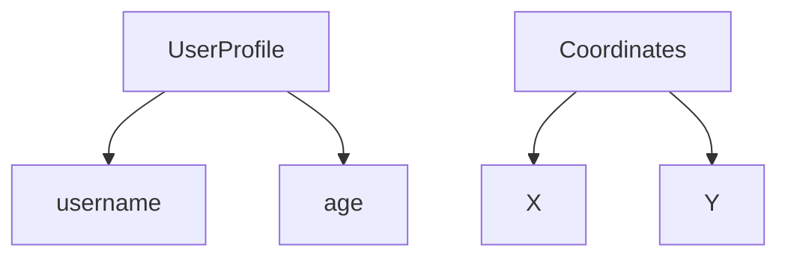
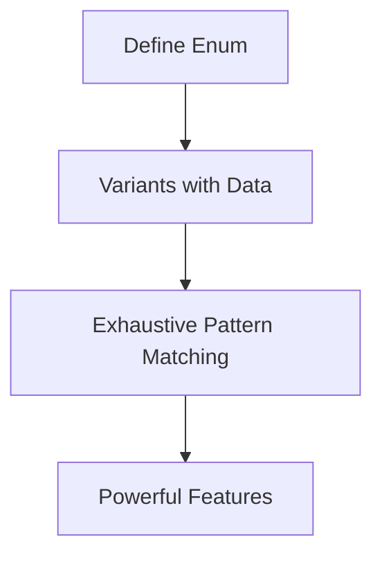
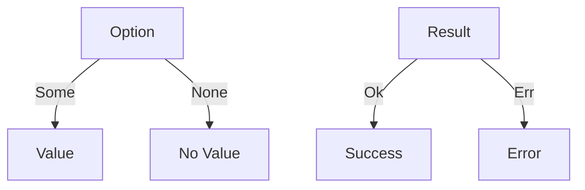
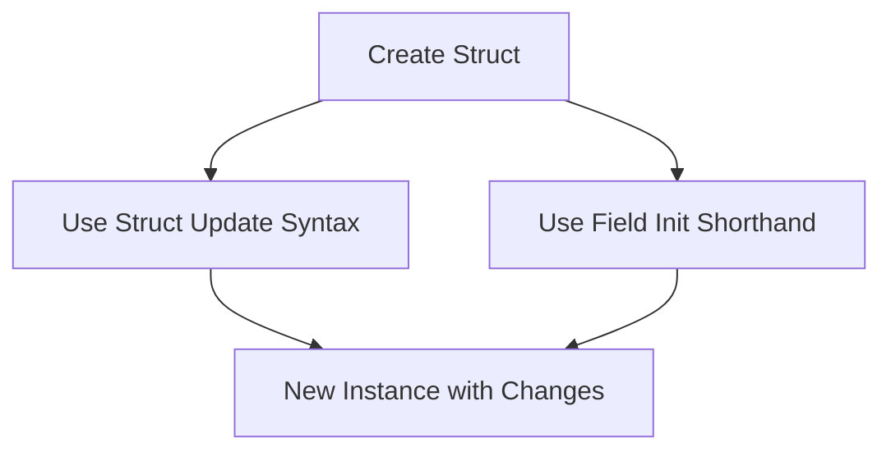
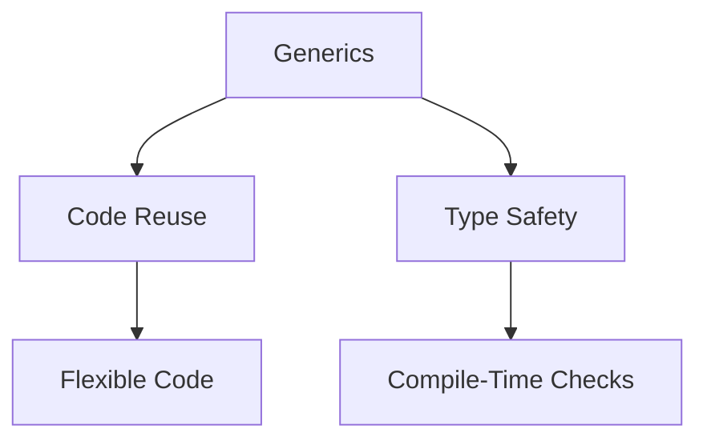

Error: API request failed with error: 401 Client Error: Unauthorized for url: https://openrouter.ai/api/v1/chat/completions

# <span style="color:#e67e22;">What we will learn in this post?</span>
<ul style='list-style-type: none; padding-left: 0;'>
<li><span style='color: #2980b9; font-size: 20px; font-weight: bold;'>👉</span> <span style='color: #2ecc71; font-size: 18px; font-weight: bold;'>Defining and Using Structs</span></li>
<li><span style='color: #2980b9; font-size: 20px; font-weight: bold;'>👉</span> <span style='color: #2ecc71; font-size: 18px; font-weight: bold;'>Methods and Associated Functions</span></li>
<li><span style='color: #2980b9; font-size: 20px; font-weight: bold;'>👉</span> <span style='color: #2ecc71; font-size: 18px; font-weight: bold;'>Enums and Pattern Matching</span></li>
<li><span style='color: #2980b9; font-size: 20px; font-weight: bold;'>👉</span> <span style='color: #2ecc71; font-size: 18px; font-weight: bold;'>Option and Result Deep Dive</span></li>
<li><span style='color: #2980b9; font-size: 20px; font-weight: bold;'>👉</span> <span style='color: #2ecc71; font-size: 18px; font-weight: bold;'>Struct Update Syntax and Field Init</span></li>
<li><span style='color: #2980b9; font-size: 20px; font-weight: bold;'>👉</span> <span style='color: #2ecc71; font-size: 18px; font-weight: bold;'>Generic Structs and Enums</span></li>
<li><span style='color: #2980b9; font-size: 20px; font-weight: bold;'>👉</span> <span style='color: #2ecc71; font-size: 18px; font-weight: bold;'>Destructuring and Pattern Matching</span></li>
</ul>

# <span style="color:#e67e22">Creating Custom Data Types with Structs</span> 🛠️

## <span style="color:#2980b9">What is a Struct?</span>

A **struct** is a way to group related data together. Think of it like a user profile or coordinates!

### <span style="color:#8e44ad">Named Fields</span>

Structs have named fields, making it easy to understand what each piece of data represents.

```rust
struct UserProfile {
    username: String,
    age: u32,
}
```

### <span style="color:#8e44ad">Instantiation</span>

You create a struct by providing values for its fields.

```rust
let user = UserProfile {
    username: String::from("Alice"),
    age: 30,
};
```

### <span style="color:#8e44ad">Accessing Fields</span>

You can access fields using the dot notation.

```rust
println!("Username: {}", user.username); // Output: Username: Alice
```

### <span style="color:#8e44ad">Tuple Struct Variant</span>

You can also create structs without named fields, like this:

```rust
struct Coordinates(f64, f64);

let point = Coordinates(10.0, 20.0);
println!("X: {}, Y: {}", point.0, point.1); // Output: X: 10, Y: 20
```

## <span style="color:#2980b9">Why Use Structs?</span>

- **Organize Data**: Group related information together.
- **Readability**: Named fields make your code easier to understand.

For more information, check out [Rust Documentation on Structs](https://doc.rust-lang.org/book/ch05-01-defining-structs.html).



Happy coding! 😊

# <span style="color:#e67e22">Adding Methods to Structs in Rust</span>

In Rust, you can add methods to structs using `impl` blocks. This is a great way to organize behavior related to your data. Let’s break it down! 😊

## <span style="color:#2980b9">Understanding `impl` Blocks</span>

An `impl` block allows you to define methods for a struct. Here’s how you can do it:

```rust
struct Circle {
    radius: f64,
}

impl Circle {
    // Constructor
    fn new(radius: f64) -> Circle {
        Circle { radius }
    }

    // Method with &self
    fn area(&self) -> f64 {
        std::f64::consts::PI * self.radius * self.radius
    }

    // Method with &mut self
    fn set_radius(&mut self, radius: f64) {
        self.radius = radius;
    }
}
```

### <span style="color:#8e44ad">Parameter Types Explained</span>

- **`&self`**: This is a reference to the instance of the struct. You can read its data but not change it.
- **`&mut self`**: This allows you to change the struct’s data. Use this when you need to modify the instance.
- **`self`**: This takes ownership of the instance. It’s used when you want to consume the struct.

### <span style="color:#2980b9">Organizing Behavior</span>

Using methods helps keep your code clean and organized. For example, you can create a `Circle` and easily calculate its area or change its radius:

```rust
fn main() {
    let mut circle = Circle::new(5.0);
    println!("Area: {}", circle.area());
    circle.set_radius(10.0);
    println!("New Area: {}", circle.area());
}
```

### <span style="color:#8e44ad">Resources</span>

- [Rust Documentation on Structs](https://doc.rust-lang.org/book/ch05-01-defining-structs.html)
- [Rust Documentation on Methods](https://doc.rust-lang.org/book/ch10-03-lifetime-syntax.html)

Feel free to explore and have fun with Rust! 🚀

# <span style="color:#e67e22">Understanding Enums in Programming</span>

Enums, short for *enumerations*, are a powerful feature in many programming languages, allowing you to define a type that can have several variants. Let's explore how to define enums, use variants with data, and perform exhaustive pattern matching.

## <span style="color:#2980b9">Defining Enums</span>

In many languages, you can define an enum like this:

```rust
enum TrafficLight {
    Red,
    Yellow,
    Green,
}
```

### <span style="color:#8e44ad">Variants with Data</span>

Enums can also hold data. For example, consider a `Shape` enum:

```rust
enum Shape {
    Circle(f64), // radius
    Rectangle(f64, f64), // width, height
}
```

### <span style="color:#8e44ad">Exhaustive Pattern Matching</span>

You can use `match` to handle each variant:

```rust
fn area(shape: Shape) -> f64 {
    match shape {
        Shape::Circle(radius) => std::f64::consts::PI * radius * radius,
        Shape::Rectangle(width, height) => width * height,
    }
}
```

This ensures you handle every possible variant, making your code safer and more reliable.

## <span style="color:#2980b9">Why Enums Are Powerful</span>

- **Type Safety**: Enums prevent invalid values.
- **Clear Intent**: They make your code easier to understand.
- **Pattern Matching**: You can handle different cases cleanly.

### <span style="color:#8e44ad">Real-World Example</span>

Think of a **payment method**:

```rust
enum PaymentMethod {
    CreditCard(String), // card number
    PayPal(String), // email
    Cash,
}
```

Using enums, you can easily manage different payment types in your application.

For more information, check out [Rust Enums Documentation](https://doc.rust-lang.org/book/ch06-01-defining-an-enum.html).



Enums are a fantastic way to manage complex data types in a clear and safe manner! 😊

# <span style="color:#e67e22">Understanding Option<T> and Result<T, E> in Rust</span>

## <span style="color:#2980b9">What are Enums?</span>

Enums in Rust are special types that can hold different values. Two important enums are **`Option<T>`** and **`Result<T, E>`**.

### <span style="color:#8e44ad">Option<T></span>

- **Purpose**: Represents an optional value.
- **Variants**:
  - `Some(value)`: Contains a value.
  - `None`: No value.

**Example**:
```rust
let maybe_number: Option<i32> = Some(5);
```

### <span style="color:#8e44ad">Result<T, E></span>

- **Purpose**: Represents a value that can be successful or an error.
- **Variants**:
  - `Ok(value)`: Successful result.
  - `Err(error)`: Error occurred.

**Example**:
```rust
let result: Result<i32, &str> = Ok(10);
```

## <span style="color:#2980b9">Combinators and Chaining</span>

### <span style="color:#8e44ad">Using Combinators</span>

- **`map`**: Transforms the value inside `Option` or `Result`.
- **`and_then`**: Chains operations that return `Option` or `Result`.
- **`unwrap_or`**: Provides a default value if `None` or `Err`.

**Example**:
```rust
let value = Some(3).map(|x| x * 2); // Some(6)
let result = Ok(5).and_then(|x| Ok(x + 5)); // Ok(10)
let default_value = None.unwrap_or(10); // 10
```

### <span style="color:#8e44ad">Using the `?` Operator</span>

The `?` operator simplifies error handling. It returns the value if `Ok`, or returns the error if `Err`.

**Example**:
```rust
fn get_value() -> Result<i32, &str> {
    let value = Ok(5)?;
    Ok(value + 5)
}
```

## <span style="color:#2980b9">Visual Summary</span>



## <span style="color:#2980b9">Learn More</span>

- [Rust Documentation on Option](https://doc.rust-lang.org/std/option/)
- [Rust Documentation on Result](https://doc.rust-lang.org/std/result/)

By understanding **`Option<T>`** and **`Result<T, E>`**, you can handle optional values and errors effectively in Rust! Happy coding! 😊

# <span style="color:#e67e22">Convenient Rust Syntax</span> 🚀

## <span style="color:#2980b9">Struct Update Syntax</span> 🛠️

In Rust, you can create a new struct instance based on an existing one using **struct update syntax**. This is super handy when you want to change just a few fields.

### Example:

```rust
struct Person {
    name: String,
    age: u32,
}

let alice = Person {
    name: String::from("Alice"),
    age: 30,
};

// Create a new instance based on `alice`
let bob = Person {
    age: 25, // Change only the age
    ..alice  // Use the rest from `alice`
};
```

Here, `bob` gets all the fields from `alice`, except for the `age`, which we set to `25`. This reduces boilerplate code and keeps things clean! ✨

## <span style="color:#2980b9">Field Init Shorthand</span> ✨

When the variable names match the field names, you can use **field init shorthand**. This means you don’t have to repeat yourself!

### Example:

```rust
let name = String::from("Charlie");
let age = 28;

let charlie = Person { name, age }; // No need to write `name: name, age: age`
```

### Benefits:

- **Less code**: Reduces repetition.
- **More readable**: Makes your code cleaner and easier to understand.

For more details, check out the [Rust Book](https://doc.rust-lang.org/book/ch05-01-defining-structs.html).

### Flowchart of Struct Creation



Using these features makes your Rust code more efficient and enjoyable to write! Happy coding! 🎉

# <span style="color:#e67e22">Making Structs and Enums Generic in Rust</span>

Generics in Rust allow you to create flexible and reusable code. By using type parameters like `<T>`, you can define structs and enums that work with any data type.

## <span style="color:#2980b9">What are Type Parameters?</span>

Type parameters are placeholders for types. When you define a struct or enum with a type parameter, you can use it with different types without rewriting the code.

### <span style="color:#8e44ad">Example of a Generic Struct</span>

```rust
// A generic struct that holds a value of any type T
struct Wrapper<T> {
    value: T,
}

fn main() {
    let int_wrapper = Wrapper { value: 42 }; // Holds an integer
    let str_wrapper = Wrapper { value: "Hello" }; // Holds a string
}
```

### <span style="color:#8e44ad">Example of a Generic Enum</span>

```rust
// A generic enum that can hold different types of values
enum Option<T> {
    Some(T),
    None,
}

fn main() {
    let some_number = Option::Some(10); // Holds an integer
    let no_value: Option<i32> = Option::None; // No value
}
```

## <span style="color:#2980b9">When are Generics Useful?</span>

- **Code Reuse**: Write once, use with any type.
- **Type Safety**: Ensures that the types are correct at compile time.

Generics help you write cleaner and more efficient code while keeping it safe! For more information, check out the [Rust Book](https://doc.rust-lang.org/book/ch10-00-generics.html).



Happy coding! 😊

# <span style="color:#e67e22">Advanced Pattern Matching Techniques</span> 🎉

Pattern matching is a powerful feature in programming languages like Rust. Let’s explore some advanced techniques that can make your code cleaner and more efficient!

## <span style="color:#2980b9">Destructuring Structs and Enums</span> 📦

Destructuring allows you to break down complex data types easily.

```rust
struct Point { x: i32, y: i32 }
let point = Point { x: 10, y: 20 };
let Point { x, y } = point; // Now x = 10, y = 20
```

### <span style="color:#8e44ad">Use Case</span> 🌟

Use destructuring to extract values from a struct when you need to work with them individually.

## <span style="color:#2980b9">@ Bindings</span> 🔗

The `@` symbol lets you bind a value while also matching it.

```rust
let value = Some(5);
match value {
    Some(x @ 1..=10) => println!("Value is in range: {}", x),
    _ => println!("Out of range"),
}
```

### <span style="color:#8e44ad">Use Case</span> 🚀

This is great for validating ranges while keeping the matched value.

## <span style="color:#2980b9">Ignoring Values with `_`</span> 🚫

Use `_` to ignore values you don’t need.

```rust
match (1, 2, 3) {
    (x, _, z) => println!("x: {}, z: {}", x, z),
}
```

### <span style="color:#8e44ad">Use Case</span> 🎯

This helps focus on the values you care about without cluttering your code.

## <span style="color:#2980b9">Matching Guards</span> 🛡️

Add conditions to your matches for more control.

```rust
let number = 7;
match number {
    n if n % 2 == 0 => println!("Even"),
    _ => println!("Odd"),
}
```

### <span style="color:#8e44ad">Use Case</span> 🔍

Use guards to add logic to your matches, making them more dynamic.

## <span style="color:#2980b9">Nested Patterns</span> 🏰

You can match patterns within patterns!

```rust
let tuple = ((1, 2), (3, 4));
match tuple {
    ((x, y), (z, _)) => println!("x: {}, y: {}, z: {}", x, y, z),
}
```

### <span style="color:#8e44ad">Use Case</span> 🧩

This is useful for complex data structures, allowing you to extract multiple values at once.

---

For more information, check out the [Rust Documentation](https://doc.rust-lang.org/book/ch18-00-patterns.html) on patterns!

Happy coding! 😊

