<!--
meta-description: "Master Rust structs and enums for memory-safe systems programming. Learn custom types, pattern matching with exhaustive handling, Option and Result error handling, generic structs, field initialization, and advanced destructuring techniques."
keywords: "Rust structs, Rust enums, pattern matching, Option Result, Rust generics, struct methods, impl blocks, destructuring, Rust type system, error handling, memory safety, systems programming"
-->

# <span style="color:#e67e22;">What we will learn in this post?</span>
<ul style='list-style-type: none; padding-left: 0;'>
<li><span style='color: #2980b9; font-size: 20px; font-weight: bold;'>👉</span> <span style='color: #2ecc71; font-size: 18px; font-weight: bold;'>Defining and Using Structs</span></li>
<li><span style='color: #2980b9; font-size: 20px; font-weight: bold;'>👉</span> <span style='color: #2ecc71; font-size: 18px; font-weight: bold;'>Methods and Associated Functions</span></li>
<li><span style='color: #2980b9; font-size: 20px; font-weight: bold;'>👉</span> <span style='color: #2ecc71; font-size: 18px; font-weight: bold;'>Enums and Pattern Matching</span></li>
<li><span style='color: #2980b9; font-size: 20px; font-weight: bold;'>👉</span> <span style='color: #2ecc71; font-size: 18px; font-weight: bold;'>Option and Result Deep Dive</span></li>
<li><span style='color: #2980b9; font-size: 20px; font-weight: bold;'>👉</span> <span style='color: #2ecc71; font-size: 18px; font-weight: bold;'>Struct Update Syntax and Field Init</span></li>
<li><span style='color: #2980b9; font-size: 20px; font-weight: bold;'>👉</span> <span style='color: #2ecc71; font-size: 18px; font-weight: bold;'>Generic Structs and Enums</span></li>
<li><span style='color: #2980b9; font-size: 20px; font-weight: bold;'>👉</span> <span style='color: #2ecc71; font-size: 18px; font-weight: bold;'>Destructuring and Pattern Matching</span></li>
</ul>

# <span style="color:#e67e22">Creating Custom Data Types with Structs</span> 🛠️

Structs are the foundation of Rust's type system, used by companies like Mozilla and AWS to build memory-safe systems where bugs are eliminated at compile time. They let you group related data and behavior together, replacing error-prone manual data handling with type-safe abstractions.

## <span style="color:#2980b9">What is a Struct?</span>

A **struct** is a way to group related data together. Think of it like a user profile or coordinates!

### <span style="color:#8e44ad">Named Fields</span>

Structs have named fields, making it easy to understand what each piece of data represents.

```rust
struct UserProfile {
    username: String,
    age: u32,
}
```

### <span style="color:#8e44ad">Instantiation</span>

You create a struct by providing values for its fields.

```rust
let user = UserProfile {
    username: String::from("Alice"),
    age: 30,
};
```

### <span style="color:#8e44ad">Accessing Fields</span>

You can access fields using the dot notation.

```rust
println!("Username: {}", user.username); // Output: Username: Alice
```

### <span style="color:#8e44ad">Tuple Struct Variant</span>

You can also create structs without named fields, like this:

```rust
struct Coordinates(f64, f64);

let point = Coordinates(10.0, 20.0);
println!("X: {}, Y: {}", point.0, point.1); // Output: X: 10, Y: 20
```

## <span style="color:#2980b9">Why Use Structs?</span>

- **Organize Data**: Group related information together.
- **Readability**: Named fields make your code easier to understand.

```mermaid
graph TD
    A["📦 UserProfile"]:::style1 --> B["👤 username"]:::style2
    A --> C["🎂 age"]:::style3
    D["📋 Coordinates"]:::style4 --> E["➡️ X"]:::style5
    D --> F["⬆️ Y"]:::style2

    classDef style1 fill:#ff6b6b,stroke:#c92a2a,color:#fff,font-size:16px,stroke-width:3px,rx:14,shadow:6px;
    classDef style2 fill:#6b5bff,stroke:#4a3f6b,color:#fff,font-size:16px,stroke-width:3px,rx:14,shadow:6px;
    classDef style3 fill:#43e97b,stroke:#38f9d7,color:#fff,font-size:16px,stroke-width:3px,rx:14,shadow:6px;
    classDef style4 fill:#ffd700,stroke:#d99120,color:#222,font-size:16px,stroke-width:3px,rx:14,shadow:6px;
    classDef style5 fill:#00bfae,stroke:#005f99,color:#fff,font-size:16px,stroke-width:3px,rx:14,shadow:6px;

    linkStyle default stroke:#e67e22,stroke-width:3px;
```



Happy coding! 😊

# <span style="color:#e67e22">Adding Methods to Structs in Rust</span>

In Rust, you can add methods to structs using `impl` blocks—a pattern used throughout Dropbox's infrastructure to encapsulate behavior with data, preventing bugs by ensuring methods can only operate on valid state. This is a great way to organize behavior related to your data. Let's break it down! 😊

## <span style="color:#2980b9">Understanding `impl` Blocks</span>

An `impl` block allows you to define methods for a struct. Here’s how you can do it:

```rust
struct Circle {
    radius: f64,
}

impl Circle {
    // Constructor
    fn new(radius: f64) -> Circle {
        Circle { radius }
    }

    // Method with &self
    fn area(&self) -> f64 {
        std::f64::consts::PI * self.radius * self.radius
    }

    // Method with &mut self
    fn set_radius(&mut self, radius: f64) {
        self.radius = radius;
    }
}
```

### <span style="color:#8e44ad">Parameter Types Explained</span>

- **`&self`**: This is a reference to the instance of the struct. You can read its data but not change it.
- **`&mut self`**: This allows you to change the struct’s data. Use this when you need to modify the instance.
- **`self`**: This takes ownership of the instance. It’s used when you want to consume the struct.

### <span style="color:#2980b9">Organizing Behavior</span>

Using methods helps keep your code clean and organized. For example, you can create a `Circle` and easily calculate its area or change its radius:

```rust
fn main() {
    let mut circle = Circle::new(5.0);
    println!("Area: {}", circle.area());
    circle.set_radius(10.0);
    println!("New Area: {}", circle.area());
}
```
# <span style="color:#e67e22">Understanding Enums in Programming</span>

Enums in Rust are far more powerful than in other languages—Discord uses them extensively for managing game state transitions and message variants at scale, ensuring exhaustive handling prevents runtime crashes. They allow you to define a type that can have several variants with associated data. Let's explore how to define enums, use variants with data, and perform exhaustive pattern matching.

## <span style="color:#2980b9">Defining Enums</span>

In many languages, you can define an enum like this:

```rust
enum TrafficLight {
    Red,
    Yellow,
    Green,
}
```

### <span style="color:#8e44ad">Variants with Data</span>

Enums can also hold data. For example, consider a `Shape` enum:

```rust
enum Shape {
    Circle(f64), // radius
    Rectangle(f64, f64), // width, height
}
```

### <span style="color:#8e44ad">Exhaustive Pattern Matching</span>

You can use `match` to handle each variant:

```rust
fn area(shape: Shape) -> f64 {
    match shape {
        Shape::Circle(radius) => std::f64::consts::PI * radius * radius,
        Shape::Rectangle(width, height) => width * height,
    }
}
```

This ensures you handle every possible variant, making your code safer and more reliable.

## <span style="color:#2980b9">Why Enums Are Powerful</span>

- **Type Safety**: Enums prevent invalid values.
- **Clear Intent**: They make your code easier to understand.
- **Pattern Matching**: You can handle different cases cleanly.

### <span style="color:#8e44ad">Real-World Example</span>

Think of a **payment method**:

```rust
enum PaymentMethod {
    CreditCard(String), // card number
    PayPal(String), // email
    Cash,
}
```

Using enums, you can easily manage different payment types in your application.

```mermaid
graph TD
    A["🏢 Define Enum"]:::style1 --> B["📦 Variants with Data"]:::style2
    B --> C["🔍 Exhaustive Matching"]:::style3
    C --> D["⚡ Powerful Features"]:::style4
    D --> E["🛡️ Type Safety"]:::style5

    classDef style1 fill:#ff6b6b,stroke:#c92a2a,color:#fff,font-size:16px,stroke-width:3px,rx:14,shadow:6px;
    classDef style2 fill:#6b5bff,stroke:#4a3f6b,color:#fff,font-size:16px,stroke-width:3px,rx:14,shadow:6px;
    classDef style3 fill:#43e97b,stroke:#38f9d7,color:#fff,font-size:16px,stroke-width:3px,rx:14,shadow:6px;
    classDef style4 fill:#ffd700,stroke:#d99120,color:#222,font-size:16px,stroke-width:3px,rx:14,shadow:6px;
    classDef style5 fill:#00bfae,stroke:#005f99,color:#fff,font-size:16px,stroke-width:3px,rx:14,shadow:6px;

    linkStyle default stroke:#e67e22,stroke-width:3px;
```




Enums are a fantastic way to manage complex data types in a clear and safe manner! 😊

# <span style="color:#e67e22">Understanding Option<T> and Result<T, E> in Rust</span>

Option and Result are the cornerstones of Rust's error handling strategy—used by companies like AWS in their SDKs to guarantee no null pointer exceptions or uncaught errors reach production. These enums replace the billion-dollar mistake of null references with explicit, type-safe alternatives.

## <span style="color:#2980b9">What are Enums?</span>

Enums in Rust are special types that can hold different values. Two important enums are **`Option<T>`** and **`Result<T, E>`**.

### <span style="color:#8e44ad">Option<T></span>

- **Purpose**: Represents an optional value.
- **Variants**:
  - `Some(value)`: Contains a value.
  - `None`: No value.

**Example**:
```rust
let maybe_number: Option<i32> = Some(5);
```

### <span style="color:#8e44ad">Result<T, E></span>

- **Purpose**: Represents a value that can be successful or an error.
- **Variants**:
  - `Ok(value)`: Successful result.
  - `Err(error)`: Error occurred.

**Example**:
```rust
let result: Result<i32, &str> = Ok(10);
```

## <span style="color:#2980b9">Combinators and Chaining</span>

### <span style="color:#8e44ad">Using Combinators</span>

- **`map`**: Transforms the value inside `Option` or `Result`.
- **`and_then`**: Chains operations that return `Option` or `Result`.
- **`unwrap_or`**: Provides a default value if `None` or `Err`.

**Example**:
```rust
let value = Some(3).map(|x| x * 2); // Some(6)
let result = Ok(5).and_then(|x| Ok(x + 5)); // Ok(10)
let default_value = None.unwrap_or(10); // 10
```

### <span style="color:#8e44ad">Using the `?` Operator</span>

The `?` operator simplifies error handling. It returns the value if `Ok`, or returns the error if `Err`.

**Example**:
```rust
fn get_value() -> Result<i32, &str> {
    let value = Ok(5)?;
    Ok(value + 5)
}
```

## <span style="color:#2980b9">Visual Summary</span>



# <span style="color:#e67e22">Convenient Rust Syntax</span> 🚀

```mermaid
flowchart TD
    A["🎁 Option<T>"]:::style1 -->|Some| B["✅ Value"]:::style2
    A -->|None| C["❌ No Value"]:::style3
    D["📋 Result<T, E>"]:::style4 -->|Ok| E["✨ Success"]:::style5
    D -->|Err| F["⚠️ Error"]:::style2

    classDef style1 fill:#ff6b6b,stroke:#c92a2a,color:#fff,font-size:16px,stroke-width:3px,rx:14,shadow:6px;
    classDef style2 fill:#6b5bff,stroke:#4a3f6b,color:#fff,font-size:16px,stroke-width:3px,rx:14,shadow:6px;
    classDef style3 fill:#43e97b,stroke:#38f9d7,color:#fff,font-size:16px,stroke-width:3px,rx:14,shadow:6px;
    classDef style4 fill:#ffd700,stroke:#d99120,color:#222,font-size:16px,stroke-width:3px,rx:14,shadow:6px;
    classDef style5 fill:#00bfae,stroke:#005f99,color:#fff,font-size:16px,stroke-width:3px,rx:14,shadow:6px;

    linkStyle default stroke:#e67e22,stroke-width:3px;
```

Rust's expressive syntax for struct updates and field initialization—adopted by companies like Figma for building performant collaborative tools—reduces boilerplate while maintaining memory safety. These patterns are essential for writing idiomatic, maintainable Rust code.

## <span style="color:#2980b9">Struct Update Syntax</span> 🛠️

In Rust, you can create a new struct instance based on an existing one using **struct update syntax**. This is super handy when you want to change just a few fields.

### Example:

```rust
struct Person {
    name: String,
    age: u32,
}

let alice = Person {
    name: String::from("Alice"),
    age: 30,
};

// Create a new instance based on `alice`
let bob = Person {
    age: 25, // Change only the age
    ..alice  // Use the rest from `alice`
};
```

Here, `bob` gets all the fields from `alice`, except for the `age`, which we set to `25`. This reduces boilerplate code and keeps things clean! ✨

## <span style="color:#2980b9">Field Init Shorthand</span> ✨

When the variable names match the field names, you can use **field init shorthand**. This means you don’t have to repeat yourself!

### Example:

```rust
let name = String::from("Charlie");
let age = 28;

let charlie = Person { name, age }; // No need to write `name: name, age: age`
```

### Benefits:

- **Less code**: Reduces repetition.
- **More readable**: Makes your code cleaner and easier to understand.

### Flowchart of Struct Creation

```mermaid
flowchart TD
    A["🏗️ Create Struct"]:::style1 --> B["🔄 Struct Update"]:::style2
    A --> C["📝 Field Init"]:::style3
    B --> D["✨ New Instance"]:::style4
    C --> D

    classDef style1 fill:#ff6b6b,stroke:#c92a2a,color:#fff,font-size:16px,stroke-width:3px,rx:14,shadow:6px;
    classDef style2 fill:#6b5bff,stroke:#4a3f6b,color:#fff,font-size:16px,stroke-width:3px,rx:14,shadow:6px;
    classDef style3 fill:#43e97b,stroke:#38f9d7,color:#fff,font-size:16px,stroke-width:3px,rx:14,shadow:6px;
    classDef style4 fill:#ffd700,stroke:#d99120,color:#222,font-size:16px,stroke-width:3px,rx:14,shadow:6px;

    linkStyle default stroke:#e67e22,stroke-width:3px;
```



Using these features makes your Rust code more efficient and enjoyable to write! Happy coding! 🎉

# <span style="color:#e67e22">Making Structs and Enums Generic in Rust</span>

Generics in Rust are zero-cost abstractions—companies like Tokio use them extensively to create highly performant async runtimes without runtime overhead. By using type parameters like `<T>`, you can define structs and enums that work with any data type while maintaining compile-time safety.

## <span style="color:#2980b9">What are Type Parameters?</span>

Type parameters are placeholders for types. When you define a struct or enum with a type parameter, you can use it with different types without rewriting the code.

### <span style="color:#8e44ad">Example of a Generic Struct</span>

```rust
// A generic struct that holds a value of any type T
struct Wrapper<T> {
    value: T,
}

fn main() {
    let int_wrapper = Wrapper { value: 42 }; // Holds an integer
    let str_wrapper = Wrapper { value: "Hello" }; // Holds a string
}
```

### <span style="color:#8e44ad">Example of a Generic Enum</span>

```rust
// A generic enum that can hold different types of values
enum Option<T> {
    Some(T),
    None,
}

fn main() {
    let some_number = Option::Some(10); // Holds an integer
    let no_value: Option<i32> = Option::None; // No value
}
```

## <span style="color:#2980b9">When are Generics Useful?</span>

- **Code Reuse**: Write once, use with any type.
- **Type Safety**: Ensures that the types are correct at compile time.

```mermaid
graph TD
    A["⚙️ Generics"]:::style1 --> B["♻️ Code Reuse"]:::style2
    A --> C["🛡️ Type Safety"]:::style3
    B --> D["🔧 Flexible Code"]:::style4
    C --> E["✅ Compile-Time Checks"]:::style5

    classDef style1 fill:#ff6b6b,stroke:#c92a2a,color:#fff,font-size:16px,stroke-width:3px,rx:14,shadow:6px;
    classDef style2 fill:#6b5bff,stroke:#4a3f6b,color:#fff,font-size:16px,stroke-width:3px,rx:14,shadow:6px;
    classDef style3 fill:#43e97b,stroke:#38f9d7,color:#fff,font-size:16px,stroke-width:3px,rx:14,shadow:6px;
    classDef style4 fill:#ffd700,stroke:#d99120,color:#222,font-size:16px,stroke-width:3px,rx:14,shadow:6px;
    classDef style5 fill:#00bfae,stroke:#005f99,color:#fff,font-size:16px,stroke-width:3px,rx:14,shadow:6px;

    linkStyle default stroke:#e67e22,stroke-width:3px;
```




Happy coding! 😊

# <span style="color:#e67e22">Advanced Pattern Matching Techniques</span> 🎉

Pattern matching in Rust is exhaustive by design—Mozilla's Rust compiler literally prevents you from forgetting a case, eliminating entire classes of bugs that plague other systems languages. Let's explore some advanced techniques that can make your code cleaner and more efficient!

## <span style="color:#2980b9">Destructuring Structs and Enums</span> 📦

Destructuring allows you to break down complex data types easily.

```rust
struct Point { x: i32, y: i32 }
let point = Point { x: 10, y: 20 };
let Point { x, y } = point; // Now x = 10, y = 20
```

### <span style="color:#8e44ad">Use Case</span> 🌟

Use destructuring to extract values from a struct when you need to work with them individually.

## <span style="color:#2980b9">@ Bindings</span> 🔗

The `@` symbol lets you bind a value while also matching it.

```rust
let value = Some(5);
match value {
    Some(x @ 1..=10) => println!("Value is in range: {}", x),
    _ => println!("Out of range"),
}
```

### <span style="color:#8e44ad">Use Case</span> 🚀

This is great for validating ranges while keeping the matched value.

## <span style="color:#2980b9">Ignoring Values with `_`</span> 🚫

Use `_` to ignore values you don’t need.

```rust
match (1, 2, 3) {
    (x, _, z) => println!("x: {}, z: {}", x, z),
}
```

### <span style="color:#8e44ad">Use Case</span> 🎯

This helps focus on the values you care about without cluttering your code.

## <span style="color:#2980b9">Matching Guards</span> 🛡️

Add conditions to your matches for more control.

```rust
let number = 7;
match number {
    n if n % 2 == 0 => println!("Even"),
    _ => println!("Odd"),
}
```

### <span style="color:#8e44ad">Use Case</span> 🔍

Use guards to add logic to your matches, making them more dynamic.

## <span style="color:#2980b9">Nested Patterns</span> 🏰

You can match patterns within patterns!

```rust
let tuple = ((1, 2), (3, 4));
match tuple {
    ((x, y), (z, _)) => println!("x: {}, y: {}, z: {}", x, y, z),
}
```

### <span style="color:#8e44ad">Use Case</span> 🧩

This is useful for complex data structures, allowing you to extract multiple values at once.

---

# <span style="color:#e67e22">Real-World Production Examples 🏢</span>

## <span style="color:#2980b9">1. Discord Message Handler with Enums</span> 💬
Discord's bot framework uses exhaustive enums to handle different message types safely:

```rust
enum MessageType {
    Text(String),
    Image(String, u32, u32), // path, width, height
    Embed { title: String, description: String },
    Reaction { emoji: String, count: u32 },
}

fn process_message(msg: MessageType) -> String {
    match msg {
        MessageType::Text(content) => format!("Processing text: {}", content),
        MessageType::Image(path, w, h) => format!("Image {}x{} from {}", w, h, path),
        MessageType::Embed { title, .. } => format!("Embed with title: {}", title),
        MessageType::Reaction { emoji, count } => format!("{} reacted {}", emoji, count),
    }
}
```

## <span style="color:#2980b9">2. AWS SDK Result Type for Error Handling</span> 🔗
AWS SDKs use Result<T, E> extensively to guarantee error safety:

```rust
use std::fmt;

#[derive(Debug)]
struct ApiError {
    code: u32,
    message: String,
}

impl fmt::Display for ApiError {
    fn fmt(&self, f: &mut fmt::Formatter) -> fmt::Result {
        write!(f, "API Error {}: {}", self.code, self.message)
    }
}

fn fetch_resource(id: u32) -> Result<String, ApiError> {
    if id == 0 {
        return Err(ApiError {
            code: 400,
            message: "Invalid ID".to_string(),
        });
    }
    Ok(format!("Resource {}", id))
}

fn main() {
    match fetch_resource(42) {
        Ok(data) => println!("Success: {}", data),
        Err(e) => eprintln!("Failed: {}", e),
    }
}
```

## <span style="color:#2980b9">3. Tokio Async Pattern with Generic Structs</span> ⚡
Tokio uses generic structs for type-safe async operations:

```rust
struct TaskHandler<T> {
    data: T,
    timeout_ms: u64,
}

impl<T: std::fmt::Debug> TaskHandler<T> {
    fn new(data: T, timeout_ms: u64) -> Self {
        TaskHandler { data, timeout_ms }
    }

    fn execute(&self) -> Result<String, &'static str> {
        println!("Processing: {:?}", self.data);
        if self.timeout_ms > 1000 {
            Ok("Completed".to_string())
        } else {
            Err("Timeout exceeded")
        }
    }
}

fn main() {
    let handler = TaskHandler::new(vec![1, 2, 3], 2000);
    match handler.execute() {
        Ok(result) => println!("Result: {}", result),
        Err(e) => println!("Error: {}", e),
    }
}
```

## <span style="color:#2980b9">4. Figma Collaborative State with Struct Updates</span> 🎨
Figma's real-time collaboration uses struct update syntax for efficient state management:

```rust
#[derive(Clone)]
struct Shape {
    id: u32,
    x: f64,
    y: f64,
    width: f64,
    height: f64,
    fill_color: String,
}

fn update_shape_position(shape: Shape, dx: f64, dy: f64) -> Shape {
    Shape {
        x: shape.x + dx,
        y: shape.y + dy,
        ..shape // Efficiently copy remaining fields
    }
}

fn main() {
    let rect = Shape {
        id: 1,
        x: 10.0,
        y: 20.0,
        width: 100.0,
        height: 50.0,
        fill_color: "#ff6b6b".to_string(),
    };

    let moved_rect = update_shape_position(rect, 5.0, 10.0);
    println!("New position: ({}, {})", moved_rect.x, moved_rect.y);
}
```

## <span style="color:#2980b9">5. Mozilla WebAssembly with Option<T></span> 🦀
Mozilla's WASM projects use Option extensively for null-safe code:

```rust
struct User {
    id: u32,
    name: String,
    email: Option<String>,
    phone: Option<String>,
}

impl User {
    fn contact_info(&self) -> String {
        match (&self.email, &self.phone) {
            (Some(email), Some(phone)) => format!("Email: {}, Phone: {}", email, phone),
            (Some(email), None) => format!("Email: {}", email),
            (None, Some(phone)) => format!("Phone: {}", phone),
            (None, None) => "No contact info available".to_string(),
        }
    }
}

fn main() {
    let user = User {
        id: 1,
        name: "Alice".to_string(),
        email: Some("alice@example.com".to_string()),
        phone: None,
    };
    
    println!("{}", user.contact_info());
}
```

## <span style="color:#2980b9">6. Dropbox File System Enum Pattern</span> 📁
Dropbox's file system uses enums for type-safe file operations:

```rust
enum FileEntry {
    File { name: String, size: u64, modified: String },
    Directory { name: String, item_count: u32 },
    Symlink { target: String },
}

fn get_info(entry: &FileEntry) -> String {
    match entry {
        FileEntry::File { name, size, .. } => 
            format!("File: {} ({} bytes)", name, size),
        FileEntry::Directory { name, item_count } => 
            format!("Directory: {} ({} items)", name, item_count),
        FileEntry::Symlink { target } => 
            format!("Link → {}", target),
    }
}

fn main() {
    let file = FileEntry::File {
        name: "document.pdf".to_string(),
        size: 2048000,
        modified: "2026-01-15".to_string(),
    };
    
    println!("{}", get_info(&file));
}
```

---

# <span style="color:#e67e22">Hands-On Assignment: Build a Type-Safe Data Processing Pipeline 🚀</span>

<details open style="border-left: 4px solid #ff6b6b; background: #1b1717; padding: 16px; border-radius: 8px; margin: 20px 0;">
<summary style="cursor: pointer; font-weight: bold; color: #ff6b6b; font-size: 18px;">📋 Your Challenge: Create a Rust Task Management System</summary>

<div style="margin-top: 16px;">

## <span style="color: #ff6b6b;">🎯 Mission</span>
Build a production-ready task management system in Rust that demonstrates mastery of structs, enums, pattern matching, and error handling. Your system must manage different task types, handle errors exhaustively, and use generics for reusable components.

## <span style="color: #ff6b6b;">📋 Requirements</span>

**Core Features** (All Required):
1. **Task Struct** - Define a Task with id, title, description, priority (enum), status (enum)
2. **Status Enum** - Pending, InProgress, Completed, Cancelled with associated data
3. **Priority Enum** - High, Medium, Low with different behaviors
4. **Result Type Error Handling** - Create custom TaskError enum for all operations
5. **Generic Task Container** - Container<T> struct that works with any serializable type
6. **Pattern Matching** - Use exhaustive matching for all enum operations
7. **Option Handling** - Manage optional due dates and assignees
8. **Struct Updates** - Update tasks efficiently using field update syntax

## <span style="color: #ff6b6b;">💡 Hints</span>

- Start with enums for Status and Priority
- Create a TaskError enum with variants for each error type
- Use impl blocks to add methods to Task
- Leverage generics for flexible storage
- Use match for exhaustive enum handling
- Apply the ? operator for error propagation
- Test with realistic data (5+ tasks, multiple status changes)

## <span style="color: #ff6b6b;">📐 Example Project Structure</span>

```
src/
  main.rs
  task.rs (Task struct and impl)
  status.rs (Status enum)
  priority.rs (Priority enum)
  error.rs (TaskError enum)
  container.rs (Generic Container<T>)
```

## <span style="color: #ff6b6b;">🎯 Bonus Challenges</span>

**Level 1** 🟢 Add task filtering by priority
**Level 2** 🟢 Implement task search by title (Option handling)
**Level 3** 🟠 Create task workflow transitions with validation
**Level 4** 🟠 Add recurring tasks with enum variants
**Level 5** 🔴 Implement dependency tracking between tasks
**Level 6** 🔴 Add serialization to JSON with serde (requires generics)

## <span style="color: #ff6b6b;">📚 Learning Goals</span>

After completing this assignment, you will:
- ✓ Understand struct composition and method organization
- ✓ Master exhaustive enum pattern matching
- ✓ Implement proper error handling with Result and custom errors
- ✓ Create reusable code with generics
- ✓ Write production-quality Rust code

## <span style="color: #ff6b6b;">⚡ Pro Tip</span>

Start with just the basic Task struct and Status enum. Get the core match logic working, then add Priority. Once that's solid, introduce generic Container<T>. Finally, refine error handling—that's when your code becomes bulletproof!

## <span style="color: #ff6b6b;">🎓 Call-to-Action</span>

Build this project and commit to GitHub! This assignment teaches you the patterns used in production systems at Mozilla, AWS, Discord, and beyond. Complete it, then extend it with your own ideas. The mastery of structs and enums is what makes Rust developers highly paid and highly valued. **Get coding!** 💪

</div>
</details>

---

# <span style="color:#e67e22">Conclusion: Master Rust Structs and Enums 🎓</span>

Structs and enums are the foundation of Rust's type system—they eliminate entire classes of bugs at compile time that plague other languages, making your systems code safer and more reliable than anything written in C or C++. By mastering these concepts alongside exhaustive pattern matching and error handling with Result and Option, you'll write production-grade systems that power companies from Mozilla to AWS to Discord, scaling from prototypes to millions of users without runtime crashes.

