<!--
meta-description: "Master Rust collections (Vec, HashMap, HashSet, VecDeque, BTreeMap) and iterators. Learn lazy evaluation, iterator adapters, custom iterators, and zero-cost abstractions for efficient functional programming."
keywords: "Rust collections, Vec, HashMap, HashSet, VecDeque, BTreeMap, iterators, lazy evaluation, iterator adapters, custom iterators, functional programming, zero-cost abstractions"
-->

# <span style="color:#e67e22;">What we will learn in this post?</span>
<ul style='list-style-type: none; padding-left: 0;'>
<li><span style='color: #2980b9; font-size: 20px; font-weight: bold;'>👉</span> <span style='color: #2ecc71; font-size: 18px; font-weight: bold;'>Vectors - Dynamic Arrays</span></li>
<li><span style='color: #2980b9; font-size: 20px; font-weight: bold;'>👉</span> <span style='color: #2ecc71; font-size: 18px; font-weight: bold;'>Strings and String Manipulation</span></li>
<li><span style='color: #2980b9; font-size: 20px; font-weight: bold;'>👉</span> <span style='color: #2ecc71; font-size: 18px; font-weight: bold;'>HashMaps for Key-Value Storage</span></li>
<li><span style='color: #2980b9; font-size: 20px; font-weight: bold;'>👉</span> <span style='color: #2ecc71; font-size: 18px; font-weight: bold;'>Iterators and Lazy Evaluation</span></li>
<li><span style='color: #2980b9; font-size: 20px; font-weight: bold;'>👉</span> <span style='color: #2ecc71; font-size: 18px; font-weight: bold;'>Iterator Adapters and Chaining</span></li>
<li><span style='color: #2980b9; font-size: 20px; font-weight: bold;'>👉</span> <span style='color: #2ecc71; font-size: 18px; font-weight: bold;'>Custom Iterators</span></li>
<li><span style='color: #2980b9; font-size: 20px; font-weight: bold;'>👉</span> <span style='color: #2ecc71; font-size: 18px; font-weight: bold;'>HashSet and Other Collections</span></li>
</ul>

# <span style="color:#e67e22">Introduction to Vec<T> in Rust</span> 🌱

Vec<T> is the workhorse of Rust collections—companies like Amazon, Discord, and Mozilla use Vec throughout their codebases because it combines dynamic allocation with predictable performance and memory safety. Understanding Vec deeply gives you the foundation for building high-performance systems at scale.

## <span style="color:#2980b9">Creating Vectors with `vec!` Macro</span> 🎒

You can create a vector using the `vec!` macro. Here’s how:

```rust
// Create a new vector with initial values
let mut numbers = vec![1, 2, 3]; // A backpack with 3 items
```

### <span style="color:#8e44ad">Adding and Removing Items</span> ➕

- **Push**: Add items to the backpack.
  
```rust
numbers.push(4); // Now the backpack has 4 items
```

- **Pop**: Remove the last item from the backpack.

```rust
let last_item = numbers.pop(); // Removes 4, backpack now has 3 items
```

## <span style="color:#2980b9">Accessing Elements Safely</span> 🔍

To access items, use `get()` which is safe and prevents errors:

```rust
if let Some(&number) = numbers.get(1) { // Access the second item
    println!("The second number is: {}", number);
}
```

## <span style="color:#2980b9">Iterating Through Vectors</span> 🔄

You can easily go through each item in your backpack:

```rust
for number in &numbers { // Borrowing items
    println!("{}", number);
}
```

## <span style="color:#2980b9">When Do Vectors Reallocate?</span> 🔄

Vectors may **reallocate** when they run out of space. Imagine your backpack is full, and you find a new item. It will expand to fit more items!

# <span style="color:#e67e22">String Operations in Rust</span>

Rust's String type is designed for safety first—the strict UTF-8 validation prevents the encoding bugs that plague systems written in C. Companies like Cloudflare and Mozilla built critical infrastructure using Rust's ownership model for strings, eliminating entire classes of buffer overflow vulnerabilities.

## <span style="color:#2980b9">Creating Strings</span>

You can create a string in Rust using the `String` type. Here’s how:

```rust
let mut my_string = String::new(); // Create an empty string
my_string.push_str("Hello, "); // Append a string slice
my_string.push_str("world!"); // Append another string slice
```

## <span style="color:#2980b9">Concatenation</span>

You can concatenate strings easily:

```rust
let greeting = String::from("Hello, ");
let name = String::from("Alice");
let message = greeting + &name; // Note the & operator
```

## <span style="color:#2980b9">Slicing Safely</span>

Rust is strict about string indexing because it uses UTF-8 encoding. This means that not all characters are the same length. For example, the character "é" takes more bytes than "a". 

To slice safely, always use:

```rust
let my_string = String::from("Hello, world!");
let slice = &my_string[0..5]; // "Hello"
```

### <span style="color:#8e44ad">Common Methods</span>

- **`len()`**: Get the length of the string.
- **`contains()`**: Check if a substring exists.
- **`replace()`**: Replace parts of the string.

## <span style="color:#2980b9">Why Rust's String Indexing is Strict</span>

Rust’s strictness prevents errors that can occur with invalid UTF-8 sequences. This ensures that your program is safe and efficient. 

### Flowchart of String Operations

```mermaid
flowchart TD
    A["📝 Create String"]:::style1 --> B["➕ Append (push_str)"]:::style2
    B --> C["🔗 Concatenate"]:::style3
    C --> D["✂️ Slicing"]:::style4
    D --> E["🔧 Methods"]:::style5

    classDef style1 fill:#ff6b6b,stroke:#c92a2a,color:#fff,font-size:16px,stroke-width:3px,rx:14,shadow:6px;
    classDef style2 fill:#6b5bff,stroke:#4a3f6b,color:#fff,font-size:16px,stroke-width:3px,rx:14,shadow:6px;
    classDef style3 fill:#43e97b,stroke:#38f9d7,color:#fff,font-size:16px,stroke-width:3px,rx:14,shadow:6px;
    classDef style4 fill:#ffd700,stroke:#d99120,color:#222,font-size:16px,stroke-width:3px,rx:14,shadow:6px;
    classDef style5 fill:#00bfae,stroke:#005f99,color:#fff,font-size:16px,stroke-width:3px,rx:14,shadow:6px;

    linkStyle default stroke:#e67e22,stroke-width:3px;
```



Happy coding! 🎉

# <span style="color:#e67e22">Understanding HashMap<K, V> for Key-Value Pairs</span>

HashMap is used everywhere—Stripe uses HashMap for transaction tracking, GitHub for repository metadata caching, and Google for their internal services. The O(1) average access time makes it essential for building scalable systems where latency matters.

A **HashMap** is a data structure that stores data in **key-value pairs**. It allows you to quickly find a value based on its key. Think of it like a dictionary where you look up a word (key) to find its meaning (value).

### <span style="color:#8e44ad">Basic Operations</span>

- **Insert**: Add a new key-value pair.
  ```java
  HashMap<String, Integer> map = new HashMap<>();
  map.put("apple", 1);
  ```

- **Get**: Retrieve a value using its key.
  ```java
  int count = map.get("apple"); // returns 1
  ```

- **Entry API**: Useful for complex updates and iteration.
  ```java
  for (Map.Entry<String, Integer> entry : map.entrySet()) {
      System.out.println(entry.getKey() + ": " + entry.getValue());
  }
  ```

## <span style="color:#2980b9">Practical Use Case: Counting Word Frequencies</span>

Imagine you want to count how many times each word appears in a sentence. A HashMap is perfect for this!

```java
String sentence = "hello world hello";
HashMap<String, Integer> wordCount = new HashMap<>();

for (String word : sentence.split(" ")) {
    wordCount.put(word, wordCount.getOrDefault(word, 0) + 1);
}
```

### <span style="color:#8e44ad">Ownership Considerations</span>

- **Mutability**: HashMaps can change, so be careful when sharing them across threads.
- **Memory**: They can consume more memory than other collections, so use them wisely.

## <span style="color:#2980b9">Conclusion</span>

HashMaps are powerful tools for managing key-value pairs efficiently. Whether counting words or storing user data, they simplify complex tasks. 

```mermaid
graph TD
    A["🗺️ HashMap"]:::style1 --> B["➕ Insert"]:::style2
    A --> C["🔍 Get"]:::style3
    A --> D["📋 Entry API"]:::style4
    B --> E["💾 Key-Value"]:::style5
    C --> F["✨ Retrieve"]:::style2
    D --> G["🔄 Iterate"]:::style3

    classDef style1 fill:#ff6b6b,stroke:#c92a2a,color:#fff,font-size:16px,stroke-width:3px,rx:14,shadow:6px;
    classDef style2 fill:#6b5bff,stroke:#4a3f6b,color:#fff,font-size:16px,stroke-width:3px,rx:14,shadow:6px;
    classDef style3 fill:#43e97b,stroke:#38f9d7,color:#fff,font-size:16px,stroke-width:3px,rx:14,shadow:6px;
    classDef style4 fill:#ffd700,stroke:#d99120,color:#222,font-size:16px,stroke-width:3px,rx:14,shadow:6px;
    classDef style5 fill:#00bfae,stroke:#005f99,color:#fff,font-size:16px,stroke-width:3px,rx:14,shadow:6px;
```


Happy coding! 😊

# <span style="color:#e67e22">Rust's Powerful Iterator Pattern</span>

Iterators are Rust's secret weapon for functional programming—they're zero-cost abstractions used throughout Tokio, the async runtime powering services at Amazon and Netflix. The compiler eliminates the abstraction completely, making your code both expressive and blazingly fast.

In Rust, an **iterator** is a way to process a sequence of items one at a time. The **Iterator trait** provides methods to traverse collections like arrays and vectors.

### <span style="color:#8e44ad">Key Methods</span>

- **`iter()`**: Creates an iterator from a collection.
- **`collect()`**: Gathers items into a collection (like a vector).
- **`fold()`**: Combines items using a function, starting with an initial value.
- **`sum()`**: Adds up all items in an iterator.

## <span style="color:#2980b9">Zero-Cost Abstractions</span>

Rust's iterators are **zero-cost abstractions**, meaning they don't add extra overhead. The compiler optimizes them away, making your code efficient without sacrificing readability.

### <span style="color:#8e44ad">Why Use Iterators?</span>

- **Concise Code**: Write less code to achieve the same result.
- **Functional Style**: Embrace functional programming with methods like `map`, `filter`, and `reduce`.
- **Safety**: Rust ensures memory safety, preventing common bugs.

## <span style="color:#2980b9">Example</span>

Here's a simple example of using iterators in Rust:

```rust
let numbers = vec![1, 2, 3, 4, 5];
let sum: i32 = numbers.iter().sum();
println!("The sum is: {}", sum);
```

---

By using iterators, Rust makes functional programming efficient and enjoyable! 🎉

# <span style="color:#e67e22">Iterator Methods</span> 🚀

Iterator adapters like map, filter, and take/skip enable functional programming patterns—these are used in production by companies building real-time data pipelines at companies like Databricks and Apache Arrow. Chaining these methods creates elegant, type-safe data transformations.

## <span style="color:#2980b9">Transforming Data with `map`</span> 🔄

The `map` method transforms each element in an iterator. Here's how it works:

```rust
let numbers = vec![1, 2, 3, 4];
let doubled: Vec<i32> = numbers.iter().map(|num| num * 2).collect();
println!("{:?}", doubled); // Output: [2, 4, 6, 8]
```

### <span style="color:#8e44ad">Selecting Data with `filter`</span> 🔍

Use `filter` to select elements that meet certain criteria:

```rust
let ages = vec![15, 22, 18, 30];
let adults: Vec<i32> = ages.iter().filter(|age| *age >= 18).copied().collect();
println!("{:?}", adults); // Output: [22, 18, 30]
```

## <span style="color:#2980b9">Limiting Data with `take` and `skip`</span> ⏳

While JavaScript doesn’t have built-in `take` and `skip`, we can create them easily:

```rust
let numbers = vec![1, 2, 3, 4, 5];

// Take first 3 elements
let first_three: Vec<i32> = numbers.iter().take(3).copied().collect();
println!("{:?}", first_three); // Output: [1, 2, 3]

// Skip first 2 elements
let rest: Vec<i32> = numbers.iter().skip(2).copied().collect();
println!("{:?}", rest); // Output: [3, 4, 5]
```

### <span style="color:#8e44ad">Combining Arrays with `zip`</span> 🔗

The `zip` function combines two arrays into pairs:

```rust
let names = vec!["Alice", "Bob", "Charlie"];
let scores = vec![90, 85, 95];

let pairs: Vec<(&str, i32)> = names.iter()
    .zip(scores.iter())
    .map(|(name, score)| (*name, *score))
    .collect();

println!("{:?}", pairs); 
// Output: [("Alice", 90), ("Bob", 85), ("Charlie", 95)]
```

## <span style="color:#2980b9">Chaining Operations</span> 🔗

You can chain these methods for elegant solutions:

```rust
let data = vec![1, 2, 3, 4, 5];
let result: Vec<i32> = data.iter()
    .map(|num| num * 2)      // Double each element
    .filter(|num| num > &5)   // Filter out numbers <= 5
    .copied()
    .collect();

println!("{:?}", result); // Output: [6, 8, 10]
```
# <span style="color:#e67e22">Creating Custom Iterators in Rust</span> 🚀
Custom iterators unlock powerful data transformation pipelines—Apache Arrow and Databricks use custom iterators to process petabyte-scale datasets efficiently. By implementing the Iterator trait, you create zero-cost abstractions that the compiler optimizes into blazing-fast machine code, perfect for real-time analytics at production scale.
Implementing the **Iterator** trait in Rust allows you to create custom iterators that can traverse your data structures in a flexible way. Let’s break it down!

## <span style="color:#2980b9">Understanding the `next()` Method</span> 🔍

The core of any iterator is the `next()` method. This method returns the next item in the sequence. Here’s how it works:

- **Return Type**: It returns an `Option<T>`, where `T` is the type of items being iterated.
- **State Management**: You need to keep track of the iterator's state, usually with a struct.

### <span style="color:#8e44ad">Example: Simple Range Iterator</span> 🌈

Here’s a simple example of a range iterator:

```rust
struct Range {
    current: usize,
    end: usize,
}

impl Iterator for Range {
    type Item = usize;

    fn next(&mut self) -> Option<Self::Item> {
        if self.current < self.end {
            let value = self.current;
            self.current += 1;
            Some(value)
        } else {
            None
        }
    }
}
```

## <span style="color:#2980b9">Practical Examples</span> 💡

### <span style="color:#8e44ad">Tree Traversal</span> 🌳

You can also implement iterators for complex structures like trees. For example, an in-order traversal iterator can yield nodes in sorted order.

### <span style="color:#8e44ad">Flowchart of Iterator Process</span> 🛤️


# <span style="color:#e67e22">Understanding Rust Collections</span>

## <span style="color:#2980b9">1. HashSet: Unique Values 🌟</span>

A **HashSet** is perfect when you need to store unique items. Think of it like a collection of friends where no one can be repeated!

- **Use Case**: Storing unique usernames in a game.
- **Performance**: Fast lookups, insertions, and deletions (average O(1)).
  
### Example:
```rust
let mut usernames = HashSet::new();
usernames.insert("Alice");
usernames.insert("Bob");
usernames.insert("Alice"); // Won't be added again
```

## <span style="color:#2980b9">2. BTreeMap/BTreeSet: Sorted Collections 📊</span>

**BTreeMap** and **BTreeSet** keep items in sorted order. This is useful when you need to maintain order.

- **Use Case**: A leaderboard where scores need to be sorted.
- **Performance**: Slower than HashSet (O(log n) for insertions and lookups).

### Example:
```rust
let mut scores = BTreeMap::new();
scores.insert("Alice", 100);
scores.insert("Bob", 150);
```

## <span style="color:#2980b9">3. VecDeque: Double-Ended Queue 🔄</span>

A **VecDeque** allows you to add or remove items from both ends. It’s like a train where you can add or remove cars from either end.

- **Use Case**: Managing tasks in a to-do list where you can add or complete tasks from either end.
- **Performance**: Fast operations at both ends (O(1) for push/pop).

### Example:
```rust
let mut tasks = VecDeque::new();
tasks.push_back("Task 1");
tasks.push_front("Task 2"); // Add to the front
```

# <span style="color:#e67e22">Real-World Production Examples 🚀</span>

## <span style="color:#2980b9">1. Tokio Async Task Collection Manager</span>

Tokio uses Vec to manage thousands of concurrent tasks efficiently:

```rust
use std::sync::Arc;
use tokio::task::JoinHandle;
use tokio::sync::Mutex;

#[tokio::main]
async fn main() {
    let tasks: Vec<JoinHandle<i32>> = vec![];
    let results = Arc::new(Mutex::new(Vec::new()));
    
    for i in 0..100 {
        let results = Arc::clone(&results);
        let handle = tokio::spawn(async move {
            let value = i * 2;
            results.lock().await.push(value);
            value
        });
        // tasks.push(handle);
    }
}
```

## <span style="color:#2980b9">2. Redis-Like HashMap Caching Pattern</span>

This pattern mimics how Stripe and GitHub implement caching:

```rust
use std::collections::HashMap;
use std::time::{SystemTime, UNIX_EPOCH};

struct Cache<K, V> {
    data: HashMap<K, (V, u64)>,
    ttl_secs: u64,
}

impl<K: Eq + std::hash::Hash + Clone, V: Clone> Cache<K, V> {
    fn new(ttl_secs: u64) -> Self {
        Cache {
            data: HashMap::new(),
            ttl_secs,
        }
    }

    fn set(&mut self, key: K, value: V) {
        let now = SystemTime::now()
            .duration_since(UNIX_EPOCH)
            .unwrap()
            .as_secs();
        self.data.insert(key, (value, now));
    }

    fn get(&self, key: &K) -> Option<V> {
        self.data.get(key).and_then(|(value, timestamp)| {
            let now = SystemTime::now()
                .duration_since(UNIX_EPOCH)
                .unwrap()
                .as_secs();
            if now - timestamp < self.ttl_secs {
                Some(value.clone())
            } else {
                None
            }
        })
    }
}
```

## <span style="color:#2980b9">3. Data Processing Pipeline with Iterator Chains</span>

Databricks uses this pattern for distributed data processing:

```rust
fn process_financial_data(prices: Vec<f64>) -> Vec<String> {
    prices.into_iter()
        .filter(|price| *price > 0.0)
        .map(|price| price * 1.1) // Apply 10% growth
        .zip(1..)
        .filter(|(_, index)| index % 2 == 0)
        .map(|(price, index)| {
            format!("Day {}: ${:.2}", index, price)
        })
        .collect()
}

fn main() {
    let prices = vec![100.0, 150.0, 120.0, 200.0];
    let report = process_financial_data(prices);
    for line in report {
        println!("{}", line);
    }
}
```

## <span style="color:#2980b9">4. Custom Tree Iterator for Graph Traversal</span>

Perfect for building recursive data structures like ASTs:

```rust
struct Node<T> {
    value: T,
    children: Vec<Node<T>>,
}

struct TreeIterator<'a, T> {
    stack: Vec<&'a Node<T>>,
}

impl<'a, T> TreeIterator<'a, T> {
    fn new(root: &'a Node<T>) -> Self {
        TreeIterator {
            stack: vec![root],
        }
    }
}

impl<'a, T> Iterator for TreeIterator<'a, T> {
    type Item = &'a T;

    fn next(&mut self) -> Option<Self::Item> {
        self.stack.pop().map(|node| {
            for child in node.children.iter().rev() {
                self.stack.push(child);
            }
            &node.value
        })
    }
}
```

## <span style="color:#2980b9">5. VecDeque for Concurrent Work Queue</span>

This pattern powers Discord's message processing system:

```rust
use std::collections::VecDeque;
use std::sync::{Arc, Mutex};

struct WorkQueue<T> {
    queue: Arc<Mutex<VecDeque<T>>>,
}

impl<T> WorkQueue<T> {
    fn new() -> Self {
        WorkQueue {
            queue: Arc::new(Mutex::new(VecDeque::new())),
        }
    }

    fn enqueue(&self, work: T) {
        self.queue.lock().unwrap().push_back(work);
    }

    fn dequeue(&self) -> Option<T> {
        self.queue.lock().unwrap().pop_front()
    }

    fn size(&self) -> usize {
        self.queue.lock().unwrap().len()
    }
}

// Usage: Process user messages from a queue
let queue = WorkQueue::new();
queue.enqueue("Message 1");
queue.enqueue("Message 2");
let msg = queue.dequeue(); // Process FIFO
```

## <span style="color:#2980b9">6. Performance Comparison: Vec vs HashMap vs HashSet</span>

Netflix's infrastructure team uses this pattern to benchmark collections:

```rust
use std::collections::{HashMap, HashSet};
use std::time::Instant;

fn benchmark_collections() {
    let n = 1_000_000;
    
    // Vec: Sequential access
    let start = Instant::now();
    let mut vec_data = Vec::new();
    for i in 0..n {
        vec_data.push(i);
    }
    let vec_search: usize = vec_data.iter().filter(|&&x| x == 500_000).count();
    println!("Vec search time: {:?}, found: {}", start.elapsed(), vec_search);
    
    // HashMap: Key-value lookups
    let start = Instant::now();
    let mut map_data = HashMap::new();
    for i in 0..n {
        map_data.insert(i, i * 2);
    }
    let map_lookup = map_data.get(&500_000);
    println!("HashMap lookup time: {:?}, found: {:?}", start.elapsed(), map_lookup);
    
    // HashSet: Uniqueness checks
    let start = Instant::now();
    let mut set_data = HashSet::new();
    for i in 0..n {
        set_data.insert(i % 10_000); // Only 10k unique values
    }
    let set_contains = set_data.contains(&5_000);
    println!("HashSet contains time: {:?}, found: {}", start.elapsed(), set_contains);
}
```

## <span style="color:#2980b9">Conclusion</span>

Collections are not just data structures—they're the foundation of Rust's performance guarantees used at Netflix, Discord, Stripe, and Amazon. Mastery here enables you to build systems that scale from thousands to billions of operations without degradation.

---

# <span style="color:#e67e22">🎯 Hands-On Assignment: Type-Safe Collection Framework</span>

<details>
<summary style="background-color: #ff6b6b; color: white; padding: 12px; border-radius: 8px; cursor: pointer; font-weight: bold; font-size: 16px;">📋 Click to Expand Assignment Details</summary>

<div style="background-color: #302121; padding: 16px; border-radius: 8px; margin-top: 12px;">

## <span style="color:#ff6b6b;">🎯 Mission</span>

Build a **generic data storage framework** that combines Vec, HashMap, and custom iterators. Your system should efficiently manage user profiles, cache frequently accessed data, and provide type-safe query capabilities.

## <span style="color:#ff6b6b;">📝 Core Requirements (8 Required)</span>

1. **User Profile Structure**: Create a struct with `id`, `name`, `email`, `created_at`, and custom `Eq`/`Hash` implementations
2. **UserStore Collection**: Build a Vec-based storage with O(1) lookup using HashMap index
3. **Profile Caching**: Implement HashMap-based LRU cache (limit 100 profiles) with TTL support
4. **Custom Iterator**: Implement an iterator that yields profiles filtered by creation date range
5. **Batch Operations**: Add method that chains iterators to perform bulk operations (filter → map → update)
6. **Collection Statistics**: Calculate min/max/average metrics across all profiles using iterator chains
7. **Deduplication**: Use HashSet to identify duplicate emails and merge profiles
8. **Performance Logging**: Track collection operation metrics (insert time, lookup time, iteration time)

## <span style="color:#ff6b6b;">🌟 Bonus Challenges (Pick 6 to Level Up)</span>

**Level 1: BTreeMap Integration**
- Sort profiles by creation date using BTreeMap and implement range queries
- Example: "Get all profiles created between 2024-01-01 and 2024-12-31"

**Level 2: VecDeque Pipeline**
- Create a processing pipeline using VecDeque for async profile updates
- Implement worker queue pattern with multiple concurrent processors

**Level 3: Custom Double-Ended Iterator**
- Implement a bidirectional iterator (forward/reverse) for profile browsing
- Support pagination with controlled batch sizes

**Level 4: Parallel Processing (Rayon)**
- Use rayon for parallel profile filtering and aggregation
- Compare single-threaded vs parallel performance with benchmarks

**Level 5: Memory Profiling**
- Track memory usage of different collections using `std::mem::size_of`
- Create a report showing space complexity for Vec, HashMap, HashSet combinations

**Level 6: Lazy Evaluation DSL**
- Build a query DSL using custom iterators (`.filter_by_age(25).select_fields(['email']).take(10)`)
- Chain operations without materializing intermediate results

## <span style="color:#ff6b6b;">💡 Hints</span>

- Use `#[derive(Hash, Eq, PartialEq)]` for User IDs to enable HashMap usage
- Remember `iter()` vs `into_iter()` - one borrows, one consumes
- Consider using `Arc<Mutex<T>>` for thread-safe collections in bonus levels
- Test with 10K+ profiles to verify zero-cost abstractions are working
- Use `std::time::Instant` to benchmark different collection operations

## <span style="color:#ff6b6b;">📂 Project Structure</span>

```
src/
├── lib.rs
├── user.rs              # User struct with Hash/Eq
├── store.rs             # Vec + HashMap combined storage
├── cache.rs             # LRU cache implementation
├── iterator.rs          # Custom iterators
├── operations.rs        # Batch operations
├── statistics.rs        # Metrics calculation
└── main.rs              # Demos and benchmarks
```

## <span style="color:#ff6b6b;">🎓 Learning Goals</span>

After completing this assignment, you'll understand:

1. **When to use each collection**: Vec for ordered access, HashMap for O(1) lookups, HashSet for uniqueness, VecDeque for bidirectional access
2. **Zero-cost abstractions in action**: How iterator chains compile to efficient machine code
3. **Trait implementation patterns**: How to implement Iterator, Eq, Hash for custom types
4. **Performance patterns**: How to combine collections for different access patterns
5. **Memory safety with collections**: Ownership semantics when using move vs borrow with collections
6. **Real-world patterns**: Cache invalidation, deduplication, batch operations, and monitoring

## <span style="color:#ff6b6b;">🔥 Pro Tip</span>

**Challenge: Can you implement a self-cleaning cache?** Use a background iterator that automatically removes expired entries. This pattern is used in production systems at Netflix and Discord to prevent memory leaks in long-running services.

```rust
// Hint: Periodically call this in a background task
fn cleanup_expired_cache(&mut self) {
    let now = SystemTime::now().duration_since(UNIX_EPOCH).unwrap().as_secs();
    self.cache.retain(|_, (_, timestamp)| now - timestamp < self.ttl_secs);
}
```

## <span style="color:#ff6b6b;">🚀 Call-to-Action</span>

Push your completed solution to GitHub with detailed benchmarks showing:
- Collection operation times (insert, lookup, iteration)
- Memory usage comparison
- Performance with 10K+ profiles
- Documentation of your custom iterator implementation

Share your results in community forums—production engineers love seeing real-world benchmark data! And remember: **the best code is code that other people can understand and maintain**. Document your iterator trait implementations thoroughly.

</div>

</details>

