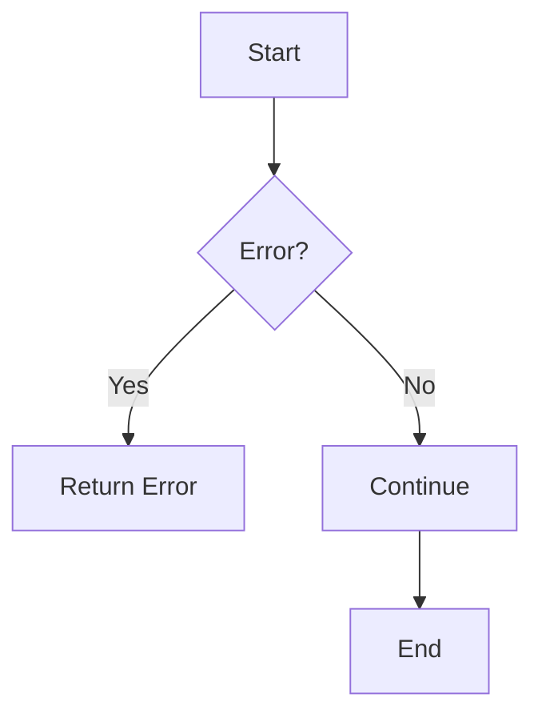
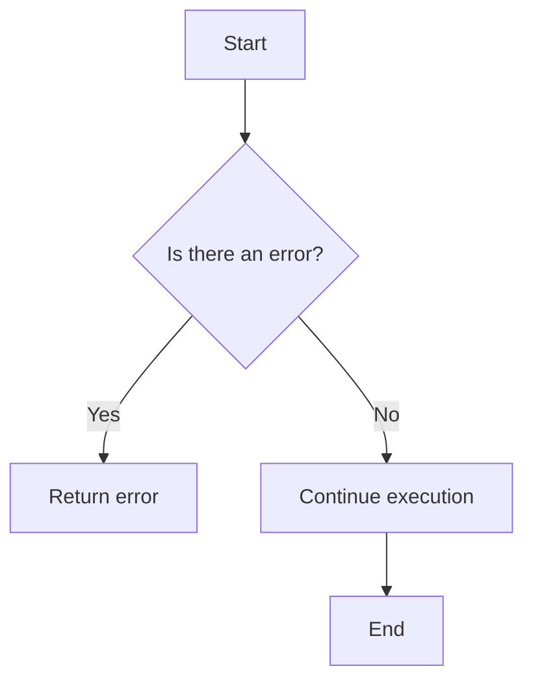
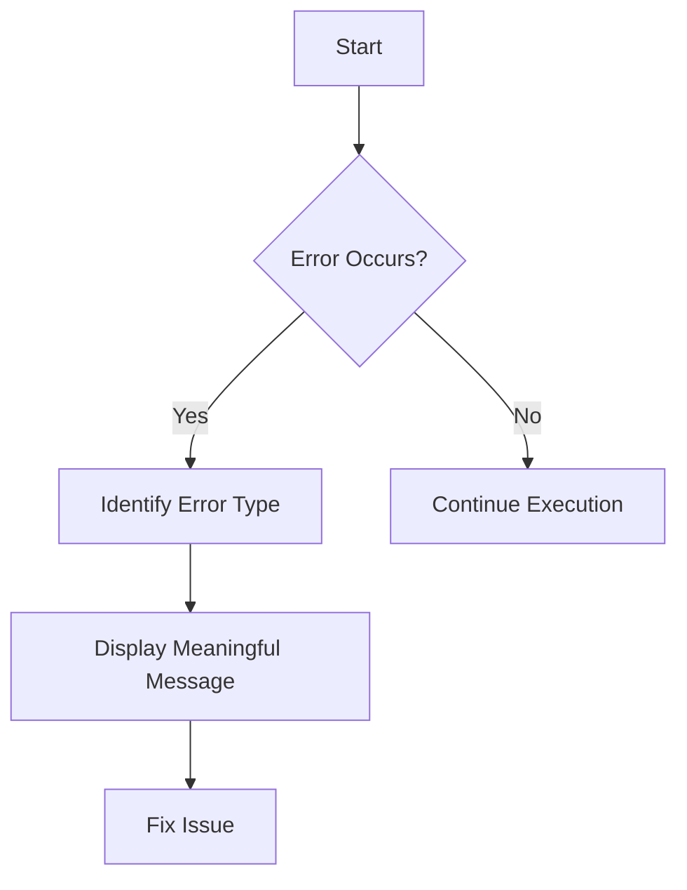
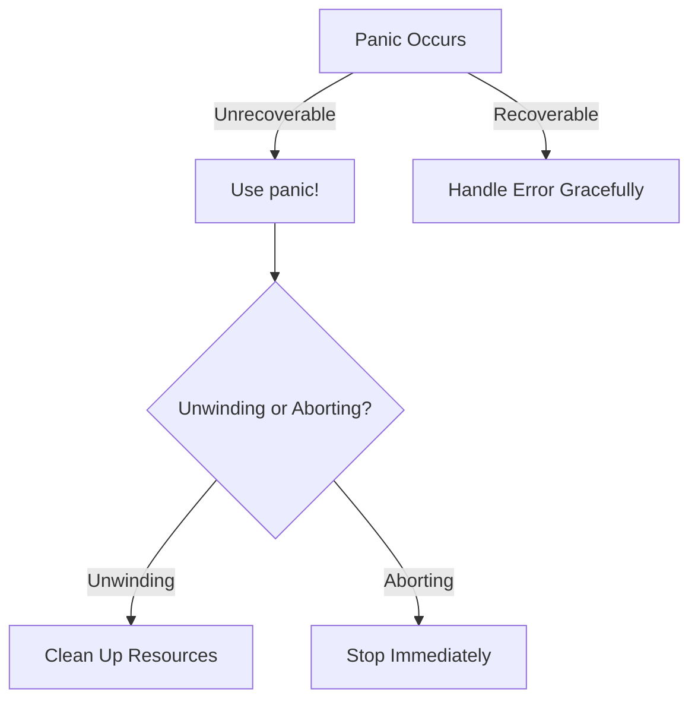
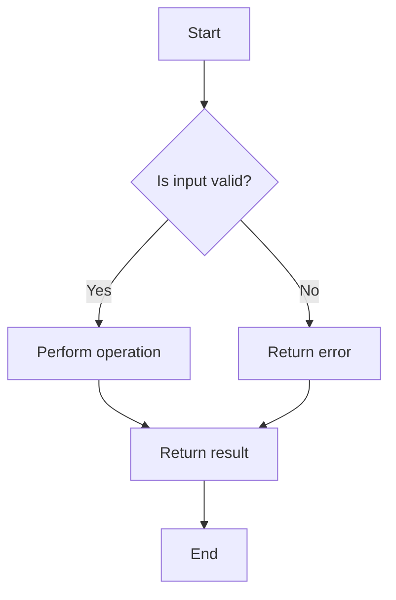

Error: API request failed with error: 401 Client Error: Unauthorized for url: https://openrouter.ai/api/v1/chat/completions

# <span style="color:#e67e22;">What we will learn in this post?</span>
<ul style='list-style-type: none; padding-left: 0;'>
<li><span style='color: #2980b9; font-size: 20px; font-weight: bold;'>👉</span> <span style='color: #2ecc71; font-size: 18px; font-weight: bold;'>Recoverable Errors with Result</span></li>
<li><span style='color: #2980b9; font-size: 20px; font-weight: bold;'>👉</span> <span style='color: #2ecc71; font-size: 18px; font-weight: bold;'>The Question Mark Operator</span></li>
<li><span style='color: #2980b9; font-size: 20px; font-weight: bold;'>👉</span> <span style='color: #2ecc71; font-size: 18px; font-weight: bold;'>Custom Error Types</span></li>
<li><span style='color: #2980b9; font-size: 20px; font-weight: bold;'>👉</span> <span style='color: #2ecc71; font-size: 18px; font-weight: bold;'>Error Handling Best Practices</span></li>
<li><span style='color: #2980b9; font-size: 20px; font-weight: bold;'>👉</span> <span style='color: #2ecc71; font-size: 18px; font-weight: bold;'>The anyhow and thiserror Crates</span></li>
<li><span style='color: #2980b9; font-size: 20px; font-weight: bold;'>👉</span> <span style='color: #2ecc71; font-size: 18px; font-weight: bold;'>Panic and Unrecoverable Errors</span></li>
<li><span style='color: #2980b9; font-size: 20px; font-weight: bold;'>👉</span> <span style='color: #2ecc71; font-size: 18px; font-weight: bold;'>Error Handling in Tests</span></li>
</ul>

# <span style="color:#e67e22">Handling Errors with Result<T, E> in Rust</span>

## <span style="color:#2980b9">Understanding Result<T, E></span>

In Rust, we use `Result<T, E>` to handle errors gracefully. It’s a powerful way to manage expected errors without crashing our programs. Here’s how to work with it:

### <span style="color:#8e44ad">Using the `?` Operator</span>

The `?` operator helps us propagate errors easily. Instead of writing lengthy error handling code, you can simply use `?` to return an error if it occurs. 

```rust
fn read_file() -> Result<String, std::io::Error> {
    let content = std::fs::read_to_string("file.txt")?;
    Ok(content)
}
```

### <span style="color:#8e44ad">Creating Custom Error Types</span>

Sometimes, you need specific error types. You can create your own by implementing the `std::error::Error` trait. This makes your errors more descriptive.

```rust
#[derive(Debug)]
struct MyError;

impl std::fmt::Display for MyError {
    fn fmt(&self, f: &mut std::fmt::Formatter) -> std::fmt::Result {
        write!(f, "My custom error occurred")
    }
}
```

## <span style="color:#2980b9">Why Use Result Instead of Exceptions?</span>

- **Clarity**: Errors are explicit, making your code easier to understand.
- **Control**: You handle errors where they occur, leading to better error management.
- **Safety**: Rust’s type system ensures you deal with errors, reducing runtime surprises.

### <span style="color:#8e44ad">Conclusion</span>

Using `Result<T, E>` is a friendly and safe way to handle errors in Rust. It keeps your code clean and manageable. For more details, check out the [Rust Book](https://doc.rust-lang.org/book/ch09-02-recoverable-errors-with-result.html).



Embrace `Result<T, E>` for a smoother coding experience! 😊

# <span style="color:#e67e22">The ? Operator for Elegant Error Propagation</span>

The `?` operator in Rust is a powerful tool for handling errors gracefully. It helps you return early when something goes wrong, making your code cleaner and easier to read. Let's explore how it works! 😊

## <span style="color:#2980b9">How the ? Operator Works</span>

- **Early Returns**: If a function returns a `Result` and you use `?`, it will return the error immediately if there is one. This means you don’t have to write extra code to handle errors.

### <span style="color:#8e44ad">Example of Early Return</span>

```rust
fn read_file() -> Result<String, std::io::Error> {
    let content = std::fs::read_to_string("file.txt")?; // Returns early on error
    Ok(content)
}
```

- **Automatic Type Conversions**: The `?` operator works with the `From` trait, allowing automatic conversion between error types.

### <span style="color:#8e44ad">Example of Type Conversion</span>

```rust
fn parse_number(s: &str) -> Result<i32, std::num::ParseIntError> {
    let number: i32 = s.parse()?; // Converts error types automatically
    Ok(number)
}
```

## <span style="color:#2980b9">Using ? in Functions Returning Result</span>

When you define a function that returns a `Result`, you can use `?` to simplify error handling.

### <span style="color:#8e44ad">Complete Example</span>

```rust
fn divide(a: f64, b: f64) -> Result<f64, String> {
    if b == 0.0 {
        return Err("Cannot divide by zero".into()); // Custom error
    }
    Ok(a / b)
}

fn main() -> Result<(), String> {
    let result = divide(10.0, 0.0)?; // Early return on error
    println!("Result: {}", result);
    Ok(())
}
```

### <span style="color:#8e44ad">Flowchart of Error Handling</span>



For more information, check out the [Rust Book](https://doc.rust-lang.org/book/ch09-02-recoverable-errors-with-result.html) on error handling!

Using the `?` operator makes your Rust code cleaner and more efficient. Happy coding! 🚀

# <span style="color:#e67e22">Creating Meaningful Custom Error Types in Rust</span> 🚀

## <span style="color:#2980b9">Why Custom Errors Matter</span>

Imagine you're driving a car. If the engine fails, you want a clear message like "Engine Overheating" instead of just "Error." Custom error types help us understand what went wrong in our code, making debugging easier and more effective. 

## <span style="color:#2980b9">Creating Custom Errors with Enums</span>

In Rust, we can create custom errors using enums. Here’s a simple example:

```rust
#[derive(Debug)]
enum MyError {
    NotFound,
    InvalidInput(String),
    ConnectionFailed,
}
```

### <span style="color:#8e44ad">Implementing Traits</span>

To make our errors more useful, we implement the `Error` and `Display` traits:

```rust
use std::fmt;

impl fmt::Display for MyError {
    fn fmt(&self, f: &mut fmt::Formatter) -> fmt::Result {
        match self {
            MyError::NotFound => write!(f, "Item not found!"),
            MyError::InvalidInput(msg) => write!(f, "Invalid input: {}", msg),
            MyError::ConnectionFailed => write!(f, "Failed to connect!"),
        }
    }
}

impl std::error::Error for MyError {}
```

## <span style="color:#2980b9">Composing Errors from Different Modules</span>

You can also combine errors from different modules, making your error handling more robust. For example:

```rust
mod network {
    #[derive(Debug)]
    pub enum NetworkError {
        Timeout,
        Disconnected,
    }
}

mod file {
    #[derive(Debug)]
    pub enum FileError {
        NotFound,
        PermissionDenied,
    }
}
```

### <span style="color:#8e44ad">Using a Combined Error Type</span>

You can create a combined error type:

```rust
#[derive(Debug)]
enum AppError {
    Network(network::NetworkError),
    File(file::FileError),
}
```

## <span style="color:#2980b9">Benefits of Custom Errors</span>

- **Clarity**: Clear messages help you understand issues quickly.
- **Debugging**: Easier to trace back to the source of the problem.
- **Modularity**: Different modules can have their own error types, improving organization.

### <span style="color:#8e44ad">Conclusion</span>

Using custom error types in Rust enhances your application's error handling, making it more user-friendly and maintainable. For more information, check out the [Rust Book](https://doc.rust-lang.org/book/ch09-00-error-handling.html).



Happy coding! 😊

# <span style="color:#e67e22">Understanding Error Handling in Rust</span>

## <span style="color:#2980b9">When to Use `unwrap`, `expect`, and Proper Error Handling</span>

In Rust, handling errors is crucial for building reliable applications. Here’s a friendly guide to help you choose the right approach! 😊

### <span style="color:#8e44ad">Using `unwrap` and `expect`</span>

- **`unwrap()`**: Use this when you are **absolutely sure** that a value is present. It will panic if the value is `None`. Avoid using it in production code! 🚫
  
- **`expect("message")`**: Similar to `unwrap()`, but you can provide a helpful message. This is better for debugging, as it tells you what went wrong. 

### <span style="color:#8e44ad">Proper Error Handling</span>

- **Always prefer proper error handling** over `unwrap` and `expect`. Use `Result` types to manage errors gracefully. This way, your program can recover from errors instead of crashing. 

### <span style="color:#8e44ad">Using Result Chains Effectively</span>

- You can chain methods on `Result` types using `?`. This makes your code cleaner and easier to read. For example:

```rust
let value = some_function().map_err(|e| format!("Error: {}", e))?;
```

### <span style="color:#8e44ad">Helpful Error Messages</span>

- Always provide clear and informative error messages. This helps you and others understand what went wrong and how to fix it. 

### <span style="color:#2980b9">Resources</span>

- [Rust Error Handling](https://doc.rust-lang.org/book/ch09-02-recoverable-errors-with-result.html)
- [Rust Result Type](https://doc.rust-lang.org/std/result/)

By following these tips, you'll write safer and more reliable Rust code! Happy coding! 🎉

# <span style="color:#e67e22">Popular Error Handling Libraries in Rust</span>

## <span style="color:#2980b9">1. `anyhow` for Application Errors</span>

`anyhow` is a great library for handling application-level errors. It makes it easy to add context to errors without much boilerplate. Here’s a simple example:

```rust
use anyhow::{Context, Result};

fn read_file(filename: &str) -> Result<String> {
    std::fs::read_to_string(filename).context("Failed to read the file")
}

fn main() -> Result<()> {
    let content = read_file("example.txt")?;
    println!("{}", content);
    Ok(())
}
```

### <span style="color:#8e44ad">Key Features of `anyhow`:</span>
- **Easy Context**: Add context to errors easily.
- **Flexible**: Works with any error type.

## <span style="color:#2980b9">2. `thiserror` for Custom Error Types</span>

`thiserror` helps you create custom error types with derive macros. This is useful for defining specific errors in your application. Here’s how you can use it:

```rust
use thiserror::Error;

#[derive(Error, Debug)]
pub enum MyError {
    #[error("An error occurred: {0}")]
    GenericError(String),
}

fn do_something() -> Result<(), MyError> {
    Err(MyError::GenericError("Oops!".into()))
}

fn main() {
    if let Err(e) = do_something() {
        println!("Error: {}", e);
    }
}
```

### <span style="color:#8e44ad">Key Features of `thiserror`:</span>
- **Custom Errors**: Define your own error types.
- **Derive Macros**: Simplifies error handling.

### <span style="color:#2980b9">Resources</span>
- [anyhow Documentation](https://docs.rs/anyhow/latest/anyhow/)
- [thiserror Documentation](https://docs.rs/thiserror/latest/thiserror/)

Feel free to explore these libraries to make your Rust applications more robust! 😊

# <span style="color:#e67e22">Understanding Panic in Rust</span>

## <span style="color:#2980b9">When to Use `panic!`</span>

Using `panic!` is appropriate for **truly unrecoverable errors**. Think of it like a car breaking down in the middle of nowhere—there's no way to fix it on the spot, so you call for help. 

### <span style="color:#8e44ad">Unwinding vs. Aborting</span>

- **Unwinding**: This is like cleaning up after a party. Rust will run destructors to free resources. Use this when you want to ensure everything is tidy.
- **Aborting**: This is like leaving the party without cleaning up. Rust stops everything immediately. Use this for critical failures where cleanup isn't necessary.

## <span style="color:#2980b9">Using `catch_unwind` for FFI Boundaries</span>

When working with **Foreign Function Interfaces (FFI)**, use `catch_unwind` to handle panics safely. Imagine a bridge connecting two cities; if one side collapses, you want to ensure the other side remains intact.

```rust
std::panic::catch_unwind(|| {
    // Code that might panic
});
```

## <span style="color:#2980b9">Why Not Replace Error Handling?</span>

Using `panic!` instead of proper error handling is like ignoring a small leak in your roof until it becomes a flood. Always handle errors gracefully to maintain control over your program's flow.

### <span style="color:#8e44ad">Key Takeaways</span>

- Use `panic!` for unrecoverable errors.
- Choose unwinding for cleanup and aborting for critical failures.
- Use `catch_unwind` at FFI boundaries.
- Always prefer proper error handling for manageable code.

For more information, check out the [Rust Book](https://doc.rust-lang.org/book/) and [Rust Error Handling](https://doc.rust-lang.org/book/ch09-00-error-handling.html).



# <span style="color:#e67e22">Writing Testable Error Handling Code</span> 🚀

## <span style="color:#2980b9">Understanding `should_panic` Attribute</span>

The `should_panic` attribute in Rust helps us test if our code correctly handles errors by panicking when it should. Here’s how to use it:

```rust
#[cfg(test)]
mod tests {
    #[test]
    #[should_panic(expected = "division by zero")]
    fn test_divide_by_zero() {
        divide(10, 0); // This should panic!
    }
    
    fn divide(a: i32, b: i32) -> i32 {
        if b == 0 {
            panic!("division by zero");
        }
        a / b
    }
}
```
* **Explanation**: The test checks if dividing by zero causes a panic with the expected message.

## <span style="color:#2980b9">Testing Error Cases</span> 🛠️

When writing functions that can fail, return a `Result` type. Here’s an example:

```rust
fn safe_divide(a: i32, b: i32) -> Result<i32, String> {
    if b == 0 {
        Err("Cannot divide by zero".to_string())
    } else {
        Ok(a / b)
    }
}

#[cfg(test)]
mod tests {
    use super::*;

    #[test]
    fn test_safe_divide() {
        assert_eq!(safe_divide(10, 2), Ok(5));
        assert_eq!(safe_divide(10, 0), Err("Cannot divide by zero".to_string()));
    }
}
```
* **Explanation**: This function returns an `Ok` value or an `Err` with a message.

## <span style="color:#2980b9">Verifying Error Messages</span> 📜

To ensure your error messages are clear, test them directly:

```rust
#[test]
fn test_error_message() {
    let result = safe_divide(10, 0);
    assert_eq!(result.unwrap_err(), "Cannot divide by zero");
}
```
* **Explanation**: This checks if the error message matches what we expect.

## <span style="color:#2980b9">Practical Testing Patterns</span> 🌟

- **Use `Result` for error handling**: It makes your functions easier to test.
- **Write tests for both success and failure cases**: This ensures your code behaves as expected.
- **Check error messages**: Always verify that the messages are informative.

For more information, check out the [Rust Book](https://doc.rust-lang.org/book/ch09-02-recoverable-errors-with-result.html).

### Flowchart of Error Handling



By following these patterns, you can write robust and testable error handling code. Happy coding! 🎉

