<!--
meta-description: "Master Rust error handling including Result<T,E>, custom error types, the ? operator, panic vs recoverable errors, anyhow/thiserror libraries, and exhaustive error handling patterns."
keywords: "Rust error handling, Result type, custom errors, ? operator, panic, anyhow, thiserror, error propagation, exception handling, Result chains, FFI error handling, testable errors"
-->

# <span style="color:#e67e22;">What we will learn in this post?</span>
<ul style='list-style-type: none; padding-left: 0;'>
<li><span style='color: #2980b9; font-size: 20px; font-weight: bold;'>👉</span> <span style='color: #2ecc71; font-size: 18px; font-weight: bold;'>Recoverable Errors with Result</span></li>
<li><span style='color: #2980b9; font-size: 20px; font-weight: bold;'>👉</span> <span style='color: #2ecc71; font-size: 18px; font-weight: bold;'>The Question Mark Operator</span></li>
<li><span style='color: #2980b9; font-size: 20px; font-weight: bold;'>👉</span> <span style='color: #2ecc71; font-size: 18px; font-weight: bold;'>Custom Error Types</span></li>
<li><span style='color: #2980b9; font-size: 20px; font-weight: bold;'>👉</span> <span style='color: #2ecc71; font-size: 18px; font-weight: bold;'>Error Handling Best Practices</span></li>
<li><span style='color: #2980b9; font-size: 20px; font-weight: bold;'>👉</span> <span style='color: #2ecc71; font-size: 18px; font-weight: bold;'>The anyhow and thiserror Crates</span></li>
<li><span style='color: #2980b9; font-size: 20px; font-weight: bold;'>👉</span> <span style='color: #2ecc71; font-size: 18px; font-weight: bold;'>Panic and Unrecoverable Errors</span></li>
<li><span style='color: #2980b9; font-size: 20px; font-weight: bold;'>👉</span> <span style='color: #2ecc71; font-size: 18px; font-weight: bold;'>Error Handling in Tests</span></li>
</ul>

# <span style="color:#e67e22">Handling Errors with Result<T, E> in Rust</span>

In Rust, error handling is mandatory—the compiler forces you to handle every possible failure path, preventing the silent bugs that plague production systems at companies like Microsoft and Apple. Result<T, E> replaces exceptions with explicit, type-safe error handling that scales to millions of lines of code without hidden crashes.

## <span style="color:#2980b9">Understanding Result<T, E></span>

In Rust, we use `Result<T, E>` to handle errors gracefully. It’s a powerful way to manage expected errors without crashing our programs. Here’s how to work with it:

### <span style="color:#8e44ad">Using the `?` Operator</span>

The `?` operator helps us propagate errors easily. Instead of writing lengthy error handling code, you can simply use `?` to return an error if it occurs. 

```rust
fn read_file() -> Result<String, std::io::Error> {
    let content = std::fs::read_to_string("file.txt")?;
    Ok(content)
}
```

### <span style="color:#8e44ad">Creating Custom Error Types</span>

Sometimes, you need specific error types. You can create your own by implementing the `std::error::Error` trait. This makes your errors more descriptive.

```rust
#[derive(Debug)]
struct MyError;

impl std::fmt::Display for MyError {
    fn fmt(&self, f: &mut std::fmt::Formatter) -> std::fmt::Result {
        write!(f, "My custom error occurred")
    }
}
```

## <span style="color:#2980b9">Why Use Result Instead of Exceptions?</span>

- **Clarity**: Errors are explicit, making your code easier to understand.
- **Control**: You handle errors where they occur, leading to better error management.
- **Safety**: Rust’s type system ensures you deal with errors, reducing runtime surprises.

```mermaid
flowchart TD
    A["🚀 Start"]:::style1 --> B{"❓ Error?"}:::style2
    B -->|Yes| C["↩️ Return Error"]:::style3
    B -->|No| D["✅ Continue"]:::style4
    D --> E["🎉 End"]:::style5

    classDef style1 fill:#ff6b6b,stroke:#c92a2a,color:#fff,font-size:16px,stroke-width:3px,rx:14,shadow:6px;
    classDef style2 fill:#6b5bff,stroke:#4a3f6b,color:#fff,font-size:16px,stroke-width:3px,rx:14,shadow:6px;
    classDef style3 fill:#43e97b,stroke:#38f9d7,color:#fff,font-size:16px,stroke-width:3px,rx:14,shadow:6px;
    classDef style4 fill:#ffd700,stroke:#d99120,color:#222,font-size:16px,stroke-width:3px,rx:14,shadow:6px;
    classDef style5 fill:#00bfae,stroke:#005f99,color:#fff,font-size:16px,stroke-width:3px,rx:14,shadow:6px;

    linkStyle default stroke:#e67e22,stroke-width:3px;
```

### <span style="color:#8e44ad">Conclusion</span>

Using `Result<T, E>` is a friendly and safe way to handle errors in Rust. It keeps your code clean and manageable. For more details, check out the [Rust Book](https://doc.rust-lang.org/book/ch09-02-recoverable-errors-with-result.html).



Embrace `Result<T, E>` for a smoother coding experience! 😊

# <span style="color:#e67e22">The ? Operator for Elegant Error Propagation</span>

The `?` operator is Rust's secret weapon for clean error handling—used throughout the Tokio async runtime and Servo browser engine, it eliminates verbose error handling boilerplate while maintaining exhaustive error checking. One operator replaces dozens of match statements while keeping your code safe and readable.

## <span style="color:#2980b9">How the ? Operator Works</span>

- **Early Returns**: If a function returns a `Result` and you use `?`, it will return the error immediately if there is one. This means you don’t have to write extra code to handle errors.

### <span style="color:#8e44ad">Example of Early Return</span>

```rust
fn read_file() -> Result<String, std::io::Error> {
    let content = std::fs::read_to_string("file.txt")?; // Returns early on error
    Ok(content)
}
```

- **Automatic Type Conversions**: The `?` operator works with the `From` trait, allowing automatic conversion between error types.

### <span style="color:#8e44ad">Example of Type Conversion</span>

```rust
fn parse_number(s: &str) -> Result<i32, std::num::ParseIntError> {
    let number: i32 = s.parse()?; // Converts error types automatically
    Ok(number)
}
```

## <span style="color:#2980b9">Using ? in Functions Returning Result</span>

When you define a function that returns a `Result`, you can use `?` to simplify error handling.

### <span style="color:#8e44ad">Complete Example</span>

```rust
fn divide(a: f64, b: f64) -> Result<f64, String> {
    if b == 0.0 {
        return Err("Cannot divide by zero".into()); // Custom error
    }
    Ok(a / b)
}

fn main() -> Result<(), String> {
    let result = divide(10.0, 0.0)?; // Early return on error
    println!("Result: {}", result);
    Ok(())
}
```

### <span style="color:#8e44ad">Flowchart of Error Handling</span>



# <span style="color:#e67e22">Creating Meaningful Custom Error Types in Rust</span> 🚀

```mermaid
flowchart TD
    A["🚀 Start"]:::style1 --> B{"❓ Error?"}:::style2
    B -->|Yes| C["⬅️ Return Error"]:::style3
    B -->|No| D["▶️ Continue"]:::style4
    D --> E["🎉 End"]:::style5

    classDef style1 fill:#ff6b6b,stroke:#c92a2a,color:#fff,font-size:16px,stroke-width:3px,rx:14,shadow:6px;
    classDef style2 fill:#6b5bff,stroke:#4a3f6b,color:#fff,font-size:16px,stroke-width:3px,rx:14,shadow:6px;
    classDef style3 fill:#43e97b,stroke:#38f9d7,color:#fff,font-size:16px,stroke-width:3px,rx:14,shadow:6px;
    classDef style4 fill:#ffd700,stroke:#d99120,color:#222,font-size:16px,stroke-width:3px,rx:14,shadow:6px;
    classDef style5 fill:#00bfae,stroke:#005f99,color:#fff,font-size:16px,stroke-width:3px,rx:14,shadow:6px;

    linkStyle default stroke:#e67e22,stroke-width:3px;
```

Custom error types are the standard pattern at companies like Cloudflare—they encode domain-specific failures into your type system, allowing the compiler to ensure you handle every error path. One custom error enum replaces hundreds of comment-based error documentation strings. 

## <span style="color:#2980b9">Creating Custom Errors with Enums</span>

In Rust, we can create custom errors using enums. Here’s a simple example:

```rust
#[derive(Debug)]
enum MyError {
    NotFound,
    InvalidInput(String),
    ConnectionFailed,
}
```

### <span style="color:#8e44ad">Implementing Traits</span>

To make our errors more useful, we implement the `Error` and `Display` traits:

```rust
use std::fmt;

impl fmt::Display for MyError {
    fn fmt(&self, f: &mut fmt::Formatter) -> fmt::Result {
        match self {
            MyError::NotFound => write!(f, "Item not found!"),
            MyError::InvalidInput(msg) => write!(f, "Invalid input: {}", msg),
            MyError::ConnectionFailed => write!(f, "Failed to connect!"),
        }
    }
}

impl std::error::Error for MyError {}
```

## <span style="color:#2980b9">Composing Errors from Different Modules</span>

You can also combine errors from different modules, making your error handling more robust. For example:

```rust
mod network {
    #[derive(Debug)]
    pub enum NetworkError {
        Timeout,
        Disconnected,
    }
}

mod file {
    #[derive(Debug)]
    pub enum FileError {
        NotFound,
        PermissionDenied,
    }
}
```

### <span style="color:#8e44ad">Using a Combined Error Type</span>

You can create a combined error type:

```rust
#[derive(Debug)]
enum AppError {
    Network(network::NetworkError),
    File(file::FileError),
}
```

## <span style="color:#2980b9">Benefits of Custom Errors</span>

- **Clarity**: Clear messages help you understand issues quickly.
- **Debugging**: Easier to trace back to the source of the problem.
- **Modularity**: Different modules can have their own error types, improving organization.


Happy coding! 😊

# <span style="color:#e67e22">Understanding Error Handling in Rust</span>

The choice between unwrap, expect, and proper error handling is the difference between a prototype and production code—Linux kernel developers and Kubernetes maintainers exclusively use Result types because a single unwrap in the wrong place can crash millions of users' machines. Your error handling strategy defines whether your system is resilient or fragile.

### <span style="color:#8e44ad">Using `unwrap` and `expect`</span>

- **`unwrap()`**: Use this when you are **absolutely sure** that a value is present. It will panic if the value is `None`. Avoid using it in production code! 🚫
  
- **`expect("message")`**: Similar to `unwrap()`, but you can provide a helpful message. This is better for debugging, as it tells you what went wrong. 

### <span style="color:#8e44ad">Proper Error Handling</span>

- **Always prefer proper error handling** over `unwrap` and `expect`. Use `Result` types to manage errors gracefully. This way, your program can recover from errors instead of crashing. 

### <span style="color:#8e44ad">Using Result Chains Effectively</span>

- You can chain methods on `Result` types using `?`. This makes your code cleaner and easier to read. For example:

```rust
let value = some_function().map_err(|e| format!("Error: {}", e))?;
```

### <span style="color:#8e44ad">Helpful Error Messages</span>

- Always provide clear and informative error messages. This helps you and others understand what went wrong and how to fix it. 

# <span style="color:#e67e22">Popular Error Handling Libraries in Rust</span>

The `anyhow` and `thiserror` crates are industry standards—companies like Sentry and bug tracking services use thiserror for custom error types, while anyhow powers CLI tools at Amazon and Microsoft. These libraries handle 90% of real-world error scenarios, eliminating boilerplate while maintaining type safety.

`anyhow` is a great library for handling application-level errors. It makes it easy to add context to errors without much boilerplate. Here’s a simple example:

```rust
use anyhow::{Context, Result};

fn read_file(filename: &str) -> Result<String> {
    std::fs::read_to_string(filename).context("Failed to read the file")
}

fn main() -> Result<()> {
    let content = read_file("example.txt")?;
    println!("{}", content);
    Ok(())
}
```

### <span style="color:#8e44ad">Key Features of `anyhow`:</span>
- **Easy Context**: Add context to errors easily.
- **Flexible**: Works with any error type.

## <span style="color:#2980b9">2. `thiserror` for Custom Error Types</span>

`thiserror` helps you create custom error types with derive macros. This is useful for defining specific errors in your application. Here’s how you can use it:

```rust
use thiserror::Error;

#[derive(Error, Debug)]
pub enum MyError {
    #[error("An error occurred: {0}")]
    GenericError(String),
}

fn do_something() -> Result<(), MyError> {
    Err(MyError::GenericError("Oops!".into()))
}

fn main() {
    if let Err(e) = do_something() {
        println!("Error: {}", e);
    }
}
```

### <span style="color:#8e44ad">Key Features of `thiserror`:</span>
- **Custom Errors**: Define your own error types.
- **Derive Macros**: Simplifies error handling.

# <span style="color:#e67e22">Understanding Panic in Rust</span>

Panic is Rust's last resort—Google's infrastructure teams and Firefox developers are explicit about when panic is acceptable: thread crashes at system boundaries, impossible invariant violations, or catastrophic data corruption. Every panic in production represents a failure of error handling design; they should be exceptionally rare events. 

### <span style="color:#8e44ad">Unwinding vs. Aborting</span>

- **Unwinding**: This is like cleaning up after a party. Rust will run destructors to free resources. Use this when you want to ensure everything is tidy.
- **Aborting**: This is like leaving the party without cleaning up. Rust stops everything immediately. Use this for critical failures where cleanup isn't necessary.

## <span style="color:#2980b9">Using `catch_unwind` for FFI Boundaries</span>

When working with **Foreign Function Interfaces (FFI)**, use `catch_unwind` to handle panics safely. Imagine a bridge connecting two cities; if one side collapses, you want to ensure the other side remains intact.

```rust
std::panic::catch_unwind(|| {
    // Code that might panic
});
```

## <span style="color:#2980b9">Why Not Replace Error Handling?</span>

Using `panic!` instead of proper error handling is like ignoring a small leak in your roof until it becomes a flood. Always handle errors gracefully to maintain control over your program's flow.

### <span style="color:#8e44ad">Key Takeaways</span>

- Use `panic!` for unrecoverable errors.
- Choose unwinding for cleanup and aborting for critical failures.
- Use `catch_unwind` at FFI boundaries.
- Always prefer proper error handling for manageable code.

```mermaid
flowchart TD
    A["💥 Panic?"]:::style1 -->|Unrecoverable| B["🚨 Use panic!"]:::style2
    A -->|Recoverable| C["✅ Handle Gracefully"]:::style3
    B --> D{"⚙️ Unwinding?"}:::style4
    D -->|Unwinding| E["🧹 Clean Up"]:::style5
    D -->|Aborting| F["⛔ Stop Now"]:::style3

    classDef style1 fill:#ff6b6b,stroke:#c92a2a,color:#fff,font-size:16px,stroke-width:3px,rx:14,shadow:6px;
    classDef style2 fill:#6b5bff,stroke:#4a3f6b,color:#fff,font-size:16px,stroke-width:3px,rx:14,shadow:6px;
    classDef style3 fill:#43e97b,stroke:#38f9d7,color:#fff,font-size:16px,stroke-width:3px,rx:14,shadow:6px;
    classDef style4 fill:#ffd700,stroke:#d99120,color:#222,font-size:16px,stroke-width:3px,rx:14,shadow:6px;
    classDef style5 fill:#00bfae,stroke:#005f99,color:#fff,font-size:16px,stroke-width:3px,rx:14,shadow:6px;
```



# <span style="color:#e67e22">Writing Testable Error Handling Code</span> 🚀

Testable error handling is how production systems at JPMorgan Chase and Databricks prevent 99.99% of bugs—by making every error path explicit and unit-tested. When your tests verify both success and failure paths comprehensively, your error handling becomes bulletproof at scale.

The `should_panic` attribute in Rust helps us test if our code correctly handles errors by panicking when it should. Here’s how to use it:

```rust
#[cfg(test)]
mod tests {
    #[test]
    #[should_panic(expected = "division by zero")]
    fn test_divide_by_zero() {
        divide(10, 0); // This should panic!
    }
    
    fn divide(a: i32, b: i32) -> i32 {
        if b == 0 {
            panic!("division by zero");
        }
        a / b
    }
}
```
* **Explanation**: The test checks if dividing by zero causes a panic with the expected message.

## <span style="color:#2980b9">Testing Error Cases</span> 🛠️

When writing functions that can fail, return a `Result` type. Here’s an example:

```rust
fn safe_divide(a: i32, b: i32) -> Result<i32, String> {
    if b == 0 {
        Err("Cannot divide by zero".to_string())
    } else {
        Ok(a / b)
    }
}

#[cfg(test)]
mod tests {
    use super::*;

    #[test]
    fn test_safe_divide() {
        assert_eq!(safe_divide(10, 2), Ok(5));
        assert_eq!(safe_divide(10, 0), Err("Cannot divide by zero".to_string()));
    }
}
```
* **Explanation**: This function returns an `Ok` value or an `Err` with a message.

## <span style="color:#2980b9">Verifying Error Messages</span> 📜

To ensure your error messages are clear, test them directly:

```rust
#[test]
fn test_error_message() {
    let result = safe_divide(10, 0);
    assert_eq!(result.unwrap_err(), "Cannot divide by zero");
}
```
* **Explanation**: This checks if the error message matches what we expect.

## <span style="color:#2980b9">Practical Testing Patterns</span> 🌟

- **Use `Result` for error handling**: It makes your functions easier to test.
- **Write tests for both success and failure cases**: This ensures your code behaves as expected.
- **Check error messages**: Always verify that the messages are informative.

```mermaid
flowchart TD
    A["🚀 Start"]:::style1 --> B{"✅ Valid?"}:::style2
    B -->|Yes| C["⚙️ Operate"]:::style3
    B -->|No| D["❌ Error"]:::style4
    C --> E["📊 Result"]:::style5
    D --> E

    classDef style1 fill:#ff6b6b,stroke:#c92a2a,color:#fff,font-size:16px,stroke-width:3px,rx:14,shadow:6px;
    classDef style2 fill:#6b5bff,stroke:#4a3f6b,color:#fff,font-size:16px,stroke-width:3px,rx:14,shadow:6px;
    classDef style3 fill:#43e97b,stroke:#38f9d7,color:#fff,font-size:16px,stroke-width:3px,rx:14,shadow:6px;
    classDef style4 fill:#ffd700,stroke:#d99120,color:#222,font-size:16px,stroke-width:3px,rx:14,shadow:6px;
    classDef style5 fill:#00bfae,stroke:#005f99,color:#fff,font-size:16px,stroke-width:3px,rx:14,shadow:6px;

    linkStyle default stroke:#e67e22,stroke-width:3px;
```



---

# <span style="color:#e67e22">Real-World Production Examples 🏢</span>

## <span style="color:#2980b9">1. Tokio Async Runtime Error Handling</span> ⚡
Tokio powers production async systems at Cloudflare and Discord—it uses custom errors for async task failures:

```rust
use std::fmt;

#[derive(Debug)]
enum AsyncTaskError {
    Timeout,
    Cancelled,
    Panic(String),
    IoError(std::io::Error),
}

impl fmt::Display for AsyncTaskError {
    fn fmt(&self, f: &mut fmt::Formatter) -> fmt::Result {
        match self {
            AsyncTaskError::Timeout => write!(f, "Async task timed out"),
            AsyncTaskError::Cancelled => write!(f, "Task was cancelled"),
            AsyncTaskError::Panic(msg) => write!(f, "Task panicked: {}", msg),
            AsyncTaskError::IoError(e) => write!(f, "IO error: {}", e),
        }
    }
}

impl std::error::Error for AsyncTaskError {}

impl From<std::io::Error> for AsyncTaskError {
    fn from(error: std::io::Error) -> Self {
        AsyncTaskError::IoError(error)
    }
}

async fn execute_task() -> Result<String, AsyncTaskError> {
    tokio::time::timeout(
        std::time::Duration::from_secs(5),
        perform_operation()
    ).await
        .map_err(|_| AsyncTaskError::Timeout)?
}

async fn perform_operation() -> String {
    "Task completed".to_string()
}
```

## <span style="color:#2980b9">2. Servo Browser Engine Error Handling</span> 🦊
Servo uses exhaustive error handling with custom types:

```rust
use std::error::Error;
use std::fmt;

#[derive(Debug)]
enum LayoutError {
    InvalidCss(String),
    MissingElement(String),
    RenderFailed(String),
}

impl fmt::Display for LayoutError {
    fn fmt(&self, f: &mut fmt::Formatter) -> fmt::Result {
        match self {
            LayoutError::InvalidCss(reason) => write!(f, "Invalid CSS: {}", reason),
            LayoutError::MissingElement(id) => write!(f, "Element not found: {}", id),
            LayoutError::RenderFailed(reason) => write!(f, "Render failed: {}", reason),
        }
    }
}

impl Error for LayoutError {}

fn parse_layout(css: &str) -> Result<(), LayoutError> {
    if css.is_empty() {
        return Err(LayoutError::InvalidCss("Empty CSS".into()));
    }
    Ok(())
}

fn render_element(id: &str) -> Result<String, LayoutError> {
    if id.is_empty() {
        return Err(LayoutError::MissingElement("No ID provided".into()));
    }
    Ok(format!("Rendered {}", id))
}
```

## <span style="color:#2980b9">3. Kubernetes Error Recovery Pattern</span> 🐳
Kubernetes uses ? operator extensively for clean error propagation:

```rust
fn retry_with_backoff<F, T>(mut f: F, max_retries: u32) -> Result<T, String>
where
    F: FnMut() -> Result<T, String>,
{
    let mut retries = 0;
    loop {
        match f() {
            Ok(result) => return Ok(result),
            Err(e) => {
                retries += 1;
                if retries >= max_retries {
                    return Err(format!("Max retries exceeded: {}", e));
                }
                std::thread::sleep(std::time::Duration::from_secs(2_u64.pow(retries - 1)));
            }
        }
    }
}

fn fetch_from_api() -> Result<String, String> {
    // Simulate API call that might fail
    if rand::random() {
        Ok("Data".to_string())
    } else {
        Err("Connection timeout".to_string())
    }
}

fn main() -> Result<(), String> {
    let data = retry_with_backoff(fetch_from_api, 3)?;
    println!("Fetched: {}", data);
    Ok(())
}
```

## <span style="color:#2980b9">4. FFI Error Boundary with catch_unwind</span> 🌉
Servo and Firefox use catch_unwind at C++ FFI boundaries:

```rust
use std::panic::{catch_unwind, AssertUnwindSafe};
use std::ffi::CStr;

#[no_mangle]
pub extern "C" fn process_string(ptr: *const u8, len: usize) -> bool {
    let result = catch_unwind(AssertUnwindSafe(|| {
        if ptr.is_null() {
            return Err("Null pointer".to_string());
        }
        
        let bytes = unsafe {
            std::slice::from_raw_parts(ptr, len)
        };
        
        let s = CStr::from_bytes_with_nul(bytes)
            .map_err(|e| format!("Invalid UTF-8: {}", e))?
            .to_str()
            .map_err(|e| format!("String conversion failed: {}", e))?;
        
        println!("Processing: {}", s);
        Ok(true)
    }));

    match result {
        Ok(Ok(true)) => true,
        Ok(Err(e)) => {
            eprintln!("Error: {}", e);
            false
        }
        Err(_) => {
            eprintln!("Panic caught in FFI");
            false
        }
    }
}
```

## <span style="color:#2980b9">5. Linux Kernel Pattern with thiserror</span> 🐧
Rust-for-Linux uses thiserror for kernel subsystems:

```rust
use thiserror::Error;

#[derive(Error, Debug)]
pub enum DriverError {
    #[error("Device not found: {0}")]
    DeviceNotFound(String),
    
    #[error("IO operation failed: {0}")]
    IoFailed(#[from] std::io::Error),
    
    #[error("Invalid configuration: {details}")]
    InvalidConfig { details: String },
    
    #[error("Timeout waiting for {resource}")]
    Timeout { resource: String },
}

fn initialize_device(id: &str) -> Result<(), DriverError> {
    if id.is_empty() {
        return Err(DriverError::DeviceNotFound("Empty ID".into()));
    }
    
    let config = validate_config()?;
    println!("Device initialized with config: {:?}", config);
    Ok(())
}

fn validate_config() -> Result<String, DriverError> {
    Ok("valid".to_string())
}
```

## <span style="color:#2980b9">6. Anyhow Context Pattern from Amazon CLI Tools</span> 🔧
AWS CLI uses anyhow for rich error context:

```rust
use anyhow::{Context, Result};

fn load_config_file(path: &str) -> Result<String> {
    std::fs::read_to_string(path)
        .context(format!("Failed to read config file at: {}", path))?;
    
    let content = std::fs::read_to_string(path)
        .context("Config file is corrupted or unreadable")?;
    
    serde_json::from_str(&content)
        .context("Config JSON is invalid")?;
    
    Ok(content)
}

fn main() -> Result<()> {
    let config = load_config_file("/etc/app/config.json")?;
    println!("Loaded config: {}", config);
    Ok(())
}
```

---

# <span style="color:#e67e22">Hands-On Assignment: Build a Resilient Error-Handling System 🚀</span>

<details open style="border-left: 4px solid #ff6b6b; background: #352a2a; padding: 16px; border-radius: 8px; margin: 20px 0;">
<summary style="cursor: pointer; font-weight: bold; color: #ff6b6b; font-size: 18px;">📋 Your Challenge: Create a Type-Safe Error Handling Framework</summary>

<div style="margin-top: 16px;">

## <span style="color: #ff6b6b;">🎯 Mission</span>
Build a complete, production-grade error handling system in Rust that demonstrates mastery of custom error types, the ? operator, error propagation, and testable error scenarios. Your framework must handle multiple error domains (network, file system, database) with exhaustive pattern matching.

## <span style="color: #ff6b6b;">📋 Requirements</span>

**Core Features** (All Required):
1. **Custom Error Enum** - Define errors for network, file I/O, database, and parsing failures
2. **Display and Debug Traits** - Implement comprehensive error messages
3. **From Trait Implementations** - Automatic conversion from std error types
4. **Result Type Aliases** - Create AppResult<T> = Result<T, AppError>
5. **Question Mark Operator** - Extensive use of ? for clean error propagation
6. **Error Context** - Add context information to errors without panicking
7. **Testable Errors** - Unit tests covering success and all error paths
8. **Custom Error Recovery** - Implement retry logic for transient failures

## <span style="color: #ff6b6b;">💡 Hints</span>

- Use thiserror crate for derive macros on custom error types
- Create specific error variants for each failure mode
- Implement From<T> for each error type you want to convert from
- Use anyhow::Context to add error context
- Write tests with #[should_panic] and Result return types
- Create helper functions that return your custom Result type
- Design error types with domain-specific variants
- Log errors before propagating them up the stack

## <span style="color: #ff6b6b;">📐 Example Project Structure</span>

```
src/
  main.rs
  error.rs (Custom error types)
  file_ops.rs (File operations with errors)
  network.rs (Network operations with errors)
  database.rs (Database operations with errors)
  retry.rs (Retry logic)
  tests/
    error_tests.rs
```

## <span style="color: #ff6b6b;">🎯 Bonus Challenges</span>

**Level 1** 🟢 Add error categorization (retriable vs non-retriable)
**Level 2** 🟢 Implement error chaining to show full error stack
**Level 3** 🟠 Add custom error codes for integration with other systems
**Level 4** 🟠 Create a global error handler middleware pattern
**Level 5** 🔴 Implement distributed tracing for error tracking
**Level 6** 🔴 Build a metrics system that tracks error types and frequencies

## <span style="color: #ff6b6b;">📚 Learning Goals</span>

After completing this assignment, you will:
- ✓ Design custom error hierarchies for complex systems
- ✓ Master the ? operator for elegant error propagation
- ✓ Implement exhaustive error handling patterns
- ✓ Write comprehensive error handling tests
- ✓ Understand error recovery strategies
- ✓ Apply production-grade error handling architecture

## <span style="color: #ff6b6b;">⚡ Pro Tip</span>

Start with the error enum and Display implementation. Test that manually. Then add file operations with ? operator usage. Once that's rock solid, layer on network errors. Finally, add database errors. Build incrementally—each layer teaches you more about error handling design!

## <span style="color: #ff6b6b;">🎓 Call-to-Action</span>

Build this project, open-source it on GitHub, and share it in Rust forums! The error handling architecture you create here is exactly what powers companies like Discord, Cloudflare, and AWS. This is how you prevent the million-dollar bugs that slip through to production. Master error handling and you've mastered the core of production-grade systems engineering. **Get building!** 💪

</div>
</details>

---

# <span style="color:#e67e22">Conclusion: Master Rust Error Handling 🎓</span>

Error handling in Rust is not a burden—it's your safety net and your weapon against production outages—the compiler forces you to consider every failure path upfront, preventing the silent bugs that cost companies millions. By mastering custom error types, the ? operator, exhaustive pattern matching, and error recovery patterns, you'll build systems that scale from thousands to millions of users without the surprise crashes plaguing other languages.

