# <span style="color:#e67e22;">What we will learn in this post?</span>

<ul style='list-style-type: none; padding-left: 0;'>
<li><span style='color: #2980b9; font-size: 20px; font-weight: bold;'>👉</span> <span style='color: #2ecc71; font-size: 18px; font-weight: bold;'>Conditional Statements in Shell</span></li>
<li><span style='color: #2980b9; font-size: 20px; font-weight: bold;'>👉</span> <span style='color: #2ecc71; font-size: 18px; font-weight: bold;'>Looping in Shell</span></li>
<li><span style='color: #2980b9; font-size: 20px; font-weight: bold;'>👉</span> <span style='color: #2ecc71; font-size: 18px; font-weight: bold;'>Using Case Statements</span></li>
<li><span style='color: #2980b9; font-size: 20px; font-weight: bold;'>👉</span> <span style='color: #2ecc71; font-size: 18px; font-weight: bold;'>Break and Continue in Loops</span></li>
<li><span style='color: #2980b9; font-size: 20px; font-weight: bold;'>👉</span> <span style='color: #2ecc71; font-size: 18px; font-weight: bold;'>Combining Multiple Conditions in Shell</span></li>
<li><span style='color: #2980b9; font-size: 20px; font-weight: bold;'>👉</span> <span style='color: #2ecc71; font-size: 18px; font-weight: bold;'>Conclusion!</span></li>
</ul>

# <span style="color:#e67e22">Conditional Statements in Python: `if`, `if-else`, `elif`</span>

Conditional statements control the flow of your code based on whether a condition is true or false. Let's explore them!

## <span style="color:#2980b9">The `if` Statement 👨‍💻</span>

The simplest form checks a single condition.

```python
import os
if os.path.exists("my_file.txt"):  #checks if file exists
    print("File exists!")
```

### <span style="color:#8e44ad">Example: Numerical Comparison</span>

```python
x = 10
if x > 5:
    print("x is greater than 5")
```

## <span style="color:#2980b9">The `if-else` Statement ⚖️</span>

This handles two possibilities: true or false.

```python
age = 15
if age >= 18:
    print("You can vote!")
else:
    print("You are too young to vote.")
```

## <span style="color:#2980b9">The `elif` Statement 🔀</span>

Handles multiple conditions sequentially. It's like saying, "if the first condition is false, _then_ check this one, and _then_ this one..."

```python
score = 85
if score >= 90:
    print("A")
elif score >= 80:
    print("B")
elif score >= 70:
    print("C")
else:
    print("F")
```

**More Info:** For a deeper dive, check out the official Python documentation on [conditional statements](https://docs.python.org/3/tutorial/controlflow.html).

**Note:** Remember indentation is crucial in Python! Incorrect indentation will lead to errors. Use 4 spaces for consistent and readable code.

# <span style="color:#e67e22">Shell Scripting Loops 🎉</span>

Shell scripts use loops to repeat commands. Let's explore `for`, `while`, and `until` loops!

## <span style="color:#2980b9">Loop Types 🔄</span>

- **`for` loop:** Iterates over a list of items. Example: iterating through files in a directory:

  ```bash
  for file in *.txt; do echo "$file"; done
  ```

- **`while` loop:** Repeats as long as a condition is true. Example: prompting for user input until a specific value is entered:

  ```bash
  while [[ "$input" != "quit" ]]; do read -p "Enter input (or 'quit'): " input; done
  ```

- **`until` loop:** Repeats until a condition becomes true (opposite of `while`). Example: repeating a task until a file exists:

  ```bash
  until [ -f "myfile.txt" ]; do echo "Waiting for myfile.txt..."; sleep 1; done
  ```

### <span style="color:#8e44ad">Numerical Ranges with `for`</span>

You can also use `for` loops with numerical ranges using brace expansion or `seq`:

```bash
for i in {1..5}; do echo "$i"; done  #Prints 1 to 5
```

## <span style="color:#2980b9">Applications 🚀</span>

Loops are useful for:

- **File processing:** Processing multiple files, like converting images or extracting data.
- **User interaction:** Creating interactive scripts that repeatedly ask for input.
- **Automation:** Automating repetitive tasks, such as backups or system checks.

**More Info:** For a deeper dive, explore the [Bash manual](https://www.gnu.org/software/bash/manual/bash.html). Remember to always test your scripts carefully! 😉

# <span style="color:#e67e22">Shell Scripting's `case` Statements: A Simpler Way</span>

## <span style="color:#2980b9">Understanding `case` Statements ✨</span>

The `case` statement in shell scripts is like a super-charged `if-else if-else` structure. It elegantly handles multiple conditions based on a single variable's value. Think of it as a powerful switch for your script's logic!

### <span style="color:#8e44ad">Simple Example: A Menu</span>

```bash
read -p "Enter choice (1-3): " choice
case $choice in
  1) echo "You chose option 1";;
  2) echo "You chose option 2";;
  3) echo "You chose option 3";;
  *) echo "Invalid choice";;
esac
```

This script presents a menu and uses `case` to execute different commands based on user input. `*)` acts as a default case for invalid input.

## <span style="color:#2980b9">More Advanced Uses 🚀</span>

- **User Input Handling:** Validate user input easily. Check for specific values or patterns.
- **Process Control:** Decide what actions to take based on the outcome of other commands or events.

**Example: Process Control**

```bash
status=$?  #Check the exit status of a previous command
case $status in
  0) echo "Command succeeded!";;
  1) echo "Command failed!";;
  *) echo "Something unexpected happened!";;
esac
```

---

**Flowchart:**

```mermaid
graph TD
    A["⌨️ Read User Input"] --> B{"🔀 Case Statement"};
    B -- 🅰 Choice 1 --> C["✅ Execute Option 1"];
    B -- 🅱 Choice 2 --> D["✅ Execute Option 2"];
    B -- 🅾 Choice 3 --> E["✅ Execute Option 3"];
    B -- ❌ Default --> F["⚠️ Invalid Choice"];
    C --> G["🏁 End"];
    D --> G;
    E --> G;
    F --> G;

    %% Custom Styles
    classDef inputStyle fill:#FFD700,stroke:#B8860B,color:#000000,font-size:14px,stroke-width:3px,rx:15px,shadow:5px;
    classDef caseStyle fill:#1E90FF,stroke:#00008B,color:#FFFFFF,font-size:14px,stroke-width:3px,rx:15px,shadow:5px;
    classDef optionStyle fill:#32CD32,stroke:#006400,color:#FFFFFF,font-size:14px,stroke-width:3px,rx:15px,shadow:5px;
    classDef invalidStyle fill:#FF6347,stroke:#B22222,color:#FFFFFF,font-size:14px,stroke-width:3px,rx:15px,shadow:5px;
    classDef endStyle fill:#8A2BE2,stroke:#4B0082,color:#FFFFFF,font-size:14px,stroke-width:3px,rx:15px,shadow:5px;

    %% Apply Classes
    class A inputStyle;
    class B caseStyle;
    class C,D,E optionStyle;
    class F invalidStyle;
    class G endStyle;

```



For more information, explore these resources: [Bash Guide](https://tldp.org/LDP/Bash-Beginners-Guide/html/), [Advanced Bash Scripting Guide](https://tldp.org/LDP/abs/html/)

Using `case` makes your shell scripts cleaner, more readable, and easier to maintain, especially when dealing with many conditional branches. It's a fundamental tool for any shell scripting enthusiast! 😊

# <span style="color:#e67e22">Controlling Loops with `break` and `continue` in Shell Scripting 🎉</span>

Shell scripting offers `break` and `continue` statements to manage loop flow. These are invaluable for handling situations where you need to adjust loop behavior based on certain conditions.

## <span style="color:#2980b9">The `break` Statement 💥</span>

The `break` statement immediately terminates the loop it's inside. Execution continues with the statement after the loop.

### <span style="color:#8e44ad">Example:</span>

```bash
for i in {1..10}; do
  if [ $i -eq 5 ]; then
    break  # Exit loop when i equals 5
  fi
  echo $i
done
```

This loop will print numbers 1 through 4, then stop.

## <span style="color:#2980b9">The `continue` Statement ⏩</span>

`continue` skips the rest of the current iteration and proceeds to the next iteration of the loop.

### <span style="color:#8e44ad">Example:</span>

```bash
for i in {1..10}; do
  if [ $((i % 2)) -eq 0 ]; then
    continue  # Skip even numbers
  fi
  echo $i
done
```

This loop prints only odd numbers (1, 3, 5, 7, 9).

```mermaid
graph TD
    A["🔁 Start Loop"] --> B{"❓ Condition?"};
    B -- ✅ True --> C["⏹️ Break"];
    B -- ❌ False --> D["🔄 Process Iteration"];
    D --> E["➡️ Next Iteration"];
    C --> F["🏁 End Loop"];
    E --> B;

    %% Custom Styles
    classDef loopStyle fill:#FFD700,stroke:#B8860B,color:#000000,font-size:14px,stroke-width:3px,rx:15px,shadow:5px;
    classDef conditionStyle fill:#1E90FF,stroke:#00008B,color:#FFFFFF,font-size:14px,stroke-width:3px,rx:15px,shadow:5px;
    classDef processStyle fill:#32CD32,stroke:#006400,color:#FFFFFF,font-size:14px,stroke-width:3px,rx:15px,shadow:5px;
    classDef breakStyle fill:#FF6347,stroke:#B22222,color:#FFFFFF,font-size:14px,stroke-width:3px,rx:15px,shadow:5px;
    classDef endStyle fill:#8A2BE2,stroke:#4B0082,color:#FFFFFF,font-size:14px,stroke-width:3px,rx:15px,shadow:5px;

    %% Apply Classes
    class A loopStyle;
    class B conditionStyle;
    class C breakStyle;
    class D,E processStyle;
    class F endStyle;

```

```mermaid
graph TD
    A["🔁 Start Loop"] --> B{"❓ Condition?"};
    B -- ✅ True --> C["➡️ Continue"];
    B -- ❌ False --> D["🔄 Process Iteration"];
    D --> E["➡️ Next Iteration"];
    C --> E;
    E --> B;

    %% Custom Styles
    classDef loopStyle fill:#FFD700,stroke:#B8860B,color:#000000,font-size:14px,stroke-width:3px,rx:15px,shadow:5px;
    classDef conditionStyle fill:#1E90FF,stroke:#00008B,color:#FFFFFF,font-size:14px,stroke-width:3px,rx:15px,shadow:5px;
    classDef processStyle fill:#32CD32,stroke:#006400,color:#FFFFFF,font-size:14px,stroke-width:3px,rx:15px,shadow:5px;
    classDef continueStyle fill:#FF8C00,stroke:#FF4500,color:#FFFFFF,font-size:14px,stroke-width:3px,rx:15px,shadow:5px;

    %% Apply Classes
    class A loopStyle;
    class B conditionStyle;
    class C continueStyle;
    class D,E processStyle;

```

## <span style="color:#2980b9">Visualizing the Difference 🤔</span>





_(Note: These diagrams illustrate the flow; the exact implementation in shell scripting might vary slightly.)_

**Remember**: These statements significantly improve the readability and efficiency of your shell scripts by allowing fine-grained control over looping. Use them wisely to create cleaner and more robust code!

# <span style="color:#e67e22">Logical Operators in Shell Scripts 🤝</span>

Shell scripts often need to check multiple conditions. This is where logical operators shine!

## <span style="color:#2980b9">AND (`&&`) and OR (`||`)</span>

- `&&` (AND): This operator executes the second command _only if_ the first command succeeds (exits with a status code of 0). Think of it as "both conditions must be true".

- `||` (OR): This operator executes the second command _only if_ the first command _fails_ (exits with a non-zero status code). Think of it as "at least one condition must be true".

### <span style="color:#8e44ad">Examples</span>

Let's say you want to check if a file exists and is writable:

```bash
[ -f myfile.txt ] && [ -w myfile.txt ] && echo "File exists and is writable" || echo "File problem!"
```

This first checks if `myfile.txt` exists (`-f`), then if it's writable (`-w`). _Only if both are true_, it prints the success message. Otherwise, the error message shows up.

Another example: Back up a file _only if_ it's modified since the last backup _or_ it's larger than 1GB:

```bash
[ $(stat -c %Y myfile.txt) -gt $(stat -c %Y backup.txt) ] || [ $(stat -c %s myfile.txt) -gt 1073741824 ] && cp myfile.txt backup.txt
```

This checks file modification time and size before creating a backup.

**Remember:** `0` means success, any other number means failure in shell return codes.

[More info on Shell operators](https://www.gnu.org/software/bash/manual/html_node/Shell-Builtin-Commands.html)

<h1><span style='color:#e67e22'>Conclusion</span></h1>

And that's a wrap! We hope you enjoyed this post. We'd love to hear your thoughts – what did you think? Any questions or suggestions? Let us know in the comments below! 👇 Happy chatting! 😄
