<!--
meta-description: Master TypeScript fundamentals with this comprehensive guide covering static typing, key features, setup instructions, and your first TypeScript program. Perfect for JavaScript developers ready to level up!
keywords: TypeScript tutorial, TypeScript vs JavaScript, static typing, TypeScript setup, tsc compiler, TypeScript features, type safety, Node.js TypeScript, beginner TypeScript guide
-->

# <span style="color:#e67e22;">What we will learn in this post?</span>
<ul style='list-style-type: none; padding-left: 0;'>
<li><span style='color: #2980b9; font-size: 20px; font-weight: bold;'>👉</span> <span style='color: #2ecc71; font-size: 18px; font-weight: bold;'>Introduction to TypeScript</span></li>
<li><span style='color: #2980b9; font-size: 20px; font-weight: bold;'>👉</span> <span style='color: #2ecc71; font-size: 18px; font-weight: bold;'>Key Features of TypeScript</span></li>
<li><span style='color: #2980b9; font-size: 20px; font-weight: bold;'>👉</span> <span style='color: #2ecc71; font-size: 18px; font-weight: bold;'>TypeScript vs JavaScript</span></li>
<li><span style='color: #2980b9; font-size: 20px; font-weight: bold;'>👉</span> <span style='color: #2ecc71; font-size: 18px; font-weight: bold;'>History and Evolution of TypeScript</span></li>
<li><span style='color: #2980b9; font-size: 20px; font-weight: bold;'>👉</span> <span style='color: #2ecc71; font-size: 18px; font-weight: bold;'>Setting Up TypeScript Development Environment</span></li>
<li><span style='color: #2980b9; font-size: 20px; font-weight: bold;'>👉</span> <span style='color: #2ecc71; font-size: 18px; font-weight: bold;'>TypeScript IDEs and Tools</span></li>
<li><span style='color: #2980b9; font-size: 20px; font-weight: bold;'>👉</span> <span style='color: #2ecc71; font-size: 18px; font-weight: bold;'>Writing Your First TypeScript Program</span></li>
</ul>

# <span style="color:#e67e22">✨ Unveiling TypeScript: JavaScript's Type-Safe Evolution ✨</span>

---

## <span style="color:#2980b9">🧐 What is TypeScript?</span>

*TypeScript* is an incredibly powerful **statically typed superset** of JavaScript, developed and maintained by **Microsoft**. Think of it as regular JavaScript, but with intelligent guardrails that make your code more robust and predictable!

## <span style="color:#2980b9">🚀 Why TypeScript? The Purpose</span>

TypeScript's core mission is to bring **type safety** to your JavaScript projects. This means:

*   **🔍 Catching Errors Early**: It helps you identify and *fix errors at compile-time* – right in your editor, *before* your code even runs! This saves significant debugging time and prevents unexpected issues.
*   **📈 Boosting Productivity**: Especially for `large-scale applications`, TypeScript makes code bases much easier to understand, refactor, and maintain. Developers enjoy enhanced tooling, intelligent autocompletion, and clearer code documentation.

```mermaid
graph LR
    A["📝 TypeScript Code (.ts)"]:::style1 --> B["⚙️ TypeScript Compiler (tsc)"]:::style2
    B --> C["✅ Plain JavaScript (.js)"]:::style4
    C --> D["🚀 Run Anywhere JavaScript Runs"]:::style5

    classDef style1 fill:#ff4f81,stroke:#c43e3e,color:#fff,font-size:16px,stroke-width:3px,rx:14,shadow:6px;
    classDef style2 fill:#6b5bff,stroke:#4a3f6b,color:#fff,font-size:16px,stroke-width:3px,rx:14,shadow:6px;
    classDef style4 fill:#00bfae,stroke:#005f99,color:#fff,font-size:16px,stroke-width:3px,rx:14,shadow:6px;
    classDef style5 fill:#43e97b,stroke:#38f9d7,color:#fff,font-size:16px,stroke-width:3px,rx:14,shadow:6px;

    linkStyle default stroke:#e67e22,stroke-width:3px;
```

### <span style="color:#8e44ad">💡 A Glimpse into the Workflow</span>



### <span style="color:#8e44ad">🌟 The Latest & Greatest</span>

We're currently benefiting from the advancements in **TypeScript 5.x**, which continues to introduce powerful new features and performance improvements, making development even smoother and more enjoyable.

### <span style="color:#8e44ad">🔗 Learn More</span>

For a deeper dive into TypeScript, visit the [Official TypeScript Website](https://www.typescriptlang.org/).

---

## <span style="color:#2980b9">🎯 Why Choose TypeScript Over Plain JavaScript?</span>

If you're wondering whether to invest time learning TypeScript, consider these compelling reasons:

**For Teams & Large Projects:**  
TypeScript shines in collaborative environments where multiple developers work on the same codebase. Types act as living documentation, making it easier for team members to understand function signatures and data structures without diving into implementation details.

**Career Growth:**  
Major companies like Google (Angular), Microsoft (VS Code), Airbnb, and Slack use TypeScript in production. Learning it opens doors to modern web development roles and demonstrates your commitment to code quality.

**Safety Net for Refactoring:**  
When you need to rename a function or change its parameters across dozens of files, TypeScript's compiler catches every place you forgot to update, preventing runtime crashes that could take hours to debug in JavaScript.

> 💡 **Quick Decision Guide**: Use TypeScript when building apps that will grow beyond a few hundred lines, involve multiple developers, or require long-term maintenance. Stick with JavaScript for quick prototypes, simple scripts, or learning basic programming concepts.

---

# <span style="color:#e67e22">TypeScript's Superpowers! ✨</span>

TypeScript is like _JavaScript with a safety net_! It enhances your coding experience by adding types, making your code more robust and easier to understand. Let's dive into its amazing features!

```mermaid
graph TD
    A["📝 TypeScript Code (.ts)"]:::style1 --> B["🧠 IDE Checks Types (IntelliSense)"]:::style2
    B --> C["⚙️ Compile with tsc"]:::style3
    C --> D["✅ Plain JavaScript (.js)"]:::style4
    D --> E["🚀 Browser/Node.js Runtime"]:::style5

    classDef style1 fill:#ff4f81,stroke:#c43e3e,color:#fff,font-size:16px,stroke-width:3px,rx:14,shadow:6px;
    classDef style2 fill:#6b5bff,stroke:#4a3f6b,color:#fff,font-size:16px,stroke-width:3px,rx:14,shadow:6px;
    classDef style3 fill:#ffd700,stroke:#d99120,color:#222,font-size:16px,stroke-width:3px,rx:14,shadow:6px;
    classDef style4 fill:#00bfae,stroke:#005f99,color:#fff,font-size:16px,stroke-width:3px,rx:14,shadow:6px;
    classDef style5 fill:#43e97b,stroke:#38f9d7,color:#fff,font-size:16px,stroke-width:3px,rx:14,shadow:6px;

    linkStyle default stroke:#e67e22,stroke-width:3px;
```



## <span style="color:#2980b9">Static Typing 🛡️</span>
You explicitly _tell_ TypeScript what kind of data a variable holds (e.g., `number`, `string`). This helps catch errors *before* your code even runs!
*   _Example:_ `let age: number = 30;`

## <span style="color:#2980b9">Type Inference 🤔</span>
TypeScript is smart! It often _guesses_ the type of a variable based on its initial value, saving you typing while still providing type safety.
*   _Example:_ `let city = "New York";` // Inferred as `string`

## <span style="color:#2980b9">Interfaces 🤝</span>
These define the "shape" that objects should follow, ensuring consistent data structures across your application.
*   _Example:_ `interface Product { name: string; price: number; }`

## <span style="color:#2980b9">Generics 🔄</span>
Generics let you write flexible, reusable components that can work with _any_ data type, without sacrificing type safety.
*   _Example:_ `function identity<T>(arg: T): T { return arg; }`

## <span style="color:#2980b9">Decorators 🛠️</span>
Special functions that can attach metadata or modify classes, methods, or properties at design time. They're often used for frameworks!
*   _Example (conceptual):_ `@logMethod class MyService {}`

## <span style="color:#2980b9">Awesome IDE Support 🧠</span>
Features like _IntelliSense_, auto-completion, and real-time error checking make coding incredibly productive and less frustrating.

## <span style="color:#2980b9">Seamless JS Interop 🌉</span>
TypeScript compiles down to plain JavaScript, meaning it works perfectly with your existing JavaScript libraries and projects – no compatibility headaches!

---

### <span style="color:#8e44ad">🎮 Try TypeScript Features Live!</span>

{% include code-playground.html 
   language="typescript" 
   code="// Static Typing Example
let age: number = 30;
let city: string = 'New York';

// Type Inference
let greeting = 'Hello, TypeScript!'; // inferred as string

// Interface Example
interface Product {
  name: string;
  price: number;
}

const laptop: Product = {
  name: 'MacBook Pro',
  price: 2499
};

// Generic Function
function identity<T>(arg: T): T {
  return arg;
}

console.log(identity<string>('TypeScript'));
console.log(identity<number>(42));
console.log('Product:', laptop);" 
   title="🎯 Explore TypeScript Features" 
%}

---
# <span style="color:#e67e22">JavaScript vs. TypeScript: Which One? 🤔</span>

## <span style="color:#2980b9">What's the Gist? 💡</span>
*JavaScript* (JS) is the web's native, dynamic language – flexible and runs everywhere. *TypeScript* (TS) is a "superset" of JS, adding **static types**. Think of it as JavaScript with **extra guard rails**!

## <span style="color:#2980b9">🚀 TypeScript Perks & When to Use It</span>
TS boosts **developer confidence** and **code quality**, especially in larger projects.

*   **Type Safety:** Catches errors *before* your code even runs! E.g., `function add(a: number, b: number)` ensures numeric inputs, preventing issues like `add(5, "hello")`.
*   **Better Tooling:** IDEs (like `VS Code`) provide amazing autocompletion, precise error hints, and helpful suggestions.
*   **Refactoring:** Safer to change large codebases without introducing new bugs.
*   **Compilation:** All TypeScript code ultimately *transpiles* (converts) back into plain JavaScript so browsers can understand and execute it.

```mermaid
graph LR
    A["📝 TypeScript Code (.ts)"]:::style1 -->|"⚙️ Transpiles"| B["✅ JavaScript Code (.js)"]:::style4
    B -->|"🚀 Runs in"| C["🌐 Browser/Node.js"]:::style5

    classDef style1 fill:#ff4f81,stroke:#c43e3e,color:#fff,font-size:16px,stroke-width:3px,rx:14,shadow:6px;
    classDef style4 fill:#00bfae,stroke:#005f99,color:#fff,font-size:16px,stroke-width:3px,rx:14,shadow:6px;
    classDef style5 fill:#43e97b,stroke:#38f9d7,color:#fff,font-size:16px,stroke-width:3px,rx:14,shadow:6px;

    linkStyle default stroke:#e67e22,stroke-width:3px;
```



**When to Use TS:** Ideal for **large-scale applications**, **team environments**, and complex systems needing robust reliability. For smaller scripts or quick prototypes, plain JS might be sufficient.

## <span style="color:#2980b9">⚖️ Quick Pros & Cons</span>

### <span style="color:#8e44ad">JavaScript</span>
*   **Pros:** Easy to start, no build step, runs universally.
*   **Cons:** Runtime errors, harder to scale large projects, less predictable.

### <span style="color:#8e44ad">TypeScript</span>
*   **Pros:** Catches bugs early, excellent for big projects/teams, clearer code, superior tooling.
*   **Cons:** Steeper learning curve, requires an extra build step.

---
# <span style="color:#e67e22">TypeScript Dev Environments: Your Coding Toolkit 🧑‍💻</span>

Welcome! Choosing the right environment makes TypeScript development a breeze. Whether you prefer powerful IDEs, quick text editors, or online tools, each offers unique benefits to boost your productivity and ensure smooth coding.

---

## <span style="color:#2980b9">Popular Choices & Features ✨</span>

### <span style="color:#8e44ad">VS Code: The Versatile All-Rounder 🚀</span>
`Visual Studio Code` is a top choice, offering *outstanding* built-in TypeScript support with intelligent autocompletion, error checking, and integrated debugging. Its vast ecosystem of extensions (`ESLint`, `Prettier`) enhances functionality, making it highly versatile and free.
➡️ [VS Code TypeScript Docs](https://code.visualstudio.com/docs/languages/typescript)

### <span style="color:#8e44ad">WebStorm: The Premium IDE 🧠</span>
`WebStorm` is a powerful, *full-fledged IDE* from JetBrains. It provides deep TypeScript integration, smart refactoring, and robust debugging capabilities, ideal for large projects requiring a comprehensive development experience.

### <span style="color:#8e44ad">Sublime Text: Fast & Lightweight ⚡</span>
`Sublime Text` is known for its speed and minimalist interface. While not TypeScript-aware out-of-the-box, it becomes a competent editor with plugins like `TypeScript-TmLanguage` for syntax highlighting and basic features, appealing to those who prefer a nimble editor.

### <span style="color:#8e44ad">TypeScript Playground: Online & Instant 🌐</span>
For quick tests, learning, and sharing code snippets, the `TypeScript Playground` is invaluable. It’s a browser-based environment to write, compile, and see TypeScript output instantly without any setup. Perfect for trying new features!
➡️ [Try TypeScript Playground](https://www.typescriptlang.org/play)

---

## <span style="color:#2980b9">Choosing Your Tool 🛠️</span>



# <span style="color:#e67e22">Hello TypeScript! Your First Program 🚀</span>

```mermaid
graph TD
    A["🚀 Start"]:::style1 --> B{"Need a full IDE with deep features?"}:::style3
    B -->|"✅ Yes"| C["🧠 WebStorm"]:::style2
    B -->|"❌ No"| D{"Prefer free, versatile, and extensible?"}:::style3
    D -->|"✅ Yes"| E["💻 VS Code"]:::style4
    D -->|"❌ No"| F{"Need fast, lightweight, and minimalist?"}:::style3
    F -->|"✅ Yes"| G["⚡ Sublime Text"]:::style5
    F -->|"❌ No"| H{"Just quick tests or learning?"}:::style3
    H -->|"✅ Yes"| I["🌐 TypeScript Playground"]:::style6

    classDef style1 fill:#ff4f81,stroke:#c43e3e,color:#fff,font-size:16px,stroke-width:3px,rx:14,shadow:6px;
    classDef style2 fill:#6b5bff,stroke:#4a3f6b,color:#fff,font-size:16px,stroke-width:3px,rx:14,shadow:6px;
    classDef style3 fill:#ffd700,stroke:#d99120,color:#222,font-size:16px,stroke-width:3px,rx:14,shadow:6px;
    classDef style4 fill:#00bfae,stroke:#005f99,color:#fff,font-size:16px,stroke-width:3px,rx:14,shadow:6px;
    classDef style5 fill:#ff9800,stroke:#f57c00,color:#fff,font-size:16px,stroke-width:3px,rx:14,shadow:6px;
    classDef style6 fill:#43e97b,stroke:#38f9d7,color:#fff,font-size:16px,stroke-width:3px,rx:14,shadow:6px;

    linkStyle default stroke:#e67e22,stroke-width:3px;
```

Let's create your very first TypeScript program – a "Hello, World!" classic, but with type-safety! TypeScript helps you write more robust code by understanding data types.

---

## <span style="color:#2980b9">1. Write Your Code ✍️</span>

Start by creating a file named `hello.ts` (the `.ts` stands for **TypeScript**).

*   **Simple Version:**
    ```typescript
    console.log("Hello, TypeScript!");
    ```
*   **With Typed Variables & Functions:**
    ```typescript
    let greeting: string = "Hello, World!"; // 'greeting' must be a string
    function sayHello(name: string): string { // 'name' is string, returns string
        return `Hello, ${name}!`;
    }
    console.log(sayHello("TypeScript User"));
    ```
    _Type annotations_ like `: string` tell TypeScript what kind of data to expect, helping prevent common errors.

---

## <span style="color:#2980b9">2. Compile with `tsc` 🛠️</span>

TypeScript code needs to be "translated" into regular JavaScript before browsers or Node.js can understand it. This process is called **compilation**, and we use the `tsc` command (TypeScript Compiler).

```bash
tsc hello.ts
```
This command will create a new file named `hello.js` in the same folder.

<details>
<summary>_How Compilation Works (Flowchart) 🔽_</summary>


</details>

---

## <span style="color:#2980b9">3. Run Your JavaScript ▶️</span>

Now that you have your `hello.js` file, you can run it using Node.js.

```bash
node hello.js
```
You should see "Hello, TypeScript!" or "Hello, TypeScript User!" printed in your terminal! Congrats! ✨

---

### <span style="color:#8e44ad">🎮 Try Your First TypeScript Program!</span>

{% include code-playground.html 
   language="typescript" 
   code="// Simple Hello World
console.log('Hello, TypeScript!');

// With Typed Variables & Functions
let greeting: string = 'Hello, World!';

function sayHello(name: string): string {
  return `Hello, ${name}!`;
}

console.log(sayHello('TypeScript User'));

// Type Safety in Action
function add(a: number, b: number): number {
  return a + b;
}

console.log('Sum:', add(5, 10));
// console.log(add(5, 'hello')); // This would cause a compile error!" 
   title="🚀 Your First TypeScript Program" 
%}

---

<details>
<summary><h1 style="display:inline;"><span style='color:#ff9800'>🎯 Hands-On Assignment</span></h1></summary>

Ready to practice? Complete this assignment and share your implementation in the comments below!

### Problem Statement
Build a **User Greeter Application** that demonstrates TypeScript's type safety, interfaces, and strict mode.

### Requirements
1. Create a TypeScript project with proper configuration:
   - Initialize with `npm init -y` and install TypeScript
   - Generate `tsconfig.json` with proper `outDir` and `rootDir` settings
   - Enable strict mode for enhanced type checking
2. Define a `User` interface with:
   - Required properties: name (string), age (number), email (string)
   - Optional property: country (string)
3. Implement functions with proper type annotations:
   - `createUser()` - validates input and returns User object
   - `printUser()` - displays formatted greeting
4. Add input validation:
   - Age must be positive
   - Email must contain '@'
5. Handle optional properties correctly in strict mode

### Implementation Hints
1. Use `tsc --init` to generate TypeScript configuration
2. Set `"outDir": "./dist"` and `"rootDir": "./src"` in tsconfig.json
3. Enable `"strict": true` for maximum type safety
4. Use optional chaining `?.` for optional properties
5. Export interfaces and functions for module reusability
6. Compile with `tsc` and run with `node dist/index.js`

### Example Input/Output
```typescript
// src/user.ts
interface User {
  name: string;
  age: number;
  email: string;
  country?: string;
}

function createUser(name: string, age: number, email: string): User {
  if (age <= 0) throw new Error('Age must be positive');
  if (!email.includes('@')) throw new Error('Invalid email');
  return { name, age, email };
}

// src/index.ts
const alice = createUser('Alice', 25, 'alice@example.com');
printUser(alice);
```

**Output:**
```
Hello, Alice (25)! Welcome aboard!
Email: alice@example.com

Hello, Bob (30)! Welcome aboard!
Email: bob@example.com
```

### Bonus Challenges
1. Add a `Role` enum (Admin, User, Guest) to the User interface
2. Implement type guards to check user roles
3. Create a `printDetailedUser()` function that handles optional country
4. Add unit tests using Jest with TypeScript
5. Implement a `UserRepository` class with CRUD operations
6. Use generics to create a flexible `Greeter<T>` class

### Submission Guidelines
- Use `cargo new user-greeter` equivalent: `npm init -y && tsc --init`
- Enable all strict mode options in tsconfig.json
- Add JSDoc comments for interfaces and functions
- Test with various inputs including edge cases
- Share your implementation and describe any type-safety benefits

**Looking forward to your solutions!** Share your implementation below. 💬

</details>

---

# <span style="color:#e67e22">🎓 Conclusion</span>

Congratulations on completing your TypeScript introduction! You've learned why TypeScript adds crucial type safety to JavaScript, explored its powerful features like interfaces and generics, and set up your development environment with Node.js, npm, and the TypeScript compiler. By writing your first TypeScript program, you've taken the essential first step toward building more reliable and maintainable applications. Keep practicing and exploring TypeScript's rich ecosystem!