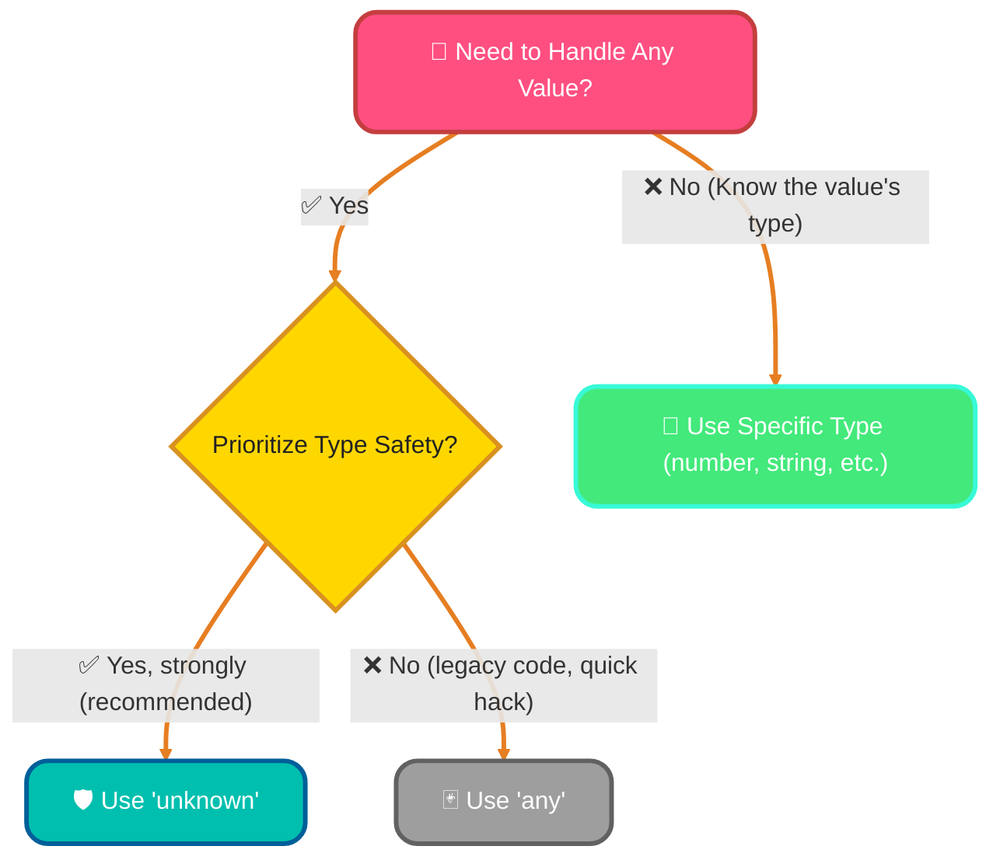
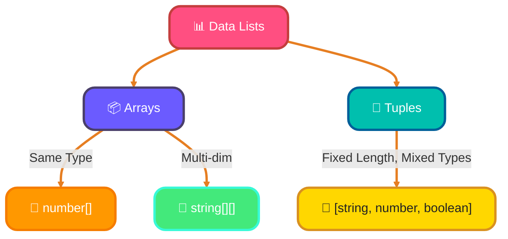
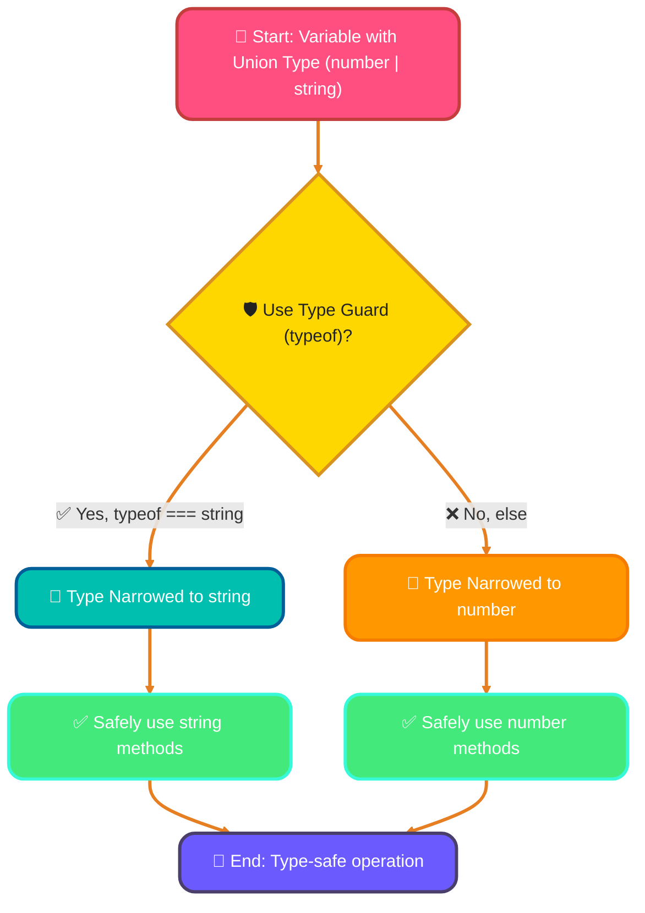
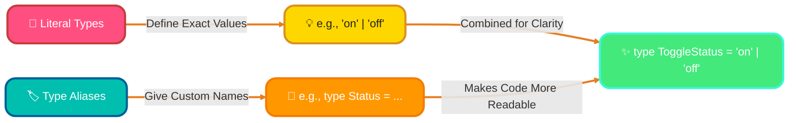

<!--
meta-description: Master TypeScript's type system from the ground up! This comprehensive guide covers primitive types, arrays, tuples, enums, type assertions, union and intersection types, literal types, and type aliases with practical examples and best practices.
keywords: TypeScript types, TypeScript basics, primitive types, arrays and tuples, TypeScript enums, type assertions, union types, intersection types, literal types, type aliases, type guards, type narrowing, TypeScript syntax
-->

# <span style="color:#e67e22;">What we will learn in this post?</span>
<ul style='list-style-type: none; padding-left: 0;'>
<li><span style='color: #2980b9; font-size: 20px; font-weight: bold;'>👉</span> <span style='color: #2ecc71; font-size: 18px; font-weight: bold;'>Basic TypeScript Types</span></li>
<li><span style='color: #2980b9; font-size: 20px; font-weight: bold;'>👉</span> <span style='color: #2ecc71; font-size: 18px; font-weight: bold;'>Type Inference in TypeScript</span></li>
<li><span style='color: #2980b9; font-size: 20px; font-weight: bold;'>👉</span> <span style='color: #2ecc71; font-size: 18px; font-weight: bold;'>Arrays and Tuples</span></li>
<li><span style='color: #2980b9; font-size: 20px; font-weight: bold;'>👉</span> <span style='color: #2ecc71; font-size: 18px; font-weight: bold;'>Enums in TypeScript</span></li>
<li><span style='color: #2980b9; font-size: 20px; font-weight: bold;'>👉</span> <span style='color: #2ecc71; font-size: 18px; font-weight: bold;'>Type Assertions and Type Casting</span></li>
<li><span style='color: #2980b9; font-size: 20px; font-weight: bold;'>👉</span> <span style='color: #2ecc71; font-size: 18px; font-weight: bold;'>Union and Intersection Types</span></li>
<li><span style='color: #2980b9; font-size: 20px; font-weight: bold;'>👉</span> <span style='color: #2ecc71; font-size: 18px; font-weight: bold;'>Literal Types and Type Aliases</span></li>
</ul>

# <span style="color:#e67e22">Welcome to TypeScript's Basic Types! 🧑‍💻</span>

TypeScript adds *type safety* to JavaScript, helping you catch errors early and write more robust code. Let's explore its fundamental types!

## <span style="color:#2980b9">The Everyday Essentials ✨</span>

These are your go-to types for common data:

### <span style="color:#8e44ad">Number 🔢</span>
For *any* numeric value, whether whole (`integer`) or decimal (`float`).
```typescript
let age: number = 30;
let price: number = 19.99; // Use for quantities, costs, etc.
```

### <span style="color:#8e44ad">String 📝</span>
For text! Enclose content in single (`''`), double (`""`), or backticks (`` ``) for template literals.
```typescript
let username: string = "Alice";
let greeting: string = `Hello, ${username}!`; // For names, messages, descriptions.
```

### <span style="color:#8e44ad">Boolean ✅</span>
For simple true/false values, perfect for logical checks or flags.
```typescript
let isActive: boolean = true;
let hasPermission: boolean = false; // For toggles, status indicators.
```

## <span style="color:#2980b9">Special Mentions 💡</span>

### <span style="color:#8e44ad">Null & Undefined 👻</span>
These represent an *absence* of a value. `null` is an *intentional* absence, while `undefined` means a variable hasn't been assigned anything yet.
```typescript
let data: string | null = null; // Data might be absent.
let notAssigned: string | undefined; // Defaults to undefined if not initialized.
```

### <span style="color:#8e44ad">Void 🚫</span>
Used for functions that *don't return any value*. They just perform an action.
```typescript
function logMessage(msg: string): void {
  console.log(msg); // This function logs, but returns nothing.
}
```

## <span style="color:#2980b9">Flexibility vs. Safety: Any vs. Unknown 🚧</span>

### <span style="color:#8e44ad">Any (The Wildcard) 🃏</span>
Bypasses *all* type checking. Use `any` *sparingly* when you truly don't know the type, or are migrating legacy JavaScript. It turns off TypeScript's safety net.
```typescript
let whatever: any = "hello";
whatever = 123; // No error! (TypeScript doesn't check)
whatever.toUpperCase(); // Possible runtime error if 'whatever' is 123
```

### <span style="color:#8e44ad">Unknown (The Safer Wildcard) ❓</span>
Like `any`, `unknown` can hold any value, but TypeScript *forces* you to narrow its type (check what it is) before performing operations. This promotes type safety.
```typescript
let mystery: unknown = "secret";
// mystery.toUpperCase(); // Error: Object is of type 'unknown'.
if (typeof mystery === 'string') {
  console.log(mystery.toUpperCase()); // OK, type narrowed to string
}
```

**When to choose:**
*   `any`: *Avoid* if possible. Use for quick fixes or deeply dynamic data that's hard to type.
*   `unknown`: *Prefer* for values coming from external sources (APIs, user input) where the exact type isn't guaranteed. It forces explicit, safe type checks.



# <span style="color:#e67e22">TypeScript Arrays & Tuples: Your Data Squad! 🚀</span>

Let's make our data lists super organized with TypeScript! It helps us know exactly what's inside.

## <span style="color:#2980b9">Basic Arrays: Organized Lists ✨</span>
TypeScript lets you specify what type of items an array holds. For numbers, use `number[]` or `Array<number>`. For strings, `string[]` or `Array<string>`.

*   *Example:* `let scores: number[] = [85, 92, 78];`

## <span style="color:#2980b9">Multi-dimensional Arrays: Arrays of Arrays 🗺️</span>
Need arrays within arrays, like a grid? Just add more `[]` to your type!

*   *Example:* `let matrix: number[][] = [[1, 2], [3, 4]];`

## <span style="color:#2980b9">Tuples: Fixed-Length, Mixed Types 🤝</span>
Tuples are special arrays with a *fixed number* of elements, where each position has a *specific, known type*. Great for profiles or coordinates!

*   *Example:* `let userProfile: [string, number, boolean] = ["Alice", 30, true];`
    *   *Here, `userProfile` must have exactly three elements: a string, then a number, then a boolean.*

## <span style="color:#2980b9">Readonly Arrays: Immutable Data 🔒</span>
To ensure an array's contents can't be changed after creation, use the `readonly` keyword.

*   *Example:* `let fixedNumbers: readonly number[] = [10, 20];`
    *   `fixedNumbers.push(30);` // ❌ *Error! You can't modify a readonly array.*

## <span style="color:#2980b9">Array Methods: Business as Usual 🛠️</span>
Standard JavaScript array methods like `.push()`, `.map()`, and `.filter()` work just as you'd expect, respecting all your TypeScript types!

*   *Example:* `scores.push(95);` // ✅ *Valid, as `scores` is an array of numbers.*



# <span style="color:#e67e22">TypeScript Enums: Your Constant Companions 🤝</span>

Need to represent a fixed set of meaningful values like `North` or `Pending` clearly? TypeScript *Enums* (`enum`) are perfect! They let you define named constants, making your code super readable and reducing errors from "magic numbers" or hardcoded strings. Think of them as a way to give names to numbers or strings that have special meaning.

## <span style="color:#2980b9">Enum Types & Purpose 💡</span>

Enums boost readability and provide type safety. Here are the common kinds:

*   **Numeric Enums:** Assign numerical values (defaulting `0`, `1`, etc. if not specified). Great for status codes or directions.
    ```typescript
    enum Direction { North, East, South } // North is 0, East is 1
    let myWay: Direction = Direction.North;
    ```
*   **String Enums:** Use actual readable string values. Very useful for API responses or logging categories.
    ```typescript
    enum Status { Pending = "PENDING", Approved = "APPROVED" }
    let orderStatus: Status = Status.Approved;
    ```
*   **Heterogeneous Enums:** A mix of numeric and string members (less common, but possible).
    ```typescript
    enum Mixed { No = 0, Yes = "YES" }
    ```

## <span style="color:#2980b9">Compilation & Const Enums ✨</span>

When TypeScript compiles, regular enums typically become *JavaScript objects*, allowing you to access both the name from the value and vice-versa. This offers flexibility but adds minor runtime overhead.

### <span style="color:#8e44ad">Optimize with `const enum` 🚀</span>

For maximum performance, use `const enum`. These completely disappear at compile time, replaced directly by their literal values in the JavaScript output. They're ideal when enum values are known *before* runtime, like `Direction.North` becoming `0`. This makes your JavaScript leaner and faster!

```typescript
const enum LogLevel { DEBUG, INFO }
console.log(LogLevel.INFO); // Compiles to console.log(1);
```


# <span style="color:#e67e22">TypeScript Type Assertions: Your Guiding Hand! 👋</span>

Sometimes, *you* know a variable's type better than TypeScript. Assertions tell the compiler, "Trust me!" They're **compile-time hints**, **not** runtime conversions.

## <span style="color:#2980b9">Two Ways to Assert! ✨</span>

You can use:
*   **Angle-Bracket:** `<string>myVar`
*   **`as` Syntax:** `myVar as string` (preferred, especially in JSX).
    *   *Example:* `let val: any = "text"; let len = (val as string).length;`

## <span style="color:#2980b9">Assertion ≠ Conversion! 💡</span>

Assertions **don't change data**. `(someValue as number)` won't convert `"5"` to `5`. It just tells TS how to *treat* it. If `someValue` is a `string` but asserted as `number`, you risk a runtime error using `number` methods.

## <span style="color:#2980b9">The "I'm Sure it's Not Null!" Operator `!` 🛡️</span>

The non-null assertion `!` tells TypeScript: "This value isn't `null` or `undefined`."
*   *Example:* `document.getElementById('id')!.value`. Use *only* when certain, as it bypasses critical null safety checks.

## <span style="color:#2980b9">When & How to Assert Wisely 🤔</span>

Use sparingly when TypeScript can't infer correctly (e.g., `document.getElementById`) or with `any` types. **Best Practice:** Only when *absolutely certain* of the type. `as Type` is generally favored. Overuse hides potential bugs.

# <span style="color:#e67e22">Understanding Union & Intersection Types in TypeScript ✨</span>

TypeScript helps us define variable types precisely. But what if a variable can be *one of several* types, or needs *all properties* from multiple types? Let's explore!

---

## <span style="color:#2980b9">Union Types: "OR" Logic 🧩</span>

A variable can be *either* `Type1` *or* `Type2`. We use the pipe symbol (`|`) to define them.

*   **How it works:** `let id: number | string;` means `id` can hold a `number` *or* a `string`.
*   **Why use it:** Great for flexible data, like an ID that might be numeric or text.

---

## <span style="color:#2980b9">Intersection Types: "AND" Logic 🤝</span>

Intersection types combine *all* properties from `Type1` *and* `Type2` into a single new type. We use the ampersand symbol (`&`).

*   **How it works:** `type FullUser = User & Permissions;` creates a `FullUser` with *all* properties from `User` *and* `Permissions`.
*   **Why use it:** Useful for combining functionalities or merging object shapes.

---

## <span style="color:#2980b9">Type Guards & Narrowing: Staying Safe! 🛡️</span>

When using union types, TypeScript needs to *know* the specific type at runtime. This process is called ***narrowing***. We achieve this using ***type guards***. A common guard is the `typeof` operator.

*   **How it works:** `typeof` checks a variable's type, intelligently *narrowing* it within a code block. This allows safe access to type-specific methods.

```typescript
function processId(input: number | string) {
  if (typeof input === "string") {
    console.log(input.toUpperCase()); // input is now 'string'
  } else {
    console.log(input.toFixed(2)); // input is now 'number'
  }
}
```



---

### <span style="color:#8e44ad">Practical Applications 💡</span>

*   **Unions:**
    *   Handling diverse API responses (e.g., `SuccessData | ErrorData`).
    *   Defining flexible component props that accept different data types.
*   **Intersections:**
    *   Creating complex objects by merging simpler types.
    *   Implementing mixins for shared functionalities.

---
For more info: [TypeScript Handbook - Everyday Types](https://www.typescriptlang.org/docs/handbook/2/everyday-types.html)

# <span style="color:#e67e22">Super Specific Types & Nicknames! 🎯</span>

Ever need a type that's *exactly* a certain value, not just any `string` or `number`? That's where **literal types** come in! Instead of `string`, you can say `let x: 'hello' | 'world'`, meaning `x` can *only* be the string `"hello"` or `"world"`. It's like a very specific menu!

Here are some examples:

*   **String Literals**: `let color: 'red' | 'blue';` 🟥 (Can only be 'red' or 'blue')
*   **Numeric Literals**: `let level: 1 | 2 | 3;` 🔢 (Can only be 1, 2, or 3)

---

## <span style="color:#2980b9">Type Aliases: Your Code's Nickname Generator! 🏷️</span>

When types get a bit long or complex, **type aliases** (`type` keyword) are your best friend! They let you create a friendly custom name for *any* type definition. It makes your code much cleaner and easier to read.

*   `type UserID = string | number;`
*   Now, instead of writing `string | number` repeatedly, you can just use `UserID`.

---

### <span style="color:#8e44ad">Combining Them for Super Clarity! 🤝</span>

Mixing literal types with type aliases makes your code incredibly readable and maintainable! You can give a simple name to a set of exact values.

Let's define allowed directions for a game:

```typescript
type Direction = 'north' | 'south' | 'east' | 'west';
let playerMovement: Direction = 'east'; // This is valid!
// playerMovement = 'up'; // ❌ Error! 'up' isn't a valid Direction.
```

This clearly states what values `playerMovement` can hold.



For more details, check out the [TypeScript Handbook on Literal Types](https://www.typescriptlang.org/docs/handbook/2/everyday-types.html#literal-types) and [Type Aliases](https://www.typescriptlang.org/docs/handbook/2/everyday-types.html#type-aliases).

---

### <span style="color:#8e44ad">🎮 Try TypeScript Types Live!</span>

{% include code-playground.html 
   language="typescript" 
   code="// Primitive Types
let age: number = 25;
let name: string = 'Alice';
let isStudent: boolean = true;
console.log(`${name} is ${age} years old`);

// Arrays and Tuples
let scores: number[] = [85, 92, 78];
let profile: [string, number] = ['Bob', 30];
console.log('Scores:', scores);
console.log('Profile:', profile);

// Union Types
function printId(id: number | string) {
  if (typeof id === 'string') {
    console.log('String ID:', id.toUpperCase());
  } else {
    console.log('Numeric ID:', id.toFixed(2));
  }
}
printId(123);
printId('ABC-456');

// Type Aliases & Literal Types
type Status = 'pending' | 'approved' | 'rejected';
let orderStatus: Status = 'approved';
console.log('Order status:', orderStatus);" 
   title="🎯 Explore TypeScript Type System" 
%}

{% include code-playground.html 
   language="typescript" 
   code="// Enums
enum LogLevel {
  DEBUG,
  INFO,
  WARNING,
  ERROR
}

function log(level: LogLevel, message: string) {
  console.log(`[${LogLevel[level]}] ${message}`);
}

log(LogLevel.INFO, 'Application started');
log(LogLevel.ERROR, 'An error occurred');

// String Enum
enum Direction {
  North = 'NORTH',
  South = 'SOUTH',
  East = 'EAST',
  West = 'WEST'
}

let playerDirection: Direction = Direction.North;
console.log('Moving:', playerDirection);

// Intersection Types
type User = { name: string; email: string };
type Admin = { role: string; permissions: string[] };
type AdminUser = User & Admin;

const admin: AdminUser = {
  name: 'John',
  email: 'john@example.com',
  role: 'SuperAdmin',
  permissions: ['read', 'write', 'delete']
};

console.log('Admin:', admin);" 
   title="🔧 Advanced Type Features" 
%}

---

<details>
<summary><strong>💡 Project: Product Inventory System - Master TypeScript Type System</strong> (Click to expand)</summary>
<br>
<p><strong>🚀 Your Challenge:</strong></p>
<p>Build a comprehensive <strong>Product Inventory Management System</strong> that demonstrates TypeScript's advanced type system including enums, union types, intersection types, type aliases, and type guards. Your system should manage products with proper type safety and runtime validation. 📦✨</p>

<p><strong>📋 Requirements:</strong></p>

<p><strong>Part 1: Type Definitions & Enums</strong></p>
<ul>
<li>Create <code>ProductCategory</code> enum:
  <ul>
    <li>Electronics</li>
    <li>Clothing</li>
    <li>Food</li>
    <li>Books</li>
  </ul>
</li>
<li>Define <code>ProductStatus</code> type alias with literal types:
  <ul>
    <li><code>type ProductStatus = 'in-stock' | 'low-stock' | 'out-of-stock'</code></li>
  </ul>
</li>
<li>Create <code>Product</code> interface:
  <ul>
    <li><code>id: number | string</code> (union type)</li>
    <li><code>name: string</code></li>
    <li><code>category: ProductCategory</code></li>
    <li><code>price: number</code></li>
    <li><code>status: ProductStatus</code></li>
    <li><code>quantity: number</code></li>
  </ul>
</li>
</ul>

<p><strong>Part 2: Advanced Type Combinations</strong></p>
<ul>
<li>Create <code>DiscountProduct</code> intersection type:
  <ul>
    <li>Combine <code>Product</code> with discount properties</li>
    <li><code>type DiscountProduct = Product & { discountPercent: number; finalPrice: number }</code></li>
  </ul>
</li>
<li>Define tuple types for function returns:
  <ul>
    <li><code>[Product, string]</code> for operations returning product and message</li>
  </ul>
</li>
<li>Use readonly arrays where data shouldn't be modified:
  <ul>
    <li><code>readonly Product[]</code> for immutable product lists</li>
  </ul>
</li>
</ul>

<p><strong>Part 3: Function Implementation with Type Guards</strong></p>
<ul>
<li>Implement <code>addProduct(product: Product): void</code>
  <ul>
    <li>Validate all required fields</li>
    <li>Check price and quantity are positive</li>
    <li>Add to inventory array</li>
  </ul>
</li>
<li>Implement <code>updateStock(id: number | string, quantity: number): ProductStatus</code>
  <ul>
    <li>Find product by id (handle both number and string)</li>
    <li>Update quantity</li>
    <li>Use type guards to determine new status</li>
    <li>Return updated status</li>
  </ul>
</li>
<li>Implement <code>calculatePrice(product: Product | DiscountProduct): number</code>
  <ul>
    <li>Handle both regular and discounted products</li>
    <li>Use type guards to check for discount properties</li>
    <li>Return final price</li>
  </ul>
</li>
<li>Implement <code>filterByCategory(category: ProductCategory): Product[]</code>
  <ul>
    <li>Filter products by enum category</li>
    <li>Return filtered array</li>
  </ul>
</li>
</ul>

<p><strong>Part 4: Type Assertions & Runtime Validation</strong></p>
<ul>
<li>Parse external data with type assertions:
  <ul>
    <li>Handle JSON input as <code>unknown</code> type</li>
    <li>Validate structure before asserting as <code>Product</code></li>
  </ul>
</li>
<li>Implement custom type predicates:
  <ul>
    <li><code>function isDiscountProduct(product: Product | DiscountProduct): product is DiscountProduct</code></li>
    <li>Check for discount-specific properties at runtime</li>
  </ul>
</li>
<li>Handle edge cases:
  <ul>
    <li>Null/undefined checks</li>
    <li>Invalid enum values</li>
    <li>Out-of-range quantities</li>
  </ul>
</li>
</ul>

<p><strong>💡 Implementation Hints:</strong></p>
<ul>
<li><strong>Step 1:</strong> Define enums first: <code>enum ProductCategory { Electronics, Clothing, Food, Books }</code></li>
<li><strong>Step 2:</strong> Use union types for flexible IDs: <code>id: number | string</code></li>
<li><strong>Step 3:</strong> Create type aliases for complex types: <code>type ProductStatus = ...</code></li>
<li><strong>Step 4:</strong> Implement type guards with <code>typeof</code>: <code>if (typeof id === 'string') { ... }</code></li>
<li><strong>Step 5:</strong> Use <code>in</code> operator for property checks: <code>if ('discountPercent' in product) { ... }</code></li>
<li><strong>Step 6:</strong> Apply intersection types with spread: <code>{ ...product, discountPercent: 10 }</code></li>
<li><strong>Bonus:</strong> Use named groups for clarity: <code>(?P<name>pattern)</code> equivalent type names</li>
</ul>

<p><strong>📊 Example Usage:</strong></p>
<pre>
// Define products
const laptop: Product = {
  id: 'PROD-001',
  name: 'Gaming Laptop',
  category: ProductCategory.Electronics,
  price: 1299.99,
  status: 'in-stock',
  quantity: 15
};

// Create discounted product
const discountedLaptop: DiscountProduct = {
  ...laptop,
  discountPercent: 10,
  finalPrice: calculatePrice(laptop, 10)
};

// Filter by category
const electronics = filterByCategory(ProductCategory.Electronics);
console.log(electronics);
// [
//   { id: 'PROD-001', name: 'Gaming Laptop', ... },
//   { id: 'PROD-002', name: 'Wireless Mouse', ... }
// ]

// Calculate price with type guard
console.log(calculatePrice(discountedLaptop));
// 1169.99 (with 10% discount applied)

// Update stock with type narrowing
const newStatus = updateStock('PROD-001', 50);
console.log(newStatus); // 'in-stock'
</pre>

<p><strong>🎆 Bonus Challenges:</strong></p>
<ul>
<li><strong>Challenge 1:</strong> Add generic <code>Warehouse<T extends Product></code> for different storage strategies</li>
<li><strong>Challenge 2:</strong> Implement mapped types: <code>type ReadonlyProduct = { readonly [K in keyof Product]: Product[K] }</code></li>
<li><strong>Challenge 3:</strong> Use conditional types for discount eligibility: <code>type CanDiscount<T> = T extends { price: number } ? true : false</code></li>
<li><strong>Challenge 4:</strong> Create utility types: <code>type PartialProduct = Partial<Product></code> for updates</li>
<li><strong>Challenge 5:</strong> Add discriminated unions: <code>type PhysicalProduct | DigitalProduct</code> with <code>kind</code> property</li>
<li><strong>Challenge 6:</strong> Implement function overloads for different product operations</li>
</ul>

<p><strong>Share Your Solution! 💬</strong></p>
<p>Built your inventory system? Awesome! Share your code in the comments below. How did type guards help you? What TypeScript features were most useful? Let's learn together! 🚀</p>

</details>

---

## <span style="color:#ff4f81">🎯 Hands-On Assignment</span>

<p><strong>📋 Problem Statement
Build a **Product Inventory Management System** that demonstrates TypeScript's type system including enums, union types, type aliases, and type guards.

### Requirements
1. Create the following types and enums:
   - `ProductCategory` enum with values: Electronics, Clothing, Food, Books
   - `ProductStatus` type alias with literal types: 'in-stock' | 'low-stock' | 'out-of-stock'
   - `Product` interface with: id (number or string), name, category, price, status, quantity
   - `DiscountProduct` intersection type combining Product with discount properties
2. Implement functions with proper type annotations:
   - `addProduct()` - accepts Product and validates data
   - `updateStock()` - updates quantity and status using type guards
   - `calculatePrice()` - handles regular and discounted products with union types
   - `filterByCategory()` - returns products array filtered by enum category
3. Use type assertions when needed (e.g., parsing external data)
4. Implement type guards for runtime type checking
5. Handle edge cases with proper null/undefined checks

### Implementation Hints
1. Use `enum ProductCategory` for category constants
2. Define type aliases for complex union types
3. Use tuple types for returning multiple values: `[Product, string]`
4. Implement type guards with `typeof` and custom type predicates
5. Use readonly arrays where data shouldn't be modified
6. Apply intersection types for extending functionality

### Example Input/Output
```typescript
// Create products
const laptop: Product = {
  id: 'PROD-001',
  name: 'Gaming Laptop',
  category: ProductCategory.Electronics,
  price: 1299.99,
  status: 'in-stock',
  quantity: 15
};

const discountedItem: DiscountProduct = {
  ...laptop,
  discountPercent: 10,
  finalPrice: calculatePrice(laptop, 10)
};

// Output
console.log(filterByCategory(ProductCategory.Electronics));
// [
//   { id: 'PROD-001', name: 'Gaming Laptop', ... },
//   { id: 'PROD-002', name: 'Wireless Mouse', ... }
// ]

console.log(calculatePrice(laptop, 10));
// 1169.99 (with 10% discount)
```

### Bonus Challenges
1. Add a generic `Warehouse<T>` type for different product storage strategies
2. Implement mapped types to create readonly versions of interfaces
3. Use conditional types to infer discount eligibility
4. Create utility types for partial product updates
5. Add discriminated unions for different product types (physical, digital)
6. Implement type-safe event handlers using function overloads

### Submission Guidelines
- Use strict mode in `tsconfig.json` (`"strict": true`)
- Avoid using `any` type - use `unknown` with type guards instead
- Add JSDoc comments for complex types
- Include example usage demonstrating all type features
- Test type safety with intentional errors (commented out)

**Looking forward to your solutions!** Share your implementation below. 💬

</details>

---

# <span style="color:#e67e22">🎓 Conclusion</span>

Congratulations on mastering TypeScript's type system! You've learned how to leverage primitive types, arrays, tuples, enums, and advanced features like union/intersection types and type aliases to write safer, more maintainable code. By understanding type guards and narrowing, you can now handle dynamic data confidently while maintaining TypeScript's compile-time safety guarantees. These fundamentals form the foundation for building robust applications with TypeScript.

---

