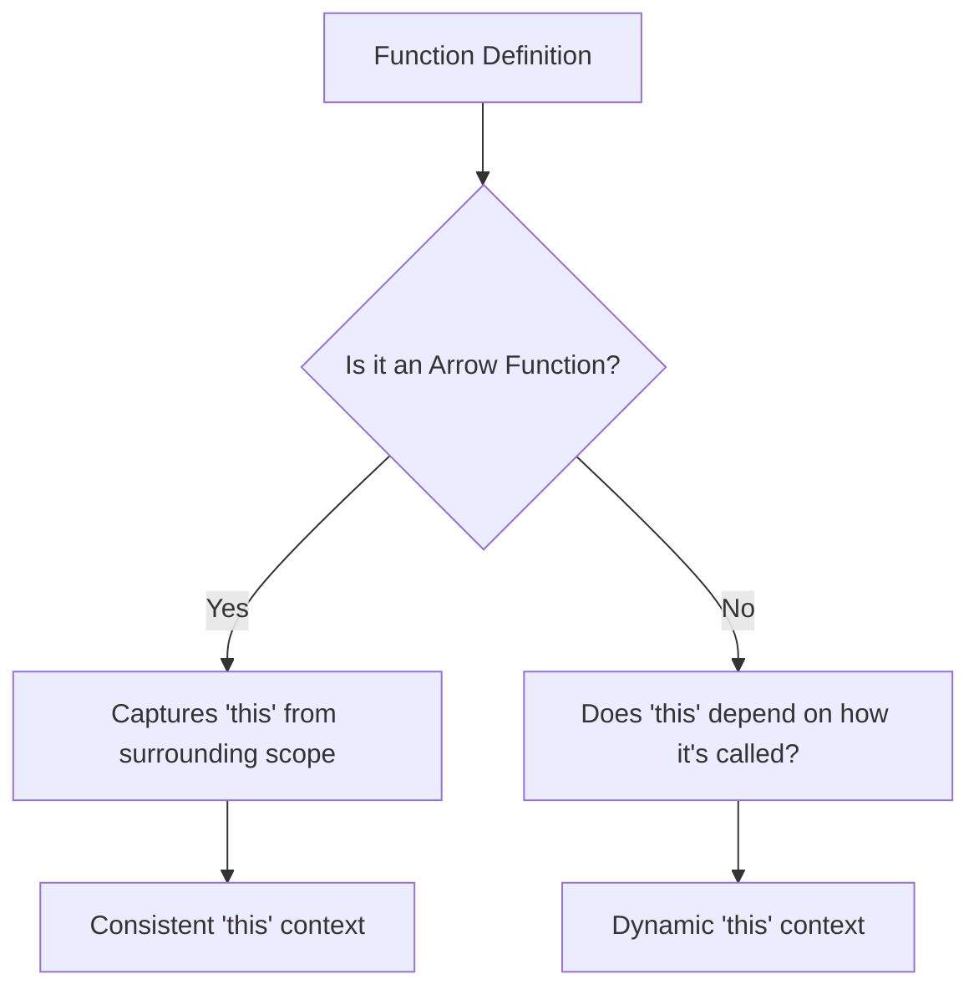

---
---
title: "03. Functions in TypeScript"
description: "✨ Elevate your coding with TypeScript functions! Discover how to build robust, type-safe logic using optional parameters, generics, overloading, and arrow functions for cleaner, more predictable applications. 🚀"
author: infoyouth
date: 2025-12-11 02:00:00 +0000 02:00:00 +0000
categories:
  - Programming
  - TypeScript
  - Functions
tags:
  - TypeScript
  - Functions
  - Type Safety
  - Generics
  - Arrow Functions
pin: true
math: false
mermaid: true
---

# <span style="color:#e67e22;">What we will learn in this post?</span>
<ul style='list-style-type: none; padding-left: 0;'>
<li><span style='color: #2980b9; font-size: 20px; font-weight: bold;'>👉</span> <span style='color: #2ecc71; font-size: 18px; font-weight: bold;'>Typed Functions in TypeScript</span></li>
<li><span style='color: #2980b9; font-size: 20px; font-weight: bold;'>👉</span> <span style='color: #2ecc71; font-size: 18px; font-weight: bold;'>Optional and Default Parameters</span></li>
<li><span style='color: #2980b9; font-size: 20px; font-weight: bold;'>👉</span> <span style='color: #2ecc71; font-size: 18px; font-weight: bold;'>Rest Parameters and Spread Operator</span></li>
<li><span style='color: #2980b9; font-size: 20px; font-weight: bold;'>👉</span> <span style='color: #2ecc71; font-size: 18px; font-weight: bold;'>Function Overloading</span></li>
<li><span style='color: #2980b9; font-size: 20px; font-weight: bold;'>👉</span> <span style='color: #2ecc71; font-size: 18px; font-weight: bold;'>Generic Functions</span></li>
<li><span style='color: #2980b9; font-size: 20px; font-weight: bold;'>👉</span> <span style='color: #2ecc71; font-size: 18px; font-weight: bold;'>Arrow Functions and This Context</span></li>
<li><span style='color: #2980b9; font-size: 20px; font-weight: bold;'>👉</span> <span style='color: #2ecc71; font-size: 18px; font-weight: bold;'>Function Types and Callbacks</span></li>
</ul>

Error: An error occurred while processing your request. Please try again later.

Error: An error occurred while processing your request. Please try again later.

# <span style="color:#e67e22">✨ Flexible Functions with Rest & Spread!</span>

Let's make our TypeScript functions super versatile! We'll look at two powerful tools for handling arguments: **Rest Parameters** and the **Spread Operator**.

## <span style="color:#2980b9">📦 Rest Parameters: Gathering Arguments</span>

Ever wanted a function to accept *any* number of arguments? That's where ***Rest Parameters*** (`...args: Type[]`) come in! They let you collect multiple, individual inputs into a single *array* inside your function. Think of it as a **"collector"**!

*   **Type Safety:** `...items: string[]` means `items` will be an array of `string`s, giving you strong type checks.
*   **Placement:** A rest parameter *must* always be the very last parameter.

```typescript
function combineWords(separator: string, ...words: string[]): string {
  // 'words' is an array here, like ["hello", "world"]
  return words.join(separator);
}
console.log(combineWords("-", "apple", "banana", "cherry"));
// Output: "apple-banana-cherry"
```

## <span style="color:#2980b9">✨ Spread Operator: Spreading Arguments</span>

The ***Spread Operator*** (`...array`) does the opposite! It takes an array and **"unpacks"** its elements, spreading them out as individual arguments. Think of it as an **"unpacker"** for when a function expects separate values.

```typescript
const fruitsToAdd = ["grape", "kiwi"];
console.log(combineWords(" + ", "orange", ...fruitsToAdd, "melon"));
// ...fruitsToAdd unpacks to "grape", "kiwi" as separate arguments.
// Output: "orange + grape + kiwi + melon"
```

## <span style="color:#2980b9">👍 Why Are They So Cool?</span>

They make your functions incredibly flexible and cleaner! Rest parameters handle varied input effortlessly, while the spread operator simplifies passing array elements where individual arguments are expected.

### <span style="color:#8e44ad">🔗 More Info:</span>

*   [TypeScript Handbook: Rest Parameters](https://www.typescriptlang.org/docs/handbook/2/functions.html#rest-parameters)
*   [MDN Web Docs: Spread syntax](https://developer.mozilla.org/en-US/docs/Web/JavaScript/Reference/Operators/Spread_syntax)

```mermaid
graph TD
    A[Function Call] -->|...args (Rest)| B(Array inside Function);
    C[Array] -->|...array (Spread)| D(Individual Arguments for Function);
```

Error: An error occurred while processing your request. Please try again later.

# <span style="color:#e67e22">Understanding Generic Functions 🚀</span>

Generics are fantastic tools that let you write incredibly flexible and reusable functions! Imagine creating a single function that can gracefully handle *any* type of data – be it numbers, strings, or even complex objects – without you needing to write a separate, specialized version for each. That's the magic of generics!

## <span style="color:#2980b9">Why Generics are Awesome! 🤔</span>
They help you build *type-safe* code that is also highly *reusable*. Instead of duplicating logic for different data types, generics provide one robust, clear solution, making your code cleaner and less error-prone.

## <span style="color:#2980b9">The Magic of `<T>` ✨</span>
The `<T>` you see in a function definition is a **type parameter**. Think of `T` as a clever placeholder for *any* type that will be passed into the function when it's called.

*   **Practical Example: The Identity Function**
    ```typescript
    function identity<T>(arg: T): T {
      return arg;
    }
    ```
    Here, `identity` simply returns whatever you give it.
    *   If you call `identity(123)`, `T` becomes `number`, and it returns a `number`.
    *   If you call `identity("hello")`, `T` becomes `string`, and it returns a `string`.
    It perfectly maintains the original type!

## <span style="color:#2980b9">Smarter Generics with Constraints 🔗</span>
Sometimes, `T` might need to have certain characteristics (e.g., it must be an object with a `length` property). *Generic constraints* (like `T extends { length: number }`) let you specify these requirements, ensuring type safety while maintaining flexibility.

## <span style="color:#2980b9">Beyond One Type: Multiple Parameters 🤝</span>
You can use multiple type parameters, such as `<T, U>`, when your function needs to work with several different, possibly related, types simultaneously. For instance, a generic function that processes two different types of inputs.

## <span style="color:#2980b9">Preserving Type Information 🛡️</span>
Generics truly shine by *preserving type information*. They tell TypeScript exactly what type is expected, allowing it to catch potential errors during development, rather than having issues pop up at runtime. This is significantly safer than using `any`!

```mermaid
graph TD
    A[Call Generic Function] --> B{Input Data (Type: X)}
    B --> C{Generic Function<T>}
    C --> D[T takes on Type X]
    D --> E{Function Logic}
    E --> F[Output Data (Type: X)]
```

### <span style="color:#8e44ad">Further Learning 📚</span>
*   For a deeper dive, check out the [TypeScript Generics Official Documentation](https://www.typescriptlang.org/docs/handbook/2/generics.html).

# <span style="color:#e67e22">Arrow Functions in TypeScript: A Quick Guide 🚀</span>

## <span style="color:#2980b9">What are Arrow Functions? 🤔</span>
Arrow functions offer a *concise* way to write functions in TypeScript. Their syntax is typically `(parameters) => expression` for an implicit return (no `return` keyword needed if it's a single expression), or `(parameters) => { statements }` for explicit returns with multiple lines of code. They're shorter and often clearer than traditional `function` declarations, especially for simple tasks.

## <span style="color:#2980b9">The Magic of `this` ✨</span>
One major difference is how they handle the `this` keyword. Arrow functions *lexically capture* `this` from their surrounding scope. This means `this` inside an arrow function will always refer to the `this` of the code block where the arrow function was defined, making its context predictable. Regular functions, however, determine `this` based on *how* they are called, which can lead to unexpected behavior.



## <span style="color:#2980b9">When to Use Them? ✅</span>
Arrow functions shine in scenarios where you need a function that *doesn't rebind `this`*, such as:
*   **Callbacks:** `array.map(item => item * 2)`
*   **Event Handlers:** `button.addEventListener('click', () => console.log(this.name))`
They prevent common `this` context issues. For complex functions, or methods that *need* their own dynamic `this` context, regular functions are often more suitable.

### <span style="color:#8e44ad">Examples 💡</span>
```typescript
// Callback example (implicit return!)
const numbers = [1, 2, 3];
const doubled = numbers.map(num => num * 2); // doubled is [2, 4, 6]

// Event handler example (captures 'this' from class instance)
class Greeter {
  message = "Hello!";
  greet = () => console.log(this.message); // 'this' refers to the Greeter instance
}

const greeter = new Greeter();
// greeter.greet() will correctly log "Hello!"
```

For more info: [TypeScript Handbook - Functions](https://www.typescriptlang.org/docs/handbook/2/functions.html#arrow-functions)

Error: An error occurred while processing your request. Please try again later.

