```mermaid
graph LR
    A["🎯 Higher-Order Function"]:::style1 --> B["📥 Receives Callback"]:::style2
    B --> C["⚙️ Executes Callback"]:::style4
    C --> D["📤 Returns Result"]:::style5

    classDef style1 fill:#ff4f81,stroke:#c43e3e,color:#fff,font-size:16px,stroke-width:3px,rx:14,shadow:6px;
    classDef style2 fill:#6b5bff,stroke:#4a3f6b,color:#fff,font-size:16px,stroke-width:3px,rx:14,shadow:6px;
    classDef style4 fill:#00bfae,stroke:#005f99,color:#fff,font-size:16px,stroke-width:3px,rx:14,shadow:6px;
    classDef style5 fill:#ff9800,stroke:#f57c00,color:#fff,font-size:16px,stroke-width:3px,rx:14,shadow:6px;

    linkStyle default stroke:#e67e22,stroke-width:3px;
```

<!--
meta-description: "Master TypeScript functions with typed parameters, optional/default values, generics, overloading, arrow functions, and callbacks for type-safe, reusable code."
keywords: "TypeScript functions, typed functions, optional parameters, default parameters, rest parameters, spread operator, function overloading, generic functions, arrow functions, callbacks, function types"
-->

# <span style="color:#e67e22;">What we will learn in this post?</span>
<ul style='list-style-type: none; padding-left: 0;'>
<li><span style='color: #2980b9; font-size: 20px; font-weight: bold;'>👉</span> <span style='color: #2ecc71; font-size: 18px; font-weight: bold;'>Typed Functions in TypeScript</span></li>
<li><span style='color: #2980b9; font-size: 20px; font-weight: bold;'>👉</span> <span style='color: #2ecc71; font-size: 18px; font-weight: bold;'>Optional and Default Parameters</span></li>
<li><span style='color: #2980b9; font-size: 20px; font-weight: bold;'>👉</span> <span style='color: #2ecc71; font-size: 18px; font-weight: bold;'>Rest Parameters and Spread Operator</span></li>
<li><span style='color: #2980b9; font-size: 20px; font-weight: bold;'>👉</span> <span style='color: #2ecc71; font-size: 18px; font-weight: bold;'>Function Overloading</span></li>
<li><span style='color: #2980b9; font-size: 20px; font-weight: bold;'>👉</span> <span style='color: #2ecc71; font-size: 18px; font-weight: bold;'>Generic Functions</span></li>
<li><span style='color: #2980b9; font-size: 20px; font-weight: bold;'>👉</span> <span style='color: #2ecc71; font-size: 18px; font-weight: bold;'>Arrow Functions and This Context</span></li>
<li><span style='color: #2980b9; font-size: 20px; font-weight: bold;'>👉</span> <span style='color: #2ecc71; font-size: 18px; font-weight: bold;'>Function Types and Callbacks</span></li>
</ul>

# <span style="color:#e67e22">Typed Functions in TypeScript 🎯</span>

## <span style="color:#2980b9">What are Typed Functions? 🤔</span>
In TypeScript, you can specify types for function parameters and return values. This helps catch errors early and makes your code more predictable.

## <span style="color:#2980b9">Basic Function Syntax 📝</span>
```typescript
function greet(name: string): string {
  return `Hello, ${name}!`;
}

const result = greet("Alice"); // result is a string
```

## <span style="color:#2980b9">Parameter Types 📌</span>
You must specify the type for each parameter:
```typescript
function add(x: number, y: number): number {
  return x + y;
}
```

## <span style="color:#2980b9">Return Types 🔙</span>
The return type comes after the parameters:
```typescript
function isAdult(age: number): boolean {
  return age >= 18;
}
```

## <span style="color:#2980b9">Void Functions 🚫</span>
Functions that don't return anything use `void`:
```typescript
function logMessage(message: string): void {
  console.log(message);
}
```

### <span style="color:#8e44ad">🔗 More Info:</span>
*   [TypeScript Handbook: Functions](https://www.typescriptlang.org/docs/handbook/2/functions.html)

# <span style="color:#e67e22">Optional and Default Parameters 🎨</span>

## <span style="color:#2980b9">Optional Parameters ❓</span>
Mark parameters as optional using `?`. Optional parameters can be undefined:
```typescript
function buildName(firstName: string, lastName?: string): string {
  if (lastName) {
    return `${firstName} ${lastName}`;
  }
  return firstName;
}

console.log(buildName("John")); // "John"
console.log(buildName("John", "Doe")); // "John Doe"
```

## <span style="color:#2980b9">Default Parameters 🎯</span>
Provide default values for parameters:
```typescript
function greet(name: string, greeting: string = "Hello"): string {
  return `${greeting}, ${name}!`;
}

console.log(greet("Alice")); // "Hello, Alice!"
console.log(greet("Bob", "Hi")); // "Hi, Bob!"
```

## <span style="color:#2980b9">Key Rules 📋</span>
*   Optional parameters must come after required parameters
*   Default parameters don't need to be at the end
*   Optional parameters are automatically `undefined` if not provided

```mermaid
graph LR
    A["🎯 Function Call"]:::style1 --> B{"❓ Has Optional Param?"}:::style3
    B -- "Yes" --> C["✅ Use Provided Value"]:::style4
    B -- "No" --> D{"🔍 Has Default Value?"}:::style3
    D -- "Yes" --> E["⚙️ Use Default"]:::style2
    D -- "No" --> F["❌ undefined"]:::style5

    classDef style1 fill:#ff4f81,stroke:#c43e3e,color:#fff,font-size:16px,stroke-width:3px,rx:14,shadow:6px;
    classDef style2 fill:#6b5bff,stroke:#4a3f6b,color:#fff,font-size:16px,stroke-width:3px,rx:14,shadow:6px;
    classDef style3 fill:#ffd700,stroke:#d99120,color:#222,font-size:16px,stroke-width:3px,rx:14,shadow:6px;
    classDef style4 fill:#00bfae,stroke:#005f99,color:#fff,font-size:16px,stroke-width:3px,rx:14,shadow:6px;
    classDef style5 fill:#ff9800,stroke:#f57c00,color:#fff,font-size:16px,stroke-width:3px,rx:14,shadow:6px;

    linkStyle default stroke:#e67e22,stroke-width:3px;
```



# <span style="color:#e67e22">✨ Flexible Functions with Rest & Spread!</span>

Let's make our TypeScript functions super versatile! We'll look at two powerful tools for handling arguments: **Rest Parameters** and the **Spread Operator**.

## <span style="color:#2980b9">📦 Rest Parameters: Gathering Arguments</span>

Ever wanted a function to accept *any* number of arguments? That's where ***Rest Parameters*** (`...args: Type[]`) come in! They let you collect multiple, individual inputs into a single *array* inside your function. Think of it as a **"collector"**!

*   **Type Safety:** `...items: string[]` means `items` will be an array of `string`s, giving you strong type checks.
*   **Placement:** A rest parameter *must* always be the very last parameter.

```typescript
function combineWords(separator: string, ...words: string[]): string {
  // 'words' is an array here, like ["hello", "world"]
  return words.join(separator);
}
console.log(combineWords("-", "apple", "banana", "cherry"));
// Output: "apple-banana-cherry"
```

## <span style="color:#2980b9">✨ Spread Operator: Spreading Arguments</span>

The ***Spread Operator*** (`...array`) does the opposite! It takes an array and **"unpacks"** its elements, spreading them out as individual arguments. Think of it as an **"unpacker"** for when a function expects separate values.

```typescript
const fruitsToAdd = ["grape", "kiwi"];
console.log(combineWords(" + ", "orange", ...fruitsToAdd, "melon"));
// ...fruitsToAdd unpacks to "grape", "kiwi" as separate arguments.
// Output: "orange + grape + kiwi + melon"
```

## <span style="color:#2980b9">👍 Why Are They So Cool?</span>

They make your functions incredibly flexible and cleaner! Rest parameters handle varied input effortlessly, while the spread operator simplifies passing array elements where individual arguments are expected.

### <span style="color:#8e44ad">💡 Real-World Example: Logger Function</span>
```typescript
// Production-ready logger with rest parameters
function log(level: string, timestamp: Date, ...messages: string[]): void {
  const formattedTime = timestamp.toISOString();
  console.log(`[${level}] ${formattedTime}:`, ...messages);
}

// Usage in web application
log("ERROR", new Date(), "Database connection failed", "Retrying...");
log("INFO", new Date(), "User logged in", "Session started");
```




# <span style="color:#e67e22">Function Overloading 🔄</span>

## <span style="color:#2980b9">What is Function Overloading? 🤔</span>

```mermaid
graph TD
    A["📞 Function Call"]:::style1 -->|"...args (Rest)"| B["📦 Array inside Function"]:::style4
    C["📚 Array"]:::style2 -->|"...array (Spread)"| D["⚡ Individual Arguments"]:::style5

    classDef style1 fill:#ff4f81,stroke:#c43e3e,color:#fff,font-size:16px,stroke-width:3px,rx:14,shadow:6px;
    classDef style2 fill:#6b5bff,stroke:#4a3f6b,color:#fff,font-size:16px,stroke-width:3px,rx:14,shadow:6px;
    classDef style4 fill:#00bfae,stroke:#005f99,color:#fff,font-size:16px,stroke-width:3px,rx:14,shadow:6px;
    classDef style5 fill:#ff9800,stroke:#f57c00,color:#fff,font-size:16px,stroke-width:3px,rx:14,shadow:6px;

    linkStyle default stroke:#e67e22,stroke-width:3px;
```

Function overloading lets you define multiple signatures for the same function. The function can accept different parameter types or counts.

## <span style="color:#2980b9">Basic Syntax 📝</span>
```typescript
// Overload signatures
function combine(a: string, b: string): string;
function combine(a: number, b: number): number;

// Implementation signature
function combine(a: any, b: any): any {
  return a + b;
}

console.log(combine("Hello", " World")); // "Hello World"
console.log(combine(10, 20)); // 30
```

## <span style="color:#2980b9">Why Use Overloading? 💡</span>
*   Better type safety for different input combinations
*   Clearer function documentation
*   IDE provides better autocomplete

## <span style="color:#2980b9">Key Points 🎯</span>
*   Write overload signatures first
*   Implementation signature must be compatible with all overloads
*   The implementation signature is not directly callable

```mermaid
graph TD
    A["🎯 Function Call"]:::style1 --> B{"🔍 Check Overload 1"}:::style3
    B -- "✅ Match" --> C["📋 Use Overload 1 Types"]:::style4
    B -- "❌ No Match" --> D{"🔍 Check Overload 2"}:::style3
    D -- "✅ Match" --> E["📋 Use Overload 2 Types"]:::style4
    D -- "❌ No Match" --> F["⚠️ Type Error"]:::style5
    C --> G["⚙️ Run Implementation"]:::style2
    E --> G

    classDef style1 fill:#ff4f81,stroke:#c43e3e,color:#fff,font-size:16px,stroke-width:3px,rx:14,shadow:6px;
    classDef style2 fill:#6b5bff,stroke:#4a3f6b,color:#fff,font-size:16px,stroke-width:3px,rx:14,shadow:6px;
    classDef style3 fill:#ffd700,stroke:#d99120,color:#222,font-size:16px,stroke-width:3px,rx:14,shadow:6px;
    classDef style4 fill:#00bfae,stroke:#005f99,color:#fff,font-size:16px,stroke-width:3px,rx:14,shadow:6px;
    classDef style5 fill:#ff9800,stroke:#f57c00,color:#fff,font-size:16px,stroke-width:3px,rx:14,shadow:6px;

    linkStyle default stroke:#e67e22,stroke-width:3px;
```



# <span style="color:#e67e22">Understanding Generic Functions 🚀</span>

Generics are fantastic tools that let you write incredibly flexible and reusable functions! Imagine creating a single function that can gracefully handle *any* type of data – be it numbers, strings, or even complex objects – without you needing to write a separate, specialized version for each. That's the magic of generics!

## <span style="color:#2980b9">Why Generics are Awesome! 🤔</span>
They help you build *type-safe* code that is also highly *reusable*. Instead of duplicating logic for different data types, generics provide one robust, clear solution, making your code cleaner and less error-prone.

## <span style="color:#2980b9">The Magic of `<T>` ✨</span>
The `<T>` you see in a function definition is a **type parameter**. Think of `T` as a clever placeholder for *any* type that will be passed into the function when it's called.

*   **Practical Example: The Identity Function**
    ```typescript
    function identity<T>(arg: T): T {
      return arg;
    }
    ```
    Here, `identity` simply returns whatever you give it.
    *   If you call `identity(123)`, `T` becomes `number`, and it returns a `number`.
    *   If you call `identity("hello")`, `T` becomes `string`, and it returns a `string`.
    It perfectly maintains the original type!

## <span style="color:#2980b9">Smarter Generics with Constraints 🔗</span>
Sometimes, `T` might need to have certain characteristics (e.g., it must be an object with a `length` property). *Generic constraints* (like `T extends { length: number }`) let you specify these requirements, ensuring type safety while maintaining flexibility.

## <span style="color:#2980b9">Beyond One Type: Multiple Parameters 🤝</span>
You can use multiple type parameters, such as `<T, U>`, when your function needs to work with several different, possibly related, types simultaneously. For instance, a generic function that processes two different types of inputs.

## <span style="color:#2980b9">Preserving Type Information 🛡️</span>
Generics truly shine by *preserving type information*. They tell TypeScript exactly what type is expected, allowing it to catch potential errors during development, rather than having issues pop up at runtime. This is significantly safer than using `any`!


### <span style="color:#8e44ad">💡 Real-World Example: API Response Cache</span>
```typescript
// Generic cache function for API responses
function cacheResponse<T>(key: string, data: T): T {
  localStorage.setItem(key, JSON.stringify(data));
  return data;
}

function getCachedResponse<T>(key: string): T | null {
  const cached = localStorage.getItem(key);
  return cached ? JSON.parse(cached) : null;
}

// Usage with different data types
interface User { id: number; name: string; }
interface Product { sku: string; price: number; }

const user = cacheResponse<User>("user_123", { id: 123, name: "Alice" });
const product = cacheResponse<Product>("prod_456", { sku: "ABC123", price: 99.99 });

const cachedUser = getCachedResponse<User>("user_123"); // Returns User | null
```

### <span style="color:#8e44ad">Further Learning 📚</span>
*   For a deeper dive, check out the [TypeScript Generics Official Documentation](https://www.typescriptlang.org/docs/handbook/2/generics.html).

# <span style="color:#e67e22">Arrow Functions in TypeScript: A Quick Guide 🚀</span>

## <span style="color:#2980b9">What are Arrow Functions? 🤔</span>
Arrow functions offer a *concise* way to write functions in TypeScript. Their syntax is typically `(parameters) => expression` for an implicit return (no `return` keyword needed if it's a single expression), or `(parameters) => { statements }` for explicit returns with multiple lines of code. They're shorter and often clearer than traditional `function` declarations, especially for simple tasks.

## <span style="color:#2980b9">The Magic of `this` ✨</span>
One major difference is how they handle the `this` keyword. Arrow functions *lexically capture* `this` from their surrounding scope. This means `this` inside an arrow function will always refer to the `this` of the code block where the arrow function was defined, making its context predictable. Regular functions, however, determine `this` based on *how* they are called, which can lead to unexpected behavior.

```mermaid
graph TD
    A["📝 Function Definition"]:::style1 --> B{"❓ Is it an Arrow Function?"}:::style3
    B -- "✅ Yes" --> C["🔒 Captures 'this' from surrounding scope"]:::style4
    B -- "❌ No" --> D["🔄 'this' depends on how it's called"]:::style2
    C --> E["✨ Consistent 'this' context"]:::style4
    D --> F["⚡ Dynamic 'this' context"]:::style5

    classDef style1 fill:#ff4f81,stroke:#c43e3e,color:#fff,font-size:16px,stroke-width:3px,rx:14,shadow:6px;
    classDef style2 fill:#6b5bff,stroke:#4a3f6b,color:#fff,font-size:16px,stroke-width:3px,rx:14,shadow:6px;
    classDef style3 fill:#ffd700,stroke:#d99120,color:#222,font-size:16px,stroke-width:3px,rx:14,shadow:6px;
    classDef style4 fill:#00bfae,stroke:#005f99,color:#fff,font-size:16px,stroke-width:3px,rx:14,shadow:6px;
    classDef style5 fill:#ff9800,stroke:#f57c00,color:#fff,font-size:16px,stroke-width:3px,rx:14,shadow:6px;

    linkStyle default stroke:#e67e22,stroke-width:3px;
```



## <span style="color:#2980b9">When to Use Them? ✅</span>
Arrow functions shine in scenarios where you need a function that *doesn't rebind `this`*, such as:
*   **Callbacks:** `array.map(item => item * 2)`
*   **Event Handlers:** `button.addEventListener('click', () => console.log(this.name))`
They prevent common `this` context issues. For complex functions, or methods that *need* their own dynamic `this` context, regular functions are often more suitable.

### <span style="color:#8e44ad">Examples 💡</span>
```typescript
// Callback example (implicit return!)
const numbers = [1, 2, 3];
const doubled = numbers.map(num => num * 2); // doubled is [2, 4, 6]

// Event handler example (captures 'this' from class instance)
class Greeter {
  message = "Hello!";
  greet = () => console.log(this.message); // 'this' refers to the Greeter instance
}

const greeter = new Greeter();
// greeter.greet() will correctly log "Hello!"
```

# <span style="color:#e67e22">Function Types and Callbacks 🔗</span>

## <span style="color:#2980b9">What are Function Types? 📚</span>
Function types describe the shape of a function, including its parameters and return type.

## <span style="color:#2980b9">Declaring Function Types 📝</span>
```typescript
// Function type
type MathOperation = (a: number, b: number) => number;

// Using the type
const add: MathOperation = (x, y) => x + y;
const multiply: MathOperation = (x, y) => x * y;
```

## <span style="color:#2980b9">Callback Functions 🔄</span>
Callbacks are functions passed as arguments to other functions:
```typescript
function processData(data: string[], callback: (item: string) => void): void {
  data.forEach(item => callback(item));
}

processData(["a", "b", "c"], (item) => {
  console.log(item.toUpperCase());
});
```

## <span style="color:#2980b9">Type-Safe Callbacks 🛡️</span>
```typescript
type Callback = (error: Error | null, result?: string) => void;

function fetchData(url: string, callback: Callback): void {
  if (url) {
    callback(null, "Data loaded");
  } else {
    callback(new Error("Invalid URL"));
  }
}
```

## <span style="color:#2980b9">Function Interface 🎯</span>
```typescript
interface Formatter {
  (value: string): string;
}

const uppercase: Formatter = (val) => val.toUpperCase();
const lowercase: Formatter = (val) => val.toLowerCase();
```



### <span style="color:#8e44ad">💡 Real-World Example: Form Validation Pipeline</span>
```typescript
// Type-safe validation callback system
type ValidationCallback = (value: string) => boolean;
type ErrorCallback = (field: string, message: string) => void;

function validateForm(
  fields: { [key: string]: string },
  validators: { [key: string]: ValidationCallback },
  onError: ErrorCallback
): boolean {
  let isValid = true;
  
  for (const field in fields) {
    const value = fields[field];
    const validator = validators[field];
    
    if (validator && !validator(value)) {
      onError(field, `Invalid ${field}`);
      isValid = false;
    }
  }
  
  return isValid;
}

// Usage in production form handling
const formData = {
  email: "user@example.com",
  password: "12345"
};

const validators = {
  email: (val: string) => val.includes("@"),
  password: (val: string) => val.length >= 8
};

validateForm(formData, validators, (field, msg) => {
  console.error(`${field}: ${msg}`);
});
```

### <span style="color:#8e44ad">🔗 More Info:</span>
*   [TypeScript Handbook: More on Functions](https://www.typescriptlang.org/docs/handbook/2/functions.html)
*   [MDN: Callback Functions](https://developer.mozilla.org/en-US/docs/Glossary/Callback_function)

---

<details style='border: 2px solid #c43e3e; border-radius: 8px; padding: 20px; background: linear-gradient(135deg, #ffe6e6 0%, #fff 100%); margin: 25px 0; box-shadow: 0 6px 12px rgba(196, 62, 62, 0.15);'>
<summary style='cursor: pointer; font-size: 1.3em; font-weight: bold; color: #c43e3e; padding: 10px 0;'>
🎯 Hands-On Assignment: Build a Task Management System 🚀
</summary>

<div style='margin-top: 20px; color: #2c3e50; line-height: 1.6;'>

<h3 style='color: #c43e3e; border-bottom: 2px solid #c43e3e; padding-bottom: 8px; margin-top: 20px;'>📝 Your Mission</h3>

Build a **Task Management System** using TypeScript functions that demonstrates typed functions, generics, callbacks, and function overloading.

<h3 style='color: #c43e3e; border-bottom: 2px solid #c43e3e; padding-bottom: 8px; margin-top: 20px;'>🎯 Requirements</h3>

<ol style='margin-left: 20px;'>
<li>Create a generic <code>Task&lt;T&gt;</code> interface with id, title, and data of type T</li>
<li>Implement an overloaded <code>createTask</code> function that accepts:
  <ul style='margin-left: 20px; margin-top: 8px;'>
    <li><code>(title: string)</code> → creates a simple task</li>
    <li><code>(title: string, data: T)</code> → creates a task with custom data</li>
  </ul>
</li>
<li>Build a <code>TaskManager</code> class with methods:
  <ul style='margin-left: 20px; margin-top: 8px;'>
    <li><code>addTask&lt;T&gt;(task: Task&lt;T&gt;): void</code> - adds a task</li>
    <li><code>getTasks(): Task&lt;any&gt;[]</code> - returns all tasks</li>
    <li><code>filterTasks(callback: (task: Task&lt;any&gt;) =&gt; boolean): Task&lt;any&gt;[]</code> - filters tasks</li>
  </ul>
</li>
<li>Use arrow functions for callbacks</li>
<li>Include proper TypeScript type annotations throughout</li>
</ol>

<h3 style='color: #c43e3e; border-bottom: 2px solid #c43e3e; padding-bottom: 8px; margin-top: 25px;'>💡 Implementation Hints</h3>

<ol style='margin-left: 20px;'>
<li>Start by defining the <code>Task&lt;T&gt;</code> interface with generic type parameter</li>
<li>Create overload signatures before the implementation function</li>
<li>Use rest parameters if you want to add multiple tasks at once</li>
<li>Leverage arrow functions for filtering and mapping tasks</li>
<li>Add default parameters where appropriate</li>
</ol>

<h3 style='color: #c43e3e; border-bottom: 2px solid #c43e3e; padding-bottom: 8px; margin-top: 25px;'>🚀 Example Input/Output</h3>

<pre style='background: #2c3e50; color: #ecf0f1; padding: 20px; border-radius: 8px; overflow-x: auto; margin: 15px 0;'><code class='language-typescript'>interface TodoData {
  completed: boolean;
  priority: number;
}

const manager = new TaskManager();

// Using overloaded function
const simpleTask = createTask("Buy groceries");
const todoTask = createTask&lt;TodoData&gt;("Complete assignment", {
  completed: false,
  priority: 1
});

manager.addTask(simpleTask);
manager.addTask(todoTask);

// Using callback with arrow function
const incompleteTasks = manager.filterTasks(task =&gt; 
  !task.data?.completed
);

console.log(incompleteTasks); // [{ id: 2, title: "Complete assignment", ... }]
</code></pre>

<h3 style='color: #c43e3e; border-bottom: 2px solid #c43e3e; padding-bottom: 8px; margin-top: 25px;'>🏆 Bonus Challenges</h3>

<ul style='margin-left: 20px;'>
<li><strong>Level 2</strong>: Add a <code>mapTasks&lt;T, U&gt;</code> method that transforms tasks using a callback</li>
<li><strong>Level 3</strong>: Implement function overloading for <code>filterTasks</code> to accept different filter types</li>
<li><strong>Level 4</strong>: Use generic constraints to ensure certain task types have required properties</li>
<li><strong>Level 5</strong>: Add error handling with typed error callbacks</li>
<li><strong>Level 6</strong>: Implement a <code>sortTasks</code> function with comparison callback</li>
</ul>

<h3 style='color: #c43e3e; border-bottom: 2px solid #c43e3e; padding-bottom: 8px; margin-top: 25px;'>📚 Learning Goals</h3>

<ul style='margin-left: 20px;'>
<li>Master typed function parameters and return types 🎯</li>
<li>Practice generic type parameters with constraints ✨</li>
<li>Implement function overloading patterns 🔄</li>
<li>Build type-safe callback systems 🔗</li>
<li>Create reusable TypeScript utilities 🛠️</li>
</ul>

<p style='background: #3498db; color: #fff; padding: 15px; border-radius: 8px; margin-top: 20px; border-left: 5px solid #2980b9;'>
<strong>💡 Pro Tip:</strong> This pattern is used in task management libraries like <strong>TodoMVC</strong>, state management systems like <strong>Redux</strong>, and workflow engines!
</p>

<p style='margin-top: 20px; font-size: 1.1em;'><strong>Share Your Solution! 💬</strong></p>
<p>Completed the project? <strong>Post your code in the comments below!</strong> Show us your TypeScript function mastery! 🚀✨</p>

</div>
</details>

---

# <span style="color:#e67e22">Conclusion 🎉</span>

TypeScript functions elevate your code with type safety, making it more predictable and maintainable while catching errors during development. By mastering typed parameters, generics, overloading, and callbacks, you'll write robust applications that scale effortlessly from small scripts to enterprise systems.

