<!--
meta-description: "Master TypeScript interfaces and type system! Learn interface definitions, optional properties, extension, type aliases, class implementation, index signatures, mapped types, and build type-safe applications."
keywords: "TypeScript, interfaces, type system, type aliases, optional properties, readonly, interface extension, mapped types, index signatures, hybrid types, TypeScript tutorial"
-->

# <span style="color:#e67e22;">What we will learn in this post?</span>
<ul style='list-style-type: none; padding-left: 0;'>
<li><span style='color: #2980b9; font-size: 20px; font-weight: bold;'>👉</span> <span style='color: #2ecc71; font-size: 18px; font-weight: bold;'>Defining Interfaces</span></li>
<li><span style='color: #2980b9; font-size: 20px; font-weight: bold;'>👉</span> <span style='color: #2ecc71; font-size: 18px; font-weight: bold;'>Optional and Readonly Properties</span></li>
<li><span style='color: #2980b9; font-size: 20px; font-weight: bold;'>👉</span> <span style='color: #2ecc71; font-size: 18px; font-weight: bold;'>Extending Interfaces</span></li>
<li><span style='color: #2980b9; font-size: 20px; font-weight: bold;'>👉</span> <span style='color: #2ecc71; font-size: 18px; font-weight: bold;'>Interfaces vs Type Aliases</span></li>
<li><span style='color: #2980b9; font-size: 20px; font-weight: bold;'>👉</span> <span style='color: #2ecc71; font-size: 18px; font-weight: bold;'>Implementing Interfaces in Classes</span></li>
<li><span style='color: #2980b9; font-size: 20px; font-weight: bold;'>👉</span> <span style='color: #2ecc71; font-size: 18px; font-weight: bold;'>Index Signatures and Mapped Types</span></li>
<li><span style='color: #2980b9; font-size: 20px; font-weight: bold;'>👉</span> <span style='color: #2ecc71; font-size: 18px; font-weight: bold;'>Hybrid Types and Function Interfaces</span></li>
</ul>

# <span style="color:#e67e22">Meet TypeScript Interfaces: Blueprints for Your Objects! 🎨</span>

Ever wish you had a clear blueprint before building something? That's what TypeScript *interfaces* are for your JavaScript objects! Think of them as **contracts** that define the exact *shape* an object should have. They tell you precisely what properties it must contain and what methods it can perform, along with their types.

## <span style="color:#2980b9">What's an Interface? 🛠️</span>

Using the `interface` keyword, you define a custom type blueprint. This isn't just about property types like `name: string` or `age: number`; you can also specify *method signatures*, like `greet(): string`. TypeScript uses "structural typing," meaning if an object *looks* like an interface (has all its required members), it *is* compatible – no explicit `implements` keyword needed! This enables powerful **contract-based programming**, ensuring your code stays consistent and predictable.

### <span style="color:#8e44ad">Quick Example & Naming 💡</span>

```typescript
interface UserProfile {
  name: string;
  age: number;
  greet(): string; // Method signature
}

const user: UserProfile = {
  name: "Alice",
  age: 30,
  greet() { return `Hello, I'm ${this.name}!`; }
};
```
*   **Naming Convention**: Interfaces usually start with a capital letter, like `UserProfile`. The `I` prefix (e.g., `IUserProfile`) is optional and a matter of team preference.

```mermaid
classDiagram
    direction LR
    class UserProfile {
        <<interface>>
        📝 name string
        🔢 age number
        👋 greet() string
    }
    class MyUserObject {
        📝 name string
        🔢 age number
        👋 greet() string
    }
    MyUserObject --|> UserProfile : ✅ fulfills contract
    
    style UserProfile fill:#6b5bff,stroke:#4a3f6b,color:#fff,stroke-width:3px
    style MyUserObject fill:#43e97b,stroke:#38f9d7,color:#fff,stroke-width:3px
```

### <span style="color:#8e44ad">Interface as a Contract 🤝</span>


This diagram shows how `MyUserObject` implicitly "fulfills the contract" defined by `UserProfile` because it has the required properties and method.

# <span style="color:#e67e22">Interfaces: Flexible & Safe Data Structures! ✨</span>

Hey there! Let's explore some cool TypeScript interface features that make your code more robust and predictable.

---

## <span style="color:#2980b9">Optional Properties: The "?" Symbol 🤷‍♀️</span>

Sometimes, an object might *not always* have a specific property. That's where the `?` symbol shines!

*   **What it does:** Marks a property as optional.
*   **Example:** `interface User { name: string; email?: string; }`
*   You can create a `User` object *with* or *without* an `email`, and TypeScript won't complain!
*   **When to use:** For configuration objects or fields that aren't strictly mandatory.

---

## <span style="color:#2980b9">Readonly Properties: Unchangeable Once Set 🔒</span>

Want a property that can *only* be set when the object is created and then *never* changed?

*   **What it does:** Use the `readonly` modifier.
*   **Example:** `interface Product { readonly id: number; name: string; }`
*   Once `id` is assigned, trying to reassign it will cause a TypeScript error.
*   **Immutability Pattern:** Great for ensuring data integrity, like a unique identifier that should never change.

```mermaid
graph LR
    A["🏗️ Create Object"]:::style1 --> B["🔒 Set readonly"]:::style2
    B --> C["✅ Value Assigned"]:::style3
    C -- "Attempt Change" --> D["❌ TS Error!"]:::style4
    
    classDef style1 fill:#ff4f81,stroke:#c43e3e,color:#fff,font-size:16px,stroke-width:3px,rx:14,shadow:6px;
    classDef style2 fill:#6b5bff,stroke:#4a3f6b,color:#fff,font-size:16px,stroke-width:3px,rx:14,shadow:6px;
    classDef style3 fill:#43e97b,stroke:#38f9d7,color:#fff,font-size:16px,stroke-width:3px,rx:14,shadow:6px;
    classDef style4 fill:#ff9800,stroke:#f57c00,color:#fff,font-size:16px,stroke-width:3px,rx:14,shadow:6px;
    
    linkStyle default stroke:#e67e22,stroke-width:3px;
```



---

## <span style="color:#2980b9">Index Signatures: Dynamic Property Names 🏷️</span>

When you don't know all property names beforehand, like in a dictionary or map:

*   **What it does:** Allows dynamic property names based on a key type.
*   **Example:** `interface StringMap { [key: string]: string; }`
*   This means any string property added to `StringMap` *must* have a string value.
*   **When to use:** For flexible data structures where keys are generated dynamically.

---

# <span style="color:#e67e22">Interface Inheritance: Extending Your Types ✨</span>

Interface inheritance in TypeScript is a fantastic way to build powerful, *reusable* type hierarchies. By using the `extends` keyword, a new interface can *inherit* all the properties and methods from existing interfaces, helping you keep your code clean and *organized*. It's like building specialized blueprints from general ones!

## <span style="color:#2980b9">Single Inheritance: Building Up 🧱</span>

You can create a more specific interface from a more general one.
```typescript
interface Shape {
  color: string;
}
interface Circle extends Shape { // Circle gets 'color' from Shape
  radius: number;
}
// A 'Circle' now needs both 'color' and 'radius'.
```

## <span style="color:#2980b9">Multiple Inheritance: Mixing & Matching 🧩</span>

Interfaces can `extend` *multiple* interfaces at once! This allows you to combine features from various "parent" interfaces into a single, comprehensive type.

```typescript
interface Loggable {
  log(): void;
}
interface Savable {
  save(): void;
}
interface Persistable extends Loggable, Savable { // Combines both!
  id: string;
}
// 'Persistable' now requires 'log()', 'save()', and 'id'.
```

## <span style="color:#2980b9">Overriding Properties: Keeping it Consistent ✅</span>

You can redefine a property inherited from a parent interface, but its type must be *compatible* (meaning it can accept all values the parent's type could, or more).

```typescript
interface Base {
  id: string;
}
interface Enhanced extends Base {
  id: string | number; // Compatible! string is assignable to string | number.
  data: any;
}
```

This flexibility lets you build complex and clear type systems with ease.

```mermaid
graph TD
    A["🔶 Shape"]:::style1 --> B["⭕ Circle"]:::style2
    C["📝 Loggable"]:::style3 --> E["💾 Persistable"]:::style4
    D["💾 Savable"]:::style5 --> E
    
    classDef style1 fill:#ff4f81,stroke:#c43e3e,color:#fff,font-size:16px,stroke-width:3px,rx:14,shadow:6px;
    classDef style2 fill:#6b5bff,stroke:#4a3f6b,color:#fff,font-size:16px,stroke-width:3px,rx:14,shadow:6px;
    classDef style3 fill:#ffd700,stroke:#d99120,color:#222,font-size:16px,stroke-width:3px,rx:14,shadow:6px;
    classDef style4 fill:#00bfae,stroke:#005f99,color:#fff,font-size:16px,stroke-width:3px,rx:14,shadow:6px;
    classDef style5 fill:#43e97b,stroke:#38f9d7,color:#fff,font-size:16px,stroke-width:3px,rx:14,shadow:6px;
    
    linkStyle default stroke:#e67e22,stroke-width:3px;
```

### <span style="color:#8e44ad">Visualizing Inheritance 🌳</span>


# <span style="color:#e67e22">Interfaces vs. Type Aliases: A Friendly Chat! 🤝</span>

Choosing between `interface` and `type` in TypeScript can feel tricky, but it's simpler than you think! Both help define custom types, yet they have distinct superpowers.

## <span style="color:#2980b9">Meet the Interfaces! 📐</span>
Interfaces are fantastic for defining _object shapes_ and for classes to implement. Their key features are **`extends`** (like inheritance) and **declaration merging**. This means you can declare the same `interface` multiple times, and TypeScript will combine their properties!

```typescript
interface User {
  name: string;
}
interface User { // Declaration merging!
  age: number;
}
// User now has 'name' and 'age'
```

## <span style="color:#2980b9">Hello, Type Aliases! 🏷️</span>
Type aliases, using the `type` keyword, are incredibly versatile. They can represent _any type_ – primitives, unions (`string | number`), intersections (`TypeA & TypeB`), tuples, and even object shapes. They *cannot* be declaration-merged or directly extended in the same way as interfaces.

```typescript
type ID = string | number; // A union type
type Point = [number, number]; // A tuple type
type UserProfile = { // An object shape
  name: string;
  age: number;
};
```

### <span style="color:#8e44ad">When to Pick Which? 🤔</span>
*   **Interfaces**: Choose for defining _object shapes_ when you anticipate **extension** (`extends`) or **declaration merging** (e.g., in a library).
*   **Type Aliases**: Use for _unions_ (`string | number`), _intersections_ (`TypeA & TypeB`), _primitives_ (`type ID = string;`), or _tuples_. They offer more **flexibility** for complex type compositions.

### <span style="color:#8e44ad">Best Practices! ✨</span>
For _object shapes_, generally start with `interface`. For anything else, like `type ID = string | number;`, `type` is your go-to!

```mermaid
graph TD
    A["🎯 Define Type"]:::style1 --> B{"❓ Object Shape?"}:::style2
    B -- "Yes" --> C{"🔄 Needs Merging?"}:::style3
    C -- "Yes" --> D["🟢 Use Interface"]:::style4
    C -- "No" --> E["🟡 Either Works"]:::style5
    B -- "No" --> F["🔵 Use Type Alias"]:::style6
    
    classDef style1 fill:#ff4f81,stroke:#c43e3e,color:#fff,font-size:16px,stroke-width:3px,rx:14,shadow:6px;
    classDef style2 fill:#6b5bff,stroke:#4a3f6b,color:#fff,font-size:16px,stroke-width:3px,rx:14,shadow:6px;
    classDef style3 fill:#ffd700,stroke:#d99120,color:#222,font-size:16px,stroke-width:3px,rx:14,shadow:6px;
    classDef style4 fill:#43e97b,stroke:#38f9d7,color:#fff,font-size:16px,stroke-width:3px,rx:14,shadow:6px;
    classDef style5 fill:#00bfae,stroke:#005f99,color:#fff,font-size:16px,stroke-width:3px,rx:14,shadow:6px;
    classDef style6 fill:#ff9800,stroke:#f57c00,color:#fff,font-size:16px,stroke-width:3px,rx:14,shadow:6px;
    
    linkStyle default stroke:#e67e22,stroke-width:3px;
```



---

# <span style="color:#2196F3">🎯 Real-World Example: API Response Handler with Interfaces</span>

Production REST API handlers use interfaces to ensure type safety across the entire request-response cycle!

```typescript
// API Response interfaces
interface ApiResponse<T> {
  success: boolean;
  data?: T;
  error?: ApiError;
  timestamp: number;
}

interface ApiError {
  code: string;
  message: string;
  details?: Record<string, unknown>;
}

interface PaginatedResponse<T> extends ApiResponse<T> {
  pagination: {
    page: number;
    pageSize: number;
    total: number;
    hasNext: boolean;
  };
}

// User entities
interface User {
  readonly id: string;
  username: string;
  email: string;
  role: 'admin' | 'user' | 'guest';
  createdAt: Date;
  profile?: UserProfile;
}

interface UserProfile {
  firstName: string;
  lastName: string;
  avatar?: string;
  bio?: string;
}

// API Handler class
class UserApiHandler {
  private baseUrl: string;
  
  constructor(baseUrl: string) {
    this.baseUrl = baseUrl;
  }
  
  async fetchUsers(
    page: number = 1,
    pageSize: number = 10
  ): Promise<PaginatedResponse<User[]>> {
    try {
      const response = await fetch(
        `${this.baseUrl}/users?page=${page}&pageSize=${pageSize}`
      );
      
      if (!response.ok) {
        return {
          success: false,
          error: {
            code: 'HTTP_ERROR',
            message: `HTTP ${response.status}: ${response.statusText}`,
          },
          timestamp: Date.now(),
        };
      }
      
      const data = await response.json();
      
      return {
        success: true,
        data: data.users,
        timestamp: Date.now(),
        pagination: {
          page: data.page,
          pageSize: data.pageSize,
          total: data.total,
          hasNext: data.page * data.pageSize < data.total,
        },
      };
    } catch (error) {
      return {
        success: false,
        error: {
          code: 'NETWORK_ERROR',
          message: error instanceof Error ? error.message : 'Unknown error',
        },
        timestamp: Date.now(),
      };
    }
  }
  
  async createUser(userData: Omit<User, 'id' | 'createdAt'>): Promise<ApiResponse<User>> {
    try {
      const response = await fetch(`${this.baseUrl}/users`, {
        method: 'POST',
        headers: { 'Content-Type': 'application/json' },
        body: JSON.stringify(userData),
      });
      
      const data = await response.json();
      
      if (!response.ok) {
        return {
          success: false,
          error: data.error,
          timestamp: Date.now(),
        };
      }
      
      return {
        success: true,
        data: data.user,
        timestamp: Date.now(),
      };
    } catch (error) {
      return {
        success: false,
        error: {
          code: 'NETWORK_ERROR',
          message: error instanceof Error ? error.message : 'Unknown error',
        },
        timestamp: Date.now(),
      };
    }
  }
}

// Usage
async function main() {
  const api = new UserApiHandler('https://api.example.com');
  
  // Fetch users with pagination
  const result = await api.fetchUsers(1, 20);
  
  if (result.success && result.data) {
    console.log(`✅ Fetched ${result.data.length} users`);
    console.log(`📄 Page ${result.pagination.page} of ${Math.ceil(result.pagination.total / result.pagination.pageSize)}`);
    
    result.data.forEach(user => {
      console.log(`  - ${user.username} (${user.role})`);
    });
  } else if (result.error) {
    console.error(`❌ Error: ${result.error.message}`);
  }
}

// This pattern is used in:
// - Next.js API routes
// - Express.js TypeScript backends
// - GraphQL resolvers
// - tRPC procedures
```

---

<h1 style="color:#e67e22">🚀 Unlocking Dynamic Types: Index Signatures & Mapped Types!</h1>
Ever wished your TypeScript objects could handle *any* property name you throw at them, or smartly transform existing types? Welcome to the powerful world of *index signatures* and *basic mapped types*! They offer incredible flexibility and safety, letting your code adapt to dynamic data with ease.

<h2 style="color:#2980b9">🔑 Index Signatures: Flexible Dictionaries</h2>
An *index signature* (`[key: string]: Type`) defines types for objects with *dynamic* or *unknown* property names. It's perfect for creating "dictionaries" where you know the key and value *types*, but not the exact key names beforehand.

*   **Use Cases:**
    *   **Configuration Objects:** `interface Config { [key: string]: string | number; }` for settings like `theme: "dark"`.
    *   **Data Maps:** Handling API responses with unpredictable keys.
*   **Example:**
    ```typescript
    interface AppSettings { 
      [key: string]: string | number; // Allows any string key
    }
    const myConfig: AppSettings = { theme: "dark", fontSize: 16 };
    ```

<h2 style="color:#2980b9">⚙️ Basic Mapped Types: Type Transformers</h2>
*Mapped types* are like "functions" for types! They allow you to create *new types* by transforming properties of an *existing type*. TypeScript provides powerful built-in mapped types:

*   **`Partial<T>`:** Makes *all* properties in `T` optional (`?`). Ideal for update payloads where you only send changed fields.
    ```typescript
    type User = { name: string; age: number; };
    type PartialUser = Partial<User>; // { name?: string; age?: number; }
    ```
*   **`Readonly<T>`:** Makes *all* properties in `T` immutable (`readonly`). Great for ensuring data isn't accidentally modified.
    ```typescript
    type ReadonlyUser = Readonly<User>; // { readonly name: string; readonly age: number; }
    // fixedUser.age = 31; // Error!
    ```



<h3 style="color:#8e44ad">✅ Why They Matter!</h3>

```mermaid
graph TD
    A["📦 Original Type T"]:::style1 --> B["⚙️ Mapped Type"]:::style2
    B --> C["✨ Transformed Type"]:::style3
    
    classDef style1 fill:#ff4f81,stroke:#c43e3e,color:#fff,font-size:16px,stroke-width:3px,rx:14,shadow:6px;
    classDef style2 fill:#6b5bff,stroke:#4a3f6b,color:#fff,font-size:16px,stroke-width:3px,rx:14,shadow:6px;
    classDef style3 fill:#43e97b,stroke:#38f9d7,color:#fff,font-size:16px,stroke-width:3px,rx:14,shadow:6px;
    
    linkStyle default stroke:#e67e22,stroke-width:3px;
```

These features bring robustness and flexibility. Index signatures handle unpredictable data structures gracefully, while mapped types let you derive powerful new types from existing ones, enhancing type safety and reducing repetitive code. Embrace them for cleaner, more maintainable TypeScript!

# <span style="color:#e67e22">Interfaces: When a Function is Also an Object! 🤝</span>

## <span style="color:#2980b9">The Hybrid Powerhouse Explained 🚀</span>

Ever wished something could be both a function you *call* and an object with *properties*? In TypeScript, interfaces let you define this powerful combo! Think of it like a **Swiss Army knife**: it's a tool you can *use* (call it) but also *has* different blades and features (its properties). An interface combines a function's `(parameters) => returnType` signature with standard `property: type;` definitions.

## <span style="color:#2980b9">Real-World Magic ✨</span>

This hybrid capability is super handy for creating flexible and intuitive APIs:

*   **jQuery-style APIs:** Imagine `$()` – you call `$('selector')` to select elements, but also use `$.ajax()` for network requests.
*   **Factory Functions with Metadata:** A `createProduct()` function that you call, yet also carries info about *itself*, like `createProduct.version = "1.0.0"`.
*   **Configuration Builders:** A `config()` function you call to get a configuration, but also offers `config.setDefaults()` methods.

## <span style="color:#2980b9">A Quick Peek at the Code 🧑‍💻</span>

Here's how an interface describes such an object:

```typescript
interface JQueryLikeAPI {
  (selector: string): HTMLElement[]; // Callable part
  ajax: (url: string) => Promise<any>; // Property part
  version: string; // Another property
}
```

This means anything adhering to `JQueryLikeAPI` can be called directly and has `ajax` and `version` properties!

```mermaid
graph TD
    A["📦 JQueryLikeAPI"]:::style1 --> B["📞 Call: myAPI()"]:::style2
    A --> C["🔗 Property: .ajax"]:::style3
    A --> D["📝 Property: .version"]:::style4
    
    classDef style1 fill:#ff4f81,stroke:#c43e3e,color:#fff,font-size:16px,stroke-width:3px,rx:14,shadow:6px;
    classDef style2 fill:#6b5bff,stroke:#4a3f6b,color:#fff,font-size:16px,stroke-width:3px,rx:14,shadow:6px;
    classDef style3 fill:#ffd700,stroke:#d99120,color:#222,font-size:16px,stroke-width:3px,rx:14,shadow:6px;
    classDef style4 fill:#00bfae,stroke:#005f99,color:#fff,font-size:16px,stroke-width:3px,rx:14,shadow:6px;
    
    linkStyle default stroke:#e67e22,stroke-width:3px;
```

## <span style="color:#2980b9">Visualizing the Concept 🖼️</span>



## <span style="color:#2980b9">Want to Dive Deeper? 📚</span>

---

# <span style="color:#2196F3">🎯 Real-World Example: Plugin System with Interface Extension</span>

Modern applications use interface extension for flexible plugin architectures!

```typescript
// Base plugin interface
interface Plugin {
  readonly name: string;
  readonly version: string;
  initialize(): void;
  destroy(): void;
}

// Lifecycle hooks interface
interface LifecycleHooks {
  onBeforeInit?(): Promise<void>;
  onAfterInit?(): Promise<void>;
  onBeforeDestroy?(): Promise<void>;
  onAfterDestroy?(): Promise<void>;
}

// Configuration interface
interface Configurable {
  config: Record<string, unknown>;
  updateConfig(newConfig: Partial<Record<string, unknown>>): void;
}

// Advanced plugin with all features
interface AdvancedPlugin extends Plugin, LifecycleHooks, Configurable {
  readonly dependencies?: string[];
  readonly priority: number;
}

// Logger plugin implementation
class LoggerPlugin implements AdvancedPlugin {
  readonly name = 'logger';
  readonly version = '1.0.0';
  readonly priority = 100;
  readonly dependencies = [];
  
  config: Record<string, unknown> = {
    level: 'info',
    format: 'json',
  };
  
  async onBeforeInit(): Promise<void> {
    console.log(`🔄 [${this.name}] Preparing initialization...`);
  }
  
  initialize(): void {
    console.log(`✅ [${this.name}] Initialized with config:`, this.config);
  }
  
  async onAfterInit(): Promise<void> {
    console.log(`✨ [${this.name}] Post-initialization complete`);
  }
  
  updateConfig(newConfig: Partial<Record<string, unknown>>): void {
    this.config = { ...this.config, ...newConfig };
    console.log(`🔄 [${this.name}] Config updated:`, this.config);
  }
  
  async onBeforeDestroy(): Promise<void> {
    console.log(`🚨 [${this.name}] Preparing shutdown...`);
  }
  
  destroy(): void {
    console.log(`💯 [${this.name}] Destroyed`);
  }
  
  log(level: string, message: string): void {
    const timestamp = new Date().toISOString();
    console.log(`[${timestamp}] [${level.toUpperCase()}] ${message}`);
  }
}

// Plugin manager
class PluginManager {
  private plugins: Map<string, AdvancedPlugin> = new Map();
  
  async register(plugin: AdvancedPlugin): Promise<void> {
    if (this.plugins.has(plugin.name)) {
      throw new Error(`Plugin "${plugin.name}" already registered`);
    }
    
    // Check dependencies
    if (plugin.dependencies) {
      for (const dep of plugin.dependencies) {
        if (!this.plugins.has(dep)) {
          throw new Error(`Missing dependency: "${dep}" for plugin "${plugin.name}"`);
        }
      }
    }
    
    // Run lifecycle hooks
    if (plugin.onBeforeInit) {
      await plugin.onBeforeInit();
    }
    
    plugin.initialize();
    
    if (plugin.onAfterInit) {
      await plugin.onAfterInit();
    }
    
    this.plugins.set(plugin.name, plugin);
    console.log(`🔌 Plugin "${plugin.name}" registered`);
  }
  
  get(name: string): AdvancedPlugin | undefined {
    return this.plugins.get(name);
  }
  
  async unregister(name: string): Promise<void> {
    const plugin = this.plugins.get(name);
    if (!plugin) return;
    
    if (plugin.onBeforeDestroy) {
      await plugin.onBeforeDestroy();
    }
    
    plugin.destroy();
    
    if (plugin.onAfterDestroy) {
      await plugin.onAfterDestroy();
    }
    
    this.plugins.delete(name);
    console.log(`🔌 Plugin "${name}" unregistered`);
  }
  
  listPlugins(): string[] {
    return Array.from(this.plugins.keys());
  }
}

// Usage
async function main() {
  const manager = new PluginManager();
  const logger = new LoggerPlugin();
  
  await manager.register(logger);
  
  // Use the plugin
  const loggerPlugin = manager.get('logger') as LoggerPlugin;
  loggerPlugin.log('info', 'Application started');
  
  // Update configuration
  loggerPlugin.updateConfig({ level: 'debug' });
  
  console.log('\n📊 Registered plugins:', manager.listPlugins());
  
  // Clean up
  await manager.unregister('logger');
}

main();

// This pattern is used in:
// - VS Code extensions
// - Webpack plugins
// - Babel plugins
// - Rollup plugins
```

---

# <span style="color:#2196F3">🎯 Real-World Example: Form Validation with Mapped Types</span>

Production form libraries use mapped types for powerful type-safe validation!

```typescript
// Utility mapped types
type ValidationRule<T> = {
  validate: (value: T) => boolean;
  message: string;
};

type ValidationRules<T> = {
  [K in keyof T]?: ValidationRule<T[K]>[];
};

type ValidationErrors<T> = {
  [K in keyof T]?: string[];
};

type FormState<T> = {
  values: T;
  errors: ValidationErrors<T>;
  touched: Partial<Record<keyof T, boolean>>;
  isValid: boolean;
};

// User registration form
interface UserRegistrationForm {
  username: string;
  email: string;
  password: string;
  confirmPassword: string;
  age: number;
  terms: boolean;
}

// Form validator class
class FormValidator<T extends Record<string, any>> {
  private rules: ValidationRules<T>;
  
  constructor(rules: ValidationRules<T>) {
    this.rules = rules;
  }
  
  validate(values: T): ValidationErrors<T> {
    const errors: ValidationErrors<T> = {};
    
    for (const key in this.rules) {
      const fieldRules = this.rules[key];
      if (!fieldRules) continue;
      
      const fieldErrors: string[] = [];
      const value = values[key];
      
      for (const rule of fieldRules) {
        if (!rule.validate(value)) {
          fieldErrors.push(rule.message);
        }
      }
      
      if (fieldErrors.length > 0) {
        errors[key] = fieldErrors;
      }
    }
    
    return errors;
  }
  
  isValid(values: T): boolean {
    const errors = this.validate(values);
    return Object.keys(errors).length === 0;
  }
}

// Define validation rules
const registrationRules: ValidationRules<UserRegistrationForm> = {
  username: [
    {
      validate: (val) => val.length >= 3,
      message: 'Username must be at least 3 characters',
    },
    {
      validate: (val) => /^[a-zA-Z0-9_]+$/.test(val),
      message: 'Username can only contain letters, numbers, and underscores',
    },
  ],
  email: [
    {
      validate: (val) => /^[^\s@]+@[^\s@]+\.[^\s@]+$/.test(val),
      message: 'Invalid email format',
    },
  ],
  password: [
    {
      validate: (val) => val.length >= 8,
      message: 'Password must be at least 8 characters',
    },
    {
      validate: (val) => /[A-Z]/.test(val),
      message: 'Password must contain at least one uppercase letter',
    },
    {
      validate: (val) => /[0-9]/.test(val),
      message: 'Password must contain at least one number',
    },
  ],
  age: [
    {
      validate: (val) => val >= 18,
      message: 'You must be at least 18 years old',
    },
  ],
  terms: [
    {
      validate: (val) => val === true,
      message: 'You must accept the terms and conditions',
    },
  ],
};

// Form manager
class Form<T extends Record<string, any>> {
  private state: FormState<T>;
  private validator: FormValidator<T>;
  
  constructor(initialValues: T, rules: ValidationRules<T>) {
    this.state = {
      values: initialValues,
      errors: {},
      touched: {},
      isValid: false,
    };
    this.validator = new FormValidator(rules);
  }
  
  setValue<K extends keyof T>(field: K, value: T[K]): void {
    this.state.values[field] = value;
    this.state.touched[field] = true;
    this.validateField(field);
  }
  
  private validateField<K extends keyof T>(field: K): void {
    const errors = this.validator.validate(this.state.values);
    this.state.errors = errors;
    this.state.isValid = Object.keys(errors).length === 0;
  }
  
  getState(): Readonly<FormState<T>> {
    return this.state;
  }
  
  submit(): T | null {
    // Mark all fields as touched
    for (const key in this.state.values) {
      this.state.touched[key] = true;
    }
    
    // Validate all fields
    this.state.errors = this.validator.validate(this.state.values);
    this.state.isValid = Object.keys(this.state.errors).length === 0;
    
    if (this.state.isValid) {
      return this.state.values;
    }
    
    return null;
  }
}

// Usage
const registrationForm = new Form<UserRegistrationForm>(
  {
    username: '',
    email: '',
    password: '',
    confirmPassword: '',
    age: 0,
    terms: false,
  },
  registrationRules
);

// Simulate user input
registrationForm.setValue('username', 'john_doe');
registrationForm.setValue('email', 'john@example.com');
registrationForm.setValue('password', 'SecurePass123');
registrationForm.setValue('age', 25);
registrationForm.setValue('terms', true);

const state = registrationForm.getState();
console.log('📋 Form State:', {
  isValid: state.isValid,
  errors: state.errors,
});

const result = registrationForm.submit();
if (result) {
  console.log('✅ Form submitted successfully:', result);
} else {
  console.log('❌ Form has errors:', state.errors);
}

// This pattern is used in:
// - React Hook Form
// - Formik
// - VeeValidate (Vue)
// - Angular Reactive Forms
```

---

<details style='border: 2px solid #2196F3; border-radius: 8px; padding: 20px; background: linear-gradient(135deg, #e3f2fd 0%, #fff 100%); margin: 25px 0; box-shadow: 0 6px 12px rgba(33, 150, 243, 0.15);'>
<summary style='cursor: pointer; font-size: 1.3em; font-weight: bold; color: #2196F3; padding: 10px 0;'>
🎯 Hands-On Assignment: Build a Type-Safe Event System 🚀
</summary>

<div style='margin-top: 20px; color: #2c3e50; line-height: 1.6;'>

<h3 style='color: #2196F3; border-bottom: 2px solid #2196F3; padding-bottom: 8px; margin-top: 20px;'>📝 Your Mission</h3>

Build a production-ready event emitter system using TypeScript interfaces, generic types, and mapped types for complete type safety!

<h3 style='color: #2196F3; border-bottom: 2px solid #2196F3; padding-bottom: 8px; margin-top: 20px;'>🎯 Requirements</h3>

<ol style='margin-left: 20px;'>
<li>Create an <code>EventMap</code> interface that maps event names to their payload types:
  <ul style='margin-left: 20px; margin-top: 8px;'>
    <li>Use index signature to allow any string key</li>
    <li>Values should be the event payload type</li>
  </ul>
</li>
<li>Create an <code>EventEmitter</code> class with these methods:
  <ul style='margin-left: 20px; margin-top: 8px;'>
    <li><code>on&lt;K extends keyof T&gt;(event: K, handler: (payload: T[K]) => void): void</code></li>
    <li><code>off&lt;K extends keyof T&gt;(event: K, handler: (payload: T[K]) => void): void</code></li>
    <li><code>emit&lt;K extends keyof T&gt;(event: K, payload: T[K]): void</code></li>
    <li><code>once&lt;K extends keyof T&gt;(event: K, handler: (payload: T[K]) => void): void</code></li>
  </ul>
</li>
<li>Implement proper type safety:
  <ul style='margin-left: 20px; margin-top: 8px;'>
    <li>Event names must match keys in EventMap</li>
    <li>Payloads must match the type for that event</li>
    <li>Handlers must accept the correct payload type</li>
  </ul>
</li>
<li>Create example event maps for:
  <ul style='margin-left: 20px; margin-top: 8px;'>
    <li>User events: login, logout, profileUpdate</li>
    <li>Application events: error, warning, info</li>
  </ul>
</li>
<li>Add wildcard listener: <code>onAny(handler: (event: string, payload: any) => void)</code></li>
<li>Implement event history tracking (last 10 events)</li>
<li>Add async event handlers with Promise support</li>
<li>Write comprehensive unit tests</li>
</ol>

<h3 style='color: #2196F3; border-bottom: 2px solid #2196F3; padding-bottom: 8px; margin-top: 25px;'>💡 Implementation Hints</h3>

<ol style='margin-left: 20px;'>
<li>Use <code>Map&lt;string, Set&lt;Function&gt;&gt;</code> to store event handlers</li>
<li>Use generics to preserve type information: <code>&lt;T extends EventMap&gt;</code></li>
<li>Leverage <code>keyof T</code> for type-safe event names</li>
<li>Use mapped types to create utility types like <code>EventHandlers&lt;T&gt;</code></li>
<li>Implement <code>once</code> by wrapping handler and calling <code>off</code> after first emit</li>
</ol>

<h3 style='color: #2196F3; border-bottom: 2px solid #2196F3; padding-bottom: 8px; margin-top: 25px;'>🚀 Example Starter Code</h3>

<pre style='background: #2c3e50; color: #ecf0f1; padding: 20px; border-radius: 8px; overflow-x: auto; margin: 15px 0;'><code class='language-typescript'>// Define your event map
interface AppEvents {
  'user:login': { userId: string; timestamp: number };
  'user:logout': { userId: string };
  'app:error': { message: string; code: number };
  'data:update': { key: string; value: unknown };
}

// Event emitter implementation
class EventEmitter&lt;T extends Record&lt;string, any&gt;&gt; {
  private handlers: Map&lt;keyof T, Set&lt;Function&gt;&gt; = new Map();
  private history: Array&lt;{ event: keyof T; payload: any; timestamp: number }&gt; = [];
  
  on&lt;K extends keyof T&gt;(event: K, handler: (payload: T[K]) => void): void {
    if (!this.handlers.has(event)) {
      this.handlers.set(event, new Set());
    }
    this.handlers.get(event)!.add(handler);
  }
  
  off&lt;K extends keyof T&gt;(event: K, handler: (payload: T[K]) => void): void {
    const eventHandlers = this.handlers.get(event);
    if (eventHandlers) {
      eventHandlers.delete(handler);
    }
  }
  
  emit&lt;K extends keyof T&gt;(event: K, payload: T[K]): void {
    const eventHandlers = this.handlers.get(event);
    
    // Add to history
    this.history.push({ event, payload, timestamp: Date.now() });
    if (this.history.length > 10) {
      this.history.shift();
    }
    
    if (eventHandlers) {
      eventHandlers.forEach(handler => handler(payload));
    }
  }
  
  once&lt;K extends keyof T&gt;(event: K, handler: (payload: T[K]) => void): void {
    const onceHandler = (payload: T[K]) => {
      handler(payload);
      this.off(event, onceHandler as any);
    };
    this.on(event, onceHandler as any);
  }
  
  getHistory(): ReadonlyArray&lt;{ event: keyof T; payload: any; timestamp: number }&gt; {
    return this.history;
  }
  
  clear(): void {
    this.handlers.clear();
    this.history = [];
  }
}

// Usage example
const emitter = new EventEmitter&lt;AppEvents&gt;();

// Type-safe event listeners
emitter.on('user:login', (data) => {
  console.log(`✅ User ${data.userId} logged in at ${data.timestamp}`);
});

emitter.on('app:error', (data) => {
  console.error(`❌ Error ${data.code}: ${data.message}`);
});

// Emit events with type checking
emitter.emit('user:login', { 
  userId: 'user123', 
  timestamp: Date.now() 
});

emitter.emit('app:error', { 
  message: 'Database connection failed', 
  code: 500 
});

// One-time listener
emitter.once('user:logout', (data) => {
  console.log(`👋 User ${data.userId} logged out`);
});

console.log('\n📊 Event History:', emitter.getHistory());
</code></pre>

<h3 style='color: #2196F3; border-bottom: 2px solid #2196F3; padding-bottom: 8px; margin-top: 25px;'>🏆 Bonus Challenges</h3>

<ul style='margin-left: 20px;'>
<li><strong>Level 2</strong>: Add namespaced events (e.g., <code>user:*</code> wildcard matching)</li>
<li><strong>Level 3</strong>: Implement async event handlers with <code>Promise&lt;void&gt;</code></li>
<li><strong>Level 4</strong>: Add event priority system (high priority handlers run first)</li>
<li><strong>Level 5</strong>: Create middleware system for event transformation</li>
<li><strong>Level 6</strong>: Add React hooks integration: <code>useEventListener</code></li>
</ul>

<h3 style='color: #2196F3; border-bottom: 2px solid #2196F3; padding-bottom: 8px; margin-top: 25px;'>📚 Learning Goals</h3>

<ul style='margin-left: 20px;'>
<li>Master generic interfaces with constraints 🎯</li>
<li>Use mapped types for type transformations ✨</li>
<li>Leverage <code>keyof</code> for type-safe keys 🔑</li>
<li>Implement type-safe event emitters 📡</li>
<li>Build production-ready event systems 🚀</li>
</ul>

<p style='background: #3498db; color: #fff; padding: 15px; border-radius: 8px; margin-top: 20px; border-left: 5px solid #2980b9;'>
<strong>💡 Pro Tip:</strong> This event emitter pattern is the foundation for Node.js EventEmitter, Socket.io, and React's synthetic event system!
</p>

<p style='margin-top: 20px; font-size: 1.1em;'><strong>Share Your Solution! 💬</strong></p>
<p>Completed the project? <strong>Post your code in the comments below!</strong> Show us your TypeScript mastery! ✨🚀</p>

</div>
</details>

---

# <span style="color:#e67e22">Conclusion: Master Type Safety with TypeScript Interfaces 🎓</span>

TypeScript's interface system, combined with optional properties, readonly modifiers, interface extension, type aliases, index signatures, and mapped types, provides a powerful foundation for building robust, maintainable applications. By mastering these concepts, you can create type-safe APIs, flexible plugin systems, and production-ready codebases that catch errors at compile time rather than runtime – from React components to Node.js backends powering enterprise applications.

