<!--
meta-description: "Master TypeScript classes and OOP! Learn class basics, access modifiers, inheritance, abstract classes, getters/setters, static members, and build production-ready object-oriented applications."
keywords: "TypeScript, classes, OOP, object-oriented programming, inheritance, encapsulation, abstract classes, access modifiers, getters, setters, static members, TypeScript tutorial"
-->

# <span style="color:#e67e22;">What we will learn in this post?</span>
<ul style='list-style-type: none; padding-left: 0;'>
<li><span style='color: #2980b9; font-size: 20px; font-weight: bold;'>👉</span> <span style='color: #2ecc71; font-size: 18px; font-weight: bold;'>TypeScript Classes Basics</span></li>
<li><span style='color: #2980b9; font-size: 20px; font-weight: bold;'>👉</span> <span style='color: #2ecc71; font-size: 18px; font-weight: bold;'>Access Modifiers</span></li>
<li><span style='color: #2980b9; font-size: 20px; font-weight: bold;'>👉</span> <span style='color: #2ecc71; font-size: 18px; font-weight: bold;'>Inheritance and Super Keyword</span></li>
<li><span style='color: #2980b9; font-size: 20px; font-weight: bold;'>👉</span> <span style='color: #2ecc71; font-size: 18px; font-weight: bold;'>Abstract Classes and Methods</span></li>
<li><span style='color: #2980b9; font-size: 20px; font-weight: bold;'>👉</span> <span style='color: #2ecc71; font-size: 18px; font-weight: bold;'>Getters, Setters, and Property Accessors</span></li>
<li><span style='color: #2980b9; font-size: 20px; font-weight: bold;'>👉</span> <span style='color: #2ecc71; font-size: 18px; font-weight: bold;'>Static Members and Methods</span></li>
<li><span style='color: #2980b9; font-size: 20px; font-weight: bold;'>👉</span> <span style='color: #2ecc71; font-size: 18px; font-weight: bold;'>Parameter Properties and Constructors</span></li>
</ul>

# <span style="color:#e67e22">Introduction to TypeScript Classes 🚀</span>

TypeScript classes are fantastic! They act like **blueprints** for creating objects, letting you define their properties (what they have) and methods (what they can do). This brings amazing structure and type safety to your code, making it much more robust than plain JavaScript.

---

## <span style="color:#2980b9">Building Blocks: `class` & `constructor` 🛠️</span>

-   **`class` Keyword**: You start by using the `class` keyword followed by your class name (e.g., `class Robot`).
-   **Properties**: Inside, you define properties with _type annotations_ (e.g., `name: string;`), clearly stating what kind of data they hold.
-   **`constructor`**: This is a special method called automatically when you create a new object. It's perfect for initializing your object's properties, often taking initial values as arguments.
-   **`this` Keyword**: Inside a class, `this` refers to the *current object* you're working with, allowing you to access its own properties and methods (e.g., `this.name`).

---

## <span style="color:#2980b9">Bringing Classes to Life: `new` Instances ✨</span>

To create an actual object (an *instance*) from your class blueprint, you simply use the `new` keyword. For example, `const myRobot = new Robot("Beeper");` brings your `Robot` blueprint to life! Methods within classes also benefit from type annotations, ensuring consistent input and output.

---

## <span style="color:#2980b9">Why TypeScript? The Type Safety Advantage! 🛡️</span>

Unlike JavaScript classes, TypeScript's explicit type annotations catch common errors *before* your code even runs. This proactive checking means:

-   **More predictable behavior**: Your code does what you expect.
-   **Easier debugging**: Fewer bugs make troubleshooting simpler.
-   **Better collaboration**: Teams understand code faster.

It's like having a clever assistant constantly checking your work for mistakes!

---

### <span style="color:#8e44ad">Example: A Simple `Robot` Class 🤖</span>

Here’s a quick example of a `Robot` class:

```typescript
class Robot {
  name: string; // Property with type annotation (string)

  constructor(name: string) { // Constructor with typed parameter
    this.name = name; // 'this.name' refers to the current object's name
  }

  greet(): string { // Method with a string return type annotation
    return `Hello, I'm ${this.name}!`;
  }
}

const myRobot = new Robot("Wall-E"); // Create an instance using 'new'
console.log(myRobot.greet());       // Outputs: Hello, I'm Wall-E!
```

---

# <span style="color:#e67e22">TypeScript's Access Modifiers: Your Code's Bodyguards! 🛡️</span>

Ever wondered how to control who sees or changes parts of your code? TypeScript's access modifiers (`public`, `private`, `protected`, `readonly`) are like bouncers for your class members! They enforce **encapsulation**, a core principle where you hide internal details and expose only what's necessary, making your code safer and easier to manage.

## <span style="color:#2980b9">Meet the Team! 🤝</span>

### <span style="color:#8e44ad">1. Public (Default) 🌍</span>
*   **Visibility:** Like an open door! `public` members are accessible *everywhere* – inside the class, from instances, and by child classes. If you don't specify, it's `public`.
*   **Use:** For features you *want* to expose as part of your class's public API.
*   **Example:** `class Car { public color: string; }`

### <span style="color:#8e44ad">2. Private 🔒</span>
*   **Visibility:** Top secret! `private` members are *only* accessible from within their own class. Not even child classes can see them.
*   **Use:** For internal data or logic that shouldn't be touched from outside. Promotes **information hiding**.
*   **Example:** `class User { private _passwordHash: string; }`

### <span style="color:#8e44ad">3. Protected 👨‍👩‍👧‍👦</span>
*   **Visibility:** Family access! `protected` members are accessible within their own class *and* by any classes that *inherit* (extend) from it.
*   **Use:** When you have shared internal state or methods that derived classes need to work with, but shouldn't be publicly available.
*   **Example:** `class Vehicle { protected _vin: string; }`

### <span style="color:#8e44ad">4. Readonly 📖</span>
*   **Visibility:** Not an access modifier, but important! `readonly` properties can only be assigned a value *once*: either when declared or in the class's constructor. After that, they cannot be changed.
*   **Use:** For immutable data, ensuring a property remains constant after initialization.
*   **Example:** `class Config { readonly version: string = "1.0"; }`

---

## <span style="color:#2980b9">Why Bother? 🤔</span>

These modifiers help you:
*   **Prevent accidental changes:** Protect critical data.
*   **Enforce architecture:** Guide how classes interact.
*   **Improve readability:** Clearly show what parts are internal vs. external.

```mermaid
classDiagram
    class BaseClass {
        🌍 + publicData
        🔒 - privateData
        👨‍👩‍👧‍👦 # protectedData
        ✅ + getPublicData()
        🚫 - getPrivateInternal()
        🔓 # getProtectedInternal()
    }
    class DerivedClass {
        ⚡ + derivedMethod()
    }
    BaseClass <|-- DerivedClass : inherits
    BaseClass "1" --> "*" Consumer : 🌍 can access +
    DerivedClass "1" --> "*" Consumer : 🌍 can access +
    
    style BaseClass fill:#6b5bff,stroke:#4a3f6b,color:#fff,stroke-width:3px
    style DerivedClass fill:#43e97b,stroke:#38f9d7,color:#fff,stroke-width:3px
    style Consumer fill:#ffd700,stroke:#d99120,color:#222,stroke-width:3px
```




# <span style="color:#e67e22">Unlocking Inheritance: The Power of `extends`! 🧬</span>
Hey there! Let's explore how *inheritance* helps us build flexible, reusable code. It's like giving your new class special abilities and features from an existing one!

## <span style="color:#2980b9">Building on Basics: `extends` & Overriding 🌱</span>
The `extends` keyword lets a *child* (or subclass) inherit features from a *parent* (or superclass). Imagine an `Animal` parent class. A `Dog` child class can `extend` `Animal`, automatically getting its methods and properties.

### <span style="color:#8e44ad">Method Overriding Explained ✨</span>
When the child class creates its *own unique version* of a parent's method, that's **method overriding**. For example, if `Animal` has `makeSound()`, `Dog` can define its *own specific* `makeSound()`:

```java
class Animal {
    void makeSound() { System.out.println("Generic sound"); }
}
class Dog extends Animal {
    @Override // Good practice!
    void makeSound() { System.out.println("Woof woof!"); }
}
```

## <span style="color:#2980b9">Connecting to Parents: The `super` Keyword 🔗</span>
The `super` keyword is your direct line to the parent class:
*   **Calling Parent Methods:** Use `super.methodName()` to run the parent's version of an overridden method within the child class.
*   **Constructor Chaining:** `super()` must be the first line in a child's constructor to call the parent's constructor, ensuring parent setup happens first.

```java
class Puppy extends Dog {
    Puppy(String name) {
        super(); // Calls Dog's constructor (which calls Animal's)
        System.out.println(name + " the puppy is here!");
    }
}
```

## <span style="color:#2980b9">Safe Sharing: `protected` & When to Inherit 🛡️</span>
The `protected` modifier allows members (variables, methods) to be accessed by *child classes* and classes within the *same package*. It's ideal for internal helper methods meant for subclasses.

### <span style="color:#8e44ad">When to Use Inheritance 🤔</span>
Use inheritance when there's a clear **"is-a" relationship**. For example, a `Dog` **is an** `Animal`. It models hierarchical relationships well. Avoid it for "has-a" relationships (use *composition* instead).

```mermaid
graph TD
    A["🦎 Animal"]:::style1 --> D["🐶 Dog"]:::style2
    D --> P["🐾 Puppy"]:::style3
    
    classDef style1 fill:#ff4f81,stroke:#c43e3e,color:#fff,font-size:16px,stroke-width:3px,rx:14,shadow:6px;
    classDef style2 fill:#6b5bff,stroke:#4a3f6b,color:#fff,font-size:16px,stroke-width:3px,rx:14,shadow:6px;
    classDef style3 fill:#ffd700,stroke:#d99120,color:#222,font-size:16px,stroke-width:3px,rx:14,shadow:6px;
    
    linkStyle default stroke:#e67e22,stroke-width:3px;
```



---

# <span style="color:#2196F3">🎯 Real-World Example: E-Commerce Product Management System</span>

Production e-commerce systems use OOP principles with classes, inheritance, and encapsulation!

```typescript
// Abstract base class for all products
abstract class Product {
  private readonly _id: string;
  private _name: string;
  private _price: number;
  protected _stockQuantity: number;
  private _createdAt: Date;
  
  constructor(name: string, price: number, stockQuantity: number) {
    this._id = `PROD-${Date.now()}-${Math.random().toString(36).substr(2, 9)}`;
    this._name = name;
    this._price = price;
    this._stockQuantity = stockQuantity;
    this._createdAt = new Date();
  }
  
  // Getters and Setters with validation
  get id(): string {
    return this._id;
  }
  
  get name(): string {
    return this._name;
  }
  
  set name(value: string) {
    if (value.trim().length < 3) {
      throw new Error('Product name must be at least 3 characters');
    }
    this._name = value.trim();
  }
  
  get price(): number {
    return this._price;
  }
  
  set price(value: number) {
    if (value < 0) {
      throw new Error('Price cannot be negative');
    }
    this._price = value;
  }
  
  get stockQuantity(): number {
    return this._stockQuantity;
  }
  
  // Computed property
  get isInStock(): boolean {
    return this._stockQuantity > 0;
  }
  
  get formattedPrice(): string {
    return `$${this._price.toFixed(2)}`;
  }
  
  // Abstract methods - must be implemented by subclasses
  abstract calculateShipping(): number;
  abstract getCategory(): string;
  
  // Concrete methods
  updateStock(quantity: number): void {
    this._stockQuantity += quantity;
    if (this._stockQuantity < 0) {
      this._stockQuantity = 0;
    }
  }
  
  getDetails(): string {
    return `${this.name} - ${this.formattedPrice} (Stock: ${this._stockQuantity})`;
  }
}

// Physical product class
class PhysicalProduct extends Product {
  private _weight: number; // in kg
  private _dimensions: { length: number; width: number; height: number };
  
  constructor(
    name: string,
    price: number,
    stockQuantity: number,
    weight: number,
    dimensions: { length: number; width: number; height: number }
  ) {
    super(name, price, stockQuantity);
    this._weight = weight;
    this._dimensions = dimensions;
  }
  
  get weight(): number {
    return this._weight;
  }
  
  calculateShipping(): number {
    // Shipping based on weight and dimensions
    const volumetricWeight = (this._dimensions.length * this._dimensions.width * this._dimensions.height) / 5000;
    const chargeableWeight = Math.max(this._weight, volumetricWeight);
    return chargeableWeight * 5; // $5 per kg
  }
  
  getCategory(): string {
    return 'Physical';
  }
}

// Digital product class
class DigitalProduct extends Product {
  private _downloadUrl: string;
  private _fileSize: number; // in MB
  
  constructor(
    name: string,
    price: number,
    stockQuantity: number,
    downloadUrl: string,
    fileSize: number
  ) {
    super(name, price, stockQuantity);
    this._downloadUrl = downloadUrl;
    this._fileSize = fileSize;
  }
  
  get downloadUrl(): string {
    return this._downloadUrl;
  }
  
  calculateShipping(): number {
    return 0; // Digital products have no shipping cost
  }
  
  getCategory(): string {
    return 'Digital';
  }
  
  getDownloadInfo(): string {
    return `Download size: ${this._fileSize}MB`;
  }
}

// Product catalog manager
class ProductCatalog {
  private static instance: ProductCatalog;
  private products: Map<string, Product> = new Map();
  
  // Singleton pattern
  private constructor() {}
  
  static getInstance(): ProductCatalog {
    if (!ProductCatalog.instance) {
      ProductCatalog.instance = new ProductCatalog();
    }
    return ProductCatalog.instance;
  }
  
  addProduct(product: Product): void {
    this.products.set(product.id, product);
    console.log(`✅ Added: ${product.getDetails()}`);
  }
  
  getProduct(id: string): Product | undefined {
    return this.products.get(id);
  }
  
  getAllProducts(): Product[] {
    return Array.from(this.products.values());
  }
  
  getInStockProducts(): Product[] {
    return this.getAllProducts().filter(p => p.isInStock);
  }
  
  calculateTotalValue(): number {
    return this.getAllProducts()
      .reduce((total, product) => total + (product.price * product.stockQuantity), 0);
  }
  
  generateReport(): void {
    console.log('\n📊 Product Catalog Report');
    console.log('=' .repeat(50));
    
    const products = this.getAllProducts();
    console.log(`Total Products: ${products.length}`);
    console.log(`In Stock: ${this.getInStockProducts().length}`);
    console.log(`Total Inventory Value: $${this.calculateTotalValue().toFixed(2)}`);
    
    console.log('\n📦 Products:');
    products.forEach(product => {
      const shipping = product.calculateShipping();
      console.log(`  - ${product.getDetails()}`);
      console.log(`    Category: ${product.getCategory()}, Shipping: $${shipping.toFixed(2)}`);
    });
  }
}

// Usage
const catalog = ProductCatalog.getInstance();

// Add physical products
const laptop = new PhysicalProduct(
  'Gaming Laptop',
  1299.99,
  50,
  2.5,
  { length: 40, width: 30, height: 5 }
);

const headphones = new PhysicalProduct(
  'Wireless Headphones',
  199.99,
  100,
  0.3,
  { length: 20, width: 18, height: 8 }
);

// Add digital products
const ebook = new DigitalProduct(
  'TypeScript Mastery eBook',
  29.99,
  999,
  'https://downloads.example.com/typescript-ebook.pdf',
  15
);

const course = new DigitalProduct(
  'Advanced TypeScript Course',
  99.99,
  999,
  'https://courses.example.com/advanced-ts',
  500
);

catalog.addProduct(laptop);
catalog.addProduct(headphones);
catalog.addProduct(ebook);
catalog.addProduct(course);

// Update stock
laptop.updateStock(-5); // Sold 5 laptops
headphones.updateStock(20); // Restocked 20 headphones

// Generate report
catalog.generateReport();

// This pattern is used in:
// - Shopify product management
// - WooCommerce backend
// - Amazon marketplace systems
// - Magento catalog services
```

---

# <span style="color:#e67e22">Unlocking TypeScript Property Accessors: Getters & Setters! ✨</span>

Ever wished you had more control over how your class properties are *read* and *written*? TypeScript's `get` and `set` *accessors* are your answer! They let you define custom logic when a property is accessed, instead of just directly storing or retrieving a value. It's like having a mini-function run every time you touch that property.

## <span style="color:#2980b9">Why Are They So Useful? 🤔</span>

*   **Computed Properties:** Create properties whose value is calculated dynamically. For instance, a `fullName` property can *combine* `firstName` and `lastName` on the fly.
*   **Validation Logic:** *Enforce rules* before a value is assigned. A `set` accessor for `age` can ensure it's always a positive number, preventing invalid data.
*   **Encapsulation & Backing Fields:** Accessors brilliantly *hide* the actual data storage (often a `private` *backing field* like `_age`) behind a clear public interface. This is much cleaner than direct field manipulation.

### <span style="color:#8e44ad">Practical Example: Person Class 🧑‍💻</span>

```typescript
class Person {
  private _firstName: string = ""; // Backing field
  private _lastName: string = "";  // Backing field
  private _age: number = 0;        // Backing field

  get fullName(): string { // Computed, read-only property
    return `${this._firstName} ${this._lastName}`;
  }

  set firstName(value: string) { this._firstName = value.trim(); }
  set lastName(value: string) { this._lastName = value.trim(); }

  get age(): number { return this._age; } // Simple read

  set age(value: number) { // Validation logic for 'age'
    if (value < 0) throw new Error("Age cannot be negative!");
    this._age = value;
  }
}

const user = new Person();
user.firstName = "Jane";
user.lastName = "Doe";
user.age = 25; // Valid assignment
// user.age = -10; // This would throw an error!
console.log(user.fullName); // Outputs: Jane Doe
```

## <span style="color:#2980b9">Read-only & Write-only Properties 🔒</span>

*   **Read-only:** By simply providing a `get` accessor *without* a corresponding `set`, you make a property read-only from outside the class (e.g., `fullName` in our example).
*   **Write-only:** Providing only a `set` accessor makes it write-only, though this pattern is less common.

```mermaid
classDiagram
    class Person {
        🔒 -string _firstName
        🔒 -string _lastName
        🔒 -number _age
        🌍 +string firstName
        🌍 +string lastName
        🌍 +number age
        📝 +string fullName
    }
    Person : ✅ get fullName() string
    Person : ✏️ set firstName(string)
    Person : ✏️ set lastName(string)
    Person : 👁️ get age() number
    Person : ✏️ set age(number)
    
    style Person fill:#6b5bff,stroke:#4a3f6b,color:#fff,stroke-width:3px
```




# <span style="color:#e67e22">🌟 Static Power: Class Members Explained!</span>

Ever wondered about properties and methods that belong to the blueprint itself, not just its creations? That's where *static* members come in! They are shared across all instances of a class, existing even if no objects are made.

## <span style="color:#2980b9">🚀 The `static` Magic Word</span>
The `static` keyword makes a property or method part of the `class` itself, not individual `objects` (instances). You don't need to create an object to use them!

## <span style="color:#2980b9">📞 How to Access Them</span>
Accessing static members is easy: simply use the `ClassName.MemberName` syntax. No `new` keyword needed!
*Example:* `MathUtils.PI` or `Logger.logMessage("Hello!")`.

## <span style="color:#2980b9">🛠️ Awesome Use Cases</span>
*   **Utility Functions:** Perfect for tools that don't need object-specific data, like a `Math` class with `Add` or `Multiply` methods.
*   **Factory Methods:** Use them to create and return `instances` of a class, often with specific configurations (e.g., `User.CreateGuestUser()`).

## <span style="color:#2980b9">🔐 Static & Access Modifiers</span>
You can combine `static` with access modifiers like `public`, `private`, or `protected` to control visibility just like regular members.

## <span style="color:#2980b9">💻 Code Example</span>
```csharp
// C# Example
public class MathUtils
{
    // Static property: belongs to the class, shared by all
    public static double PI = 3.14159;

    // Static method: belongs to the class, callable directly
    public static double Add(double a, double b)
    {
        return a + b;
    }
}

// Accessing static members directly via the class name
double sum = MathUtils.Add(5.0, 3.0);
Console.WriteLine($"The sum is: {sum}"); // Output: The sum is: 8
Console.WriteLine($"PI value: {MathUtils.PI}"); // Output: PI value: 3.14159
```

## <span style="color:#2980b9">📊 Class vs. Instance Access Flow</span>

```mermaid
graph TD
    A["🏗️ Class Definition"]:::style1 --> B["🌐 Static Members"]:::style2
    A --> C["🆕 New Instance"]:::style3
    C --> D["👤 Instance Members"]:::style4

    B -- "ClassName.Member" --> E["✅ Direct Usage"]:::style5
    D -- "instance.Member" --> F["🎯 Object Usage"]:::style6
    
    classDef style1 fill:#ff4f81,stroke:#c43e3e,color:#fff,font-size:16px,stroke-width:3px,rx:14,shadow:6px;
    classDef style2 fill:#6b5bff,stroke:#4a3f6b,color:#fff,font-size:16px,stroke-width:3px,rx:14,shadow:6px;
    classDef style3 fill:#ffd700,stroke:#d99120,color:#222,font-size:16px,stroke-width:3px,rx:14,shadow:6px;
    classDef style4 fill:#00bfae,stroke:#005f99,color:#fff,font-size:16px,stroke-width:3px,rx:14,shadow:6px;
    classDef style5 fill:#43e97b,stroke:#38f9d7,color:#fff,font-size:16px,stroke-width:3px,rx:14,shadow:6px;
    classDef style6 fill:#ff9800,stroke:#f57c00,color:#fff,font-size:16px,stroke-width:3px,rx:14,shadow:6px;
    
    linkStyle default stroke:#e67e22,stroke-width:3px;
```

*This diagram shows that static members are accessed directly through the class, while instance members require an object.*


# <span style="color:#e67e22">🚀 TypeScript's Super Handy Parameter Properties!</span>

Hey there, fellow coder! Let's chat about a cool TypeScript trick that makes your classes much tidier and reduces repetitive code: **Parameter Properties**.

## <span style="color:#2980b9">✨ What's the Big Idea?</span>

Usually, to give a class a property initialized from its constructor, you'd declare the property and then assign it inside the constructor. TypeScript offers a fantastic shorthand! If you add an **access modifier** (like `public`, `private`, `protected`, or `readonly`) directly to a constructor parameter, TypeScript automatically:

*   **Creates** a class property with that same name.
*   **Initializes** it with the value passed to the constructor.

It's like magic for cutting down on *boilerplate code*!

## <span style="color:#2980b9">💡 How It Works (Boilerplate Be Gone!)</span>

This feature cleverly integrates with TypeScript's access modifiers. When you declare, for instance, `public name: string` right in your constructor's parameters, TypeScript understands `name` should be a `public` class property. No need to declare `name: string;` above the constructor or `this.name = name;` inside it. Less typing, less repetition, and much cleaner classes!

### <span style="color:#8e44ad">Before & After Example 🪄</span>

Let's see the difference in action!

**_Before:_**

```typescript
class OldUser {
  name: string; // Declare property
  constructor(name: string) {
    this.name = name; // Assign property
  }
}
```

**_After (with Parameter Properties):_**

```typescript
class NewUser {
  constructor(public name: string) { // ✨ Just add 'public'!
    // TypeScript handles property creation & assignment!
  }
}
```

Notice how much shorter and cleaner the `NewUser` class is! You get the exact same functionality with significantly less code.


---

<details style='border: 2px solid #2196F3; border-radius: 8px; padding: 20px; background: linear-gradient(135deg, #e3f2fd 0%, #fff 100%); margin: 25px 0; box-shadow: 0 6px 12px rgba(33, 150, 243, 0.15);'>
<summary style='cursor: pointer; font-size: 1.3em; font-weight: bold; color: #2196F3; padding: 10px 0;'>
🎯 Hands-On Assignment: Build a Library Management System 🚀
</summary>

<div style='margin-top: 20px; color: #2c3e50; line-height: 1.6;'>

<h3 style='color: #2196F3; border-bottom: 2px solid #2196F3; padding-bottom: 8px; margin-top: 20px;'>📝 Your Mission</h3>

Build a production-ready library management system using TypeScript classes, inheritance, abstract classes, and OOP principles!

<h3 style='color: #2196F3; border-bottom: 2px solid #2196F3; padding-bottom: 8px; margin-top: 20px;'>🎯 Requirements</h3>

<ol style='margin-left: 20px;'>
<li>Create an abstract <code>LibraryItem</code> base class with:
  <ul style='margin-left: 20px; margin-top: 8px;'>
    <li><code>private readonly id: string</code></li>
    <li><code>protected title: string</code></li>
    <li><code>private isCheckedOut: boolean</code></li>
    <li>Getters and setters with validation</li>
    <li>Abstract methods: <code>getType(): string</code>, <code>getLateFee(daysLate: number): number</code></li>
  </ul>
</li>
<li>Create concrete classes extending <code>LibraryItem</code>:
  <ul style='margin-left: 20px; margin-top: 8px;'>
    <li><code>Book</code> with properties: author, ISBN, pages</li>
    <li><code>Magazine</code> with properties: issueNumber, publishDate</li>
    <li><code>DVD</code> with properties: director, duration, rating</li>
  </ul>
</li>
<li>Create a <code>Member</code> class with:
  <ul style='margin-left: 20px; margin-top: 8px;'>
    <li>Parameter properties for: name, email, membershipDate</li>
    <li><code>private checkedOutItems: LibraryItem[]</code></li>
    <li>Methods: <code>checkOut(item)</code>, <code>return(item)</code>, <code>getCheckedOutItems()</code></li>
    <li>Computed property: <code>membershipDuration</code> (in days)</li>
  </ul>
</li>
<li>Create a <code>Library</code> class (singleton pattern) with:
  <ul style='margin-left: 20px; margin-top: 8px;'>
    <li>Static instance management</li>
    <li><code>private items: Map&lt;string, LibraryItem&gt;</code></li>
    <li><code>private members: Map&lt;string, Member&gt;</code></li>
    <li>Methods: <code>addItem()</code>, <code>addMember()</code>, <code>findItem()</code>, <code>generateReport()</code></li>
  </ul>
</li>
<li>Implement proper encapsulation:
  <ul style='margin-left: 20px; margin-top: 8px;'>
    <li>Use <code>private</code> for internal data</li>
    <li>Use <code>protected</code> for inherited data</li>
    <li>Use <code>public</code> for API methods</li>
    <li>Use <code>readonly</code> for immutable data</li>
  </ul>
</li>
<li>Add validation in setters:
  <ul style='margin-left: 20px; margin-top: 8px;'>
    <li>Title must be at least 3 characters</li>
    <li>ISBN must be valid format</li>
    <li>Email must be valid format</li>
  </ul>
</li>
<li>Implement late fee calculation:
  <ul style='margin-left: 20px; margin-top: 8px;'>
    <li>Books: $0.50/day</li>
    <li>Magazines: $0.25/day</li>
    <li>DVDs: $1.00/day</li>
  </ul>
</li>
<li>Write comprehensive tests for all classes</li>
</ol>

<h3 style='color: #2196F3; border-bottom: 2px solid #2196F3; padding-bottom: 8px; margin-top: 25px;'>💡 Implementation Hints</h3>

<ol style='margin-left: 20px;'>
<li>Use abstract class for <code>LibraryItem</code> to enforce implementation in subclasses</li>
<li>Use parameter properties in constructors to reduce boilerplate</li>
<li>Implement singleton pattern for <code>Library</code> class</li>
<li>Use getter/setter for computed properties and validation</li>
<li>Use <code>Map</code> for efficient lookups by ID</li>
</ol>

<h3 style='color: #2196F3; border-bottom: 2px solid #2196F3; padding-bottom: 8px; margin-top: 25px;'>🚀 Example Starter Code</h3>

<pre style='background: #2c3e50; color: #ecf0f1; padding: 20px; border-radius: 8px; overflow-x: auto; margin: 15px 0;'><code class='language-typescript'>// Abstract base class
abstract class LibraryItem {
  private readonly _id: string;
  protected _title: string;
  private _isCheckedOut: boolean = false;
  
  constructor(title: string) {
    this._id = `ITEM-${Date.now()}-${Math.random().toString(36).substr(2, 9)}`;
    this._title = title;
  }
  
  get id(): string {
    return this._id;
  }
  
  get title(): string {
    return this._title;
  }
  
  set title(value: string) {
    if (value.trim().length < 3) {
      throw new Error('Title must be at least 3 characters');
    }
    this._title = value.trim();
  }
  
  get isCheckedOut(): boolean {
    return this._isCheckedOut;
  }
  
  checkOut(): void {
    if (this._isCheckedOut) {
      throw new Error('Item is already checked out');
    }
    this._isCheckedOut = true;
  }
  
  returnItem(): void {
    if (!this._isCheckedOut) {
      throw new Error('Item is not checked out');
    }
    this._isCheckedOut = false;
  }
  
  abstract getType(): string;
  abstract getLateFee(daysLate: number): number;
}

// Book class
class Book extends LibraryItem {
  private _author: string;
  private _isbn: string;
  
  constructor(title: string, author: string, isbn: string) {
    super(title);
    this._author = author;
    this._isbn = isbn;
  }
  
  get author(): string {
    return this._author;
  }
  
  getType(): string {
    return 'Book';
  }
  
  getLateFee(daysLate: number): number {
    return daysLate * 0.50;
  }
}

// Member class with parameter properties
class Member {
  private checkedOutItems: LibraryItem[] = [];
  
  constructor(
    public readonly id: string,
    public name: string,
    public email: string,
    private readonly membershipDate: Date = new Date()
  ) {}
  
  get membershipDuration(): number {
    const now = new Date();
    const diff = now.getTime() - this.membershipDate.getTime();
    return Math.floor(diff / (1000 * 60 * 60 * 24));
  }
  
  checkOut(item: LibraryItem): void {
    item.checkOut();
    this.checkedOutItems.push(item);
  }
  
  return(item: LibraryItem): void {
    item.returnItem();
    this.checkedOutItems = this.checkedOutItems.filter(i => i.id !== item.id);
  }
  
  getCheckedOutItems(): LibraryItem[] {
    return [...this.checkedOutItems];
  }
}

// Singleton Library class
class Library {
  private static instance: Library;
  private items: Map&lt;string, LibraryItem&gt; = new Map();
  private members: Map&lt;string, Member&gt; = new Map();
  
  private constructor() {}
  
  static getInstance(): Library {
    if (!Library.instance) {
      Library.instance = new Library();
    }
    return Library.instance;
  }
  
  addItem(item: LibraryItem): void {
    this.items.set(item.id, item);
    console.log(`✅ Added ${item.getType()}: ${item.title}`);
  }
  
  addMember(member: Member): void {
    this.members.set(member.id, member);
    console.log(`✅ Added member: ${member.name}`);
  }
  
  findItem(id: string): LibraryItem | undefined {
    return this.items.get(id);
  }
}

// Usage
const library = Library.getInstance();

const book1 = new Book('TypeScript Deep Dive', 'Basarat Ali Syed', '978-1234567890');
library.addItem(book1);

const member1 = new Member('M001', 'John Doe', 'john@example.com');
library.addMember(member1);

member1.checkOut(book1);
console.log(`📚 ${member1.name} checked out: ${book1.title}`);
</code></pre>

<h3 style='color: #2196F3; border-bottom: 2px solid #2196F3; padding-bottom: 8px; margin-top: 25px;'>🏆 Bonus Challenges</h3>

<ul style='margin-left: 20px;'>
<li><strong>Level 2</strong>: Add <code>Reservation</code> system for checked-out items</li>
<li><strong>Level 3</strong>: Implement <code>SearchService</code> with filters by type, author, title</li>
<li><strong>Level 4</strong>: Add <code>NotificationService</code> for overdue items</li>
<li><strong>Level 5</strong>: Implement persistence with localStorage/IndexedDB</li>
<li><strong>Level 6</strong>: Add premium membership tier with extended checkout periods</li>
</ul>

<h3 style='color: #2196F3; border-bottom: 2px solid #2196F3; padding-bottom: 8px; margin-top: 25px;'>📚 Learning Goals</h3>

<ul style='margin-left: 20px;'>
<li>Master abstract classes and inheritance 🎯</li>
<li>Apply access modifiers correctly 🔒</li>
<li>Use getters/setters with validation ✨</li>
<li>Implement singleton pattern 🌐</li>
<li>Build production-ready OOP systems 🚀</li>
</ul>

<p style='background: #3498db; color: #fff; padding: 15px; border-radius: 8px; margin-top: 20px; border-left: 5px solid #2980b9;'>
<strong>💡 Pro Tip:</strong> This library management pattern is used in real systems like Koha, Evergreen ILS, and university library software!
</p>

<p style='margin-top: 20px; font-size: 1.1em;'><strong>Share Your Solution! 💬</strong></p>
<p>Completed the project? <strong>Post your code in the comments below!</strong> Show us your TypeScript OOP mastery! ✨🚀</p>

</div>
</details>

---

# <span style="color:#e67e22">Conclusion: Master OOP with TypeScript Classes 🎓</span>

TypeScript's class system brings powerful object-oriented programming capabilities to JavaScript, combining type safety with encapsulation, inheritance, and abstraction. By mastering access modifiers, getters/setters, abstract classes, static members, and parameter properties, you can build robust, maintainable, and production-ready applications – from enterprise web platforms to complex business logic systems powering modern software architecture.

