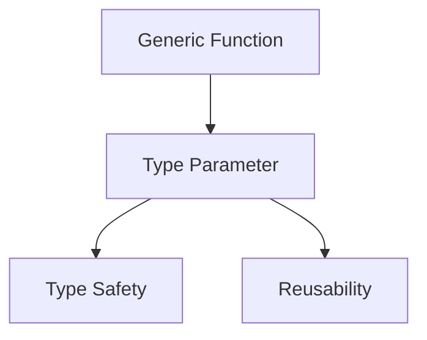
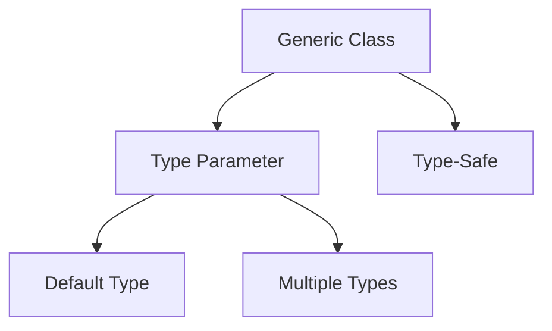
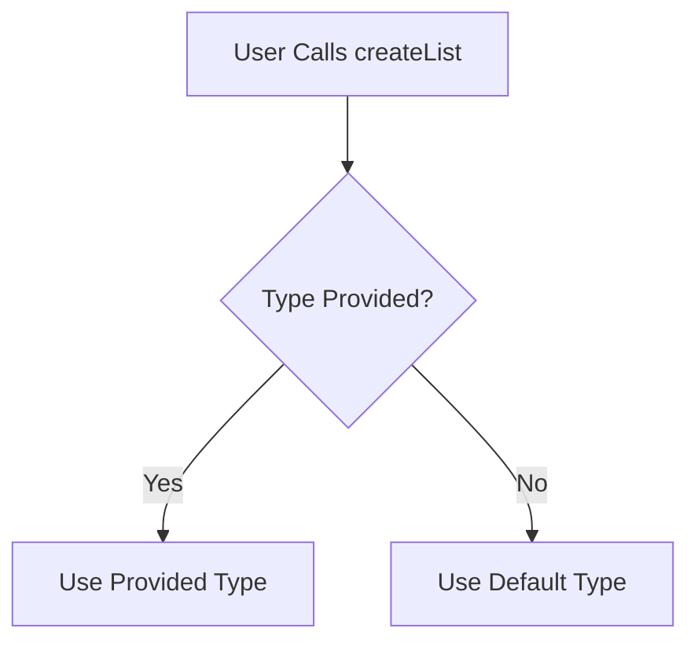
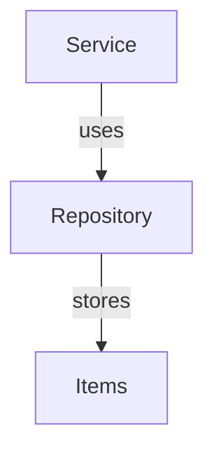
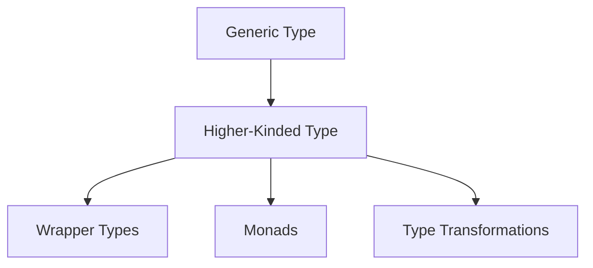

Error: API request failed with error: 401 Client Error: Unauthorized for url: https://openrouter.ai/api/v1/chat/completions

# <span style="color:#e67e22;">What we will learn in this post?</span>
<ul style='list-style-type: none; padding-left: 0;'>
<li><span style='color: #2980b9; font-size: 20px; font-weight: bold;'>👉</span> <span style='color: #2ecc71; font-size: 18px; font-weight: bold;'>Introduction to Generics</span></li>
<li><span style='color: #2980b9; font-size: 20px; font-weight: bold;'>👉</span> <span style='color: #2ecc71; font-size: 18px; font-weight: bold;'>Generic Constraints</span></li>
<li><span style='color: #2980b9; font-size: 20px; font-weight: bold;'>👉</span> <span style='color: #2ecc71; font-size: 18px; font-weight: bold;'>Generic Interfaces and Classes</span></li>
<li><span style='color: #2980b9; font-size: 20px; font-weight: bold;'>👉</span> <span style='color: #2ecc71; font-size: 18px; font-weight: bold;'>Generic Default Types</span></li>
<li><span style='color: #2980b9; font-size: 20px; font-weight: bold;'>👉</span> <span style='color: #2ecc71; font-size: 18px; font-weight: bold;'>Variance and Generic Constraints</span></li>
<li><span style='color: #2980b9; font-size: 20px; font-weight: bold;'>👉</span> <span style='color: #2ecc71; font-size: 18px; font-weight: bold;'>Generic Factory Patterns</span></li>
<li><span style='color: #2980b9; font-size: 20px; font-weight: bold;'>👉</span> <span style='color: #2ecc71; font-size: 18px; font-weight: bold;'>Higher-Order Generic Types</span></li>
</ul>

# <span style="color:#e67e22">Introduction to Generics</span> 🌟

Generics are a powerful feature in programming that allow you to create **reusable** and **type-safe** components. They enable you to write functions and classes that can work with **multiple types** without losing type information.

## <span style="color:#2980b9">What are Type Parameters?</span> 🔍

Type parameters, like `<T>`, act as placeholders for the actual types you want to use. This means you can define a function or class once and use it with different types while keeping everything safe and organized.

### <span style="color:#8e44ad">Why Use Generics?</span> 💡

- **Type Safety**: Generics preserve type information, reducing errors.
- **Reusability**: Write code once and use it with various types.
- **Clarity**: Code is easier to read and understand.

### <span style="color:#8e44ad">Examples</span> 🛠️

**Generic Function:**

```typescript
function identity<T>(arg: T): T {
    return arg;
}
```

**Generic Class:**

```typescript
class Box<T> {
    content: T;
    constructor(content: T) {
        this.content = content;
    }
}
```

Using `any` loses type safety, while generics keep your code robust and clear.

For more information, check out [TypeScript Generics Documentation](https://www.typescriptlang.org/docs/handbook/2/generics.html).

### <span style="color:#8e44ad">Visual Representation</span> 📊



Generics are a fantastic way to enhance your programming skills and create flexible, maintainable code! Happy coding! 🎉

# <span style="color:#e67e22">Understanding Generic Constraints in TypeScript</span> 🌟

Generic constraints in TypeScript help us ensure that our type parameters meet specific requirements. This is done using the `extends` keyword. Let’s break it down!

## <span style="color:#2980b9">What are Generic Constraints?</span> 🤔

When we define a generic type, we can restrict it to certain types or structures. For example:

```typescript
function logLength<T extends { length: number }>(item: T): void {
    console.log(item.length);
}
```

In this example, `T` must have a `length` property. This means we can pass arrays, strings, or any object that has a `length`!

### <span style="color:#8e44ad">Using Interfaces</span> 📜

You can also constrain to interfaces. For instance:

```typescript
interface Person {
    name: string;
    age: number;
}

function greet<T extends Person>(person: T): void {
    console.log(`Hello, ${person.name}!`);
}
```

Here, `T` must be a `Person` or any type that has at least the properties of `Person`.

### <span style="color:#8e44ad">Key Constraints with `keyof`</span> 🔑

You can use `keyof` to restrict types to specific keys:

```typescript
function getProperty<T, K extends keyof T>(obj: T, key: K): T[K] {
    return obj[key];
}
```

This function ensures that `key` is a valid key of `obj`.

### <span style="color:#8e44ad">Multiple Constraints</span> 🔗

You can also combine constraints:

```typescript
function process<T extends { length: number } & { name: string }>(item: T): void {
    console.log(item.name, item.length);
}
```

Here, `T` must have both `length` and `name` properties.

## <span style="color:#2980b9">Conclusion</span> 🎉

Generic constraints are powerful tools in TypeScript that help you write safer and more predictable code. For more information, check out the [TypeScript Handbook](https://www.typescriptlang.org/docs/handbook/2/generics.html).

Feel free to explore and experiment with these concepts! Happy coding! 🚀

# <span style="color:#e67e22">Creating Generic Interfaces and Classes</span> 🌟

## <span style="color:#2980b9">What are Generics?</span>

Generics allow you to create **flexible** and **reusable** code. You can define classes and interfaces with **type parameters** that can be specified later.

### <span style="color:#8e44ad">Default Type Parameters</span>

You can set a default type for your parameters. For example:

```typescript
interface Box<T = string> {
    content: T;
}
```

Here, if you don’t specify a type, it defaults to `string`.

### <span style="color:#8e44ad">Multiple Type Parameters</span>

You can also use multiple type parameters:

```typescript
class Pair<K, V> {
    constructor(public key: K, public value: V) {}
}
```

### <span style="color:#8e44ad">Type-Safe Data Structures</span>

Generics help create type-safe data structures. For example, a simple stack:

```typescript
class Stack<T> {
    private items: T[] = [];
    
    push(item: T) {
        this.items.push(item);
    }
    
    pop(): T | undefined {
        return this.items.pop();
    }
}
```

## <span style="color:#2980b9">Visual Representation</span>



## <span style="color:#2980b9">Resources</span>

- [TypeScript Generics Documentation](https://www.typescriptlang.org/docs/handbook/2/generics.html)
- [Understanding Generics in Java](https://docs.oracle.com/javase/tutorial/java/generics/index.html)

Using generics makes your code more **robust** and **maintainable**! Happy coding! 😊

# <span style="color:#e67e22">Understanding Default Type Parameters in Generics</span> 🌟

Generics in TypeScript allow you to create flexible and reusable components. One cool feature is **default type parameters**! This means you can set a default type for a generic, like this: `<T = DefaultType>`. 

## <span style="color:#2980b9">When to Use Default Type Parameters</span> 🤔

- **Optional Type Specification**: If users don’t provide a type, the default kicks in.
- **Type Inference**: TypeScript can often figure out the type based on usage, making your code cleaner.

### <span style="color:#8e44ad">Use Cases</span> 🛠️

1. **Library APIs**: When creating a library, you might want to provide sensible defaults for users who don’t specify types.
2. **Configuration Objects**: Default types can simplify configurations, ensuring they always have a base structure.

### <span style="color:#8e44ad">Example</span> 💻

```typescript
function createList<T = string>(items: T[]): T[] {
    return items;
}

// Usage
const stringList = createList(['apple', 'banana']); // T is inferred as string
const numberList = createList<number>([1, 2, 3]); // T is explicitly set
```

### <span style="color:#8e44ad">Visual Representation</span> 📊



For more on generics and default parameters, check out [TypeScript Documentation](https://www.typescriptlang.org/docs/handbook/2/generics.html). 

Using default type parameters makes your code more user-friendly and adaptable! Happy coding! 🎉

# <span style="color:#e67e22">Understanding Covariance and Contravariance in TypeScript</span>

## <span style="color:#2980b9">What are Covariance and Contravariance? 🤔</span>

In TypeScript, **covariance** and **contravariance** help us understand how types relate to each other in generics. 

- **Covariance** allows a type to be substituted with its subtypes. For example, if `Dog` is a subtype of `Animal`, a `Dog` can be used wherever an `Animal` is expected.
- **Contravariance** is the opposite; it allows a type to be substituted with its supertypes. This is useful in function parameters.

### <span style="color:#8e44ad">TypeScript's Automatic Handling of Variance</span>

TypeScript automatically manages variance in many cases, making it easier for developers. However, you can also use **in** and **out** modifiers to explicitly define variance:

- **`out`**: Indicates that a type is covariant (can be returned).
- **`in`**: Indicates that a type is contravariant (can be accepted as a parameter).

### <span style="color:#8e44ad">Bidirectional Type Relationships 🔄</span>

Type relationships can be **bidirectional**, meaning a type can be used in both covariant and contravariant contexts. This ensures safe generic assignments, preventing runtime errors.

```typescript
interface Box<out T> {
  get(): T;
}

interface Container<in T> {
  put(item: T): void;
}
```

### <span style="color:#2980b9">Learn More 📚</span>

For a deeper dive into these concepts, check out the [TypeScript Handbook](https://www.typescriptlang.org/docs/handbook/2/generics.html) and explore more about [variance in TypeScript](https://www.typescriptlang.org/docs/handbook/2/objects.html#variance).

---

By understanding covariance and contravariance, you can write safer and more flexible TypeScript code! Happy coding! 🎉

# <span style="color:#e67e22">Using Generics in Factory Functions and Classes</span> 🌟

Generics are a powerful feature in TypeScript that help us create flexible and type-safe code. Let’s explore how to use them in factory functions and classes!

## <span style="color:#2980b9">What are Factory Functions and Classes?</span>

Factory functions and classes are ways to create objects without using the `new` keyword directly. They help us manage object creation more easily.

### <span style="color:#8e44ad">Constructor Signatures</span>

When using generics, we can define constructor signatures that allow us to create objects of various types. Here’s a simple example:

```typescript
function createInstance<T>(ctor: new (...args: any[]) => T, ...args: any[]): T {
    return new ctor(...args);
}
```

### <span style="color:#8e44ad">Flexible APIs</span>

Using generics, we can build APIs that are both flexible and type-safe. For instance, in a repository pattern, we can create a generic repository:

```typescript
class Repository<T> {
    private items: T[] = [];

    add(item: T) {
        this.items.push(item);
    }

    getAll(): T[] {
        return this.items;
    }
}
```

## <span style="color:#2980b9">Dependency Injection</span> 🔄

Generics also shine in dependency injection. You can create services that depend on specific types without hardcoding them:

```typescript
class Service<T> {
    constructor(private repo: Repository<T>) {}

    addItem(item: T) {
        this.repo.add(item);
    }
}
```

### <span style="color:#8e44ad">Visual Representation</span>



## <span style="color:#2980b9">Conclusion</span>

Using generics in factory functions and classes allows for **type-safe** and **flexible** code. This approach enhances maintainability and readability. For more information, check out [TypeScript Generics Documentation](https://www.typescriptlang.org/docs/handbook/2/generics.html).

Happy coding! 🎉

# <span style="color:#e67e22">Understanding Higher-Kinded Types</span> 🌟

Higher-kinded types are a powerful concept in programming, allowing us to create **generic types** that can accept other generic types as parameters. This can lead to more flexible and reusable code.

## <span style="color:#2980b9">What Are Higher-Kinded Types?</span>

- **Generic Types**: These are types that can work with any data type. For example, `Promise<T>` is a generic type that represents a promise of a value of type `T`.
- **Higher-Kinded Types**: These are types that take other types as parameters. For instance, `Functor<F>` can represent any type `F` that can hold a value.

### <span style="color:#8e44ad">Use Cases</span>

1. **Wrapper Types**: Create containers for values, like `Observable<T>`, which can hold multiple values over time.
2. **Monads**: These are special types that help manage side effects in functional programming. For example, `Promise<T>` is a monad that handles asynchronous operations.
3. **Advanced Type Transformations**: You can create complex transformations of types, allowing for more expressive code.

### <span style="color:#8e44ad">Example: Custom Container</span>

```typescript
class Box<T> {
    constructor(public value: T) {}
}

const numberBox = new Box<number>(42);
const stringBox = new Box<string>("Hello");
```

### <span style="color:#8e44ad">Visual Representation</span>



For more information, check out [TypeScript Generics](https://www.typescriptlang.org/docs/handbook/2/generics.html) and [Functional Programming Concepts](https://en.wikipedia.org/wiki/Functional_programming).

By understanding higher-kinded types, you can write more flexible and powerful code! Happy coding! 🎉

