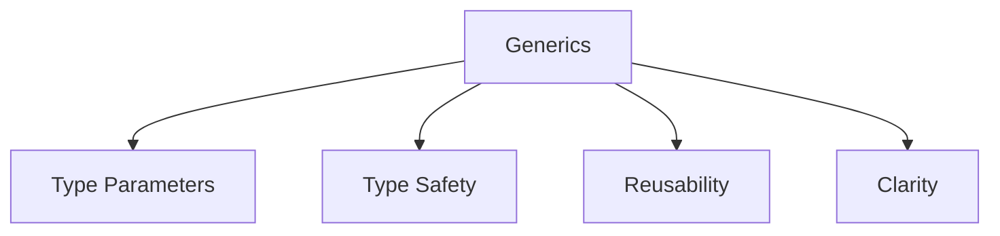
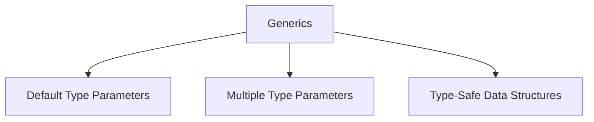
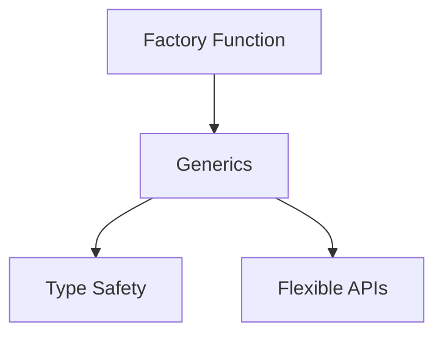
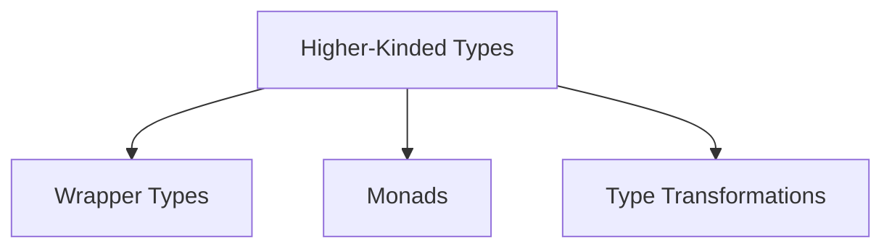

Error: API request failed with error: 401 Client Error: Unauthorized for url: https://openrouter.ai/api/v1/chat/completions

# <span style="color:#e67e22;">What we will learn in this post?</span>
<ul style='list-style-type: none; padding-left: 0;'>
<li><span style='color: #2980b9; font-size: 20px; font-weight: bold;'>👉</span> <span style='color: #2ecc71; font-size: 18px; font-weight: bold;'>Introduction to Generics</span></li>
<li><span style='color: #2980b9; font-size: 20px; font-weight: bold;'>👉</span> <span style='color: #2ecc71; font-size: 18px; font-weight: bold;'>Generic Constraints</span></li>
<li><span style='color: #2980b9; font-size: 20px; font-weight: bold;'>👉</span> <span style='color: #2ecc71; font-size: 18px; font-weight: bold;'>Generic Interfaces and Classes</span></li>
<li><span style='color: #2980b9; font-size: 20px; font-weight: bold;'>👉</span> <span style='color: #2ecc71; font-size: 18px; font-weight: bold;'>Generic Default Types</span></li>
<li><span style='color: #2980b9; font-size: 20px; font-weight: bold;'>👉</span> <span style='color: #2ecc71; font-size: 18px; font-weight: bold;'>Variance and Generic Constraints</span></li>
<li><span style='color: #2980b9; font-size: 20px; font-weight: bold;'>👉</span> <span style='color: #2ecc71; font-size: 18px; font-weight: bold;'>Generic Factory Patterns</span></li>
<li><span style='color: #2980b9; font-size: 20px; font-weight: bold;'>👉</span> <span style='color: #2ecc71; font-size: 18px; font-weight: bold;'>Higher-Order Generic Types</span></li>
</ul>

# <span style="color:#e67e22">Introduction to Generics</span> 🌟

Generics are a powerful feature in programming that allow us to create **reusable** and **type-safe** components. They enable us to write code that works with different data types while preserving type information. This means we can avoid using `any`, which can lead to errors and bugs.

## <span style="color:#2980b9">What are Type Parameters?</span> 🔍

Type parameters, like `<T>`, act as placeholders for the actual data types we want to use. When we define a function or class with a type parameter, we can specify what type to use later.

### <span style="color:#8e44ad">Benefits of Generics</span> 💡

- **Type Safety**: Generics ensure that the types are checked at compile time, reducing runtime errors.
- **Reusability**: Write once, use with any type!
- **Clarity**: Code is easier to read and understand.

### <span style="color:#8e44ad">Simple Examples</span> 🛠️

#### Generic Function

```typescript
function identity<T>(arg: T): T {
    return arg;
}
```

#### Generic Class

```typescript
class Box<T> {
    content: T;
    constructor(content: T) {
        this.content = content;
    }
}
```

### <span style="color:#2980b9">Conclusion</span> 🎉

Generics are a fantastic way to create flexible and safe code. For more information, check out [TypeScript Generics](https://www.typescriptlang.org/docs/handbook/2/generics.html).



Embrace generics to make your code cleaner and more efficient!

# <span style="color:#e67e22">Understanding Generic Constraints in TypeScript</span> 🌟

Generics in TypeScript allow us to create flexible and reusable components. But sometimes, we want to restrict these types to ensure they have certain properties. This is where **generic constraints** come in handy! 

## <span style="color:#2980b9">What are Generic Constraints?</span>

Generic constraints use the `extends` keyword to limit the types that can be used as type parameters. For example:

```typescript
function logLength<T extends { length: number }>(item: T): void {
    console.log(item.length);
}
```

In this example, `T` must have a `length` property. This means you can pass arrays, strings, or any object with a `length` property.

### <span style="color:#8e44ad">Using Interfaces for Constraints</span>

You can also constrain to interfaces. For instance:

```typescript
interface Person {
    name: string;
    age: number;
}

function greet<T extends Person>(person: T): void {
    console.log(`Hello, ${person.name}!`);
}
```

Here, `T` must be a `Person` or any type that has at least the properties of `Person`.

### <span style="color:#8e44ad">Key Constraints with `keyof`</span>

You can use `keyof` to restrict types to specific keys. For example:

```typescript
function getProperty<T, K extends keyof T>(obj: T, key: K): T[K] {
    return obj[key];
}
```

This function ensures that `key` is a valid key of `obj`.

### <span style="color:#8e44ad">Multiple Constraints</span>

You can also combine multiple constraints:

```typescript
function process<T extends { length: number } & { name: string }>(item: T): void {
    console.log(item.length, item.name);
}
```

In this case, `T` must have both `length` and `name` properties.

## <span style="color:#2980b9">Conclusion</span>

Generic constraints are a powerful feature in TypeScript that help ensure your code is safe and predictable. For more detailed information, check out the [TypeScript Handbook](https://www.typescriptlang.org/docs/handbook/2/generics.html).

Happy coding! 🎉

# <span style="color:#e67e22">Creating Generic Interfaces and Classes</span> 🌟

## <span style="color:#2980b9">What are Generics?</span>

Generics allow you to create **flexible** and **reusable** code. You can define classes and interfaces with type parameters, which can be specified later. This makes your code type-safe and reduces errors.

### <span style="color:#8e44ad">Default Type Parameters</span>

You can set a default type for your parameters. For example:

```typescript
class Box<T = string> {
    content: T;
    constructor(content: T) {
        this.content = content;
    }
}
```

Here, `Box` defaults to `string` if no type is provided.

### <span style="color:#8e44ad">Multiple Type Parameters</span>

You can also use multiple type parameters:

```typescript
class Pair<K, V> {
    key: K;
    value: V;
    constructor(key: K, value: V) {
        this.key = key;
        this.value = value;
    }
}
```

### <span style="color:#8e44ad">Type-Safe Data Structures</span>

Generics help create type-safe data structures like lists or maps:

```typescript
class List<T> {
    private items: T[] = [];
    add(item: T) {
        this.items.push(item);
    }
}
```

## <span style="color:#2980b9">Conclusion</span>

Using generics makes your code more **robust** and **maintainable**. For more information, check out [TypeScript Generics](https://www.typescriptlang.org/docs/handbook/2/generics.html).



Happy coding! 🎉

# <span style="color:#e67e22">Understanding Default Type Parameters in Generics</span> 🌟

Generics in TypeScript allow you to create flexible and reusable components. One cool feature is **default type parameters**! This means you can set a default type for a generic, like this:

```typescript
function exampleFunction<T = DefaultType>(param: T) {
    // Function logic here
}
```

## <span style="color:#2980b9">When to Use Default Type Parameters</span> 🤔

- **Optional Type Specification**: If users don’t specify a type, the default kicks in. This is great for making your API easier to use!
- **Type Inference**: TypeScript can often figure out the type based on how you use the function, making your code cleaner.

### <span style="color:#8e44ad">Use Cases</span> 📚

- **Library APIs**: When creating libraries, default types can simplify usage. For example, a data-fetching function might default to `any` if no type is provided.
  
- **Configuration Objects**: If you have a config object, you can set defaults for properties, ensuring users get sensible defaults without extra effort.

### <span style="color:#8e44ad">Example</span> 💻

```typescript
interface Config<T = string> {
    value: T;
}

const defaultConfig: Config = { value: "default" }; // value is inferred as string
const customConfig: Config<number> = { value: 42 }; // value is number
```

### <span style="color:#2980b9">Conclusion</span> 🎉

Using default type parameters makes your code more user-friendly and flexible. For more details, check out the [TypeScript Handbook](https://www.typescriptlang.org/docs/handbook/2/generics.html).

Feel free to explore and enjoy coding with generics! 🚀

# <span style="color:#e67e22">Understanding Covariance and Contravariance in TypeScript</span>

## <span style="color:#2980b9">What are Covariance and Contravariance? 🤔</span>

In TypeScript, **covariance** and **contravariance** help us understand how types relate to each other, especially in generics. 

- **Covariance** allows you to substitute a more derived type (like a `Cat`) for a base type (like an `Animal`). This is useful when you want to return a type.
- **Contravariance** allows you to substitute a base type for a more derived type. This is handy when you want to accept a type.

### <span style="color:#8e44ad">TypeScript's Automatic Handling of Variance</span>

TypeScript automatically manages variance in many cases. For example, when you use arrays or functions, TypeScript knows how to treat the types correctly.

### <span style="color:#8e44ad">Using `in` and `out` Modifiers (TypeScript 4.7+) 🔧</span>

With TypeScript 4.7+, you can explicitly define variance using `in` and `out`:

- **`out`**: Indicates covariance. Use it when a type is produced.
- **`in`**: Indicates contravariance. Use it when a type is consumed.

```typescript
interface Producer<out T> {
    produce(): T;
}

interface Consumer<in T> {
    consume(item: T): void;
}
```

### <span style="color:#2980b9">Bidirectional Type Relationships 🔄</span>

TypeScript allows safe assignments between types. For example, you can assign a `Cat` to an `Animal` variable, but not the other way around. This ensures type safety and prevents runtime errors.

### <span style="color:#2980b9">Resources for Further Learning 📚</span>

- [TypeScript Handbook on Generics](https://www.typescriptlang.org/docs/handbook/2/generics.html)
- [Understanding Variance in TypeScript](https://www.typescriptlang.org/docs/handbook/2/variance.html)

By mastering covariance and contravariance, you can write more flexible and safe TypeScript code! Happy coding! 🎉

# <span style="color:#e67e22">Using Generics in Factory Functions and Classes</span> 🌟

Generics are a powerful feature in TypeScript that help us create flexible and type-safe code. Let’s explore how to use them in factory functions and classes!

## <span style="color:#2980b9">What are Factory Functions and Classes?</span>

Factory functions and classes are ways to create objects without using the `new` keyword directly. They help in managing object creation, especially when you want to ensure type safety.

### <span style="color:#8e44ad">Constructor Signatures</span>

When defining a factory function, you can specify a constructor signature. This tells TypeScript what kind of objects your function will create.

```typescript
function createInstance<T>(ctor: new (...args: any[]) => T, ...args: any[]): T {
    return new ctor(...args);
}
```

### <span style="color:#8e44ad">Using Generics</span>

Using the `new (args): T` syntax allows you to create instances of any class type. This makes your API flexible!

```typescript
class User {
    constructor(public name: string) {}
}

const user = createInstance(User, "Alice");
console.log(user.name); // Alice
```

## <span style="color:#2980b9">Repository Pattern Example</span> 📚

The repository pattern helps manage data access. Here’s a simple example:

```typescript
interface IRepository<T> {
    add(item: T): void;
    get(id: number): T;
}

class UserRepository implements IRepository<User> {
    private users: User[] = [];
    
    add(user: User) {
        this.users.push(user);
    }
    
    get(id: number): User {
        return this.users[id];
    }
}
```

## <span style="color:#2980b9">Dependency Injection</span> 🔌

Generics also shine in dependency injection, allowing you to inject different types easily.

```typescript
class Service<T> {
    constructor(private repo: IRepository<T>) {}
    
    add(item: T) {
        this.repo.add(item);
    }
}
```

### <span style="color:#8e44ad">Conclusion</span>

Generics in factory functions and classes help create type-safe, flexible APIs. They make your code cleaner and easier to maintain. For more information, check out [TypeScript Generics](https://www.typescriptlang.org/docs/handbook/2/generics.html).



Happy coding! 🎉

# <span style="color:#e67e22">Understanding Higher-Kinded Types</span> 🌟

Higher-kinded types are a powerful concept in programming that allows you to create generic types that can accept other generic types as parameters. This can lead to more flexible and reusable code.

## <span style="color:#2980b9">What Are Higher-Kinded Types?</span>

Higher-kinded types are types that take other types as parameters. For example, `Promise<T>` and `Observable<T>` are both higher-kinded types. They allow you to work with asynchronous data in a clean way.

### <span style="color:#8e44ad">Use Cases</span>

- **Wrapper Types**: You can create a wrapper around existing types to add functionality.
- **Monads**: These are structures that represent computations instead of values, allowing for chaining operations.
- **Advanced Type Transformations**: You can transform types in complex ways, making your code more expressive.

### <span style="color:#8e44ad">Examples</span>

1. **Promise<T>**:
   ```typescript
   function fetchData<T>(url: string): Promise<T> {
       return fetch(url).then(response => response.json());
   }
   ```

2. **Observable<T>**:
   ```typescript
   import { Observable } from 'rxjs';

   const data$: Observable<number> = new Observable(subscriber => {
       subscriber.next(1);
       subscriber.next(2);
       subscriber.complete();
   });
   ```

3. **Custom Container**:
   ```typescript
   class Box<T> {
       constructor(public value: T) {}
   }
   ```

### <span style="color:#8e44ad">Visual Representation</span>



For more information, check out [TypeScript Generics](https://www.typescriptlang.org/docs/handbook/2/generics.html) and [Functional Programming Concepts](https://www.freecodecamp.org/news/functional-programming-in-javascript/).

By understanding higher-kinded types, you can write more flexible and powerful code! Happy coding! 🎉

