```mermaid
graph TD
    A["🏗️ Generic Class"]:::style1 --> B["⚙️ Type Parameter"]:::style2
    A --> C["🛡️ Type-Safe"]:::style3
    B --> D["📋 Default Type"]:::style4
    B --> E["🔗 Multiple Types"]:::style5

    classDef style1 fill:#ff4f81,stroke:#c43e3e,color:#fff,font-size:16px,stroke-width:3px,rx:14,shadow:6px;
    classDef style2 fill:#6b5bff,stroke:#4a3f6b,color:#fff,font-size:16px,stroke-width:3px,rx:14,shadow:6px;
    classDef style3 fill:#00bfae,stroke:#005f99,color:#fff,font-size:16px,stroke-width:3px,rx:14,shadow:6px;
    classDef style4 fill:#ffd700,stroke:#d99120,color:#222,font-size:16px,stroke-width:3px,rx:14,shadow:6px;
    classDef style5 fill:#43e97b,stroke:#38f9d7,color:#fff,font-size:16px,stroke-width:3px,rx:14,shadow:6px;

    linkStyle default stroke:#e67e22,stroke-width:3px;
```

<!--
meta-description: "Comprehensive guide to TypeScript generics covering type parameters, constraints with extends and keyof, generic interfaces and classes, default types, variance (covariance/contravariance), factory patterns, and higher-kinded types with practical examples."
keywords: "TypeScript generics, type parameters, generic constraints, extends keyword, keyof operator, generic interfaces, generic classes, default type parameters, covariance, contravariance, factory functions, higher-kinded types, type safety"
-->

# <span style="color:#e67e22;">What we will learn in this post?</span>
<ul style='list-style-type: none; padding-left: 0;'>
<li><span style='color: #2980b9; font-size: 20px; font-weight: bold;'>👉</span> <span style='color: #2ecc71; font-size: 18px; font-weight: bold;'>Introduction to Generics</span></li>
<li><span style='color: #2980b9; font-size: 20px; font-weight: bold;'>👉</span> <span style='color: #2ecc71; font-size: 18px; font-weight: bold;'>Generic Constraints</span></li>
<li><span style='color: #2980b9; font-size: 20px; font-weight: bold;'>👉</span> <span style='color: #2ecc71; font-size: 18px; font-weight: bold;'>Generic Interfaces and Classes</span></li>
<li><span style='color: #2980b9; font-size: 20px; font-weight: bold;'>👉</span> <span style='color: #2ecc71; font-size: 18px; font-weight: bold;'>Generic Default Types</span></li>
<li><span style='color: #2980b9; font-size: 20px; font-weight: bold;'>👉</span> <span style='color: #2ecc71; font-size: 18px; font-weight: bold;'>Variance and Generic Constraints</span></li>
<li><span style='color: #2980b9; font-size: 20px; font-weight: bold;'>👉</span> <span style='color: #2ecc71; font-size: 18px; font-weight: bold;'>Generic Factory Patterns</span></li>
<li><span style='color: #2980b9; font-size: 20px; font-weight: bold;'>👉</span> <span style='color: #2ecc71; font-size: 18px; font-weight: bold;'>Higher-Order Generic Types</span></li>
</ul>

# <span style="color:#e67e22">Introduction to Generics</span> 🌟

Generics are a powerful feature in programming that allow you to create **reusable** and **type-safe** components. They enable you to write functions and classes that can work with **multiple types** without losing type information. This approach is essential for building scalable TypeScript applications that maintain type safety across complex data flows.

## <span style="color:#2980b9">What are Type Parameters?</span> 🔍

Type parameters, like `<T>`, act as placeholders for the actual types you want to use. This means you can define a function or class once and use it with different types while keeping everything safe and organized.

### <span style="color:#8e44ad">Why Use Generics?</span> 💡

- **Type Safety**: Generics preserve type information, reducing errors.
- **Reusability**: Write code once and use it with various types.
- **Clarity**: Code is easier to read and understand.

### <span style="color:#8e44ad">Examples</span> 🛠️

**Generic Function:**

```typescript
function identity<T>(arg: T): T {
    return arg;
}
```

**Generic Class:**

```typescript
class Box<T> {
    content: T;
    constructor(content: T) {
        this.content = content;
    }
}
```

Using `any` loses type safety, while generics keep your code robust and clear.


### <span style="color:#8e44ad">Real-World Example: Generic API Response Handler 🎯</span>

```typescript
// Production API response handler with generics
interface ApiResponse<T> {
  data: T;
  status: number;
  message: string;
}

class ApiClient {
  async getUser<T = User>(id: string): Promise<ApiResponse<T>> {
    const response = await fetch(`/api/users/${id}`);
    const data = await response.json();
    return {
      data: data as T,
      status: response.status,
      message: response.statusText
    };
  }
}

// Usage with type safety
const client = new ApiClient();
const userResponse = await client.getUser<User>('123');
// TypeScript knows userResponse.data is of type User
```

### <span style="color:#8e44ad">Visual Representation</span> 📊



```mermaid
graph TD
    A["🎯 Generic Function"]:::style1 --> B["⚙️ Type Parameter <T>"]:::style2
    B --> C["🛡️ Type Safety"]:::style3
    B --> D["🔄 Reusability"]:::style4

    classDef style1 fill:#ff4f81,stroke:#c43e3e,color:#fff,font-size:16px,stroke-width:3px,rx:14,shadow:6px;
    classDef style2 fill:#6b5bff,stroke:#4a3f6b,color:#fff,font-size:16px,stroke-width:3px,rx:14,shadow:6px;
    classDef style3 fill:#00bfae,stroke:#005f99,color:#fff,font-size:16px,stroke-width:3px,rx:14,shadow:6px;
    classDef style4 fill:#43e97b,stroke:#38f9d7,color:#fff,font-size:16px,stroke-width:3px,rx:14,shadow:6px;

    linkStyle default stroke:#e67e22,stroke-width:3px;
```

Generics are a fantastic way to enhance your programming skills and create flexible, maintainable code! Happy coding! 🎉

# <span style="color:#e67e22">Understanding Generic Constraints in TypeScript</span> 🌟

Generic constraints in TypeScript help us ensure that our type parameters meet specific requirements. This is done using the `extends` keyword. Let’s break it down! These constraints are crucial for creating flexible yet type-safe APIs in production applications.

## <span style="color:#2980b9">What are Generic Constraints?</span> 🤔

When we define a generic type, we can restrict it to certain types or structures. For example:

```typescript
function logLength<T extends { length: number }>(item: T): void {
    console.log(item.length);
}
```

In this example, `T` must have a `length` property. This means we can pass arrays, strings, or any object that has a `length`!

### <span style="color:#8e44ad">Using Interfaces</span> 📜

You can also constrain to interfaces. For instance:

```typescript
interface Person {
    name: string;
    age: number;
}

function greet<T extends Person>(person: T): void {
    console.log(`Hello, ${person.name}!`);
}
```

Here, `T` must be a `Person` or any type that has at least the properties of `Person`.

### <span style="color:#8e44ad">Key Constraints with `keyof`</span> 🔑

You can use `keyof` to restrict types to specific keys:

```typescript
function getProperty<T, K extends keyof T>(obj: T, key: K): T[K] {
    return obj[key];
}
```

This function ensures that `key` is a valid key of `obj`.

### <span style="color:#8e44ad">Multiple Constraints</span> 🔗

You can also combine constraints:

```typescript
function process<T extends { length: number } & { name: string }>(item: T): void {
    console.log(item.name, item.length);
}
```

Here, `T` must have both `length` and `name` properties.


### <span style="color:#8e44ad">Real-World Example: Constrained Data Validator 🎯</span>

```typescript
// Generic validation function with constraints
function validateAndTransform<T extends { id: string; name: string }, U = T>(
  data: T[],
  transformer: (item: T) => U
): U[] {
  return data
    .filter(item => item.id && item.name) // Constraint ensures these properties exist
    .map(transformer);
}

// Usage with form data
interface FormData {
  id: string;
  name: string;
  email?: string;
}

const forms: FormData[] = [
  { id: '1', name: 'John', email: 'john@example.com' },
  { id: '2', name: 'Jane' }
];

const validatedUsers = validateAndTransform(forms, form => ({
  userId: form.id,
  displayName: form.name,
  contact: form.email || 'N/A'
}));
```

Feel free to explore and experiment with these concepts! Happy coding! 🚀

# <span style="color:#e67e22">Creating Generic Interfaces and Classes</span> 🌟

## <span style="color:#2980b9">What are Generics?</span>

Generics allow you to create **flexible** and **reusable** code. You can define classes and interfaces with **type parameters** that can be specified later. This pattern is widely used in TypeScript libraries and frameworks for building extensible component systems.

### <span style="color:#8e44ad">Default Type Parameters</span>

You can set a default type for your parameters. For example:

```typescript
interface Box<T = string> {
    content: T;
}
```

Here, if you don’t specify a type, it defaults to `string`.

### <span style="color:#8e44ad">Multiple Type Parameters</span>

You can also use multiple type parameters:

```typescript
class Pair<K, V> {
    constructor(public key: K, public value: V) {}
}
```

### <span style="color:#8e44ad">Type-Safe Data Structures</span>

Generics help create type-safe data structures. For example, a simple stack:

```typescript
class Stack<T> {
    private items: T[] = [];
    
    push(item: T) {
        this.items.push(item);
    }
    
    pop(): T | undefined {
        return this.items.pop();
    }
}
```

## <span style="color:#2980b9">Visual Representation</span>



### <span style="color:#8e44ad">Real-World Example: Generic Event System 🎯</span>

```typescript
// Generic event emitter for type-safe event handling
class EventEmitter<T extends Record<string, any>> {
  private listeners: Map<keyof T, Set<(data: T[keyof T]) => void>> = new Map();

  on<K extends keyof T>(event: K, listener: (data: T[K]) => void): void {
    if (!this.listeners.has(event)) {
      this.listeners.set(event, new Set());
    }
    this.listeners.get(event)!.add(listener);
  }

  emit<K extends keyof T>(event: K, data: T[K]): void {
    const listeners = this.listeners.get(event);
    if (listeners) {
      listeners.forEach(listener => listener(data));
    }
  }
}

// Usage with strongly typed events
interface AppEvents {
  userLogin: { userId: string; timestamp: Date };
  error: { message: string; code: number };
}

const emitter = new EventEmitter<AppEvents>();

emitter.on('userLogin', (data) => {
  console.log(`User ${data.userId} logged in at ${data.timestamp}`);
});

emitter.emit('userLogin', { userId: '123', timestamp: new Date() });
```

Using generics makes your code more **robust** and **maintainable**! Happy coding! 😊

# <span style="color:#e67e22">Understanding Default Type Parameters in Generics</span> 🌟

Generics in TypeScript allow you to create flexible and reusable components. One cool feature is **default type parameters**! This means you can set a default type for a generic, like this: `<T = DefaultType>`. This feature simplifies API design by providing sensible defaults while allowing customization when needed. Default parameters improve API ergonomics by reducing boilerplate while maintaining full type safety. 

## <span style="color:#2980b9">When to Use Default Type Parameters</span> 🤔

- **Optional Type Specification**: If users don’t provide a type, the default kicks in.
- **Type Inference**: TypeScript can often figure out the type based on usage, making your code cleaner.

### <span style="color:#8e44ad">Use Cases</span> 🛠️

1. **Library APIs**: When creating a library, you might want to provide sensible defaults for users who don’t specify types.
2. **Configuration Objects**: Default types can simplify configurations, ensuring they always have a base structure.

### <span style="color:#8e44ad">Example</span> 💻

```typescript
function createList<T = string>(items: T[]): T[] {
    return items;
}

// Usage
const stringList = createList(['apple', 'banana']); // T is inferred as string
const numberList = createList<number>([1, 2, 3]); // T is explicitly set
```

### <span style="color:#8e44ad">Visual Representation</span> 📊



```mermaid
graph TD
    A["👤 User Calls createList"]:::style1 --> B{"❓ Type Provided?"}:::style2
    B -- "✅ Yes" --> C["🎯 Use Provided Type"]:::style3
    B -- "❌ No" --> D["📋 Use Default Type"]:::style4

    classDef style1 fill:#ff4f81,stroke:#c43e3e,color:#fff,font-size:16px,stroke-width:3px,rx:14,shadow:6px;
    classDef style2 fill:#ffd700,stroke:#d99120,color:#222,font-size:16px,stroke-width:3px,rx:14,shadow:6px;
    classDef style3 fill:#00bfae,stroke:#005f99,color:#fff,font-size:16px,stroke-width:3px,rx:14,shadow:6px;
    classDef style4 fill:#43e97b,stroke:#38f9d7,color:#fff,font-size:16px,stroke-width:3px,rx:14,shadow:6px;

    linkStyle default stroke:#e67e22,stroke-width:3px;
```

Using default type parameters makes your code more user-friendly and adaptable! Happy coding! 🎉

### <span style="color:#8e44ad">Practical Implementation: Generic Data Store with Constraints 🎯</span>

```typescript
// Generic data store with constraints and default types
class DataStore<T extends { id: string }, K = T> {
  private data: Map<string, K> = new Map();

  add(item: T): void {
    this.data.set(item.id, item as unknown as K);
  }

  get(id: string): K | undefined {
    return this.data.get(id);
  }

  getAll(): K[] {
    return Array.from(this.data.values());
  }

  update<U extends T>(id: string, updater: (current: K) => U): void {
    const current = this.data.get(id);
    if (current) {
      const updated = updater(current);
      this.data.set(id, updated as unknown as K);
    }
  }
}

// Usage example
interface User {
  id: string;
  name: string;
  email: string;
}

const userStore = new DataStore<User>();

userStore.add({ id: '1', name: 'Alice', email: 'alice@example.com' });
userStore.add({ id: '2', name: 'Bob', email: 'bob@example.com' });

const user = userStore.get('1'); // Type: User | undefined
console.log(user?.name); // Alice

userStore.update('1', (user) => ({ ...user, name: 'Alice Smith' }));
console.log(userStore.get('1')?.name); // Alice Smith
```

- **Type Constraints**: The `T extends { id: string }` ensures all stored items have an ID for indexing
- **Default Types**: `K = T` allows flexible return types while defaulting to the input type
- **Method Chaining**: Update method uses a function to modify data safely with type inference
- **Type Safety**: All operations maintain compile-time type checking without runtime errors

### <span style="color:#8e44ad">Practical Implementation: Factory Pattern with Higher-Kinded Types 🎯</span>

```typescript
// Factory pattern using generics and higher-kinded types
interface Container<T> {
  map<U>(fn: (value: T) => U): Container<U>;
  flatMap<U>(fn: (value: T) => Container<U>): Container<U>;
  get(): T;
}

class Result<T> implements Container<T> {
  constructor(private value: T, private error?: Error) {}

  static success<U>(value: U): Result<U> {
    return new Result(value);
  }

  static failure<U>(error: Error): Result<U> {
    return new Result<U>(null as U, error);
  }

  map<U>(fn: (value: T) => U): Result<U> {
    if (this.error) return Result.failure(this.error);
    try {
      return Result.success(fn(this.value));
    } catch (e) {
      return Result.failure(e as Error);
    }
  }

  flatMap<U>(fn: (value: T) => Result<U>): Result<U> {
    if (this.error) return Result.failure(this.error);
    return fn(this.value);
  }

  get(): T {
    if (this.error) throw this.error;
    return this.value;
  }
}

// Generic factory function
function createProcessor<T, U>(
  input: T,
  transformer: (data: T) => U,
  validator?: (result: U) => boolean
): Result<U> {
  try {
    const result = transformer(input);
    if (validator && !validator(result)) {
      return Result.failure(new Error('Validation failed'));
    }
    return Result.success(result);
  } catch (e) {
    return Result.failure(e as Error);
  }
}

// Usage example
const processor = createProcessor(
  { name: 'John', age: 30 },
  (user) => ({ ...user, adult: user.age >= 18 }),
  (result) => result.adult === true
);

processor
  .map(user => `Welcome ${user.name}!`)
  .map(message => message.toUpperCase())
  .get(); // "WELCOME JOHN!"
```

- **Higher-Kinded Types**: `Container<T>` abstracts over different container types for composability
- **Factory Pattern**: `createProcessor` function creates typed processors with validation
- **Error Handling**: Result type provides safe error propagation through operations
- **Type Inference**: Generic methods maintain type relationships across transformations

# <span style="color:#e67e22">Understanding Covariance and Contravariance in TypeScript</span>

## <span style="color:#2980b9">What are Covariance and Contravariance? 🤔</span>

In TypeScript, **covariance** and **contravariance** help us understand how types relate to each other in generics. Mastering these concepts enables you to design more sophisticated generic APIs with proper type relationships. 

- **Covariance** allows a type to be substituted with its subtypes. For example, if `Dog` is a subtype of `Animal`, a `Dog` can be used wherever an `Animal` is expected.
- **Contravariance** is the opposite; it allows a type to be substituted with its supertypes. This is useful in function parameters.

### <span style="color:#8e44ad">TypeScript's Automatic Handling of Variance</span>

TypeScript automatically manages variance in many cases, making it easier for developers. However, you can also use **in** and **out** modifiers to explicitly define variance:

- **`out`**: Indicates that a type is covariant (can be returned).
- **`in`**: Indicates that a type is contravariant (can be accepted as a parameter).

### <span style="color:#8e44ad">Bidirectional Type Relationships 🔄</span>

Type relationships can be **bidirectional**, meaning a type can be used in both covariant and contravariant contexts. This ensures safe generic assignments, preventing runtime errors.

```typescript
interface Box<out T> {
  get(): T;
}

interface Container<in T> {
  put(item: T): void;
}
```

By understanding covariance and contravariance, you can write safer and more flexible TypeScript code! Happy coding! 🎉

# <span style="color:#e67e22">Using Generics in Factory Functions and Classes</span> 🌟

Generics are a powerful feature in TypeScript that help us create flexible and type-safe code. Let’s explore how to use them in factory functions and classes! Factory patterns with generics are essential for dependency injection and object creation in large-scale applications.

## <span style="color:#2980b9">What are Factory Functions and Classes?</span>

Factory functions and classes are ways to create objects without using the `new` keyword directly. They help us manage object creation more easily.

### <span style="color:#8e44ad">Constructor Signatures</span>

When using generics, we can define constructor signatures that allow us to create objects of various types. Here’s a simple example:

```typescript
function createInstance<T>(ctor: new (...args: any[]) => T, ...args: any[]): T {
    return new ctor(...args);
}
```

### <span style="color:#8e44ad">Flexible APIs</span>

Using generics, we can build APIs that are both flexible and type-safe. For instance, in a repository pattern, we can create a generic repository:

```typescript
class Repository<T> {
    private items: T[] = [];

    add(item: T) {
        this.items.push(item);
    }

    getAll(): T[] {
        return this.items;
    }
}
```

## <span style="color:#2980b9">Dependency Injection</span> 🔄

Generics also shine in dependency injection. You can create services that depend on specific types without hardcoding them:

```typescript
class Service<T> {
    constructor(private repo: Repository<T>) {}

    addItem(item: T) {
        this.repo.add(item);
    }
}
```

### <span style="color:#8e44ad">Visual Representation</span>



# <span style="color:#e67e22">Understanding Higher-Kinded Types</span> 🌟

```mermaid
graph TD
    A["🔧 Service"]:::style1 -->|uses| B["📦 Repository"]:::style2
    B -->|stores| C["📋 Items"]:::style3

    classDef style1 fill:#ff4f81,stroke:#c43e3e,color:#fff,font-size:16px,stroke-width:3px,rx:14,shadow:6px;
    classDef style2 fill:#6b5bff,stroke:#4a3f6b,color:#fff,font-size:16px,stroke-width:3px,rx:14,shadow:6px;
    classDef style3 fill:#00bfae,stroke:#005f99,color:#fff,font-size:16px,stroke-width:3px,rx:14,shadow:6px;

    linkStyle default stroke:#e67e22,stroke-width:3px;
```

Higher-kinded types are a powerful concept in programming, allowing us to create **generic types** that can accept other generic types as parameters. This can lead to more flexible and reusable code. They form the foundation of functional programming patterns in TypeScript, enabling advanced abstractions like monads and functors. These advanced patterns are commonly used in functional programming libraries and complex type system designs.

## <span style="color:#2980b9">What Are Higher-Kinded Types?</span>

- **Generic Types**: These are types that can work with any data type. For example, `Promise<T>` is a generic type that represents a promise of a value of type `T`.
- **Higher-Kinded Types**: These are types that take other types as parameters. For instance, `Functor<F>` can represent any type `F` that can hold a value.

### <span style="color:#8e44ad">Use Cases</span>

1. **Wrapper Types**: Create containers for values, like `Observable<T>`, which can hold multiple values over time.
2. **Monads**: These are special types that help manage side effects in functional programming. For example, `Promise<T>` is a monad that handles asynchronous operations.
3. **Advanced Type Transformations**: You can create complex transformations of types, allowing for more expressive code.

### <span style="color:#8e44ad">Example: Custom Container</span>

```typescript
class Box<T> {
    constructor(public value: T) {}
}

const numberBox = new Box<number>(42);
const stringBox = new Box<string>("Hello");
```

### <span style="color:#8e44ad">Visual Representation</span>


```mermaid
graph TD
    A["🎯 Generic Type"]:::style1 --> B["🔧 Higher-Kinded Type"]:::style2
    B --> C["📦 Wrapper Types"]:::style3
    B --> D["⚡ Monads"]:::style4
    B --> E["🔄 Type Transformations"]:::style5

    classDef style1 fill:#ff4f81,stroke:#c43e3e,color:#fff,font-size:16px,stroke-width:3px,rx:14,shadow:6px;
    classDef style2 fill:#6b5bff,stroke:#4a3f6b,color:#fff,font-size:16px,stroke-width:3px,rx:14,shadow:6px;
    classDef style3 fill:#ffd700,stroke:#d99120,color:#222,font-size:16px,stroke-width:3px,rx:14,shadow:6px;
    classDef style4 fill:#00bfae,stroke:#005f99,color:#fff,font-size:16px,stroke-width:3px,rx:14,shadow:6px;
    classDef style5 fill:#43e97b,stroke:#38f9d7,color:#fff,font-size:16px,stroke-width:3px,rx:14,shadow:6px;

    linkStyle default stroke:#e67e22,stroke-width:3px;
```

By understanding higher-kinded types, you can write more flexible and powerful code! Happy coding! 🎉

---

<details style='border: 2px solid #c43e3e; border-radius: 8px; padding: 20px; background: linear-gradient(135deg, #ffe6e6 0%, #fff 100%); margin: 25px 0; box-shadow: 0 6px 12px rgba(196, 62, 62, 0.15);'>
<summary style='cursor: pointer; font-size: 1.3em; font-weight: bold; color: #c43e3e; padding: 10px 0;'>
🎯 Hands-On Assignment: Build a Type-Safe Data Processing Pipeline 🚀
</summary>

<div style='margin-top: 20px; color: #2c3e50; line-height: 1.6;'>

<h3 style='color: #c43e3e; border-bottom: 2px solid #c43e3e; padding-bottom: 8px; margin-top: 20px;'>📝 Your Mission</h3>

Create a comprehensive, type-safe data processing pipeline using TypeScript generics that handles various data types through constrained transformations, factory patterns, and higher-kinded type operations. Build a production-ready system that processes user data, validates it, and generates reports.

<h3 style='color: #c43e3e; border-bottom: 2px solid #c43e3e; padding-bottom: 8px; margin-top: 20px;'>🎯 Requirements</h3>

<ol style='margin-left: 20px;'>
<li>Implement a generic <code>Pipeline&lt;T&gt;</code> class with fluent interface methods:
  <ul style='margin-left: 20px; margin-top: 8px;'>
    <li><code>filter(predicate: (item: T) => boolean)</code> - Filter items with constraints</li>
    <li><code>map&lt;U&gt;(transformer: (item: T) => U)</code> - Transform to different types</li>
    <li><code>validate&lt;K extends keyof T&gt;(key: K, validator: (value: T[K]) => boolean)</code> - Validate properties</li>
    <li><code>collect(): T[]</code> - Get processed results</li>
  </ul>
</li>
<li>Create a generic <code>DataProcessor&lt;T extends Record&lt;string, any&gt;&gt;</code> with constraint validation</li>
<li>Implement factory functions for creating typed processors with default parameters</li>
<li>Add support for higher-kinded types with <code>Container&lt;F, T&gt;</code> wrapper</li>
<li>Handle covariance/contravariance in event callbacks</li>
<li>Write comprehensive tests demonstrating all generic features</li>
</ol>

<h3 style='color: #c43e3e; border-bottom: 2px solid #c43e3e; padding-bottom: 8px; margin-top: 25px;'>💡 Implementation Hints</h3>

<ol style='margin-left: 20px;'>
<li>Use method chaining by returning <code>this</code> from pipeline methods</li>
<li>Define constraints like <code>T extends { id: string; data: any }</code> for validation</li>
<li>Implement <code>Container&lt;F, T&gt;</code> as <code>F&lt;T&gt;</code> for higher-kinded types</li>
<li>Use <code>keyof T</code> and mapped types for property validation</li>
<li>Create factory functions with default generic parameters</li>
<li>Handle variance with <code>out T</code> and <code>in T</code> modifiers where applicable</li>
</ol>

<h3 style='color: #c43e3e; border-bottom: 2px solid #c43e3e; padding-bottom: 8px; margin-top: 25px;'>🚀 Example Input/Output</h3>

<pre style='background: #2c3e50; color: #ecf0f1; padding: 20px; border-radius: 8px; overflow-x: auto; margin: 15px 0;'><code class='language-typescript'>// Example: Process user data through pipeline
interface User {
  id: string;
  name: string;
  email: string;
  age: number;
}

const users: User[] = [
  { id: '1', name: 'Alice', email: 'alice@example.com', age: 25 },
  { id: '2', name: 'Bob', email: 'invalid-email', age: 30 },
  { id: '3', name: 'Charlie', email: 'charlie@example.com', age: 17 }
];

const pipeline = new Pipeline(users)
  .filter(user => user.age >= 18)  // Remove underage users
  .validate('email', email => email.includes('@'))  // Validate email format
  .map(user => ({  // Transform to report format
    userId: user.id,
    displayName: user.name,
    contactEmail: user.email
  }));

const processedUsers = pipeline.collect();
console.log(processedUsers);
// Output: [{ userId: '1', displayName: 'Alice', contactEmail: 'alice@example.com' }]

// Example: Using factory with defaults
const processor = createDataProcessor&lt;User&gt;();
processor.addValidator('age', age => age >= 18);

// Example: Higher-kinded container
const resultContainer = new Container&lt;Array, string&gt;(['success', 'processed']);
</code></pre>

<h3 style='color: #c43e3e; border-bottom: 2px solid #c43e3e; padding-bottom: 8px; margin-top: 25px;'>🏆 Bonus Challenges</h3>

<ul style='margin-left: 20px;'>
<li><strong>Level 2</strong>: Add <code>groupBy&lt;K extends keyof T&gt;(key: K): Map&lt;T[K], T[]&gt;</code> method</li>
<li><strong>Level 3</strong>: Implement <code>parallel&lt;U&gt;(workers: number, processor: (item: T) => Promise&lt;U&gt;)</code></li>
<li><strong>Level 4</strong>: Create <code>CachedPipeline&lt;T&gt;</code> with memoization for expensive operations</li>
<li><strong>Level 5</strong>: Add <code>ObservablePipeline&lt;T&gt;</code> with reactive event streaming</li>
<li><strong>Level 6</strong>: Build <code>DistributedPipeline&lt;T&gt;</code> with Web Workers support</li>
</ul>

<h3 style='color: #c43e3e; border-bottom: 2px solid #c43e3e; padding-bottom: 8px; margin-top: 25px;'>📚 Learning Goals</h3>

<ul style='margin-left: 20px;'>
<li>Master generic type parameters and complex constraints 🎯</li>
<li>Apply fluent interfaces with method chaining ✨</li>
<li>Understand covariance and contravariance in practice 🔄</li>
<li>Implement factory patterns with default parameters 🔗</li>
<li>Work with higher-kinded types and containers 🛠️</li>
<li>Build production-ready, type-safe data processing systems 📊</li>
</ul>

<p style='background: #3498db; color: #fff; padding: 15px; border-radius: 8px; margin-top: 20px; border-left: 5px solid #2980b9;'>
<strong>💡 Pro Tip:</strong> This pipeline pattern is used in production libraries like RxJS, Lodash, and data processing frameworks like Apache Beam for building scalable, type-safe data workflows!
</p>

<p style='margin-top: 20px; font-size: 1.1em;'><strong>Share Your Solution! 💬</strong></p>
<p>Completed the project? <strong>Post your code in the comments below!</strong> Show us your TypeScript generics mastery! 🚀✨</p>

</div>
</details>

---

# <span style="color:#e67e22">Conclusion: Master Type-Safe Generics in TypeScript 🎓</span>

TypeScript generics provide unparalleled type safety and code reusability, enabling developers to create flexible APIs that scale from simple utilities to complex enterprise systems. By mastering type parameters, constraints, variance, and advanced patterns like higher-kinded types, you'll write more maintainable, error-resistant code that catches issues at compile time rather than runtime.

