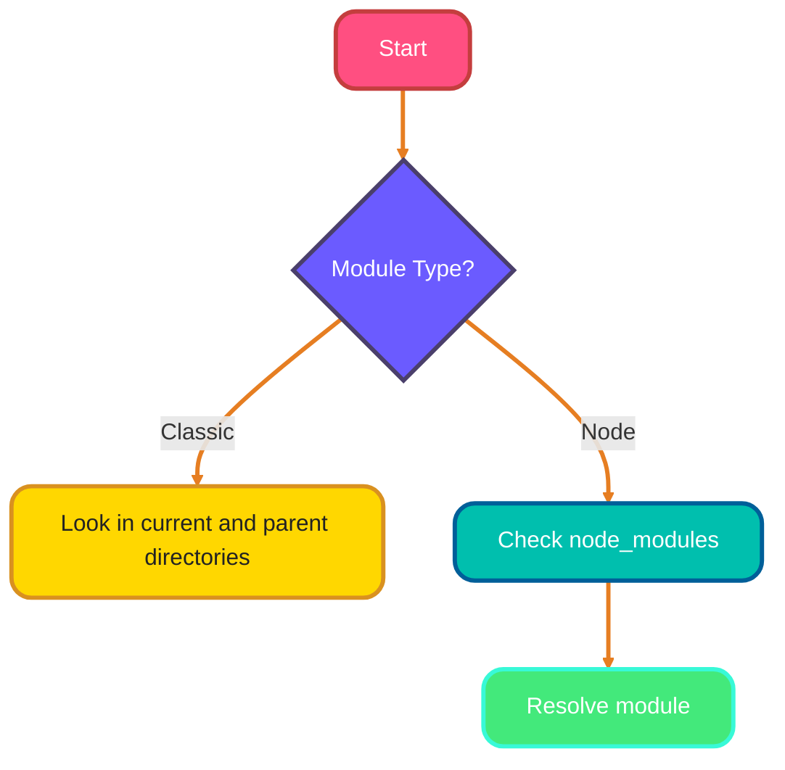
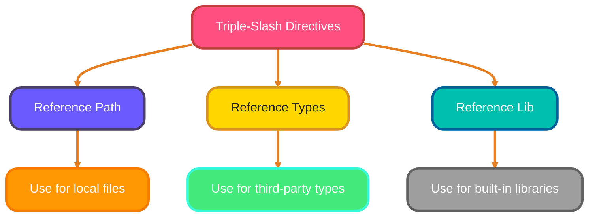
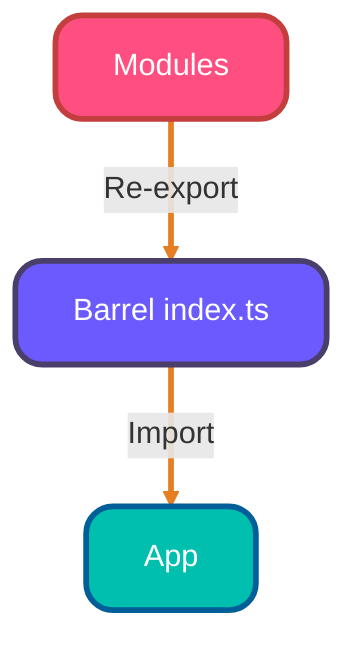
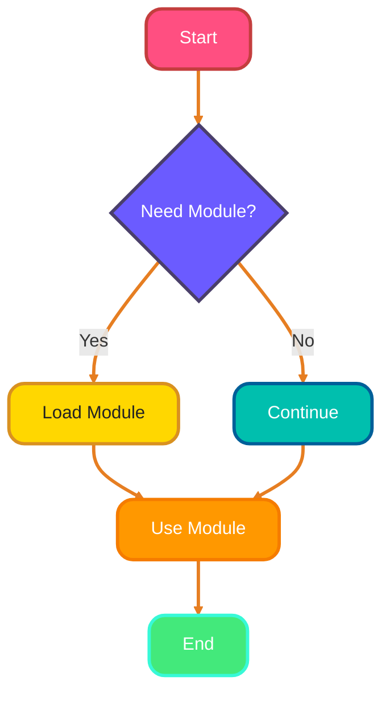

<!--
meta-description: "Complete guide to TypeScript modules and namespaces. Learn ES6 module system, resolution strategies, declaration files, triple-slash directives, barrel exports, and dynamic imports for building scalable applications."
keywords: "TypeScript modules, ES6 modules, module resolution, namespaces, declaration files, triple-slash directives, barrel exports, dynamic imports, code splitting, TypeScript architecture"
-->

# <span style="color:#e67e22;">What we will learn in this post?</span>
<ul style='list-style-type: none; padding-left: 0;'>
<li><span style='color: #2980b9; font-size: 20px; font-weight: bold;'>👉</span> <span style='color: #2ecc71; font-size: 18px; font-weight: bold;'>ES6 Modules in TypeScript</span></li>
<li><span style='color: #2980b9; font-size: 20px; font-weight: bold;'>👉</span> <span style='color: #2ecc71; font-size: 18px; font-weight: bold;'>Module Resolution Strategies</span></li>
<li><span style='color: #2980b9; font-size: 20px; font-weight: bold;'>👉</span> <span style='color: #2ecc71; font-size: 18px; font-weight: bold;'>Namespaces and Internal Modules</span></li>
<li><span style='color: #2980b9; font-size: 20px; font-weight: bold;'>👉</span> <span style='color: #2ecc71; font-size: 18px; font-weight: bold;'>Declaration Files (.d.ts)</span></li>
<li><span style='color: #2980b9; font-size: 20px; font-weight: bold;'>👉</span> <span style='color: #2ecc71; font-size: 18px; font-weight: bold;'>Triple-Slash Directives</span></li>
<li><span style='color: #2980b9; font-size: 20px; font-weight: bold;'>👉</span> <span style='color: #2ecc71; font-size: 18px; font-weight: bold;'>Barrel Exports and Index Files</span></li>
<li><span style='color: #2980b9; font-size: 20px; font-weight: bold;'>👉</span> <span style='color: #2ecc71; font-size: 18px; font-weight: bold;'>Dynamic Imports and Code Splitting</span></li>
</ul>

# <span style="color:#e67e22">Understanding TypeScript's ES6 Modules 📦</span>

TypeScript makes it easy to organize your code using **ES6 modules**. Let's break down how it works!

ES6 modules provide the foundation for scalable TypeScript applications. Mastering module patterns enables clean architecture and maintainable codebases.

## <span style="color:#2980b9">Import and Export Basics 🔄</span>

You can share code between files using **import** and **export** statements.

### <span style="color:#8e44ad">Named Exports</span>

You can export multiple items from a module:

```typescript
// math.ts
export const add = (a: number, b: number) => a + b;
export const subtract = (a: number, b: number) => a - b;
```

Then, import them like this:

```typescript
import { add, subtract } from './math';
```

### <span style="color:#8e44ad">Default Exports</span>

You can also have a single default export:

```typescript
// calculator.ts
const multiply = (a: number, b: number) => a * b;
export default multiply;
```

Import it without curly braces:

```typescript
import multiply from './calculator';
```

## <span style="color:#2980b9">Re-exporting 📤</span>

You can re-export items from another module:

```typescript
export { add, subtract } from './math';
```

## <span style="color:#2980b9">Module Path Resolution 🔍</span>

TypeScript resolves module paths based on your project structure. You can use relative paths (like `./`) or absolute paths if configured.

### Example Structure

```
/src
  ├── math.ts
  ├── calculator.ts
  └── app.ts
```

In `app.ts`, you can import from both `math.ts` and `calculator.ts` easily!

# <span style="color:#e67e22">Understanding TypeScript Module Resolution</span> 🌐

TypeScript uses different strategies to find and load modules. The two main strategies are **Classic** and **Node**.

## <span style="color:#2980b9">Module Resolution Strategies</span> 🔍

- **Classic**: This is the older method. It looks for modules in the same directory or in parent directories.
- **Node**: This method mimics Node.js behavior. It checks `node_modules` folders and follows the Node.js resolution logic.

### <span style="color:#8e44ad">Module Resolution Compiler Option</span> ⚙️

You can specify the resolution strategy in your `tsconfig.json`:

```json
{
  "compilerOptions": {
    "moduleResolution": "node"
  }
}
```

## <span style="color:#2980b9">Base URL and Path Mapping</span> 🗺️

- **baseUrl**: This sets a base directory for module resolution. It helps in simplifying imports.

```json
{
  "compilerOptions": {
    "baseUrl": "./src"
  }
}
```

- **paths**: This allows you to create aliases for directories.

```json
{
  "compilerOptions": {
    "paths": {
      "@app/*": ["app/*"]
    }
  }
}
```

## <span style="color:#2980b9">Resolving Third-Party Modules</span> 📦

TypeScript automatically resolves modules from the `node_modules` directory. Just install your packages using npm or yarn, and TypeScript will find them.

### <span style="color:#8e44ad">Common Configuration Patterns</span> 🛠️

- Use **Node** resolution for most projects.
- Set **baseUrl** for cleaner imports.
- Use **paths** for easier navigation in large projects.



Happy coding! 🎉

## <span style="color:#2980b9">Production-Ready Module Examples</span> 🚀

### <span style="color:#8e44ad">React Component Library</span>
```typescript
// components/index.ts - Barrel export
export { Button } from './Button';
export { Input } from './Input';
export { Modal } from './Modal';
export type { ButtonProps, InputProps, ModalProps } from './types';

// Usage in app
import { Button, Input, Modal } from '@/components';
```

### <span style="color:#8e44ad">API Service Layer</span>
```typescript
// services/api/index.ts
export { default as UserService } from './UserService';
export { default as ProductService } from './ProductService';
export { default as OrderService } from './OrderService';

// services/api/UserService.ts
import axios from 'axios';

export interface User {
  id: number;
  name: string;
  email: string;
}

export default class UserService {
  private static readonly BASE_URL = '/api/users';

  static async getUsers(): Promise<User[]> {
    const response = await axios.get<User[]>(this.BASE_URL);
    return response.data;
  }

  static async createUser(userData: Omit<User, 'id'>): Promise<User> {
    const response = await axios.post<User>(this.BASE_URL, userData);
    return response.data;
  }
}
```

### <span style="color:#8e44ad">Utility Library with Declaration Files</span>
```typescript
// utils/index.ts
export * from './string';
export * from './array';
export * from './date';

// utils/string.d.ts
declare module './string' {
  export function capitalize(str: string): string;
  export function truncate(str: string, length: number): string;
  export function slugify(str: string): string;
}

// utils/string.js (JavaScript implementation)
export function capitalize(str) {
  return str.charAt(0).toUpperCase() + str.slice(1);
}

export function truncate(str, length) {
  return str.length > length ? str.slice(0, length) + '...' : str;
}

export function slugify(str) {
  return str.toLowerCase().replace(/[^a-z0-9]+/g, '-');
}
```

# <span style="color:#e67e22">Introduction to TypeScript Namespaces</span> 🌟

TypeScript namespaces, previously known as internal modules, help organize your code into logical groups. They use the `namespace` keyword to encapsulate related functionalities, making your code cleaner and easier to manage.

## <span style="color:#2980b9">When to Use Namespaces vs. ES6 Modules</span>

While ES6 modules are the modern way to structure code, namespaces are still useful in certain scenarios:

- **Legacy Code**: If you're working with older TypeScript projects.
- **Global Scope**: When you want to avoid polluting the global namespace.

### <span style="color:#8e44ad">Creating a Namespace</span>

Here’s a simple example of a namespace:

```typescript
namespace MathUtils {
    export function add(x: number, y: number): number {
        return x + y; // Adds two numbers
    }

    export function subtract(x: number, y: number): number {
        return x - y; // Subtracts second number from first
    }
}

// Using the namespace
const sum = MathUtils.add(5, 3); // sum is 8
const difference = MathUtils.subtract(5, 3); // difference is 2
```

### <span style="color:#8e44ad">Nested Namespaces</span>

You can also create nested namespaces for better organization:

```typescript
namespace Geometry {
    export namespace Shapes {
        export class Circle {
            constructor(public radius: number) {}
            area(): number {
                return Math.PI * this.radius ** 2; // Area of the circle
            }
        }
    }
}

// Using the nested namespace
const circle = new Geometry.Shapes.Circle(5);
console.log(circle.area()); // Outputs the area of the circle
```

### <span style="color:#2980b9">Exporting Members</span>

To make functions or classes available outside the namespace, use the `export` keyword. This allows other parts of your code to access them.

### <span style="color:#2980b9">Comparison with Modules</span>

| Feature          | Namespaces                     | ES6 Modules                |
|------------------|-------------------------------|----------------------------|
| Scope            | Global or local               | File-based                  |
| Syntax           | `namespace`                   | `import`/`export`          |
| Use Case         | Organizing related code       | Modularizing applications    |

### <span style="color:#8e44ad">Conclusion</span>

Namespaces are a powerful way to organize your TypeScript code, especially in larger projects. While ES6 modules are the preferred method today, understanding namespaces can still be beneficial for maintaining legacy code or structuring your applications effectively. Happy coding! 🎉

# <span style="color:#e67e22">Understanding TypeScript Declaration Files 📄</span>

TypeScript is a powerful tool that helps us write better JavaScript by adding types. But what if you want to use a JavaScript library that doesn’t have type information? That’s where **declaration files** come in!

## <span style="color:#2980b9">What are Declaration Files? 🤔</span>

Declaration files, with the `.d.ts` extension, provide TypeScript with type information about JavaScript libraries. They help TypeScript understand the shapes of objects, functions, and more.

### <span style="color:#8e44ad">Using the `declare` Keyword 🛠️</span>

The `declare` keyword is used to tell TypeScript about variables or functions that exist but are defined elsewhere. Here’s a simple example:

```typescript
declare function greet(name: string): void;
```

This tells TypeScript that there’s a function called `greet` that takes a string and returns nothing.

### <span style="color:#8e44ad">Ambient Declarations 🌍</span>

Ambient declarations are a way to describe the types of existing JavaScript code. You can create a `.d.ts` file to declare types for a library you’re using.

### <span style="color:#2980b9">Using @types Packages 📦</span>

Many popular libraries have type definitions available through the **DefinitelyTyped** repository. You can install them using npm:

```bash
npm install --save-dev @types/library-name
```

This makes it easy to get type support for libraries like jQuery or Lodash!

# <span style="color:#e67e22">Understanding Triple-Slash Directives</span> 🚀

Triple-slash directives are special comments in TypeScript that help manage dependencies between files. Here’s a quick guide to the most common ones:

## <span style="color:#2980b9">Types of Triple-Slash Directives</span>

### <span style="color:#8e44ad">1. `/// <reference path='...' />`</span>
- **Purpose**: Links to another file.
- **When to Use**: When you need to include types or definitions from another file.
  
### <span style="color:#8e44ad">2. `/// <reference types='...' />`</span>
- **Purpose**: Includes type definitions from a package.
- **When to Use**: When using third-party libraries with type definitions.

### <span style="color:#8e44ad">3. `/// <reference lib='...' />`</span>
- **Purpose**: Includes built-in TypeScript libraries.
- **When to Use**: When you want to use specific JavaScript features.

## <span style="color:#2980b9">Modern Alternatives</span> 🌟
With modern module systems (like ES6 modules), you often don't need these directives. Instead, you can use:

- **`import` statements**: For importing modules.
- **Package managers**: Like npm to manage dependencies.

### Example:
```typescript
import { MyFunction } from './myModule';
```



Feel free to explore these options to enhance your TypeScript experience! 😊

# <span style="color:#e67e22">Understanding the Barrel Export Pattern</span>

The **barrel export pattern** is a neat way to organize your code in TypeScript. It allows you to create a single entry point for multiple modules, making your imports cleaner and your codebase easier to manage. 🌟

## <span style="color:#2980b9">What is a Barrel?</span>

A *barrel* is simply an `index.ts` file that re-exports modules from a directory. This means you can import everything you need from one place instead of multiple files.

### <span style="color:#8e44ad">Benefits of Using Barrels</span>

- **Simplified Imports**: Instead of importing each module separately, you can do it in one line!
  
  ```typescript
  import { ModuleA, ModuleB } from './modules';
  ```

- **Better API Design**: It creates a clear structure for your code, making it easier for others to understand.

- **Organized Codebase**: As your project grows, barrels help keep things tidy.

### <span style="color:#8e44ad">Creating a Barrel</span>

1. **Create an `index.ts` file** in your module directory.
2. **Re-export your modules**:

   ```typescript
   export * from './ModuleA';
   export * from './ModuleB';
   ```

### <span style="color:#2980b9">Using the Barrel</span>

Now, you can import everything from the barrel:

```typescript
import { ModuleA, ModuleB } from './modules';
```



Using the barrel export pattern can greatly enhance your development experience! Happy coding! 😊

# <span style="color:#e67e22">Dynamic Imports in JavaScript</span> 🚀

Dynamic imports allow you to load modules on demand, which can improve your app's performance. Let's break it down!

## <span style="color:#2980b9">What are Dynamic Imports?</span>

- **Lazy Loading**: Load modules only when needed.
- **Code Splitting**: Split your code into smaller chunks.
- **Conditional Loading**: Load modules based on certain conditions.

### <span style="color:#8e44ad">Using the `import()` Function</span>

You can use the `import()` function to dynamically load modules. Here’s a simple example:

```javascript
async function loadModule() {
    const module = await import('./myModule.js');
    module.doSomething();
}
```

### <span style="color:#8e44ad">TypeScript and Dynamic Imports</span>

TypeScript supports dynamic imports with type inference. You can specify types for better safety:

```typescript
const module = await import('./myModule.js') as { doSomething: () => void };
module.doSomething();
```

### <span style="color:#2980b9">Performance Optimization</span> 🌟

- **Reduce Initial Load Time**: Only load what you need.
- **Improve User Experience**: Faster interactions.

### <span style="color:#8e44ad">Use Cases</span>

- **Large Libraries**: Load libraries only when required.
- **Feature Flags**: Load features based on user roles.



Dynamic imports are a powerful tool for modern web development. Happy coding! 🎉

---

<details style='border: 2px solid #c43e3e; border-radius: 8px; padding: 20px; background: linear-gradient(135deg, #ffe6e6 0%, #fff 100%); margin: 25px 0; box-shadow: 0 6px 12px rgba(196, 62, 62, 0.15);'>
<summary style='cursor: pointer; font-size: 1.3em; font-weight: bold; color: #c43e3e; padding: 10px 0;'>
🎯 Hands-On Assignment: Build a Modular E-Commerce Platform 🚀
</summary>

<div style='margin-top: 20px; color: #2c3e50; line-height: 1.6;'>

<h3 style='color: #c43e3e; border-bottom: 2px solid #c43e3e; padding-bottom: 8px; margin-top: 20px;'>📝 Your Mission</h3>

Create a complete modular e-commerce platform using TypeScript modules, namespaces, and dynamic imports. Build a scalable architecture with proper separation of concerns and lazy loading.

<h3 style='color: #c43e3e; border-bottom: 2px solid #c43e3e; padding-bottom: 8px; margin-top: 20px;'>🎯 Requirements</h3>

<ol style='margin-left: 20px;'>
<li>Implement ES6 modules for core business logic (products, cart, orders)</li>
<li>Create barrel exports for clean API surfaces</li>
<li>Use dynamic imports for route-based code splitting</li>
<li>Build declaration files for third-party JavaScript libraries</li>
<li>Configure advanced module resolution with path aliases</li>
<li>Implement namespaces for utility functions and legacy code integration</li>
</ol>

<h3 style='color: #c43e3e; border-bottom: 2px solid #c43e3e; padding-bottom: 8px; margin-top: 20px;'>💡 Implementation Hints</h3>

<ol style='margin-left: 20px;'>
<li>Use barrel exports (index.ts) for feature modules</li>
<li>Configure tsconfig.json with baseUrl and paths for clean imports</li>
<li>Implement lazy loading for product detail pages</li>
<li>Create .d.ts files for JavaScript utility libraries</li>
<li>Use namespaces for organizing validation and formatting utilities</li>
</ol>

<h3 style='color: #c43e3e; border-bottom: 2px solid #c43e3e; padding-bottom: 8px; margin-top: 20px;'>🚀 Example Project Structure</h3>

<pre style='background: #2c3e50; color: #ecf0f1; padding: 20px; border-radius: 8px; overflow-x: auto; margin: 15px 0;'><code class='language-bash'>ecommerce-platform/
├── src/
│   ├── modules/
│   │   ├── products/
│   │   │   ├── index.ts
│   │   │   ├── ProductService.ts
│   │   │   └── types.ts
│   │   ├── cart/
│   │   │   ├── index.ts
│   │   │   └── CartManager.ts
│   │   └── orders/
│   │       ├── index.ts
│   │       └── OrderProcessor.ts
│   ├── utils/
│   │   ├── validation.ts
│   │   └── formatting.ts
│   ├── types/
│   │   └── index.d.ts
│   ├── pages/
│   │   ├── Home.tsx
│   │   └── ProductDetail.tsx (lazy loaded)
│   └── app.ts
├── tsconfig.json
└── package.json
</code></pre>

<h3 style='color: #c43e3e; border-bottom: 2px solid #c43e3e; padding-bottom: 8px; margin-top: 25px;'>🏆 Bonus Challenges</h3>

<ul style='margin-left: 20px;'>
<li><strong>Level 2</strong>: Add webpack configuration for optimal bundle splitting</li>
<li><strong>Level 3</strong>: Implement plugin architecture with dynamic module loading</li>
<li><strong>Level 4</strong>: Add comprehensive declaration files for a popular JavaScript library</li>
<li><strong>Level 5</strong>: Create a monorepo setup with project references</li>
</ul>

<h3 style='color: #c43e3e; border-bottom: 2px solid #c43e3e; padding-bottom: 8px; margin-top: 25px;'>📚 Learning Goals</h3>

<ul style='margin-left: 20px;'>
<li>Master ES6 module patterns for scalable applications 🎯</li>
<li>Implement barrel exports for clean API design ✨</li>
<li>Use dynamic imports for performance optimization 🔄</li>
<li>Create declaration files for JavaScript integration 🛠️</li>
<li>Configure advanced module resolution strategies 📁</li>
</ul>

<p style='background: #3498db; color: #fff; padding: 15px; border-radius: 8px; margin-top: 20px; border-left: 5px solid #2980b9;'>
<strong>💡 Pro Tip:</strong> This modular architecture powers major platforms like Shopify, Uber, and Airbnb for handling millions of users with maintainable codebases!
</p>

<p style='margin-top: 20px; font-size: 1.1em;'><strong>Share Your Solution! 💬</strong></p>
<p>Completed the e-commerce platform? <strong>Post your module architecture and tsconfig.json in the comments below!</strong> Show us your TypeScript modularity mastery! 🚀✨</p>

</div>
</details>

---

# <span style="color:#e67e22">Conclusion: Master Module Architecture for Scalable TypeScript Applications 🎓</span>

TypeScript modules and namespaces form the backbone of maintainable, scalable applications. By mastering ES6 modules, resolution strategies, declaration files, and dynamic imports, you can build robust systems that grow with your needs and integrate seamlessly with existing JavaScript ecosystems.

