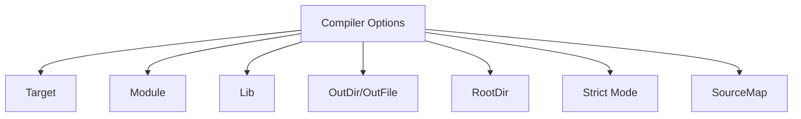
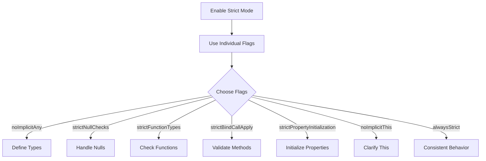

Error: API request failed with error: 401 Client Error: Unauthorized for url: https://openrouter.ai/api/v1/chat/completions

# <span style="color:#e67e22;">What we will learn in this post?</span>
<ul style='list-style-type: none; padding-left: 0;'>
<li><span style='color: #2980b9; font-size: 20px; font-weight: bold;'>👉</span> <span style='color: #2ecc71; font-size: 18px; font-weight: bold;'>Understanding tsconfig.json</span></li>
<li><span style='color: #2980b9; font-size: 20px; font-weight: bold;'>👉</span> <span style='color: #2ecc71; font-size: 18px; font-weight: bold;'>Essential Compiler Options</span></li>
<li><span style='color: #2980b9; font-size: 20px; font-weight: bold;'>👉</span> <span style='color: #2ecc71; font-size: 18px; font-weight: bold;'>Strict Type Checking Options</span></li>
<li><span style='color: #2980b9; font-size: 20px; font-weight: bold;'>👉</span> <span style='color: #2ecc71; font-size: 18px; font-weight: bold;'>Module Resolution and Paths</span></li>
<li><span style='color: #2980b9; font-size: 20px; font-weight: bold;'>👉</span> <span style='color: #2ecc71; font-size: 18px; font-weight: bold;'>Source Maps and Debugging</span></li>
<li><span style='color: #2980b9; font-size: 20px; font-weight: bold;'>👉</span> <span style='color: #2ecc71; font-size: 18px; font-weight: bold;'>Project References and Build Mode</span></li>
<li><span style='color: #2980b9; font-size: 20px; font-weight: bold;'>👉</span> <span style='color: #2ecc71; font-size: 18px; font-weight: bold;'>Compiler API and Programmatic Usage</span></li>
</ul>

# <span style="color:#e67e22">Introduction to tsconfig.json</span> 🎉

The `tsconfig.json` file is a crucial part of any TypeScript project. It helps you **configure the TypeScript compiler** and manage your project's structure. With this file, you can:

- Set **compiler options** for TypeScript.
- Specify which files to include or exclude.
- Enhance **IDE support** for a smoother development experience.

## <span style="color:#2980b9">Key Components of tsconfig.json</span>

### <span style="color:#8e44ad">1. Compiler Options</span> ⚙️

The `compilerOptions` section allows you to customize how TypeScript compiles your code. For example, you can enable strict type checking or set the target JavaScript version.

### <span style="color:#8e44ad">2. Include/Exclude Patterns</span> 📂

You can specify which files or directories to include or exclude from the compilation process. This helps keep your project organized and efficient.

### <span style="color:#8e44ad">3. Files Array</span> 📄

The `files` array lets you explicitly list the files to be compiled. This is useful for small projects or specific file management.

## <span style="color:#2980b9">Basic Configuration Example</span> 🛠️

Here’s a simple example of a `tsconfig.json` file:

```json
{
  "compilerOptions": {
    "target": "es6",
    "module": "commonjs",
    "strict": true
  },
  "include": ["src/**/*"],
  "exclude": ["node_modules", "**/*.spec.ts"]
}
```

For more information, check out the [TypeScript Documentation](https://www.typescriptlang.org/docs/). Happy coding! 🚀

# <span style="color:#e67e22">Essential Compiler Options Explained</span>

Compiling your code can feel tricky, but understanding some key options can make it easier! Let’s break down some essential compiler options in a friendly way. 😊

## <span style="color:#2980b9">Key Compiler Options</span>

### <span style="color:#8e44ad">1. Target (ES Version)</span>
This option tells the compiler which version of JavaScript to use. For example, if you set it to `ES6`, your code will use features from that version. This helps ensure compatibility with different browsers.

### <span style="color:#8e44ad">2. Module (Module System)</span>
This option defines how your code is organized. You can choose systems like `CommonJS` or `ES Modules`. This affects how you import and export code between files.

### <span style="color:#8e44ad">3. Lib (Library Files)</span>
You can include specific library files that your code needs. This is useful for using built-in features like `DOM` or `ES6` functions.

### <span style="color:#8e44ad">4. OutDir/OutFile (Output)</span>
These options specify where to save the compiled files. `outDir` saves all files in a folder, while `outFile` combines everything into one file.

### <span style="color:#8e44ad">5. RootDir (Input)</span>
This tells the compiler where to find your source files. It helps keep your project organized.

### <span style="color:#8e44ad">6. Strict Mode</span>
Enabling strict mode helps catch errors early by enforcing stricter type checking. This makes your code safer and more reliable.

### <span style="color:#8e44ad">7. SourceMap for Debugging</span>
Source maps help you debug your code by mapping the compiled code back to your original source code. This makes it easier to find and fix issues.

## <span style="color:#2980b9">Conclusion</span>
Understanding these options can greatly improve your coding experience! For more detailed information, check out the [TypeScript Compiler Options Documentation](https://www.typescriptlang.org/docs/handbook/compiler-options.html). Happy coding! 🎉



# <span style="color:#e67e22">Understanding TypeScript Strict Mode</span> 🚀

## <span style="color:#2980b9">What is Strict Mode?</span>

Strict mode in TypeScript helps you write safer and more reliable code. It catches common mistakes and improves code quality. Here are the key flags you can enable:

### <span style="color:#8e44ad">Individual Strict Flags</span>

- **`noImplicitAny`**: Prevents variables from being implicitly assigned the `any` type. This helps you define types explicitly.
- **`strictNullChecks`**: Ensures that `null` and `undefined` are not assignable to other types unless explicitly allowed.
- **`strictFunctionTypes`**: Checks function parameter types more strictly, enhancing type safety.
- **`strictBindCallApply`**: Ensures that the `bind`, `call`, and `apply` methods are used correctly.
- **`strictPropertyInitialization`**: Ensures class properties are initialized in the constructor.
- **`noImplicitThis`**: Prevents the use of `this` in a way that could lead to errors.
- **`alwaysStrict`**: Enforces strict mode in all files, ensuring consistent behavior.

## <span style="color:#2980b9">Benefits of Enabling Strict Mode</span> 🌟

- **Improved Code Quality**: Catches errors early in development.
- **Better Type Safety**: Reduces runtime errors by enforcing type checks.
- **Easier Maintenance**: Code is clearer and easier to understand.

## <span style="color:#2980b9">Migration Strategies</span> 🔄

- **Start Small**: Enable strict mode gradually in your project.
- **Use TypeScript's Compiler Options**: Adjust settings in your `tsconfig.json`.
- **Refactor Incrementally**: Update code to comply with strict rules step by step.

For more information, check out the [TypeScript Handbook](https://www.typescriptlang.org/docs/handbook/intro.html).



Embrace strict mode for a better coding experience! Happy coding! 🎉

# <span style="color:#e67e22">Understanding Module Resolution Options</span> 🌟

When working with TypeScript, understanding how to manage your modules can make your life easier! Let’s break down some key concepts: **moduleResolution**, **baseUrl**, **paths**, **rootDirs**, and **typeRoots**.

## <span style="color:#2980b9">Module Resolution</span> 🔍

Module resolution is how TypeScript finds the files you want to import. You can set it to different strategies, like `node` or `classic`. The `node` option is popular because it mimics how Node.js resolves modules.

## <span style="color:#2980b9">Base URL</span> 📍

The **baseUrl** is the root directory for your project. It helps TypeScript know where to start looking for modules. For example:

```json
{
  "compilerOptions": {
    "baseUrl": "./src"
  }
}
```

## <span style="color:#2980b9">Path Aliases</span> 🛤️

You can create shortcuts for your imports using **paths**. This is super handy! For instance, if you want to use `@/components`, you can set it up like this:

```json
{
  "compilerOptions": {
    "baseUrl": "./src",
    "paths": {
      "@/*": ["*"]
    }
  }
}
```

Now, instead of writing `import Button from '../../components/Button'`, you can simply write `import Button from '@/components/Button'`.

## <span style="color:#2980b9">Root Directories</span> 🗂️

**rootDirs** allows you to specify multiple directories that TypeScript will treat as one. This is useful for virtual directories.

## <span style="color:#2980b9">Type Roots</span> 📚

Finally, **typeRoots** lets you define where TypeScript should look for type declarations. This is great for custom types!

```json
{
  "compilerOptions": {
    "typeRoots": ["./types", "./node_modules/@types"]
  }
}
```

### Resources for More Info 📖

- [TypeScript Documentation](https://www.typescriptlang.org/docs/)
- [Path Mapping in TypeScript](https://www.typescriptlang.org/docs/handbook/module-resolution.html)

By using these options, you can keep your code clean and organized! Happy coding! 🎉

# <span style="color:#e67e22">Debugging TypeScript with Source Maps</span> 🛠️

## <span style="color:#2980b9">What are Source Maps?</span>

Source maps help you debug TypeScript code by mapping the compiled JavaScript back to the original TypeScript. This makes it easier to read and understand errors.

### Key Options:

- **`sourceMap`**: Generates a `.map` file for your TypeScript files.
- **`inlineSourceMap`**: Embeds the source map directly in the JavaScript file.
- **`sourceRoot`**: Specifies the root URL for the sources in the map.
- **`declaration`**: Creates `.d.ts` files for TypeScript definitions.

### Example `tsconfig.json`:

```json
{
  "compilerOptions": {
    "sourceMap": true,          // Enable source maps
    "inlineSourceMap": false,   // Use external source maps
    "sourceRoot": "./src",      // Set source root
    "declaration": true          // Generate declaration files
  }
}
```

## <span style="color:#2980b9">Setting Up Debugging</span> 🔧

### In VS Code:

1. Open the Debug panel.
2. Create a new launch configuration.
3. Use the following configuration:

```json
{
  "version": "0.2.0",
  "configurations": [
    {
      "type": "node",
      "request": "launch",
      "name": "Launch Program",
      "program": "${workspaceFolder}/app.js",
      "outFiles": ["${workspaceFolder}/dist/**/*.js"]
    }
  ]
}
```

### In Browser DevTools:

1. Open DevTools (F12).
2. Go to the "Sources" tab.
3. Find your TypeScript files under the `webpack://` or `file://` section.

## <span style="color:#2980b9">Resources</span> 📚

- [TypeScript Source Maps Documentation](https://www.typescriptlang.org/docs/handbook/source-maps.html)
- [VS Code Debugging Documentation](https://code.visualstudio.com/docs/editor/debugging)

By using source maps, you can easily debug your TypeScript code in both Node.js and browsers! Happy coding! 🎉

# <span style="color:#e67e22">Introduction to TypeScript Project References</span> 🚀

TypeScript is a powerful tool for building large codebases, especially when using **project references**. This feature helps manage multiple projects efficiently, making it easier to maintain and scale your applications.

## <span style="color:#2980b9">What are Composite Projects?</span>

Composite projects allow you to organize your TypeScript code into smaller, manageable pieces. Each piece can be a separate project, which can reference others. This structure is perfect for large applications or **monorepos**.

### <span style="color:#8e44ad">Key Features</span>

- **References Array in `tsconfig.json`**: This array lists all the projects your current project depends on. Here’s a simple example:

```json
{
  "compilerOptions": {
    "composite": true
  },
  "references": [
    { "path": "../project-a" },
    { "path": "../project-b" }
  ]
}
```
*This configuration tells TypeScript to include `project-a` and `project-b` as dependencies.*

- **Incremental Compilation**: TypeScript only recompiles changed files, speeding up the build process.

- **Using `tsc --build` Mode**: This command builds all projects in the references array. It’s efficient and ensures everything is up to date.

```bash
tsc --build
```
*Run this command to build your entire project structure in one go!*

## <span style="color:#2980b9">Benefits for Monorepos</span> 🌟

- **Improved Organization**: Keep related projects together.
- **Faster Builds**: Only rebuild what’s necessary.
- **Easier Collaboration**: Teams can work on different projects without conflicts.

For more details, check out the [TypeScript Project References Documentation](https://www.typescriptlang.org/docs/handbook/project-references.html).

### <span style="color:#8e44ad">Conclusion</span>

Using TypeScript project references can greatly enhance your development experience, especially in large codebases. Embrace this feature to build scalable and maintainable applications!

# <span style="color:#e67e22">Using TypeScript's Compiler API</span> 🌟

TypeScript's Compiler API lets you build custom tools for tasks like **code analysis** and **transformations**. It’s a powerful way to work with TypeScript files programmatically! Let’s break it down.

## <span style="color:#2980b9">Key Functions</span> 🔑

### <span style="color:#8e44ad">1. createProgram</span> 🛠️

This function helps you create a program instance. You can specify the files you want to compile and the compiler options.

```typescript
const ts = require("typescript");

const program = ts.createProgram(["file.ts"], { outDir: "./dist" });
```

### <span style="color:#8e44ad">2. getPreEmitDiagnostics</span> 📝

After creating a program, you can check for errors before emitting files. This function returns any diagnostics (errors or warnings) in your code.

```typescript
const diagnostics = ts.getPreEmitDiagnostics(program);
```

### <span style="color:#8e44ad">3. Custom Transformers</span> 🔄

Transformers allow you to modify the AST (Abstract Syntax Tree) of your TypeScript code. You can create custom transformations to change how your code is compiled.

```typescript
const transformer = (context) => (sourceFile) => {
    // Your transformation logic here
    return sourceFile;
};
```

## <span style="color:#2980b9">Example: Compiling TypeScript Files</span> 📄

Here’s a simple example of compiling a TypeScript file:

```typescript
const program = ts.createProgram(["example.ts"], {});
const emitResult = program.emit();
const diagnostics = ts.getPreEmitDiagnostics(program).concat(emitResult.diagnostics);

diagnostics.forEach(diagnostic => {
    if (diagnostic.file) {
        const { line, character } = diagnostic.file.getLineAndCharacterOfPosition(diagnostic.start);
        const message = ts.flattenDiagnosticMessageText(diagnostic.messageText, "\n");
        console.log(`${diagnostic.file.fileName} (${line + 1},${character + 1}): ${message}`);
    } else {
        console.log(ts.flattenDiagnosticMessageText(diagnostic.messageText, "\n"));
    }
});
```

## <span style="color:#2980b9">Resources</span> 📚

- [TypeScript Compiler API Documentation](https://github.com/microsoft/TypeScript/wiki/Using-the-Compiler-API)
- [TypeScript Handbook](https://www.typescriptlang.org/docs/)

With these tools, you can create powerful custom build tools and perform in-depth code analysis. Happy coding! 🎉

