<!--
meta-description: "Complete guide to TypeScript configuration and compiler options. Learn to configure tsconfig.json, enable strict mode, set up module resolution, use source maps for debugging, and leverage project references for large-scale applications."
keywords: "TypeScript configuration, tsconfig.json, TypeScript compiler options, strict mode, module resolution, source maps, project references, TypeScript build tools"
-->

# <span style="color:#e67e22;">What we will learn in this post?</span>
<ul style='list-style-type: none; padding-left: 0;'>
<li><span style='color: #2980b9; font-size: 20px; font-weight: bold;'>👉</span> <span style='color: #2ecc71; font-size: 18px; font-weight: bold;'>Understanding tsconfig.json</span></li>
<li><span style='color: #2980b9; font-size: 20px; font-weight: bold;'>👉</span> <span style='color: #2ecc71; font-size: 18px; font-weight: bold;'>Essential Compiler Options</span></li>
<li><span style='color: #2980b9; font-size: 20px; font-weight: bold;'>👉</span> <span style='color: #2ecc71; font-size: 18px; font-weight: bold;'>Strict Type Checking Options</span></li>
<li><span style='color: #2980b9; font-size: 20px; font-weight: bold;'>👉</span> <span style='color: #2ecc71; font-size: 18px; font-weight: bold;'>Module Resolution and Paths</span></li>
<li><span style='color: #2980b9; font-size: 20px; font-weight: bold;'>👉</span> <span style='color: #2ecc71; font-size: 18px; font-weight: bold;'>Source Maps and Debugging</span></li>
<li><span style='color: #2980b9; font-size: 20px; font-weight: bold;'>👉</span> <span style='color: #2ecc71; font-size: 18px; font-weight: bold;'>Project References and Build Mode</span></li>
<li><span style='color: #2980b9; font-size: 20px; font-weight: bold;'>👉</span> <span style='color: #2ecc71; font-size: 18px; font-weight: bold;'>Compiler API and Programmatic Usage</span></li>
</ul>

# <span style="color:#e67e22">Introduction to tsconfig.json</span> 🎉

The `tsconfig.json` file is a crucial part of any TypeScript project. It helps you **configure the TypeScript compiler** and manage your project's structure. With this file, you can:

- Set **compiler options** for TypeScript.
- Specify which files to include or exclude.
- Enhance **IDE support** for a smoother development experience.

Mastering tsconfig.json configuration is essential for scalable TypeScript applications. It ensures consistent compilation and optimal performance across development teams.

## <span style="color:#2980b9">Key Components of tsconfig.json</span>

### <span style="color:#8e44ad">1. Compiler Options</span> ⚙️

The `compilerOptions` section allows you to customize how TypeScript compiles your code. For example, you can enable strict type checking or set the target JavaScript version.

### <span style="color:#8e44ad">2. Include/Exclude Patterns</span> 📂

You can specify which files or directories to include or exclude from the compilation process. This helps keep your project organized and efficient.

### <span style="color:#8e44ad">3. Files Array</span> 📄

The `files` array lets you explicitly list the files to be compiled. This is useful for small projects or specific file management.

## <span style="color:#2980b9">Basic Configuration Example</span> 🛠️

Here’s a simple example of a `tsconfig.json` file:

```json
{
  "compilerOptions": {
    "target": "es6",
    "module": "commonjs",
    "strict": true
  },
  "include": ["src/**/*"],
  "exclude": ["node_modules", "**/*.spec.ts"]
}
```
## <span style="color:#2980b9">Production-Ready Configuration Examples</span> 🚀

### <span style="color:#8e44ad">React Web Application</span>
```json
{
  "compilerOptions": {
    "target": "ES2020",
    "lib": ["dom", "dom.iterable", "ES6"],
    "allowJs": true,
    "skipLibCheck": true,
    "esModuleInterop": true,
    "allowSyntheticDefaultImports": true,
    "strict": true,
    "forceConsistentCasingInFileNames": true,
    "noFallthroughCasesInSwitch": true,
    "module": "esnext",
    "moduleResolution": "node",
    "resolveJsonModule": true,
    "isolatedModules": true,
    "noEmit": true,
    "jsx": "react-jsx"
  },
  "include": ["src"]
}
```

### <span style="color:#8e44ad">Node.js Backend API</span>
```json
{
  "compilerOptions": {
    "target": "ES2020",
    "module": "commonjs",
    "lib": ["ES2020"],
    "outDir": "./dist",
    "rootDir": "./src",
    "strict": true,
    "esModuleInterop": true,
    "skipLibCheck": true,
    "forceConsistentCasingInFileNames": true,
    "declaration": true,
    "declarationMap": true,
    "sourceMap": true,
    "removeComments": true,
    "noImplicitAny": true,
    "strictNullChecks": true,
    "strictFunctionTypes": true,
    "noImplicitReturns": true,
    "noFallthroughCasesInSwitch": true,
    "moduleResolution": "node",
    "allowSyntheticDefaultImports": true,
    "experimentalDecorators": true,
    "emitDecoratorMetadata": true
  },
  "include": ["src/**/*"],
  "exclude": ["node_modules", "**/*.test.ts", "**/*.spec.ts"]
}
```

### <span style="color:#8e44ad">Monorepo with Project References</span>
```json
{
  "compilerOptions": {
    "target": "ES2020",
    "module": "ES2020",
    "lib": ["ES2020"],
    "declaration": true,
    "declarationMap": true,
    "sourceMap": true,
    "composite": true,
    "strict": true,
    "esModuleInterop": true,
    "skipLibCheck": true,
    "forceConsistentCasingInFileNames": true,
    "moduleResolution": "node"
  },
  "references": [
    { "path": "./packages/shared" },
    { "path": "./packages/web" },
    { "path": "./packages/api" }
  ]
}
```# <span style="color:#e67e22">Essential Compiler Options Explained</span>

Compiling your code can feel tricky, but understanding some key options can make it easier! Let’s break down some essential compiler options in a friendly way. 😊
These options form the foundation of professional TypeScript development. Proper configuration prevents common compilation errors and improves code maintainability.
## <span style="color:#2980b9">Key Compiler Options</span>

### <span style="color:#8e44ad">1. Target (ES Version)</span>
This option tells the compiler which version of JavaScript to use. For example, if you set it to `ES6`, your code will use features from that version. This helps ensure compatibility with different browsers.

### <span style="color:#8e44ad">2. Module (Module System)</span>
This option defines how your code is organized. You can choose systems like `CommonJS` or `ES Modules`. This affects how you import and export code between files.

### <span style="color:#8e44ad">3. Lib (Library Files)</span>
You can include specific library files that your code needs. This is useful for using built-in features like `DOM` or `ES6` functions.

### <span style="color:#8e44ad">4. OutDir/OutFile (Output)</span>
These options specify where to save the compiled files. `outDir` saves all files in a folder, while `outFile` combines everything into one file.

### <span style="color:#8e44ad">5. RootDir (Input)</span>
This tells the compiler where to find your source files. It helps keep your project organized.

### <span style="color:#8e44ad">6. Strict Mode</span>
Enabling strict mode helps catch errors early by enforcing stricter type checking. This makes your code safer and more reliable.

### <span style="color:#8e44ad">7. SourceMap for Debugging</span>
Source maps help you debug your code by mapping the compiled code back to your original source code. This makes it easier to find and fix issues.

```mermaid
graph TD;
    A[⚙️ Compiler Options]:::style1 --> B[🎯 Target]:::style2
    A --> C[📦 Module]:::style3
    A --> D[📚 Lib]:::style4
    A --> E[📁 OutDir/OutFile]:::style5
    A --> F[🏠 RootDir]:::style6
    A --> G[🔒 Strict Mode]:::style7
    A --> H[🗺️ SourceMap]:::style8

    classDef style1 fill:#ff4f81,stroke:#c43e3e,color:#fff,font-size:16px,stroke-width:3px,rx:14,shadow:6px;
    classDef style2 fill:#6b5bff,stroke:#4a3f6b,color:#fff,font-size:16px,stroke-width:3px,rx:14,shadow:6px;
    classDef style3 fill:#ffd700,stroke:#d99120,color:#222,font-size:16px,stroke-width:3px,rx:14,shadow:6px;
    classDef style4 fill:#00bfae,stroke:#005f99,color:#fff,font-size:16px,stroke-width:3px,rx:14,shadow:6px;
    classDef style5 fill:#ff9800,stroke:#f57c00,color:#fff,font-size:16px,stroke-width:3px,rx:14,shadow:6px;
    classDef style6 fill:#43e97b,stroke:#38f9d7,color:#fff,font-size:16px,stroke-width:3px,rx:14,shadow:6px;
    classDef style7 fill:#9e9e9e,stroke:#616161,color:#fff,font-size:16px,stroke-width:3px,rx:14,shadow:6px;
    classDef style8 fill:#e67e22,stroke:#d35400,color:#fff,font-size:16px,stroke-width:3px,rx:14,shadow:6px;

    class A style1;
    class B style2;
    class C style3;
    class D style4;
    class E style5;
    class F style6;
    class G style7;
    class H style8;

    linkStyle default stroke:#e67e22,stroke-width:3px;
```



# <span style="color:#e67e22">Understanding TypeScript Strict Mode</span> 🚀

## <span style="color:#2980b9">What is Strict Mode?</span>

Strict mode in TypeScript helps you write safer and more reliable code. It catches common mistakes and improves code quality. Here are the key flags you can enable:

### <span style="color:#8e44ad">Individual Strict Flags</span>

- **`noImplicitAny`**: Prevents variables from being implicitly assigned the `any` type. This helps you define types explicitly.
- **`strictNullChecks`**: Ensures that `null` and `undefined` are not assignable to other types unless explicitly allowed.
- **`strictFunctionTypes`**: Checks function parameter types more strictly, enhancing type safety.
- **`strictBindCallApply`**: Ensures that the `bind`, `call`, and `apply` methods are used correctly.
- **`strictPropertyInitialization`**: Ensures class properties are initialized in the constructor.
- **`noImplicitThis`**: Prevents the use of `this` in a way that could lead to errors.
- **`alwaysStrict`**: Enforces strict mode in all files, ensuring consistent behavior.

## <span style="color:#2980b9">Benefits of Enabling Strict Mode</span> 🌟

- **Improved Code Quality**: Catches errors early in development.
- **Better Type Safety**: Reduces runtime errors by enforcing type checks.
- **Easier Maintenance**: Code is clearer and easier to understand.

## <span style="color:#2980b9">Migration Strategies</span> 🔄

- **Start Small**: Enable strict mode gradually in your project.
- **Use TypeScript's Compiler Options**: Adjust settings in your `tsconfig.json`.
- **Refactor Incrementally**: Update code to comply with strict rules step by step.

```mermaid
flowchart TD
    A[🔒 Enable Strict Mode]:::style1 --> B[⚙️ Use Individual Flags]:::style2
    B --> C{🎯 Choose Flags}:::style3
    C -->|noImplicitAny| D[📝 Define Types]:::style4
    C -->|strictNullChecks| E[🛡️ Handle Nulls]:::style5
    C -->|strictFunctionTypes| F[🔍 Check Functions]:::style6
    C -->|strictBindCallApply| G[✅ Validate Methods]:::style7
    C -->|strictPropertyInitialization| H[🏗️ Initialize Properties]:::style8
    C -->|noImplicitThis| I[🎭 Clarify This]:::style9
    C -->|alwaysStrict| J[🔄 Consistent Behavior]:::style10

    classDef style1 fill:#ff4f81,stroke:#c43e3e,color:#fff,font-size:16px,stroke-width:3px,rx:14,shadow:6px;
    classDef style2 fill:#6b5bff,stroke:#4a3f6b,color:#fff,font-size:16px,stroke-width:3px,rx:14,shadow:6px;
    classDef style3 fill:#ffd700,stroke:#d99120,color:#222,font-size:16px,stroke-width:3px,rx:14,shadow:6px;
    classDef style4 fill:#00bfae,stroke:#005f99,color:#fff,font-size:16px,stroke-width:3px,rx:14,shadow:6px;
    classDef style5 fill:#ff9800,stroke:#f57c00,color:#fff,font-size:16px,stroke-width:3px,rx:14,shadow:6px;
    classDef style6 fill:#43e97b,stroke:#38f9d7,color:#fff,font-size:16px,stroke-width:3px,rx:14,shadow:6px;
    classDef style7 fill:#9e9e9e,stroke:#616161,color:#fff,font-size:16px,stroke-width:3px,rx:14,shadow:6px;
    classDef style8 fill:#e67e22,stroke:#d35400,color:#fff,font-size:16px,stroke-width:3px,rx:14,shadow:6px;
    classDef style9 fill:#ff6b6b,stroke:#e74c3c,color:#fff,font-size:16px,stroke-width:3px,rx:14,shadow:6px;
    classDef style10 fill:#4ecdc4,stroke:#26a69a,color:#fff,font-size:16px,stroke-width:3px,rx:14,shadow:6px;

    class A style1;
    class B style2;
    class C style3;
    class D style4;
    class E style5;
    class F style6;
    class G style7;
    class H style8;
    class I style9;
    class J style10;

    linkStyle default stroke:#e67e22,stroke-width:3px;
```




Embrace strict mode for a better coding experience! Happy coding! 🎉

# <span style="color:#e67e22">Understanding Module Resolution Options</span> 🌟

When working with TypeScript, understanding how to manage your modules can make your life easier! Let’s break down some key concepts: **moduleResolution**, **baseUrl**, **paths**, **rootDirs**, and **typeRoots**.

## <span style="color:#2980b9">Module Resolution</span> 🔍

Module resolution is how TypeScript finds the files you want to import. You can set it to different strategies, like `node` or `classic`. The `node` option is popular because it mimics how Node.js resolves modules.

## <span style="color:#2980b9">Base URL</span> 📍

The **baseUrl** is the root directory for your project. It helps TypeScript know where to start looking for modules. For example:

```json
{
  "compilerOptions": {
    "baseUrl": "./src"
  }
}
```

## <span style="color:#2980b9">Path Aliases</span> 🛤️

You can create shortcuts for your imports using **paths**. This is super handy! For instance, if you want to use `@/components`, you can set it up like this:

```json
{
  "compilerOptions": {
    "baseUrl": "./src",
    "paths": {
      "@/*": ["*"]
    }
  }
}
```

Now, instead of writing `import Button from '../../components/Button'`, you can simply write `import Button from '@/components/Button'`.

## <span style="color:#2980b9">Root Directories</span> 🗂️

**rootDirs** allows you to specify multiple directories that TypeScript will treat as one. This is useful for virtual directories.

## <span style="color:#2980b9">Type Roots</span> 📚

Finally, **typeRoots** lets you define where TypeScript should look for type declarations. This is great for custom types!

```json
{
  "compilerOptions": {
    "typeRoots": ["./types", "./node_modules/@types"]
  }
}
```

# <span style="color:#e67e22">Debugging TypeScript with Source Maps</span> 🛠️

## <span style="color:#2980b9">What are Source Maps?</span>

Source maps help you debug TypeScript code by mapping the compiled JavaScript back to the original TypeScript. This makes it easier to read and understand errors.

### Key Options:

- **`sourceMap`**: Generates a `.map` file for your TypeScript files.
- **`inlineSourceMap`**: Embeds the source map directly in the JavaScript file.
- **`sourceRoot`**: Specifies the root URL for the sources in the map.
- **`declaration`**: Creates `.d.ts` files for TypeScript definitions.

### Example `tsconfig.json`:

```json
{
  "compilerOptions": {
    "sourceMap": true,          // Enable source maps
    "inlineSourceMap": false,   // Use external source maps
    "sourceRoot": "./src",      // Set source root
    "declaration": true          // Generate declaration files
  }
}
```

## <span style="color:#2980b9">Setting Up Debugging</span> 🔧

### In VS Code:

1. Open the Debug panel.
2. Create a new launch configuration.
3. Use the following configuration:

```json
{
  "version": "0.2.0",
  "configurations": [
    {
      "type": "node",
      "request": "launch",
      "name": "Launch Program",
      "program": "${workspaceFolder}/app.js",
      "outFiles": ["${workspaceFolder}/dist/**/*.js"]
    }
  ]
}
```

### In Browser DevTools:

1. Open DevTools (F12).
2. Go to the "Sources" tab.
3. Find your TypeScript files under the `webpack://` or `file://` section.

By using source maps, you can easily debug your TypeScript code in both Node.js and browsers! Happy coding! 🎉

# <span style="color:#e67e22">Introduction to TypeScript Project References</span> 🚀

TypeScript is a powerful tool for building large codebases, especially when using **project references**. This feature helps manage multiple projects efficiently, making it easier to maintain and scale your applications.

## <span style="color:#2980b9">What are Composite Projects?</span>

Composite projects allow you to organize your TypeScript code into smaller, manageable pieces. Each piece can be a separate project, which can reference others. This structure is perfect for large applications or **monorepos**.

### <span style="color:#8e44ad">Key Features</span>

- **References Array in `tsconfig.json`**: This array lists all the projects your current project depends on. Here’s a simple example:

```json
{
  "compilerOptions": {
    "composite": true
  },
  "references": [
    { "path": "../project-a" },
    { "path": "../project-b" }
  ]
}
```
*This configuration tells TypeScript to include `project-a` and `project-b` as dependencies.*

- **Incremental Compilation**: TypeScript only recompiles changed files, speeding up the build process.

- **Using `tsc --build` Mode**: This command builds all projects in the references array. It’s efficient and ensures everything is up to date.

```bash
tsc --build
```
*Run this command to build your entire project structure in one go!*

## <span style="color:#2980b9">Benefits for Monorepos</span> 🌟

- **Improved Organization**: Keep related projects together.
- **Faster Builds**: Only rebuild what’s necessary.
- **Easier Collaboration**: Teams can work on different projects without conflicts.


### <span style="color:#8e44ad">Conclusion</span>

Using TypeScript project references can greatly enhance your development experience, especially in large codebases. Embrace this feature to build scalable and maintainable applications!

# <span style="color:#e67e22">Using TypeScript's Compiler API</span> 🌟

TypeScript's Compiler API lets you build custom tools for tasks like **code analysis** and **transformations**. It’s a powerful way to work with TypeScript files programmatically! Let’s break it down.

## <span style="color:#2980b9">Key Functions</span> 🔑

### <span style="color:#8e44ad">1. createProgram</span> 🛠️

This function helps you create a program instance. You can specify the files you want to compile and the compiler options.

```typescript
const ts = require("typescript");

const program = ts.createProgram(["file.ts"], { outDir: "./dist" });
```

### <span style="color:#8e44ad">2. getPreEmitDiagnostics</span> 📝

After creating a program, you can check for errors before emitting files. This function returns any diagnostics (errors or warnings) in your code.

```typescript
const diagnostics = ts.getPreEmitDiagnostics(program);
```

### <span style="color:#8e44ad">3. Custom Transformers</span> 🔄

Transformers allow you to modify the AST (Abstract Syntax Tree) of your TypeScript code. You can create custom transformations to change how your code is compiled.

```typescript
const transformer = (context) => (sourceFile) => {
    // Your transformation logic here
    return sourceFile;
};
```

## <span style="color:#2980b9">Example: Compiling TypeScript Files</span> 📄

Here’s a simple example of compiling a TypeScript file:

```typescript
const program = ts.createProgram(["example.ts"], {});
const emitResult = program.emit();
const diagnostics = ts.getPreEmitDiagnostics(program).concat(emitResult.diagnostics);

diagnostics.forEach(diagnostic => {
    if (diagnostic.file) {
        const { line, character } = diagnostic.file.getLineAndCharacterOfPosition(diagnostic.start);
        const message = ts.flattenDiagnosticMessageText(diagnostic.messageText, "\n");
        console.log(`${diagnostic.file.fileName} (${line + 1},${character + 1}): ${message}`);
    } else {
        console.log(ts.flattenDiagnosticMessageText(diagnostic.messageText, "\n"));
    }
});
```

---

<details style='border: 2px solid #c43e3e; border-radius: 8px; padding: 20px; background: linear-gradient(135deg, #ffe6e6 0%, #fff 100%); margin: 25px 0; box-shadow: 0 6px 12px rgba(196, 62, 62, 0.15);'>
<summary style='cursor: pointer; font-size: 1.3em; font-weight: bold; color: #c43e3e; padding: 10px 0;'>
🎯 Hands-On Assignment: Build a TypeScript Project with Advanced Configuration 🚀
</summary>

<div style='margin-top: 20px; color: #2c3e50; line-height: 1.6;'>

<h3 style='color: #c43e3e; border-bottom: 2px solid #c43e3e; padding-bottom: 8px; margin-top: 20px;'>📝 Your Mission</h3>

Create a complete TypeScript project that demonstrates professional configuration practices. Build a multi-package monorepo with shared utilities, a web application, and an API server.

<h3 style='color: #c43e3e; border-bottom: 2px solid #c43e3e; padding-bottom: 8px; margin-top: 20px;'>🎯 Requirements</h3>

<ol style='margin-left: 20px;'>
<li>Create a monorepo structure with three packages: `shared`, `web`, and `api`</li>
<li>Configure project references for efficient incremental compilation</li>
<li>Set up strict TypeScript configuration with all safety flags enabled</li>
<li>Implement path aliases for clean imports across packages</li>
<li>Add source maps and declaration files for debugging and consumption</li>
<li>Create a shared utility library with proper type exports</li>
</ol>

<h3 style='color: #c43e3e; border-bottom: 2px solid #c43e3e; padding-bottom: 8px; margin-top: 20px;'>💡 Implementation Hints</h3>

<ol style='margin-left: 20px;'>
<li>Use `composite: true` in each package's tsconfig.json</li>
<li>Set up baseUrl and paths for @/shared imports</li>
<li>Enable all strict flags gradually to avoid compilation errors</li>
<li>Use `tsc --build` for efficient multi-package compilation</li>
<li>Configure different targets for web (ES2020) and api (ES2020 with CommonJS)</li>
</ol>

<h3 style='color: #c43e3e; border-bottom: 2px solid #c43e3e; padding-bottom: 8px; margin-top: 20px;'>🚀 Example Project Structure</h3>

<pre style='background: #2c3e50; color: #ecf0f1; padding: 20px; border-radius: 8px; overflow-x: auto; margin: 15px 0;'><code class='language-bash'>monorepo/
├── packages/
│   ├── shared/
│   │   ├── src/
│   │   │   ├── utils.ts
│   │   │   └── types.ts
│   │   └── tsconfig.json
│   ├── web/
│   │   ├── src/
│   │   │   ├── app.ts
│   │   │   └── components/
│   │   └── tsconfig.json
│   └── api/
│       ├── src/
│       │   └── server.ts
│       └── tsconfig.json
├── tsconfig.json
└── package.json
</code></pre>

<h3 style='color: #c43e3e; border-bottom: 2px solid #c43e3e; padding-bottom: 8px; margin-top: 25px;'>🏆 Bonus Challenges</h3>

<ul style='margin-left: 20px;'>
<li><strong>Level 2</strong>: Add ESLint and Prettier configuration for consistent code style</li>
<li><strong>Level 3</strong>: Implement a custom transformer using the Compiler API</li>
<li><strong>Level 4</strong>: Set up automated testing with Jest and type checking</li>
<li><strong>Level 5</strong>: Add CI/CD pipeline with TypeScript compilation checks</li>
</ul>

<h3 style='color: #c43e3e; border-bottom: 2px solid #c43e3e; padding-bottom: 8px; margin-top: 25px;'>📚 Learning Goals</h3>

<ul style='margin-left: 20px;'>
<li>Master advanced tsconfig.json configuration patterns 🎯</li>
<li>Implement project references for scalable monorepos ✨</li>
<li>Configure strict TypeScript settings for production code 🔒</li>
<li>Use Compiler API for custom build tools 🛠️</li>
<li>Set up professional debugging with source maps 🗺️</li>
</ul>

<p style='background: #3498db; color: #fff; padding: 15px; border-radius: 8px; margin-top: 20px; border-left: 5px solid #2980b9;'>
<strong>💡 Pro Tip:</strong> This monorepo pattern is used by major companies like Google and Microsoft for organizing large TypeScript codebases!
</p>

<p style='margin-top: 20px; font-size: 1.1em;'><strong>Share Your Solution! 💬</strong></p>
<p>Completed the project? <strong>Post your monorepo structure and tsconfig files in the comments below!</strong> Show us your TypeScript architecture mastery! 🚀✨</p>

</div>
</details>

---

# <span style="color:#e67e22">Conclusion: Master TypeScript Configuration for Production-Ready Applications 🎓</span>

TypeScript configuration is the foundation of scalable, maintainable applications. By mastering tsconfig.json, compiler options, and project references, you can build robust systems that catch errors early and scale effortlessly from prototypes to enterprise solutions.

