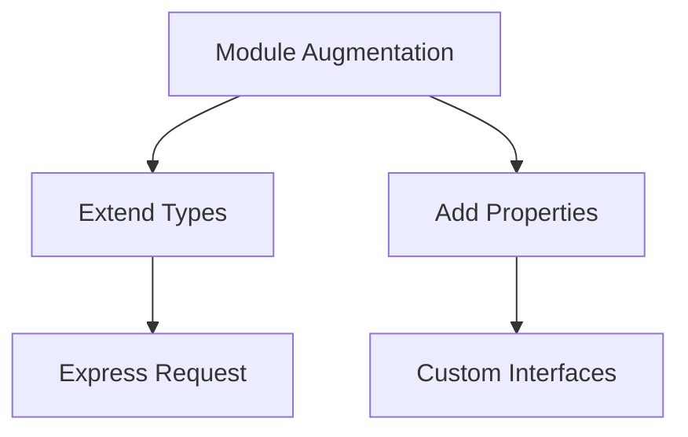

Error: API request failed with error: 401 Client Error: Unauthorized for url: https://openrouter.ai/api/v1/chat/completions

# <span style="color:#e67e22;">What we will learn in this post?</span>
<ul style='list-style-type: none; padding-left: 0;'>
<li><span style='color: #2980b9; font-size: 20px; font-weight: bold;'>👉</span> <span style='color: #2ecc71; font-size: 18px; font-weight: bold;'>Using JavaScript Libraries in TypeScript</span></li>
<li><span style='color: #2980b9; font-size: 20px; font-weight: bold;'>👉</span> <span style='color: #2ecc71; font-size: 18px; font-weight: bold;'>Creating Declaration Files</span></li>
<li><span style='color: #2980b9; font-size: 20px; font-weight: bold;'>👉</span> <span style='color: #2ecc71; font-size: 18px; font-weight: bold;'>Module Augmentation and Declaration Merging</span></li>
<li><span style='color: #2980b9; font-size: 20px; font-weight: bold;'>👉</span> <span style='color: #2ecc71; font-size: 18px; font-weight: bold;'>TypeScript with React</span></li>
<li><span style='color: #2980b9; font-size: 20px; font-weight: bold;'>👉</span> <span style='color: #2ecc71; font-size: 18px; font-weight: bold;'>TypeScript with Node.js</span></li>
<li><span style='color: #2980b9; font-size: 20px; font-weight: bold;'>👉</span> <span style='color: #2ecc71; font-size: 18px; font-weight: bold;'>Working with Third-Party Type Definitions</span></li>
<li><span style='color: #2980b9; font-size: 20px; font-weight: bold;'>👉</span> <span style='color: #2ecc71; font-size: 18px; font-weight: bold;'>Gradual Migration from JavaScript</span></li>
</ul>

# <span style="color:#e67e22">Using JavaScript Libraries in TypeScript Projects</span> 🎉

TypeScript is a great way to add type safety to your JavaScript projects. Here’s how to use JavaScript libraries smoothly!

## <span style="color:#2980b9">Installing Type Definitions</span> 📦

When you use a JavaScript library, you might need type definitions to help TypeScript understand it. You can install these from the `@types` packages. For example:

```bash
npm install --save-dev @types/lodash
```

This command installs type definitions for the popular library **Lodash**.

## <span style="color:#2980b9">Checking DefinitelyTyped</span> 🔍

If you can’t find a type definition, check the [DefinitelyTyped repository](https://github.com/DefinitelyTyped/DefinitelyTyped). It’s a huge collection of type definitions for many libraries!

## <span style="color:#2980b9">Handling Libraries Without Types</span> ⚠️

Sometimes, a library might not have types. In this case, you can use the `any` type as a fallback:

```typescript
declare const myLibrary: any;
```

### <span style="color:#8e44ad">Creating Minimal Type Definitions</span> ✍️

If you want more control, create your own type definitions. Here’s a simple example:

```typescript
declare module 'my-library' {
  export function myFunction(param: string): number;
}
```

This way, you can define just what you need!

## <span style="color:#2980b9">Resources</span> 📚

- [TypeScript Documentation](https://www.typescriptlang.org/docs/)
- [DefinitelyTyped GitHub](https://github.com/DefinitelyTyped/DefinitelyTyped)

Using JavaScript libraries in TypeScript can be easy and fun! Happy coding! 🚀

# <span style="color:#e67e22">Creating Custom .d.ts Declaration Files</span> 🎉

When using untyped JavaScript libraries in TypeScript, you can create **custom declaration files** to help TypeScript understand them. Let's explore how to do this!

## <span style="color:#2980b9">Key Concepts</span>

### <span style="color:#8e44ad">1. Declare Module</span>

Use `declare module` to define types for a specific library. For example, if you have a library called `myLib`:

```typescript
declare module 'myLib' {
  export function myFunction(param: string): number;
}
```

### <span style="color:#8e44ad">2. Declare Global</span>

Use `declare global` to add types to the global scope. This is useful for plugins or global variables:

```typescript
declare global {
  interface Window {
    myGlobalVar: string;
  }
}
```

### <span style="color:#8e44ad">3. Ambient Declarations</span>

Ambient declarations are used to describe types that exist in the environment but are not defined in your code. For example, for jQuery plugins:

```typescript
declare module 'jquery' {
  interface JQuery {
    myPlugin(options?: any): JQuery;
  }
}
```

## <span style="color:#2980b9">Common Patterns</span>

- **jQuery Plugins**: Extend jQuery with custom methods.
- **Node.js Modules**: Define types for your Node.js modules.

### Example for Node.js Module

```typescript
declare module 'my-node-module' {
  export function myNodeFunction(): Promise<string>;
}
```

## <span style="color:#2980b9">Resources</span>

- [TypeScript Handbook](https://www.typescriptlang.org/docs/handbook/declaration-files/introduction.html)
- [DefinitelyTyped](https://github.com/DefinitelyTyped/DefinitelyTyped)

Creating declaration files helps you enjoy the benefits of TypeScript while using JavaScript libraries! Happy coding! 🚀

# <span style="color:#e67e22">Understanding Module Augmentation and Declaration Merging</span> 🌟

Module augmentation and declaration merging are powerful features in TypeScript that let you extend existing type definitions. This is super useful when you want to add new properties or methods to existing interfaces or namespaces without modifying the original code.

## <span style="color:#2980b9">What is Module Augmentation?</span> 🤔

Module augmentation allows you to add new types or properties to existing modules. For example, if you want to extend the Express `Request` object to include a custom property, you can do it like this:

```typescript
import * as express from 'express';

declare global {
  namespace Express {
    interface Request {
      user?: { id: string; name: string }; // Adding a user property
    }
  }
}
```

### <span style="color:#8e44ad">Use Case: Extending Express Request</span> 🚀

This is particularly handy when you want to attach user information to the request object in an Express app. Now, you can access `req.user` in your route handlers!

## <span style="color:#2980b9">What is Declaration Merging?</span> 🛠️

Declaration merging allows you to add properties to existing interfaces. For instance, if you have a custom interface for a user, you can merge it with another interface:

```typescript
interface User {
  id: string;
  name: string;
}

interface User {
  email: string; // Merging with a new property
}
```

### <span style="color:#8e44ad">Use Case: Adding Custom Properties</span> ✨

This is useful when you want to enhance existing types without creating new ones. You can keep your code clean and organized!

## <span style="color:#2980b9">Conclusion</span> 🎉

Module augmentation and declaration merging are great tools for customizing existing types in TypeScript. They help you keep your code flexible and maintainable. For more information, check out the [TypeScript Documentation](https://www.typescriptlang.org/docs/).



Happy coding! 😊

# <span style="color:#e67e22">Getting Started with TypeScript in React 🚀</span>

TypeScript enhances your React experience by adding **strong typing**. This helps catch errors early and improves code readability. Let’s explore how to type components, props, state, and more!

## <span style="color:#2980b9">Typing Components 🛠️</span>

### Functional Components

You can define a functional component using `React.FC` (Functional Component):

```typescript
import React from 'react';

interface Props {
  title: string;
}

const MyComponent: React.FC<Props> = ({ title }) => {
  return <h1>{title}</h1>;
};
```

### Class Components

For class components, extend `React.Component`:

```typescript
import React from 'react';

interface Props {
  title: string;
}

interface State {
  count: number;
}

class MyClassComponent extends React.Component<Props, State> {
  state: State = { count: 0 };

  render() {
    return <h1>{this.props.title} - {this.state.count}</h1>;
  }
}
```

## <span style="color:#2980b9">Typing Props and State 📦</span>

- **Props Interface**: Define the shape of props using interfaces.
- **State Types**: Specify state types in class components.

## <span style="color:#2980b9">Event Handlers and Refs 🎯</span>

Type event handlers easily:

```typescript
const handleClick = (event: React.MouseEvent<HTMLButtonElement>) => {
  console.log(event);
};
```

For refs, use `React.RefObject`:

```typescript
const myRef = React.useRef<HTMLDivElement>(null);
```

## <span style="color:#2980b9">JSX.Element vs ReactNode 🧩</span>

- **JSX.Element**: Represents a React element.
- **ReactNode**: Can be anything that can be rendered (strings, numbers, elements, etc.).

## <span style="color:#2980b9">Using Hooks with TypeScript 🔗</span>

When using hooks, type your state:

```typescript
const [count, setCount] = React.useState<number>(0);
```

### Resources for More Information 📚

- [TypeScript Documentation](https://www.typescriptlang.org/docs/)
- [React TypeScript Cheatsheet](https://react-typescript-cheatsheet.netlify.app/)

By using TypeScript with React, you can build robust applications with confidence! Happy coding! 🎉

# <span style="color:#e67e22">Setting Up TypeScript for Node.js Projects 🚀</span>

## <span style="color:#2980b9">Getting Started with TypeScript</span>

To set up TypeScript in your Node.js project, follow these simple steps:

1. **Initialize your project**:
   ```bash
   npm init -y
   ```

2. **Install TypeScript**:
   ```bash
   npm install typescript --save-dev
   ```

3. **Create a `tsconfig.json` file**:
   Run this command to generate a basic configuration:
   ```bash
   npx tsc --init
   ```

## <span style="color:#2980b9">Installing Node Types 🌐</span>

To use Node.js APIs with TypeScript, install the type definitions:

```bash
npm install @types/node --save-dev
```

## <span style="color:#2980b9">Configuring Modules 📦</span>

You can choose between **CommonJS** or **ES Modules** in your `tsconfig.json`:

- For **CommonJS**:
  ```json
  "module": "commonjs"
  ```

- For **ES Modules**:
  ```json
  "module": "esnext"
  ```

## <span style="color:#2980b9">Using ts-node for Development 🛠️</span>

For a smoother development experience, use `ts-node`:

```bash
npm install ts-node --save-dev
```

Run your TypeScript files directly:
```bash
npx ts-node src/index.ts
```

## <span style="color:#2980b9">Typing Node.js APIs 📝</span>

You can easily type Node.js APIs like `fs`, `http`, and `process`. Here’s an example using `fs`:

```typescript
import * as fs from 'fs';

fs.readFile('file.txt', 'utf8', (err, data) => {
  if (err) throw err;
  console.log(data);
});
```

### <span style="color:#8e44ad">Express.js Typing Example</span>

To use Express with TypeScript, install the types:

```bash
npm install express @types/express --save
```

Here’s a simple Express server:

```typescript
import express, { Request, Response } from 'express';

const app = express();

app.get('/', (req: Request, res: Response) => {
  res.send('Hello, TypeScript with Express!');
});

app.listen(3000, () => {
  console.log('Server is running on http://localhost:3000');
});
```

## <span style="color:#2980b9">Resources 📚</span>

- [TypeScript Documentation](https://www.typescriptlang.org/docs/)
- [Node.js Documentation](https://nodejs.org/en/docs/)
- [Express.js Documentation](https://expressjs.com/)

Happy coding! 🎉

# <span style="color:#e67e22">Best Practices for Using @types Packages</span>

Using `@types` packages can enhance your TypeScript experience. Here are some friendly tips to help you navigate them!

## <span style="color:#2980b9">Understanding Type Definition Versions</span>

- **Stay Updated**: Always check for the latest version of `@types` packages. Use `npm outdated` to see if updates are available.
- **Version Compatibility**: Ensure the version of the `@types` package matches the library version you are using.

## <span style="color:#2980b9">Dealing with Type Definition Conflicts</span>

- **Check for Duplicates**: If you encounter conflicts, check if multiple `@types` packages are installed.
- **Use `--save-dev`**: Install type definitions as dev dependencies to avoid conflicts in production.

### <span style="color:#8e44ad">Using `skipLibCheck` Option</span>

- **What is it?**: The `skipLibCheck` option in `tsconfig.json` can speed up compilation by skipping type checks on declaration files.
- **When to Use**: Use it when you trust the types in your libraries and want faster builds.

```json
{
  "compilerOptions": {
    "skipLibCheck": true
  }
}
```

## <span style="color:#2980b9">Reporting Issues & Contributing to DefinitelyTyped</span>

- **Report Issues**: If you find a bug, report it on the [DefinitelyTyped GitHub](https://github.com/DefinitelyTyped/DefinitelyTyped/issues).
- **Contribute**: Want to help? Fork the repo, make your changes, and submit a pull request!

### <span style="color:#8e44ad">Resources</span>

- [TypeScript Documentation](https://www.typescriptlang.org/docs/)
- [DefinitelyTyped GitHub](https://github.com/DefinitelyTyped/DefinitelyTyped)

By following these tips, you can make the most of `@types` packages and enjoy a smoother TypeScript experience! 😊

# <span style="color:#e67e22">Migrating JavaScript Projects to TypeScript 🚀</span>

Migrating your JavaScript projects to TypeScript can be a smooth journey if you take it step by step. Here are some friendly strategies to help you along the way!

## <span style="color:#2980b9">1. Rename Your Files 🗂️</span>

Start by renaming your `.js` files to `.ts`. This simple change tells TypeScript to start checking your code. 

### <span style="color:#8e44ad">2. Use `allowJs` and `checkJs` Options ⚙️</span>

In your `tsconfig.json`, enable `allowJs` to let TypeScript handle JavaScript files. Use `checkJs` to check for errors in your JavaScript files. This way, you can gradually introduce TypeScript without breaking everything at once.

```json
{
  "compilerOptions": {
    "allowJs": true,
    "checkJs": true
  }
}
```

## <span style="color:#2980b9">3. Add Type Annotations Gradually ✍️</span>

You don’t need to annotate everything at once! Start with the most important parts of your code. Adding types incrementally helps you learn and adapt without feeling overwhelmed.

## <span style="color:#2980b9">4. Use `// @ts-ignore` or `// @ts-expect-error` for Temporary Suppressions 🚧</span>

If you encounter errors that you want to ignore temporarily, use `// @ts-ignore` or `// @ts-expect-error`. This allows you to keep moving forward while you plan a proper fix later.

```javascript
// @ts-ignore
const value = someUndefinedFunction();
```

### <span style="color:#8e44ad">Resources for More Info 📚</span>

- [TypeScript Handbook](https://www.typescriptlang.org/docs/handbook/intro.html)
- [Migrating to TypeScript](https://www.typescriptlang.org/docs/handbook/migrating-from-javascript.html)

By following these strategies, you can make your migration to TypeScript a friendly and enjoyable experience! Happy coding! 🎉

