<!--
meta-description: "Comprehensive guide to working with JavaScript libraries in TypeScript, covering type definitions installation, custom .d.ts declaration files, module augmentation, declaration merging, TypeScript with React and Node.js, @types packages best practices, and gradual JavaScript to TypeScript migration strategies."
keywords: "TypeScript JavaScript libraries, type definitions, @types packages, declaration files, .d.ts files, module augmentation, declaration merging, TypeScript React, TypeScript Node.js, JavaScript migration, DefinitelyTyped, ts-node, TypeScript integration"
-->

# <span style="color:#e67e22;">What we will learn in this post?</span>
<ul style='list-style-type: none; padding-left: 0;'>
<li><span style='color: #2980b9; font-size: 20px; font-weight: bold;'>👉</span> <span style='color: #2ecc71; font-size: 18px; font-weight: bold;'>Using JavaScript Libraries in TypeScript</span></li>
<li><span style='color: #2980b9; font-size: 20px; font-weight: bold;'>👉</span> <span style='color: #2ecc71; font-size: 18px; font-weight: bold;'>Creating Declaration Files</span></li>
<li><span style='color: #2980b9; font-size: 20px; font-weight: bold;'>👉</span> <span style='color: #2ecc71; font-size: 18px; font-weight: bold;'>Module Augmentation and Declaration Merging</span></li>
<li><span style='color: #2980b9; font-size: 20px; font-weight: bold;'>👉</span> <span style='color: #2ecc71; font-size: 18px; font-weight: bold;'>TypeScript with React</span></li>
<li><span style='color: #2980b9; font-size: 20px; font-weight: bold;'>👉</span> <span style='color: #2ecc71; font-size: 18px; font-weight: bold;'>TypeScript with Node.js</span></li>
<li><span style='color: #2980b9; font-size: 20px; font-weight: bold;'>👉</span> <span style='color: #2ecc71; font-size: 18px; font-weight: bold;'>Working with Third-Party Type Definitions</span></li>
<li><span style='color: #2980b9; font-size: 20px; font-weight: bold;'>👉</span> <span style='color: #2ecc71; font-size: 18px; font-weight: bold;'>Gradual Migration from JavaScript</span></li>
</ul>

# <span style="color:#e67e22">Using JavaScript Libraries in TypeScript Projects</span> 🎉
Integrating JavaScript libraries with TypeScript is essential for leveraging the vast npm ecosystem while maintaining type safety. Understanding type definitions and declaration files ensures your projects remain robust and maintainable in production environments.
TypeScript is a great way to add type safety to your JavaScript projects. Here’s how to use JavaScript libraries smoothly!

## <span style="color:#2980b9">Installing Type Definitions</span> 📦

When you use a JavaScript library, you might need type definitions to help TypeScript understand it. You can install these from the `@types` packages. For example:

```bash
npm install --save-dev @types/lodash
```

This command installs type definitions for the popular library **Lodash**.

## <span style="color:#2980b9">Handling Libraries Without Types</span> ⚠️

Sometimes, a library might not have types. In this case, you can use the `any` type as a fallback:

```typescript
declare const myLibrary: any;
```

### <span style="color:#8e44ad">Creating Minimal Type Definitions</span> ✍️

If you want more control, create your own type definitions. Here’s a simple example:

```typescript
declare module 'my-library' {
  export function myFunction(param: string): number;
}
```

This way, you can define just what you need!

### <span style="color:#8e44ad">@types vs Custom .d.ts: When to Use Each</span>

| Aspect | @types Packages | Custom .d.ts Files |
|--------|----------------|--------------------|
| **Setup Time** | ⚡ Instant - just `npm install` | 🛠️ Manual - requires writing definitions |
| **Maintenance** | ✅ Community maintained | 🔧 You maintain |
| **Coverage** | 📦 Full library coverage | 🎯 Only what you need |
| **Quality** | ⭐ Professional, tested | 🎨 Depends on your effort |
| **Best For** | Popular libraries (lodash, axios, express) | Legacy/proprietary/internal libraries |
| **Version Sync** | 🔄 May lag behind library updates | 🚀 Update anytime |
| **Type Accuracy** | 📚 Comprehensive | 🎪 Can be minimal/focused |

```mermaid
graph TD
  A["🤔 Need Types for Library?"]:::style1 --> B{"📦 @types Available?"}:::style2
  B -- "Yes" --> C["⚡ Install @types Package"]:::style3
  B -- "No" --> D{"🔍 Library Complexity?"}:::style2
  D -- "Simple" --> E["✍️ Write Minimal .d.ts"]:::style4
  D -- "Complex" --> F["🛠️ Create Comprehensive .d.ts"]:::style5
  C --> G["✅ Start Coding!"]:::style3
  E --> G
  F --> G

  classDef style1 fill:#ff4f81,stroke:#c43e3e,color:#fff,font-size:16px,stroke-width:3px,rx:14,shadow:6px;
  classDef style2 fill:#6b5bff,stroke:#4a3f6b,color:#fff,font-size:16px,stroke-width:3px,rx:14,shadow:6px;
  classDef style3 fill:#43e97b,stroke:#38f9d7,color:#fff,font-size:16px,stroke-width:3px,rx:14,shadow:6px;
  classDef style4 fill:#ffd700,stroke:#d99120,color:#222,font-size:16px,stroke-width:3px,rx:14,shadow:6px;
  classDef style5 fill:#ff9800,stroke:#f57c00,color:#fff,font-size:16px,stroke-width:3px,rx:14,shadow:6px;

  linkStyle default stroke:#e67e22,stroke-width:3px;
```



Using JavaScript libraries in TypeScript can be easy and fun! Happy coding! 🚀

# <span style="color:#e67e22">Creating Custom .d.ts Declaration Files</span> 🎉

Creating custom declaration files empowers you to add type safety to any JavaScript library, even those without official type definitions. This skill is crucial for teams working with legacy code or proprietary libraries.

When using untyped JavaScript libraries in TypeScript, you can create **custom declaration files** to help TypeScript understand them. Let's explore how to do this!

## <span style="color:#2980b9">Key Concepts</span>

### <span style="color:#8e44ad">1. Declare Module</span>

Use `declare module` to define types for a specific library. For example, if you have a library called `myLib`:

```typescript
declare module 'myLib' {
  export function myFunction(param: string): number;
}
```

### <span style="color:#8e44ad">2. Declare Global</span>

Use `declare global` to add types to the global scope. This is useful for plugins or global variables:

```typescript
declare global {
  interface Window {
    myGlobalVar: string;
  }
}
```

### <span style="color:#8e44ad">3. Ambient Declarations</span>

Ambient declarations are used to describe types that exist in the environment but are not defined in your code. For example, for jQuery plugins:

```typescript
declare module 'jquery' {
  interface JQuery {
    myPlugin(options?: any): JQuery;
  }
}
```

## <span style="color:#2980b9">Common Patterns</span>

- **jQuery Plugins**: Extend jQuery with custom methods.
- **Node.js Modules**: Define types for your Node.js modules.

### Example for Node.js Module

```typescript
declare module 'my-node-module' {
  export function myNodeFunction(): Promise<string>;
}
```

Creating declaration files helps you enjoy the benefits of TypeScript while using JavaScript libraries! Happy coding! 🚀

# <span style="color:#e67e22">Understanding Module Augmentation and Declaration Merging</span> 🌟

Module augmentation and declaration merging are powerful features in TypeScript that let you extend existing type definitions. This is super useful when you want to add new properties or methods to existing interfaces or namespaces without modifying the original code.

## <span style="color:#2980b9">What is Module Augmentation?</span> 🤔

Module augmentation allows you to add new types or properties to existing modules. For example, if you want to extend the Express `Request` object to include a custom property, you can do it like this:

```typescript
import * as express from 'express';

declare global {
  namespace Express {
    interface Request {
      user?: { id: string; name: string }; // Adding a user property
    }
  }
}
```

### <span style="color:#8e44ad">Use Case: Extending Express Request</span> 🚀

This is particularly handy when you want to attach user information to the request object in an Express app. Now, you can access `req.user` in your route handlers!

## <span style="color:#2980b9">What is Declaration Merging?</span> 🛠️

Declaration merging allows you to add properties to existing interfaces. For instance, if you have a custom interface for a user, you can merge it with another interface:

```typescript
interface User {
  id: string;
  name: string;
}

interface User {
  email: string; // Merging with a new property
}
```

### <span style="color:#8e44ad">Use Case: Adding Custom Properties</span> ✨

This is useful when you want to enhance existing types without creating new ones. You can keep your code clean and organized!

## <span style="color:#2980b9">Conclusion</span> 🎉

Module augmentation and declaration merging are great tools for customizing existing types in TypeScript. They help you keep your code flexible and maintainable.

```mermaid
graph LR
  A["🔧 Module Augmentation"]:::style1 --> B["📦 Extend Types"]:::style2
  A --> C["➕ Add Properties"]:::style3
  B --> D["🚀 Express Request"]:::style4
  C --> E["✨ Custom Interfaces"]:::style5

  classDef style1 fill:#ff4f81,stroke:#c43e3e,color:#fff,font-size:16px,stroke-width:3px,rx:14,shadow:6px;
  classDef style2 fill:#6b5bff,stroke:#4a3f6b,color:#fff,font-size:16px,stroke-width:3px,rx:14,shadow:6px;
  classDef style3 fill:#ffd700,stroke:#d99120,color:#222,font-size:16px,stroke-width:3px,rx:14,shadow:6px;
  classDef style4 fill:#00bfae,stroke:#005f99,color:#fff,font-size:16px,stroke-width:3px,rx:14,shadow:6px;
  classDef style5 fill:#ff9800,stroke:#f57c00,color:#fff,font-size:16px,stroke-width:3px,rx:14,shadow:6px;

  linkStyle default stroke:#e67e22,stroke-width:3px;
```


Happy coding! 😊

# <span style="color:#e67e22">Getting Started with TypeScript in React 🚀</span>

TypeScript enhances your React experience by adding **strong typing**. This helps catch errors early and improves code readability. Let’s explore how to type components, props, state, and more!

## <span style="color:#2980b9">Typing Components 🛠️</span>

### Functional Components

You can define a functional component using `React.FC` (Functional Component):

```typescript
import React from 'react';

interface Props {
  title: string;
}

const MyComponent: React.FC<Props> = ({ title }) => {
  return <h1>{title}</h1>;
};
```

### Class Components

For class components, extend `React.Component`:

```typescript
import React from 'react';

interface Props {
  title: string;
}

interface State {
  count: number;
}

class MyClassComponent extends React.Component<Props, State> {
  state: State = { count: 0 };

  render() {
    return <h1>{this.props.title} - {this.state.count}</h1>;
  }
}
```

## <span style="color:#2980b9">Typing Props and State 📦</span>

- **Props Interface**: Define the shape of props using interfaces.
- **State Types**: Specify state types in class components.

## <span style="color:#2980b9">Event Handlers and Refs 🎯</span>

Type event handlers easily:

```typescript
const handleClick = (event: React.MouseEvent<HTMLButtonElement>) => {
  console.log(event);
};
```

For refs, use `React.RefObject`:

```typescript
const myRef = React.useRef<HTMLDivElement>(null);
```

## <span style="color:#2980b9">JSX.Element vs ReactNode 🧩</span>

- **JSX.Element**: Represents a React element.
- **ReactNode**: Can be anything that can be rendered (strings, numbers, elements, etc.).

## <span style="color:#2980b9">Using Hooks with TypeScript 🔗</span>

When using hooks, type your state:

```typescript
const [count, setCount] = React.useState<number>(0);
```

### <span style="color:#8e44ad">React Component Typing Approaches Comparison</span>

| Feature | React.FC | Function with Typed Props | Class Component |
|---------|----------|--------------------------|------------------|
| **Syntax** | `React.FC<Props>` | `(props: Props) => JSX.Element` | `extends React.Component<Props, State>` |
| **Children** | ✅ Implicit | ⚙️ Must declare in Props | ⚙️ Must declare in Props |
| **Return Type** | ✅ Enforced | ⚠️ Can forget | ✅ Enforced |
| **defaultProps** | ❌ Deprecated in React 18+ | ✅ Works well | ✅ Works well |
| **Community Preference** | 📉 Declining | 📈 Growing (Recommended) | 📊 Legacy/Complex state |
| **Best For** | Simple components (older code) | Modern functional components | Complex lifecycle needs |

```mermaid
graph TD
  A["🎨 React Component"]:::style1 --> B{"Need Lifecycle?"}:::style2
  B -- "Yes" --> C["🏛️ Class Component"]:::style3
  B -- "No" --> D["⚡ Functional Component"]:::style4
  D --> E{"Typing Style?"}:::style2
  E -- "Explicit Props" --> F["✨ Function with Props Type"]:::style5
  E -- "React.FC" --> G["📦 React.FC<Props>"]:::style6
  
  C --> H["Define Props & State"]:::style3
  F --> I["✅ Modern Recommended"]:::style5
  G --> J["⚠️ Legacy Pattern"]:::style6

  classDef style1 fill:#ff4f81,stroke:#c43e3e,color:#fff,font-size:16px,stroke-width:3px,rx:14,shadow:6px;
  classDef style2 fill:#6b5bff,stroke:#4a3f6b,color:#fff,font-size:16px,stroke-width:3px,rx:14,shadow:6px;
  classDef style3 fill:#ffd700,stroke:#d99120,color:#222,font-size:16px,stroke-width:3px,rx:14,shadow:6px;
  classDef style4 fill:#00bfae,stroke:#005f99,color:#fff,font-size:16px,stroke-width:3px,rx:14,shadow:6px;
  classDef style5 fill:#43e97b,stroke:#38f9d7,color:#fff,font-size:16px,stroke-width:3px,rx:14,shadow:6px;
  classDef style6 fill:#ff9800,stroke:#f57c00,color:#fff,font-size:16px,stroke-width:3px,rx:14,shadow:6px;

  linkStyle default stroke:#e67e22,stroke-width:3px;
```



By using TypeScript with React, you can build robust applications with confidence! Happy coding! 🎉

# <span style="color:#e67e22">Setting Up TypeScript for Node.js Projects 🚀</span>

## <span style="color:#2980b9">Getting Started with TypeScript</span>

To set up TypeScript in your Node.js project, follow these simple steps:

1. **Initialize your project**:
   ```bash
   npm init -y
   ```

2. **Install TypeScript**:
   ```bash
   npm install typescript --save-dev
   ```

3. **Create a `tsconfig.json` file**:
   Run this command to generate a basic configuration:
   ```bash
   npx tsc --init
   ```

## <span style="color:#2980b9">Installing Node Types 🌐</span>

To use Node.js APIs with TypeScript, install the type definitions:

```bash
npm install @types/node --save-dev
```

## <span style="color:#2980b9">Configuring Modules 📦</span>

You can choose between **CommonJS** or **ES Modules** in your `tsconfig.json`:

- For **CommonJS**:
  ```json
  "module": "commonjs"
  ```

- For **ES Modules**:
  ```json
  "module": "esnext"
  ```

### <span style="color:#8e44ad">CommonJS vs ES Modules in TypeScript</span>

| Aspect | CommonJS | ES Modules |
|--------|----------|------------|
| **Syntax** | `require()` / `module.exports` | `import` / `export` |
| **File Extension** | `.js` (or `.cjs`) | `.mjs` (or `.js` with `"type": "module"`) |
| **Node.js Support** | ✅ Native since beginning | ✅ Native since Node.js 12+ |
| **Dynamic Imports** | ✅ Synchronous | ⚡ Asynchronous |
| **Tree Shaking** | ❌ Limited | ✅ Excellent |
| **TypeScript Config** | `"module": "commonjs"` | `"module": "esnext"` or `"es2020"` |
| **Best For** | Legacy Node.js apps | Modern apps, better bundling |
| **Top-Level Await** | ❌ Not supported | ✅ Supported |

## <span style="color:#2980b9">Using ts-node for Development 🛠️</span>

For a smoother development experience, use `ts-node`:

```bash
npm install ts-node --save-dev
```

Run your TypeScript files directly:
```bash
npx ts-node src/index.ts
```

## <span style="color:#2980b9">Typing Node.js APIs 📝</span>

You can easily type Node.js APIs like `fs`, `http`, and `process`. Here’s an example using `fs`:

```typescript
import * as fs from 'fs';

fs.readFile('file.txt', 'utf8', (err, data) => {
  if (err) throw err;
  console.log(data);
});
```

### <span style="color:#8e44ad">Express.js Typing Example</span>

To use Express with TypeScript, install the types:

```bash
npm install express @types/express --save
```

Here’s a simple Express server:

```typescript
import express, { Request, Response } from 'express';

const app = express();

app.get('/', (req: Request, res: Response) => {
  res.send('Hello, TypeScript with Express!');
});

app.listen(3000, () => {
  console.log('Server is running on http://localhost:3000');
});
```

# <span style="color:#e67e22">Best Practices for Using @types Packages</span>

Using `@types` packages can enhance your TypeScript experience. Here are some friendly tips to help you navigate them!

## <span style="color:#2980b9">Understanding Type Definition Versions</span>

- **Stay Updated**: Always check for the latest version of `@types` packages. Use `npm outdated` to see if updates are available.
- **Version Compatibility**: Ensure the version of the `@types` package matches the library version you are using.

## <span style="color:#2980b9">Dealing with Type Definition Conflicts</span>

- **Check for Duplicates**: If you encounter conflicts, check if multiple `@types` packages are installed.
- **Use `--save-dev`**: Install type definitions as dev dependencies to avoid conflicts in production.

### <span style="color:#8e44ad">Using `skipLibCheck` Option</span>

- **What is it?**: The `skipLibCheck` option in `tsconfig.json` can speed up compilation by skipping type checks on declaration files.
- **When to Use**: Use it when you trust the types in your libraries and want faster builds.

```json
{
  "compilerOptions": {
    "skipLibCheck": true
  }
}
```

## <span style="color:#2980b9">Reporting Issues & Contributing to DefinitelyTyped</span>

- **Report Issues**: If you find a bug, report it on the [DefinitelyTyped GitHub](https://github.com/DefinitelyTyped/DefinitelyTyped/issues).
- **Contribute**: Want to help? Fork the repo, make your changes, and submit a pull request!

By following these tips, you can make the most of `@types` packages and enjoy a smoother TypeScript experience! 😊

# <span style="color:#e67e22">Migrating JavaScript Projects to TypeScript 🚀</span>

Migrating your JavaScript projects to TypeScript can be a smooth journey if you take it step by step. Here are some friendly strategies to help you along the way!

```mermaid
graph LR
  A["📂 JavaScript Project"]:::style1 --> B["⚙️ Add tsconfig.json"]:::style2
  B --> C["🔧 Enable allowJs"]:::style3
  C --> D["📝 Rename .js to .ts"]:::style4
  D --> E["✍️ Add Type Annotations"]:::style5
  E --> F["🧪 Fix Type Errors"]:::style6
  F --> G["✅ Fully Typed Project!"]:::style7
  
  D -.->|"Gradual"| H["🔄 Mix .js and .ts"]:::style3
  H -.-> E

  classDef style1 fill:#ff4f81,stroke:#c43e3e,color:#fff,font-size:16px,stroke-width:3px,rx:14,shadow:6px;
  classDef style2 fill:#6b5bff,stroke:#4a3f6b,color:#fff,font-size:16px,stroke-width:3px,rx:14,shadow:6px;
  classDef style3 fill:#ffd700,stroke:#d99120,color:#222,font-size:16px,stroke-width:3px,rx:14,shadow:6px;
  classDef style4 fill:#00bfae,stroke:#005f99,color:#fff,font-size:16px,stroke-width:3px,rx:14,shadow:6px;
  classDef style5 fill:#ff9800,stroke:#f57c00,color:#fff,font-size:16px,stroke-width:3px,rx:14,shadow:6px;
  classDef style6 fill:#e74c3c,stroke:#c0392b,color:#fff,font-size:16px,stroke-width:3px,rx:14,shadow:6px;
  classDef style7 fill:#43e97b,stroke:#38f9d7,color:#fff,font-size:16px,stroke-width:3px,rx:14,shadow:6px;

  linkStyle default stroke:#e67e22,stroke-width:3px;
  linkStyle 6,7 stroke:#95a5a6,stroke-width:2px,stroke-dasharray: 5 5;
```



## <span style="color:#2980b9">1. Rename Your Files 🗂️</span>

Start by renaming your `.js` files to `.ts`. This simple change tells TypeScript to start checking your code. 

### <span style="color:#8e44ad">2. Use `allowJs` and `checkJs` Options ⚙️</span>

In your `tsconfig.json`, enable `allowJs` to let TypeScript handle JavaScript files. Use `checkJs` to check for errors in your JavaScript files. This way, you can gradually introduce TypeScript without breaking everything at once.

```json
{
  "compilerOptions": {
    "allowJs": true,
    "checkJs": true
  }
}
```

## <span style="color:#2980b9">3. Add Type Annotations Gradually ✍️</span>

You don’t need to annotate everything at once! Start with the most important parts of your code. Adding types incrementally helps you learn and adapt without feeling overwhelmed.

## <span style="color:#2980b9">4. Use `// @ts-ignore` or `// @ts-expect-error` for Temporary Suppressions 🚧</span>

If you encounter errors that you want to ignore temporarily, use `// @ts-ignore` or `// @ts-expect-error`. This allows you to keep moving forward while you plan a proper fix later.

```javascript
// @ts-ignore
const value = someUndefinedFunction();
```

<details style='border: 2px solid #c43e3e; border-radius: 8px; padding: 20px; background: linear-gradient(135deg, #ffe6e6 0%, #fff 100%); margin: 25px 0; box-shadow: 0 6px 12px rgba(196, 62, 62, 0.15);'>
<summary style='cursor: pointer; font-size: 1.3em; font-weight: bold; color: #c43e3e; padding: 10px 0;'>
🎯 Hands-On Assignment: Build a Type-Safe Library Integration System 🚀
</summary>

<div style='margin-top: 20px; color: #2c3e50; line-height: 1.6;'>

<h3 style='color: #c43e3e; border-bottom: 2px solid #c43e3e; padding-bottom: 8px; margin-top: 20px;'>📝 Your Mission</h3>

Create a comprehensive TypeScript project that demonstrates integration with multiple JavaScript libraries, custom type definitions, and migration strategies. Build a real-world application that showcases proper typing patterns for React components, Node.js modules, and third-party libraries.

<h3 style='color: #c43e3e; border-bottom: 2px solid #c43e3e; padding-bottom: 8px; margin-top: 20px;'>🎯 Requirements</h3>

<ol style='margin-left: 20px;'>
<li><strong>Library Integration:</strong> Install and properly type at least 3 JavaScript libraries (e.g., lodash, axios, moment) using @types packages.</li>
<li><strong>Custom Declaration Files:</strong> Create .d.ts files for at least 2 untyped libraries with proper module declarations and ambient types.</li>
<li><strong>Module Augmentation:</strong> Extend Express Request object or similar library interface with custom properties using module augmentation.</li>
<li><strong>React Integration:</strong> Build typed React components with proper Props, State, event handlers, and hooks typing.</li>
<li><strong>Node.js Backend:</strong> Create a TypeScript Node.js server with typed Express routes, middleware, and API responses.</li>
<li><strong>Migration Strategy:</strong> Include a JavaScript file and demonstrate gradual migration using allowJs, checkJs, and incremental type annotations.</li>
<li><strong>Error Handling:</strong> Implement comprehensive error handling with typed error responses.</li>
</ol>

<h3 style='color: #c43e3e; border-bottom: 2px solid #c43e3e; padding-bottom: 8px; margin-top: 25px;'>💡 Implementation Hints</h3>

<ol style='margin-left: 20px;'>
<li>Use <code>npm install --save-dev @types/library-name</code> for type definitions</li>
<li>Create custom types in <code>types/</code> directory with proper module declarations</li>
<li>Use <code>declare global</code> for global augmentations and <code>declare module</code> for library extensions</li>
<li>Leverage <code>React.FC</code> for functional components and generic typing for hooks</li>
<li>Configure tsconfig.json with proper moduleResolution and type roots</li>
<li>Use <code>ts-node</code> for running TypeScript files directly during development</li>
</ol>

<h3 style='color: #c43e3e; border-bottom: 2px solid #c43e3e; padding-bottom: 8px; margin-top: 25px;'>🚀 Example Structure</h3>

<pre style='background: #2c3e50; color: #ecf0f1; padding: 20px; border-radius: 8px; overflow-x: auto; margin: 15px 0;'><code class='language-typescript'>// Custom declaration file: types/my-untyped-lib.d.ts
declare module 'my-untyped-lib' {
  export interface Config {
    apiKey: string;
    timeout: number;
  }
  
  export function initialize(config: Config): Promise<void>;
  export function getData<T>(endpoint: string): Promise<T>;
}

// Module augmentation: types/express.d.ts
import 'express';

declare global {
  namespace Express {
    interface Request {
      user?: {
        id: string;
        email: string;
        role: 'admin' | 'user';
      };
    }
  }
}

// Typed React component
import React, { useState } from 'react';

interface UserCardProps {
  name: string;
  email: string;
  onEdit?: (id: string) => void;
}

const UserCard: React.FC<UserCardProps> = ({ name, email, onEdit }) => {
  const [isEditing, setIsEditing] = useState<boolean>(false);
  
  const handleClick = (event: React.MouseEvent<HTMLButtonElement>) => {
    setIsEditing(!isEditing);
  };
  
  return (
    <div>
      <h2>{name}</h2>
      <p>{email}</p>
      <button onClick={handleClick}>Edit</button>
    </div>
  );
};
</code></pre>

<h3 style='color: #c43e3e; border-bottom: 2px solid #c43e3e; padding-bottom: 8px; margin-top: 25px;'>🏆 Bonus Challenges</h3>

<ul style='margin-left: 20px;'>
<li><strong>Generic Utilities:</strong> Create reusable generic utility types for API responses</li>
<li><strong>Advanced Patterns:</strong> Implement discriminated unions for different response types</li>
<li><strong>Testing:</strong> Add typed tests using Jest with @types/jest</li>
<li><strong>Documentation:</strong> Generate API documentation from TypeScript types using TypeDoc</li>
<li><strong>Linting:</strong> Configure ESLint with TypeScript-specific rules</li>
</ul>

<h3 style='color: #c43e3e; border-bottom: 2px solid #c43e3e; padding-bottom: 8px; margin-top: 25px;'>📚 Learning Goals</h3>

<ul style='margin-left: 20px;'>
<li>Master type definitions installation and usage 🎯</li>
<li>Create custom .d.ts declaration files for any library 📝</li>
<li>Apply module augmentation and declaration merging patterns ✨</li>
<li>Build type-safe React and Node.js applications 🚀</li>
<li>Implement gradual migration strategies from JavaScript 🔄</li>
<li>Configure TypeScript for optimal developer experience 🛠️</li>
</ul>

<p style='background: #3498db; color: #fff; padding: 15px; border-radius: 8px; margin-top: 20px; border-left: 5px solid #2980b9;'>
<strong>💡 Pro Tip:</strong> Major companies like Microsoft, Google, and Airbnb use these exact patterns for integrating TypeScript with their existing JavaScript codebases. Master these skills to work on enterprise-scale applications!
</p>

<p style='margin-top: 20px; font-size: 1.1em;'><strong>Share Your Solution! 💬</strong></p>
<p>Built your type-safe integration system? <strong>Post your repository link in the comments below!</strong> Show us your TypeScript integration expertise! 🚀✨</p>

</div>
</details>

## <span style="color:#e67e22">Conclusion</span>

Mastering TypeScript integration with JavaScript libraries is essential for modern web development, enabling you to leverage the vast npm ecosystem while maintaining type safety and code quality. By understanding type definitions, creating custom declaration files, and applying proper migration strategies, you'll build robust applications that scale with confidence. Start integrating TypeScript into your projects today and experience the benefits of static typing in the dynamic JavaScript world! 🚀

By following these strategies, you can make your migration to TypeScript a friendly and enjoyable experience! Happy coding! 🎉

