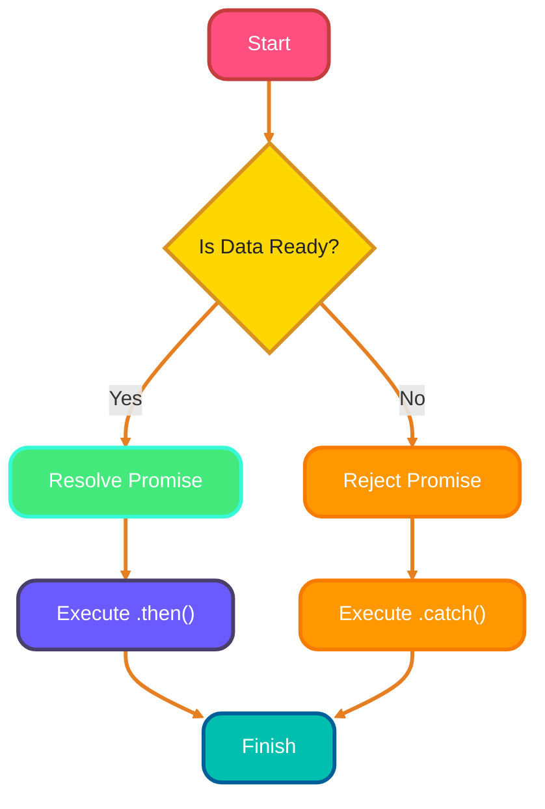

<!--
meta-description: "Master asynchronous programming in TypeScript with Promises, async/await, error handling patterns, and advanced techniques like AbortController and async iterators."
keywords: "TypeScript promises, async await typescript, typescript error handling, AbortController, async iterators, promise combinators"
-->

# <span style="color:#e67e22;">What we will learn in this post?</span>
<ul style='list-style-type: none; padding-left: 0;'>
<li><span style='color: #2980b9; font-size: 20px; font-weight: bold;'>👉</span> <span style='color: #2ecc71; font-size: 18px; font-weight: bold;'>Promises in TypeScript</span></li>
<li><span style='color: #2980b9; font-size: 20px; font-weight: bold;'>👉</span> <span style='color: #2ecc71; font-size: 18px; font-weight: bold;'>Async/Await Syntax</span></li>
<li><span style='color: #2980b9; font-size: 20px; font-weight: bold;'>👉</span> <span style='color: #2ecc71; font-size: 18px; font-weight: bold;'>Error Handling in Async Code</span></li>
<li><span style='color: #2980b9; font-size: 20px; font-weight: bold;'>👉</span> <span style='color: #2ecc71; font-size: 18px; font-weight: bold;'>Async Iteration and Generators</span></li>
<li><span style='color: #2980b9; font-size: 20px; font-weight: bold;'>👉</span> <span style='color: #2ecc71; font-size: 18px; font-weight: bold;'>Typing Callback Functions</span></li>
<li><span style='color: #2980b9; font-size: 20px; font-weight: bold;'>👉</span> <span style='color: #2ecc71; font-size: 18px; font-weight: bold;'>Promise Combinators and Utilities</span></li>
<li><span style='color: #2980b9; font-size: 20px; font-weight: bold;'>👉</span> <span style='color: #2ecc71; font-size: 18px; font-weight: bold;'>AbortController and Cancellation</span></li>
</ul>

# <span style="color:#e67e22">Understanding Promises in TypeScript</span> 🌟

## <span style="color:#2980b9">What are Promises?</span>

In TypeScript, a **Promise** is like a box that will eventually hold a value. You can think of it as a way to handle things that take time, like fetching data from a server. This prevents the dreaded "callback hell" and makes your code cleaner and easier to read. It's the standard for modern asynchronous JavaScript and TypeScript development. 

### <span style="color:#8e44ad">Typing Promises</span>

You can type a promise using `Promise<T>`, where `T` is the type of value you expect. For example:

```typescript
let myPromise: Promise<string> = new Promise((resolve, reject) => {
    // some async operation
});
```

## <span style="color:#2980b9">Chaining Promises</span> 🔗

You can chain promises using `.then()` and `.catch()`:

```typescript
myPromise
    .then(result => {
        console.log(result); // Handle success
    })
    .catch(error => {
        console.error(error); // Handle error
    });
```

### <span style="color:#8e44ad">Type Inference</span>

TypeScript can often infer the types in promise chains, making your code cleaner!

## <span style="color:#2980b9">Working with Multiple Promises</span> ⚡

- **`Promise.all()`**: Waits for all promises to resolve.
- **`Promise.race()`**: Resolves as soon as one promise resolves.

### <span style="color:#8e44ad">Typing Return Values</span>

You can type the return values of these methods too:

```typescript
let results: Promise<[string, number]> = Promise.all([promise1, promise2]);
```


Happy coding! 🎉

# <span style="color:#e67e22">Understanding Async/Await in TypeScript</span> 🌟

Async/await is a powerful way to handle asynchronous code in TypeScript

# <span style="color:#e67e22">Error Handling in Async TypeScript</span> 🚀

Handling errors in async TypeScript can be tricky, but with the right patterns, you can make your code robust and easy to maintain. Let's explore some friendly tips! 😊

## <span style="color:#2980b9">Understanding Error Types</span>

In TypeScript, you can create custom error classes to handle specific errors. This helps in identifying issues easily.

```typescript
class NotFoundError extends Error {
    constructor(message: string) {
        super(message);
        this.name = "NotFoundError";
    }
}
```

### <span style="color:#8e44ad">Using Try/Catch</span>

When working with async functions, use `try/catch` to handle errors gracefully.

```typescript
async function fetchData(url: string) {
    try {
        const response = await fetch(url);
        if (!response.ok) {
            throw new NotFoundError("Data not found!");
        }
        return await response.json();
    } catch (error) {
        console.error(error);
    }
}
```

## <span style="color:#2980b9">Promise Rejection Types</span>

TypeScript allows you to define the type of errors your promises might reject. This makes your error handling type-safe.

```typescript
type FetchError = NotFoundError | Error;

async function fetchDataWithErrorHandling(url: string): Promise<void | FetchError> {
    try {
        // Fetch logic...
    } catch (error) {
        return error as FetchError; // Type assertion
    }
}
```

## <span style="color:#2980b9">Creating Type-Safe Utilities</span>

You can create utility functions to handle errors consistently.

```typescript
function handleError(error: FetchError) {
    if (error instanceof NotFoundError) {
        console.error("Custom Error:", error.message);
    } else {
        console.error("General Error:", error);
    }
}
```

# <span style="color:#e67e22">Introduction to Async Iterators and Generators</span> 🌟

Async iterators and generators are powerful tools in JavaScript that help us work with data that arrives over time, like streaming data or large datasets. They allow us to handle data asynchronously, making our applications more efficient and responsive.

## <span style="color:#2980b9">What are Async Iterators? 🤔</span>

- **Async Iterators** let you iterate over data that is fetched asynchronously.
- They return an `AsyncIterableIterator<T>`, which can be used with `for await...of` loops.

### <span style="color:#8e44ad">Creating an Async Iterator</span>

Here’s a simple example of an async iterator that simulates fetching data:

```javascript
async function* fetchData() {
    for (let i = 1; i <= 5; i++) {
        await new Promise(resolve => setTimeout(resolve, 1000)); // Simulate delay
        yield i; // Yield data
    }
}
```

### <span style="color:#8e44ad">Consuming an Async Iterator</span>

You can consume this iterator using a `for await...of` loop:

```javascript
(async () => {
    for await (const value of fetchData()) {
        console.log(value); // Logs 1, 2, 3, 4, 5 with a delay
    }
})();
```

## <span style="color:#2980b9">Use Cases 🚀</span>

- **Streaming Data**: Handle real-time data like live feeds.
- **Pagination**: Fetch data in chunks, improving performance.
- **Processing Large Datasets**: Work with data that doesn’t fit in memory.

Async iterators and generators make it easier to work with data that comes in over time, keeping your applications smooth and efficient! 🌈

# <span style="color:#e67e22">Understanding Async Patterns in Node.js</span> 🚀

## <span style="color:#2980b9">Error-First Callbacks</span> ⚠️

In Node.js, we often use **error-first callbacks**. This means the first argument of the callback is an error (if any), and the second is the result. Here's a simple example using `setTimeout`:

```javascript
function delay(ms, callback) {
    setTimeout(() => {
        callback(null, `Waited for ${ms} milliseconds`);
    }, ms);
}

delay(1000, (err, result) => {
    if (err) {
        console.error(err);
    } else {
        console.log(result);
    }
});
```

## <span style="color:#2980b9">Converting Callbacks to Promises</span> 🔄

You can convert callback-based functions to promises using `util.promisify`. Here's how to do it with `fs.readFile`:

```javascript
const fs = require('fs');
const util = require('util');

const readFileAsync = util.promisify(fs.readFile);

readFileAsync('example.txt', 'utf8')
    .then(data => console.log(data))
    .catch(err => console.error(err));
```

### <span style="color:#8e44ad">Higher-Order Functions</span> 🏗️

You can create functions that accept callbacks. Here’s an example:

```javascript
function processFile(filePath, callback) {
    readFileAsync(filePath, 'utf8')
        .then(data => callback(null, data))
        .catch(err => callback(err));
}

processFile('example.txt', (err, data) => {
    if (err) {
        console.error(err);
    } else {
        console.log(data);
    }
});
```
# <span style="color:#e67e22">Understanding Promise Utility Methods</span> 🌟

JavaScript promises are powerful tools for handling asynchronous operations. Let's explore some useful promise utility methods: **`Promise.allSettled`**, **`Promise.any`**, **`Promise.resolve`**, and **`Promise.reject`**.

## <span style="color:#2980b9">1. Promise.allSettled</span> ✅

**What it does:**  
This method takes an array of promises and returns a promise that resolves after all of the given promises have either resolved or rejected.

**Return Type:**  
`Promise<Array<{status: string, value?: any, reason?: any}>>`

**When to use:**  
Use it when you want to know the outcome of all promises, regardless of whether they succeed or fail.

**Example:**
```javascript
const promises = [Promise.resolve(1), Promise.reject('Error'), Promise.resolve(3)];

Promise.allSettled(promises).then(results => {
  console.log(results);
});
```

## <span style="color:#2980b9">2. Promise.any</span> 🌈

**What it does:**  
This method takes an array of promises and returns a promise that resolves as soon as one of the promises in the array fulfills.

**Return Type:**  
`Promise<any>`

**When to use:**  
Use it when you want the first successful result from multiple promises.

**Example:**
```javascript
const promises = [Promise.reject('Error'), Promise.resolve(2), Promise.resolve(3)];

Promise.any(promises).then(result => {
  console.log(result); // Outputs: 2
});
```

## <span style="color:#2980b9">3. Promise.resolve</span> ✔️

**What it does:**  
This method returns a promise that is resolved with a given value.

**Return Type:**  
`Promise<T>`

**When to use:**  
Use it to create a resolved promise easily.

**Example:**
```javascript
const resolvedPromise = Promise.resolve('Success!');
resolvedPromise.then(value => console.log(value));
```

## <span style="color:#2980b9">4. Promise.reject</span> ❌

**What it does:**  
This method returns a promise that is rejected with a given reason.

**Return Type:**  
`Promise<T>`

**When to use:**  
Use it to create a rejected promise easily.

**Example:**
```javascript
const rejectedPromise = Promise.reject('Failed!');
rejectedPromise.catch(error => console.log(error));
```

### <span style="color:#8e44ad">Conclusion</span> 🎉

These promise utility methods help manage asynchronous operations effectively. Use them based on your needs for handling multiple promises, whether you want all results, the first success, or to create resolved or rejected promises.

# <span style="color:#e67e22">Using AbortController in TypeScript</span> 🚀

## <span style="color:#2980b9">What is AbortController?</span>

`AbortController` is a built-in JavaScript feature that helps you **cancel** ongoing async operations, like network requests. This is especially useful when you want to stop a fetch request if it takes too long or if the user navigates away.

### <span style="color:#8e44ad">Basic Usage</span>

Here's how to use it with the `fetch` API:

```typescript
const controller = new AbortController();
const signal = controller.signal;

fetch('https://api.example.com/data', { signal })
  .then(response => response.json())
  .then(data => console.log(data))
  .catch(err => {
    if (err.name === 'AbortError') {
      console.log('Fetch aborted!');
    } else {
      console.error('Fetch error:', err);
    }
  });

// Cancel the request after 5 seconds
setTimeout(() => controller.abort(), 5000);
```

## <span style="color:#2980b9">Custom Async Functions</span>

You can also use `AbortSignal` in your own async functions:

```typescript
async function fetchData(signal: AbortSignal) {
  // Your async logic here
}

const controller = new AbortController();
fetchData(controller.signal).catch(err => {
  if (err.name === 'AbortError') {
    console.log('Operation cancelled!');
  }
});
```

### <span style="color:#8e44ad">Timeout Pattern</span>

To implement a timeout, you can use `setTimeout` to call `abort()`:

```typescript
const timeout = setTimeout(() => controller.abort(), 3000);
```

### <span style="color:#8e44ad">Cleanup</span>

Always ensure to clear timeouts to avoid memory leaks:

```typescript
clearTimeout(timeout);
```

<details>
<summary style="cursor: pointer; font-size: 1.2em; font-weight: bold; color: #2980b9; background-color: #e7e9ebff; padding: 10px; border-radius: 5px; border: 1px solid #aed6f1;">
  🛠️ Hands-On Assignment: Build a Weather Dashboard
</summary>
<div style="margin-top: 15px; padding: 15px; border: 1px solid #ddccccff; border-radius: 8px; background-color: #863737ff;">
  <p><strong>Objective:</strong> Create a TypeScript application that fetches weather data for multiple cities concurrently.</p>
  <p><strong>Tasks:</strong></p>
  <ol>
    <li>Create an async function <code>getWeather(city: string)</code> that simulates an API call (use <code>setTimeout</code>).</li>
    <li>Use <code>Promise.all</code> to fetch data for "London", "New York", and "Tokyo" simultaneously.</li>
    <li>Handle potential errors (e.g., if one city fails) using <code>Promise.allSettled</code>.</li>
    <li>Implement a timeout using <code>AbortController</code> to cancel requests if they take longer than 2 seconds.</li>
  </ol>
  <p><strong>Challenge:</strong> Add a retry mechanism that attempts to fetch data 3 times before failing.</p>
</div>
</details>

<br/>

# <span style="color:#e67e22;">🧠 Interactive Quiz</span>

Test your understanding of TypeScript Async Programming!

{% include quiz.html
  question="1. What does `Promise.all` do?"
  options="Executes promises sequentially,Runs promises concurrently and rejects if any promise fails,Runs promises concurrently and waits for all to settle regardless of outcome,Cancels all promises if one finishes early"
  correct="1"
  explanation="`Promise.all` runs promises in parallel and rejects immediately if *any* of the input promises reject. Use `Promise.allSettled` if you want to wait for all of them regardless of success or failure."
%}









<br/>

# <span style="color:#e67e22;">Conclusion</span>

Mastering **Async Programming** in TypeScript is essential for building responsive and robust applications. We've covered:

*   **Promises**: The foundation of async operations.
*   **Async/Await**: Syntactic sugar for cleaner, readable code.
*   **Error Handling**: Using `try...catch` and `catch()` blocks.
*   **Advanced Patterns**: `Promise.all`, `Promise.race`, and `AbortController`.

Start applying these patterns in your projects today to handle data fetching, file operations, and timers efficiently! 🚀

