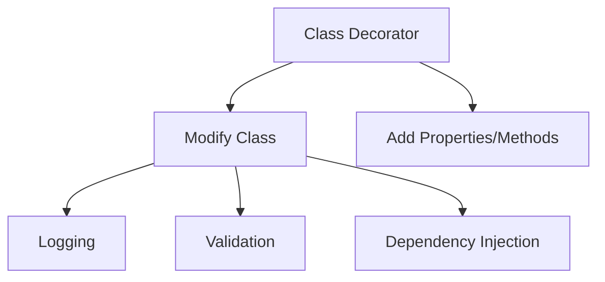
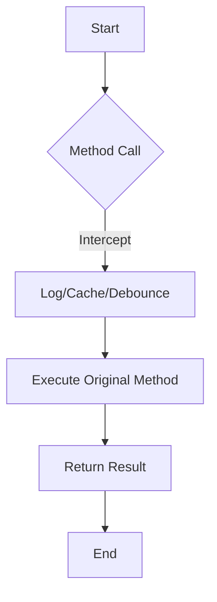
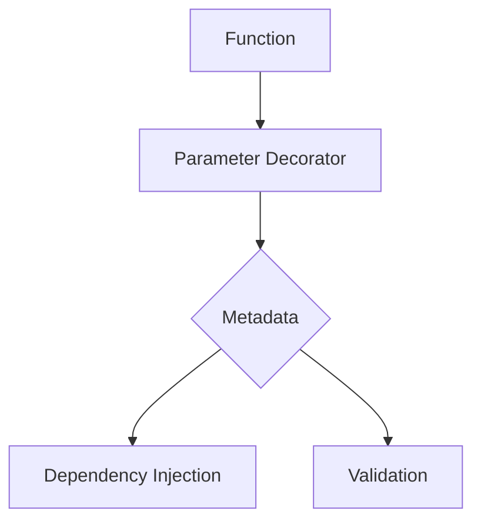
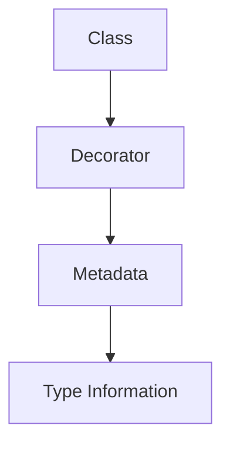

Error: API request failed with error: 401 Client Error: Unauthorized for url: https://openrouter.ai/api/v1/chat/completions

# <span style="color:#e67e22;">What we will learn in this post?</span>
<ul style='list-style-type: none; padding-left: 0;'>
<li><span style='color: #2980b9; font-size: 20px; font-weight: bold;'>👉</span> <span style='color: #2ecc71; font-size: 18px; font-weight: bold;'>Introduction to Decorators</span></li>
<li><span style='color: #2980b9; font-size: 20px; font-weight: bold;'>👉</span> <span style='color: #2ecc71; font-size: 18px; font-weight: bold;'>Class Decorators</span></li>
<li><span style='color: #2980b9; font-size: 20px; font-weight: bold;'>👉</span> <span style='color: #2ecc71; font-size: 18px; font-weight: bold;'>Method Decorators</span></li>
<li><span style='color: #2980b9; font-size: 20px; font-weight: bold;'>👉</span> <span style='color: #2ecc71; font-size: 18px; font-weight: bold;'>Property and Accessor Decorators</span></li>
<li><span style='color: #2980b9; font-size: 20px; font-weight: bold;'>👉</span> <span style='color: #2ecc71; font-size: 18px; font-weight: bold;'>Parameter Decorators</span></li>
<li><span style='color: #2980b9; font-size: 20px; font-weight: bold;'>👉</span> <span style='color: #2ecc71; font-size: 18px; font-weight: bold;'>Reflect Metadata API</span></li>
<li><span style='color: #2980b9; font-size: 20px; font-weight: bold;'>👉</span> <span style='color: #2ecc71; font-size: 18px; font-weight: bold;'>Decorator Composition and Factories</span></li>
</ul>

# <span style="color:#e67e22">Introduction to TypeScript Decorators</span> 🎉

TypeScript decorators are a powerful feature that allows you to add **annotations** and **metadata** to your classes, methods, properties, and parameters. They help you enhance your code in a clean and organized way!

## <span style="color:#2980b9">What is a Decorator? 🤔</span>

A decorator is a special kind of function that can modify the behavior of a class or its members. You use the `@` syntax to apply a decorator. For example:

```typescript
function MyDecorator(target: any, propertyKey: string, descriptor: PropertyDescriptor) {
    console.log(`Decorating ${propertyKey}`);
}
```

## <span style="color:#2980b9">Getting Started 🚀</span>

To use decorators, you need to enable `experimentalDecorators` in your `tsconfig.json`:

```json
{
  "compilerOptions": {
    "experimentalDecorators": true
  }
}
```

### <span style="color:#8e44ad">Decorator Evaluation Order 🔄</span>

Decorators are evaluated in the order they are defined. This means that if you have multiple decorators on a single method, the one closest to the method will be executed last.

## <span style="color:#2980b9">Basic Example 🛠️</span>

Here’s a simple example of a class with a method decorated:

```typescript
class Example {
    @MyDecorator
    greet() {
        console.log("Hello, World!");
    }
}
```

### <span style="color:#8e44ad">Learn More 📚</span>

For more information, check out the [TypeScript Decorators Documentation](https://www.typescriptlang.org/docs/handbook/decorators.html).

---

Feel free to explore the world of decorators and see how they can make your TypeScript code more elegant and powerful! 🌟

# <span style="color:#e67e22">Understanding Class Decorators in Python</span> 🎉

Class decorators are a powerful feature in Python that allow you to modify or replace class constructors. They can be used for various purposes like logging, validation, or dependency injection. Let’s break it down!

## <span style="color:#2980b9">What is a Class Decorator?</span> 🤔

A class decorator is a function that takes a class as an argument and returns a new class or modifies the existing one. This can be useful for adding properties or methods.

### <span style="color:#8e44ad">Creating a Simple Class Decorator</span> ✨

Here’s a basic example:

```python
def my_decorator(cls):
    cls.new_property = "Hello, World!"
    return cls

@my_decorator
class MyClass:
    pass

print(MyClass.new_property)  # Output: Hello, World!
```

## <span style="color:#2980b9">Decorator Factory Patterns</span> 🏭

You can also create decorator factories that accept arguments. This allows for more flexible decorators.

```python
def repeat(num_times):
    def decorator_repeat(func):
        def wrapper(*args, **kwargs):
            for _ in range(num_times):
                func(*args, **kwargs)
        return wrapper
    return decorator_repeat

@repeat(3)
def greet(name):
    print(f"Hello, {name}!")

greet("Alice")  # Prints "Hello, Alice!" three times
```

## <span style="color:#2980b9">Use Cases</span> 📚

- **Logging**: Track when classes are instantiated.
- **Validation**: Ensure certain conditions are met before creating an instance.
- **Dependency Injection**: Automatically provide dependencies to classes.

### <span style="color:#8e44ad">Conclusion</span> 🎯

Class decorators are a neat way to enhance your classes in Python. They can make your code cleaner and more maintainable. For more information, check out [Python Decorators](https://realpython.com/primer-on-python-decorators/).



Feel free to explore and experiment with class decorators in your projects! Happy coding! 😊

# <span style="color:#e67e22">Method Decorators in JavaScript</span> 🎉

Method decorators are a powerful way to modify how methods behave in JavaScript. They allow you to intercept method calls, change their behavior, or add extra information.

## <span style="color:#2980b9">What is a Decorator?</span> ✨

A decorator is a special kind of function that can wrap another function or method. This wrapping can be used to:

- **Log information** about method calls.
- **Cache results** for performance.
- **Debounce** calls to limit how often a method runs.

### <span style="color:#8e44ad">Using Decorators</span> 🛠️

Here’s how you can create a simple logging decorator:

```javascript
function log(target, key, descriptor) {
    const originalMethod = descriptor.value;
    descriptor.value = function(...args) {
        console.log(`Calling ${key} with`, args);
        return originalMethod.apply(this, args);
    };
    return descriptor;
}

class Example {
    @log
    greet(name) {
        return `Hello, ${name}!`;
    }
}

const example = new Example();
example.greet('Alice'); // Logs: Calling greet with [ 'Alice' ]
```

### <span style="color:#8e44ad">Common Use Cases</span> 📦

- **@log**: Track method calls.
- **@cache**: Store results for faster access.
- **@debounce**: Limit how often a method can be called.

### <span style="color:#2980b9">Descriptor Parameter</span> 📜

The `descriptor` parameter in decorators contains information about the method, including its value and how it can be modified.

For more details, check out [MDN Web Docs on Decorators](https://developer.mozilla.org/en-US/docs/Web/JavaScript/Reference/Global_Objects/Function/prototype).

### <span style="color:#2980b9">Flowchart of Decorator Usage</span> 🗺️



Decorators are a fun and useful way to enhance your methods in JavaScript! Happy coding! 😊

# <span style="color:#e67e22">Understanding Property Decorators and Accessor Decorators</span> 🌟

## <span style="color:#2980b9">What are Property Decorators?</span>

Property decorators are special tools in programming that let you add **metadata** to class properties. This means you can attach extra information or rules to your properties easily! For example, you might want to mark a property as **read-only** or add **validation** rules.

### <span style="color:#8e44ad">Example: @readonly Decorator</span>

```python
def readonly(func):
    def wrapper(*args):
        raise AttributeError("This property is read-only!")
    return property(wrapper)

class User:
    @readonly
    def name(self):
        return "Alice"
```

## <span style="color:#2980b9">Accessor Decorators for Get/Set Methods</span>

Accessor decorators help you manage how properties are accessed and modified. You can create **computed properties** or enforce **validation**.

### <span style="color:#8e44ad">Example: @validate Decorator</span>

```python
def validate(func):
    def wrapper(self, value):
        if value < 0:
            raise ValueError("Value must be positive!")
        return func(self, value)
    return property(fset=wrapper)

class Product:
    def __init__(self):
        self._price = 0

    @validate
    def price(self, value):
        self._price = value
```

## <span style="color:#2980b9">Integration with Frameworks</span>

Many frameworks, like **Django** or **Flask**, use decorators to simplify property management. They help in:

- **Validation** of user inputs
- **Computed properties** for dynamic data
- **Easier integration** with databases

For more detailed information, check out [Python Decorators](https://realpython.com/primer-on-python-decorators/) and [Django Decorators](https://docs.djangoproject.com/en/stable/topics/auth/default/#decorators).

---

Using property and accessor decorators can make your code cleaner and more efficient! Happy coding! 🎉

# <span style="color:#e67e22">Understanding Parameter Decorators</span> 🎉

Parameter decorators are special tools in programming that help us add extra information (metadata) to function parameters. This can be very useful in various frameworks, especially for **dependency injection** and **validation**.

## <span style="color:#2980b9">What are Parameter Decorators?</span> 🛠️

When you use a parameter decorator, you can attach metadata to a function's parameters. The decorator receives three important pieces of information:

- **target**: The class that contains the method.
- **propertyKey**: The name of the method.
- **parameterIndex**: The position of the parameter in the method.

### <span style="color:#8e44ad">Use Cases</span> 📚

- **Dependency Injection**: Helps in automatically providing the required dependencies to classes.
- **Validation Frameworks**: Ensures that the input data meets certain criteria before processing.

### <span style="color:#8e44ad">Limitations</span> ⚠️

- **Performance**: Adding too many decorators can slow down your application.
- **Complexity**: Can make the code harder to read and maintain.

### <span style="color:#8e44ad">Practical Applications</span> 💡

- **Frameworks**: Libraries like NestJS and Angular use parameter decorators extensively.
- **Custom Validation**: Create your own decorators to enforce rules on function parameters.

For more information, check out [TypeScript Decorators](https://www.typescriptlang.org/docs/handbook/decorators.html).



By using parameter decorators wisely, you can enhance your code's functionality while keeping it clean and organized! 😊

# <span style="color:#e67e22">Introduction to reflect-metadata</span> 🌟

The **reflect-metadata** library is a powerful tool for storing and retrieving metadata in decorators. It enhances JavaScript by allowing developers to attach additional information to classes, methods, and properties. This is especially useful in frameworks like Angular and NestJS, where metadata plays a crucial role in dependency injection and configuration.

## <span style="color:#2980b9">What is emitDecoratorMetadata?</span> 🔍

The `emitDecoratorMetadata` option in TypeScript enables the generation of metadata for class properties and methods. When this option is enabled, TypeScript automatically adds metadata about the types of parameters and return values, which can be accessed using the reflect-metadata library.

### <span style="color:#8e44ad">Key Metadata Types</span> 🗂️

- **design:type**: This metadata indicates the type of a class property.
- **design:paramtypes**: This provides an array of types for the parameters of a method.
- **design:returntype**: This shows the return type of a method.

### <span style="color:#2980b9">Use Cases in Angular and NestJS</span> 🚀

- **Angular**: In Angular, decorators like `@Injectable()` and `@Component()` use metadata to manage dependencies and component configurations.
- **NestJS**: In NestJS, decorators such as `@Controller()` and `@Get()` leverage metadata for routing and handling requests.

### <span style="color:#8e44ad">Conclusion</span> 🎉

Using reflect-metadata simplifies the management of metadata in your applications, making your code cleaner and more maintainable. For more information, check out the [official documentation](https://github.com/rbuckton/reflect-metadata).



By embracing reflect-metadata, you can unlock the full potential of decorators in your JavaScript applications!

# <span style="color:#e67e22">Understanding Decorator Factories in Python</span>

Decorators in Python are a powerful way to modify or enhance functions. But what if you want to create decorators that can take parameters? That's where **decorator factories** come in! 🎉

## <span style="color:#2980b9">What is a Decorator Factory?</span>

A **decorator factory** is a function that returns a decorator. This allows you to create configurable decorators that can accept arguments. For example, let’s create a simple `@timeout` decorator that takes a time limit in milliseconds:

```python
import time

def timeout(milliseconds):
    def decorator(func):
        def wrapper(*args, **kwargs):
            start_time = time.time()
            result = func(*args, **kwargs)
            elapsed_time = (time.time() - start_time) * 1000
            if elapsed_time > milliseconds:
                print(f"Function took too long! {elapsed_time:.2f} ms")
            return result
        return wrapper
    return decorator

@timeout(1000)
def slow_function():
    time.sleep(1.5)  # Simulates a slow function
```

### <span style="color:#8e44ad">Composing Multiple Decorators</span>

You can stack multiple decorators on a single function! The order of execution matters. The decorator closest to the function runs first. Here’s a quick example:

```python
@timeout(1000)
@another_decorator
def my_function():
    pass
```

### <span style="color:#8e44ad">Reusable Decorator Utilities</span>

Creating reusable decorators can save time and keep your code clean. You can create a library of decorators that can be used across different projects.

For more detailed information, check out [Python Decorators](https://realpython.com/primer-on-python-decorators/)!

### <span style="color:#2980b9">In Summary</span>

- **Decorator factories** allow parameterized decorators.
- You can compose multiple decorators.
- The execution order is from the innermost to the outermost.
- Reusable decorators enhance code efficiency.

Happy decorating! 🎈

