<!--
meta-description: "🎨 Master TypeScript decorators and metadata reflection. Learn class, method, property, and parameter decorators with reflect-metadata for building powerful frameworks and libraries. 🚀"
keywords: "TypeScript decorators, class decorators, method decorators, property decorators, parameter decorators, reflect-metadata, decorator factories, TypeScript metadata, experimentalDecorators, emitDecoratorMetadata, Angular decorators, NestJS decorators, decorator composition"
-->

# <span style="color:#e67e22;">What we will learn in this post?</span>
<ul style='list-style-type: none; padding-left: 0;'>
<li><span style='color: #2980b9; font-size: 20px; font-weight: bold;'>👉</span> <span style='color: #2ecc71; font-size: 18px; font-weight: bold;'>Introduction to Decorators</span></li>
<li><span style='color: #2980b9; font-size: 20px; font-weight: bold;'>👉</span> <span style='color: #2ecc71; font-size: 18px; font-weight: bold;'>Class Decorators</span></li>
<li><span style='color: #2980b9; font-size: 20px; font-weight: bold;'>👉</span> <span style='color: #2ecc71; font-size: 18px; font-weight: bold;'>Method Decorators</span></li>
<li><span style='color: #2980b9; font-size: 20px; font-weight: bold;'>👉</span> <span style='color: #2ecc71; font-size: 18px; font-weight: bold;'>Property and Accessor Decorators</span></li>
<li><span style='color: #2980b9; font-size: 20px; font-weight: bold;'>👉</span> <span style='color: #2ecc71; font-size: 18px; font-weight: bold;'>Parameter Decorators</span></li>
<li><span style='color: #2980b9; font-size: 20px; font-weight: bold;'>👉</span> <span style='color: #2ecc71; font-size: 18px; font-weight: bold;'>Reflect Metadata API</span></li>
<li><span style='color: #2980b9; font-size: 20px; font-weight: bold;'>👉</span> <span style='color: #2ecc71; font-size: 18px; font-weight: bold;'>Decorator Composition and Factories</span></li>
</ul>

# <span style="color:#e67e22">Introduction to TypeScript Decorators</span> 🎉

TypeScript decorators are a powerful feature that allows you to add **annotations** and **metadata** to your classes, methods, properties, and parameters. They help you enhance your code in a clean and organized way! They're the foundation of frameworks like Angular and NestJS.

## <span style="color:#2980b9">What is a Decorator? 🤔</span>

A decorator is a special kind of function that can modify the behavior of a class or its members. You use the `@` syntax to apply a decorator.

```typescript
function MyDecorator(target: any, propertyKey: string, descriptor: PropertyDescriptor) {
    console.log(`Decorating ${propertyKey}`);
}
```

## <span style="color:#2980b9">Getting Started 🚀</span>

To use decorators, you need to enable `experimentalDecorators` in your `tsconfig.json`:

```json
{
  "compilerOptions": {
    "experimentalDecorators": true,
    "emitDecoratorMetadata": true
  }
}
```

### <span style="color:#8e44ad">Decorator Evaluation Order 🔄</span>

Decorators are evaluated from bottom to top (closest to the declaration first), but executed from top to bottom.

```typescript
@first()
@second()
class Example {}
// Evaluates: second() then first()
// Executes: first's result, then second's result
```

# <span style="color:#e67e22">Understanding Class Decorators</span> 🎯

Class decorators are functions that take a class constructor as an argument and can modify or replace it. They're executed when the class is declared.

## <span style="color:#2980b9">Creating a Simple Class Decorator</span>

```typescript
function Sealed(constructor: Function) {
    Object.seal(constructor);
    Object.seal(constructor.prototype);
}

@Sealed
class BugReport {
    type = "report";
    title: string;
    
    constructor(t: string) {
        this.title = t;
    }
}
```

## <span style="color:#2980b9">Decorator Factory Patterns</span> 🏭

Decorator factories allow parameterized decorators:

```typescript
function Component(options: { selector: string; template: string }) {
    return function(constructor: Function) {
        constructor.prototype.selector = options.selector;
        constructor.prototype.template = options.template;
    };
}

@Component({ selector: 'app-root', template: '<h1>Hello</h1>' })
class AppComponent {}
```

### <span style="color:#2980b9">Class Decorator Flow</span>



# <span style="color:#e67e22">Method Decorators</span> ⚙️

```mermaid
flowchart TD
    A["🎯 Class Decorator"]:::style1 --> B["🔧 Modify Constructor"]:::style2
    A --> C["➕ Add Properties/Methods"]:::style3
    B --> D["📝 Logging"]:::style4
    B --> E["✅ Validation"]:::style5
    B --> F["💉 Dependency Injection"]:::style4

    classDef style1 fill:#ff4f81,stroke:#c43e3e,color:#fff,font-size:16px,stroke-width:3px,rx:14,shadow:6px;
    classDef style2 fill:#6b5bff,stroke:#4a3f6b,color:#fff,font-size:16px,stroke-width:3px,rx:14,shadow:6px;
    classDef style3 fill:#ffd700,stroke:#d99120,color:#222,font-size:16px,stroke-width:3px,rx:14,shadow:6px;
    classDef style4 fill:#00bfae,stroke:#005f99,color:#fff,font-size:16px,stroke-width:3px,rx:14,shadow:6px;
    classDef style5 fill:#ff9800,stroke:#f57c00,color:#fff,font-size:16px,stroke-width:3px,rx:14,shadow:6px;

    linkStyle default stroke:#e67e22,stroke-width:3px;
```

Method decorators intercept method calls and can modify behavior, log calls, or add caching.

## <span style="color:#2980b9">Creating Method Decorators</span>

```typescript
function Log(target: any, propertyKey: string, descriptor: PropertyDescriptor) {
    const originalMethod = descriptor.value;
    
    descriptor.value = function(...args: any[]) {
        console.log(`Calling ${propertyKey} with:`, args);
        const result = originalMethod.apply(this, args);
        console.log(`Result:`, result);
        return result;
    };
    
    return descriptor;
}

class Calculator {
    @Log
    add(a: number, b: number): number {
        return a + b;
    }
}
```

### <span style="color:#2980b9">Method Decorator Flow</span>



# <span style="color:#e67e22">Property and Accessor Decorators</span> 🔧

```mermaid
flowchart TD
    A["🚀 Start"]:::style1 --> B{"📞 Method Call"}:::style2
    B -->|Intercept| C["🔍 Log/Cache/Validate"]:::style3
    C --> D["⚡ Execute Original Method"]:::style4
    D --> E["📊 Return Result"]:::style5
    E --> F["✅ End"]:::style1

    classDef style1 fill:#ff4f81,stroke:#c43e3e,color:#fff,font-size:16px,stroke-width:3px,rx:14,shadow:6px;
    classDef style2 fill:#6b5bff,stroke:#4a3f6b,color:#fff,font-size:16px,stroke-width:3px,rx:14,shadow:6px;
    classDef style3 fill:#ffd700,stroke:#d99120,color:#222,font-size:16px,stroke-width:3px,rx:14,shadow:6px;
    classDef style4 fill:#00bfae,stroke:#005f99,color:#fff,font-size:16px,stroke-width:3px,rx:14,shadow:6px;
    classDef style5 fill:#ff9800,stroke:#f57c00,color:#fff,font-size:16px,stroke-width:3px,rx:14,shadow:6px;

    linkStyle default stroke:#e67e22,stroke-width:3px;
```

Property decorators add metadata to properties, while accessor decorators modify get/set behavior.

## <span style="color:#2980b9">Property Decorators</span>

```typescript
function Required(target: any, propertyKey: string) {
    let value: any;
    
    const getter = () => value;
    const setter = (newVal: any) => {
        if (!newVal) {
            throw new Error(`${propertyKey} is required`);
        }
        value = newVal;
    };
    
    Object.defineProperty(target, propertyKey, {
        get: getter,
        set: setter,
        enumerable: true,
        configurable: true
    });
}

class User {
    @Required
    name!: string;
}
```

## <span style="color:#2980b9">Accessor Decorators</span>

```typescript
function Validate(min: number, max: number) {
    return function(target: any, propertyKey: string, descriptor: PropertyDescriptor) {
        const originalSet = descriptor.set;
        
        descriptor.set = function(value: number) {
            if (value < min || value > max) {
                throw new Error(`${propertyKey} must be between ${min} and ${max}`);
            }
            originalSet?.call(this, value);
        };
    };
}

class Product {
    private _price: number = 0;
    
    @Validate(0, 10000)
    set price(value: number) {
        this._price = value;
    }
    
    get price(): number {
        return this._price;
    }
}
```

# <span style="color:#e67e22">Parameter Decorators</span> 📋

Parameter decorators attach metadata to function parameters, commonly used in dependency injection.

## <span style="color:#2980b9">Creating Parameter Decorators</span>

```typescript
function Inject(token: string) {
    return function(target: any, propertyKey: string, parameterIndex: number) {
        const existingParams = Reflect.getMetadata('design:paramtypes', target, propertyKey) || [];
        console.log(`Parameter ${parameterIndex} in ${propertyKey} needs ${token}`);
    };
}

class UserService {
    constructor(@Inject('Database') db: any) {}
}
```

### <span style="color:#2980b9">Parameter Decorator Flow</span>



# <span style="color:#e67e22">Reflect Metadata API</span> 🔍

```mermaid
flowchart TD
    A["⚡ Function"]:::style1 --> B["🎯 Parameter Decorator"]:::style2
    B --> C{"📦 Metadata"}:::style3
    C --> D["💉 Dependency Injection"]:::style4
    C --> E["✅ Validation"]:::style5

    classDef style1 fill:#ff4f81,stroke:#c43e3e,color:#fff,font-size:16px,stroke-width:3px,rx:14,shadow:6px;
    classDef style2 fill:#6b5bff,stroke:#4a3f6b,color:#fff,font-size:16px,stroke-width:3px,rx:14,shadow:6px;
    classDef style3 fill:#ffd700,stroke:#d99120,color:#222,font-size:16px,stroke-width:3px,rx:14,shadow:6px;
    classDef style4 fill:#00bfae,stroke:#005f99,color:#fff,font-size:16px,stroke-width:3px,rx:14,shadow:6px;
    classDef style5 fill:#ff9800,stroke:#f57c00,color:#fff,font-size:16px,stroke-width:3px,rx:14,shadow:6px;

    linkStyle default stroke:#e67e22,stroke-width:3px;
```

The `reflect-metadata` library enables storing and retrieving design-time type information at runtime.

## <span style="color:#2980b9">Setup</span>

```bash
npm install reflect-metadata
```

```typescript
import 'reflect-metadata';
```

## <span style="color:#2980b9">Key Metadata Types</span>

- **design:type**: Property type
- **design:paramtypes**: Parameter types array
- **design:returntype**: Return type

```typescript
class Point {
    x: number;
    y: number;
}

class Line {
    private _p0: Point;
    
    @validate
    set p0(value: Point) {
        this._p0 = value;
    }
}

function validate(target: any, propertyKey: string, descriptor: PropertyDescriptor) {
    let set = descriptor.set!;
    descriptor.set = function(value: any) {
        let type = Reflect.getMetadata("design:type", target, propertyKey);
        if (!(value instanceof type)) {
            throw new TypeError(`Invalid type, expected ${type.name}`);
        }
        set.call(this, value);
    };
}
```

### <span style="color:#2980b9">Metadata Flow</span>



# <span style="color:#e67e22">Decorator Factories and Composition</span> 🏗️

```mermaid
graph TD
    A["🎯 Class"]:::style1 --> B["🎨 Decorator"]:::style2
    B --> C["📦 Metadata"]:::style3
    C --> D["📊 Type Information"]:::style4

    classDef style1 fill:#ff4f81,stroke:#c43e3e,color:#fff,font-size:16px,stroke-width:3px,rx:14,shadow:6px;
    classDef style2 fill:#6b5bff,stroke:#4a3f6b,color:#fff,font-size:16px,stroke-width:3px,rx:14,shadow:6px;
    classDef style3 fill:#ffd700,stroke:#d99120,color:#222,font-size:16px,stroke-width:3px,rx:14,shadow:6px;
    classDef style4 fill:#00bfae,stroke:#005f99,color:#fff,font-size:16px,stroke-width:3px,rx:14,shadow:6px;

    linkStyle default stroke:#e67e22,stroke-width:3px;
```

Decorator factories return decorators, enabling parameterization and reusability.

## <span style="color:#2980b9">Decorator Factory Pattern</span>

```typescript
function Timeout(milliseconds: number) {
    return function(target: any, propertyKey: string, descriptor: PropertyDescriptor) {
        const originalMethod = descriptor.value;
        
        descriptor.value = async function(...args: any[]) {
            const timeout = new Promise((_, reject) => 
                setTimeout(() => reject(new Error('Timeout!')), milliseconds)
            );
            const result = Promise.resolve(originalMethod.apply(this, args));
            return Promise.race([result, timeout]);
        };
    };
}

class APIService {
    @Timeout(5000)
    async fetchData(url: string) {
        const response = await fetch(url);
        return response.json();
    }
}
```

## <span style="color:#2980b9">Composing Multiple Decorators</span>

```typescript
class UserService {
    @Log()
    @Cache(60000)
    @Timeout(5000)
    async getUser(id: string): Promise<User> {
        // Implementation
    }
}
```

# <span style="color:#e67e22">Real-World Examples 🌍</span>

## <span style="color:#2980b9">Example 1: API Rate Limiting Decorator 🚦</span>

```typescript
function RateLimit(maxCalls: number, windowMs: number) {
    const calls: number[] = [];
    
    return function(target: any, propertyKey: string, descriptor: PropertyDescriptor) {
        const originalMethod = descriptor.value;
        
        descriptor.value = async function(...args: any[]) {
            const now = Date.now();
            const recentCalls = calls.filter(time => now - time < windowMs);
            
            if (recentCalls.length >= maxCalls) {
                throw new Error(`Rate limit exceeded: ${maxCalls} calls per ${windowMs}ms`);
            }
            
            calls.push(now);
            return originalMethod.apply(this, args);
        };
    };
}

class PaymentService {
    @RateLimit(10, 60000) // 10 calls per minute
    async processPayment(amount: number, cardToken: string) {
        console.log(`Processing payment of $${amount}`);
        return { success: true, transactionId: Math.random().toString(36) };
    }
}
```

**Why This Matters:** Protects APIs from abuse and ensures fair resource usage.

## <span style="color:#2980b9">Example 2: DTO Validation Decorator 📋</span>

```typescript
function ValidateDTO(validationSchema: any) {
    return function(target: any, propertyKey: string, descriptor: PropertyDescriptor) {
        const originalMethod = descriptor.value;
        
        descriptor.value = function(...args: any[]) {
            const [dto] = args;
            
            for (const [key, rules] of Object.entries(validationSchema)) {
                const value = dto[key];
                const ruleSet = rules as any;
                
                if (ruleSet.required && !value) {
                    throw new Error(`${key} is required`);
                }
                if (ruleSet.minLength && value.length < ruleSet.minLength) {
                    throw new Error(`${key} must be at least ${ruleSet.minLength} characters`);
                }
                if (ruleSet.email && !/^[^\s@]+@[^\s@]+\.[^\s@]+$/.test(value)) {
                    throw new Error(`${key} must be a valid email`);
                }
            }
            
            return originalMethod.apply(this, args);
        };
    };
}

const userSchema = {
    email: { required: true, email: true },
    password: { required: true, minLength: 8 }
};

class UserController {
    @ValidateDTO(userSchema)
    createUser(userData: any) {
        return { id: 123, ...userData };
    }
}
```

**Why This Matters:** Ensures data integrity before processing, reducing bugs and vulnerabilities.

## <span style="color:#2980b9">Example 3: Performance Monitoring Decorator ⏱️</span>

```typescript
function Measure(target: any, propertyKey: string, descriptor: PropertyDescriptor) {
    const originalMethod = descriptor.value;
    
    descriptor.value = async function(...args: any[]) {
        const start = performance.now();
        
        try {
            const result = await originalMethod.apply(this, args);
            const duration = performance.now() - start;
            
            console.log(`⏱️ ${propertyKey} took ${duration.toFixed(2)}ms`);
            
            if (duration > 1000) {
                console.warn(`⚠️ Slow method: ${propertyKey}`);
            }
            
            return result;
        } catch (error) {
            const duration = performance.now() - start;
            console.error(`❌ ${propertyKey} failed after ${duration.toFixed(2)}ms`);
            throw error;
        }
    };
    
    return descriptor;
}

class DatabaseService {
    @Measure
    async fetchUsers(): Promise<any[]> {
        await new Promise(resolve => setTimeout(resolve, 150));
        return [{ id: 1, name: 'Alice' }];
    }
}
```

**Why This Matters:** Automatically tracks performance without manual instrumentation.

## 🧠 Test Your Knowledge











---

<details style='border: 2px solid #c43e3e; border-radius: 8px; padding: 20px; background: linear-gradient(135deg, #ffe6e6 0%, #fff 100%); margin: 25px 0; box-shadow: 0 6px 12px rgba(196, 62, 62, 0.15);'>
<summary style='cursor: pointer; font-size: 1.3em; font-weight: bold; color: #c43e3e; padding: 10px 0;'>
🎯 Hands-On Assignment: Build a Retry Decorator with Exponential Backoff 🚀
</summary>

<div style='margin-top: 20px; color: #2c3e50; line-height: 1.6;'>

<h3 style='color: #c43e3e; border-bottom: 2px solid #c43e3e; padding-bottom: 8px; margin-top: 20px;'>📝 Your Mission</h3>

Create a decorator factory that automatically retries failed async operations with exponential backoff, commonly used in network requests and external API integrations.

<h3 style='color: #c43e3e; border-bottom: 2px solid #c43e3e; padding-bottom: 8px; margin-top: 20px;'>🎯 Requirements</h3>

<ol style='margin-left: 20px;'>
<li>Create a <code>@Retry</code> decorator factory that accepts:
  <ul style='margin-left: 20px; margin-top: 8px;'>
    <li><code>maxAttempts</code>: Maximum number of retry attempts</li>
    <li><code>delayMs</code>: Initial delay in milliseconds</li>
    <li><code>backoffMultiplier</code>: Multiplier for exponential backoff (default 2)</li>
  </ul>
</li>
<li>On failure, wait <code>delayMs * (backoffMultiplier ^ attempt)</code> before retrying</li>
<li>Log each retry attempt with attempt number and delay</li>
<li>If all attempts fail, throw the last error</li>
<li>If successful before max attempts, return immediately</li>
</ol>

<h3 style='color: #c43e3e; border-bottom: 2px solid #c43e3e; padding-bottom: 8px; margin-top: 25px;'>💡 Implementation Hints</h3>

<ol style='margin-left: 20px;'>
<li>Use a <code>for</code> loop to track attempts</li>
<li>Wrap method call in <code>try-catch</code> to detect failures</li>
<li>Use <code>await new Promise(resolve => setTimeout(resolve, delay))</code> for delays</li>
<li>Calculate delay: <code>delayMs * Math.pow(backoffMultiplier, attempt)</code></li>
<li>Return immediately on success, continue loop on error</li>
</ol>

<h3 style='color: #c43e3e; border-bottom: 2px solid #c43e3e; padding-bottom: 8px; margin-top: 25px;'>🚀 Example Input/Output</h3>

<pre style='background: #2c3e50; color: #ecf0f1; padding: 20px; border-radius: 8px; overflow-x: auto; margin: 15px 0;'><code class='language-typescript'>class ExternalAPI {
    private callCount = 0;
    
    @Retry(3, 1000, 2) // 3 attempts, 1s initial delay, 2x backoff
    async unreliableCall(): Promise<string> {
        this.callCount++;
        if (this.callCount < 3) {
            throw new Error(`Attempt ${this.callCount} failed`);
        }
        return 'Success!';
    }
}

const api = new ExternalAPI();
const result = await api.unreliableCall();

// Console output:
// ❌ Attempt 1 failed, retrying in 1000ms...
// ❌ Attempt 2 failed, retrying in 2000ms...
// ✅ Success!
// result = 'Success!'
</code></pre>

<h3 style='color: #c43e3e; border-bottom: 2px solid #c43e3e; padding-bottom: 8px; margin-top: 25px;'>🏆 Bonus Challenges</h3>

<ul style='margin-left: 20px;'>
<li><strong>Level 2</strong>: Add a <code>retryOnErrors</code> parameter to only retry specific error types</li>
<li><strong>Level 3</strong>: Implement jitter (random delay variation) to prevent thundering herd</li>
<li><strong>Level 4</strong>: Add metrics tracking (total retries, success rate, average latency)</li>
<li><strong>Level 5</strong>: Create a circuit breaker pattern that stops retrying after consecutive failures</li>
</ul>

<h3 style='color: #c43e3e; border-bottom: 2px solid #c43e3e; padding-bottom: 8px; margin-top: 25px;'>📚 Learning Goals</h3>

<ul style='margin-left: 20px;'>
<li>Master decorator factory patterns with parameters 🎯</li>
<li>Handle async operations in decorators ✨</li>
<li>Implement exponential backoff algorithms 🔄</li>
<li>Practice error handling and retry logic 🔗</li>
<li>Build production-ready resilience patterns 🛠️</li>
</ul>

<p style='background: #3498db; color: #fff; padding: 15px; border-radius: 8px; margin-top: 20px; border-left: 5px solid #2980b9;'>
<strong>💡 Pro Tip:</strong> This pattern is used in AWS SDK, Axios retry, and Polly.js for resilient network calls!
</p>

<p style='margin-top: 20px; font-size: 1.1em;'><strong>Share Your Solution! 💬</strong></p>
<p>Completed the project? <strong>Post your code in the comments below!</strong> Show us your TypeScript decorator mastery! 🚀✨</p>

</div>
</details>

---

# <span style="color:#e67e22">Conclusion 🎓</span>

TypeScript decorators provide a powerful meta-programming capability for adding cross-cutting concerns like logging, validation, and caching to your code through clean, declarative syntax. Combined with reflect-metadata, they enable advanced patterns like dependency injection and ORM mapping used in frameworks like Angular, NestJS, and TypeORM.
