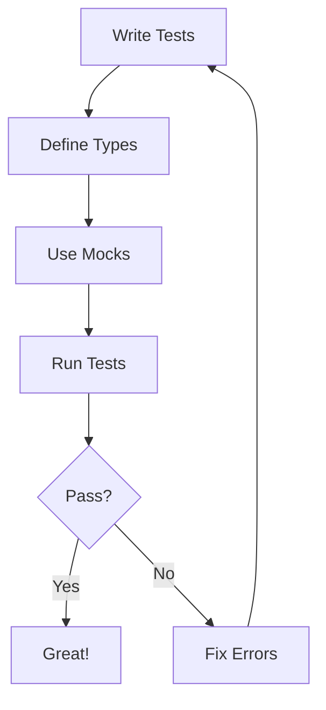
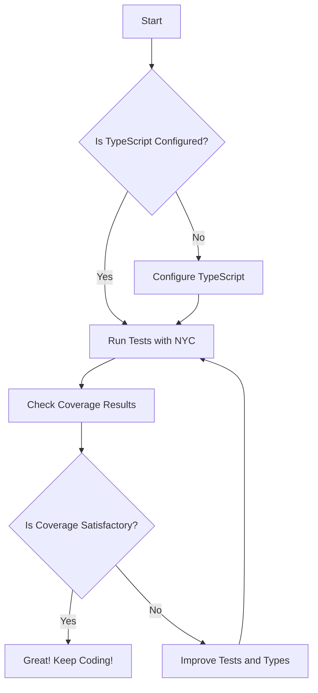

Error: API request failed with error: 401 Client Error: Unauthorized for url: https://openrouter.ai/api/v1/chat/completions

# <span style="color:#e67e22;">What we will learn in this post?</span>
<ul style='list-style-type: none; padding-left: 0;'>
<li><span style='color: #2980b9; font-size: 20px; font-weight: bold;'>👉</span> <span style='color: #2ecc71; font-size: 18px; font-weight: bold;'>Setting Up Testing Environment</span></li>
<li><span style='color: #2980b9; font-size: 20px; font-weight: bold;'>👉</span> <span style='color: #2ecc71; font-size: 18px; font-weight: bold;'>Writing Type-Safe Tests</span></li>
<li><span style='color: #2980b9; font-size: 20px; font-weight: bold;'>👉</span> <span style='color: #2ecc71; font-size: 18px; font-weight: bold;'>Mocking and Test Doubles</span></li>
<li><span style='color: #2980b9; font-size: 20px; font-weight: bold;'>👉</span> <span style='color: #2ecc71; font-size: 18px; font-weight: bold;'>Testing Async Code</span></li>
<li><span style='color: #2980b9; font-size: 20px; font-weight: bold;'>👉</span> <span style='color: #2ecc71; font-size: 18px; font-weight: bold;'>Testing Generics and Type Guards</span></li>
<li><span style='color: #2980b9; font-size: 20px; font-weight: bold;'>👉</span> <span style='color: #2ecc71; font-size: 18px; font-weight: bold;'>Code Coverage and Type Coverage</span></li>
<li><span style='color: #2980b9; font-size: 20px; font-weight: bold;'>👉</span> <span style='color: #2ecc71; font-size: 18px; font-weight: bold;'>E2E Testing with TypeScript</span></li>
</ul>

# <span style="color:#e67e22">Setting Up Testing Frameworks for TypeScript Projects</span> 🛠️

Testing your TypeScript projects is essential for ensuring code quality. Let’s explore how to set up popular testing frameworks like **Jest**, **Mocha**, and **Vitest**! 

## <span style="color:#2980b9">1. Installing the Framework</span> 📦

First, choose a testing framework. Here’s how to install **Jest**:

```bash
npm install --save-dev jest ts-jest @types/jest
```

For **Mocha**:

```bash
npm install --save-dev mocha @types/mocha ts-node
```

And for **Vitest**:

```bash
npm install --save-dev vitest @types/vitest
```

## <span style="color:#2980b9">2. Configuring TypeScript</span> ⚙️

### <span style="color:#8e44ad">Using ts-jest</span>

Create a `jest.config.js` file:

```javascript
module.exports = {
  preset: 'ts-jest',
  testEnvironment: 'node',
};
```

### <span style="color:#8e44ad">Using ts-node with Mocha</span>

You can run tests with:

```bash
mocha -r ts-node/register 'src/**/*.spec.ts'
```

## <span style="color:#2980b9">3. Setting Up Test Scripts</span> 📝

Add test scripts in your `package.json`:

```json
"scripts": {
  "test": "jest",
  "test:mocha": "mocha -r ts-node/register 'src/**/*.spec.ts'",
  "test:vitest": "vitest"
}
```

## <span style="color:#2980b9">4. Running Your Tests</span> 🚀

Now, run your tests with:

```bash
npm test
```

### Resources

- [Jest Documentation](https://jestjs.io/docs/getting-started)
- [Mocha Documentation](https://mochajs.org/)
- [Vitest Documentation](https://vitest.dev/)

With these steps, you’re all set to write and run tests in your TypeScript projects! Happy coding! 🎉

# <span style="color:#e67e22">Writing Type-Safe Unit Tests in TypeScript</span> 🧪

Type-safe unit tests help catch errors early and improve code quality. Here’s how to write them effectively using **Jest** or **Vitest**.

## <span style="color:#2980b9">Why Type Safety Matters</span> 🔍

- **Catch Errors Early**: TypeScript helps identify issues before runtime.
- **Better Documentation**: Types serve as documentation for your code.

## <span style="color:#2980b9">Typing Test Fixtures and Mocks</span> 🛠️

Use interfaces to define your test data:

```typescript
interface User {
  id: number;
  name: string;
}

const mockUser: User = { id: 1, name: "Alice" };
```

## <span style="color:#2980b9">Using Assertion Libraries with Type Inference</span> ✅

With Jest or Vitest, you can use type-safe assertions:

```typescript
import { expect } from 'vitest';

expect(mockUser.name).toBe("Alice");
```

## <span style="color:#2980b9">Avoiding Type Assertions</span> 🚫

Instead of using `as`, rely on TypeScript's inference:

```typescript
const result = getUser(); // TypeScript infers the type
expect(result).toEqual(mockUser);
```

## <span style="color:#2980b9">Benefits of Type Checking in Tests</span> 🌟

- **Improved Reliability**: Fewer runtime errors.
- **Easier Refactoring**: Changes are safer and easier to manage.

For more on TypeScript testing, check out [TypeScript Testing Guide](https://www.typescriptlang.org/docs/handbook/testing.html).

### Flowchart: Type-Safe Testing Process



By following these practices, you can ensure your tests are type-safe and maintainable! Happy testing! 🎉

# <span style="color:#e67e22">Creating Type-Safe Mocks, Stubs, and Spies in TypeScript</span>

Mocking in TypeScript can be a breeze! Let’s dive into how to create **type-safe mocks**, **stubs**, and **spies** using Jest and libraries like ts-mockito. 🎉

## <span style="color:#2980b9">Understanding Mocks, Stubs, and Spies</span>

- **Mocks**: Fake implementations of functions or objects.
- **Stubs**: Functions that provide predefined responses.
- **Spies**: Functions that track calls and parameters.

### <span style="color:#8e44ad">Using Jest for Mocks</span>

With Jest, you can create mocks easily using `jest.fn()`. Here’s how:

```typescript
const myMock = jest.fn().mockReturnValue('Hello, World!');
console.log(myMock()); // Outputs: Hello, World!
```

You can also type your mocks:

```typescript
const typedMock: jest.Mock<string> = jest.fn();
typedMock.mockReturnValue('Typed Mock!');
```

### <span style="color:#8e44ad">Mocking Interfaces</span>

When you have an interface, you can create a mock implementation:

```typescript
interface Service {
  fetchData(): string;
}

const mockService: Service = {
  fetchData: jest.fn().mockReturnValue('Mocked Data'),
};
```

### <span style="color:#8e44ad">Using ts-mockito</span>

For more complex scenarios, consider using **ts-mockito**:

```typescript
import { mock, instance } from 'ts-mockito';

const mockedService = mock<Service>();
when(mockedService.fetchData()).thenReturn('Mocked Data with ts-mockito');

const serviceInstance = instance(mockedService);
console.log(serviceInstance.fetchData()); // Outputs: Mocked Data with ts-mockito
```

## <span style="color:#2980b9">Conclusion</span>

Creating type-safe mocks in TypeScript enhances your testing experience. For more details, check out the [Jest Documentation](https://jestjs.io/docs/mock-functions) and [ts-mockito GitHub](https://github.com/NagRock/ts-mockito).

Happy testing! 🎈

# <span style="color:#e67e22">Testing Async Functions in TypeScript</span> 🚀

Testing async functions and promises in TypeScript can be straightforward with the right approach. Here’s a friendly guide to help you through it!

## <span style="color:#2980b9">Using async/await in Tests</span> 🧪

When testing async functions, use `async/await` for cleaner code:

```typescript
test('fetches data', async () => {
    const data = await fetchData();
    expect(data).toBeDefined();
});
```

### <span style="color:#8e44ad">Handling Rejected Promises</span> ⚠️

To handle rejected promises, use `try/catch`:

```typescript
test('fetches data with error', async () => {
    try {
        await fetchDataWithError();
    } catch (error) {
        expect(error).toBeInstanceOf(Error);
    }
});
```

## <span style="color:#2980b9">Typing Async Assertions</span> 📝

Type your async functions for better clarity:

```typescript
async function fetchData(): Promise<DataType> {
    // implementation
}
```

## <span style="color:#2980b9">Testing Callbacks and Promises</span> 🔄

For callbacks, use `done`:

```typescript
test('callback test', (done) => {
    callbackFunction((result) => {
        expect(result).toBe(true);
        done();
    });
});
```

## <span style="color:#2980b9">Testing Async Iterators</span> 🔄

Use a loop to test async iterators:

```typescript
test('async iterator test', async () => {
    for await (const item of asyncIterator()) {
        expect(item).toBeDefined();
    }
});
```

### Resources 📚

- [TypeScript Documentation](https://www.typescriptlang.org/docs/)
- [Jest Testing Library](https://jestjs.io/docs/getting-started)

Happy testing! 🎉

# <span style="color:#e67e22">Testing Generic Functions and Type Safety</span> 🛠️

## <span style="color:#2980b9">Understanding Type Guards</span> 🔍

Type guards help us narrow down types in TypeScript. To test them:

- **Create test cases** for different types.
- Use **assertions** to check if the type is correctly narrowed.

### Example:
```typescript
function isString(value: any): value is string {
    return typeof value === 'string';
}

const testValue: any = "Hello";
if (isString(testValue)) {
    console.log(testValue.toUpperCase()); // Safe to use as string
}
```

## <span style="color:#2980b9">Testing Edge Cases</span> ⚠️

Always test edge cases to ensure your functions handle unexpected inputs:

- **Null or undefined** values.
- **Empty strings** or arrays.
- **Unexpected types**.

### Example:
```typescript
console.log(isString(null)); // Should return false
console.log(isString(123)); // Should return false
```

## <span style="color:#2980b9">Creating Test Utilities</span> 🧪

You can create utilities to check types at runtime:

- Use **type assertions** to ensure safety.
- Create **helper functions** for common checks.

### Example:
```typescript
function assertIsString(value: any): asserts value is string {
    if (typeof value !== 'string') {
        throw new Error("Not a string!");
    }
}
```

## <span style="color:#2980b9">Resources for More Info</span> 📚

- [TypeScript Handbook](https://www.typescriptlang.org/docs/handbook/intro.html)
- [Testing TypeScript](https://testing-library.com/docs/react-testing-library/intro/)

By following these strategies, you can ensure your generic functions are robust and type-safe! Happy coding! 🎉

# <span style="color:#e67e22">Measuring Code Coverage with Istanbul/nyc for TypeScript</span> 🎯

## <span style="color:#2980b9">Getting Started</span>

To measure code coverage in your TypeScript project, you can use **Istanbul** (via **nyc**). Here’s how to set it up:

1. **Install Dependencies**:
   ```bash
   npm install --save-dev nyc ts-node typescript
   ```

2. **Configure `nyc`** in your `package.json`:
   ```json
   {
     "nyc": {
       "extension": [".ts"],
       "sourceMap": true,
       "instrument": true
     }
   }
   ```

3. **Run Tests**:
   ```bash
   nyc mocha -r ts-node/register 'test/**/*.spec.ts'
   ```

### <span style="color:#8e44ad">Enabling Source Maps</span> 🗺️

Source maps help map your compiled code back to the original TypeScript. Ensure you have `"sourceMap": true` in your `tsconfig.json`:

```json
{
  "compilerOptions": {
    "sourceMap": true,
    ...
  }
}
```

## <span style="color:#2980b9">Measuring Type Completeness</span> 📏

Use the **type-coverage** tool to check how many of your variables are typed:

1. **Install**:
   ```bash
   npm install --save-dev type-coverage
   ```

2. **Run Type Coverage**:
   ```bash
   npx type-coverage
   ```

### <span style="color:#8e44ad">Setting Coverage Goals</span> 🎯

- Aim for **80%** code coverage.
- Strive for **100%** type safety.

### <span style="color:#2980b9">Improving Type Safety</span> 🔒

- Use **strict mode** in TypeScript.
- Regularly review and add type annotations.

For more details, check out the [Istanbul Documentation](https://istanbul.js.org/) and [Type Coverage GitHub](https://github.com/planttheidea/type-coverage).



Happy coding! 🎉

# <span style="color:#e67e22">Introduction to End-to-End Testing with TypeScript</span> 🚀

End-to-end (E2E) testing is essential for ensuring your web applications work as expected from start to finish. Using **TypeScript** with frameworks like **Playwright**, **Cypress**, or **Puppeteer** can enhance your testing experience with strong typing and better tooling.

## <span style="color:#2980b9">Why Use TypeScript for E2E Testing?</span> 🤔

- **Type Safety**: Catch errors early with TypeScript's static typing.
- **Better Tooling**: Enjoy features like autocompletion and refactoring support.

### <span style="color:#8e44ad">Key Concepts</span> 📚

- **Page Objects**: Organize your tests by creating classes that represent web pages. This keeps your tests clean and maintainable.
- **Selectors**: Use typed selectors to interact with elements on the page, ensuring you reference them correctly.
- **Test Utilities**: Create reusable functions to simplify your test code.

## <span style="color:#2980b9">Setting Up TypeScript for E2E Tests</span> ⚙️

1. **Install Dependencies**:
   ```bash
   npm install --save-dev typescript playwright
   ```

2. **Configure TypeScript**:
   Create a `tsconfig.json` file:
   ```json
   {
     "compilerOptions": {
       "target": "ES6",
       "module": "commonjs",
       "strict": true,
       "esModuleInterop": true
     }
   }
   ```

3. **Write Your First Test**:
   ```typescript
   import { test, expect } from '@playwright/test';

   test('homepage has title', async ({ page }) => {
     await page.goto('https://example.com');
     await expect(page).toHaveTitle(/Example Domain/);
   });
   ```

## <span style="color:#2980b9">Best Practices</span> 🌟

- **Keep Tests Isolated**: Each test should run independently.
- **Use Descriptive Names**: Name your tests clearly to understand their purpose.
- **Regularly Refactor**: Keep your code clean and maintainable.

For more in-depth resources, check out [Playwright Documentation](https://playwright.dev/docs/intro) and [Cypress Documentation](https://docs.cypress.io/guides/overview/why-cypress).

Happy testing! 🎉

