<!--
meta-description: "Master TypeScript testing with Jest, Vitest, and Playwright. Learn type-safe testing, mocking, async testing, generics, code coverage, and end-to-end testing for robust TypeScript applications."
keywords: "TypeScript testing, Jest TypeScript, Vitest, type-safe tests, TypeScript mocks, async testing, Playwright, Cypress, test coverage, TypeScript generics testing, E2E testing, ts-jest, testing best practices"
-->

# <span style="color:#e67e22;">What we will learn in this post?</span>
<ul style='list-style-type: none; padding-left: 0;'>
<li><span style='color: #2980b9; font-size: 20px; font-weight: bold;'>👉</span> <span style='color: #2ecc71; font-size: 18px; font-weight: bold;'>Setting Up Testing Environment</span></li>
<li><span style='color: #2980b9; font-size: 20px; font-weight: bold;'>👉</span> <span style='color: #2ecc71; font-size: 18px; font-weight: bold;'>Writing Type-Safe Tests</span></li>
<li><span style='color: #2980b9; font-size: 20px; font-weight: bold;'>👉</span> <span style='color: #2ecc71; font-size: 18px; font-weight: bold;'>Mocking and Test Doubles</span></li>
<li><span style='color: #2980b9; font-size: 20px; font-weight: bold;'>👉</span> <span style='color: #2ecc71; font-size: 18px; font-weight: bold;'>Testing Async Code</span></li>
<li><span style='color: #2980b9; font-size: 20px; font-weight: bold;'>👉</span> <span style='color: #2ecc71; font-size: 18px; font-weight: bold;'>Testing Generics and Type Guards</span></li>
<li><span style='color: #2980b9; font-size: 20px; font-weight: bold;'>👉</span> <span style='color: #2ecc71; font-size: 18px; font-weight: bold;'>Code Coverage and Type Coverage</span></li>
<li><span style='color: #2980b9; font-size: 20px; font-weight: bold;'>👉</span> <span style='color: #2ecc71; font-size: 18px; font-weight: bold;'>E2E Testing with TypeScript</span></li>
</ul>

# <span style="color:#e67e22">Setting Up Testing Frameworks for TypeScript Projects</span> 🛠️

Testing your TypeScript projects is essential for ensuring code quality. Let's explore how to set up popular testing frameworks like **Jest**, **Mocha**, and **Vitest**! Modern testing frameworks integrate seamlessly with TypeScript's type system for better developer experience.

## <span style="color:#2980b9">1. Installing the Framework</span> 📦

First, choose a testing framework. Here’s how to install **Jest**:

```bash
npm install --save-dev jest ts-jest @types/jest
```

For **Mocha**:

```bash
npm install --save-dev mocha @types/mocha ts-node
```

And for **Vitest**:

```bash
npm install --save-dev vitest @types/vitest
```

## <span style="color:#2980b9">2. Configuring TypeScript</span> ⚙️

### <span style="color:#8e44ad">Using ts-jest</span>

Create a `jest.config.js` file:

```javascript
module.exports = {
  preset: 'ts-jest',
  testEnvironment: 'node',
};
```

### <span style="color:#8e44ad">Using ts-node with Mocha</span>

You can run tests with:

```bash
mocha -r ts-node/register 'src/**/*.spec.ts'
```

## <span style="color:#2980b9">3. Setting Up Test Scripts</span> 📝

Add test scripts in your `package.json`:

```json
"scripts": {
  "test": "jest",
  "test:mocha": "mocha -r ts-node/register 'src/**/*.spec.ts'",
  "test:vitest": "vitest"
}
```

## <span style="color:#2980b9">4. Running Your Tests</span> 🚀

Now, run your tests with:

```bash
npm test
```

# <span style="color:#e67e22">Writing Type-Safe Unit Tests in TypeScript</span> 🧪

Type-safe unit tests help catch errors early and improve code quality. Here’s how to write them effectively using **Jest** or **Vitest**.

## <span style="color:#2980b9">Why Type Safety Matters</span> 🔍

- **Catch Errors Early**: TypeScript helps identify issues before runtime.
- **Better Documentation**: Types serve as documentation for your code.

## <span style="color:#2980b9">Typing Test Fixtures and Mocks</span> 🛠️

Use interfaces to define your test data:

```typescript
interface User {
  id: number;
  name: string;
}

const mockUser: User = { id: 1, name: "Alice" };
```

## <span style="color:#2980b9">Using Assertion Libraries with Type Inference</span> ✅

With Jest or Vitest, you can use type-safe assertions:

```typescript
import { expect } from 'vitest';

expect(mockUser.name).toBe("Alice");
```

## <span style="color:#2980b9">Avoiding Type Assertions</span> 🚫

Instead of using `as`, rely on TypeScript's inference:

```typescript
const result = getUser(); // TypeScript infers the type
expect(result).toEqual(mockUser);
```

## <span style="color:#2980b9">Benefits of Type Checking in Tests</span> 🌟

- **Improved Reliability**: Fewer runtime errors.
- **Easier Refactoring**: Changes are safer and easier to manage.

### Flowchart: Type-Safe Testing Process

```mermaid
flowchart TD
    A["✍️ Write Tests"]:::style1 --> B["📋 Define Types"]:::style2
    B --> C["🎭 Use Mocks"]:::style3
    C --> D["🚀 Run Tests"]:::style4
    D --> E{"✅ Pass?"}:::style5
    E -- Yes --> F["🎉 Great!"]:::style2
    E -- No --> G["🔧 Fix Errors"]:::style1
    G --> A

    classDef style1 fill:#ff4f81,stroke:#c43e3e,color:#fff,font-size:16px,stroke-width:3px,rx:14,shadow:6px;
    classDef style2 fill:#6b5bff,stroke:#4a3f6b,color:#fff,font-size:16px,stroke-width:3px,rx:14,shadow:6px;
    classDef style3 fill:#ffd700,stroke:#d99120,color:#222,font-size:16px,stroke-width:3px,rx:14,shadow:6px;
    classDef style4 fill:#00bfae,stroke:#005f99,color:#fff,font-size:16px,stroke-width:3px,rx:14,shadow:6px;
    classDef style5 fill:#ff9800,stroke:#f57c00,color:#fff,font-size:16px,stroke-width:3px,rx:14,shadow:6px;

    linkStyle default stroke:#e67e22,stroke-width:3px;
```



By following these practices, you can ensure your tests are type-safe and maintainable! Happy testing! 🎉

### <span style="color:#8e44ad">Real-World Example: Testing a User Service 🎯</span>

```typescript
import { describe, it, expect } from 'vitest';

interface User {
  id: string;
  email: string;
  role: 'admin' | 'user';
}

interface UserRepository {
  findById(id: string): Promise<User | null>;
  save(user: User): Promise<void>;
}

class UserService {
  constructor(private repo: UserRepository) {}

  async getUserById(id: string): Promise<User> {
    const user = await this.repo.findById(id);
    if (!user) {
      throw new Error(`User ${id} not found`);
    }
    return user;
  }

  async promoteToAdmin(userId: string): Promise<User> {
    const user = await this.getUserById(userId);
    user.role = 'admin';
    await this.repo.save(user);
    return user;
  }
}

// Type-safe test with mock repository
describe('UserService', () => {
  const mockUser: User = {
    id: '123',
    email: 'test@example.com',
    role: 'user'
  };

  const mockRepo: UserRepository = {
    findById: async (id: string) => id === '123' ? mockUser : null,
    save: async (user: User) => { /* mock save */ }
  };

  it('should get user by id', async () => {
    const service = new UserService(mockRepo);
    const user = await service.getUserById('123');
    
    // TypeScript ensures type safety
    expect(user.email).toBe('test@example.com');
    expect(user.role).toBe('user');
  });

  it('should throw error for non-existent user', async () => {
    const service = new UserService(mockRepo);
    await expect(service.getUserById('999')).rejects.toThrow('User 999 not found');
  });

  it('should promote user to admin', async () => {
    const service = new UserService(mockRepo);
    const promoted = await service.promoteToAdmin('123');
    
    expect(promoted.role).toBe('admin');
  });
});
```

# <span style="color:#e67e22">Creating Type-Safe Mocks, Stubs, and Spies in TypeScript</span>

Mocking in TypeScript can be a breeze! Let’s dive into how to create **type-safe mocks**, **stubs**, and **spies** using Jest and libraries like ts-mockito. 🎉

## <span style="color:#2980b9">Understanding Mocks, Stubs, and Spies</span>

- **Mocks**: Fake implementations of functions or objects.
- **Stubs**: Functions that provide predefined responses.
- **Spies**: Functions that track calls and parameters.

### <span style="color:#8e44ad">Using Jest for Mocks</span>

With Jest, you can create mocks easily using `jest.fn()`. Here’s how:

```typescript
const myMock = jest.fn().mockReturnValue('Hello, World!');
console.log(myMock()); // Outputs: Hello, World!
```

You can also type your mocks:

```typescript
const typedMock: jest.Mock<string> = jest.fn();
typedMock.mockReturnValue('Typed Mock!');
```

### <span style="color:#8e44ad">Mocking Interfaces</span>

When you have an interface, you can create a mock implementation:

```typescript
interface Service {
  fetchData(): string;
}

const mockService: Service = {
  fetchData: jest.fn().mockReturnValue('Mocked Data'),
};
```

### <span style="color:#8e44ad">Using ts-mockito</span>

For more complex scenarios, consider using **ts-mockito**:

```typescript
import { mock, instance } from 'ts-mockito';

const mockedService = mock<Service>();
when(mockedService.fetchData()).thenReturn('Mocked Data with ts-mockito');

const serviceInstance = instance(mockedService);
console.log(serviceInstance.fetchData()); // Outputs: Mocked Data with ts-mockito
```

### <span style="color:#8e44ad">Real-World Example: Mocking HTTP Client 🎯</span>

```typescript
import { describe, it, expect, vi } from 'vitest';

interface HttpClient {
  get<T>(url: string): Promise<T>;
  post<T>(url: string, data: unknown): Promise<T>;
}

interface ApiResponse {
  data: any;
  status: number;
}

class PaymentService {
  constructor(private http: HttpClient) {}

  async processPayment(amount: number, cardToken: string): Promise<ApiResponse> {
    return this.http.post<ApiResponse>('/api/payments', {
      amount,
      cardToken
    });
  }
}

describe('PaymentService with type-safe mocks', () => {
  it('should process payment successfully', async () => {
    // Create type-safe mock with vi.fn()
    const mockHttp: HttpClient = {
      get: vi.fn(),
      post: vi.fn().mockResolvedValue({
        data: { transactionId: 'txn_123' },
        status: 200
      })
    };

    const service = new PaymentService(mockHttp);
    const result = await service.processPayment(99.99, 'tok_visa');

    // Verify mock was called with correct types
    expect(mockHttp.post).toHaveBeenCalledWith('/api/payments', {
      amount: 99.99,
      cardToken: 'tok_visa'
    });

    expect(result.status).toBe(200);
    expect(result.data.transactionId).toBe('txn_123');
  });

  it('should handle payment failure', async () => {
    const mockHttp: HttpClient = {
      get: vi.fn(),
      post: vi.fn().mockRejectedValue(new Error('Payment declined'))
    };

    const service = new PaymentService(mockHttp);
    await expect(
      service.processPayment(99.99, 'tok_invalid')
    ).rejects.toThrow('Payment declined');
  });
});
```

# <span style="color:#e67e22">Testing Async Functions in TypeScript</span> 🚀

Testing async functions and promises in TypeScript can be straightforward with the right approach. Here’s a friendly guide to help you through it!

## <span style="color:#2980b9">Using async/await in Tests</span> 🧪

When testing async functions, use `async/await` for cleaner code:

```typescript
test('fetches data', async () => {
    const data = await fetchData();
    expect(data).toBeDefined();
});
```

### <span style="color:#8e44ad">Handling Rejected Promises</span> ⚠️

To handle rejected promises, use `try/catch`:

```typescript
test('fetches data with error', async () => {
    try {
        await fetchDataWithError();
    } catch (error) {
        expect(error).toBeInstanceOf(Error);
    }
});
```

## <span style="color:#2980b9">Typing Async Assertions</span> 📝

Type your async functions for better clarity:

```typescript
async function fetchData(): Promise<DataType> {
    // implementation
}
```

## <span style="color:#2980b9">Testing Callbacks and Promises</span> 🔄

For callbacks, use `done`:

```typescript
test('callback test', (done) => {
    callbackFunction((result) => {
        expect(result).toBe(true);
        done();
    });
});
```

## <span style="color:#2980b9">Testing Async Iterators</span> 🔄

Use a loop to test async iterators:

```typescript
test('async iterator test', async () => {
    for await (const item of asyncIterator()) {
        expect(item).toBeDefined();
    }
});
```


### <span style="color:#8e44ad">Real-World Example: Testing Async Data Fetcher 🎯</span>

```typescript
import { describe, it, expect, vi, beforeEach, afterEach } from 'vitest';

interface CacheEntry<T> {
  data: T;
  timestamp: number;
}

class AsyncDataFetcher<T> {
  private cache = new Map<string, CacheEntry<T>>();
  private cacheDuration = 5000; // 5 seconds

  constructor(private fetcher: (key: string) => Promise<T>) {}

  async get(key: string): Promise<T> {
    const cached = this.cache.get(key);
    
    if (cached && Date.now() - cached.timestamp < this.cacheDuration) {
      return cached.data;
    }

    const data = await this.fetcher(key);
    this.cache.set(key, { data, timestamp: Date.now() });
    return data;
  }

  clearCache(): void {
    this.cache.clear();
  }
}

describe('AsyncDataFetcher', () => {
  beforeEach(() => {
    vi.useFakeTimers();
  });

  afterEach(() => {
    vi.restoreAllMocks();
  });

  it('should fetch data on first call', async () => {
    const mockFetcher = vi.fn().mockResolvedValue({ id: 1, name: 'Product' });
    const fetcher = new AsyncDataFetcher(mockFetcher);

    const result = await fetcher.get('product-1');

    expect(mockFetcher).toHaveBeenCalledTimes(1);
    expect(result).toEqual({ id: 1, name: 'Product' });
  });

  it('should return cached data within cache duration', async () => {
    const mockFetcher = vi.fn().mockResolvedValue({ id: 1, name: 'Product' });
    const fetcher = new AsyncDataFetcher(mockFetcher);

    await fetcher.get('product-1');
    await fetcher.get('product-1'); // Should use cache

    expect(mockFetcher).toHaveBeenCalledTimes(1); // Only called once
  });

  it('should refetch after cache expires', async () => {
    const mockFetcher = vi.fn()
      .mockResolvedValueOnce({ id: 1, name: 'Product v1' })
      .mockResolvedValueOnce({ id: 1, name: 'Product v2' });
    
    const fetcher = new AsyncDataFetcher(mockFetcher);

    const result1 = await fetcher.get('product-1');
    expect(result1.name).toBe('Product v1');

    // Fast-forward time by 6 seconds
    vi.advanceTimersByTime(6000);

    const result2 = await fetcher.get('product-1');
    expect(result2.name).toBe('Product v2');
    expect(mockFetcher).toHaveBeenCalledTimes(2);
  });

  it('should handle async errors correctly', async () => {
    const mockFetcher = vi.fn().mockRejectedValue(new Error('Network error'));
    const fetcher = new AsyncDataFetcher(mockFetcher);

    await expect(fetcher.get('product-1')).rejects.toThrow('Network error');
  });
});
```

# <span style="color:#e67e22">Testing Generic Functions and Type Safety</span> 🛠️

## <span style="color:#2980b9">Understanding Type Guards</span> 🔍

Type guards help us narrow down types in TypeScript. To test them:

- **Create test cases** for different types.
- Use **assertions** to check if the type is correctly narrowed.

### Example:
```typescript
function isString(value: any): value is string {
    return typeof value === 'string';
}

const testValue: any = "Hello";
if (isString(testValue)) {
    console.log(testValue.toUpperCase()); // Safe to use as string
}
```

## <span style="color:#2980b9">Testing Edge Cases</span> ⚠️

Always test edge cases to ensure your functions handle unexpected inputs:

- **Null or undefined** values.
- **Empty strings** or arrays.
- **Unexpected types**.

### Example:
```typescript
console.log(isString(null)); // Should return false
console.log(isString(123)); // Should return false
```

## <span style="color:#2980b9">Creating Test Utilities</span> 🧪

You can create utilities to check types at runtime:

- Use **type assertions** to ensure safety.
- Create **helper functions** for common checks.

### Example:
```typescript
function assertIsString(value: any): asserts value is string {
    if (typeof value !== 'string') {
        throw new Error("Not a string!");
    }
}
```

## 🧠 Test Your Knowledge









{% include quiz.html 
  question="What is the recommended minimum code coverage percentage for production TypeScript applications?" 
  options="50%, 60%, 80%, 100%" 
  correct="2" 
  explanation="Industry best practice recommends aiming for 80% code coverage as a baseline for production applications, balancing thorough testing with practical development time." 
%}

---

<details style='border: 2px solid #c43e3e; border-radius: 8px; padding: 20px; background: linear-gradient(135deg, #ffe6e6 0%, #fff 100%); margin: 25px 0; box-shadow: 0 6px 12px rgba(196, 62, 62, 0.15);'>
<summary style='cursor: pointer; font-size: 1.3em; font-weight: bold; color: #c43e3e; padding: 10px 0;'>
🎯 Hands-On Assignment: Build a Type-Safe Testing Suite for E-Commerce API 🚀
</summary>

<div style='margin-top: 20px; color: #2c3e50; line-height: 1.6;'>

<h3 style='color: #c43e3e; border-bottom: 2px solid #c43e3e; padding-bottom: 8px; margin-top: 20px;'>📝 Your Mission</h3>

Create a comprehensive, production-ready testing suite for an e-commerce shopping cart API using TypeScript. Build type-safe unit tests, integration tests with mocks, async tests for API calls, and measure code coverage. This project mirrors real-world testing scenarios used by companies like Amazon, Shopify, and Stripe.

<h3 style='color: #c43e3e; border-bottom: 2px solid #c43e3e; padding-bottom: 8px; margin-top: 20px;'>🎯 Requirements</h3>

<ol style='margin-left: 20px;'>
<li>Create a <code>ShoppingCart</code> class with TypeScript interfaces:
  <ul style='margin-left: 20px; margin-top: 8px;'>
    <li><code>addItem(product: Product, quantity: number): void</code></li>
    <li><code>removeItem(productId: string): void</code></li>
    <li><code>calculateTotal(): number</code></li>
    <li><code>applyDiscount(code: string): Promise&lt;number&gt;</code></li>
    <li><code>checkout(): Promise&lt;Order&gt;</code></li>
  </ul>
</li>
<li>Write unit tests using Vitest or Jest:
  <ul style='margin-left: 20px; margin-top: 8px;'>
    <li>Test adding/removing items with type-safe assertions</li>
    <li>Test total calculation with various scenarios</li>
    <li>Test edge cases (empty cart, invalid quantities)</li>
  </ul>
</li>
<li>Create type-safe mocks for external dependencies:
  <ul style='margin-left: 20px; margin-top: 8px;'>
    <li><code>PaymentService</code> interface with mock implementation</li>
    <li><code>InventoryService</code> for stock checking</li>
    <li><code>DiscountService</code> for coupon validation</li>
  </ul>
</li>
<li>Test async operations:
  <ul style='margin-left: 20px; margin-top: 8px;'>
    <li>Mock async discount code validation</li>
    <li>Test checkout with payment processing</li>
    <li>Handle async errors (payment failures, timeout)</li>
  </ul>
</li>
<li>Achieve 80%+ code coverage and 100% type coverage</li>
</ol>

<h3 style='color: #c43e3e; border-bottom: 2px solid #c43e3e; padding-bottom: 8px; margin-top: 25px;'>💡 Implementation Hints</h3>

<ol style='margin-left: 20px;'>
<li>Define interfaces first: <code>Product</code>, <code>CartItem</code>, <code>Order</code></li>
<li>Use <code>vi.fn()</code> or <code>jest.fn()</code> for type-safe mock functions</li>
<li>For async tests, use <code>async/await</code> with <code>expect().resolves</code> or <code>rejects</code></li>
<li>Create test fixtures with factory functions for reusable test data</li>
<li>Use <code>beforeEach()</code> to reset mocks and create fresh instances</li>
<li>Run coverage with: <code>vitest --coverage</code> or <code>jest --coverage</code></li>
</ol>

<h3 style='color: #c43e3e; border-bottom: 2px solid #c43e3e; padding-bottom: 8px; margin-top: 25px;'>🚀 Example Input/Output</h3>

<pre style='background: #2c3e50; color: #ecf0f1; padding: 20px; border-radius: 8px; overflow-x: auto; margin: 15px 0;'><code class='language-typescript'>// Example: ShoppingCart with type-safe tests
import { describe, it, expect, vi, beforeEach } from 'vitest';

interface Product {
  id: string;
  name: string;
  price: number;
}

interface PaymentService {
  charge(amount: number): Promise<{ success: boolean; transactionId: string }>;
}

class ShoppingCart {
  private items: Map<string, { product: Product; quantity: number }> = new Map();

  constructor(private paymentService: PaymentService) {}

  addItem(product: Product, quantity: number): void {
    const existing = this.items.get(product.id);
    if (existing) {
      existing.quantity += quantity;
    } else {
      this.items.set(product.id, { product, quantity });
    }
  }

  calculateTotal(): number {
    let total = 0;
    for (const { product, quantity } of this.items.values()) {
      total += product.price * quantity;
    }
    return total;
  }

  async checkout(): Promise<{ success: boolean; total: number }> {
    const total = this.calculateTotal();
    const result = await this.paymentService.charge(total);
    return { success: result.success, total };
  }
}

// Type-safe tests
describe('ShoppingCart', () => {
  let mockPayment: PaymentService;
  let cart: ShoppingCart;

  beforeEach(() => {
    mockPayment = {
      charge: vi.fn().mockResolvedValue({ 
        success: true, 
        transactionId: 'txn_123' 
      })
    };
    cart = new ShoppingCart(mockPayment);
  });

  it('should add items correctly', () => {
    const product: Product = { id: '1', name: 'Laptop', price: 999 };
    cart.addItem(product, 2);
    expect(cart.calculateTotal()).toBe(1998);
  });

  it('should checkout successfully', async () => {
    const product: Product = { id: '2', name: 'Mouse', price: 25 };
    cart.addItem(product, 1);
    
    const result = await cart.checkout();
    
    expect(result.success).toBe(true);
    expect(result.total).toBe(25);
    expect(mockPayment.charge).toHaveBeenCalledWith(25);
  });
});
</code></pre>

<h3 style='color: #c43e3e; border-bottom: 2px solid #c43e3e; padding-bottom: 8px; margin-top: 25px;'>🏆 Bonus Challenges</h3>

<ul style='margin-left: 20px;'>
<li><strong>Level 2</strong>: Add <code>applyTax(rate: number): number</code> with regional tax calculation tests</li>
<li><strong>Level 3</strong>: Implement generic <code>Cache&lt;T&gt;</code> class with TTL and test it thoroughly</li>
<li><strong>Level 4</strong>: Add integration tests using <code>supertest</code> for REST API endpoints</li>
<li><strong>Level 5</strong>: Write E2E tests with Playwright testing full checkout flow in browser</li>
<li><strong>Level 6</strong>: Implement property-based testing with <code>fast-check</code> for edge cases</li>
</ul>

<h3 style='color: #c43e3e; border-bottom: 2px solid #c43e3e; padding-bottom: 8px; margin-top: 25px;'>📚 Learning Goals</h3>

<ul style='margin-left: 20px;'>
<li>Master type-safe testing with TypeScript interfaces and generics 🎯</li>
<li>Create realistic mocks for external services and APIs ✨</li>
<li>Test async operations with proper error handling 🔄</li>
<li>Achieve high code coverage with meaningful tests 📊</li>
<li>Apply testing best practices used in production environments 🔒</li>
<li>Understand TDD workflow for TypeScript applications 🧪</li>
</ul>

<p style='background: #3498db; color: #fff; padding: 15px; border-radius: 8px; margin-top: 20px; border-left: 5px solid #2980b9;'>
<strong>💡 Pro Tip:</strong> This testing pattern is used by major tech companies! Stripe tests payment flows with extensive mocks, Shopify tests checkout with 90%+ coverage, and Netflix uses type-safe tests for their TypeScript microservices. Major frameworks like NestJS, Remix, and tRPC all follow similar testing practices!
</p>

<p style='margin-top: 20px; font-size: 1.1em;'><strong>Share Your Solution! 💬</strong></p>
<p>Completed the project? <strong>Post your code in the comments below!</strong> Show us your TypeScript testing mastery! 🚀✨</p>

</div>
</details>

---

# <span style="color:#e67e22">Measuring Code Coverage with Istanbul/nyc for TypeScript</span> 🎯

## <span style="color:#2980b9">Getting Started</span>

To measure code coverage in your TypeScript project, you can use **Istanbul** (via **nyc**). Here’s how to set it up:

1. **Install Dependencies**:
   ```bash
   npm install --save-dev nyc ts-node typescript
   ```

2. **Configure `nyc`** in your `package.json`:
   ```json
   {
     "nyc": {
       "extension": [".ts"],
       "sourceMap": true,
       "instrument": true
     }
   }
   ```

3. **Run Tests**:
   ```bash
   nyc mocha -r ts-node/register 'test/**/*.spec.ts'
   ```

### <span style="color:#8e44ad">Enabling Source Maps</span> 🗺️

Source maps help map your compiled code back to the original TypeScript. Ensure you have `"sourceMap": true` in your `tsconfig.json`:

```json
{
  "compilerOptions": {
    "sourceMap": true,
    ...
  }
}
```

## <span style="color:#2980b9">Measuring Type Completeness</span> 📏

Use the **type-coverage** tool to check how many of your variables are typed:

1. **Install**:
   ```bash
   npm install --save-dev type-coverage
   ```

2. **Run Type Coverage**:
   ```bash
   npx type-coverage
   ```

### <span style="color:#8e44ad">Setting Coverage Goals</span> 🎯

- Aim for **80%** code coverage.
- Strive for **100%** type safety.

### <span style="color:#2980b9">Improving Type Safety</span> 🔒

- Use **strict mode** in TypeScript.
- Regularly review and add type annotations.

```mermaid
flowchart TD
    A["🚀 Start"]:::style1 --> B{"⚙️ TypeScript Configured?"}:::style2
    B -- Yes --> C["🧪 Run Tests with NYC"]:::style3
    B -- No --> D["📝 Configure TypeScript"]:::style4
    D --> C
    C --> E["📊 Check Coverage Results"]:::style5
    E --> F{"✅ Coverage Satisfactory?"}:::style2
    F -- Yes --> G["🎉 Great! Keep Coding!"]:::style1
    F -- No --> H["🔧 Improve Tests and Types"]:::style4
    H --> C

    classDef style1 fill:#ff4f81,stroke:#c43e3e,color:#fff,font-size:16px,stroke-width:3px,rx:14,shadow:6px;
    classDef style2 fill:#6b5bff,stroke:#4a3f6b,color:#fff,font-size:16px,stroke-width:3px,rx:14,shadow:6px;
    classDef style3 fill:#ffd700,stroke:#d99120,color:#222,font-size:16px,stroke-width:3px,rx:14,shadow:6px;
    classDef style4 fill:#00bfae,stroke:#005f99,color:#fff,font-size:16px,stroke-width:3px,rx:14,shadow:6px;
    classDef style5 fill:#ff9800,stroke:#f57c00,color:#fff,font-size:16px,stroke-width:3px,rx:14,shadow:6px;

    linkStyle default stroke:#e67e22,stroke-width:3px;
```




Happy coding! 🎉

# <span style="color:#e67e22">Introduction to End-to-End Testing with TypeScript</span> 🚀

End-to-end (E2E) testing is essential for ensuring your web applications work as expected from start to finish. Using **TypeScript** with frameworks like **Playwright**, **Cypress**, or **Puppeteer** can enhance your testing experience with strong typing and better tooling.

## <span style="color:#2980b9">Why Use TypeScript for E2E Testing?</span> 🤔

- **Type Safety**: Catch errors early with TypeScript's static typing.
- **Better Tooling**: Enjoy features like autocompletion and refactoring support.

### <span style="color:#8e44ad">Key Concepts</span> 📚

- **Page Objects**: Organize your tests by creating classes that represent web pages. This keeps your tests clean and maintainable.
- **Selectors**: Use typed selectors to interact with elements on the page, ensuring you reference them correctly.
- **Test Utilities**: Create reusable functions to simplify your test code.

## <span style="color:#2980b9">Setting Up TypeScript for E2E Tests</span> ⚙️

1. **Install Dependencies**:
   ```bash
   npm install --save-dev typescript playwright
   ```

2. **Configure TypeScript**:
   Create a `tsconfig.json` file:
   ```json
   {
     "compilerOptions": {
       "target": "ES6",
       "module": "commonjs",
       "strict": true,
       "esModuleInterop": true
     }
   }
   ```

3. **Write Your First Test**:
   ```typescript
   import { test, expect } from '@playwright/test';

   test('homepage has title', async ({ page }) => {
     await page.goto('https://example.com');
     await expect(page).toHaveTitle(/Example Domain/);
   });
   ```

## <span style="color:#2980b9">Best Practices</span> 🌟

- **Keep Tests Isolated**: Each test should run independently.
- **Use Descriptive Names**: Name your tests clearly to understand their purpose.
- **Regularly Refactor**: Keep your code clean and maintainable.


# <span style="color:#e67e22">Conclusion: Master TypeScript Testing for Reliable Applications 🎓</span>

Testing TypeScript code is essential for building production-ready applications that scale with confidence, leveraging the language's type system to catch errors before they reach users. By mastering testing frameworks like Jest and Vitest, creating type-safe mocks, testing async operations thoroughly, achieving high code coverage, and implementing E2E tests with Playwright or Cypress, you'll build robust applications that deliver exceptional reliability and maintainability in real-world production environments.

