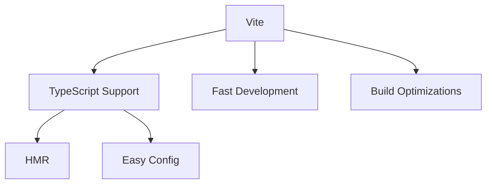
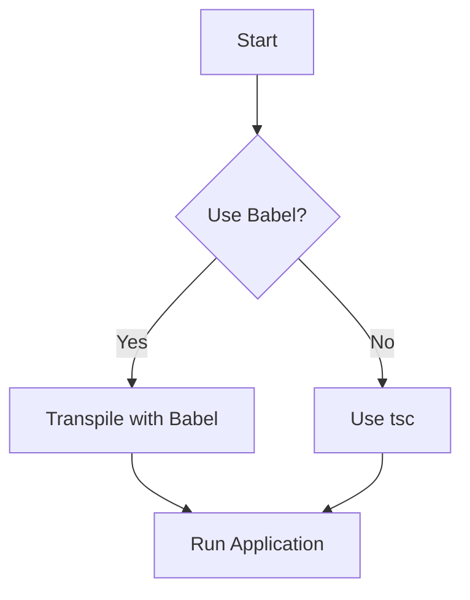
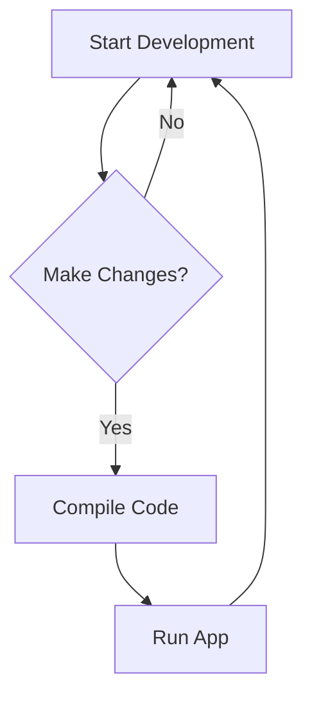

Error: API request failed with error: 401 Client Error: Unauthorized for url: https://openrouter.ai/api/v1/chat/completions

# <span style="color:#e67e22;">What we will learn in this post?</span>
<ul style='list-style-type: none; padding-left: 0;'>
<li><span style='color: #2980b9; font-size: 20px; font-weight: bold;'>👉</span> <span style='color: #2ecc71; font-size: 18px; font-weight: bold;'>TypeScript with Webpack</span></li>
<li><span style='color: #2980b9; font-size: 20px; font-weight: bold;'>👉</span> <span style='color: #2ecc71; font-size: 18px; font-weight: bold;'>TypeScript with Vite</span></li>
<li><span style='color: #2980b9; font-size: 20px; font-weight: bold;'>👉</span> <span style='color: #2ecc71; font-size: 18px; font-weight: bold;'>TypeScript with esbuild</span></li>
<li><span style='color: #2980b9; font-size: 20px; font-weight: bold;'>👉</span> <span style='color: #2ecc71; font-size: 18px; font-weight: bold;'>Rollup for TypeScript Libraries</span></li>
<li><span style='color: #2980b9; font-size: 20px; font-weight: bold;'>👉</span> <span style='color: #2ecc71; font-size: 18px; font-weight: bold;'>TypeScript with Babel</span></li>
<li><span style='color: #2980b9; font-size: 20px; font-weight: bold;'>👉</span> <span style='color: #2ecc71; font-size: 18px; font-weight: bold;'>Watch Mode and Development Workflow</span></li>
<li><span style='color: #2980b9; font-size: 20px; font-weight: bold;'>👉</span> <span style='color: #2ecc71; font-size: 18px; font-weight: bold;'>Production Build Optimization</span></li>
</ul>

# <span style="color:#e67e22">Configuring Webpack for TypeScript Projects</span> 🎉

Setting up Webpack for your TypeScript projects can be a breeze! Let’s break it down step by step. 

## <span style="color:#2980b9">Getting Started with Webpack</span> 🚀

1. **Install Dependencies**:
   You’ll need `webpack`, `webpack-cli`, `ts-loader` or `babel-loader`, and `typescript`. Use:
   ```bash
   npm install --save-dev webpack webpack-cli ts-loader typescript
   ```

2. **Create `webpack.config.js`**:
   Here’s a basic setup for a TypeScript + React project:
   ```javascript
   const path = require('path');

   module.exports = {
       entry: './src/index.tsx',
       output: {
           filename: 'bundle.js',
           path: path.resolve(__dirname, 'dist'),
       },
       resolve: {
           extensions: ['.tsx', '.ts', '.js'],
       },
       module: {
           rules: [
               {
                   test: /\.tsx?$/,
                   use: 'ts-loader',
                   exclude: /node_modules/,
               },
           ],
       },
       devtool: 'source-map', // For debugging
       optimization: {
           usedExports: true, // Enables tree shaking
       },
   };
   ```

### <span style="color:#8e44ad">Understanding Key Concepts</span> 🧠

- **Source Maps**: Helps you debug your TypeScript code easily by mapping compiled code back to the original source.
- **Tree Shaking**: Removes unused code, making your bundle smaller. Ensure you use ES6 modules for this to work effectively.
- **Optimization Strategies**: Use `optimization` settings in Webpack to improve performance, like enabling `usedExports`.

For more detailed info, check out the [Webpack Documentation](https://webpack.js.org/concepts/).

### <span style="color:#8e44ad">Conclusion</span> 🌟

With this setup, you’re ready to build amazing TypeScript applications! Happy coding!

# <span style="color:#e67e22">Using Vite with TypeScript for Fast Development 🚀</span>

## <span style="color:#2980b9">Why Choose Vite? 🤔</span>
Vite is a modern build tool that offers **native TypeScript support**. It’s faster than Webpack because it uses native ES modules and only bundles code when needed.

### <span style="color:#8e44ad">Setting Up Vite with TypeScript 🛠️</span>
1. **Install Vite**:
   ```bash
   npm create vite@latest my-app --template vue-ts
   ```
2. **Configure `vite.config.ts`**:
   - This file is where you set up plugins and other options.
   - Example:
     ```typescript
     import { defineConfig } from 'vite';
     import vue from '@vitejs/plugin-vue';

     export default defineConfig({
       plugins: [vue()],
     });
     ```

### <span style="color:#8e44ad">Hot Module Replacement (HMR) 🔄</span>
- Vite supports HMR out of the box, allowing you to see changes instantly without refreshing the page.

### <span style="color:#8e44ad">Build Optimizations ⚙️</span>
- Vite optimizes your code for production, ensuring faster load times and smaller bundle sizes.

## <span style="color:#2980b9">Advantages Over Webpack 🌟</span>
- **Faster Development**: Instant server start and updates.
- **Simpler Configuration**: Less boilerplate code.
- **Better TypeScript Integration**: No additional setup needed.

For more details, check out the [Vite Documentation](https://vitejs.dev/).



Enjoy building with Vite and TypeScript! Happy coding! 🎉

# <span style="color:#e67e22">Introduction to esbuild: The Fastest TypeScript Bundler 🚀</span>

Are you looking for a super-fast way to bundle your TypeScript projects? Look no further than **esbuild**! This amazing tool is designed to make your development process quicker and smoother.

## <span style="color:#2980b9">Why Choose esbuild? 🤔</span>

- **Native TypeScript Support**: esbuild can handle TypeScript files directly with its *transpile-only* feature. This means you can skip the type-checking step and focus on building your app quickly.
  
- **Configuring Build Scripts**: Setting up esbuild is easy! You can create a simple build script using JavaScript or TypeScript. Here’s a basic example:

```javascript
// build.js
const esbuild = require('esbuild');

esbuild.build({
  entryPoints: ['src/index.ts'],
  bundle: true,
  outfile: 'dist/bundle.js',
}).catch(() => process.exit(1));
```

### <span style="color:#8e44ad">Limitations ⚠️</span>

- **No Type Checking**: While esbuild is fast, it does not perform type checking. To ensure your code is error-free, you can combine it with `tsc` (TypeScript Compiler) for type checks.

### <span style="color:#8e44ad">Combining esbuild with tsc 🔗</span>

You can run `tsc` before or after your esbuild process to catch any type errors. Here’s how you can do it:

```bash
tsc && node build.js
```

For more information, check out the [esbuild documentation](https://esbuild.github.io/).

With esbuild, you can enjoy a fast and efficient development experience while keeping your TypeScript code safe and sound! Happy coding! 🎉

# <span style="color:#e67e22">Building TypeScript Libraries with Rollup 🎉</span>

Creating a TypeScript library can be fun and rewarding! Using **Rollup** with `@rollup/plugin-typescript` makes it easy to bundle your code efficiently. Let’s break down the key concepts.

## <span style="color:#2980b9">Why Use Rollup? 🤔</span>

Rollup is a module bundler that helps you:

- **Generate multiple formats**: You can create **ESM**, **CJS**, and **UMD** builds.
- **Tree shaking**: This means removing unused code, making your library smaller and faster.
- **Optimize your library**: Rollup helps in producing efficient bundles.

### <span style="color:#8e44ad">Setting Up Rollup with TypeScript 📦</span>

Here’s a simple `rollup.config.ts` example for your npm package:

```typescript
import typescript from '@rollup/plugin-typescript';

export default {
  input: 'src/index.ts',
  output: [
    {
      file: 'dist/my-library.esm.js',
      format: 'esm',
    },
    {
      file: 'dist/my-library.cjs.js',
      format: 'cjs',
    },
    {
      file: 'dist/my-library.umd.js',
      format: 'umd',
      name: 'MyLibrary',
    },
  ],
  plugins: [typescript()],
};
```

### <span style="color:#8e44ad">Generating Declaration Files 📜</span>

To generate TypeScript declaration files, add this to your `tsconfig.json`:

```json
{
  "compilerOptions": {
    "declaration": true,
    "outDir": "./dist"
  }
}
```

### <span style="color:#2980b9">Resources for More Info 📚</span>

- [Rollup Documentation](https://rollupjs.org/guide/en/)
- [TypeScript Documentation](https://www.typescriptlang.org/docs/)

With Rollup and TypeScript, you can create a powerful library that’s easy to use and share! Happy coding! 🚀

# <span style="color:#e67e22">Using Babel to Transpile TypeScript</span> 🚀

Transpiling TypeScript with Babel can be a great choice for developers looking for speed and flexibility. Here’s a friendly guide to get you started!

## <span style="color:#2980b9">What is Babel?</span>

Babel is a popular tool that converts modern JavaScript (and TypeScript) into a version that can run in older environments. With the `@babel/preset-typescript`, you can easily transpile TypeScript files.

### <span style="color:#8e44ad">Key Differences from `tsc`</span>

- **Faster Compilation**: Babel focuses on transforming code, making it quicker than TypeScript's compiler (`tsc`), which also checks types.
- **No Type Checking**: Babel does not perform type checking. This means it’s faster, but you might miss type errors.

### <span style="color:#8e44ad">Combining with `tsc` for Type Checking</span>

You can use Babel for transpilation and `tsc` for type checking. This way, you get the best of both worlds! 

```bash
tsc --noEmit && babel src --out-dir dist
```

### <span style="color:#8e44ad">Integration with Existing Babel Pipelines</span>

If you already use Babel for JavaScript, adding TypeScript is seamless. Just install the preset:

```bash
npm install --save-dev @babel/preset-typescript
```

Then, add it to your Babel configuration.

## <span style="color:#2980b9">Trade-offs to Consider</span>

- **Speed vs. Safety**: Choose Babel for speed, but remember to use `tsc` for type safety.
- **Setup Complexity**: Integrating Babel with TypeScript can add complexity to your build process.

For more detailed information, check out the [Babel Documentation](https://babeljs.io/docs/en/babel-preset-typescript).

### <span style="color:#8e44ad">Flowchart of the Process</span>



Happy coding! 🎉

# <span style="color:#e67e22">Understanding TypeScript Watch Mode and Development Tools</span>

## <span style="color:#2980b9">What is TypeScript Watch Mode? 👀</span>

TypeScript's **watch mode** (`tsc --watch`) is a handy feature that automatically compiles your code whenever you make changes. This means you don’t have to run the compiler manually every time! 🎉

### <span style="color:#8e44ad">Incremental Compilation 🚀</span>

With incremental compilation, TypeScript only recompiles the files that have changed. This speeds up the process, making your development experience smoother and faster!

## <span style="color:#2980b9">Using Tools for Node.js Development 🛠️</span>

Tools like **nodemon** and **ts-node-dev** help you run your TypeScript applications efficiently:

- **Nodemon**: Automatically restarts your app when files change.
- **ts-node-dev**: Combines TypeScript compilation and nodemon features for a seamless experience.

### <span style="color:#8e44ad">Hot Module Replacement (HMR) 🔥</span>

In web apps, **HMR** allows you to update modules in real-time without a full page reload. This keeps your app state intact and speeds up development!

## <span style="color:#2980b9">Optimizing Build Times ⏱️</span>

To optimize build times:

- Use **watch mode** for automatic compilation.
- Leverage **incremental compilation** to avoid recompiling everything.
- Consider using **HMR** for instant updates in web apps.

For more information, check out the [TypeScript Documentation](https://www.typescriptlang.org/docs/).



Happy coding! 😊

# <span style="color:#e67e22">Optimizing TypeScript Builds for Production</span>

Optimizing your TypeScript builds is essential for creating efficient and fast applications. Here’s a friendly guide to help you through the process! 🚀

## <span style="color:#2980b9">Key Optimization Techniques</span>

### <span style="color:#8e44ad">1. Minification</span>
- **What**: Reduces file size by removing whitespace and comments.
- **How**: Use tools like `Terser` or `UglifyJS`.

### <span style="color:#8e44ad">2. Tree Shaking</span>
- **What**: Removes unused code from your bundles.
- **How**: Ensure your modules are ES6 and use tools like Webpack.

### <span style="color:#8e44ad">3. Code Splitting</span>
- **What**: Breaks your code into smaller chunks.
- **How**: Use dynamic imports with Webpack.

### <span style="color:#8e44ad">4. Removing Dead Code</span>
- **What**: Eliminates code that is never used.
- **How**: Use tools like `eslint` to identify and remove it.

### <span style="color:#8e44ad">5. Generating Source Maps</span>
- **What**: Helps in debugging by mapping minified code back to original.
- **How**: Enable source maps in your build tool configuration.

## <span style="color:#2980b9">Best Practices</span>

- **Target ES Version**: Choose a version that balances compatibility and performance (e.g., ES2015).
- **Polyfills**: Use polyfills for features not supported in older browsers (e.g., `core-js`).
- **Bundle Analysis**: Use tools like `Webpack Bundle Analyzer` to visualize your bundle size.

### <span style="color:#8e44ad">Resources</span>
- [TypeScript Documentation](https://www.typescriptlang.org/docs/)
- [Webpack Documentation](https://webpack.js.org/)
- [Terser Documentation](https://terser.org/)

By following these tips, you can ensure your TypeScript applications are optimized for production! Happy coding! 🎉

