<!--
meta-description: "Master TypeScript build tools and bundlers including Webpack, Vite, esbuild, Rollup, and Babel. Learn configuration, optimization strategies, HMR, tree shaking, and production build best practices for modern TypeScript development."
keywords: "TypeScript build tools, Webpack configuration, Vite setup, esbuild bundler, Rollup library, Babel transpiler, ts-loader, Hot Module Replacement, tree shaking, code splitting, source maps, production optimization, minification, TypeScript bundlers"
-->

# <span style="color:#e67e22;">What we will learn in this post?</span>
<ul style='list-style-type: none; padding-left: 0;'>
<li><span style='color: #2980b9; font-size: 20px; font-weight: bold;'>👉</span> <span style='color: #2ecc71; font-size: 18px; font-weight: bold;'>TypeScript with Webpack</span></li>
<li><span style='color: #2980b9; font-size: 20px; font-weight: bold;'>👉</span> <span style='color: #2ecc71; font-size: 18px; font-weight: bold;'>TypeScript with Vite</span></li>
<li><span style='color: #2980b9; font-size: 20px; font-weight: bold;'>👉</span> <span style='color: #2ecc71; font-size: 18px; font-weight: bold;'>TypeScript with esbuild</span></li>
<li><span style='color: #2980b9; font-size: 20px; font-weight: bold;'>👉</span> <span style='color: #2ecc71; font-size: 18px; font-weight: bold;'>Rollup for TypeScript Libraries</span></li>
<li><span style='color: #2980b9; font-size: 20px; font-weight: bold;'>👉</span> <span style='color: #2ecc71; font-size: 18px; font-weight: bold;'>TypeScript with Babel</span></li>
<li><span style='color: #2980b9; font-size: 20px; font-weight: bold;'>👉</span> <span style='color: #2ecc71; font-size: 18px; font-weight: bold;'>Watch Mode and Development Workflow</span></li>
<li><span style='color: #2980b9; font-size: 20px; font-weight: bold;'>👉</span> <span style='color: #2ecc71; font-size: 18px; font-weight: bold;'>Production Build Optimization</span></li>
</ul>

# <span style="color:#e67e22">Configuring Webpack for TypeScript Projects</span> 🎉

Setting up Webpack for your TypeScript projects can be a breeze! Let’s break it down step by step. 

## <span style="color:#2980b9">Getting Started with Webpack</span> 🚀

Webpack is the industry standard for complex applications requiring advanced features like code splitting and lazy loading. It powers production apps at companies like Airbnb, Pinterest, and Slack.

1. **Install Dependencies**:
   You’ll need `webpack`, `webpack-cli`, `ts-loader` or `babel-loader`, and `typescript`. Use:
   ```bash
   npm install --save-dev webpack webpack-cli ts-loader typescript
   ```

2. **Create `webpack.config.js`**:
   Here’s a basic setup for a TypeScript + React project:
   ```javascript
   const path = require('path');

   module.exports = {
       entry: './src/index.tsx',
       output: {
           filename: 'bundle.js',
           path: path.resolve(__dirname, 'dist'),
       },
       resolve: {
           extensions: ['.tsx', '.ts', '.js'],
       },
       module: {
           rules: [
               {
                   test: /\.tsx?$/,
                   use: 'ts-loader',
                   exclude: /node_modules/,
               },
           ],
       },
       devtool: 'source-map', // For debugging
       optimization: {
           usedExports: true, // Enables tree shaking
       },
   };
   ```

### <span style="color:#8e44ad">Understanding Key Concepts</span> 🧠

- **Source Maps**: Helps you debug your TypeScript code easily by mapping compiled code back to the original source.
- **Tree Shaking**: Removes unused code, making your bundle smaller. Ensure you use ES6 modules for this to work effectively.
- **Optimization Strategies**: Use `optimization` settings in Webpack to improve performance, like enabling `usedExports`.

For more detailed info, check out the [Webpack Documentation](https://webpack.js.org/concepts/).

### <span style="color:#8e44ad">Real-World Example: Multi-Page Application Setup</span> 🎯

```typescript
// webpack.config.ts - Production-ready configuration for SaaS dashboard
import * as path from 'path';
import * as webpack from 'webpack';
import HtmlWebpackPlugin from 'html-webpack-plugin';
import MiniCssExtractPlugin from 'mini-css-extract-plugin';

const config: webpack.Configuration = {
  mode: 'production',
  entry: {
    main: './src/index.tsx',
    admin: './src/admin.tsx',
    vendor: ['react', 'react-dom', 'axios']
  },
  output: {
    filename: '[name].[contenthash].js',
    path: path.resolve(__dirname, 'dist'),
    clean: true // Clean dist folder before build
  },
  resolve: {
    extensions: ['.tsx', '.ts', '.js'],
    alias: {
      '@components': path.resolve(__dirname, 'src/components'),
      '@utils': path.resolve(__dirname, 'src/utils')
    }
  },
  module: {
    rules: [
      {
        test: /\.tsx?$/,
        use: 'ts-loader',
        exclude: /node_modules/
      },
      {
        test: /\.css$/,
        use: [MiniCssExtractPlugin.loader, 'css-loader']
      }
    ]
  },
  optimization: {
    splitChunks: {
      chunks: 'all',
      cacheGroups: {
        vendor: {
          test: /[\\/]node_modules[\\/]/,
          name: 'vendors',
          priority: 10
        }
      }
    }
  },
  plugins: [
    new HtmlWebpackPlugin({
      template: './src/index.html',
      chunks: ['main', 'vendor']
    }),
    new MiniCssExtractPlugin({
      filename: '[name].[contenthash].css'
    })
  ],
  devtool: 'source-map'
};

export default config;
```

# <span style="color:#e67e22">Using Vite with TypeScript for Fast Development 🚀</span>

## <span style="color:#2980b9">Why Choose Vite? 🤔</span>
Vite is a modern build tool that offers **native TypeScript support**. It's faster than Webpack because it uses native ES modules and only bundles code when needed. Companies like Shopify and Storybook use Vite for lightning-fast development experiences.

### <span style="color:#8e44ad">Setting Up Vite with TypeScript 🛠️</span>
1. **Install Vite**:
   ```bash
   npm create vite@latest my-app --template vue-ts
   ```
2. **Configure `vite.config.ts`**:
   - This file is where you set up plugins and other options.
   - Example:
     ```typescript
     import { defineConfig } from 'vite';
     import vue from '@vitejs/plugin-vue';

     export default defineConfig({
       plugins: [vue()],
     });
     ```

### <span style="color:#8e44ad">Hot Module Replacement (HMR) 🔄</span>
- Vite supports HMR out of the box, allowing you to see changes instantly without refreshing the page.

### <span style="color:#8e44ad">Build Optimizations ⚙️</span>
- Vite optimizes your code for production, ensuring faster load times and smaller bundle sizes.

## <span style="color:#2980b9">Advantages Over Webpack 🌟</span>
- **Faster Development**: Instant server start and updates.
- **Simpler Configuration**: Less boilerplate code.
- **Better TypeScript Integration**: No additional setup needed.

For more details, check out the [Vite Documentation](https://vitejs.dev/).

### <span style="color:#8e44ad">Real-World Example: Vue 3 + TypeScript Project</span> 🎯

```typescript
// vite.config.ts - Enterprise Vue.js application with TypeScript
import { defineConfig } from 'vite';
import vue from '@vitejs/plugin-vue';
import path from 'path';

export default defineConfig({
  plugins: [vue()],
  resolve: {
    alias: {
      '@': path.resolve(__dirname, './src')
    }
  },
  server: {
    port: 3000,
    open: true,
    proxy: {
      '/api': {
        target: 'http://localhost:8000',
        changeOrigin: true,
        rewrite: (path) => path.replace(/^\/api/, '')
      }
    }
  },
  build: {
    target: 'esnext',
    minify: 'terser',
    sourcemap: true,
    rollupOptions: {
      output: {
        manualChunks: {
          'vue-vendor': ['vue', 'vue-router', 'pinia'],
          'ui-library': ['element-plus']
        }
      }
    },
    chunkSizeWarningLimit: 1000
  },
  optimizeDeps: {
    include: ['vue', 'axios']
  }
});
```



# <span style="color:#e67e22">Introduction to esbuild: The Fastest TypeScript Bundler 🚀</span>

```mermaid
graph TD
    A["🚀 Vite Build Tool"]:::style1 --> B["📘 TypeScript Support"]:::style2
    A --> C["⚡ Lightning Fast Dev"]:::style3
    A --> D["🎯 Build Optimizations"]:::style4
    B --> E["🔥 HMR"]:::style5
    B --> F["⚙️ Zero Config"]:::style2

    classDef style1 fill:#ff4f81,stroke:#c43e3e,color:#fff,font-size:16px,stroke-width:3px,rx:14,shadow:6px;
    classDef style2 fill:#6b5bff,stroke:#4a3f6b,color:#fff,font-size:16px,stroke-width:3px,rx:14,shadow:6px;
    classDef style3 fill:#43e97b,stroke:#38f9d7,color:#fff,font-size:16px,stroke-width:3px,rx:14,shadow:6px;
    classDef style4 fill:#ffd700,stroke:#d99120,color:#222,font-size:16px,stroke-width:3px,rx:14,shadow:6px;
    classDef style5 fill:#ff9800,stroke:#f57c00,color:#fff,font-size:16px,stroke-width:3px,rx:14,shadow:6px;

    linkStyle default stroke:#e67e22,stroke-width:3px;
```

Are you looking for a super-fast way to bundle your TypeScript projects? Look no further than **esbuild**! This amazing tool is designed to make your development process quicker and smoother. Written in Go, esbuild is 10-100x faster than traditional JavaScript-based bundlers.

## <span style="color:#2980b9">Why Choose esbuild? 🤔</span>

- **Native TypeScript Support**: esbuild can handle TypeScript files directly with its *transpile-only* feature. This means you can skip the type-checking step and focus on building your app quickly.
  
- **Configuring Build Scripts**: Setting up esbuild is easy! You can create a simple build script using JavaScript or TypeScript. Here’s a basic example:

```javascript
// build.js
const esbuild = require('esbuild');

esbuild.build({
  entryPoints: ['src/index.ts'],
  bundle: true,
  outfile: 'dist/bundle.js',
}).catch(() => process.exit(1));
```

### <span style="color:#8e44ad">Limitations ⚠️</span>

- **No Type Checking**: While esbuild is fast, it does not perform type checking. To ensure your code is error-free, you can combine it with `tsc` (TypeScript Compiler) for type checks.

### <span style="color:#8e44ad">Combining esbuild with tsc 🔗</span>

You can run `tsc` before or after your esbuild process to catch any type errors. Here’s how you can do it:

```bash
tsc && node build.js
```

For more information, check out the [esbuild documentation](https://esbuild.github.io/).

### <span style="color:#8e44ad">Real-World Example: Node.js Backend API</span> 🎯

```typescript
// build.ts - Production build script for Express API
import * as esbuild from 'esbuild';

async function build() {
  try {
    // Build for production
    await esbuild.build({
      entryPoints: ['src/server.ts'],
      bundle: true,
      platform: 'node',
      target: 'node18',
      outfile: 'dist/server.js',
      minify: true,
      sourcemap: true,
      external: [
        'express',
        'pg', // PostgreSQL client
        'redis',
        'dotenv'
      ],
      define: {
        'process.env.NODE_ENV': '"production"'
      },
      metafile: true,
      logLevel: 'info'
    });

    console.log('✅ Build completed successfully!');
  } catch (error) {
    console.error('❌ Build failed:', error);
    process.exit(1);
  }
}

build();

// package.json scripts:
// "build": "tsc --noEmit && node build.ts"
// "dev": "tsx watch src/server.ts"
```

# <span style="color:#e67e22">Building TypeScript Libraries with Rollup 🎉</span>

Creating a TypeScript library can be fun and rewarding! Using **Rollup** with `@rollup/plugin-typescript` makes it easy to bundle your code efficiently. Popular libraries like Redux, Vue, and React Router are all built with Rollup.

## <span style="color:#2980b9">Why Use Rollup? 🤔</span>

Rollup is a module bundler that helps you:

- **Generate multiple formats**: You can create **ESM**, **CJS**, and **UMD** builds.
- **Tree shaking**: This means removing unused code, making your library smaller and faster.
- **Optimize your library**: Rollup helps in producing efficient bundles.

### <span style="color:#8e44ad">Setting Up Rollup with TypeScript 📦</span>

Here’s a simple `rollup.config.ts` example for your npm package:

```typescript
import typescript from '@rollup/plugin-typescript';

export default {
  input: 'src/index.ts',
  output: [
    {
      file: 'dist/my-library.esm.js',
      format: 'esm',
    },
    {
      file: 'dist/my-library.cjs.js',
      format: 'cjs',
    },
    {
      file: 'dist/my-library.umd.js',
      format: 'umd',
      name: 'MyLibrary',
    },
  ],
  plugins: [typescript()],
};
```

### <span style="color:#8e44ad">Generating Declaration Files 📜</span>

To generate TypeScript declaration files, add this to your `tsconfig.json`:

```json
{
  "compilerOptions": {
    "declaration": true,
    "outDir": "./dist"
  }
}
```

### <span style="color:#2980b9">Resources for More Info 📚</span>

- [Rollup Documentation](https://rollupjs.org/guide/en/)
- [TypeScript Documentation](https://www.typescriptlang.org/docs/)

### <span style="color:#8e44ad">Real-World Example: NPM Library Package</span> 🎯

```typescript
// rollup.config.ts - Complete configuration for publishing TypeScript library
import typescript from '@rollup/plugin-typescript';
import resolve from '@rollup/plugin-node-resolve';
import commonjs from '@rollup/plugin-commonjs';
import terser from '@rollup/plugin-terser';
import dts from 'rollup-plugin-dts';

const production = !process.env.ROLLUP_WATCH;

export default [
  // JavaScript/TypeScript build
  {
    input: 'src/index.ts',
    output: [
      {
        file: 'dist/index.esm.js',
        format: 'esm',
        sourcemap: true
      },
      {
        file: 'dist/index.cjs.js',
        format: 'cjs',
        sourcemap: true,
        exports: 'named'
      },
      {
        file: 'dist/index.umd.js',
        format: 'umd',
        name: 'MyAwesomeLibrary',
        sourcemap: true,
        globals: {
          'axios': 'axios'
        }
      }
    ],
    plugins: [
      resolve(), // Resolve node_modules
      commonjs(), // Convert CommonJS to ES modules
      typescript({
        tsconfig: './tsconfig.json',
        declaration: false // We'll generate .d.ts separately
      }),
      production && terser() // Minify in production
    ],
    external: ['axios'] // Don't bundle peer dependencies
  },
  // TypeScript declaration files (.d.ts)
  {
    input: 'src/index.ts',
    output: [{ file: 'dist/index.d.ts', format: 'esm' }],
    plugins: [dts()]
  }
];

// package.json:
// {
//   "main": "dist/index.cjs.js",
//   "module": "dist/index.esm.js",
//   "types": "dist/index.d.ts",
//   "files": ["dist"]
// }
```

# <span style="color:#e67e22">Using Babel to Transpile TypeScript</span> 🚀

Transpiling TypeScript with Babel can be a great choice for developers looking for speed and flexibility. Teams already using Babel for JavaScript can seamlessly add TypeScript support without changing their entire build pipeline.

## <span style="color:#2980b9">What is Babel?</span>

Babel is a popular tool that converts modern JavaScript (and TypeScript) into a version that can run in older environments. With the `@babel/preset-typescript`, you can easily transpile TypeScript files.

### <span style="color:#8e44ad">Key Differences from `tsc`</span>

- **Faster Compilation**: Babel focuses on transforming code, making it quicker than TypeScript's compiler (`tsc`), which also checks types.
- **No Type Checking**: Babel does not perform type checking. This means it’s faster, but you might miss type errors.

### <span style="color:#8e44ad">Combining with `tsc` for Type Checking</span>

You can use Babel for transpilation and `tsc` for type checking. This way, you get the best of both worlds! 

```bash
tsc --noEmit && babel src --out-dir dist
```

### <span style="color:#8e44ad">Integration with Existing Babel Pipelines</span>

If you already use Babel for JavaScript, adding TypeScript is seamless. Just install the preset:

```bash
npm install --save-dev @babel/preset-typescript
```

Then, add it to your Babel configuration.

## <span style="color:#2980b9">Trade-offs to Consider</span>

- **Speed vs. Safety**: Choose Babel for speed, but remember to use `tsc` for type safety.
- **Setup Complexity**: Integrating Babel with TypeScript can add complexity to your build process.

For more detailed information, check out the [Babel Documentation](https://babeljs.io/docs/en/babel-preset-typescript).

```mermaid
flowchart TD
    A["🎯 Start Build Process"]:::style1 --> B{"💡 Use Babel?"}:::style3
    B -- "Yes ⚡" --> C["🔄 Transpile with Babel"]:::style2
    B -- "No 🛡️" --> D["🔍 Use tsc Type Check"]:::style4
    C --> E["✅ Run Application"]:::style5
    D --> E

    classDef style1 fill:#ff4f81,stroke:#c43e3e,color:#fff,font-size:16px,stroke-width:3px,rx:14,shadow:6px;
    classDef style2 fill:#6b5bff,stroke:#4a3f6b,color:#fff,font-size:16px,stroke-width:3px,rx:14,shadow:6px;
    classDef style3 fill:#ffd700,stroke:#d99120,color:#222,font-size:16px,stroke-width:3px,rx:14,shadow:6px;
    classDef style4 fill:#00bfae,stroke:#005f99,color:#fff,font-size:16px,stroke-width:3px,rx:14,shadow:6px;
    classDef style5 fill:#43e97b,stroke:#38f9d7,color:#fff,font-size:16px,stroke-width:3px,rx:14,shadow:6px;

    linkStyle default stroke:#e67e22,stroke-width:3px;
```



# <span style="color:#e67e22">Understanding TypeScript Watch Mode and Development Tools</span>

## <span style="color:#2980b9">What is TypeScript Watch Mode? 👀</span>

TypeScript's **watch mode** (`tsc --watch`) is a handy feature that automatically compiles your code whenever you make changes. This means you don't have to run the compiler manually every time! Modern IDEs like VS Code integrate watch mode seamlessly for real-time error feedback.

### <span style="color:#8e44ad">Incremental Compilation 🚀</span>

With incremental compilation, TypeScript only recompiles the files that have changed. This speeds up the process, making your development experience smoother and faster!

## <span style="color:#2980b9">Using Tools for Node.js Development 🛠️</span>

Tools like **nodemon** and **ts-node-dev** help you run your TypeScript applications efficiently:

- **Nodemon**: Automatically restarts your app when files change.
- **ts-node-dev**: Combines TypeScript compilation and nodemon features for a seamless experience.

### <span style="color:#8e44ad">Hot Module Replacement (HMR) 🔥</span>

In web apps, **HMR** allows you to update modules in real-time without a full page reload. This keeps your app state intact and speeds up development!

## <span style="color:#2980b9">Optimizing Build Times ⏱️</span>

To optimize build times:

- Use **watch mode** for automatic compilation.
- Leverage **incremental compilation** to avoid recompiling everything.
- Consider using **HMR** for instant updates in web apps.

For more information, check out the [TypeScript Documentation](https://www.typescriptlang.org/docs/).

```mermaid
graph TD
    A["🚀 Start Development"]:::style1 --> B{"📝 Make Changes?"}:::style3
    B -- "Yes 🔄" --> C["⚙️ Compile Code"]:::style2
    C --> D["🏃 Run Application"]:::style4
    D --> A
    B -- "No ⏸️" --> A

    classDef style1 fill:#ff4f81,stroke:#c43e3e,color:#fff,font-size:16px,stroke-width:3px,rx:14,shadow:6px;
    classDef style2 fill:#6b5bff,stroke:#4a3f6b,color:#fff,font-size:16px,stroke-width:3px,rx:14,shadow:6px;
    classDef style3 fill:#ffd700,stroke:#d99120,color:#222,font-size:16px,stroke-width:3px,rx:14,shadow:6px;
    classDef style4 fill:#43e97b,stroke:#38f9d7,color:#fff,font-size:16px,stroke-width:3px,rx:14,shadow:6px;

    linkStyle default stroke:#e67e22,stroke-width:3px;
```



# <span style="color:#e67e22">Optimizing TypeScript Builds for Production</span>

Optimizing your TypeScript builds is essential for creating efficient and fast applications. Production builds can reduce bundle sizes by 60-80% through proper optimization techniques.

## <span style="color:#2980b9">Key Optimization Techniques</span>

### <span style="color:#8e44ad">1. Minification</span>
- **What**: Reduces file size by removing whitespace and comments.
- **How**: Use tools like `Terser` or `UglifyJS`.

### <span style="color:#8e44ad">2. Tree Shaking</span>
- **What**: Removes unused code from your bundles.
- **How**: Ensure your modules are ES6 and use tools like Webpack.

### <span style="color:#8e44ad">3. Code Splitting</span>
- **What**: Breaks your code into smaller chunks.
- **How**: Use dynamic imports with Webpack.

### <span style="color:#8e44ad">4. Removing Dead Code</span>
- **What**: Eliminates code that is never used.
- **How**: Use tools like `eslint` to identify and remove it.

### <span style="color:#8e44ad">5. Generating Source Maps</span>
- **What**: Helps in debugging by mapping minified code back to original.
- **How**: Enable source maps in your build tool configuration.

## <span style="color:#2980b9">Best Practices</span>

- **Target ES Version**: Choose a version that balances compatibility and performance (e.g., ES2015).
- **Polyfills**: Use polyfills for features not supported in older browsers (e.g., `core-js`).
- **Bundle Analysis**: Use tools like `Webpack Bundle Analyzer` to visualize your bundle size.

### <span style="color:#8e44ad">Resources</span>
- [TypeScript Documentation](https://www.typescriptlang.org/docs/)
- [Webpack Documentation](https://webpack.js.org/)
- [Terser Documentation](https://terser.org/)

By following these tips, you can ensure your TypeScript applications are optimized for production!

---

<details style='border: 2px solid #c43e3e; border-radius: 8px; padding: 20px; background: linear-gradient(135deg, #ffe6e6 0%, #fff 100%); margin: 25px 0; box-shadow: 0 6px 12px rgba(196, 62, 62, 0.15);'>
<summary style='cursor: pointer; font-size: 1.3em; font-weight: bold; color: #c43e3e; padding: 10px 0;'>
🎯 Hands-On Assignment: Build a Multi-Tool TypeScript Project 🚀
</summary>

<div style='margin-top: 20px; color: #2c3e50; line-height: 1.6;'>

<h3 style='color: #c43e3e; border-bottom: 2px solid #c43e3e; padding-bottom: 8px; margin-top: 20px;'>📝 Your Mission</h3>

Create a production-ready TypeScript project that demonstrates mastery of multiple build tools. You'll build a simple task management library that can be bundled for different environments (Node.js, browser, npm package) using Webpack, Vite, esbuild, and Rollup.

<h3 style='color: #c43e3e; border-bottom: 2px solid #c43e3e; padding-bottom: 8px; margin-top: 20px;'>🎯 Requirements</h3>

<ol style='margin-left: 20px;'>
<li>Create a TypeScript library with at least 3 modules:
  <ul style='margin-left: 20px; margin-top: 8px;'>
    <li><code>TaskManager.ts</code> - Core task management class</li>
    <li><code>Storage.ts</code> - LocalStorage/File system abstraction</li>
    <li><code>Validator.ts</code> - Input validation utilities</li>
  </ul>
</li>
<li>Configure Webpack for browser bundle with:
  <ul style='margin-left: 20px; margin-top: 8px;'>
    <li>TypeScript compilation using <code>ts-loader</code></li>
    <li>Code splitting for lazy-loaded modules</li>
    <li>Source maps for debugging</li>
    <li>Minification for production</li>
  </ul>
</li>
<li>Setup Vite for development with:
  <ul style='margin-left: 20px; margin-top: 8px;'>
    <li>Hot Module Replacement (HMR)</li>
    <li>Demo HTML page using the library</li>
    <li>Proxy configuration for API calls</li>
  </ul>
</li>
<li>Add esbuild script for fast Node.js builds:
  <ul style='margin-left: 20px; margin-top: 8px;'>
    <li>Bundle for <code>node18</code> target</li>
    <li>External dependencies marked properly</li>
    <li>Combined with <code>tsc --noEmit</code> for type checking</li>
  </ul>
</li>
<li>Configure Rollup for npm package publishing:
  <ul style='margin-left: 20px; margin-top: 8px;'>
    <li>Generate ESM, CJS, and UMD formats</li>
    <li>Create TypeScript declaration files (.d.ts)</li>
    <li>Proper <code>package.json</code> configuration</li>
  </ul>
</li>
</ol>

<h3 style='color: #c43e3e; border-bottom: 2px solid #c43e3e; padding-bottom: 8px; margin-top: 25px;'>💡 Implementation Hints</h3>

<ol style='margin-left: 20px;'>
<li>Use <code>tsconfig.json</code> with <code>"declaration": true</code> for generating type definitions</li>
<li>For Webpack, enable tree shaking with <code>optimization.usedExports: true</code></li>
<li>In Vite config, use <code>build.rollupOptions.output.manualChunks</code> for code splitting</li>
<li>Use <code>esbuild.build({ platform: 'node', bundle: true })</code> for Node.js</li>
<li>In Rollup, add <code>rollup-plugin-dts</code> for combining declaration files</li>
<li>Test each build output: run browser bundle in HTML, Node.js bundle with <code>node</code>, npm package in separate project</li>
</ol>

<h3 style='color: #c43e3e; border-bottom: 2px solid #c43e3e; padding-bottom: 8px; margin-top: 25px;'>🚀 Example Structure</h3>

<pre style='background: #2c3e50; color: #ecf0f1; padding: 20px; border-radius: 8px; overflow-x: auto; margin: 15px 0;'><code class='language-typescript'>// src/TaskManager.ts
export interface Task {
  id: string;
  title: string;
  completed: boolean;
  createdAt: Date;
}

export class TaskManager {
  private tasks: Map<string, Task> = new Map();

  addTask(title: string): Task {
    const task: Task = {
      id: crypto.randomUUID(),
      title,
      completed: false,
      createdAt: new Date()
    };
    this.tasks.set(task.id, task);
    return task;
  }

  completeTask(id: string): boolean {
    const task = this.tasks.get(id);
    if (task) {
      task.completed = true;
      return true;
    }
    return false;
  }

  getAllTasks(): Task[] {
    return Array.from(this.tasks.values());
  }
}

// Build outputs:
// - dist/browser/bundle.js (Webpack - for <script> tag)
// - dist/node/index.js (esbuild - for Node.js server)
// - dist/esm/index.esm.js (Rollup - for npm package)
// - dist/cjs/index.cjs.js (Rollup - for npm package)
// - dist/index.d.ts (Type definitions)
</code></pre>

<h3 style='color: #c43e3e; border-bottom: 2px solid #c43e3e; padding-bottom: 8px; margin-top: 25px;'>🏆 Bonus Challenges</h3>

<ul style='margin-left: 20px;'>
<li><strong>Level 2</strong>: Add Babel configuration with <code>@babel/preset-typescript</code> as alternative to ts-loader</li>
<li><strong>Level 3</strong>: Implement watch mode scripts for all build tools with live reload</li>
<li><strong>Level 4</strong>: Add bundle size analysis with <code>webpack-bundle-analyzer</code> and optimize to under 50KB</li>
<li><strong>Level 5</strong>: Configure monorepo with multiple packages, each using different build tools</li>
<li><strong>Level 6</strong>: Add CI/CD pipeline that runs all builds, type checks, and publishes to npm registry</li>
</ul>

<h3 style='color: #c43e3e; border-bottom: 2px solid #c43e3e; padding-bottom: 8px; margin-top: 25px;'>📚 Learning Goals</h3>

<ul style='margin-left: 20px;'>
<li>Master configuration of Webpack, Vite, esbuild, and Rollup 🎯</li>
<li>Understand trade-offs between different build tools ⚖️</li>
<li>Apply optimization techniques (tree shaking, code splitting, minification) 🚀</li>
<li>Generate proper npm package with multiple module formats 📦</li>
<li>Configure development workflow with HMR and watch mode 🔄</li>
<li>Integrate type checking with fast transpilation pipelines 🛡️</li>
</ul>

<p style='background: #3498db; color: #fff; padding: 15px; border-radius: 8px; margin-top: 20px; border-left: 5px solid #2980b9;'>
<strong>💡 Pro Tip:</strong> Modern frameworks like Next.js, Nuxt, and SvelteKit use these build tools under the hood! Understanding their configuration helps you customize framework behavior and troubleshoot build issues in production applications.
</p>

<p style='margin-top: 20px; font-size: 1.1em;'><strong>Share Your Solution! 💬</strong></p>
<p>Completed the project? <strong>Post your build configurations and bundle size results in the comments below!</strong> Share your TypeScript build mastery! 🚀✨</p>

</div>
</details>

---

# <span style="color:#e67e22">Conclusion: Master Modern TypeScript Build Tools 🎓</span>

Build tools and bundlers are the backbone of professional TypeScript development, transforming source code into optimized, production-ready applications. By mastering Webpack for complex apps, Vite for blazing-fast development, esbuild for speed, Rollup for libraries, and understanding optimization techniques like tree shaking and code splitting, you'll create high-performance applications that scale from prototypes to enterprise systems serving millions of users.