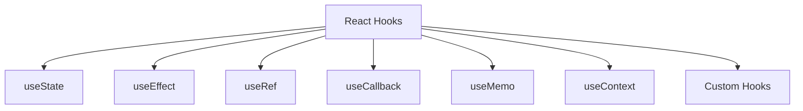
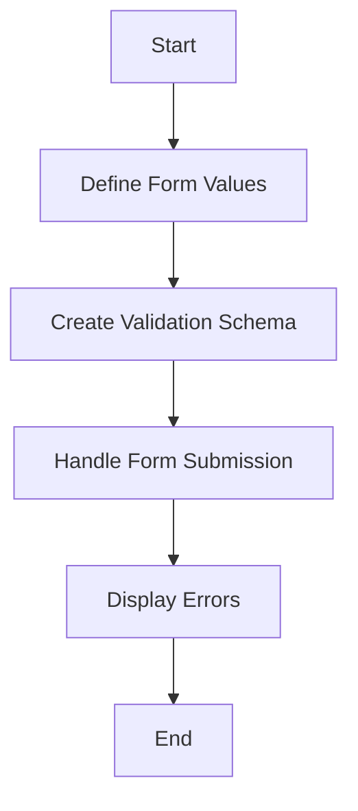

Error: API request failed with error: 401 Client Error: Unauthorized for url: https://openrouter.ai/api/v1/chat/completions

# <span style="color:#e67e22;">What we will learn in this post?</span>
<ul style='list-style-type: none; padding-left: 0;'>
<li><span style='color: #2980b9; font-size: 20px; font-weight: bold;'>👉</span> <span style='color: #2ecc71; font-size: 18px; font-weight: bold;'>TypeScript with React - Components</span></li>
<li><span style='color: #2980b9; font-size: 20px; font-weight: bold;'>👉</span> <span style='color: #2ecc71; font-size: 18px; font-weight: bold;'>React Hooks with TypeScript</span></li>
<li><span style='color: #2980b9; font-size: 20px; font-weight: bold;'>👉</span> <span style='color: #2ecc71; font-size: 18px; font-weight: bold;'>TypeScript with Vue 3</span></li>
<li><span style='color: #2980b9; font-size: 20px; font-weight: bold;'>👉</span> <span style='color: #2ecc71; font-size: 18px; font-weight: bold;'>TypeScript with Angular</span></li>
<li><span style='color: #2980b9; font-size: 20px; font-weight: bold;'>👉</span> <span style='color: #2ecc71; font-size: 18px; font-weight: bold;'>TypeScript with Svelte</span></li>
<li><span style='color: #2980b9; font-size: 20px; font-weight: bold;'>👉</span> <span style='color: #2ecc71; font-size: 18px; font-weight: bold;'>Form Handling and Validation</span></li>
<li><span style='color: #2980b9; font-size: 20px; font-weight: bold;'>👉</span> <span style='color: #2ecc71; font-size: 18px; font-weight: bold;'>State Management with TypeScript</span></li>
</ul>

# <span style="color:#e67e22">Typing React Functional Components</span> 🌟

React functional components are a great way to build user interfaces. When using TypeScript, we can make our components safer and easier to understand by typing them properly. Let’s explore how to do this!

## <span style="color:#2980b9">Using React.FC and Explicit Return Types</span> 🖥️

You can type your components using `React.FC` or by defining explicit return types. Here’s how:

```tsx
import React from 'react';

interface MyComponentProps {
  title: string;
  children?: React.ReactNode; // Typing children prop
}

const MyComponent: React.FC<MyComponentProps> = ({ title, children }) => {
  return (
    <div>
      <h1>{title}</h1>
      {children}
    </div>
  );
};
```

### <span style="color:#8e44ad">Component Composition</span> 🔄

You can compose components easily. Just pass components as children:

```tsx
<MyComponent title="Hello!">
  <p>This is a child component.</p>
</MyComponent>
```

## <span style="color:#2980b9">Default Props and PropTypes Deprecation</span> ⚠️

In TypeScript, you can set default props like this:

```tsx
MyComponent.defaultProps = {
  title: 'Default Title',
};
```

However, `propTypes` are not needed with TypeScript, as TypeScript handles type checking.

### <span style="color:#8e44ad">Resources</span> 📚

- [TypeScript Documentation](https://www.typescriptlang.org/docs/)
- [React TypeScript Cheatsheet](https://react-typescript-cheatsheet.netlify.app/)

By typing your components, you make your code clearer and safer. Happy coding! 🎉

# <span style="color:#e67e22">Guide to React Hooks</span> 🌟

## <span style="color:#2980b9">Understanding React Hooks</span>

React hooks are functions that let you use state and other React features without writing a class. Here’s a quick guide to some essential hooks:

### <span style="color:#8e44ad">1. useState<T></span> 🛠️

- **Purpose**: Manage state in functional components.
- **Usage**:
  ```javascript
  const [count, setCount] = useState<number>(0);
  ```

### <span style="color:#8e44ad">2. useEffect with Cleanup</span> 🔄

- **Purpose**: Perform side effects in components.
- **Usage**:
  ```javascript
  useEffect(() => {
    const timer = setTimeout(() => setCount(count + 1), 1000);
    return () => clearTimeout(timer); // Cleanup
  }, [count]);
  ```

### <span style="color:#8e44ad">3. useRef<T></span> 📜

- **Purpose**: Access DOM elements directly.
- **Usage**:
  ```javascript
  const inputRef = useRef<HTMLInputElement>(null);
  ```

### <span style="color:#8e44ad">4. useCallback and useMemo</span> 🔍

- **Purpose**: Optimize performance by memoizing functions and values.
- **Usage**:
  ```javascript
  const memoizedValue = useMemo(() => computeExpensiveValue(a, b), [a, b]);
  const memoizedCallback = useCallback(() => { /* function */ }, [dependency]);
  ```

### <span style="color:#8e44ad">5. useContext with Typed Context</span> 🌐

- **Purpose**: Access context values easily.
- **Usage**:
  ```javascript
  const value = useContext<MyContextType>(MyContext);
  ```

### <span style="color:#8e44ad">6. Custom Hooks</span> 🧩

- **Purpose**: Reuse stateful logic.
- **Usage**:
  ```javascript
  function useCustomHook() {
    // logic here
  }
  ```

## <span style="color:#2980b9">Type Inference in Hooks</span> 🔍

Type inference helps TypeScript understand the types of your state and props automatically, making your code cleaner and safer.

## <span style="color:#2980b9">Common Patterns</span> 🔄

- **State Management**: Use `useReducer` for complex state.
- **Effect Dependencies**: Always specify dependencies in `useEffect` to avoid bugs.

For more detailed information, check out the [React Documentation](https://reactjs.org/docs/hooks-intro.html).



Happy coding! 🎉

# <span style="color:#e67e22">Getting Started with TypeScript in Vue 3</span> 🚀

Vue 3 brings exciting features, especially when combined with TypeScript and the Composition API. This guide will help you understand the basics and benefits of using TypeScript in your Vue applications.

## <span style="color:#2980b9">Key Concepts</span>

### <span style="color:#8e44ad">1. `defineComponent`</span>
This function helps you define a Vue component with TypeScript. It ensures type safety and better IntelliSense support.

### <span style="color:#8e44ad">2. `ref<T>`</span>
Use `ref` to create reactive references. For example:
```typescript
const count = ref<number>(0);
```

### <span style="color:#8e44ad">3. `reactive`</span>
This function creates a reactive object. It’s great for managing state:
```typescript
const state = reactive({ name: 'Vue' });
```

### <span style="color:#8e44ad">4. `computed`</span>
Use `computed` for derived state. It automatically updates when dependencies change:
```typescript
const doubleCount = computed(() => count.value * 2);
```

### <span style="color:#8e44ad">5. Typing Props with `PropType`</span>
You can define prop types easily:
```typescript
import { PropType } from 'vue';

props: {
  title: {
    type: String as PropType<string>,
    required: true,
  },
}
```

## <span style="color:#2980b9">Script Setup Syntax</span> 🛠️
The `<script setup>` syntax simplifies component setup. It reduces boilerplate and enhances readability.

### <span style="color:#8e44ad">Benefits of TypeScript in Vue 3</span>
- **Type Safety**: Catch errors early.
- **Better Tooling**: Enhanced IDE support.
- **Improved Readability**: Clearer code structure.

## <span style="color:#2980b9">Example: Simple Counter Component</span>

```vue
<template>
  <div>
    <h1>{{ title }}</h1>
    <button @click="increment">Count: {{ count }}</button>
  </div>
</template>

<script setup lang="ts">
import { ref, defineComponent } from 'vue';

const props = defineProps<{
  title: string;
}>();

const count = ref<number>(0);
const increment = () => {
  count.value++;
};
</script>
```

For more information, check out the [Vue 3 Documentation](https://vuejs.org/guide/introduction.html) and [TypeScript Handbook](https://www.typescriptlang.org/docs/).

Happy coding! 🎉

# <span style="color:#e67e22">Guide to TypeScript in Angular</span> 🚀

Angular uses TypeScript by default, making it easier to build robust applications. Let’s explore some key aspects of TypeScript in Angular!

## <span style="color:#2980b9">Component Typing</span> 🛠️

In Angular, components are the building blocks of your application. You can define types for component properties and methods.

```typescript
@Component({
  selector: 'app-example',
  templateUrl: './example.component.html',
})
export class ExampleComponent {
  title: string = 'Hello, Angular!';
  count: number = 0;

  increment(): void {
    this.count++;
  }
}
```

## <span style="color:#2980b9">Template Type Checking</span> 🔍

Angular provides template type checking to catch errors in your HTML templates. This helps ensure that your bindings are correct.

### <span style="color:#8e44ad">Strict Templates Option</span> ⚙️

Enable the `strictTemplates` option in your `tsconfig.json` to enhance type checking in templates:

```json
{
  "angularCompilerOptions": {
    "strictTemplates": true
  }
}
```

## <span style="color:#2980b9">Typing Services and Dependency Injection</span> 🏗️

When creating services, you can define types for injected dependencies:

```typescript
@Injectable({
  providedIn: 'root',
})
export class DataService {
  getData(): Observable<string[]> {
    return of(['Angular', 'TypeScript']);
  }
}
```

## <span style="color:#2980b9">RxJS Observables Typing</span> 📊

Type your RxJS observables to ensure type safety:

```typescript
this.dataService.getData().subscribe((data: string[]) => {
  console.log(data);
});
```

### Resources for More Info 📚

- [Angular Documentation](https://angular.io/docs)
- [TypeScript Handbook](https://www.typescriptlang.org/docs/)

By following these practices, you can leverage TypeScript's power in Angular for safer and more maintainable code! Happy coding! 🎉

# <span style="color:#e67e22">Adding TypeScript to Svelte Projects</span> 🎉

TypeScript is a great way to add type safety to your Svelte projects! By using `<script lang='ts'>`, you can enjoy the benefits of TypeScript while building your components.

## <span style="color:#2980b9">Why Use TypeScript in Svelte?</span> 🤔

- **Type Safety**: Catch errors early with type checking.
- **Better Tooling**: Enjoy improved autocompletion and documentation in your IDE.
- **Enhanced Readability**: Clearer code with defined types.

### <span style="color:#8e44ad">Typing Props and Stores</span> 📦

You can type your props and stores easily:

```typescript
<script lang='ts'>
  export let name: string;
  import { writable } from 'svelte/store';
  const count = writable<number>(0);
</script>
```

### <span style="color:#8e44ad">Reactive Statements and Event Handlers</span> ⚡

Type your reactive statements and event handlers for clarity:

```typescript
<script lang='ts'>
  let message: string = `Hello, ${name}!`;
  
  function increment() {
    count.update(n => n + 1);
  }
</script>
```

## <span style="color:#2980b9">Using svelte-check</span> ✅

`svelte-check` helps you check types in your Svelte templates. It’s super helpful for catching issues before they become bugs!

### <span style="color:#8e44ad">Example Component</span> 🌟

Here’s a simple Svelte component using TypeScript:

```svelte
<script lang='ts'>
  export let name: string;
  import { writable } from 'svelte/store';
  const count = writable<number>(0);

  function increment() {
    count.update(n => n + 1);
  }
</script>

<h1>Hello, {name}!</h1>
<button on:click={increment}>Count: {$count}</button>
```

## <span style="color:#2980b9">Resources</span> 📚

- [Svelte Documentation](https://svelte.dev/docs)
- [TypeScript Documentation](https://www.typescriptlang.org/docs/)
- [svelte-check GitHub](https://github.com/sveltejs/svelte-check)

Adding TypeScript to your Svelte projects can make your development experience smoother and more enjoyable! Happy coding! 🚀

# <span style="color:#e67e22">Type-Safe Form Handling in TypeScript</span> 🎉

Handling forms in TypeScript can be fun and safe! Let’s explore how to use libraries like **React Hook Form** and **Zod** for validation.

## <span style="color:#2980b9">Typing Form Values</span> 📝

When creating forms, it's essential to define the shape of your data. For example:

```typescript
interface FormValues {
  name: string;
  email: string;
}
```

## <span style="color:#2980b9">Validation Schemas</span> ✅

Using **Zod** for runtime validation is a great choice. Here’s how you can create a schema:

```typescript
import { z } from 'zod';

const schema = z.object({
  name: z.string().min(1, "Name is required"),
  email: z.string().email("Invalid email"),
});
```

## <span style="color:#2980b9">Error Types</span> ❌

You can handle errors easily with TypeScript. For example:

```typescript
type FormErrors = {
  name?: string;
  email?: string;
};
```

## <span style="color:#2980b9">Reusable Form Components</span> ♻️

Creating reusable components makes your code cleaner. Here’s a simple example:

```typescript
const InputField: React.FC<{ label: string; register: any; error?: string }> = ({ label, register, error }) => (
  <div>
    <label>{label}</label>
    <input {...register(label)} />
    {error && <span>{error}</span>}
  </div>
);
```

### <span style="color:#8e44ad">Resources</span> 📚

- [React Hook Form Documentation](https://react-hook-form.com/)
- [Zod Documentation](https://zod.dev/)

### <span style="color:#8e44ad">Flowchart of Form Handling</span> 🛠️



With these tools, you can create type-safe forms that are easy to manage and validate. Happy coding! 😊

# <span style="color:#e67e22">Understanding Type-Safe State Management with TypeScript</span> 🛠️

State management libraries like **Redux Toolkit**, **Zustand**, and **Jotai** help us manage our application's state in a structured way. When using TypeScript, we can make our state management type-safe, which means fewer bugs and clearer code! Let's break it down.

## <span style="color:#2980b9">Key Concepts</span> 📚

### <span style="color:#8e44ad">1. Actions</span> 🎭
Actions are plain objects that describe what happened. In TypeScript, we can define them like this:

```typescript
interface IncrementAction {
  type: 'INCREMENT';
  payload: number;
}
```

### <span style="color:#8e44ad">2. Reducers</span> 🔄
Reducers are functions that take the current state and an action, returning a new state. Here’s a simple example:

```typescript
const counterReducer = (state: number = 0, action: IncrementAction): number => {
  switch (action.type) {
    case 'INCREMENT':
      return state + action.payload;
    default:
      return state;
  }
};
```

### <span style="color:#8e44ad">3. Selectors</span> 🔍
Selectors help us get specific pieces of state. They can also be typed:

```typescript
const selectCount = (state: { count: number }) => state.count;
```

### <span style="color:#8e44ad">4. Store State</span> 🏬
The store holds the state of your application. You can create a type-safe store like this:

```typescript
import { configureStore } from '@reduxjs/toolkit';

const store = configureStore({
  reducer: {
    counter: counterReducer,
  },
});
```

## <span style="color:#2980b9">Dispatching Typed Actions</span> 🚀

When dispatching actions, TypeScript ensures you use the correct types:

```typescript
store.dispatch({ type: 'INCREMENT', payload: 1 });
```

## <span style="color:#2980b9">Resources</span> 🌐
- [Redux Toolkit Documentation](https://redux-toolkit.js.org/)
- [Zustand Documentation](https://github.com/pmndrs/zustand)
- [Jotai Documentation](https://jotai.org/)

By using TypeScript with these libraries, you can create a more robust and maintainable codebase. Happy coding! 🎉

