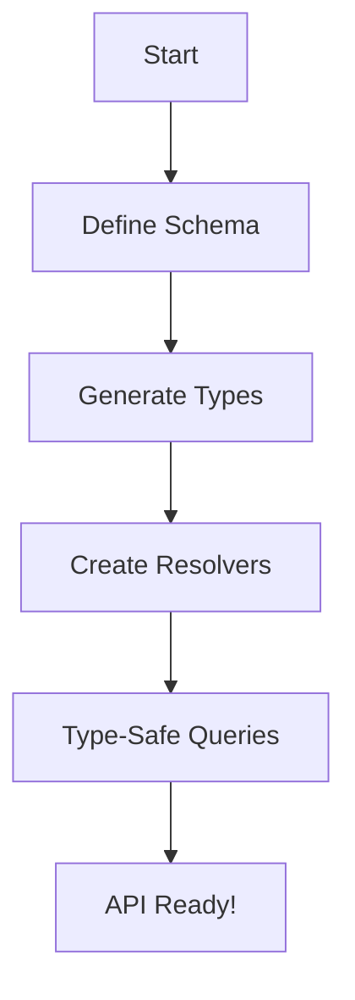
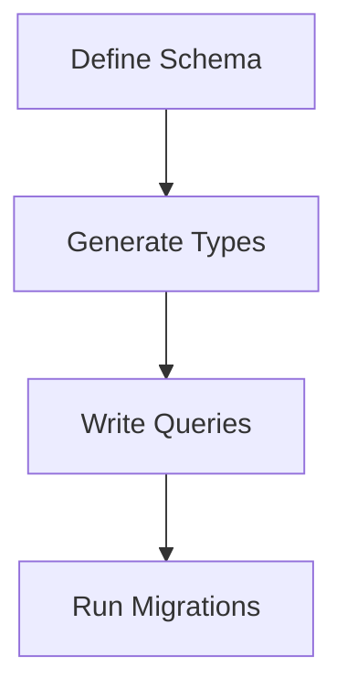
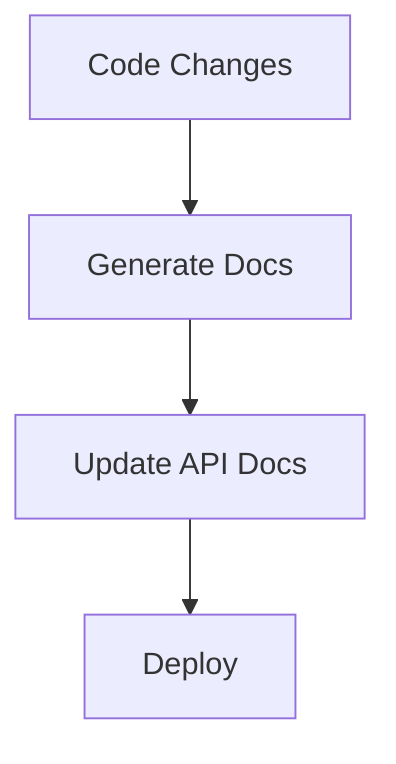

Error: API request failed with error: 401 Client Error: Unauthorized for url: https://openrouter.ai/api/v1/chat/completions

# <span style="color:#e67e22;">What we will learn in this post?</span>
<ul style='list-style-type: none; padding-left: 0;'>
<li><span style='color: #2980b9; font-size: 20px; font-weight: bold;'>👉</span> <span style='color: #2ecc71; font-size: 18px; font-weight: bold;'>TypeScript with Express.js</span></li>
<li><span style='color: #2980b9; font-size: 20px; font-weight: bold;'>👉</span> <span style='color: #2ecc71; font-size: 18px; font-weight: bold;'>NestJS Framework</span></li>
<li><span style='color: #2980b9; font-size: 20px; font-weight: bold;'>👉</span> <span style='color: #2ecc71; font-size: 18px; font-weight: bold;'>TypeScript with Fastify</span></li>
<li><span style='color: #2980b9; font-size: 20px; font-weight: bold;'>👉</span> <span style='color: #2ecc71; font-size: 18px; font-weight: bold;'>GraphQL with TypeScript</span></li>
<li><span style='color: #2980b9; font-size: 20px; font-weight: bold;'>👉</span> <span style='color: #2ecc71; font-size: 18px; font-weight: bold;'>Database Access with TypeScript</span></li>
<li><span style='color: #2980b9; font-size: 20px; font-weight: bold;'>👉</span> <span style='color: #2ecc71; font-size: 18px; font-weight: bold;'>Authentication and Authorization</span></li>
<li><span style='color: #2980b9; font-size: 20px; font-weight: bold;'>👉</span> <span style='color: #2ecc71; font-size: 18px; font-weight: bold;'>API Documentation with TypeScript</span></li>
</ul>

# <span style="color:#e67e22">Setting Up Express.js with TypeScript</span> 🚀

Welcome! Let's dive into setting up **Express.js** with **TypeScript**. This combination is powerful for building web applications. Here’s a friendly guide to get you started! 😊

## <span style="color:#2980b9">1. Initial Setup</span>

First, create a new project:

```bash
mkdir my-express-app
cd my-express-app
npm init -y
npm install express @types/express typescript ts-node
```

Now, create a `tsconfig.json` file:

```json
{
  "compilerOptions": {
    "target": "ES6",
    "module": "commonjs",
    "strict": true
  }
}
```

## <span style="color:#2980b9">2. Typing Request and Response</span>

You can type your request and response objects like this:

```typescript
import express, { Request, Response } from 'express';

const app = express();

app.get('/api', (req: Request, res: Response) => {
  res.send('Hello, TypeScript with Express!');
});
```

## <span style="color:#2980b9">3. Middleware Functions</span>

Middleware functions can be added easily:

```typescript
app.use((req: Request, res: Response, next) => {
  console.log('Request received!');
  next();
});
```

## <span style="color:#2980b9">4. Error Handling</span>

Handle errors gracefully:

```typescript
app.use((err: any, req: Request, res: Response, next: Function) => {
  res.status(500).send('Something went wrong!');
});
```

## <span style="color:#2980b9">5. Extending Express Types</span>

You can add custom properties to the request object:

```typescript
declare global {
  namespace Express {
    interface Request {
      user?: { id: string };
    }
  }
}
```

## <span style="color:#2980b9">6. Example API Endpoint</span>

Here’s a simple API endpoint:

```typescript
app.get('/user', (req: Request, res: Response) => {
  req.user = { id: '123' }; // Custom property
  res.json(req.user);
});
```

## <span style="color:#2980b9">7. Resources</span>

- [Express.js Documentation](https://expressjs.com/)
- [TypeScript Documentation](https://www.typescriptlang.org/docs/)

Happy coding! 🎉 If you have any questions, feel free to ask!

# <span style="color:#e67e22">Introduction to NestJS</span> 🌟

NestJS is a **TypeScript-first** framework for building efficient and scalable server-side applications with Node.js. It uses **decorators** and **dependency injection** to create a clean and organized code structure, making it a great choice for large-scale applications.

## <span style="color:#2980b9">Key Concepts</span> 🛠️

### <span style="color:#8e44ad">Controllers</span> 📦
Controllers handle incoming requests and return responses. They define the routes of your application.

### <span style="color:#8e44ad">Providers</span> 🛠️
Providers are classes that can be injected into controllers or other providers. They contain business logic and can be services, repositories, etc.

### <span style="color:#8e44ad">Modules</span> 📂
Modules are used to organize your application into cohesive blocks. Each module can contain controllers and providers.

### <span style="color:#8e44ad">Built-in TypeScript Support</span> 💻
NestJS is built with TypeScript, providing strong typing and modern JavaScript features, which enhances developer productivity and code quality.

## <span style="color:#2980b9">Advantages of NestJS</span> 🚀
- **Scalability**: Perfect for large applications.
- **Maintainability**: Clear structure with modules and decorators.
- **Community Support**: A growing ecosystem and resources.

### <span style="color:#8e44ad">Basic Example</span> 📝

Here’s a simple controller and service example:

```typescript
import { Controller, Get } from '@nestjs/common';
import { AppService } from './app.service';

@Controller('hello')
export class AppController {
  constructor(private readonly appService: AppService) {}

  @Get()
  getHello(): string {
    return this.appService.getHello();
  }
}

import { Injectable } from '@nestjs/common';

@Injectable()
export class AppService {
  getHello(): string {
    return 'Hello World!';
  }
}
```

For more information, check out the [NestJS Documentation](https://docs.nestjs.com). Happy coding! 🎉

# <span style="color:#e67e22">Using Fastify with TypeScript for High-Performance APIs 🚀</span>

## <span style="color:#2980b9">Getting Started</span>

Fastify is a fast and low-overhead web framework for Node.js. Using TypeScript with Fastify enhances type safety and developer experience.

### <span style="color:#8e44ad">Typing Routes with Generic Parameters</span>

You can define routes with type safety using generic parameters. Here’s a simple example:

```typescript
import fastify from 'fastify';

const app = fastify();

app.get<{ Params: { id: string } }>('/user/:id', async (request, reply) => {
  const { id } = request.params;
  return { userId: id };
});
```

### <span style="color:#8e44ad">Schema Validation with TypeBox</span>

TypeBox allows you to define schemas easily. Here’s how to use it:

```typescript
import { Type } from '@sinclair/typebox';

const UserSchema = Type.Object({
  name: Type.String(),
  age: Type.Number(),
});

app.post<{ Body: typeof UserSchema }>('/user', {
  schema: {
    body: UserSchema,
  },
}, async (request, reply) => {
  return { user: request.body };
});
```

### <span style="color:#8e44ad">Plugin Typing and Decorators</span>

Fastify supports plugins and decorators for better organization. Here’s an example:

```typescript
declare module 'fastify' {
  interface FastifyInstance {
    myCustomFunction: () => void;
  }
}

app.decorate('myCustomFunction', () => {
  console.log('Hello from custom function!');
});
```

## <span style="color:#2980b9">Resources</span>

- [Fastify Documentation](https://www.fastify.io/docs/latest/)
- [TypeBox Documentation](https://github.com/sinclairzx81/typebox)

Using Fastify with TypeScript can greatly improve your API's performance and maintainability. Happy coding! 😊

# <span style="color:#e67e22">Building GraphQL APIs with TypeScript</span> 🚀

Creating GraphQL APIs using TypeScript can be a fun and rewarding experience! With tools like **Apollo Server**, **TypeGraphQL**, or **Pothos**, you can build powerful APIs that are type-safe and easy to maintain.

## <span style="color:#2980b9">Why Use TypeScript?</span> 🤔

TypeScript adds type safety to your code, which helps catch errors early. This is especially useful when working with GraphQL, where you can define your schema and generate types automatically.

### <span style="color:#8e44ad">Generating Types with GraphQL Code Generator</span> 🔧

You can use **GraphQL Code Generator** to create TypeScript types from your GraphQL schema. This means you can have type-safe queries and mutations!

```typescript
import { Query, Resolver } from 'type-graphql';

@Resolver()
class UserResolver {
  @Query(() => User)
  async user(@Arg("id") id: string): Promise<User> {
    // Fetch user logic
  }
}
```

### <span style="color:#8e44ad">Type-Safe Queries</span> 🔍

With generated types, your queries become type-safe. For example:

```typescript
const { data } = await client.query<{ user: User }>({
  query: GET_USER,
  variables: { id: "1" },
});
```

## <span style="color:#2980b9">Resources for More Learning</span> 📚

- [Apollo Server Documentation](https://www.apollographql.com/docs/apollo-server/)
- [TypeGraphQL Documentation](https://typegraphql.com/)
- [GraphQL Code Generator](https://www.graphql-code-generator.com/)

By using these tools, you can create a robust and maintainable GraphQL API with TypeScript. Happy coding! 🎉



# <span style="color:#e67e22">Using ORMs and Query Builders with TypeScript</span> 🛠️

## <span style="color:#2980b9">Introduction to ORMs</span> 📚

Object-Relational Mappers (ORMs) like **TypeORM**, **Prisma**, and **Drizzle** help you interact with databases using TypeScript. They allow you to work with **entities** or **models** that represent your database tables.

### <span style="color:#8e44ad">Entity/Model Typing</span> 🏷️

In TypeScript, you define your models with types. For example, using Prisma:

```typescript
model User {
  id    Int     @id @default(autoincrement())
  name  String
  email String  @unique
}
```

### <span style="color:#8e44ad">Type-Safe Queries</span> 🔍

With Prisma, you get type-safe queries. This means TypeScript checks your queries for errors. For example:

```typescript
const user = await prisma.user.findUnique({
  where: { email: "example@example.com" },
});
```

### <span style="color:#8e44ad">Query Result Types</span> 📊

The result types are inferred from your models. If you query a `User`, TypeScript knows the shape of the returned data.

## <span style="color:#2980b9">Migrations</span> 🔄

Migrations help you manage database changes. With Prisma, you can generate migrations easily:

```bash
npx prisma migrate dev --name init
```

## <span style="color:#2980b9">Prisma's Type Generation</span> ⚙️

Prisma generates TypeScript types based on your schema. This ensures your code is always in sync with your database structure.

### <span style="color:#8e44ad">Example Flowchart</span>



## <span style="color:#2980b9">Resources</span> 🌐

- [TypeORM Documentation](https://typeorm.io/)
- [Prisma Documentation](https://www.prisma.io/docs/)
- [Drizzle Documentation](https://orm.drizzle.team/)

Using ORMs with TypeScript makes database interactions smooth and type-safe! Happy coding! 🎉

# <span style="color:#e67e22">Implementing Type-Safe Authentication in TypeScript</span> 🔒

## <span style="color:#2980b9">Understanding JWT and Passport.js</span>

When building a backend with TypeScript, **authentication** is crucial. Using **JWT (JSON Web Tokens)** and **Passport.js** can help you create a secure and type-safe system. Here’s how to get started:

### <span style="color:#8e44ad">Typing User Objects</span>

Define your user object with TypeScript interfaces:

```typescript
interface User {
  id: string;
  username: string;
  role: 'admin' | 'user';
}
```

### <span style="color:#8e44ad">Authentication Middleware</span>

Create middleware to handle authentication:

```typescript
import { Request, Response, NextFunction } from 'express';
import jwt from 'jsonwebtoken';

const authenticate = (req: Request, res: Response, next: NextFunction) => {
  const token = req.headers['authorization'];
  if (!token) return res.sendStatus(403);
  
  jwt.verify(token, 'your_secret_key', (err, user) => {
    if (err) return res.sendStatus(403);
    req.user = user; // Type-safe user
    next();
  });
};
```

### <span style="color:#8e44ad">Role-Based Access Control</span>

You can restrict access based on user roles:

```typescript
const authorize = (roles: string[]) => {
  return (req: Request, res: Response, next: NextFunction) => {
    if (!roles.includes(req.user.role)) return res.sendStatus(403);
    next();
  };
};
```

## <span style="color:#2980b9">Session Types</span>

Define session types to keep track of user sessions:

```typescript
interface Session {
  userId: string;
  expires: Date;
}
```

### <span style="color:#8e44ad">Resources for More Info</span>

- [TypeScript Documentation](https://www.typescriptlang.org/docs/)
- [JWT Guide](https://jwt.io/introduction/)
- [Passport.js Documentation](http://www.passportjs.org/docs/)

By following these steps, you can create a **type-safe authentication system** that is both secure and easy to manage! Happy coding! 😊

# <span style="color:#e67e22">Generating API Documentation from TypeScript Types</span> 🚀

## <span style="color:#2980b9">Using Tools Like Swagger/OpenAPI</span>

To create API documentation from TypeScript, you can use **Swagger/OpenAPI**. This helps you define your API structure clearly.

### <span style="color:#8e44ad">Step 1: Install Dependencies</span>

```bash
npm install swagger-jsdoc swagger-ui-express
```

### <span style="color:#8e44ad">Step 2: Define Your API with Decorators</span>

You can use decorators to add metadata to your API:

```typescript
import { ApiProperty } from '@nestjs/swagger';

class User {
  @ApiProperty({ description: 'The unique identifier of the user' })
  id: number;

  @ApiProperty({ description: 'The name of the user' })
  name: string;
}
```

### <span style="color:#8e44ad">Step 3: Generate Documentation Automatically</span>

Use **TypeDoc** or **TSDoc** to generate documentation from your TypeScript types:

```bash
npx typedoc --out docs src
```

## <span style="color:#2980b9">Keeping Docs in Sync with Code</span>

- **Automate Documentation**: Use CI/CD tools to regenerate docs on every commit.
- **Review Changes**: Regularly check for discrepancies between code and documentation.

### <span style="color:#8e44ad">Resources</span>

- [Swagger Documentation](https://swagger.io/docs/)
- [TypeDoc Documentation](https://typedoc.org/)
- [TSDoc Documentation](https://tsdoc.org/)



By following these steps, you can create clear and up-to-date API documentation that reflects your TypeScript code! Happy coding! 😊

